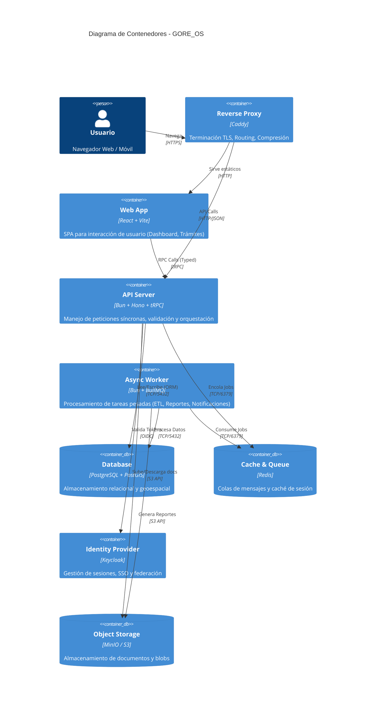

# C2 - Contenedores de GORE_OS

## Abstract
La arquitectura de GORE_OS se descompone en contenedores dockerizados que separan responsabilidades de interfaz, lógica de negocio, persistencia y procesamiento asíncrono.

## Diagrama de Contenedores (Nivel 2)

## Definición de Contenedores

| Contenedor     | Tecnología            | Responsabilidad Principal                                     | Patrón de Diseño    |
| -------------- | --------------------- | ------------------------------------------------------------- | ------------------- |
| **Web App**    | React, Vite, Tailwind | Interfaz de usuario reactiva, gestión de estado local         | Component-Based UI  |
| **API Server** | Bun, Hono, tRPC       | Punto de entrada, validación (Zod), orquestación de servicios | RPC, Layered Arch   |
| **Worker**     | Bun, Effect-TS        | Procesos background, integraciones lentas, ETL                | Job Queue, Pipeline |
| **Database**   | PostgreSQL 16         | Fuente de verdad, integridad referencial, queries espaciales  | Relacional, ACID    |
| **IDP**        | Keycloak              | Autenticación, autorización, gestión de usuarios              | OAuth2 / OIDC       |

## Decisiones Clave

1.  **Bun como Runtime Unificado**: Utilizamos Bun tanto para el API como para los Workers para maximizar rendimiento y simplificar el toolchain (sin necesidad de ts-node o compilación compleja).
2.  **tRPC para Comunicación**: Eliminamos la necesidad de documentar APIs REST/GraphQL internamente al usar tRPC, garantizando tipado end-to-end entre Web y API.
3.  **PostGIS Nativo**: El componente territorial es *core* para el GORE, por lo que PostGIS está integrado en la DB principal y no como servicio separado.
