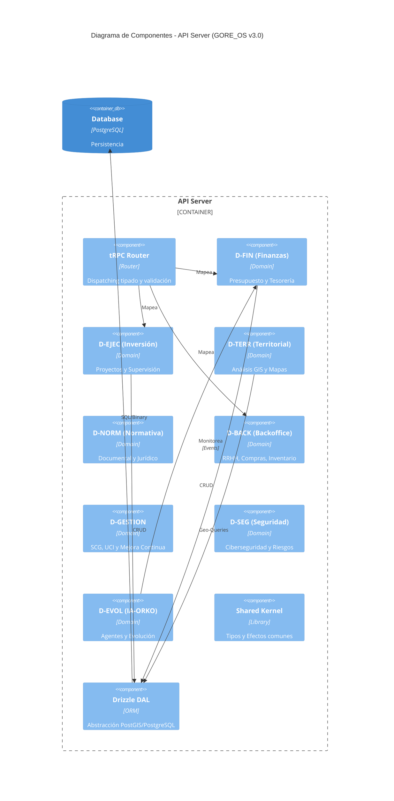

# C3 - Componentes de GORE_OS

## Abstract

Dentro del contenedor **API Server**, la aplicación se estructura en componentes modulares que reflejan los dominios de la organización. Estos componentes son la realización del Funtor $\mathcal{F}: \mathcal{G}_{Req} \to \mathcal{G}_{Impl}$.

## Diagrama de Componentes (Nivel 3 - API Server)

El servidor de API se organiza en **Dominios de Bounded Context**, cada uno encapsulando su propia lógica, estados y servicios.

## Catálogo de Dominios (Componentes de Backend)

### 1. D-FIN (Finanzas y Presupuesto)

- **Responsabilidad**: Gestión de ingresos/gastos, conciliación bancaria y devengo.
- **Relaciones**: Centro del flujo monetario; alimentado por D-EJEC y D-BACK.
- **Micro-módulos**: `rendiciones`, `presupuesto_regional`, `alertas_360`.

### 2. D-EJEC (Ejecución de Inversiones)

- **Responsabilidad**: Supervisión de obras, convenios municipales y PMO Regional.
- **Propósito**: Garantizar que la inversión pública se transforme en infraestructura real.
- **Micro-módulos**: `supervision_obras`, `gestion_convenios`, `pmo_regional`.

### 3. D-TERR (Territorial y GIS)

- **Responsabilidad**: El "Gemelo Digital" de la región. Capas de datos, análisis de impacto espacial.
- **Propósito**: Visualizar la inversión en el mapa y planificar el ordenamiento territorial (PROT).
- **Micro-módulos**: `ide_regional`, `analitica_territorial`, `asistencia_dom`.

### 4. D-NORM (Normativa y Documental)

- **Responsabilidad**: Gestión de Actos Administrativos, Expedientes Electrónicos y Firma.
- **Cumplimiento**: Implementación de la Ley 21.180 (Cero Papel).
- **Micro-módulos**: `expediente_electronico`, `actos_administrativos`, `procedimientos`.

### 5. D-BACK (Gestión de Backoffice)

- **Responsabilidad**: Administración interna: RRHH, Abastecimiento, Activos Fijos y Flota.
- **Propósito**: Operación logística y soporte del GORE.

### 6. D-EVOL (Evolución e IA - ORKO)

- **Responsabilidad**: Orquestación de agentes IA, remediación de deuda técnica y base de conocimiento.
- **Ficción Operativa**: El componente que permite al sistema "aprender" y evolucionar.

### 7. Dominios de Calidad (D-GESTION y D-SEG)

- **D-GESTION**: Control interno y monitoreo de metas institucionales.
- **D-SEG**: Evidencias digitales, CIES Ñuble y cumplimiento NIST.

### 8. Shared Kernel

- **Responsabilidad**: Definiciones transversales que garantizan la consistencia del sistema.
- **Contenido**:
  - Tipos base (Result, Option, Effect)
  - Manejo estructurado de errores (Schema-based)
  - Loggers y telemetría (Pino + OpenTelemetry)

## Principios de Diseño de Componentes

1. **Alta Cohesión**: Cada componente maneja un dominio acotado (Bounded Context).
2. **Acoplamiento Explícito**: Las dependencias entre módulos deben ser explícitas (idealmente a través de interfaces o eventos), prohibiendo imports circulares directos.
3. **Stateless**: Los componentes no guardan estado en memoria; delegan todo estado a la DB o Redis.
