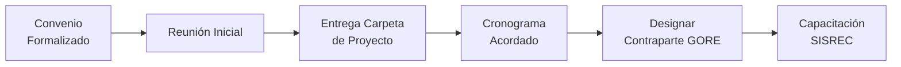
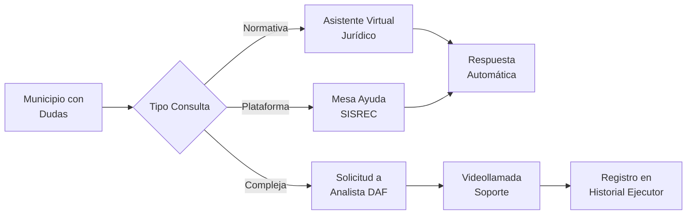

# D-FIN Subdominio: Gestión de Ejecutores

> Parte de: [D-FIN](../domain_d-fin.md) | [GORE_OS Blueprint](../../vision_general.md)  
> Función: Administrar relaciones y capacidades de entidades ejecutoras

---

## Calificación de Ejecutores

| Dimensión             | Peso | Indicadores                         |
| --------------------- | ---- | ----------------------------------- |
| Historial rendiciones | 40%  | % a tiempo, días mora promedio      |
| Capacidad técnica     | 25%  | Equipo, metodologías, experiencia   |
| Ejecución proyectos   | 25%  | % avance vs plan, sobrecostos       |
| Gobernanza            | 10%  | Transparencia, controles, auditoría |

### Niveles

| Nivel | Rango | Descripción |
| ----- | ----- | ----------- |
| **A** | ≥85   | Confiable   |
| **B** | 70-84 | Estándar    |
| **C** | 55-69 | Observación |
| **D** | <55   | Crítico     |

---

## Mesa de Ayuda Financiera

| Atributo  | Descripción                                          |
| --------- | ---------------------------------------------------- |
| Propósito | Prevenir rechazos mediante capacitación y asistencia |
| Canales   | Mesa de Solicitudes, Asistente Virtual, Videollamada |

### Funcionalidades
- FAQ dinámica de errores frecuentes
- Simulador de rendiciones (entorno de pruebas)
- Agendamiento con analista contable
- Cursos certificados en Res. 30 CGR

---

## P4-bis: Inducción de Ejecutor

**Checklist de Inducción:**
- [ ] Expectativas y roles claros
- [ ] Convenio, TDR, cronograma base entregados
- [ ] Hitos, plazos, EP programados
- [ ] Contraparte GORE asignado
- [ ] Acceso SISREC configurado

---

## P8: Asistencia Financiera

---

## Entidades de Datos

| Entidad                | Atributos Clave                                                             |
| ---------------------- | --------------------------------------------------------------------------- |
| `CalificacionEjecutor` | id, actor_id, puntaje_total, nivel (A/B/C/D)                                |
| `RelacionEjecutor`     | id, actor_id, estado_relacion, nivel_compromiso, fecha_ultimo_contacto      |
| `InteraccionEjecutor`  | id, relacion_id, tipo (CONSULTA/CAPACITACION/ALERTA), fecha, canal, resumen |

---

## KPIs

| Indicador                   | Fórmula                        | Meta |
| --------------------------- | ------------------------------ | ---- |
| Calificación A/B            | Ejecutores A+B / Total activos | ≥70% |
| % Inducciones completadas   | Con inducción / Total nuevos   | 100% |
| Tiempo respuesta mesa ayuda | Promedio horas                 | ≤24h |

---

## Roles Asociados (SSOT: inventario_roles_v8.yml)

| Role Key           | Título                    | Responsabilidades          |
| ------------------ | ------------------------- | -------------------------- |
| entidad_ejecutora  | Entidad Ejecutora         | Recibe y ejecuta fondos    |
| ejecutor_ppr       | Ejecutor PPR              | Ejecuta programas propios  |
| org_beneficiaria   | Organización Beneficiaria | Adjudicataria de fondos    |
| contratista        | Contratista / Proveedor   | Provee bienes/servicios    |
| formulador_externo | Formulador Externo        | Diseña y postula proyectos |

---

## Historias de Usuario (SSOT: historias_usuarios_v2.yml)

### Historias Atómicas (M7: Gestión Ejecutores)

| ID                 | Role Key          | Quiero                          | Prioridad |
| ------------------ | ----------------- | ------------------------------- | --------- |
| US-EJEC-001-01     | entidad_ejecutora | acceso a sistema de rendiciones | P0        |
| US-EJEC-PPR-001-01 | ejecutor_ppr      | portal de postulación           | P1        |

---

## Referencias

- **Integración D-GOB:** [domain_d-gob.md](../domain_d-gob.md) (Registro de Actores)

---

*Subdominio parte de D-FIN | GORE_OS Blueprint Integral v5.5*  
*Actualizado: 2025-12-19 | SSOT: inventario_roles_v8.yml, historias_usuarios_v2.yml*

