# D-BACK: Dominio de Gestión de Recursos Institucionales

> Parte de: [GORE_OS Vision General](../vision_general.md)  
> Capa: Habilitante (Soporte Operativo)  
> Función GORE: ADMINISTRAR  

---

## Glosario D-BACK

| Término           | Definición                                                                   |
| ----------------- | ---------------------------------------------------------------------------- |
| EUS               | Escala Única de Sueldos. Tabla de grados y asignaciones del sector público   |
| PAC-Compras       | Plan Anual de Compras. Programación de adquisiciones en Mercado Público      |
| PAC-Capacitación  | Plan Anual de Capacitación. Programa de formación funcionaria                |
| DNC               | Detección de Necesidades de Capacitación. Insumo para PAC-Capacitación       |
| CDP               | Certificado de Disponibilidad Presupuestaria. Ver D-FIN                      |
| OC                | Orden de Compra. Documento que formaliza adquisición                         |
| CM                | Convenio Marco. Mecanismo de compra pre-negociado en ChileCompra             |
| PPP               | Precio Promedio Ponderado. Método de valorización de inventarios             |
| FIFO              | First In, First Out. Método de valorización                                  |
| FEFO              | First Expired, First Out. Para productos perecibles                          |
| SIAPER            | Sistema de Información y Control del Personal de la Administración (CGR)     |
| PREVIRED          | Plataforma de pago de cotizaciones previsionales                             |
| TEF               | Transferencia Electrónica de Fondos. Pago bancario electrónico               |
| SIC               | Saldo Inicial de Caja. Recursos de arrastre del ejercicio anterior           |
| Deuda Flotante    | Obligaciones devengadas no pagadas al cierre del ejercicio (Ítem 34.07)      |
| Conciliación      | Proceso de cuadrar movimientos bancarios (cartola) con registros SIGFE       |
| Devengado         | Obligación contable exigible. Momento en que se reconoce el gasto            |
| Compromiso        | Obligación presupuestaria contraída formalmente (OC, contrato)               |
| Ítem 34.07        | Asignación presupuestaria para pago de deuda flotante del ejercicio anterior |
| Cartola Bancaria  | Extracto de movimientos de cuenta corriente emitido por el banco             |
| Partida Pendiente | Diferencia temporal entre registro SIGFE y movimiento bancario               |
| UCR               | Unidad Control de Rendiciones. Encargada de auditar rendiciones de terceros  |
| Compra Ágil       | Modalidad de compra competitiva para montos menores o iguales a 100 UTM      |
| Fondos Globales   | Fondos en efectivo o cta. corriente para gastos menores (caja chica) ≤3 UTM  |

## Entidades de Datos

| Entidad             | Atributos Clave                                                   | Relaciones         |
| :------------------ | :---------------------------------------------------------------- | :----------------- |
| **`ActivoFijo`**    | `codigo`, `clase_activo`, `vida_util`, `valor_libro`, `ubicacion` | → MovimientoActivo |
| `MovimientoActivo`  | `tipo` (Alta/Baja/Traslado), `origen`, `destino`, `acta_url`      | → ActivoFijo       |
| `Vehiculo`          | `patente`, `marca`, `modelo`, `kilometraje`, `estado`             | → ActivoFijo       |
| `ContratoHonorario` | `rut_prestador`, `monto_bruto`, `fecha_inicio`, `fecha_termino`   | → InformeHonorario |
| `Pago`              | `id_pago`, `beneficiario`, `monto_liquido`, `medio_pago`          | → Devengo          |
| `Devengo`           | `id_devengo`, `compromiso_ref`, `obligacion_exigible`             | → Compromiso       |

> [!TIP]
> **Integración:** D-BACK recibe `OrdenesCompra` y `EstadosPago` de D-FIN para procesar `Compromisos` y `Devengos`.

---

## Propósito

Gestionar el ciclo de vida de todos los recursos institucionales del GORE: personas, bienes, servicios, infraestructura y presupuesto operativo, asegurando eficiencia, transparencia y cumplimiento normativo.

> Visión: Los recursos institucionales —humanos, materiales, financieros y tecnológicos— se gestionan como un sistema integrado que maximiza la eficiencia operativa y minimiza los riesgos de incumplimiento.

---

## Cinco Pilares del Dominio

| Pilar            | Componentes                                          |
| ---------------- | ---------------------------------------------------- |
| Personas         | Ciclo de vida funcionario, remuneraciones, bienestar |
| Abastecimiento   | Compras, contratos, proveedores                      |
| Patrimonio       | Inventarios, activo fijo, bodegas                    |
| Servicios        | Flota vehicular, mantención, infraestructura         |
| Contabilidad Op. | Caja, conciliación bancaria, contabilidad, cierre    |

---

## Módulos

### 1. Gestión de Personas (RRHH)

Ciclo de Vida:

```text
INGRESO → INDUCCIÓN → DESARROLLO → EVALUACIÓN → EGRESO
```

Subsistemas:

- Reclutamiento y selección
- Contratación y nombramiento
- Remuneraciones (EUS)
- Tiempo y asistencia
- Capacitación y desarrollo
- Bienestar funcionario
- Calificaciones

### 2. Abastecimiento y Compras

Cadena de Adquisición:

```text
PAC-Compras → REQUERIMIENTO → CDP → LICITACIÓN/CM → OC → RECEPCIÓN → PAGO
```

> Nota: CDP (Certificado de Disponibilidad Presupuestaria) se gestiona en [D-FIN Presupuesto](d-fin/sub_dfin_presupuesto.md#cadena-presupuestaria).

Mecanismos:

| Mecanismo          | Umbral        | Normativa / Plataforma        |
| ------------------ | ------------- | ----------------------------- |
| Fondos Globales    | < 3 UTM       | Res. Exenta / Caja Chica      |
| Compra Ágil        | ≤ 100 UTM     | Decreto 661 / Mercado Público |
| Convenio Marco     | Sin límite    | Mercado Público               |
| Licitación Pública | > 1.000 UTM   | Ley 19.886 / Mercado Público  |
| Licitación Privada | 100-1.000 UTM | Mercado Público               |
| Compra Directa     | < 100 UTM     | Mercado Público               |

### 3. Inventarios y Bodega

Métodos de Valorización:

| Método | Uso                                   |
| ------ | ------------------------------------- |
| PPP    | Precio Promedio Ponderado (default)   |
| FIFO   | First In, First Out                   |
| FEFO   | First Expired, First Out (perecibles) |

### 4. Activo Fijo

Criterio de Capitalización: Valor ≥ 3 UTM y vida útil > 1 año

Ciclo:

```text
ALTA → VALORIZACIÓN → DEPRECIACIÓN → MOVIMIENTOS → BAJA
```

### 5. Flota Vehicular

Restricciones D.L. 799:

- Uso solo en horario laboral
- Prohibido uso particular
- Autorización para fines de semana

### 6. Bienestar Funcionario

Prestaciones:

- Bonificaciones médicas
- Préstamos
- Subsidios por eventos
- Convenios con terceros

### 7. Contabilidad Operativa

Procesos:

| Proceso               | Descripción                                           |
| --------------------- | ----------------------------------------------------- |
| Gestión de Caja       | Saldos bancarios, programación de pagos, TEF          |
| Conciliación Bancaria | Cartolas vs SIGFE, partidas pendientes                |
| Contabilización       | Ingresos propios, gastos operativos, devengos         |
| Cierre Anual          | Corte compromisos, estados financieros, SIC           |
| Deuda Flotante        | Identificación, certificado, incorporación Ítem 34.07 |

Ciclo:

```text
REGISTRO → CONCILIACIÓN → CONTABILIZACIÓN → CIERRE → DEUDA FLOTANTE
```

> **⚠️ Triángulo de Integración Presupuestaria**:  \n> - **D-FIN** define distribución estratégica (ARI, CORE) y monitorea % ejecución como KPI de portafolio  \n> - **D-EJEC** valida técnicamente Estados de Pago (EP) y envía a D-BACK para procesamiento  \n> - **D-BACK** ejecuta la cadena contable: CDP → Compromiso → Devengo → Pago en SIGFE  \n>   \n> Este módulo gestiona las operaciones financieras internas del GORE como organización.

---

## 📋 Procesos BPMN

### Índice de Procesos

| Dominio      | ID    | Nombre                               | Líneas  |
| ------------ | ----- | ------------------------------------ | ------- |
| Compras      | D04   | Compras Públicas y Contrataciones    | 200-278 |
| Inventarios  | D05   | Gestión de Inventarios y Activo Fijo | 281-328 |
| Flota        | D06   | Gestión de Flota Vehicular           | 332-381 |
| Personas     | D07   | Gestión de Personas                  | 385-453 |
| Bienestar    | D07.B | Bienestar Funcionario                | 457-519 |
| Contabilidad | D08   | Contabilidad Operativa               | 523-629 |

### Mapa General Integrado

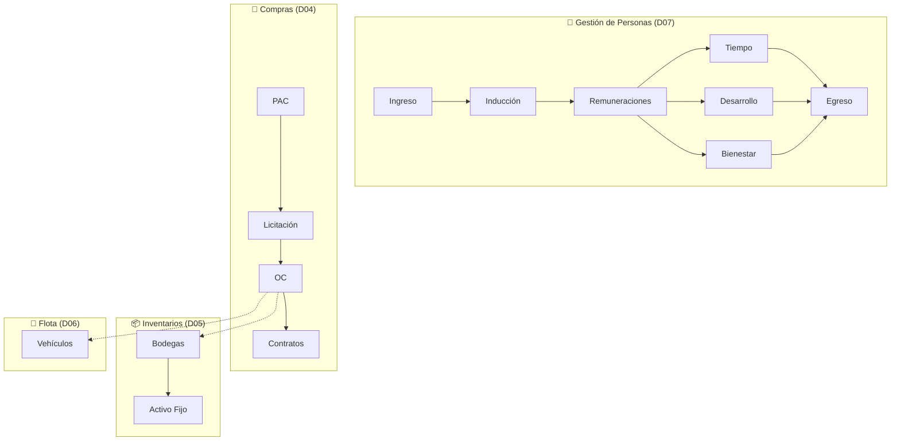

---

### D04: Compras Públicas y Contrataciones

| Campo      | Valor                    |
| ---------- | ------------------------ |
| ID         | `DOM-COMPRAS`            |
| Criticidad | 🟠 Alta                   |
| Dueño      | Unidad de Abastecimiento |

#### P1: Plan Anual de Compras (PAC)

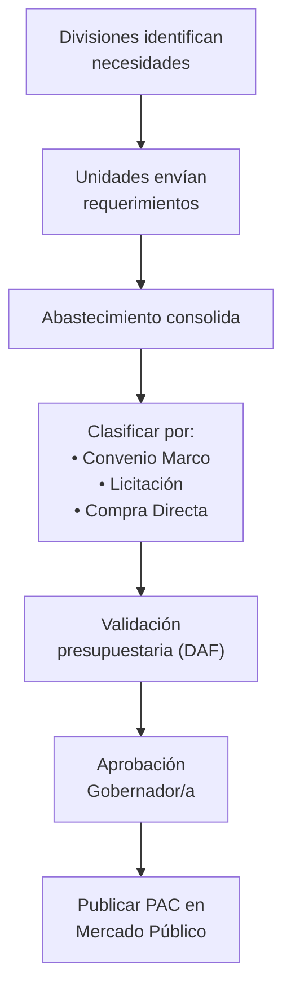

#### P2: Licitación Pública

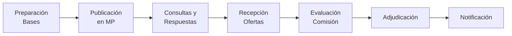

#### Mecanismos de Compra

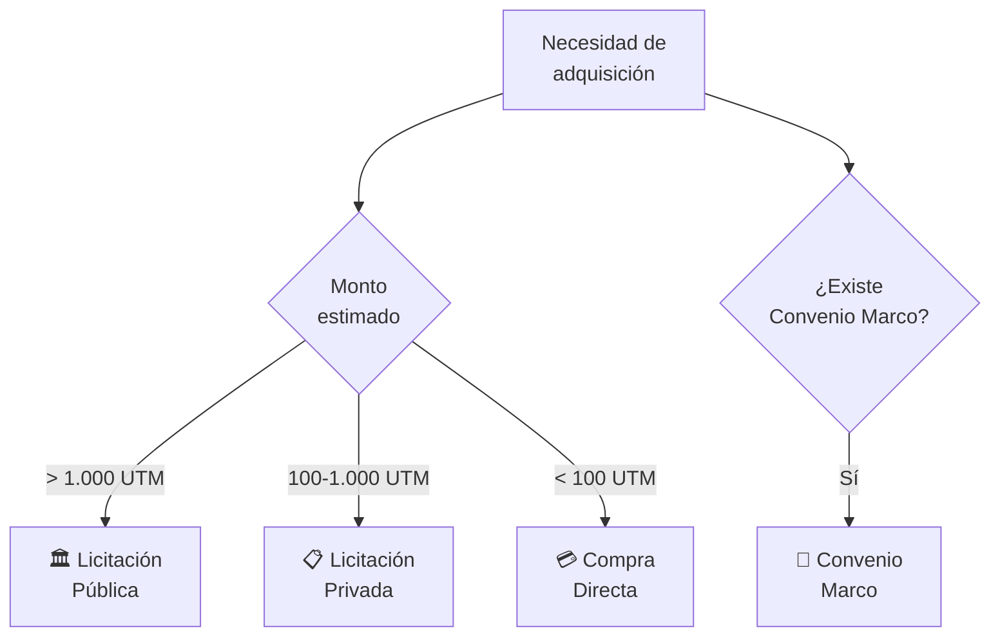

#### Umbrales y Modalidades (Decreto N° 661/2024)

| Rango (UTM)    | Modalidad                   | Requisitos Mínimos                      |
| -------------- | --------------------------- | --------------------------------------- |
| < 3 UTM        | Fondos Globales Menores     | Sin OC obligatoria, boleta directa      |
| 3 - 100 UTM    | Compra Ágil                 | Mínimo 3 cotizaciones en plataforma     |
| 100 - 1000 UTM | Convenio Marco / Licitación | Bases administrativas, CDP previo       |
| > 1000 UTM     | Licitación Pública          | Comisión evaluadora, Resolución fundada |
| > 5000 UTM     | Licitación Pública          | Boleta de garantía de seriedad (≤3%)    |


#### P3: Órdenes de Compra

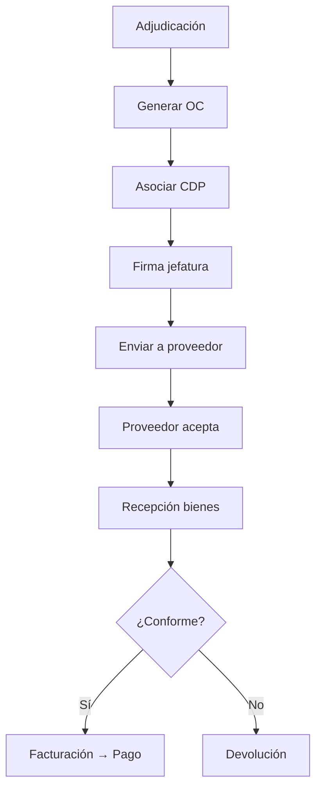

#### P4: Gestión de Contratos

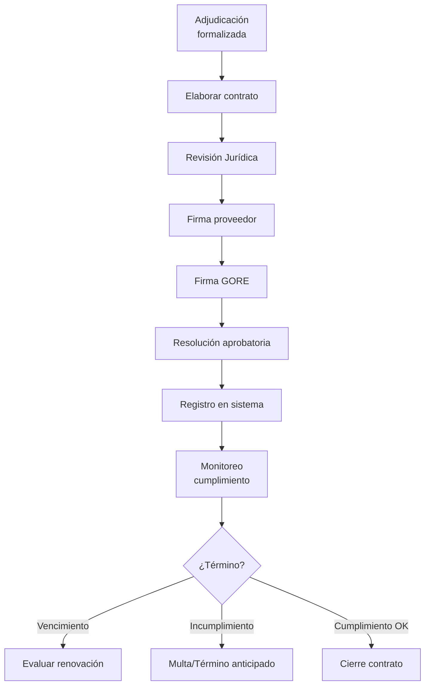

---

### D05: Gestión de Inventarios y Activo Fijo

| Campo      | Valor                |
| ---------- | -------------------- |
| ID         | `DOM-INVENTARIOS-AF` |
| Criticidad | 🟡 Media              |
| Dueño      | DAF                  |

#### Recepción de Bienes

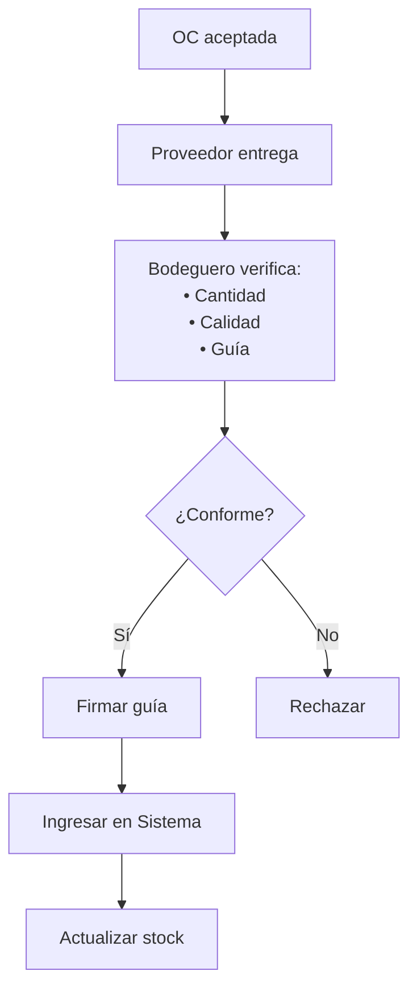

#### Alta de Activo Fijo

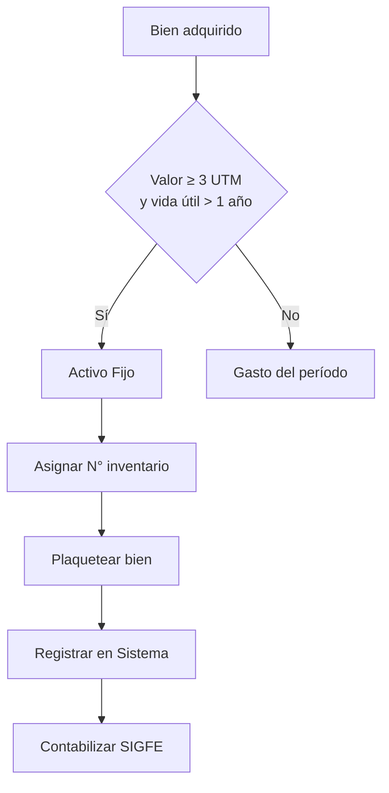

#### Baja de Bienes

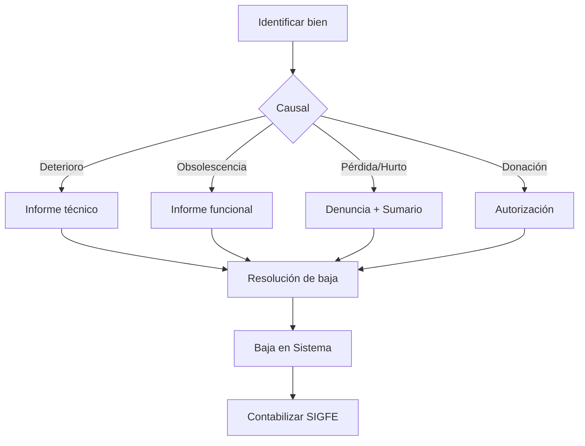

---

### D06: Gestión de Flota Vehicular

| Campo      | Valor                    |
| ---------- | ------------------------ |
| ID         | `DOM-FLOTA`              |
| Criticidad | 🟡 Media                  |
| Dueño      | Jefe Servicios Generales |

#### Solicitud y Asignación

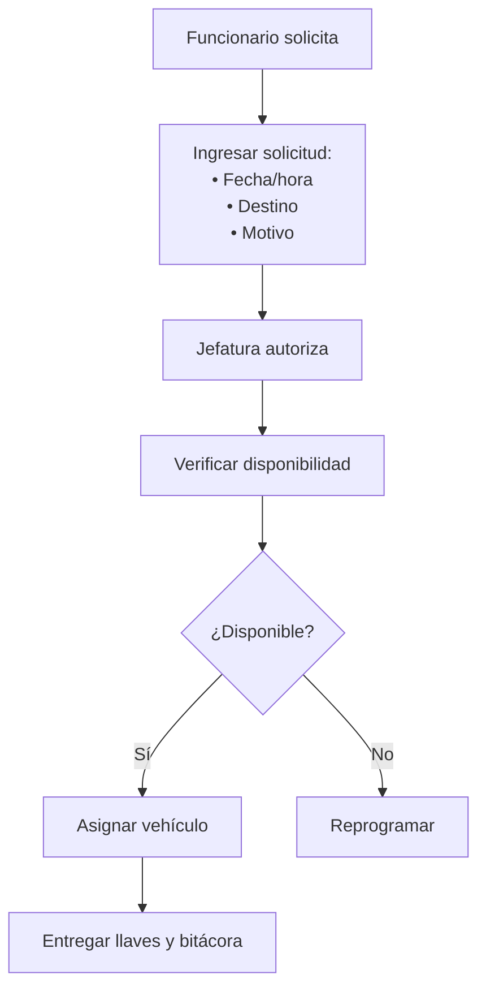

#### Mantención Vehicular

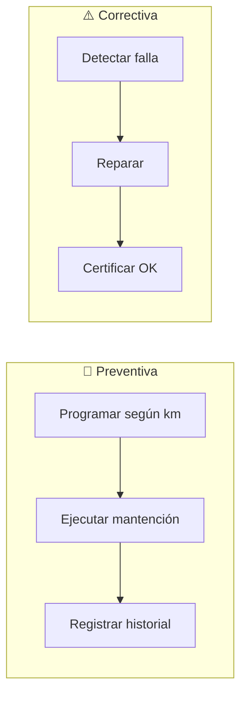

#### Programa de Mantención

| Tipo       | Frecuencia | Acciones                  |
| ---------- | ---------- | ------------------------- |
| Básica     | 5.000 km   | Cambio aceite, filtros    |
| Intermedia | 15.000 km  | Frenos, neumáticos        |
| Mayor      | 30.000 km  | Revisión completa         |
| Documentos | Anual      | Revisión técnica, permiso |

---

### D07: Gestión de Personas

| Campo      | Valor                       |
| ---------- | --------------------------- |
| ID         | `DOM-RRHH`                  |
| Criticidad | 🟠 Alta                      |
| Dueño      | Área de Gestión de Personas |

#### P1: Ingreso y Contratación

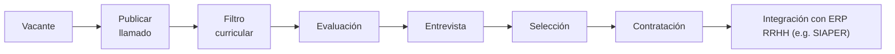

#### Tipos de Contrato

| Tipo       | Descripción                        |
| ---------- | ---------------------------------- |
| Planta     | Cargo titular, carrera funcionaria |
| Contrata   | Transitorio, renovación anual      |
| Honorarios | Servicios específicos              |

#### P2: Remuneraciones

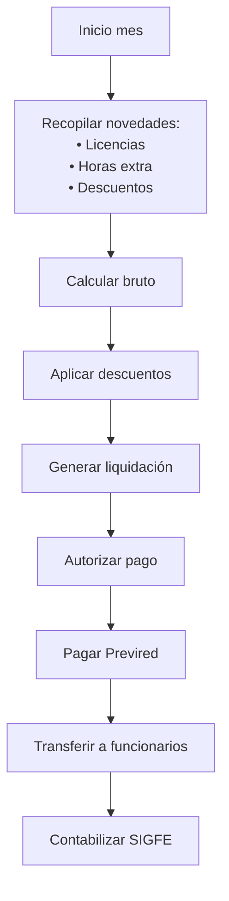

#### Ciclo Mensual de Remuneraciones

| Periodo | Actividad                                                    | Responsable               |
| ------- | ------------------------------------------------------------ | ------------------------- |
| 01 - 14 | Recopilación de novedades (Licencias, Permisos, Horas Extra) | Profesional GDP           |
| 15 - 17 | Cálculo, liquidación y registro en sistema                   | Gestora de Remuneraciones |
| 18      | Visación técnica, jurídica y de finanzas                     | GDP / Jurídica / Finanzas |
| 19      | Pago de Remuneraciones (Fecha legal)                         | Tesorería                 |
| 19 - 25 | Procesamiento de Reliquidaciones y Planilla Suplementaria    | Gestora de Remuneraciones |
| 20 - 30 | Pago de Cotizaciones Previsionales (PREVIRED)                | Tesorería                 |

> **Tope Institucional Horas Extraordinarias** (PR-DAF-0005):
> - Diurnas: Máximo 20 horas mensuales.
> - Nocturnas/Festivas: Máximo 16 horas mensuales.
> - *Excepción: Conductores institucionales y situaciones de emergencia.*

#### P3: Capacitación y Calificaciones

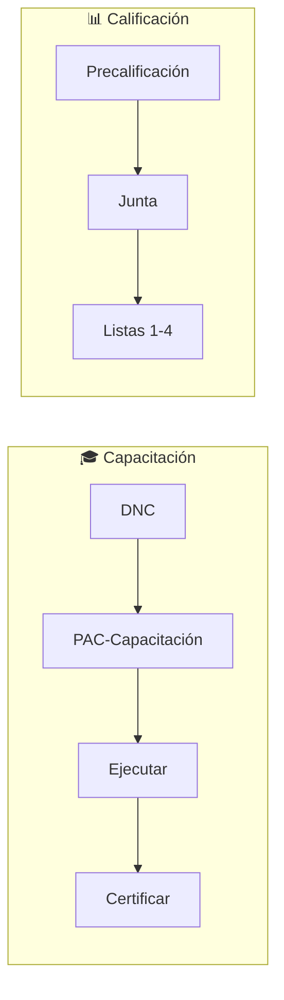

#### P4: Egreso

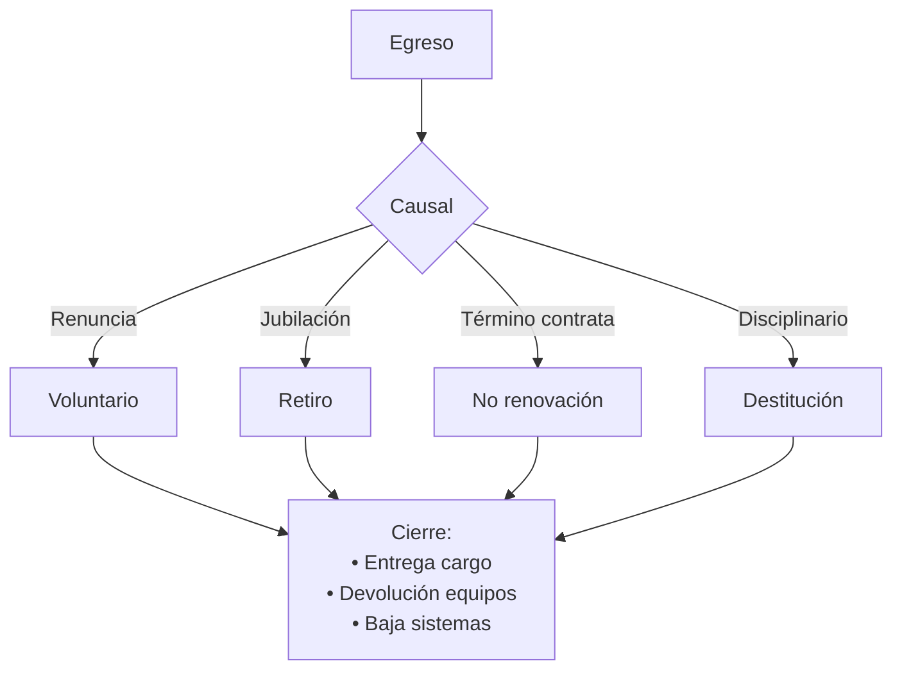

#### P5: Control de Asistencia (Absorción SIGPER)

> **Origen:** Módulo Control Asistencia SIGPER. Permite integración con reloj biométrico y gestión de teletrabajo.

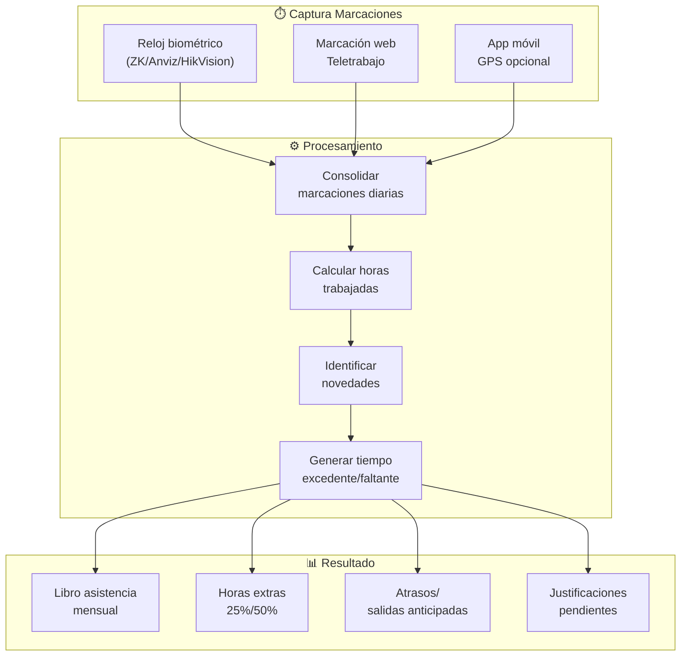

#### P6: Viáticos Nacionales y Extranjeros (Absorción SIGPER)

> **Origen:** Módulo Viáticos SIGPER. Cumple DFL 262 para viáticos nacionales.

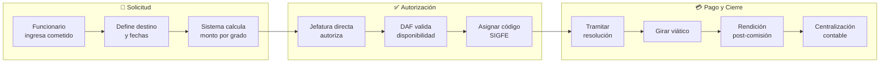

#### Distribución de Viáticos (DFL 262)

| Porcentaje | Condición                                                |
| ---------- | -------------------------------------------------------- |
| 100%       | Pernoctar fuera + alimentación propia                    |
| 60%        | Sin pernoctar, pero jornada completa fuera               |
| 50%        | Conglomerado urbano (mismo día, sin pernocte)            |
| 40%        | Pernoctar en alojamiento institucional                   |
| 20%        | Viaje mismo día, media jornada                           |
| 10%        | Viaje breve sin necesidad de alimentación extraordinaria |

#### P7: Desarrollo Organizacional (Absorción SIGPER)

> **Origen:** Módulo Desarrollo Organizacional SIGPER. Gestión de competencias y evaluación 360°.

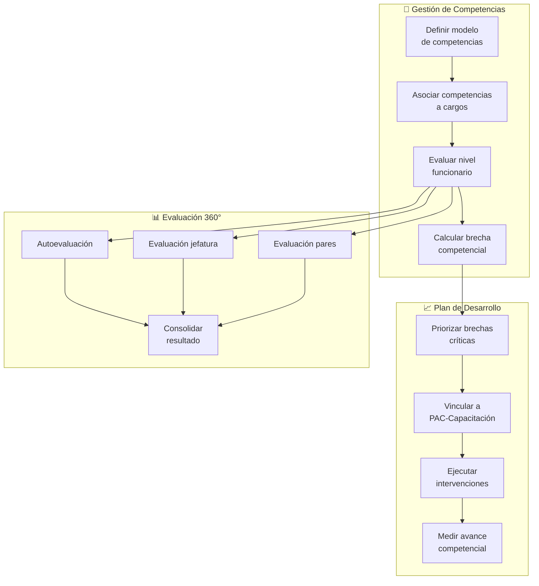

---

### D07.B: Bienestar Funcionario

| Campo      | Valor                 |
| ---------- | --------------------- |
| ID         | `DOM-BIENESTAR`       |
| Criticidad | 🟡 Media               |
| Dueño      | Servicio de Bienestar |

#### Afiliación y Grupo Familiar

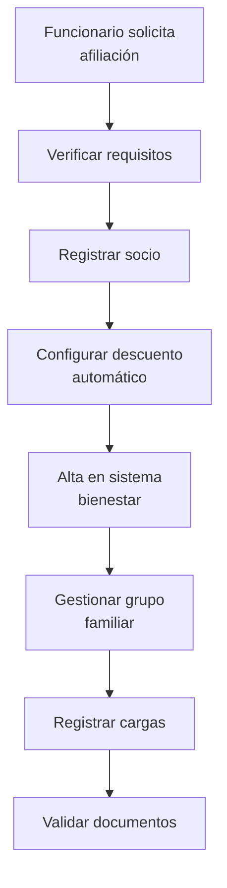

#### Prestaciones y Bonificaciones

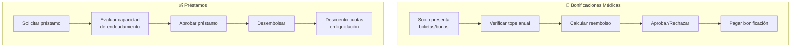

#### Seguridad y Salud Ocupacional

```mermaid
flowchart LR
    A["Accidente<br/>laboral"] --> B["DIAT"]
    B --> C["Derivar a<br/>Mutual"]
    C --> D["Seguimiento<br/>tratamiento"]
    D --> E["Reintegro"]
    
    F["CPHS"] --> G["Investigación"]
    G --> H["Medidas<br/>preventivas"]
```

---

### D08: Contabilidad Operativa

| Campo      | Valor           |
| ---------- | --------------- |
| ID         | `DOM-CONTAB-OP` |
| Criticidad | 🔴 Crítica       |
| Dueño      | DAF             |

#### Mapa de Procesos D08

```mermaid
flowchart TB
    subgraph TESORO["💰 Tesorería (D08)"]
        T1["P1: Gestión de Caja"]
        T2["P2: Conciliación Bancaria"]
        T3["P3: Contabilización Operativa"]
        T4["P4: Cierre Contable Anual"]
        T5["P5: Deuda Flotante"]
    end
    
    T1 --> T2
    T2 --> T3
    T3 --> T4
    T4 --> T5
```

#### P1: Gestión de Caja Institucional

```mermaid
flowchart TD
    A["Inicio día hábil"] --> B["Revisar saldos bancarios"]
    B --> C{"¿Fondos suficientes?"}
    C -->|"Sí"| D["Programar pagos del día"]
    C -->|"No"| E["Gestionar aporte fiscal<br/>con DIPRES"]
    D --> F["Ejecutar pagos (TEF)"]
    F --> G["Registrar en SIGFE"]
    G --> H["Actualizar libro de caja"]
```

#### P2: Conciliación Bancaria

```mermaid
flowchart TD
    A["Obtener cartola<br/>bancaria"] --> B["Descargar movimientos<br/>SIGFE"]
    B --> C["Comparar registros"]
    C --> D{"¿Diferencias?"}
    D -->|"No"| E["Cuadrar período"]
    D -->|"Sí"| F["Identificar<br/>partidas pendientes"]
    F --> G{"Tipo de<br/>diferencia"}
    G -->|"Timing"| H["Documentar<br/>y esperar"]
    G -->|"Error"| I["Regularizar<br/>asiento"]
    G -->|"Fraude/Anomalía"| J["Escalar a<br/>Auditoría"]
    E & H & I --> K["Firmar conciliación<br/>mensual"]
```

#### P3: Contabilización Operativa

```mermaid
flowchart TD
    subgraph INGRESOS["📥 Ingresos"]
        I1["Aporte fiscal recibido"]
        I2["Ingresos propios"]
        I3["Recuperaciones"]
    end
    
    subgraph GASTOS["📤 Gastos"]
        G1["Remuneraciones"]
        G2["Bienes y servicios"]
        G3["Transferencias"]
    end
    
    subgraph CONTAB["📊 Contabilización"]
        C1["Verificar documentación"]
        C2["Clasificar según<br/>clasificador DIPRES"]
        C3["Registrar en SIGFE"]
        C4["Generar comprobante"]
    end
    
    I1 & I2 & I3 --> C1
    G1 & G2 & G3 --> C1
    C1 --> C2 --> C3 --> C4
```

#### P4: Cierre Contable Anual

```mermaid
flowchart TD
    A["Noviembre: Alerta<br/>de cierre"] --> B["Corte de compromisos<br/>(fecha límite)"]
    B --> C["Calcular devengos<br/>pendientes"]
    C --> D["Generar deuda<br/>flotante"]
    D --> E["Ajustes contables<br/>de cierre"]
    E --> F["Balance de<br/>comprobación"]
    F --> G["Estados financieros<br/>anuales"]
    G --> H["Remitir a CGR"]
    H --> I["Generar Saldo<br/>Inicial de Caja (SIC)"]
```

#### P5: Gestión de Deuda Flotante (Subt. 34)

```mermaid
flowchart TD
    A["31 Diciembre:<br/>Cierre ejercicio"] --> B["Identificar compromisos<br/>devengados no pagados"]
    B --> C["Calcular monto<br/>total deuda flotante"]
    C --> D{"¿SIC >= <br/>Deuda flotante?"}
    D -->|"Sí"| E["Financiar 100%<br/>con SIC"]
    D -->|"No"| F["Usar SIC + solicitar<br/>mayor aporte fiscal"]
    E --> G["Tramitar Resolución<br/>GORE"]
    F --> H["Tramitar Resolución<br/>+ Decreto DIPRES"]
    G & H --> I["Crear asignación<br/>Ítem 34.07"]
    I --> J["Priorizar pagos<br/>enero/febrero"]
```

#### P6: Fondos Globales Menores (Caja Chica)

| Atributo           | Valor                  | Norma GORE            |
| ------------------ | ---------------------- | --------------------- |
| Monto Máximo Fondo | 15 UTM                 | PR-DAF-0080           |
| Límite Gasto Único | 3 UTM                  | Res. Exenta           |
| Plazo Rendición    | 10 a 15 días hábiles   | Procedimiento Interno |
| Clasificación      | ST.22 Item 12 Asig 002 | Gastos Menores        |

```mermaid
flowchart LR
    A["Solicitud<br/>Fondo"] --\u003e B["Cheque bancario/<br/>Efectivo"]
    B --\u003e C["Gasto (Boleta/<br/>Factura)"]
    C --\u003e D["Rendición a<br/>Finanzas"]
    D --\u003e E["Reposición<br/>Fondo"]
```


---

### Catálogo por Proceso (Historias de Usuario)

#### D04: Compras

| ID              | Título                 | Prioridad | Actor               |
| --------------- | ---------------------- | --------- | ------------------- |
| US-BACK-ABS-001 | Plan Anual de Compras  | Alta      | Enc. Abastecimiento |
| US-BACK-ABS-002 | Tramitar solicitudes   | Alta      | Enc. Abastecimiento |
| US-BACK-ABS-003 | Publicar licitaciones  | Crítica   | Enc. Abastecimiento |
| US-BACK-ABS-004 | Evaluar ofertas        | Crítica   | Enc. Abastecimiento |
| US-BACK-ABS-005 | Emitir Orden de Compra | Crítica   | Enc. Abastecimiento |
| US-BACK-ABS-006 | Gestionar contratos    | Alta      | Enc. Abastecimiento |

#### D05: Inventarios y Activo Fijo

| ID              | Título                      | Prioridad | Actor            |
| --------------- | --------------------------- | --------- | ---------------- |
| US-BACK-BOD-001 | Registrar ingresos a bodega | Crítica   | Enc. Bodega      |
| US-BACK-BOD-002 | Despachar solicitudes       | Crítica   | Enc. Bodega      |
| US-BACK-BOD-003 | Inventario físico           | Alta      | Enc. Bodega      |
| US-BACK-AF-001  | Alta activo fijo            | Crítica   | Enc. Activo Fijo |
| US-BACK-AF-002  | Traslado de bienes          | Alta      | Enc. Activo Fijo |
| US-BACK-AF-003  | Baja de bienes              | Alta      | Enc. Activo Fijo |
| US-BACK-AF-004  | Inventario anual AF         | Alta      | Enc. Activo Fijo |

#### D06: Flota

| ID              | Título                     | Prioridad | Actor                |
| --------------- | -------------------------- | --------- | -------------------- |
| US-BACK-FLO-001 | Órdenes trabajo mantención | Alta      | Enc. Serv. Generales |
| US-BACK-FLO-002 | Solicitudes de vehículos   | Alta      | Enc. Flota           |
| US-BACK-FLO-003 | Control km/combustible     | Alta      | Enc. Flota           |

#### D07: Personas

| ID              | Título                       | Prioridad | Actor              |
| --------------- | ---------------------------- | --------- | ------------------ |
| US-BACK-PER-001 | Visualizar ficha funcionario | Crítica   | Funcionario        |
| US-BACK-PER-003 | Solicitar feriado/permiso    | Crítica   | Funcionario        |
| US-BACK-PER-004 | Declarar licencia médica     | Crítica   | Funcionario        |
| US-BACK-PER-006 | Visualizar liquidación       | Crítica   | Funcionario        |
| US-BACK-PER-010 | Calcular liquidaciones       | Crítica   | Gestor Personas    |
| US-BACK-PER-011 | Generar planilla Previred    | Crítica   | Gestor Personas    |
| US-BACK-PER-016 | Registrar precalificación    | Crítica   | Junta Calificadora |
| US-BACK-PER-017 | Consolidar calificaciones    | Crítica   | Junta Calificadora |

#### D07: Absorción SIGPER (Gestión de Personas Extendida)

> **Origen:** Análisis Gap Analysis SIGPER vs GORE_OS (Dic 2025). Funcionalidades necesarias para evitar adquisición de solución comercial Browse.

| ID              | Título                                 | Prioridad | Actor           | Módulo SIGPER Equivalente |
| --------------- | -------------------------------------- | --------- | --------------- | ------------------------- |
| US-BACK-PER-020 | Integrar reloj biométrico              | Alta      | Admin GDP       | Control Asistencia        |
| US-BACK-PER-021 | Gestionar competencias funcionarias    | Alta      | Gestor Personas | Desarrollo Organizacional |
| US-BACK-PER-022 | Administrar planta y dotación          | Crítica   | Gestor Personas | Planta                    |
| US-BACK-PER-023 | Gestionar grupo familiar               | Alta      | Funcionario     | Personal                  |
| US-BACK-PER-024 | Tramitar nombramiento/contrato         | Crítica   | Gestor Personas | Adm. Documentos           |
| US-BACK-PER-025 | Registrar haberes y descuentos esp.    | Crítica   | Gestor Personas | Haberes y Descuentos      |
| US-BACK-PER-026 | Calcular subsidio incapacidad laboral  | Alta      | Gestor Personas | Licencias Médicas         |
| US-BACK-PER-027 | Registrar accidente del trabajo (DIAT) | Crítica   | Prof. Bienestar | Accidentes del Trabajo    |
| US-BACK-PER-028 | Gestionar cuenta corriente permisos    | Crítica   | Gestor Personas | Feriados y Permisos       |
| US-BACK-PER-029 | Administrar PAC-Capacitación           | Alta      | Enc. Capacit.   | Capacitación              |
| US-BACK-PER-030 | Tramitar viáticos nacionales/extranj.  | Crítica   | Gestor Personas | Viáticos                  |
| US-BACK-PER-031 | Calcular retroactivos de remuneración  | Alta      | Gestor Personas | Remuneraciones            |
| US-BACK-PER-032 | Registrar retención judicial           | Alta      | Gestor Personas | Retenciones Judiciales    |
| US-BACK-PER-033 | Procesar marcaciones teletrabajo       | Alta      | Funcionario     | Control Asistencia        |
| US-BACK-PER-034 | Generar centralización contable RRHH   | Crítica   | Contador        | Centralización Contable   |
| US-BACK-PER-035 | Emitir libro de remuneraciones         | Alta      | Gestor Personas | Reporte Remuneraciones    |
| US-BACK-PER-036 | Procesar operación renta anual         | Crítica   | Gestor Personas | Operación Renta           |
| US-BACK-PER-037 | Calcular finiquito e indemnizaciones   | Crítica   | Gestor Personas | Finiquito                 |
| US-BACK-PER-038 | Portal autoservicio funcionario        | Crítica   | Funcionario     | Persomático               |
| US-BACK-PER-039 | Generar carga Transparencia Activa     | Crítica   | Gestor Personas | Transparencia             |
| US-BACK-PER-040 | Gestionar asignación carga familiar    | Alta      | Gestor Personas | Asig. Carga Familiar      |
| US-BACK-PER-041 | Procesar pago cotizaciones Previred    | Crítica   | Tesorero        | Pago Cotizaciones         |
| US-BACK-PER-042 | Administrar dependencia funcional      | Alta      | Gestor Personas | Dependencia Funcional     |
| US-BACK-PER-043 | Gestionar plantillas documentos RRHH   | Media     | Gestor Personas | Plantillas                |
| US-BACK-PER-044 | Poblar datos masivos funcionarios      | Media     | Admin GDP       | Poblamiento               |
| US-BACK-PER-045 | Integrar SIAPER vía API                | Crítica   | Sistema         | Servicios Integración     |
| US-BACK-PER-046 | Consultar auditoría transacciones RRHH | Alta      | Auditor         | Auditoría                 |
| US-BACK-PER-047 | Configurar seguridad jurisdiccional    | Crítica   | Admin GDP       | Seguridad                 |

#### Bienestar (D07)

| ID               | Título                        | Prioridad | Actor           |
| ---------------- | ----------------------------- | --------- | --------------- |
| US-BACK-BIEN-008 | Coordinar con Mutual          | Crítica   | Prof. Bienestar |
| US-BACK-BIEN-003 | Gestionar bonificación médica | Alta      | Prof. Bienestar |
| US-BACK-BIEN-005 | Evaluar préstamos             | Alta      | Prof. Bienestar |

#### Bienestar: Absorción SIGPER

| ID               | Título                              | Prioridad | Actor           | Módulo SIGPER Equivalente |
| ---------------- | ----------------------------------- | --------- | --------------- | ------------------------- |
| US-BACK-BIEN-013 | Afiliar socio y grupo familiar      | Crítica   | Prof. Bienestar | Bienestar                 |
| US-BACK-BIEN-014 | Administrar topes bonificación      | Alta      | Prof. Bienestar | Bienestar                 |
| US-BACK-BIEN-015 | Gestionar convenios institucionales | Alta      | Prof. Bienestar | Bienestar                 |
| US-BACK-BIEN-016 | Registrar sala cuna/jardín infantil | Alta      | Prof. Bienestar | Personal (Sala Cuna)      |

#### Contabilidad Operativa (D08)

| ID              | Título                               | Prioridad | Actor    |
| --------------- | ------------------------------------ | --------- | -------- |
| US-BACK-TES-001 | Consultar saldos bancarios           | Crítica   | Tesorero |
| US-BACK-TES-002 | Programar pagos diarios              | Crítica   | Tesorero |
| US-BACK-TES-006 | Importar cartolas bancarias          | Crítica   | Contador |
| US-BACK-TES-007 | Conciliar movimientos SIGFE vs banco | Crítica   | Contador |
| US-BACK-TES-010 | Registrar ingresos propios           | Crítica   | Contador |
| US-BACK-TES-011 | Contabilizar gastos operativos       | Crítica   | Contador |
| US-BACK-TES-014 | Ejecutar corte de compromisos        | Crítica   | Jefe DAF |
| US-BACK-TES-015 | Calcular devengos pendientes         | Crítica   | Contador |
| US-BACK-TES-018 | Identificar deuda flotante           | Crítica   | Contador |
| US-BACK-TES-019 | Emitir certificado deuda flotante    | Crítica   | Contador |

*Ver catálogo completo en [kb_goreos_us_d-back.yml](../user-stories/kb_goreos_us_d-back.yml)*

---

## 🔗 Matriz de Trazabilidad (Historias de Usuario)

| Proceso BPMN            | Subproceso    | Historias de Usuario   |
| ----------------------- | ------------- | ---------------------- |
| D04 P1: PAC             | Consolidación | US-BACK-ABS-001        |
| D04 P2: Licitación      | Publicación   | US-BACK-ABS-003        |
| D04 P2: Licitación      | Evaluación    | US-BACK-ABS-004        |
| D04 P3: OC              | Emisión       | US-BACK-ABS-005        |
| D04 P4: Contratos       | Gestión       | US-BACK-ABS-006        |
| D05 P1: Bodegas         | Recepción     | US-BACK-BOD-001        |
| D05 P1: Bodegas         | Despacho      | US-BACK-BOD-002        |
| D05 P2: AF              | Alta          | US-BACK-AF-001         |
| D05 P2: AF              | Baja          | US-BACK-AF-003         |
| D06: Flota              | Asignación    | US-BACK-FLO-002        |
| D06: Flota              | Control       | US-BACK-FLO-003        |
| D07 P1: Ingreso         | Selección     | US-BACK-PER-015        |
| D07 P2: Remuneraciones  | Liquidación   | US-BACK-PER-010, 011   |
| D07 P2: Remuneraciones  | Tiempo        | US-BACK-PER-003, 004   |
| D07 P3: Capacitación    | Calificación  | US-BACK-PER-016, 017   |
| D07 Bienestar           | Prestaciones  | US-BACK-BIEN-001 a 012 |
| D08 P1: Caja            | Saldos/Pagos  | US-BACK-TES-001 a 005  |
| D08 P2: Conciliación    | Bancaria      | US-BACK-TES-006 a 009  |
| D08 P3: Contabilización | Devengos      | US-BACK-TES-010 a 013  |
| D08 P4: Cierre          | Anual         | US-BACK-TES-014 a 017  |
| D08 P5: Deuda Flotante  | Ítem 34.07    | US-BACK-TES-018 a 021  |

---

## Roles y Actores

| Rol                 | Descripción                      | Módulo            | US Principales   |
| ------------------- | -------------------------------- | ----------------- | ---------------- |
| Funcionario         | Empleado del GORE (autoservicio) | Personas          | PER-001 a 007    |
| Gestor Personas     | Profesional RRHH/Remuneraciones  | Personas          | PER-008 a 015    |
| Junta Calificadora  | Órgano evaluador anual           | Personas          | PER-016 a 018    |
| Enc. Abastecimiento | Jefe/Profesional Compras         | Abastecimiento    | ABS-001 a 006    |
| Enc. Bodega         | Responsable almacén/stock        | Inventarios       | BOD-001 a 003    |
| Enc. Activo Fijo    | Gestor patrimonio institucional  | Activo Fijo       | AF-001 a 004     |
| Enc. Flota          | Gestor vehículos institucionales | Flota             | FLO-001 a 003    |
| Prof. Bienestar     | Profesional Servicio Bienestar   | Bienestar         | BIEN-001 a 009   |
| Socio Bienestar     | Funcionario afiliado al servicio | Bienestar         | BIEN-010 a 012   |
| Tesorero            | Responsable pagos y caja         | Contab. Operativa | TES-001 a 005    |
| Contador            | Profesional contable DAF         | Contab. Operativa | TES-006 a 017    |
| Jefe DAF            | Director Admin. y Finanzas       | Contab. Operativa | TES-014, TES-020 |
| Enc. Capacitación   | Profesional desarrollo personas  | Competencias      | COMP-001 a 003   |

---

## Integración D-BACK ↔ D-FIN

```mermaid
flowchart TB
    subgraph D_BACK["🏛️ D-BACK: Gestión Recursos Institucionales"]
        direction TB
        OC["📄 Orden de Compra"]
        PAG["💳 Pagos TEF"]
        LIQ["📋 Liquidaciones"]
        DEV["📊 Devengos"]
        DF["⏳ Deuda Flotante"]
    end
    
    subgraph D_FIN["💰 D-FIN: Gestión Financiera"]
        direction TB
        CDP["🔒 CDP"]
        COMP["📌 Compromiso"]
        PPTO["📈 Presupuesto"]
        SIGFE["🏦 SIGFE"]
    end
    
    OC -->|"1. Requiere"| CDP
    CDP -->|"2. Genera"| COMP
    OC -->|"3. Afecta"| COMP
    COMP -->|"4. Consume"| PPTO
    
    DEV -->|"5. Registra en"| SIGFE
    PAG -->|"6. Actualiza"| SIGFE
    LIQ -->|"7. Contabiliza"| SIGFE
    
    DF -->|"8. Ítem 34.07"| PPTO
    
    style D_BACK fill:#e8f5e9,stroke:#2e7d32
    style D_FIN fill:#fff3e0,stroke:#ef6c00
```

Flujos Principales:

| #   | Flujo                          | Origen        | Destino     | Descripción                                        |
| --- | ------------------------------ | ------------- | ----------- | -------------------------------------------------- |
| 1   | CDP Requerido                  | OC            | CDP         | Toda compra requiere certificado de disponibilidad |
| 2   | Generación Compromiso          | CDP           | Compromiso  | CDP aprobado genera compromiso presupuestario      |
| 3   | Afectación Compromiso          | OC            | Compromiso  | OC emitida afecta el compromiso                    |
| 4   | Consumo Presupuesto            | Compromiso    | Presupuesto | Compromiso consume asignación                      |
| 5   | Registro Devengos              | Devengos      | SIGFE       | Obligaciones exigibles se contabilizan             |
| 6   | Actualización Pagos            | Pagos TEF     | SIGFE       | Transferencias actualizan el pagado                |
| 7   | Contabilización Remuneraciones | Liquidaciones | SIGFE       | Planilla mensual genera asientos                   |
| 8   | Deuda Flotante                 | DF            | Presupuesto | Se incorpora al presupuesto siguiente              |

---

## Entidades de Datos

### Personas

| Entidad                 | Atributos Clave                                                           | Relaciones                                   |
| ----------------------- | ------------------------------------------------------------------------- | -------------------------------------------- |
| `Funcionario`           | id, rut, nombre, cargo, grado_eus, division_id, fecha_ingreso, estado     | → ContratoLaboral, Liquidacion[], Licencia[] |
| `DeclaracionPatrimonio` | id, funcionario_id, fecha_presentacion, periodo, estado                   | → Funcionario                                |
| `ContratoLaboral`       | id, funcionario_id, tipo, fecha_inicio, fecha_termino                     | → Funcionario                                |
| `Liquidacion`           | id, funcionario_id, periodo, bruto, descuentos, liquido                   | → Funcionario                                |
| `Licencia`              | id, funcionario_id, tipo, dias, fecha_inicio, estado, subsidio_recuperado | → Funcionario                                |

### Abastecimiento

| Entidad               | Atributos Clave                                              | Relaciones              |
| --------------------- | ------------------------------------------------------------ | ----------------------- |
| `OrdenCompra`         | id, numero_mp, proveedor_id, monto, estado, fecha            | → Proveedor, ItemOC[]   |
| `Licitacion`          | id, numero_mp, tipo, estado, fecha_publicacion, fecha_cierre | → OrdenCompra           |
| `ContratoAdquisicion` | id, licitacion_id, proveedor_id, monto, vigencia             | → Licitacion, Proveedor |
| `GarantiaContrato`    | id, contrato_id, tipo, monto, vencimiento, estado custody    | → ContratoAdquisicion   |

### Inventarios

| Entidad          | Atributos Clave                                                     | Relaciones                  |
| ---------------- | ------------------------------------------------------------------- | --------------------------- |
| `ItemInventario` | id, codigo, descripcion, unidad, stock, ubicacion, valor_unitario   | → MovimientoStock[]         |
| `ActivoFijo`     | id, codigo, descripcion, valor_compra, vida_util, depreciacion_acum | → Funcionario (responsable) |
| `Vehiculo`       | id, patente, modelo, año, km_actual, estado                         | → Bitacora[], Mantencion[]  |

### Contabilidad Operativa

| Entidad                | Atributos Clave                                          | Relaciones                   |
| ---------------------- | -------------------------------------------------------- | ---------------------------- |
| `CuentaBancaria`       | id, banco, numero, tipo, saldo_actual, activa            | → MovimientoBanco[]          |
| `MovimientoBanco`      | id, cuenta_id, fecha, monto, tipo, concepto, conciliado  | → CuentaBancaria             |
| `ConciliacionBancaria` | id, cuenta_id, periodo, saldo_libro, saldo_banco, estado | → CuentaBancaria, Partidas[] |
| `DeudaFlotante`        | id, ejercicio, acreedor, monto, subtitulo, fecha_devengo | → Compromiso (D-FIN)         |
| `CierreContable`       | id, ejercicio, tipo, fecha_corte, sic_calculado, estado  | → DeudaFlotante[]            |

### Control de Asistencia (Absorción SIGPER)

| Entidad             | Atributos Clave                                                                              | Relaciones      |
| ------------------- | -------------------------------------------------------------------------------------------- | --------------- |
| `Marcacion`         | id, funcionario_id, fecha, hora, tipo (ENTRADA/SALIDA), fuente (RELOJ/WEB/MOVIL), valida     | → Funcionario   |
| `CodigoHorario`     | id, nombre, hora_entrada, hora_salida, tolerancia_min, dias_semana[], incluye_teletrabajo    | → Funcionario[] |
| `ProcesoAsistencia` | id, periodo, fecha_proceso, total_funcionarios, con_novedades, estado                        | → Marcacion[]   |
| `NovedadAsistencia` | id, funcionario_id, fecha, tipo (ATRASO/SALIDA_ANT/FALTA/EXTRA), minutos, justificada        | → Funcionario   |
| `LibroAsistencia`   | id, periodo, funcionario_id, dias_trabajados, horas_normales, horas_extra_25, horas_extra_50 | → Funcionario   |

### Viáticos (Absorción SIGPER)

| Entidad               | Atributos Clave                                                                          | Relaciones    |
| --------------------- | ---------------------------------------------------------------------------------------- | ------------- |
| `Viatico`             | id, funcionario_id, tipo (NACIONAL/EXTRANJERO), fecha_inicio, fecha_fin, destino, estado | → Funcionario |
| `DetalleViatico`      | id, viatico_id, fecha, porcentaje (100/60/50/40/20/10), monto_calculado                  | → Viatico     |
| `ConglomeradoViatico` | id, region_id, nombre, localidades[], aplica_100                                         | -             |
| `FactorPais`          | id, pais, costo_vida, vigencia_desde                                                     | -             |
| `TablaGradoViatico`   | id, grado_eus, monto_diario_nacional, monto_diario_extranjero_base                       | -             |

### Desarrollo Organizacional (Absorción SIGPER)

| Entidad                 | Atributos Clave                                                             | Relaciones                 |
| ----------------------- | --------------------------------------------------------------------------- | -------------------------- |
| `Competencia`           | id, codigo, nombre, tipo (TECNICA/TRANSVERSAL), descripcion, niveles[]      | → CompetenciaCargo[]       |
| `CompetenciaCargo`      | id, cargo_id, competencia_id, nivel_esperado                                | → Cargo, Competencia       |
| `EvaluacionCompetencia` | id, funcionario_id, competencia_id, evaluador_id, nivel_observado, fecha    | → Funcionario, Competencia |
| `BrechaCompetencial`    | id, funcionario_id, competencia_id, nivel_esperado, nivel_actual, prioridad | → Funcionario, Competencia |
| `PlanDesarrollo`        | id, funcionario_id, periodo, brechas[], acciones_formativas[], estado       | → Funcionario, PAC         |

### Grupo Familiar y Cargas (Absorción SIGPER)

| Entidad             | Atributos Clave                                                                           | Relaciones      |
| ------------------- | ----------------------------------------------------------------------------------------- | --------------- |
| `GrupoFamiliar`     | id, funcionario_id, parentesco, nombre, rut, fecha_nacimiento, es_carga, estado           | → Funcionario   |
| `AsignacionCarga`   | id, funcionario_id, tramo, monto, vigencia_desde, vigencia_hasta                          | → Funcionario   |
| `RetencionJudicial` | id, funcionario_id, beneficiario_id, monto_fijo, porcentaje, tipo_reajuste, banco, cuenta | → GrupoFamiliar |

### Haberes y Descuentos Especiales (Absorción SIGPER)

| Entidad               | Atributos Clave                                                                 | Relaciones    |
| --------------------- | ------------------------------------------------------------------------------- | ------------- |
| `HaberDescuentoEsp`   | id, codigo, nombre, tipo (HABER/DESCUENTO), formula_id, imponible, tributable   | -             |
| `AsignacionHaberDesc` | id, funcionario_id, haber_descuento_id, fecha_inicio, fecha_termino, monto_fijo | → Funcionario |
| `Bienio`              | id, funcionario_id, fecha_reconocimiento, cantidad, monto                       | → Funcionario |

---

## Sistemas Involucrados

| Sistema           | Función                           | Módulo SIGPER Equivalente |
| ----------------- | --------------------------------- | ------------------------- |
| `SYS-SIAPER`      | Control personal Estado           | Servicios Integración     |
| `SYS-PREVIRED`    | Cotizaciones previsionales        | Pago Cotizaciones         |
| `ORG-CHILECOMPRA` | Mercado Público, licitaciones, OC | -                         |
| `SYS-SIGFE`       | Contabilización                   | Centralización Contable   |
| `SYS-IMED`        | Licencias médicas electrónicas    | Licencias Médicas         |
| `SYS-SUSESO`      | Accidentes trabajo / DIAT         | Accidentes del Trabajo    |
| `SYS-SII`         | Operación renta, F1887/F1879      | Operación Renta           |
| `HW-BIOMETRICO`   | Relojes ZK/Anviz/HikVision        | Control Asistencia        |

---

## Normativa Aplicable

| Norma            | Alcance                            |
| ---------------- | ---------------------------------- |
| Ley 18.834       | Estatuto Administrativo            |
| Ley 19.886       | Compras públicas                   |
| D.S. 250         | Reglamento Ley 19.886              |
| D.L. 799         | Uso vehículos fiscales             |
| D.L. 1.263       | Ley Org. Administración Financiera |
| Res. CGR 30/2015 | Normas sobre rendición de cuentas  |
| NICSP 17, 21, 31 | Activo fijo, depreciación          |
| Ley 18.575       | Bases Administración Estado        |

---

## Referencias Cruzadas

| Dominio   | Relación                                       | Entidades Compartidas      |
| --------- | ---------------------------------------------- | -------------------------- |
| D-FIN     | % Ejecución como KPI, distribución estratégica | CDP, AsignacionPpto        |
| D-EJEC    | EP validado → Devengo → Pago                   | EstadoPago, Hito           |
| D-NORM    | Resoluciones de adjudicación, contratos        | ActoAdministrativo         |
| D-TDE     | Interoperabilidad SIGFE, Mercado Público       | IntegracionPISEE           |
| D-GOB     | Proveedores como actores                       | Actor                      |
| D-SEG     | Equipamiento CIES, vehículos seguridad         | Vehiculo, ActivoFijo       |
| D-TERR    | Geolocalización bienes fiscales, flota         | Ubicacion, CapaGeoespacial |
| D-EVOL    | Orquestación de capacidades IA sobre recursos  | Inventory                  |
| D-GESTION | Métricas back-office para scoring H_gore       | MetricaGestion             |
| FÉNIX     | Protocolo de intervención por criticidad       | Intervencion               |
| D-PLAN    | Alineación de compras con Plan Operativo       | PlanOperativo              |


---

## Indicadores de Gestión (KPIs)

| KPI                          | Meta      | Fórmula                                            | Módulo              |
| ---------------------------- | --------- | -------------------------------------------------- | ------------------- |
| % Conciliaciones al día      | 100%      | (Conciliaciones completadas / Total cuentas) × 100 | Contabilidad Op.    |
| Mora pago proveedores        | < 30 días | Promedio días desde factura hasta pago             | Contabilidad Op.    |
| Cobertura PAC                | > 90%     | (Compras ejecutadas / PAC planificado) × 100       | Abastecimiento      |
| Rotación inventario          | > 4x/año  | (Salidas anuales / Stock promedio)                 | Inventarios         |
| % Activos inventariados      | 100%      | (AF verificados / Total AF registrados) × 100      | Activo Fijo         |
| Disponibilidad flota         | > 85%     | (Vehículos operativos / Total flota) × 100         | Flota               |
| Mora rendiciones bienestar   | < 15 días | Promedio días hasta reembolso                      | Bienestar           |
| Dotación efectiva            | 95-100%   | (Dotación actual / Dotación autorizada) × 100      | Gestión de Personas |
| % Marcaciones válidas        | > 98%     | (Marcaciones OK / Total marcaciones) × 100         | Control Asistencia  |
| Brecha competencial media    | < 1 nivel | Promedio (nivel_esperado - nivel_actual)           | Desarrollo Org.     |
| Viáticos tramitados a tiempo | > 95%     | (Viáticos pagados en plazo / Total viáticos) × 100 | Viáticos            |

---

## Capability Bundles (SSOT: historias_usuarios_v2.yml)

### CAP-BACK-TICKETS-001: Sistema de Tickets de Soporte (P0)

> **Como** Jefe TIC  
> **Quiero** un sistema de tickets de soporte con SLAs  
> **Para** medir y mejorar los tiempos de respuesta

| Atributo       | Valor                                                              |
| -------------- | ------------------------------------------------------------------ |
| Beneficiarios  | 6 roles (jefe_tic, encargado_soporte_ti, analista_funcional, etc.) |
| Criterios      | Registro por usuario, Asignación a técnicos, Métricas resolución   |
| Atomic Stories | 52 historias D-BACK vinculadas                                     |

---

### Historias Atómicas D-BACK

#### Gestión Financiera y Tesorería
| ID            | Role Key          | Quiero                                           | Prioridad |
| ------------- | ----------------- | ------------------------------------------------ | --------- |
| US-TES-001-01 | tesorero_regional | módulo de programación de pagos con priorización | P0        |
| US-FIN-001-01 | jefe_finanzas     | panel de cuadratura contable diaria              | P0        |
| US-TES-002-01 | tesorero_regional | conciliación automática con bancos               | P1        |
| US-DAF-001-01 | jefe_daf          | checklist digital de cierre contable mensual     | P0        |

#### Abastecimiento y Compras
| ID              | Role Key                 | Quiero                                                    | Prioridad |
| --------------- | ------------------------ | --------------------------------------------------------- | --------- |
| US-ABAST-001-01 | encargado_abastecimiento | gestión del Plan de Compras integrado con Mercado Público | P0        |
| US-ABAST-001-02 | encargado_abastecimiento | alertas de contratos por vencer                           | P1        |
| US-COMP-001-01  | comprador_publico        | panel de licitaciones activas                             | P0        |

---

## Roles Asociados (SSOT: inventario_roles_v8.yml)

Los roles D-BACK incluyen: `jefe_daf`, `jefe_rrhh`, `jefe_finanzas`, `tesorero_regional`, `encargado_abastecimiento`, `comprador_publico`, `jefe_tic`, `soporte_tecnico`, `admin_ti`, `encargado_capacitacion`, `funcionario`, `gestor_personas`.

Ver inventario completo: [inventario_roles_v8.yml](../inventario_roles_v8.yml)

---

## Registro de Cambios (Changelog)

| Versión | Fecha      | Cambios                                                                                                                               |
| ------- | ---------- | ------------------------------------------------------------------------------------------------------------------------------------- |
| 6.1     | 2025-12-19 | **Inyección SSOT.** Vinculación con CAP-BACK-TICKETS-001 e inventario_roles_v8.yml                                                    |
| 6.0     | 2025-12-18 | **Absorción SIGPER.** +28 US (PER-020 a 047, BIEN-013 a 016). +3 procesos BPMN (P5-P7). +18 entidades. Cobertura 100% módulos SIGPER. |
| 5.2     | 2025-12-16 | Añadido D07.B Bienestar (+3 procesos BPMN). Tabla índice BPMN. US completas D05/D06                                                   |
| 5.1     | 2025-12-16 | Renombre módulo Tesorería → Contabilidad Operativa. +6 términos glosario                                                              |
| 5.1     | 2025-12-16 | +5 entidades datos Contab. Operativa. +8 KPIs. +13 roles documentados                                                                 |
| 5.1     | 2025-12-16 | Diagrama integración D-BACK ↔ D-FIN. Normativa ampliada (D.L. 1.263)                                                                  |
| 5.0     | 2025-12-15 | Añadido módulo Tesorería (21 US nuevas). Migración US-BACK-CONT a Tesorería                                                           |
| 4.0     | 2025-12-10 | Versión inicial consolidada. 7 módulos, 49 US                                                                                         |

---

## Catálogo Completo de Historias (SSOT)

> Fuente: `historias_usuarios_v2.yml` | Filtro: `target_domain: D-BACK`  
> Total: 59 historias

| ID                   | Role                 | Descripción                                           | P   |
| -------------------- | -------------------- | ----------------------------------------------------- | --- |
| CAP-BACK-TICKETS-001 | Jefe TIC             | un sistema de tickets de soporte con SLAs...          | P0  |
| US-ABAST-001-01      | encargado_abastecimi | un módulo de gestión del Plan de Compras integrado... | P0  |
| US-ABAST-001-02      | encargado_abastecimi | generación automática de bases de licitación tipo...  | P1  |
| US-ACV-001-01        | analista_ciclo_vida  | un workflow de onboarding con checklist de documen... | P0  |
| US-APREV-001-01      | analista_prevencion  | formulario móvil de inspección de extintores y vía... | P2  |
| US-AR-001-02         | administrador_region | programar reuniones de coordinación con jefes de d... | P2  |
| US-AR-002-01         | administrador_region | visualizar métricas de ausentismo, rotación y capa... | P1  |
| US-AR-003-01         | administrador_region | un módulo de gestión de subrogancias con fechas y ... | P1  |
| US-ARCH-001-01       | archivero_digital    | definir tablas de retención documental en el siste... | P2  |
| US-ASERV-001-01      | analista_servicios_g | un módulo de solicitudes de mantención y reserva d... | P2  |
| US-ASIS-001-01       | analista_control_asi | integración con sistema biométrico y reportes auto... | P0  |
| US-AUX-001-01        | auxiliar             | recibir solicitudes de apoyo logístico...             | P3  |
| US-BIEN-001-01       | analista_bienestar   | un módulo de beneficios y programas de bienestar...   | P2  |
| US-BIEN-001-01       | profesional_bienesta | registro de cargas familiares y seguros complement... | P1  |
| US-BOD-001-01        | bodeguero            | ingreso y salida de insumos mediante código de bar... | P2  |
| US-CAP-001-01        | analista_capacitacio | un módulo de gestión de capacitación con inscripci... | P1  |
| US-CGPE-001-01       | encargado_control_ge | alertas automáticas de licencias médicas prolongad... | P1  |
| US-COM-001-01        | encargado_comunicaci | un calendario de contenidos con programación de pu... | P0  |
| US-COM-001-02        | encargado_comunicaci | un repositorio de material multimedia instituciona... | P1  |
| US-COM-002-01        | encargado_comunicaci | reportes de menciones en medios y redes sociales...   | P2  |
| US-COMP-001-01       | comprador_publico    | un buscador de productos en Convenio Marco integra... | P0  |
| US-COMP-001-01       | encargado_competenci | formularios digitales de evaluación 360...            | P2  |
| US-COMP-001-02       | comprador_publico    | un workflow de solicitud de compra desde las unida... | P0  |
| US-COND-001-01       | conductor            | un módulo de reserva de vehículos y registro de bi... | P2  |
| US-CP-001-01         | encargado_comite_par | un módulo de registro de incidentes laborales...      | P2  |
| US-CSEU-001-01       | encargado_cseu       | un módulo de registro de incidentes de atención...    | P2  |
| US-CSEU-001-01       | miembro_cseu         | matriz de evaluación curricular digital...            | P1  |
| US-DAF-001-01        | jefe_daf             | un checklist digital de cierre contable mensual co... | P0  |
| US-EOPE-001-01       | encargado_operativo  | gestión de reserva de salas y vehículos...            | P2  |
| US-EVERDE-001-01     | miembro_estado_verde | registro de consumos de papel y energía...            | P3  |
| US-FIN-001-01        | jefe_finanzas        | un panel de cuadratura contable diaria con validac... | P0  |
| US-FLOTA-001-01      | encargado_flota      | control de bitácoras y mantenciones de vehículos...   | P2  |
| US-FOTO-001-01       | fotografo            | un repositorio de fotos con metadatos de evento...    | P2  |
| US-FUNC-001-01       | funcionario          | solicitar permisos administrativos y feriados en l... | P0  |
| US-FUNC-001-02       | funcionario          | consultar mis liquidaciones de sueldo y certificad... | P0  |
| US-GAB-001-01        | jefe_gabinete        | un sistema de gestión de agenda integrado con comp... | P0  |
| US-GAB-002-01        | jefe_gabinete        | un protocolo de comunicación de crisis digitalizad... | P1  |
| US-HON-001-01        | analista_honorarios  | un módulo de gestión de honorarios con informes de... | P0  |
| US-HON-001-01        | prestador_honorarios | subir mi informe de actividades y boleta digitalme... | P0  |
| US-JCAL-001-01       | junta_calificadora   | acceso a las hojas de vida y precalificaciones...     | P0  |
| US-JEFE-RRHH-001-01  | encargado_rrhh       | un expediente digital único por funcionario...        | P0  |
| US-OIRS-001-02       | encargado_oirs       | generar reportes de satisfacción ciudadana...         | P1  |
| US-OP-001-01         | oficial_partes       | un sistema de carátulas con código de barras y rut... | P0  |
| US-PCSEU-001-01      | presidente_cseu      | actas de selección automáticas con puntajes consol... | P1  |
| US-PER-001-01        | periodista           | plantillas de notas de prensa y comunicados...        | P1  |
| US-PREV-001-01       | prevencionista_riesg | un módulo de evaluación de riesgos laborales...       | P1  |
| US-PREV-001-01       | encargado_prevencion | registro de entrega de EPP (Equipos Protección Per... | P1  |
| US-REM-001-01        | analista_remuneracio | un módulo de cálculo de remuneraciones con validac... | P0  |
| US-REM-001-01        | encargado_remuneraci | cálculo automático de bonificaciones y descuentos ... | P0  |
| US-RPSICO-001-01     | referente_riesgos_ps | encuestas de clima laboral anónimas y digitales...    | P1  |
| US-RRHH-001-01       | jefe_rrhh            | un workflow digital de ingreso de funcionarios con... | P0  |
| US-RRHH-001-02       | jefe_rrhh            | alertas de términos de contrata próximos a vencer...  | P0  |
| US-RRHH-002-01       | jefe_rrhh            | un módulo de gestión del PAC con inscripciones y e... | P1  |
| US-SECDIV-001-01     | secretaria_division  | un módulo de gestión de correspondencia entrante y... | P1  |
| US-SERV-001-01       | encargado_servicios  | gestión de contratos de aseo y vigilancia...          | P1  |
| US-SOCIO-001-01      | socio_bienestar      | consultar mis saldos de ayudas económicas...          | P2  |
| US-TCORP-001-01      | trabajador_corporaci | permiso de acceso limitado a la intranet...           | P2  |
| US-TES-001-01        | tesorero_regional    | un módulo de programación de pagos con priorizació... | P0  |
| US-TIC-001-02        | jefe_tic             | un inventario de activos TI con ciclo de vida...      | P1  |


---

*Documento parte de GORE_OS Blueprint Integral v5.5*  
*Última actualización: 2025-12-19 | SSOT: inventario_roles_v8.yml, historias_usuarios_v2.yml*

