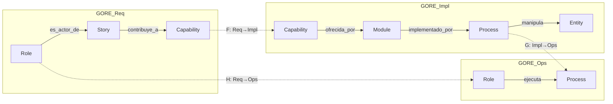

# Ontología Categórica GORE_OS
## Especificación Formal del Modelo Atómico-Composicional

**Versión:** 2.0.0  
**Estado:** Draft (Auditado por Arquitecto Categórico v1.3)  
**Fecha:** 2025-12-21  
**Autor:** Ingeniero Software Composicional  
**Auditor:** Arquitecto Categórico

---

## 1. Fundamentos Categóricos

### 1.1 Definición de la Categoría **GORE**

Sea **GORE** una categoría compuesta por **tres subcategorías** interconectadas mediante funtores:

```
GORE = GORE_Req ×_F GORE_Impl ×_G GORE_Ops
```

Donde:
- **GORE_Req**: Categoría de Requisitos (Role, Story, Capability)
- **GORE_Impl**: Categoría de Implementación (Module, Process, Entity)
- **GORE_Ops**: Categoría de Operación (Role, Process) — vista de ejecución

### 1.2 Subcategorías y Funtores



> **Nota Categórica:** Los paths `Role → Story → ... → Entity` y `Role → Process → Entity` NO conmutan. Son paths en subcategorías distintas conectadas por funtores. Esto es **correcto por diseño**.

### 1.3 Funtores de Conexión

| Funtor | Dominio   | Codominio | Semántica                             |
| ------ | --------- | --------- | ------------------------------------- |
| **F**  | GORE_Req  | GORE_Impl | Capability ↦ Module que la implementa |
| **G**  | GORE_Impl | GORE_Ops  | Process ↦ Process ejecutable          |
| **H**  | GORE_Req  | GORE_Ops  | Role ↦ Role como ejecutor             |
| **Δ**  | Domain    | Module    | Selección de módulos por dominio      |
| **Σ**  | Module    | Domain    | Agregación de módulos en dominio      |

---

## 2. Especificación de Átomos (Objetos)

### 2.1 Role (Rol / Actor)

```yaml
Role:
  type: object
  required: [id, role_key, title, type]
  properties:
    id:
      type: string
      pattern: "^USR-[A-Z]+-[A-Z0-9-]+$|^BOT-[A-Z0-9-]+$"
    role_key:
      type: string
      pattern: "^[a-z_]+$"
    title:
      type: string
    type:
      type: string
      enum: [Human, Bot, External, System]
    unit:
      type: string
    
    # Morfismos en GORE_Req
    morphisms_req:
      es_actor_de:
        type: array
        items: { type: string, format: urn }
    
    # Morfismos en GORE_Ops (profunctor Role ⊗ Process → 2)
    morphisms_ops:
      ejecuta:
        type: array
        items: { type: string, format: urn }
```

**Invariantes:**
- `I1`: `|es_actor_de| ≥ 1 ∨ |ejecuta| ≥ 1` (rol activo)
- `I2`: `type = Bot ⟹ id.startsWith("BOT-")`
- `I3`: `role_key` es único en el KB

---

### 2.2 Story (Historia de Usuario)

```yaml
Story:
  type: object
  required: [id, role_id, i_want, so_that, domain]
  properties:
    id:
      type: string
      pattern: "^US-[A-Z]+-[0-9]+-[0-9]+$"
    role_id:
      type: string
      format: urn
    i_want:
      type: string
      minLength: 10
    so_that:
      type: string
      minLength: 10  # OBLIGATORIO - Beneficial Rule
    domain:
      type: string
      pattern: "^D-[A-Z]+$"
    
    # Morfismo en GORE_Req
    morphisms:
      contribuye_a:
        type: string
        format: urn
      
      # Profunctor Story ⊗ Entity → 2
      menciona:
        type: array
        items: { type: string, format: urn }
```

**Invariantes:**
- `I4`: `so_that ≠ ∅` (Beneficial Rule)
- `I5`: `role_id ∈ Ob(Role)`
- `I6`: `domain = Capability(contribuye_a).domain ∨ Capability.type = TRANSVERSAL`

---

### 2.3 Capability (Capacidad / Bundle)

```yaml
Capability:
  type: object
  required: [id, name, domain]
  properties:
    id:
      type: string
      pattern: "^CAP-[A-Z]+-[0-9]+$"
    name:
      type: string
    domain:
      type: string
    type:
      type: string
      enum: [DOMAIN_SPECIFIC, TRANSVERSAL]
      default: DOMAIN_SPECIFIC
    
    # Morfismo inverso de contribuye_a (derivado)
    stories:
      type: array
      items: { type: string, format: urn }
    
    # Funtor F: GORE_Req → GORE_Impl
    ofrecida_por:
      type: string
      format: urn
```

**Invariantes:**
- `I7`: `|stories| ≥ 1` (capability no vacía)
- `I8`: **(CORREGIDO)** `∀ s ∈ stories: s.domain = domain ∨ type = TRANSVERSAL`
- `I9`: `orko_mapping.p5_purpose ≠ ∅`

---

### 2.4 Module (Módulo Funcional)

```yaml
Module:
  type: object
  required: [id, name, domain, pillar]
  properties:
    id:
      type: string
      pattern: "^MOD-[A-Z]+-[A-Z0-9-]+$"
    name:
      type: string
    domain:
      type: string
    type:
      type: string
      enum: [DOMAIN_SPECIFIC, TRANSVERSAL]
      default: DOMAIN_SPECIFIC
    pillar:
      type: string
    
    # Morfismos inversos
    capabilities:
      type: array
      items: { type: string, format: urn }
    
    # Morfismo en GORE_Impl
    implementado_por:
      type: array
      items: { type: string, format: urn }
    
    # Profunctor Module ⊗ Module → 2
    depends_on:
      type: array
      items: { type: string, format: urn }
```

**Invariantes:**
- `I10`: `|capabilities| ≥ 1`
- `I11`: **(CORREGIDO)** `type = DOMAIN_SPECIFIC ⟹ single domain` (FENIX es TRANSVERSAL)
- `I12`: `depends_on` es DAG (acíclico)

---

### 2.5 Process (Proceso BPMN)

```yaml
Process:
  type: object
  required: [id, name, domain, module_id]
  properties:
    id:
      type: string
      pattern: "^PROC-[A-Z]+-[A-Z0-9-]+$"
    name:
      type: string
    domain:
      type: string
    module_id:
      type: string
      format: urn
    
    # Profunctor Process ⊗ Role → 2 (en GORE_Ops)
    roles_ejecutores:
      type: array
      items: { type: string, format: urn }
    
    # Profunctor Process ⊗ Entity → 2
    manipula:
      type: array
      items: { type: string, format: urn }
```

**Invariantes:**
- `I13`: `|roles_ejecutores| ≥ 1`
- `I14`: `|manipula| ≥ 1`
- `I15`: `domain = Module(module_id).domain`

---

### 2.6 Entity (Entidad de Datos)

```yaml
Entity:
  type: object
  required: [id, name, domain, category]
  properties:
    id:
      type: string
      pattern: "^ENT-[A-Z]+-[A-Z0-9-]+$"
    name:
      type: string
    entity_key:
      type: string
    domain:
      type: string
    category:
      type: string
      enum: [Transactional, Master, Reference, Aggregate, Shared]
    pii:
      type: boolean
      default: false
    
    # Profunctor Entity ⊗ Entity → Relationship
    relacionado_con:
      type: array
      items:
        type: object
        properties:
          entity: { type: string, format: urn }
          relationship: { type: string, enum: ["1:1", "1:N", "N:M", "aggregates", "extends"] }
```

**Invariantes:**
- `I16`: `pii = true ⟹ ∃ Process con medidas de seguridad`
- `I17`: `category = Aggregate ⟹ |relacionado_con[aggregates]| ≥ 1`
- `I18`: `category = Shared ⟹ domain puede ser múltiple`

---

## 3. Morfismos como Profunctores

> **Corrección Categórica:** Los morfismos N:M no son funtores simples. Se modelan como **profunctores** (bimodules).

### 3.1 Definición de Profunctor

Un profunctor `P: A ⊗ B → Set` asigna a cada par `(a, b)` un conjunto (posiblemente vacío) de "evidencias" de relación.

En el caso booleano (relación binaria): `P: A ⊗ B → 2`

### 3.2 Tabla de Morfismos con Tipos

| Morfismo           | Tipo                  | Cardinalidad | Composición       |
| ------------------ | --------------------- | ------------ | ----------------- |
| `es_actor_de`      | Role → Story          | 1:N          | Functorial        |
| `contribuye_a`     | Story → Capability    | N:1          | Functorial        |
| `ofrecida_por`     | Capability → Module   | N:1          | Funtor F          |
| `implementado_por` | Module → P(Process)   | 1:N          | P-monad           |
| `manipula`         | Process ⊗ Entity → 2  | N:M          | Profunctor        |
| `ejecuta`          | Role ⊗ Process → 2    | N:M          | Profunctor        |
| `menciona`         | Story ⊗ Entity → 2    | N:M          | Profunctor        |
| `depends_on`       | Module ⊗ Module → 2   | N:M          | Profunctor (DAG)  |
| `relacionado_con`  | Entity ⊗ Entity → Rel | N:M          | Profunctor tipado |

### 3.3 Composición de Profunctores

Para consultas complejas, se usa composición de profunctores:

```
(Role ejecuta Process) ∘ (Process manipula Entity) : Role ⊗ Entity → 2
```

Esto permite **Uber-queries** à la Algebraic Databases:
> "Qué entidades son accesibles por qué roles a través de la ejecución de procesos"

---

## 4. Construcciones Universales

### 4.1 Límites (Constraints / Intersecciones)

| Construcción  | Fórmula   | Uso en GORE_OS                                             |
| ------------- | --------- | ---------------------------------------------------------- |
| **Terminal**  | `1`       | Domain FENIX como punto de convergencia                    |
| **Product**   | `A × B`   | Par (Role, Capability) para matriz de acceso               |
| **Pullback**  | `A ×_C B` | Stories de distintos modules que mencionan la misma Entity |
| **Equalizer** | `eq(f,g)` | Stories con mismo role y capability (candidatos a merge)   |

### 4.2 Colímites (Compositions / Uniones)

| Construcción    | Fórmula     | Uso en GORE_OS                                       |
| --------------- | ----------- | ---------------------------------------------------- |
| **Initial**     | `∅`         | Entity vacía (placeholder técnico)                   |
| **Coproduct**   | `A ⊔ B`     | `Capability = ⊔(Stories)`                            |
| **Pushout**     | `A ⊔_C B`   | Merge de Modules que comparten Processes             |
| **Coequalizer** | `coeq(f,g)` | Consolidar roles con aliases (USR-NEW-* → canonical) |

### 4.3 Adjunciones (Data Migration)

```
      Δ
Domain ⤻ Module     Δ ⊣ Σ ⊣ Π
      Σ
```

| Operador      | Dirección       | SQL Equivalente          | Uso                       |
| ------------- | --------------- | ------------------------ | ------------------------- |
| **Δ** (Delta) | Domain → Module | `SELECT ... AS`          | Refinamiento/proyección   |
| **Σ** (Sigma) | Module → Domain | `UNION`, `INSERT SELECT` | Agregación                |
| **Π** (Pi)    | Module → Domain | `JOIN`, `WHERE`          | Restricción con productos |

---

## 5. Composición de Dominios

### 5.1 Domain como Pullback

Un Domain se define como el **pullback** de sus componentes sobre el identificador de dominio:

```
                Module ──────────────────┐
                  │                      │
                  │ domain = D           │
                  ▼                      ▼
Role ──────────► Domain ◄──────────── Entity
  │                ▲                      │
  │ domain = D     │                      │ domain = D
  ▼                │                      ▼
Story ─────────────┴───────────────── Process
        domain = D                domain = D
```

### 5.2 Funtor Compositor

```python
def compose_domain(domain_id: str, modules: List[Module]) -> Domain:
    """
    Compositor categórico de dominio.
    Aplica Σ (agregación) sobre los módulos.
    """
    domain = Domain(id=domain_id)
    
    for module in modules:
        # Verificar invariante de cohesión
        if module.type == "DOMAIN_SPECIFIC":
            assert module.domain == domain_id
        
        domain.modules.append(module)
        
        # Σ-lift: agregar capabilities, stories, roles, processes, entities
        for cap in module.capabilities:
            domain.capabilities.add(cap)
            for story in cap.stories:
                domain.stories.add(story)
                domain.roles.add(story.role_id)
        
        for process in module.implementado_por:
            domain.processes.add(process)
            for entity in process.manipula:
                domain.entities.add(entity)
    
    return domain
```

---

## 6. Invariantes Globales del Sistema

### 6.1 Invariantes de Integridad Referencial

```python
REFERENTIAL_INVARIANTS = {
    "GI-01": "∀ story: story.role_id ∈ Ob(Role)",
    "GI-02": "∀ story: story.contribuye_a ∈ Ob(Capability)",
    "GI-03": "∀ capability: capability.ofrecida_por ∈ Ob(Module)",
    "GI-04": "∀ module: |module.implementado_por| ≥ 1",
    "GI-05": "∀ process: |process.manipula| ≥ 1",
    "GI-06": "∀ process: |process.roles_ejecutores| ≥ 1",
}
```

### 6.2 Invariantes de Cohesión (con excepciones TRANSVERSAL)

```python
COHESION_INVARIANTS = {
    "CI-01": "story.contribuye_a = cap ⟹ (story.domain = cap.domain ∨ cap.type = TRANSVERSAL)",
    "CI-02": "cap.ofrecida_por = mod ⟹ (cap.domain = mod.domain ∨ mod.type = TRANSVERSAL)",
    "CI-03": "proc ∈ mod.implementado_por ⟹ proc.domain = mod.domain",
    "CI-04": "ent ∈ proc.manipula ⟹ (ent.domain = proc.domain ∨ ent.category = Shared)",
}
```

### 6.3 Invariantes Estructurales

```python
STRUCTURAL_INVARIANTS = {
    "SI-01": "depends_on es DAG (no hay ciclos de dependencia)",
    "SI-02": "relacionado_con[aggregates] es DAG",
    "SI-03": "∀ profunctor P: P es reflexivo ⟺ id ∈ P",
}
```

---

## 7. Estructura de Archivos

```
gore_os/docs/blueprint/
├── schema/                         # Esquemas de validación
│   ├── role.schema.json
│   ├── story.schema.json
│   ├── capability.schema.json
│   ├── module.schema.json
│   ├── process.schema.json
│   └── entity.schema.json
│
├── atoms/                          # Instancias atómicas
│   ├── roles/
│   │   ├── _index.yml
│   │   └── *.yml
│   ├── stories/
│   ├── capabilities/
│   ├── modules/
│   ├── processes/
│   └── entities/
│
├── compositions/                   # Productos categóricos
│   ├── domains/
│   │   ├── d-back.yml
│   │   └── ...
│   └── bundles/                    # Composiciones cross-domain
│
├── profunctors/                    # Relaciones N:M explícitas
│   ├── role-process.yml            # ejecuta
│   ├── process-entity.yml          # manipula
│   ├── story-entity.yml            # menciona
│   └── module-module.yml           # depends_on
│
├── validation/
│   ├── validate_invariants.py
│   ├── compose_domains.py
│   └── query_profunctors.py
│
└── _manifest.yml
```

---

## 8. Ejemplo Completo

### 8.1 Átomo Role (GORE_Req + GORE_Ops)

```yaml
# atoms/roles/funcionario.yml
_meta:
  urn: "urn:goreos:atom:role:funcionario:1.0.0"

id: "USR-DAF-PER-FUN"
role_key: "funcionario"
title: "Funcionario"
type: Human
unit: "DAF"

morphisms_req:
  es_actor_de:
    - "urn:goreos:atom:story:us-back-func-001"
    - "urn:goreos:atom:story:us-back-func-002"

morphisms_ops:
  ejecuta:
    - "urn:goreos:atom:process:proc-back-autoservicio"
```

### 8.2 Profunctor ejecuta

```yaml
# profunctors/role-process.yml
_meta:
  urn: "urn:goreos:profunctor:ejecuta:1.0.0"
  type: "Role ⊗ Process → 2"

relations:
  - role: "urn:goreos:atom:role:funcionario"
    process: "urn:goreos:atom:process:proc-back-autoservicio"
    evidence: { authorized: true, level: "user" }
  
  - role: "urn:goreos:atom:role:jefe_daf"
    process: "urn:goreos:atom:process:proc-back-aprobacion"
    evidence: { authorized: true, level: "approver" }
```

### 8.3 Composición Domain

```yaml
# compositions/domains/d-back.yml
_meta:
  urn: "urn:goreos:composition:domain:d-back:5.5.0"

id: "D-BACK"
name: "Gestión de Recursos Institucionales"
layer: "Habilitante"
function: "ADMINISTRAR"
type: "DOMAIN_SPECIFIC"

composition:
  modules:
    - "$ref: atoms/modules/mod-back-rrhh.yml"
    - "$ref: atoms/modules/mod-back-compras.yml"
    - "$ref: atoms/modules/mod-back-patrimonio.yml"

# Derivados por Σ-lift
derived:
  capabilities: 8
  processes: 15
  stories: 120
  roles: 45
  entities: 32
```

---

## 9. Resumen de Correcciones Aplicadas

| Issue Original                 | Corrección                                       | Sección |
| ------------------------------ | ------------------------------------------------ | ------- |
| Diagrama no conmutativo        | Bifurcado en 3 subcategorías con funtores        | §1.2    |
| I8 rompe cross-domain          | Añadido `type: TRANSVERSAL`                      | §2.3    |
| I11 limita FENIX               | Añadido `type: TRANSVERSAL` para modules         | §2.4    |
| Morfismos N:M no funtoriales   | Modelados como profunctores                      | §3      |
| Sin construcciones universales | Añadida sección de límites/colímites/adjunciones | §4      |

---

> **Arquitecto Categórico v1.3:** Esta ontología ahora es categóricamente sólida. Las subcategorías están bien definidas, los invariantes son flexibles para casos transversales, y los morfismos N:M se modelan rigurosamente como profunctores.
