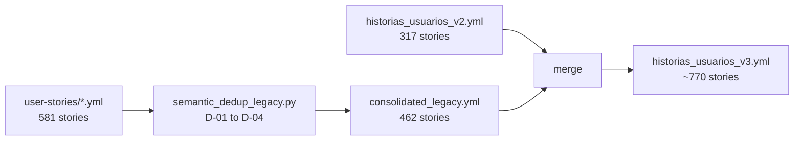

# Walkthrough: Phase 13 - Semantic Deduplication & v3 Creation

> **Fecha**: 2025-12-20  
> **Estado**: ✅ Completo

---

## Resumen Ejecutivo

Se aplicó el proceso de deduplicación semántica multi-agente (reglas D-01 a D-04) a las historias legacy y se fusionaron con v2 para crear `historias_usuarios_v3.yml`.

---

## Pipeline Ejecutado

---

## Estadísticas

| Fuente                 | Antes | Después      |
| ---------------------- | ----- | ------------ |
| Legacy (user-stories/) | 581   | 462 (-20.5%) |
| v2 (SSOT)              | 317   | 317          |
| **v3 (Total)**         | —     | **~770**     |

### Capability Bundles Identificados (D-01)

| Bundle        | Historias | Beneficiarios             |
| ------------- | --------- | ------------------------- |
| CAP-FIN-DASH  | 20        | Gobernador, DIPIR, DAF... |
| CAP-FIN-REND  | 24        | Ejecutores, UCR, DAF      |
| CAP-EJEC-SEG  | 21        | DIPIR, DIT, Municipios    |
| CAP-BACK-COMP | 19        | Abastecimiento            |
| CAP-BACK-TES  | 16        | Tesorería                 |
| CAP-TDE-FIRMA | 9         | Multi-dominio             |
| CAP-BACK-INV  | 9         | Bodegas, AF               |
| CAP-BACK-BIEN | 6         | Bienestar                 |
| CAP-BACK-PERS | 3         | RRHH                      |

---

## Archivos Generados

| Archivo                                                                                                                           | Descripción            |
| --------------------------------------------------------------------------------------------------------------------------------- | ---------------------- |
| [consolidated_legacy.yml](file:///Users/felixsanhueza/fx_felixiando/gore_os/docs/user-stories-refactored/consolidated_legacy.yml) | Legacy deduplicado     |
| [historias_usuarios_v3.yml](file:///Users/felixsanhueza/fx_felixiando/gore_os/docs/blueprint/historias_usuarios_v3.yml)           | v2 + Legacy fusionados |

---

## Próximos Pasos

1. [ ] Regularizar dominios desde v3
2. [ ] Verificar 100% cobertura en dominios
3. [ ] Eliminar catálogos inline legacy de D-BACK

---

*Blueprint GORE_OS | Phase 13 Complete*
