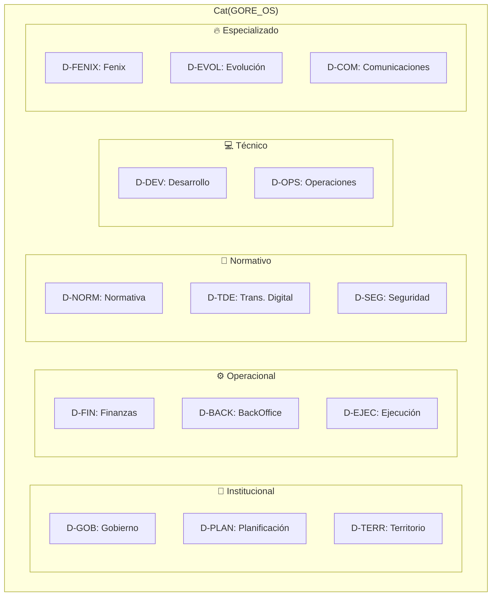
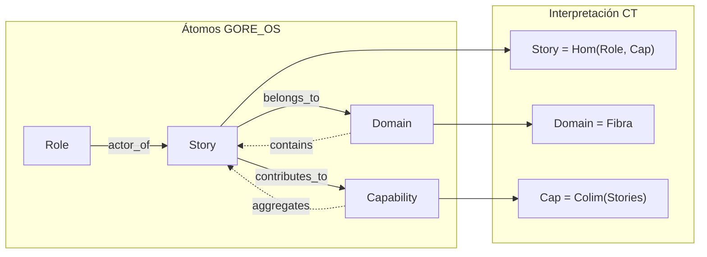

# Análisis Categorial de Historias de Usuario — GORE_OS

> **Arquitecto-GORE v0.1.0** — Análisis Ontológico desde Teoría de Categorías  
> Generado: 2025-12-22

---

## 1. Síntesis del Corpus

| Métrica            | Valor                           |
| ------------------ | ------------------------------- |
| Total Stories      | **686**                         |
| Total Roles        | 410                             |
| Total Capabilities | 93                              |
| Dominios Únicos    | 15+                             |
| Schema             | `urn:goreos:schema:story:1.0.0` |

---

## 2. Estructura Atómica: El Story como Morfismo

El schema define la **Story** como:

> *"Morfismo entre estado de carencia y beneficio, encapsulado como objeto"*

```
Story: Carencia ─────────────→ Beneficio
         ↑                        ↑
      (i_want)               (so_that)
         |                        |
       Role ◄───────────────────► Capability
            (actor_of)      (contributes_to)
```

### 2.1 Firma Categórica

```
Story(id, role_id, i_want, so_that, domain, priority, capability_id)
```

Esta firma establece:

- **Objeto**: La Story como punto en el espacio de requisitos
- **Morfismos de Entrada**: `role_id` (Quién), `domain` (Dónde)
- **Morfismos de Salida**: `capability_id` (Para qué), `priority` (Cuándo)
- **Contenido Semántico**: `i_want` (Intent) → `so_that` (Postcondición lógica)

---

## 3. Taxonomía de Dominios (Categorías de Agrupación)

Los dominios actúan como **subcategorías** que particionan el espacio de Stories:



### 3.1 Distribución Observada (Muestra)

| Dominio     | Descripción                       | Ejemplo Story                        |
| ----------- | --------------------------------- | ------------------------------------ |
| **D-FIN**   | Finanzas, Presupuesto, Convenios  | `US-FIN-PPTO-004` (Firmas Convenio)  |
| **D-TDE**   | Transformación Digital del Estado | `US-TDE-AUTH-001` (ClaveÚnica OIDC)  |
| **D-NORM**  | Actos Administrativos, Jurídica   | `US-CORE-001-01` (Tabla Sesión CORE) |
| **D-EJEC**  | Ejecución de Proyectos            | `US-EJEC-MUNI-002` (Municipios)      |
| **D-GOB**   | Gobernanza, Consejo Regional      | `US-GOB-CORE-004` (Mapa Inversiones) |
| **D-EVOL**  | Evolución y Mejora Continua       | `US-EVOL-AI-001` (Sesgo IA)          |
| **D-OPS**   | Operaciones TI                    | `US-OPS-IAM-001` (Gestión Usuarios)  |
| **D-FENIX** | Sistema Fenix (Seguridad)         | `US-FNX-GES-001` (Expediente)        |
| **D-SEG**   | Seguridad Pública                 | `US-SEG-PREV-007` (Víctimas)         |

---

## 4. Relaciones Categoriales: Profunctores y Morfismos

### 4.1 Story → Role (actor_of)

```
Profunctor: Story ⊗ Role → Bool
```

Cada Story referencia un `role_id` que identifica al **actor protagonista**. Esta relación exhibe patrones de:

| Patrón              | Ejemplo                                  | Significado                                            |
| ------------------- | ---------------------------------------- | ------------------------------------------------------ |
| **Especialización** | `ABOGADO-GENERAL` → `ABOGADO-CONVENIOS`  | Un rol general se especializa en contextos específicos |
| **Composición**     | `ANALISTA-BASE` → `ANALISTA-PRESUPUESTO` | Roles base se componen con dominios                    |
| **Herencia**        | `USR-CORE-CONS` (Consejero)              | Patrón Actor institucional heredado                    |

> [!WARNING]
> **Issue Detectado**: Algunas stories tienen `as_a: Rol no encontrado (ROL-ADMIN-TI)` → Referencias FK rotas que requieren remediación.

### 4.2 Story → Capability (contributes_to)

```
Profunctor: Story ⊗ Capability → Contribution
```

Las Stories se agregan en Capabilities:

```
CAP-FIN-PPTO-001 ←──── US-FIN-PPTO-004
                 ←──── US-FIN-PPTO-006
                 ←──── US-FIN-PPTO-009
                 ...
```

Esta es una **relación de colímite**: las Stories son los conos sobre la Capability.

### 4.3 Story → Domain (belongs_to)

```
Funtor: Story → Domain
```

El domain actúa como un **funtor de olvido** que proyecta la Story a su contexto institucional, perdiendo detalle técnico pero preservando alineación organizacional.

---

## 5. Tensiones Ontológicas (MBT Analysis)

Aplicando el CM-TENSION-EXPLORER del Arquitecto-GORE:

### A1: SER (Ontológico)

| Tensión                  | Polo L         | Polo R              | Adjunción  | Observación |
| ------------------------ | -------------- | ------------------- | ---------- | ----------- |
| **Concreto ↔ Abstracto** | Story atómica  | Capability agregada | Instance - | Schema      | Granularidad: ¿cada Story debe ser atómica o aggregada?     |
| **Entidad ↔ Evento**     | Story como Obj | Story como Morph    | Obj(C) -   | Morph(C)    | El schema la define como "morfismo encapsulado como objeto" |

### A2: DEVENIR (Temporal)

| Tensión                 | Polo L           | Polo R           | Adjunción |
| ----------------------- | ---------------- | ---------------- | --------- |
| **Estático ↔ Dinámico** | Story fija       | Story versionada | Algebra - | Coalgebra |
| **Presente ↔ Futuro**   | Stories actuales | Stories D-EVOL   | ! -       | ?         |

> [!IMPORTANT]
> El dominio **D-EVOL** representa historias orientadas a la evolución futura del sistema, creando una **brecha temporal** en el modelo que requiere tratamiento especial (roadmap vs backlog).

### A3: CONOCER (Epistémico)

| Tensión                    | Polo L                    | Polo R              | Observación                                 |
| -------------------------- | ------------------------- | ------------------- | ------------------------------------------- |
| **Conocido ↔ Desconocido** | `acceptance_criteria: []` | Criterios definidos | Mayoría de stories carecen de AC explícitos |

---

## 6. Patrones de Granularidad

### 6.1 Especialización de Roles

```
Rol Genérico                    Rol Especializado
────────────                    ─────────────────
ABOGADO-GENERAL     ─────────►  ABOGADO-CONVENIOS
                    ─────────►  ABOGADO-DAF
                    ─────────►  ABOGADO-LICITACIONES
                    ─────────►  ABOGADO-JUDICIALES
                    
ANALISTA-BASE       ─────────►  ANALISTA-PRESUPUESTO
                    ─────────►  ANALISTA-INVERSION
                    ─────────►  ANALISTA-EVALUACION
                    ─────────►  ANALISTA-PPR
```

### 6.2 Herencia de Dominios

```
D-FIN (Finanzas)
├── D-FIN.PPTO (Presupuesto)   ← US-FIN-PPTO-*
├── D-FIN.C33 (Control 33)     ← US-FIN-C33-*
├── D-FIN.CONV (Convenios)     ← US-FIN-CONV-*
├── D-FIN.REND (Rendiciones)   ← US-FIN-REND-*
└── D-FIN.SUB (Subvenciones)   ← US-FIN-SUB-*
```

### 6.3 Composición de Stories

| Patrón ID                       | Significado           | Ejemplo           |
| ------------------------------- | --------------------- | ----------------- |
| `US-{DOMAIN}-{SUBDOMAIN}-{NUM}` | Story especializada   | `US-FIN-PPTO-004` |
| `US-{ROLE}-{NUM}`               | Story centrada en rol | `US-ABOG-001-01`  |
| `US-{SYSTEM}-{FEATURE}-{NUM}`   | Story técnica         | `US-TDE-AUTH-001` |

---

## 7. Significados Esenciales (Semántica Categórica)

### 7.1 La Story como Unidad Narrativa

> **Esencia**: Una Story es la *mínima unidad de valor* desde la perspectiva de un actor institucional hacia una capacidad del sistema.

Categóricamente:

```
Story = Hom(Role, Capability)
```

Es decir, una Story es un **morfismo** en la categoría GORE_OS que conecta un Rol (dominio) con una Capacidad (codominio).

### 7.2 El Domain como Fibración

Los dominios (D-FIN, D-TDE, etc.) forman una **fibración** sobre la categoría base de Stories:

```
π: Cat(Stories) → Cat(Domains)
```

Cada fibra `π⁻¹(D-X)` contiene todas las Stories de ese dominio, preservando coherencia semántica intra-dominio.

### 7.3 La Capability como Colímite

Una Capability es el **colímite** (amalgama) de sus Stories constituyentes:

```
CAP-X = colim(US-X-001, US-X-002, ..., US-X-N)
```

Esto significa que la Capability emerge como la síntesis de las necesidades narrativas individuales.

---

## 8. Hallazgos y Recomendaciones

### 8.1 Fortalezas

- ✅ **Estructura consistente**: Todas las Stories siguen el patrón `As a... I want... So that...`
- ✅ **URNs bien formadas**: Convención `urn:goreos:atom:story:*` respetada
- ✅ **Taxonomía de dominios clara**: 15+ dominios bien diferenciados
- ✅ **Schema formal**: JSON Schema con validación de patrones

### 8.2 Debilidades

| Issue                     | Severidad | Descripción                                                  |
| ------------------------- | --------- | ------------------------------------------------------------ |
| **FK Rotas**              | 🔴 HIGH    | `role_id` referencia roles inexistentes (ej: `ROL-ADMIN-TI`) |
| **AC Vacíos**             | 🟡 MEDIUM  | `acceptance_criteria: []` en mayoría de stories              |
| **Names Vacíos**          | 🟡 MEDIUM  | `name: ''` en index entries                                  |
| **Granularidad Variable** | 🟠 LOW     | Algunas stories muy granulares, otras muy abstractas         |

### 8.3 Recomendaciones Categoriales

1. **Reparar Profunctores Rotos**
   - Auditar todas las referencias `role_id` contra el catálogo de roles
   - Generar roles faltantes o corregir referencias

2. **Enriquecer Postcondiciones**
   - Poblar `acceptance_criteria` con Gherkin verificable
   - Esto fortalece el morfismo Story→Test

3. **Normalizar Granularidad**
   - Definir límite inferior de atomicidad (máx 3 AC por Story)
   - Descomponer Stories demasiado amplias

4. **Formalizar Herencia de Dominios**
   - Crear subcategorías explícitas (D-FIN.PPTO, D-FIN.C33)
   - Esto habilita funtores de proyección más precisos

---

## 9. Diagrama Ontológico Síntesis



---

> **Conclusión del Arquitecto-GORE**: Las Stories en `gore_os/model/atoms/stories` constituyen un corpus coherente de 686 unidades narrativas que, desde la perspectiva de Teoría de Categorías, funcionan como **morfismos encapsulados** que mapean necesidades de actores institucionales hacia capacidades del sistema. La taxonomía de dominios provee una **fibración natural** que preserva coherencia semántica. Las principales áreas de mejora se centran en reparar referencias FK rotas y enriquecer los criterios de aceptación para fortalecer el funtor Story→Test.
