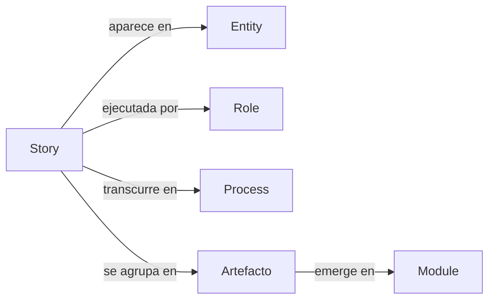

# GORE_OS — Sistema Operativo del Gobierno Regional de Ñuble

**Versión:** 3.0.0 (Radical Refactor)  
**Estado:** En desarrollo activo  
**Filosofía:** Story-First & Minimalismo Radical

---

## ¿Qué es GORE_OS?

GORE_OS es el **sistema operativo institucional** del Gobierno Regional de Ñuble. No es un software tradicional, sino un **modelo integrado de datos, procesos y capacidades** que permite al GORE funcionar de manera coherente, auditable y evolucionar orgánicamente.

> 📘 **Para la visión política y estratégica, ver [MANIFESTO.md](MANIFESTO.md)**

---

## Principio Rector: Story-First

La arquitectura de GORE_OS se adhiere a una regla de derivación estructural estricta y unidireccional:



1. **Story**: El punto de partida absoluto. Si no hay story, no existe el requerimiento.
2. **Entity**: El modelo de datos necesario para soportar la story.
3. **Role**: El agente (humano o máquina) que interactúa con la story.
4. **Process**: La orquestación temporal de la story.

---

## Estructura del Monorepo

```text
gore_os/
├── app/                      # 🐍 Aplicación Flask
│   ├── blueprints/           # Módulos Funcionales (BP)
│   ├── static/               # Assets (CSS/JS compilados)
│   ├── templates/            # Plantillas Jinja2
│   └── __init__.py           # Application Factory
│
├── architecture/             # 🏗️ Documentación Técnica
├── model/                    # ❤️ Definiciones Semánticas
├── docker-compose.yml        # Orquestación
├── pyproject.toml            # Dependencias Python
└── MANIFESTO.md              # 📜 Constitución del Sistema
```

---

## Stack Tecnológico (v2.1)

El stack técnico está diseñado para ser **Cloud First**, **Type Safe** y **High Performance**:

| Capa         | Tecnología               | Justificación                              |
| ------------ | ------------------------ | ------------------------------------------ |
| **Backend**  | **Python + Flask**       | Estándar en gobierno, robustez y librerías |
| **Frontend** | **Jinja2 + HTMX**        | SSR rápido y simplicidad operativa         |
| **Styling**  | **Tailwind CSS**         | Diseño moderno y consistente               |
| **DB**       | **PostgreSQL + PostGIS** | Base de datos relacional y territorial     |
| **ORM**      | **SQLAlchemy**           | Mapeo robusto y seguro                     |
| **Deploy**   | **Docker + Gunicorn**    | Contenerización estándar y escalable       |
| **Auth**     | **Flask-Login**          | Gestión clásica de sesiones y roles        |

---

## Estado del Proyecto (3.0.0)

Hemos realizado una **poda estructural radical** para eliminar redundancia y complejidad accidental:

- **Conservado**: Stories, Roles, Entities, Processes, Architecture.
- **Eliminado**: Domains, Modules, Competences, Capabilities, Agents (como átomos aislados).
- **Objetivo**: Que los módulos y capacidades **emerjan** de la agrupación natural de historias validadas.

### Próximos Pasos

1. **Enriquecimiento de Stories**: Procesamiento 1x1 de las 819 historias para asegurar completitud.
2. **Validación de Entidades**: Asegurar que cada entidad tenga trazabilidad a una historia.
3. **Saneamiento de Roles**: Consolidar roles redundantes.
4. **Emergencia de Módulos**: Agrupar historias para definir los módulos de software reales.

---

*GORE_OS Dev Team — Diciembre 2025*
