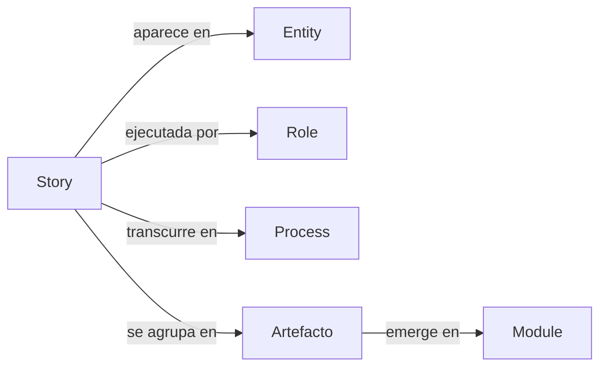

# GORE_OS — Sistema Operativo del Gobierno Regional de Ñuble

**Versión:** 3.0.0 (Radical Refactor)  
**Estado:** En desarrollo activo  
**Filosofía:** Story-First & Minimalismo Radical

---

## ¿Qué es GORE_OS?

GORE_OS es el **sistema operativo institucional** del Gobierno Regional de Ñuble. No es un software tradicional, sino un **modelo integrado de datos, procesos y capacidades** que permite al GORE funcionar de manera coherente, auditable y evolucionar orgánicamente.

> 📘 **Para la visión política y estratégica, ver [MANIFESTO.md](MANIFESTO.md)**

---

## Principio Rector: Story-First

La arquitectura de GORE_OS se adhiere a una regla de derivación estructural estricta y unidireccional:



1. **Story**: El punto de partida absoluto. Si no hay story, no existe el requerimiento.
2. **Entity**: El modelo de datos necesario para soportar la story.
3. **Role**: El agente (humano o máquina) que interactúa con la story.
4. **Process**: La orquestación temporal de la story.

---

## Estructura del Monorepo

```text
gore_os/
├── model/                    # ❤️ El Corazón Semántico
│   ├── stories/              # 819 Historias de Usuario (Origen)
│   ├── entities/             # 139 Entidades (Modelo de Datos)
│   ├── roles/                # 410 Roles Institucionales
│   ├── processes/            # 84 Procesos BPMN
│   ├── GLOSARIO.yml          # Terminología Autorizada
│   └── README.md             # Reglas del Modelo
│
├── architecture/             # 🏗️ Decisiones Técnicas
│   ├── c1_context/           # Diagramas de Contexto
│   ├── c2_containers/        # Docker & Infra
│   ├── design/               # Design System & UI
│   └── stack.md              # Bun + Hono + Effect + tRPC
│
├── apps/                     # 🖥️ Aplicaciones Frontend
├── packages/                 # 📦 Librerías Compartidas
└── MANIFESTO.md              # 📜 Constitución del Sistema
```

---

## Stack Tecnológico (v2.1)

El stack técnico está diseñado para ser **Cloud First**, **Type Safe** y **High Performance**:

| Capa        | Tecnología               | Justificación                              |
| ----------- | ------------------------ | ------------------------------------------ |
| **Runtime** | **Bun**                  | Rendimiento y DX unificada                 |
| **Backend** | **Hono**                 | API Framework ligero y estándar            |
| **Logic**   | **Effect-TS**            | Manejo de errores y concurrencia robusta   |
| **API**     | **tRPC**                 | Tipado end-to-end sin generación de código |
| **Data**    | **PostgreSQL + PostGIS** | Base de datos relacional y territorial     |
| **ORM**     | **Drizzle**              | Acceso a datos tipo-seguro y SQL-like      |
| **Auth**    | **ClaveÚnica/Keycloak**  | Identidad federada oficial                 |

---

## Estado del Proyecto (3.0.0)

Hemos realizado una **poda estructural radical** para eliminar redundancia y complejidad accidental:

- **Conservado**: Stories, Roles, Entities, Processes, Architecture.
- **Eliminado**: Domains, Modules, Competences, Capabilities, Agents (como átomos aislados).
- **Objetivo**: Que los módulos y capacidades **emerjan** de la agrupación natural de historias validadas.

### Próximos Pasos

1. **Enriquecimiento de Stories**: Procesamiento 1x1 de las 819 historias para asegurar completitud.
2. **Validación de Entidades**: Asegurar que cada entidad tenga trazabilidad a una historia.
3. **Saneamiento de Roles**: Consolidar roles redundantes.
4. **Emergencia de Módulos**: Agrupar historias para definir los módulos de software reales.

---

*GORE_OS Dev Team — Diciembre 2025*
