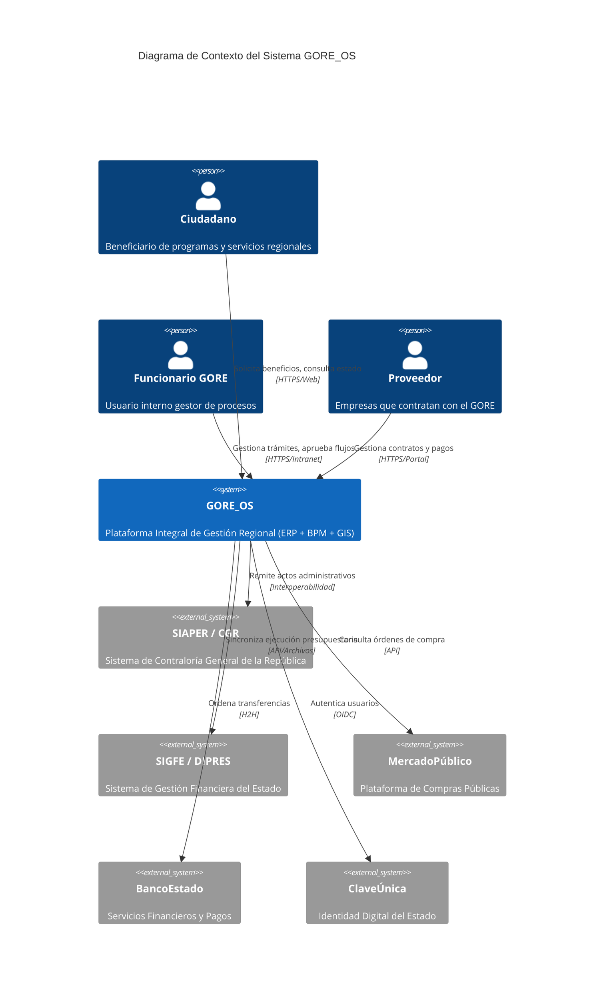

# C1 - Contexto del Sistema GORE_OS

## Abstract
GORE_OS es la plataforma central de gestión para el Gobierno Regional, actuando como el sistema nervioso digital que orquesta procesos administrativos, financieros y territoriales.

## Diagrama de Contexto (Nivel 1)

## Fronteras del Sistema

### In Scope
- Gestión de Cartera de Inversiones (FNDR)
- Administración Financiera y Contable (en espejo con SIGFE)
- Gestión Documental y Firma Electrónica
- Planificación Territorial (GIS)
- Gestión de Personas y Cometidos

### Out of Scope
- Validación de identidad (delegado a ClaveÚnica)
- Custodia de fondos (delegado a BancoEstado)
- Toma de razón legal (delegado a CGR)
