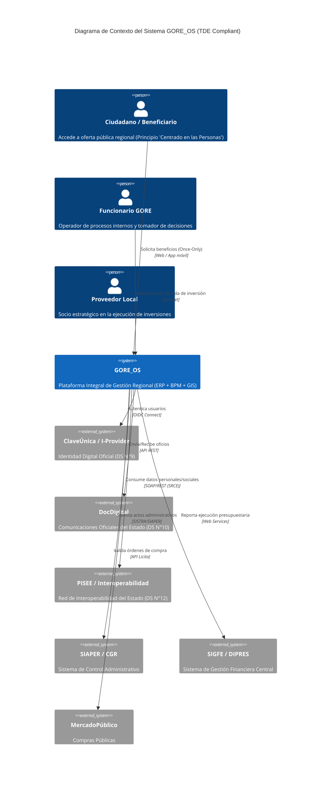

# C1 - Contexto del Sistema GORE_OS

> **Alineación TDE:** Principio de Gobierno Integrado (`TDE_CORE_PRI_003`)
> **Visión:** GORE como nodo activo en la red del Estado (GORE 4.0).

## Abstract
GORE_OS es la plataforma central de gestión para el Gobierno Regional, actuando como el sistema nervioso digital que orquesta procesos administrativos, financieros y territoriales. No opera aislado, sino como un nodo interoperable en el ecosistema digital del Estado de Chile.

## Diagrama de Contexto (Nivel 1)

## Fronteras del Sistema y Responsabilidades

### Responsabilidades GORE_OS (In Scope)
- **Gestión de Cartera de Inversiones (FNDR)**: Ciclo completo desde pre-admisibilidad hasta cierre.
- **Gestión Territorial (Gemelo Digital)**: Planificación basada en mapas (PostGIS) y datos.
- **Administración Interna**: Subvenciones, Personas (Viáticos, Cometidos), Activos.
- **Exposición de APIs de Datos Abiertos**: `TDE-DATOS-ACTIVO-ESTRATEGICO-01`.

### Responsabilidades Delegadas (Out of Scope - Reuse)
- **Identidad**: Delegado 100% a **ClaveÚnica** (no gestionamos passwords de ciudadanos).
- **Comunicaciones Inter-Servicios**: Delegado a **DocDigital**. No construimos un "correo" propio.
- **Pagos Masivos**: Delegado a **TGR/BancoEstado** (integración, no tenencia de fondos).
- **Firma Avanzada**: Consumo de proveedores acreditados o servicio de firma del Estado.

## Principios de Integración
1.  **Once Only**: Antes de pedir un dato al ciudadano (ej. Registro Social de Hogares), GORE_OS lo consulta vía PISEE.
2.  **Digital Default**: Todo documento saliente nace digital (XML/PDF firmado) y se cursa por DocDigital.
