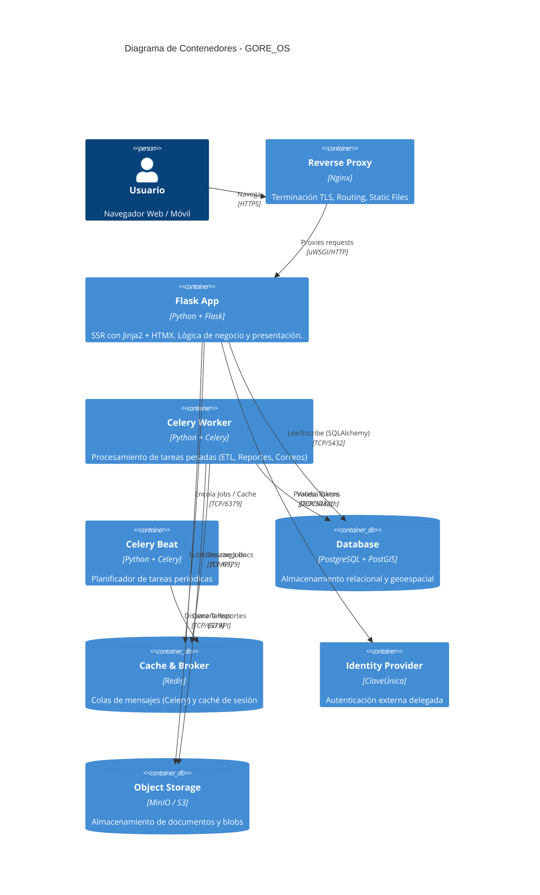

# C2 - Contenedores de GORE_OS

## Abstract
 
La arquitectura de GORE_OS se descompone en contenedores dockerizados que separan responsabilidades de interfaz, lógica de negocio, persistencia y procesamiento asíncrono.

## Diagrama de Contenedores (Nivel 2)

## Definición de Contenedores

| Contenedor    | Tecnología              | Responsabilidad Principal                                    | Patrón de Diseño  |
| ------------- | ----------------------- | ------------------------------------------------------------ | ----------------- |
| **Flask App** | Python, Flask, Gunicorn | Orquestación de peticiones, SSR (Jinja2), Endpoints HTMX     | MVC / App Factory |
| **Worker**    | Python, Celery          | Procesos background, integraciones lentas, ETL               | Distributed Queue |
| **Database**  | PostgreSQL 16           | Fuente de verdad, integridad referencial, queries espaciales | Relacional, ACID  |
| **Redis**     | Redis                   | Broker de mensajería y almacenamiento de sesiones volátiles  | Key-Value Store   |
| **IDP**       | ClaveÚnica              | Autenticación externa, gestión de usuarios                   | OAuth2 / OIDC     |

## Decisiones Clave

1. **Python como Lenguaje Único**: Unificamos backend y scripting en Python para aprovechar el ecosistema de ciencia de datos y geoespacial (Pandas, GeoPandas) nativo en el gobierno.
2. **Server-Side Rendering (Hypermedia)**: Eliminamos la complejidad del `JSON-over-the-wire` (React) en favor de `HTML-over-the-wire` (HTMX), simplificando la gestión de estado y reduciendo la latencia percibida.
3. **PostGIS Nativo**: El componente territorial es *core* para el GORE, por lo que PostGIS está integrado en la DB principal y no como servicio separado.
