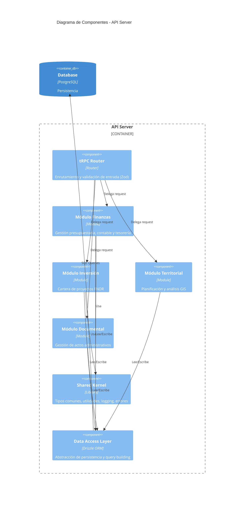

# C3 - Componentes de GORE_OS

## Abstract
Dentro del contenedor **API Server**, la aplicación se estructura en componentes modulares que reflejan los dominios de la organización. Estos componentes son la realización del Funtor $\mathcal{F}: \mathcal{G}_{Req} \to \mathcal{G}_{Impl}$.

## Diagrama de Componentes (Nivel 3 - API Server)

## Catálogo de Componentes Principales

### 1. Módulo Finanzas (D-FIN)
- **Responsabilidad**: Ejecución del presupuesto, devengamiento, pagos y conciliación.
- **Interacciones**: Se integra fuertemente con SIGFE (externo) y Módulo Inversión.
- **Artefacts**: `model/atoms/modules/mod_fin_*.yml`

### 2. Módulo Inversión (D-INV)
- **Responsabilidad**: Ciclo de vida de proyectos (pre-inversión, diseño, ejecución).
- **Interacciones**: Alimenta al Módulo Finanzas con estados de pago.
- **Artefacts**: `model/atoms/modules/mod_inv_*.yml`

### 3. Módulo Territorial (D-TERR)
- **Responsabilidad**: Visualización y análisis de capas geográficas.
- **Interacciones**: Cruza datos de inversión con ubicación geográfica.
- **Artefacts**: `model/atoms/modules/mod_terr_*.yml`

### 4. Shared Kernel
- **Responsabilidad**: Definiciones transversales que garantizan la consistencia del sistema.
- **Contenido**:
    - Tipos base (Result, Option, Either)
    - Manejo estructurado de errores
    - Loggers y telemetría
    - Utilidades de fecha y formato

## Principios de Diseño de Componentes

1.  **Alta Cohesión**: Cada componente maneja un dominio acotado (Bounded Context).
2.  **Acoplamiento Explícito**: Las dependencias entre módulos deben ser explícitas (idealmente a través de interfaces o eventos), prohibiendo imports circulares directos.
3.  **Stateless**: Los componentes no guardan estado en memoria; delegan todo estado a la DB o Redis.
