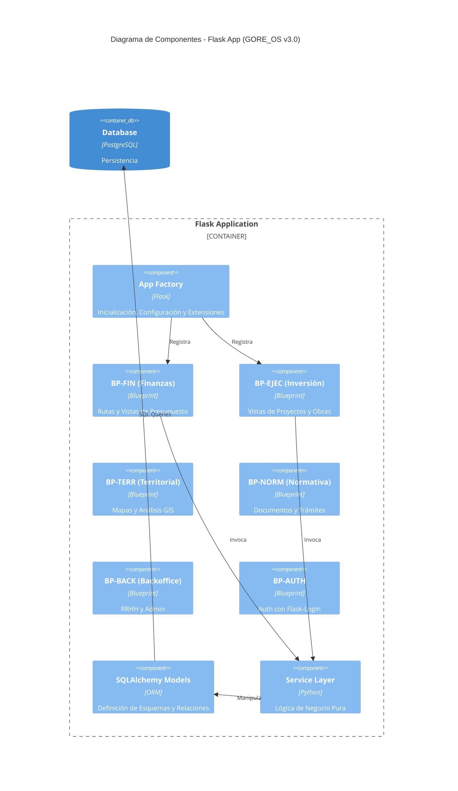

# C3 - Componentes de GORE_OS

## Abstract

Dentro del contenedor **API Server**, la aplicación se estructura en componentes modulares que reflejan los dominios de la organización. Estos componentes son la realización del Funtor $\mathcal{F}: \mathcal{G}_{Req} \to \mathcal{G}_{Impl}$.

## Diagrama de Componentes (Nivel 3 - API Server)

El servidor de API se organiza en **Dominios de Bounded Context**, cada uno encapsulando su propia lógica, estados y servicios.

## Catálogo de Dominios (Blueprints)

### 1. BP-FIN (Finanzas y Presupuesto)

- **Responsabilidad**: Gestión de ingresos/gastos, conciliación bancaria y devengo.
- **Relaciones**: Centro del flujo monetario; alimentado por BP-EJEC.
- **Micro-módulos**: `rendiciones`, `presupuesto_regional`, `alertas_360`.

### 2. BP-EJEC (Ejecución de Inversiones)

- **Responsabilidad**: Supervisión de obras, convenios municipales y PMO Regional.
- **Propósito**: Garantizar que la inversión pública se transforme en infraestructura real.
- **Micro-módulos**: `supervision_obras`, `gestion_convenios`, `pmo_regional`.

### 3. BP-TERR (Territorial y GIS)

- **Responsabilidad**: El "Gemelo Digital" de la región. Vista de mapas con Leaflet/MapLibre.
- **Propósito**: Visualizar la inversión en el mapa y planificar el ordenamiento territorial.
- **Micro-módulos**: `visor_territorial`, `analisis_brechas`.

### 4. BP-NORM (Normativa y Documental)

- **Responsabilidad**: Gestión de Actos Administrativos, Expedientes Electrónicos y Firma.
- **Micro-módulos**: `gestor_documental`, `firma_digital`.

### 5. BP-BACK (Backoffice)

- **Responsabilidad**: Administración interna: RRHH, Abastecimiento.

### 6. Shared & Core

- **App Factory**: `create_app()` inicializa la DB, migraciones, login manager y registra blueprints.
- **SQLAlchemy Models**: Modelos de datos declarativos alineados con el esquema de base de datos.
- **HTMX Partials**: Fragmentos de HTML renderizados por Jinja2 para interactividad dinámica.

## Principios de Diseño de Componentes

1. **Alta Cohesión**: Cada componente maneja un dominio acotado (Bounded Context).
2. **Acoplamiento Explícito**: Las dependencias entre módulos deben ser explícitas (idealmente a través de interfaces o eventos), prohibiendo imports circulares directos.
3. **Stateless**: Los componentes no guardan estado en memoria; delegan todo estado a la DB o Redis.
