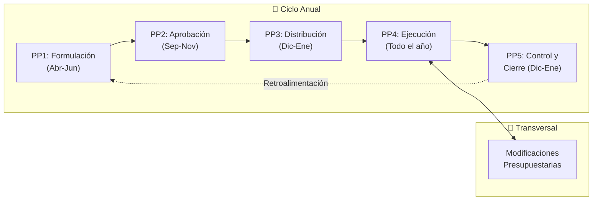
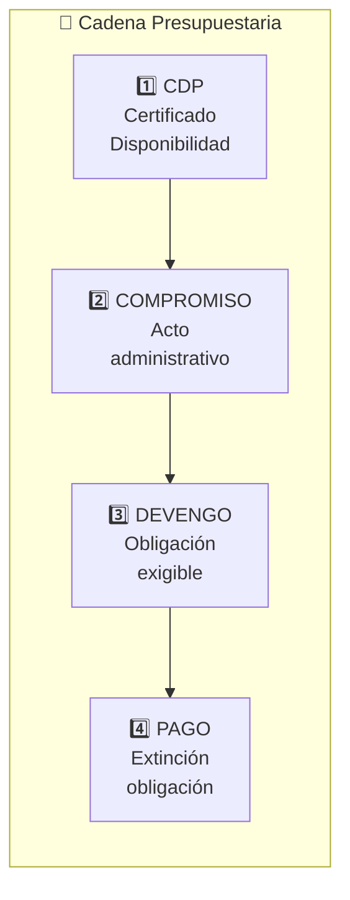
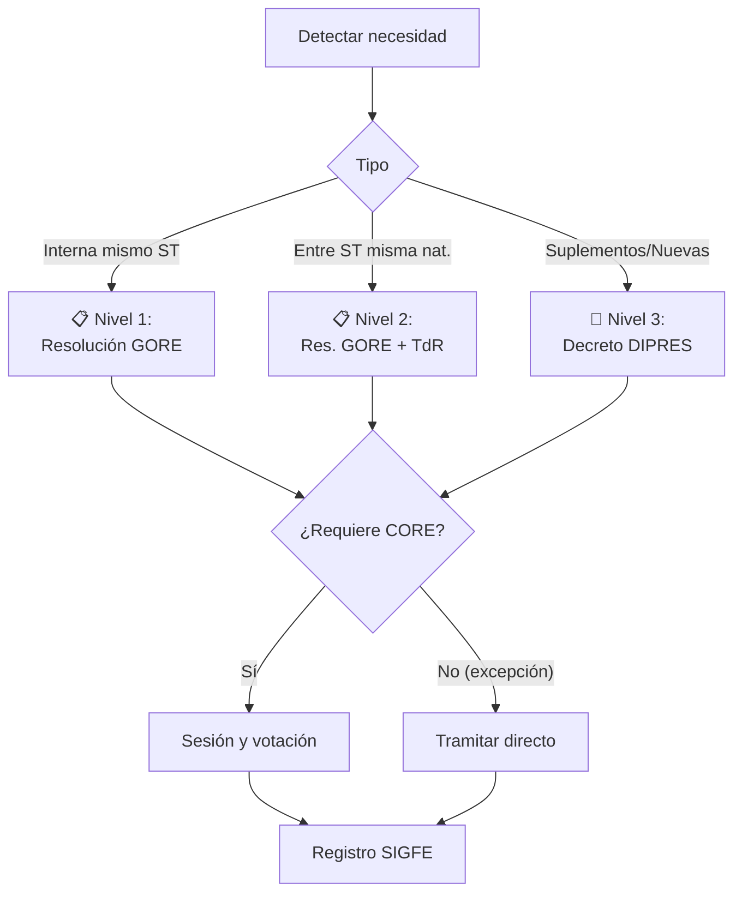

# D-FIN Subdominio: Presupuesto Regional

> Parte de: [D-FIN](../domain_d-fin.md) | [GORE_OS Blueprint](../../vision_general.md)  
> Función: Gestión estratégica del presupuesto de inversión regional

---

## ⚠️ Triángulo de Integración Presupuestaria {#cadena-presupuestaria}

> [!IMPORTANT]
> **Este módulo es parte del Triángulo de Integración con D-EJEC y D-BACK:**
> 
> ```text
>         D-FIN (Financiamiento)
>              ↕ CDP, % Ejecución
>      ┌───────────────────────┐
>      ↓                       ↓
> D-EJEC (Ejecución Física)  D-BACK (Ejecución Presupuestaria)
>      └───────EP validado────→┘
> ```

| Dominio          | Responsabilidad                                                      |
| ---------------- | -------------------------------------------------------------------- |
| **D-FIN** (este) | Distribución estratégica (ARI, CORE), monitoreo % ejecución como KPI |
| **D-EJEC**       | Validación técnica de Estados de Pago (EP), supervisión física       |
| **D-BACK**       | Cadena contable: CDP → Compromiso → Devengo → Pago en SIGFE          |

> Ver diagrama de integración completo en [D-BACK](../domain_d-back.md#integración-d-back-↔-d-fin)

---

## Ciclo Presupuestario Anual

```text
ENE-MAR: Ejecución año n
ABR-JUN: ARI (mayo)
JUL-SEP: Ley Presupuesto (agosto)
OCT-DIC: Aprobación CORE (diciembre)
ENE-DIC (n+1): Ejecución año n+1
```



---

## Cadena Presupuestaria SIGFE

> [!NOTE]
> La ejecución operativa de esta cadena se realiza en [D-BACK](../domain_d-back.md#contabilidad-operativa).
> D-FIN solicita CDP y monitorea % ejecución; D-BACK procesa.



---

## Fuentes de Capital Base

| Fuente     | Descripción                               | Ñuble 2026 (M$) |
| ---------- | ----------------------------------------- | --------------- |
| FNDR       | Fondo Nacional Desarrollo Regional        | 41.562.476      |
| FRPD       | Fondo Regional Productividad y Desarrollo | 12.829.611      |
| F. Equidad | Fondo de Equidad Interregional            | 6.353.223       |
| Transporte | Fondo de Apoyo al Transporte              | 18.790.488      |
| Propios    | Patentes mineras, código aguas            | 1.863.175       |
| SIC        | Saldo Inicial de Caja (arrastre)          | Variable        |

> Fuente: Ley 21.796 (Presupuesto 2026), Partida 31

---

## Glosas Presupuestarias 2025 (Circular 11 DIPRES)

| Glosa | Asunto                       | Restricción/Habilitación       |
| ----- | ---------------------------- | ------------------------------ |
| 01    | Distribución inicial         | 6 excepciones sin acuerdo CORE |
| 03    | Prohibiciones inversión      | No financiar ST.21 receptoras  |
| 04    | Reasignaciones               | Flexibilidad excepto ST.22     |
| 05    | Transferencias universidades | DFL N°4 de 1981                |
| 06    | Transferencias corrientes    | Gastos admin. tope 5%          |
| 07    | Subsidios 8%                 | 10% asignación directa         |
| 08    | Corporaciones art.101        | Tope 5% y 50% cofinancia       |
| 09    | ST.29 ANF                    | Reposición; 90 días transferir |
| 10    | ST.31 Iniciativas            | Normativa SNI y MDSF           |
| 11    | ST.33 Transferencias Capital | Subsidios rurales              |
| 12    | FRIL                         | <5.000 UTM sin MDSF            |
| 13    | FRPD                         | Tipologías I+D+i               |
| 14    | 3% Emergencia                | Sin acuerdo CORE               |

---

## Modificaciones Presupuestarias

### Sin Acuerdo CORE (Excepciones Glosa 01)

1. Aumentos por mayores ingresos propios
2. Incorporación de Saldos Iniciales de Caja
3. Transferencias consolidadas
4. Uso de Glosa 02 (Inciso 4) emergencias
5. Reasignaciones internas mismo subtítulo
6. Actualizaciones de tipo de cambio

### Por Nivel de Aprobación



### Subtítulos Presupuestarios

| ST  | Concepto                  | Responsable |
| --- | ------------------------- | ----------- |
| 21  | Personal                  | DAF         |
| 22  | Bienes y Servicios        | DAF         |
| 24  | Transferencias Corrientes | DAF/DIPIR   |
| 29  | Activos No Financieros    | DAF         |
| 31  | Inversión (Iniciativas)   | DIPIR       |
| 33  | Transferencias de Capital | DIPIR       |

---

## Entidades de Datos

## Entidades de Datos

| Entidad                      | Atributos Clave                                             | Relaciones        |
| :--------------------------- | :---------------------------------------------------------- | :---------------- |
| **`CDP`**                    | `numero`, `monto_solicitado`, `estado`, `fecha_vencimiento` | → IPR, Asignacion |
| `AsignacionPresupuestaria`   | `subtitulo`, `item`, `asignacion`, `saldo_vigente`          | → CDP             |
| `Compromiso`                 | `acto_administrativo`, `monto_comprometido`, `proveedor`    | → CDP             |
| `Devengo`                    | `obligacion_exigible`, `fecha_devengo`, `factura_ref`       | → Compromiso      |
| `ModificacionPresupuestaria` | `tipo` (M1/M2/M3), `monto`, `decreto_dipres`                | → Asignacion      |

> [!TIP]
> **Cadena:** CDP → Compromiso → Devengo → Pago (D-BACK)

---

## KPIs de Ejecución

| Indicador                | Fórmula                              | Meta | Responsable |
| ------------------------ | ------------------------------------ | ---- | ----------- |
| Ejecución presupuestaria | Devengado / Ppto. vigente            | ≥90% | DAF         |
| Cumplimiento ARI         | IPR ejecutadas / IPR priorizadas     | ≥80% | DIPIR       |
| Reintegros pendientes    | Monto reintegros / Total transferido | ≤2%  | DAF         |

---

## Referencias

- **Ley de Presupuestos:** [kb_gn_210_ley_presupuestos_2026_partida_31_koda.yml](file:///Users/felixsanhueza/Developer/gorenuble/knowledge/domains/gn/kb_gn_210_ley_presupuestos_2026_partida_31_koda.yml)
- **Integración D-BACK:** [domain_d-back.md#contabilidad-operativa](../domain_d-back.md#contabilidad-operativa)
- **Gestión Presupuesto:** [kb_gn_009_gestion_presupuesto_koda.yml](file:///Users/felixsanhueza/Developer/gorenuble/knowledge/domains/gn/kb_gn_009_gestion_presupuesto_koda.yml)

---

## Roles Asociados (SSOT: inventario_roles_v8.yml)

| Role Key                | Título                  | Responsabilidad Principal              |
| ----------------------- | ----------------------- | -------------------------------------- |
| jefe_dipir              | Jefe DIPIR              | Aprobación final de CDPs y estructura  |
| jefe_presupuesto        | Jefe Depto. Presupuesto | Gestión operativa del ciclo anual      |
| analista_presupuestario | Analista Presupuestario | Emisión de certificados y ajustes      |
| analista_seguimiento    | Analista Seguimiento    | Monitoreo de ejecución vs programación |

---

## Capability Bundles (SSOT: historias_usuarios_v2.yml)

### CAP-FIN-DASH-001: Dashboard de Ejecución Presupuestaria

| Atributo          | Valor                                                          |
| ----------------- | -------------------------------------------------------------- |
| **Prioridad**     | P0                                                             |
| **Beneficiarios** | 42 roles (gobernador, jefe_daf, jefe_dipir, etc.)              |
| **Criterios**     | % ejecución por división, gráfico tendencia, alertas mora >30d |

> **Como** Gobernador Regional  
> **Quiero** un dashboard ejecutivo con KPIs de ejecución FNDR, convenios y programas  
> **Para** evaluar el avance de la gestión en reuniones de gabinete

---

## Historias de Usuario (SSOT: historias_usuarios_v2.yml)

### Historias Atómicas (M5: Presupuesto Regional)

| ID                 | Role Key                | Quiero                                                       | Prioridad |
| ------------------ | ----------------------- | ------------------------------------------------------------ | --------- |
| US-DIPIR-001-02    | jefe_dipir              | aprobar CDPs digitalmente con validación automática de saldo | P0        |
| US-ANALPRES-001-01 | analista_presupuestario | registro de modificaciones presupuestarias                   | P0        |
| US-ANALPRES-001-02 | analista_presupuestario | alertas de desviaciones presupuestarias                      | P1        |

---

*Subdominio parte de D-FIN | GORE_OS Blueprint Integral v5.5*
