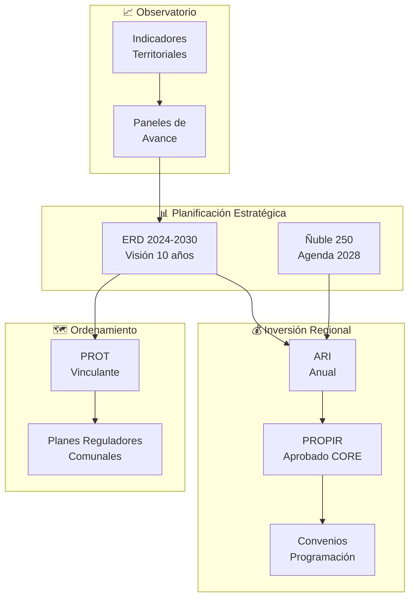
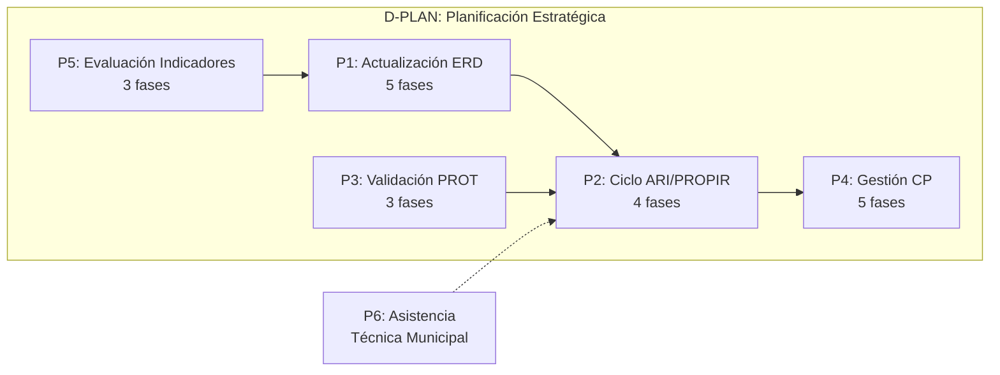
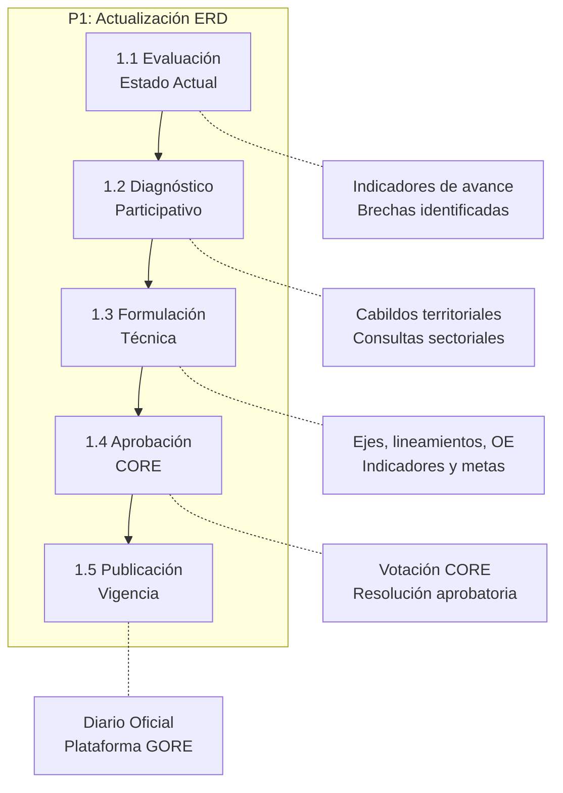
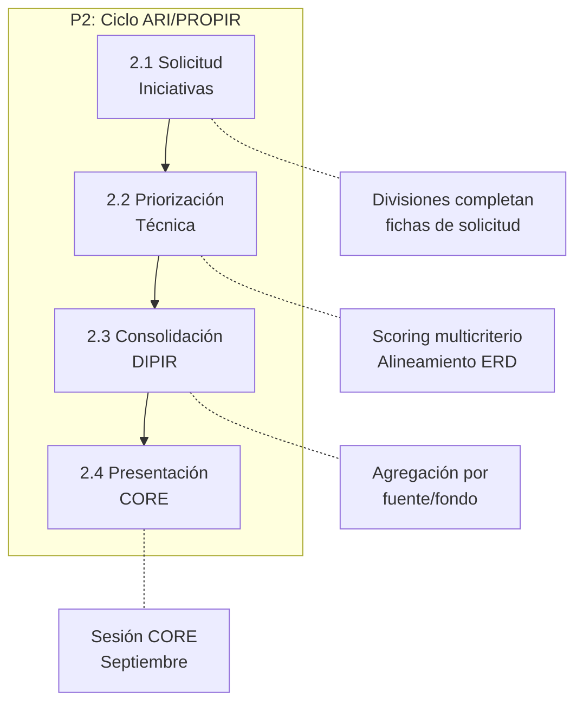
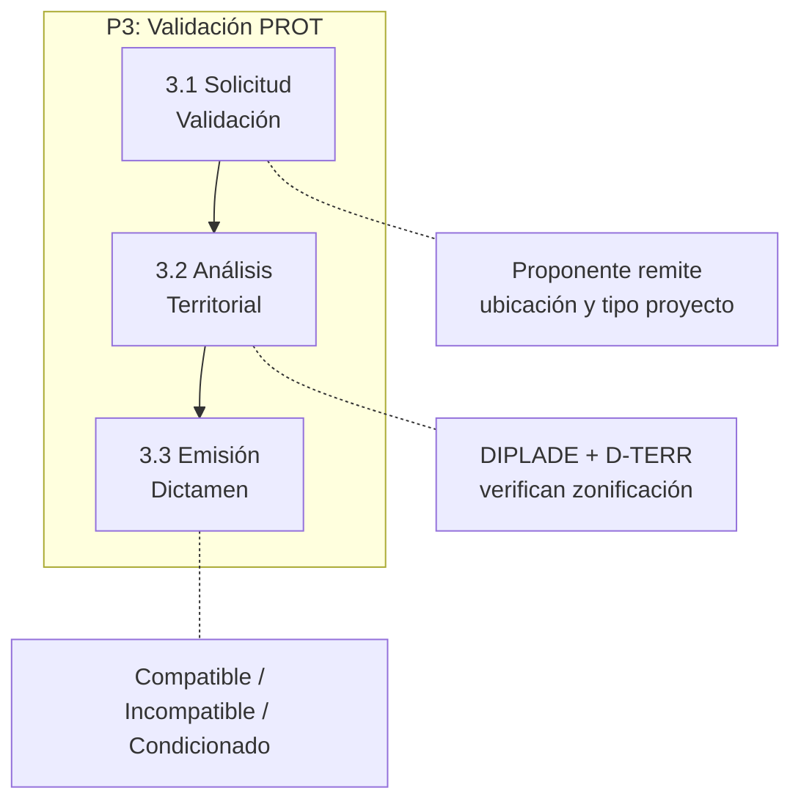
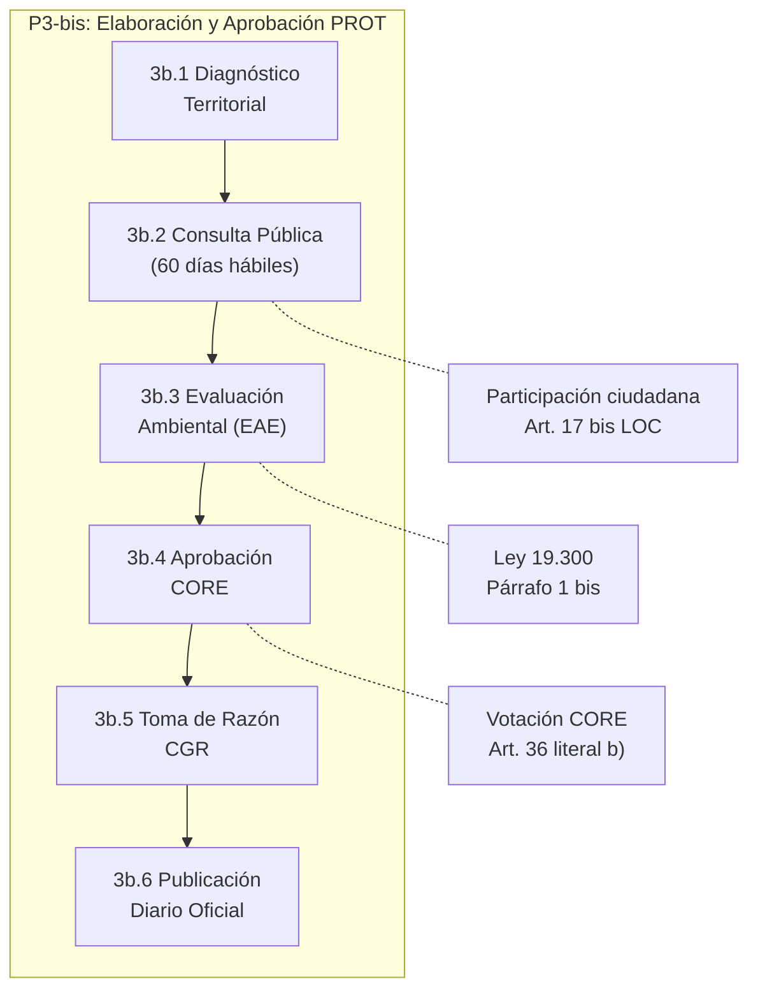
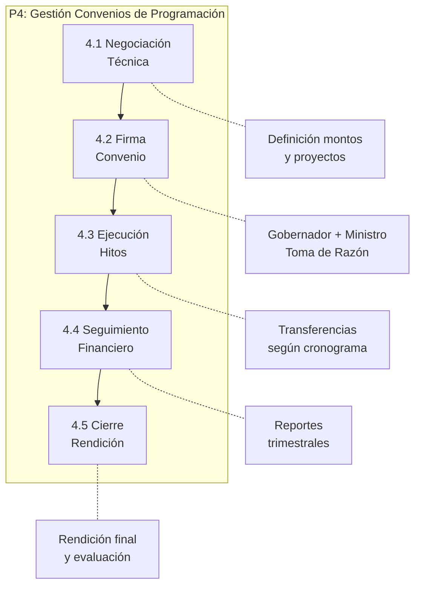
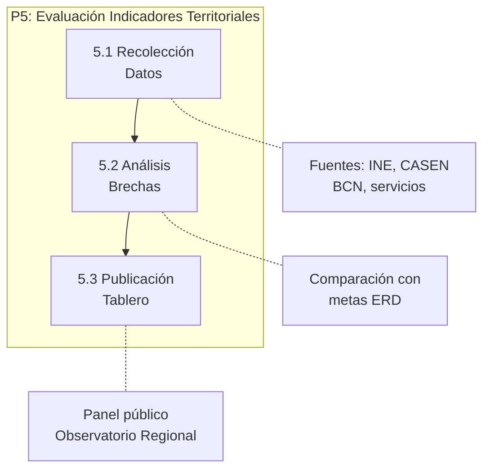
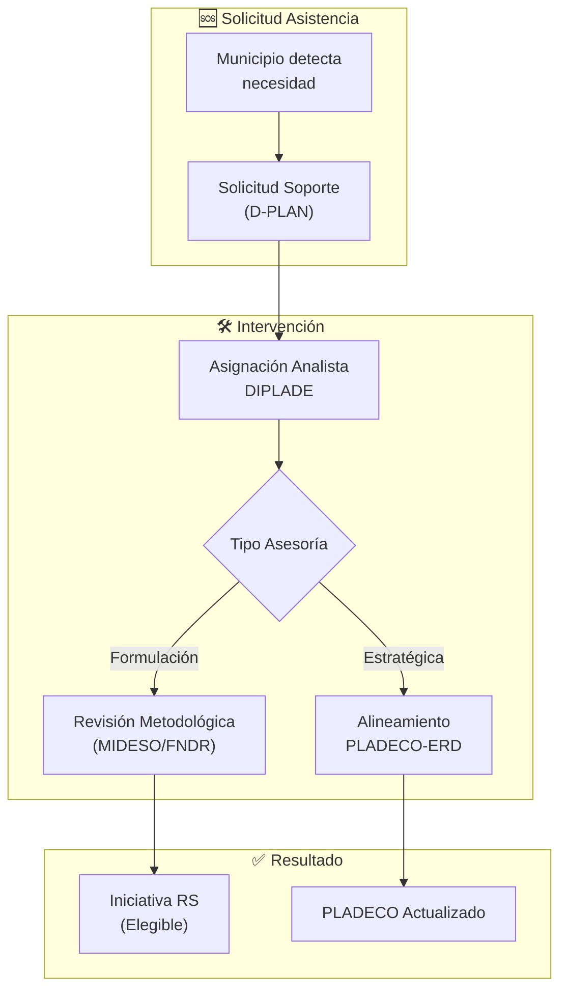
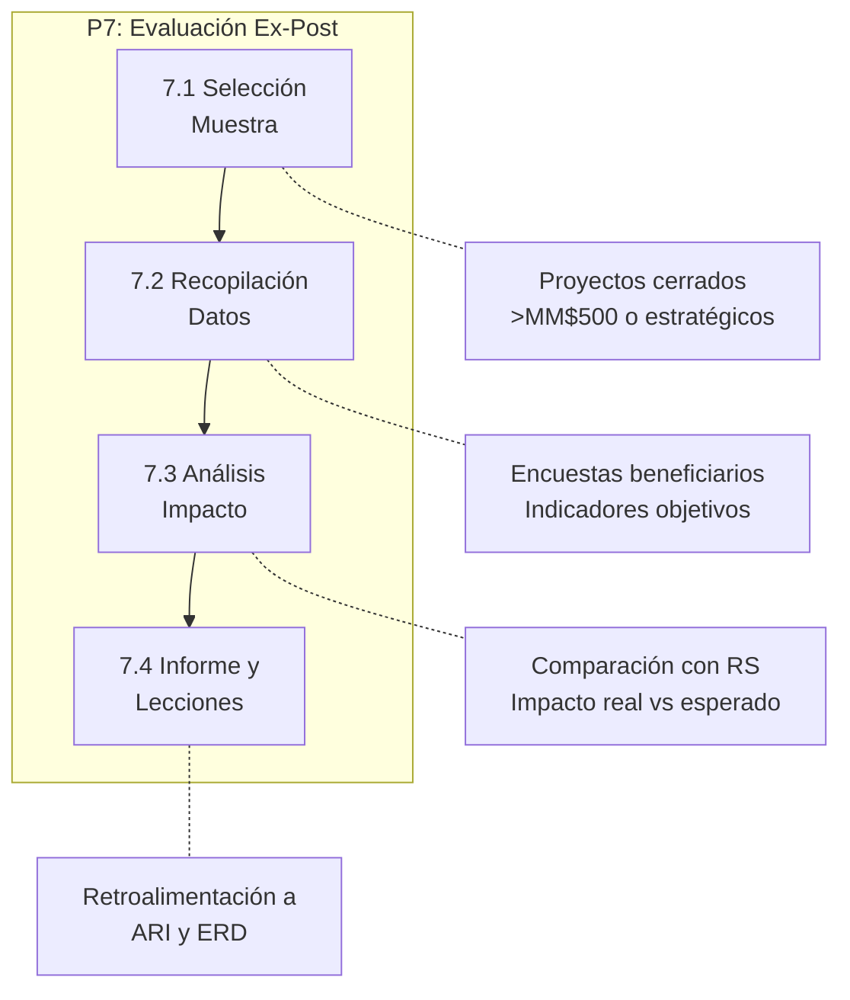

# D-PLAN: Dominio de Planificación Estratégica

> Parte de: [GORE_OS Vision General](../vision_general.md)  
> Capa: Habilitante (Dimensión Estratégica)  
> Función GORE: PLANIFICAR  
> División: DIPLADE (Planificación y Desarrollo Regional)

---

## Glosario D-PLAN

| Término                                   | Sigla   | Definición                                                                                                                                           |
| ----------------------------------------- | ------- | ---------------------------------------------------------------------------------------------------------------------------------------------------- |
| Estrategia Regional de Desarrollo         | ERD     | Instrumento de planificación de largo plazo (10 años) que define visión, ejes y objetivos estratégicos para el desarrollo regional. Art. 16 LOC GORE |
| Plan Regional de Ordenamiento Territorial | PROT    | Instrumento vinculante que orienta el uso del territorio regional mediante macrozonificación y condicionantes. Art. 17 LOC GORE                      |
| Anteproyecto Regional de Inversiones      | ARI     | Planificación presupuestaria anual que consolida iniciativas para presentación CORE (ciclo mayo-agosto)                                              |
| Programa Regional de Inversiones          | PROPIR  | Consolidación de ARI aprobada por CORE, base para ejecución presupuestaria del año siguiente                                                         |
| Convenio de Programación                  | CP      | Acuerdo plurianual entre GORE y ministerios sectoriales para financiamiento conjunto de inversiones                                                  |
| Eje Estratégico                           | EE      | Gran área de desarrollo regional definida en ERD (4-6 por estrategia)                                                                                |
| Lineamiento                               | LIN     | Orientación programática dentro de un eje estratégico (2-4 por eje)                                                                                  |
| Objetivo Estratégico                      | OE      | Meta medible vinculada a lineamiento con indicadores y metas anuales                                                                                 |
| Macrozona                                 | MZ      | División territorial mayor del PROT para regulación diferenciada (3-5 por región)                                                                    |
| PLADECO                                   | PLADECO | Plan de Desarrollo Comunal. Instrumento rector del desarrollo vecinal.                                                                               |
| SECPLA                                    | SECPLA  | Secretaría Comunal de Planificación. Unidad municipal técnica.                                                                                       |
| División de Planificación y Desarrollo    | DIPLADE | División del GORE responsable de diseñar y monitorear instrumentos de planificación                                                                  |
| Objetivos de Desarrollo Sostenible        | ODS     | Marco de 17 objetivos globales de la ONU (Agenda 2030) vinculados a las ERD.                                                                         |
| Zona de Interés Turístico                 | ZOIT    | Área declarada por SERNATUR con valor turístico especial para planificación territorial.                                                             |
| Evaluación Ambiental Estratégica          | EAE     | Procedimiento de evaluación ambiental para políticas, planes y programas (Ley 19.300 Art. 7 bis).                                                    |

---

## Propósito

Gestionar los instrumentos de planificación regional —ERD, PROT, ARI/PROPIR y Convenios de Programación— garantizando coherencia estratégica entre visión de largo plazo, ordenamiento territorial, priorización de inversiones y ejecución presupuestaria.

Fundamento Legal: LOC GORE Art. 16-21 (funciones de planificación), Art. 17 (PROT obligatorio), Art. 75-81 (fondos regionales).

---

## Diagrama de Dominio

---

## Módulos

### M1: ERD Digital

| Atributo   | Descripción                                                                               |
| ---------- | ----------------------------------------------------------------------------------------- |
| Propósito  | Gestionar la jerarquía completa de la ERD y vincular iniciativas a objetivos estratégicos |
| Estructura | ERD → Eje(5) → Lineamiento(15) → OE(96) → Indicador/Meta → Iniciativa                     |

Funcionalidades:

- Editor colaborativo de ERD (Objetivos, Lineamientos, Indicadores)
- Vinculación con ODS y Programas de Gobierno
- Repositorio documental de versiones (productos de seguridad)
- Panel de avance por eje estratégico con semáforos
- Alertas de objetivos sin iniciativas vinculadas (>180 días)

- Reportes de coherencia ERD ↔ Presupuesto ejecutado

### M2: PROT Digital

| Atributo   | Descripción                                                              |
| ---------- | ------------------------------------------------------------------------ |
| Propósito  | Gestionar zonificación territorial y validar compatibilidad de proyectos |
| Estructura | PROT → Macrozona(3-5) → Zona(n) → Uso(permitido/condicionado/prohibido)  |

Funcionalidades:

- Visor geoespacial de zonificación PROT integrado con D-TERR

- Validador automático de compatibilidad IPR ↔ Zona territorial

- Alertas de proyectos en zonas de uso incompatible
- Gestión de consulta pública (60 días hábiles) Art. 17 bis LOC
- Consulta pública de aptitud territorial para ciudadanos

### M3: ARI / PROPIR

| Atributo  | Descripción                                                               |
| --------- | ------------------------------------------------------------------------- |
| Propósito | Gestionar el ciclo anual de inversión regional                            |
| Ciclo     | Abril-Junio: solicitud → priorización → consolidación → presentación CORE |

Funcionalidades:

- Formulario digital de solicitud de iniciativas (divisiones)

- Calificación (Scoring) multicriterio de priorización (alineamiento ERD, impacto, factibilidad)

- Consolidación automática por fuente/fondo (FNDR, FRPD, ISAR - Inversión Sectorial)

- Simulación de escenarios presupuestarios

- Exportación formato DIPRES para integración nacional

### M4: Convenios de Programación

| Atributo  | Descripción                                                 |
| --------- | ----------------------------------------------------------- |
| Propósito | Gestionar acuerdos plurianuales con ministerios sectoriales |
| Tipos     | MOP, MINVU, MINSAL, CORFO, otros                            |

Funcionalidades:

- Registro de convenios con hitos y cronograma

- Seguimiento financiero (comprometido/pagado)

- Alertas de vencimiento y renovación
- Vinculación con IPR correspondientes
- Trazabilidad de Toma de Razón ante Contraloría

### M5: Observatorio Territorial

| Atributo  | Descripción                                                             |
| --------- | ----------------------------------------------------------------------- |
| Propósito | Proveer inteligencia territorial para planificación basada en evidencia |
| Fuentes   | **D-TERR P6: Observatorio Regional** (motor de datos)                   |
| Relación  | D-PLAN **consume** datos; D-TERR **produce** y publica capas temáticas  |

> [!IMPORTANT]
> Este módulo **no produce datos propios**. Consume los servicios WMS/WFS y API REST publicados por D-TERR (P6: Observatorio Regional).

Funcionalidades:

- Visualizador de capas territoriales (PROT, ZOIT, Pladecos) consumidas de D-TERR

- Análisis de solapamiento de inversiones (cruce con D-FIN)

- Generación de reportes territoriales y proyecciones

- Vinculación indicadores ↔ objetivos ERD (datos desde D-TERR: `IndicadorTerritorial`, `BrechaERD`)

- Alertas de brechas por eje estratégico

### M6: Planificación Participativa

| Atributo   | Descripción                                               |
| ---------- | --------------------------------------------------------- |
| Propósito  | Capturar y procesar insumos ciudadanos para planificación |
| Referencia | Ñuble250: 64 instancias, 2.297 participantes, 9 trazos    |

Funcionalidades:

- Registro de cabildos y consultas territoriales

- Síntesis asistida por IA de aportes ciudadanos

- Trazabilidad de propuestas ciudadanas → iniciativas
- Integración con Consejo de la Sociedad Civil (COSOC) Regional
- Reportes de participación acumulada

### M7: Apoyo a Planificación Comunal

| Atributo     | Descripción                                                           |
| ------------ | --------------------------------------------------------------------- |
| Propósito    | Transferir capacidades técnicas a municipios para mejorar cartera IPR |
| Beneficiario | SECPLAN de 21 comunas de Ñuble                                        |

Funcionalidades:

- Mesa de ayuda para formulación de iniciativas (MIDESO)

- Repositorio de proyectos tipo y buenas prácticas

- Asistente de alineamiento PLADECO ↔ ERD

- Reporte de cartera comunal en proceso

### M8: Planificación de Emergencias Regionales

| Atributo   | Descripción                                                                             |
| ---------- | --------------------------------------------------------------------------------------- |
| Propósito  | Vincular la gestión del riesgo de desastres (SENAPRED) con la planificación estratégica |
| Referencia | Ley 21.364 (SENAPRED), LOC GORE Art. 16 literal h (gestión del riesgo)                  |

Funcionalidades:

- Integración de mapas de riesgo SENAPRED con ERD y PROT
- Planificación de inversiones preventivas (infraestructura crítica)
- Coordinación con COGRID regional (ex COE)
- Simulación de impacto de desastres en objetivos ERD

---

## Procesos BPMN

### Mapa General de Procesos

---

### P1: Actualización ERD

Actores: DIPLADE, Consejeros CORE, Ciudadanía, Servicios Públicos  
Frecuencia: Ciclo decenal (práctica habitual), con actualizaciones parciales según evaluación de indicadores (Art. 16 LOC)

---

### P2: Ciclo ARI/PROPIR

Actores: Jefes de División, DIPLADE, DIPIR, CORE  
Frecuencia: Anual (mayo-agosto-septiembre)

---

### P3: Validación PROT

Actores: Proponente (división/municipio), DIPLADE, D-TERR  
Frecuencia: Por demanda

---

### P3-bis: Elaboración y Aprobación PROT

---

### P4: Gestión CP

Actores: GORE, Ministerio Sectorial, DIPIR, CGR  
Frecuencia: Plurianual (3-5 años por convenio)

---

### P5: Evaluación Indicadores

Actores: Observatorio DIPLADE, Áreas técnicas  
Frecuencia: Mensual/Trimestral

---

### P6: Asistencia Técnica Municipal

---

### P7: Evaluación Ex-Post de Proyectos

Actores: DIPLADE, D-EJEC, Observatorio  
Frecuencia: Anual (muestreo de proyectos finalizados año anterior)

---

## Catálogo por Proceso

### US Módulo ERD Digital

| ID              | Historia de Usuario                                                                                          | Prioridad |
| --------------- | ------------------------------------------------------------------------------------------------------------ | --------- |
| US-PLAN-ERD-001 | Como Analista DIPLADE quiero navegar el árbol ERD con filtros para ubicar rápidamente objetivos estratégicos | Alta      |
| US-PLAN-ERD-002 | Como Analista DIPIR quiero vincular una IPR a un objetivo ERD para garantizar alineamiento estratégico       | Alta      |
| US-PLAN-ERD-003 | Como Jefe DIPLADE quiero visualizar un panel de avance por eje para monitorear cumplimiento                  | Alta      |
| US-PLAN-ERD-004 | Como Sistema quiero alertar objetivos sin iniciativas >180 días para activar intervención FÉNIX              | Media     |
| US-PLAN-ERD-005 | Como Jefe DIPLADE quiero generar reportes coherencia ERD-Presupuesto para evaluar ejecución                  | Media     |
| US-PLAN-ERD-006 | Como DIPLADE quiero gestionar proceso de actualización ERD para cumplir ciclo decenal                        | Alta      |

---

### US Módulo PROT Digital

| ID               | Historia de Usuario                                                                                    | Prioridad |
| ---------------- | ------------------------------------------------------------------------------------------------------ | --------- |
| US-PLAN-PROT-001 | Como Analista DIPLADE quiero visualizar zonificación PROT en visor geoespacial para evaluar territorio | Alta      |
| US-PLAN-PROT-002 | Como Analista DIPLADE quiero validar compatibilidad IPR↔Zona para prevenir conflictos territoriales    | Alta      |
| US-PLAN-PROT-003 | Como Sistema quiero alertar proyectos en zonas incompatibles para bloquear avance sin revisión         | Alta      |
| US-PLAN-PROT-004 | Como Ciudadano quiero consultar aptitud territorial de un predio para orientar inversión privada       | Media     |

---

### US Módulo ARI/PROPIR

| ID              | Historia de Usuario                                                                                     | Prioridad |
| --------------- | ------------------------------------------------------------------------------------------------------- | --------- |
| US-PLAN-ARI-001 | Como Jefe de División quiero solicitar iniciativa para ARI vía formulario digital para agilizar proceso | Alta      |
| US-PLAN-ARI-002 | Como DIPLADE quiero priorizar iniciativas con scoring multicriterio para transparentar decisiones       | Alta      |
| US-PLAN-ARI-003 | Como DIPIR quiero consolidar ARI por fuente de financiamiento para presentar CORE                       | Alta      |
| US-PLAN-ARI-004 | Como Jefe DIPLADE quiero simular escenarios presupuestarios para evaluar alternativas                   | Media     |
| US-PLAN-ARI-005 | Como DIPIR quiero exportar ARI en formato DIPRES para integración con presupuesto nacional              | Alta      |

---

### US Módulo Observatorio

| ID              | Historia de Usuario                                                                           | Prioridad |
| --------------- | --------------------------------------------------------------------------------------------- | --------- |
| US-PLAN-OBS-001 | Como Analista quiero consultar indicadores territoriales por comuna para diagnóstico local    | Alta      |
| US-PLAN-OBS-002 | Como DIPLADE quiero vincular indicadores a objetivos ERD para medir avance estratégico        | Alta      |
| US-PLAN-OBS-003 | Como Sistema quiero alertar brechas por eje estratégico para priorizar intervención           | Media     |
| US-PLAN-OBS-004 | Como Observatorio quiero publicar tablero mensual de indicadores para transparencia           | Media     |
| US-PLAN-OBS-005 | Como Usuario externo quiero descargar series históricas en formato abierto para investigación | Baja      |

---

### US Módulo Participación

| ID               | Historia de Usuario                                                                                     | Prioridad |
| ---------------- | ------------------------------------------------------------------------------------------------------- | --------- |
| US-PLAN-PART-001 | Como DIPLADE quiero registrar cabildo territorial con asistencia y propuestas para documentar proceso   | Alta      |
| US-PLAN-PART-002 | Como Sistema quiero sintetizar aportes ciudadanos con IA para facilitar análisis                        | Media     |
| US-PLAN-PART-003 | Como DIPLADE quiero trazar propuesta ciudadana a iniciativa para demostrar incidencia                   | Media     |
| US-PLAN-PART-004 | Como Jefe DIPLADE quiero reportar participación acumulada por territorio para evaluar representatividad | Media     |

---

### US Módulo Apoyo Comunal

| ID              | Historia de Usuario                                                                          | Prioridad |
| --------------- | -------------------------------------------------------------------------------------------- | --------- |
| US-PLAN-MUN-001 | Como SECPLA quiero solicitar asistencia técnica para formulación de proyectos RS             | Alta      |
| US-PLAN-MUN-002 | Como Analista DIPLADE quiero acceder a repositorio de PLADECOs para verificar coherencia ERD | Alta      |
| US-PLAN-MUN-003 | Como Sistema quiero recomendar "Proyectos Tipo" a municipios según sus brechas territoriales | Media     |

---

### US Módulo CP (Convenios de Programación)

| ID             | Historia de Usuario                                                                                     | Prioridad |
| -------------- | ------------------------------------------------------------------------------------------------------- | --------- |
| US-PLAN-CP-001 | Como Analista DIPLADE quiero registrar nuevo convenio con ministerio para iniciar seguimiento formal    | Alta      |
| US-PLAN-CP-002 | Como Jefe DIPLADE quiero visualizar panel de convenios activos y sus hitos para monitorear cumplimiento | Alta      |
| US-PLAN-CP-003 | Como Sistema quiero alertar convenios a 90 días de vencimiento sin renovación para activar gestión      | Alta      |
| US-PLAN-CP-004 | Como DIPIR quiero vincular IPR a convenio de programación para trazabilidad financiera                  | Alta      |
| US-PLAN-CP-005 | Como Jefe DIPLADE quiero generar informe de ejecución CP para reunión con ministerio sectorial          | Media     |

---

## Matriz de Trazabilidad

| Proceso                    | Historias de Usuario        | Entidades                                             |
| -------------------------- | --------------------------- | ----------------------------------------------------- |
| P1: Actualización ERD      | US-PLAN-ERD-001 a 006       | ERD, EjeEstrategico, Lineamiento, ObjetivoEstrategico |
| P2: Ciclo ARI/PROPIR       | US-PLAN-ARI-001 a 005       | ARI, LineaARI, IPR                                    |
| P3: Validación PROT        | US-PLAN-PROT-001 a 004      | ZonaPROT, IPR                                         |
| P4: Gestión CP             | (4 US implícitas en D-EJEC) | ConvenioProgramacion, HitoCP                          |
| P5: Evaluación Indicadores | US-PLAN-OBS-001 a 005       | IndicadorERD, MedicionIndicador                       |
| P6: Asistencia Municipal   | US-PLAN-MUN-001 a 003       | SolicitudAsistencia, PLADECO                          |

---

## Entidades de Datos

| Entidad                | Atributos Clave                                                           | Relaciones                      |
| ---------------------- | ------------------------------------------------------------------------- | ------------------------------- |
| `ERD`                  | id, nombre, periodo_inicio, periodo_fin, estado                           | → EjeEstrategico[]              |
| `EjeEstrategico`       | id, erd_id, codigo, nombre, descripcion                                   | → Lineamiento[]                 |
| `Lineamiento`          | id, eje_id, codigo, nombre                                                | → ObjetivoEstrategico[]         |
| `ObjetivoEstrategico`  | id, lineamiento_id, codigo, nombre, indicador, meta, ods_vinculados[]     | → IPR[], ActividadEstrategica[] |
| `IndicadorERD`         | id, objetivo_id, nombre, formula, linea_base, meta, año                   | → MedicionIndicador[]           |
| `PropuestaCiudadana`   | id, cabildo_id, descripcion, estado_trazabilidad, iniciativa_vinculada_id | → CabildoTerritorial, IPR       |
| `MedicionIndicador`    | id, indicador_id, periodo, valor_real, fuente                             |                                 |
| `ZonaPROT`             | id, macrozona, tipo_uso, condiciones_vinculantes, geometria               | → Territorio                    |
| `ARI`                  | id, año, estado, fecha_presentacion, monto_total                          | → LineaARI[]                    |
| `LineaARI`             | id, ari_id, ipr_id, prioridad, monto_solicitado, monto_asignado           | → IPR                           |
| `ConvenioProgramacion` | id, ministerio, monto_total, vigencia_inicio, vigencia_fin, estado        | → HitoCP[]                      |
| `HitoCP`               | id, convenio_id, descripcion, fecha_comprometida, monto, estado           |                                 |
| `CabildoTerritorial`   | id, fecha, comuna, participantes, propuestas_count                        | → PropuestaCiudadana[]          |
| `ZUBC`                 | id, sector_costero, uso_preferente, condiciones, geometria                | Zonificación Borde Costero      |
| `ConsultaPublica`      | id, instrumento_id, tipo, fecha_inicio, fecha_fin, observaciones          | Registro Art. 17 bis LOC        |

---

## Sistemas Involucrados

| Sistema   | Rol                                        | Dominio |
| --------- | ------------------------------------------ | ------- |
| GORE OS   | Sistema central de planificación y gestión | D-PLAN  |
| IDE Ñuble | Visor geoespacial para PROT y territorios  | D-TERR  |
| SIGFE     | Integración presupuestaria nacional        | D-FIN   |
| BIP       | Banco Integrado de Proyectos (SNI)         | D-FIN   |

---

## Normativa Aplicable

| Norma                   | Artículos   | Contenido                                                               |
| ----------------------- | ----------- | ----------------------------------------------------------------------- |
| LOC GORE (DFL 1-19.175) | Art. 16     | Funciones: diseñar, elaborar, aprobar políticas, planes, programas      |
| LOC GORE                | Art. 17     | PROT obligatorio: macrozonificación, condiciones vinculantes            |
| LOC GORE                | Art. 36     | Atribuciones CORE: aprobar ERD, PROT, planes reguladores metropolitanos |
| LOC GORE                | Art. 21 bis | Transferencia de competencias en ordenamiento territorial               |
| LOC GORE                | Art. 73-79  | Fondos regionales: FNDR, ISAR (Sectorial), convenios, FRPD              |
| Ley 20.500              | -           | Participación ciudadana en gestión pública                              |

---

## Referencias Cruzadas

| Dominio   | Relación                                                                         |
| --------- | -------------------------------------------------------------------------------- |
| D-TERR    | ZonaPROT definida en IDE; visor geoespacial compartido; **P6 provee datos a M5** |
| D-FIN     | IPR vinculadas a objetivos ERD; rendiciones de convenios                         |
| D-EJEC    | Iniciativas priorizadas en ARI se ejecutan vía convenios                         |
| D-GOB     | Compromisos Gobernador vinculados a objetivos ERD                                |
| D-GESTION | OKRs institucionales alineados con ejes ERD                                      |
| D-EVOL    | Proyección de cumplimiento ERD; alimenta KB regional                             |
| D-SEG     | Política Regional Seguridad → Eje Seguridad en ERD                               |
| FÉNIX     | Objetivos ERD sin avance >180 días activan intervención Nivel III                |
| D-NORM    | Toma de Razón de PROT y CP; resoluciones aprobatorias ERD                        |
| D-TDE     | Sistemas digitales para ERD, PROT Digital; cumplimiento Ley 21.180               |

> **Nota Técnica:** D-PLAN consume la entidad `BrechaERD` generada por D-TERR (P6) para alertar desviaciones estratégicas.

---

## Indicadores D-PLAN

| KPI                                      | Descripción                                                   | Meta        |
| ---------------------------------------- | ------------------------------------------------------------- | ----------- |
| % Objetivos ERD con Iniciativa Vinculada | Proporción de OE del ERD que tienen al menos una IPR asociada | ≥ 90%       |
| % Ejecución PROPIR                       | Grado de ejecución del presupuesto aprobado en PROPIR         | ≥ 85% anual |
| Tiempo Promedio Validación PROT          | Días hábiles desde solicitud hasta dictamen de compatibilidad | ≤ 10 días   |
| % Convenios con Hitos al Día             | Proporción de CP activos sin hitos atrasados                  | ≥ 80%       |
| Participantes en Cabildos por Año        | Número acumulado de ciudadanos en instancias participativas   | ≥ 3.000     |
| % Propuestas Ciudadanas Trazadas         | Proporción de propuestas con iniciativa vinculada registrada  | ≥ 50%       |

---

## Roles Asociados (SSOT: inventario_roles_v8.yml)

| Role Key               | Título                 | Responsabilidades                |
| ---------------------- | ---------------------- | -------------------------------- |
| jefe_diplade           | Jefe DIPLADE           | Dirección planificación regional |
| analista_planificacion | Analista Planificación | Elaboración y monitoreo ERD/PROT |
| coordinador_propir     | Coordinador PROPIR     | Gestión ciclo ARI/PROPIR         |
| analista_geoespacial   | Analista Geoespacial   | Análisis territorial             |

Ver inventario completo: [inventario_roles_v8.yml](../inventario_roles_v8.yml)

---

## Historias de Usuario (SSOT: historias_usuarios_v2.yml)

D-PLAN tiene **24 historias atómicas** que abarcan:
- ERD Digital (US-PLAN-ERD-*)
- PROT Digital (US-PLAN-PROT-*)
- ARI/PROPIR (US-PLAN-ARI-*)
- Observatorio (US-PLAN-OBS-*)

Ver [historias_usuarios_v2.yml](../historias_usuarios_v2.yml) para catálogo completo.

---

## Catálogo Completo de Historias (SSOT)

> Fuente: `historias_usuarios_v2.yml` | Filtro: `target_domain: D-PLAN`  
> Total: 26 historias

| ID | Role | Descripción | P |
|-----|------|-------------|---|
| US-ANAL-PPR-001-01 | analista_ppr | un módulo de diseño de programas con marco lógico... | P1 |
| US-ANID-001-01 | representante_anid | acceso a indicadores de capital humano avanzado... | P2 |
| US-ASES-001-01 | asesor_gabinete | acceder a información consolidada de los temas que... | P2 |
| US-CORFO-001-01 | Director CORFO | información de proyectos productivos GORE... | P1 |
| US-DESC-001-02 | encargado_descentral | documentar las capacidades requeridas para cada co... | P1 |
| US-DIPLADE-001-01 | jefe_diplade | un módulo de gestión de la Estrategia Regional de ... | P0 |
| US-DIPLADE-001-02 | jefe_diplade | generar el Anteproyecto Regional de Inversiones (A... | P0 |
| US-DPR-002-01 | delegado_presidencia | reportes de inversión en seguridad pública financi... | P1 |
| US-DSEG-001-02 | jefe_seg | un registro de programas de prevención financiados... | P1 |
| US-GEN-001-01 | referente_genero | indicadores desagregados por sexo en todos los rep... | P2 |
| US-GOB-002-01 | gobernador | un registro centralizado de convenios vigentes con... | P1 |
| US-GOBPROV-001-01 | gobernacion_provinci | reportes de inversión GORE en la provincia... | P1 |
| US-INV-DEP-001-01 | jefe_inversion | priorizar proyectos en el anteproyecto regional de... | P0 |
| US-JD-PLAN-001-01 | jefe_depto_planif | un repositorio documental de estudios regionales... | P1 |
| US-JPROG-001-01 | jefe_programacion | un módulo de programación plurianual de inversione... | P0 |
| US-PMG-001-01 | coordinador_pmg | un sistema de carga de evidencias PMG descentraliz... | P1 |
| US-PO-001-01 | product_owner | herramientas para gestionar user stories y criteri... | P0 |
| US-PPERT-001-01 | presidente_comite_pe | visar el acta de pertinencia con firma digital... | P0 |
| US-PROF-N250-001-01 | profesional_nuble_25 | acceder al detalle de compromisos de mi área... | P0 |
| US-RPMG-001-01 | referente_tecnico_pm | cargar medios de verificación validados... | P1 |
| US-RRII-001-01 | encargado_rrii | un registro de convenios internacionales y proyect... | P2 |
| US-SEC-CTCI-001-01 | secretario_ctci | un módulo de gestión de sesiones del CTCI... | P1 |
| US-SER-AGR-001-01 | SEREMI Agricultura | reportes de inversión GORE en sector agrícola... | P1 |
| US-SPERT-001-01 | secretario_comite_pe | generar actas automáticas a partir de la tabla de ... | P1 |
| US-UCR-001-01 | unidad_coordinacion_ | reportes de gestión del GORE... | P1 |
| US-UF-001-01 | unidad_formuladora | obtener el código BIP de mis iniciativas... | P0 |

---

*Documento parte de GORE_OS Blueprint Integral v5.5*  
*Última actualización: 2025-12-19 | SSOT: inventario_roles_v8.yml, historias_usuarios_v2.yml*

