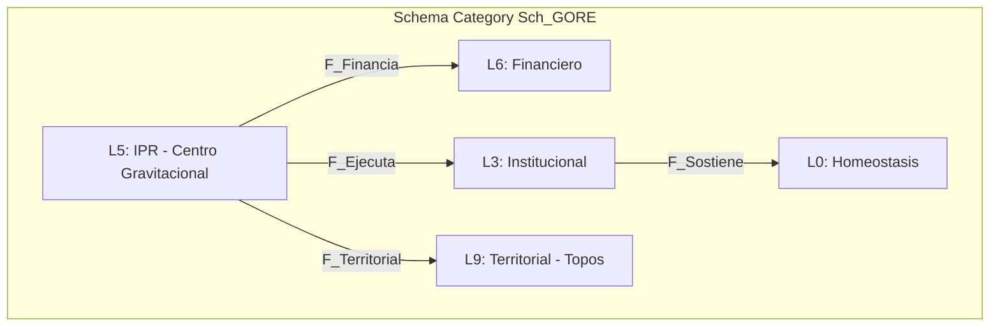

# Guía de Ingeniería Composicional — GORE OS
> **Urn**: `urn:knowledge:gore:dev-guide:composicional:3.0.0`  
> **Paradigma**: Categorical Software Engineering  
> **Ontología Base**: `data-gore/tracks/ontology/modular` v5.1.0 PHOENIX-CATEGORICAL

Esta guía define los estándares para construir el Sistema Operativo GORE como una **composición de categorías y funtores**, donde cada capa tecnológica preserva la estructura categórica del dominio.

---

## 1. Fundamentos Categóricos

### 1.1. Categoría de Dominio C_GORE

El dominio GORE se modela como una 2-categoría con:

| Componente | Definición | Cantidad |
|------------|------------|----------|
| **0-células** | Capas ontológicas (L0-L9, Lω, L∅) | 12 |
| **1-células** | Funtores entre capas | 32 |
| **2-células** | Transformaciones naturales | ~15 |
| **Objetos totales** | Entidades del dominio | ~1230 |
| **Morfismos totales** | Relaciones tipadas | ~4500 |



### 1.2. Propiedades Categóricas Preservadas

| Propiedad | Realización en Stack | Verificación |
|-----------|---------------------|--------------|
| **Límites finitos** | PostgreSQL JOINs, FKs | Compile-time + DB constraints |
| **Colímites** | Zod discriminatedUnion, JSONB | Runtime validation |
| **Clasificador Ω** | Zod schemas (χ: X → Bool) | Type inference |
| **Adjunción ORM⊣Reflect** | Drizzle schema-first | Schema = Types = Queries |
| **Coalgebras (FSM)** | XState machines | Bisimulation garantizada |

### 1.3. Pipeline Funtorial

```
Ontología YAML → Drizzle Schema → Zod Types → tRPC Routers → React/HTMX UI
     │                │               │              │              │
     ▼                ▼               ▼              ▼              ▼
  C_GORE    →    Sch_GORE    →    Types    →    Procs    →    Views
            Δ/Σ/Π            infer         F_API         F_UI
```

Cada flecha es un **funtor** que preserva estructura:
- `Δ` (pullback): Migraciones backwards-compatible
- `Σ` (pushout): Agregaciones y vistas materializadas  
- `F_API`: Procedimientos tipados end-to-end
- `F_UI`: Proyección isomorfa del estado

---

## 2. Stack Tecnológico

### 2.1. Decisiones y Justificación Categórica

| Capa | Tecnología | Justificación Categórica |
|------|------------|--------------------------|
| **Runtime** | Bun 1.x | TypeScript nativo, tipos preservados en runtime |
| **Framework** | Hono | Middlewares composicionales `(ctx) → ctx'` |
| **API** | tRPC v11 | Funtores tipados `Input → Output` end-to-end |
| **Validación** | Zod | Clasificador Ω: `χ: X → Bool` con inferencia |
| **ORM** | Drizzle | Adjunción `ORM⊣Reflect` verificable, schema-first |
| **FSM** | XState v5 | Coalgebras `c: Estado → F(Estado)` formales |
| **DB** | PostgreSQL 16 | Preserva límites finitos (JOINs, FKs, UNIQUE) |
| **Geo** | PostGIS 3.4 | Topos de Sheaves para L9 Territorial |
| **Cache** | Redis (opcional) | Colímites materializados |
| **Monorepo** | Turborepo | Composición de paquetes como funtores |

### 2.2. Decisiones de NO Usar

| Tecnología | Razón de Exclusión |
|------------|-------------------|
| **MongoDB/NoSQL** | Pierde morfismos (FKs). Modelo GORE es altamente relacional (~4500 morfismos) |
| **GraphQL** | Over-engineering para sistema interno. N+1 problems. tRPC ofrece mejor DX |
| **Prisma** | Query engine opaco. Drizzle es más transparente y preserva adjunción |
| **Express** | Legacy. Hono es más rápido y composicional |

### 2.3. Estructura del Monorepo

```
gore-os/
├── apps/
│   ├── api/                 # Hono + tRPC server
│   │   ├── src/
│   │   │   ├── routers/     # F_API: Domain → Procedures
│   │   │   ├── services/    # Lógica de negocio
│   │   │   └── index.ts
│   │   └── package.json
│   │
│   └── web/                 # Frontend (React/Next.js o HTMX)
│       ├── src/
│       └── package.json
│
├── packages/
│   ├── core/                # Dominio puro (sin I/O)
│   │   ├── domain/          # Entidades, Value Objects
│   │   ├── fsm/             # XState machines (coalgebras)
│   │   └── schemas/         # Zod schemas (clasificador Ω)
│   │
│   ├── db/                  # Capa de persistencia
│   │   ├── schema/          # Drizzle tables (Sch_GORE)
│   │   ├── repositories/    # Coalgebras de acceso
│   │   └── migrations/      # Funtores Δ/Σ/Π
│   │
│   └── config/              # Configuración compartida
│       ├── eslint/
│       ├── typescript/
│       └── tailwind/
│
├── turbo.json
├── package.json
└── bun.lockb
```

### 2.4. Frontend (Opción Híbrida)

El frontend puede ser:

**Opción A: HTMX + Alpine (Hypermedia-driven)**
- Servidor renderiza HTML, HTMX sincroniza parciales
- Ideal para formularios y flujos lineales
- Menor complejidad de estado en cliente

**Opción B: React + tRPC Client (SPA)**
- Type-safety completa client-server
- Ideal para dashboards interactivos
- React Query para cache y optimistic updates

**Recomendación**: Híbrido. HTMX para módulos CRUD simples, React para dashboards complejos (CORE, AR, GR).

### 2.5. Infraestructura

| Componente | Tecnología | Propósito |
|------------|------------|-----------|
| **Containers** | Docker Compose | Desarrollo local |
| **DB Dev** | `postgres:16-alpine` + `postgis/postgis:16-3.4-alpine` | Base de datos |
| **Quality** | Vitest + Biome | Tests + Linting |
| **CI/CD** | GitHub Actions | Automatización |
| **Deploy** | Railway / Fly.io / VPS | Hosting (TBD) |

---

## 3. Workflow de Desarrollo

### 3.1. Setup Inicial

```bash
# Clonar e instalar
git clone git@github.com:gore-nuble/gore-os.git
cd gore-os
bun install

# Levantar infraestructura
docker compose up -d  # PostgreSQL + PostGIS + Redis

# Aplicar migraciones
bun run db:migrate

# Desarrollo
bun run dev  # Inicia api + web en paralelo
```

### 3.2. Ciclo de Implementación Composicional

Para añadir una feature, siga el **flujo funtorial**:

```
1. Ontología → 2. Schema → 3. Domain → 4. Repository → 5. Router → 6. UI
```

#### Paso 1: Verificar Ontología
¿Existe la entidad en `data-gore/tracks/ontology/modular`?
- **Sí**: Continuar
- **No**: Coordinar cambio en ontología primero

#### Paso 2: Schema (Drizzle)
```typescript
// packages/db/schema/ipr.ts
import { pgTable, varchar, integer, pgEnum } from 'drizzle-orm/pg-core'

export const tipoIPREnum = pgEnum('tipo_ipr', ['IDI', 'PPR'])

export const iniciativas = pgTable('ipr_iniciativa', {
  codigoBip: varchar('codigo_bip', { length: 20 }).primaryKey(),
  tipo: tipoIPREnum('tipo').notNull(),
  monto: integer('monto'),
})
```

#### Paso 3: Domain (Zod + Types)
```typescript
// packages/core/domain/ipr.ts
import { z } from 'zod'

export const IPRSchema = z.object({
  codigoBip: z.string().length(8),
  tipo: z.enum(['IDI', 'PPR']),
  monto: z.number().positive(),
})

export type IPR = z.infer<typeof IPRSchema>
```

#### Paso 4: Repository (Coalgebra)
```typescript
// packages/db/repositories/ipr.ts
import { eq } from 'drizzle-orm'
import { db } from '../client'
import { iniciativas } from '../schema/ipr'

export const iprRepository = {
  findByBip: (bip: string) => 
    db.select().from(iniciativas).where(eq(iniciativas.codigoBip, bip)),
  
  create: (data: NewIPR) => 
    db.insert(iniciativas).values(data).returning(),
}
```

#### Paso 5: Router (Funtor F_API)
```typescript
// apps/api/src/routers/ipr.ts
import { z } from 'zod'
import { router, publicProcedure, protectedProcedure } from '../trpc'
import { IPRSchema } from '@gore-os/core/domain/ipr'
import { iprRepository } from '@gore-os/db/repositories/ipr'

export const iprRouter = router({
  get: publicProcedure
    .input(z.object({ bip: z.string() }))
    .query(({ input }) => iprRepository.findByBip(input.bip)),
  
  create: protectedProcedure
    .input(IPRSchema)
    .mutation(({ input }) => iprRepository.create(input)),
})
```

#### Paso 6: UI (Proyección)
```tsx
// apps/web/src/pages/ipr/[bip].tsx (React)
import { trpc } from '@/utils/trpc'

export default function IPRPage({ params }: { params: { bip: string } }) {
  const { data: ipr } = trpc.ipr.get.useQuery({ bip: params.bip })
  
  if (!ipr) return <Loading />
  return <IPRCard ipr={ipr} />
}
```

### 3.3. Reglas de Oro

| Regla | Descripción |
|-------|-------------|
| **Schema First** | Drizzle schema es la fuente de verdad para tipos |
| **Validate at Boundary** | Zod valida en entrada de tRPC, no en dominio interno |
| **Pure Core** | `packages/core` no tiene I/O. Solo tipos y lógica pura |
| **No Raw SQL** | Todo query pasa por Drizzle (preserva adjunción) |
| **FSM Explícita** | Estados de entidades viven en XState, no en flags booleanos |

---

## 4. Estándares de Código

### 4.1. TypeScript Estricto

```json
// tsconfig.json base
{
  "compilerOptions": {
    "strict": true,
    "noUncheckedIndexedAccess": true,
    "noImplicitReturns": true,
    "exactOptionalPropertyTypes": true
  }
}
```

**Reglas de Tipos**:

| Regla | Malo | Bueno |
|-------|------|-------|
| **IDs** | `id: string` | `id: UUID` (branded type) |
| **Enums** | `estado: string` | `estado: EstadoIPR` (union literal) |
| **Nulls** | `return null` | `return Option<T>` o throw |
| **Arrays** | `items: any[]` | `items: readonly IPR[]` |

```typescript
// Branded Types para IDs
declare const __brand: unique symbol
type Brand<T, B> = T & { [__brand]: B }

type CodigoBIP = Brand<string, 'CodigoBIP'>
type RUT = Brand<string, 'RUT'>

// Uso
const bip: CodigoBIP = '40058688' as CodigoBIP
```

### 4.2. Zod como Clasificador Ω

Zod implementa la función característica `χ: X → Ω`:

```typescript
// χ_IPR: any → IPR | Error
const result = IPRSchema.safeParse(input)

if (result.success) {
  // result.data tiene tipo IPR
  const ipr: IPR = result.data
} else {
  // result.error tiene ZodError con detalles
  console.error(result.error.issues)
}
```

**Patrones Zod**:

```typescript
// Coproducto (Discriminated Union)
const TipoIPRSchema = z.discriminatedUnion('_tag', [
  z.object({ _tag: z.literal('IDI'), codigoBip: z.string(), subtitulo: z.literal(31) }),
  z.object({ _tag: z.literal('PPR'), codigoBip: z.string(), subtitulo: z.literal(24) }),
])

// Refinamiento (Invariante)
const MontoPositivo = z.number().positive().refine(
  (n) => n <= 10_000_000_000, 
  { message: 'Monto excede límite legal' }
)

// Transform (Morfismo)
const RUTSchema = z.string()
  .transform((s) => s.replace(/\./g, '').toUpperCase())
  .refine(validarRUT, { message: 'RUT inválido' })
```

### 4.3. XState como Coalgebra

Las FSM se definen formalmente como coalgebras `c: Estado → F(Estado)`:

```typescript
// packages/core/fsm/ipr-machine.ts
import { setup, assign } from 'xstate'

export const iprMachine = setup({
  types: {
    context: {} as { 
      codigoBip: string
      monto: number
      observaciones: string[]
    },
    events: {} as 
      | { type: 'EVALUAR_PRE' }
      | { type: 'ADMITIR' }
      | { type: 'RECHAZAR'; motivo: string }
      | { type: 'ENVIAR_MDSF' }
      | { type: 'RECIBIR_RS' }
      | { type: 'RECIBIR_FI'; observaciones: string[] }
  },
}).createMachine({
  id: 'ipr',
  initial: 'postulada',
  context: { codigoBip: '', monto: 0, observaciones: [] },
  states: {
    postulada: {
      on: { EVALUAR_PRE: 'preAdmisible' }
    },
    preAdmisible: {
      on: { 
        ADMITIR: 'admisible',
        RECHAZAR: 'inadmisible'
      }
    },
    admisible: {
      on: { ENVIAR_MDSF: 'enEvaluacionMDSF' }
    },
    enEvaluacionMDSF: {
      on: {
        RECIBIR_RS: 'conRS',
        RECIBIR_FI: {
          target: 'conFI',
          actions: assign({ 
            observaciones: ({ event }) => event.observaciones 
          })
        }
      }
    },
    conRS: { /* ... */ },
    conFI: { /* ... */ },
    inadmisible: { type: 'final' },
    // ... 24 estados totales
  }
})
```

### 4.4. Error Handling

No usar `try/catch` dispersos. Usar `Result<T, E>`:

```typescript
// packages/core/utils/result.ts
type Result<T, E> = 
  | { ok: true; value: T }
  | { ok: false; error: E }

const Ok = <T>(value: T): Result<T, never> => ({ ok: true, value })
const Err = <E>(error: E): Result<never, E> => ({ ok: false, error })

// Uso en servicios
async function crearIPR(input: CreateIPRInput): Promise<Result<IPR, IPRError>> {
  const validation = IPRSchema.safeParse(input)
  if (!validation.success) {
    return Err({ type: 'VALIDATION_ERROR', issues: validation.error.issues })
  }
  
  try {
    const ipr = await iprRepository.create(validation.data)
    return Ok(ipr)
  } catch (e) {
    return Err({ type: 'DB_ERROR', cause: e })
  }
}
```

---

## 5. FSM del Dominio (Coalgebras Principales)

### 5.1. FSM de IPR — 24 Estados

```
POSTULADA → PRE_ADMISIBLE → EN_ADMISIBILIDAD → ADMISIBLE → EN_EVALUACION_MDSF
                                                    ↓
                        ┌───────────────────────────┼───────────────────────────┐
                        ↓                           ↓                           ↓
                     CON_RS                      CON_FI                      CON_OT
                        ↓                           ↓                           ↓
                  EN_CARTERA ←──────────────── SUBSANADA ←────────────────── SUBSANADA
                        ↓
                  PRIORIZADA → EN_FINANCIAMIENTO → EN_FORMALIZACION → EN_EJECUCION
                                                                            ↓
                                                              EN_CIERRE → CERRADA
```

### 5.2. FSM de Rendición — 9 Estados

```
PENDIENTE → EN_REVISION_RTF → APROBADA_RTF → EN_FIRMA_DAF → APROBADA → CONTABILIZADA
                ↓
           OBSERVADA → EN_SUBSANACION → (vuelve a EN_REVISION_RTF)
                ↓
           RECHAZADA
```

### 5.3. FSM de Convenio — 7 Estados

```
ELABORACION → EN_VISACION → EN_TDR → VIGENTE → EN_CIERRE → TERMINADO
                                        ↓
                                   EN_PRORROGA
```

---

## 6. Invariantes del Sistema

Invariantes críticos que deben verificarse (de `verificacion.yaml`):

### 6.1. Invariantes Financieros (CRITICAL)

| ID | Nombre | Fórmula | Verificación |
|----|--------|---------|--------------|
| `INV_FIN_01` | Balance presupuestario | `Σ(ingresos) = Σ(gastos) + saldo` | por_transaccion |
| `INV_FIN_02` | CDP ≤ disponibilidad | `∀cdp. cdp.monto ≤ asignacion.disponible` | por_transaccion |
| `INV_FIN_03` | Cuotas = Convenio | `∀conv. Σ(cuotas.monto) = conv.monto_total` | por_transaccion |

### 6.2. Invariantes de Estado (CRITICAL)

| ID | Nombre | Fórmula | Verificación |
|----|--------|---------|--------------|
| `INV_FSM_01` | Transición válida | `∀ipr. transicion ∈ FSM.transiciones_permitidas` | por_transaccion |
| `INV_FSM_02` | Estado consistente | `∀ipr. estado_db = estado_fsm` | batch_diario |

### 6.3. Invariantes de Activos (CRITICAL)

| ID | Nombre | Fórmula | Verificación |
|----|--------|---------|--------------|
| `INV_L0A_02` | Conservación stock | `stock = Σ(ingresos) - Σ(egresos) + Σ(ajustes)` | por_transaccion |
| `INV_L0A_03` | Stock no negativo | `∀item. stock ≥ 0` | por_transaccion |
| `INV_L0A_04` | Km monotónico | `∀v,t1<t2. km(v,t1) ≤ km(v,t2)` | por_transaccion |

---

## 7. Observabilidad y Auditoría

### 7.1. Logging Estructurado

```typescript
// packages/core/utils/logger.ts
import { pino } from 'pino'

export const logger = pino({
  level: process.env.LOG_LEVEL || 'info',
  formatters: {
    level: (label) => ({ level: label }),
  },
})

// Uso con contexto
logger.info({ 
  morfismo: 'iprRepository.create',
  input: { codigoBip: '40058688' },
  duracion_ms: 45
}, 'IPR creada')
```

### 7.2. Tracing de Morfismos

Cada operación debe registrar:
- **Morfismo**: Nombre de la función/procedimiento
- **Input**: Datos de entrada (sanitizados)
- **Output**: Resultado o error
- **Duración**: Tiempo de ejecución
- **Actor**: Usuario que ejecutó

### 7.3. Métricas Categóricas

| Métrica | Descripción |
|---------|-------------|
| `gore_morfismo_duracion_ms` | Histograma de duración por morfismo |
| `gore_invariante_violaciones` | Contador de violaciones por invariante |
| `gore_fsm_transiciones` | Contador de transiciones por estado origen/destino |
| `gore_api_requests` | Contador de requests por procedimiento tRPC |

---

## 8. Checklist Pre-Merge

Antes de hacer merge a `main`:

- [ ] **Ontología**: Entidad existe en `data-gore/tracks/ontology/modular`
- [ ] **Schema**: Tabla definida en Drizzle con FKs correctas
- [ ] **Tipos**: Zod schema con validaciones e inferencia
- [ ] **Tests**: Vitest tests para happy path + edge cases
- [ ] **FSM**: Si tiene estados, definida en XState
- [ ] **Invariantes**: Verificaciones relevantes implementadas
- [ ] **Docs**: Comentarios en código para lógica no obvia
- [ ] **Lint**: `bun run lint` pasa sin errores
- [ ] **Types**: `bun run typecheck` pasa sin errores

---

> **Certificación**: Este documento representa la visión del Agente Ingeniero de Software Composicional (v3.0.0).  
> **Última actualización**: 2025-01-XX  
> **Stack**: Bun + Hono + tRPC + Drizzle + XState + PostgreSQL
