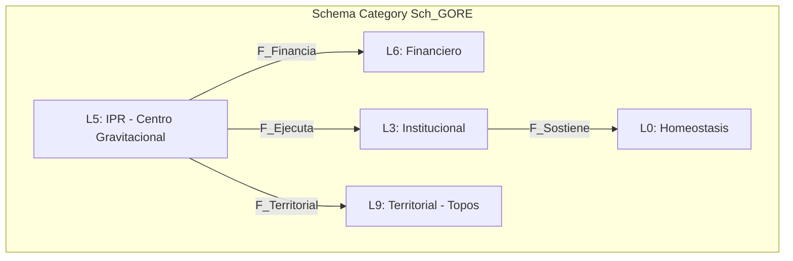

# Guía de Ingeniería Composicional — GORE OS

> **Urn**: `urn:knowledge:gore:dev-guide:composicional:3.1.0`  
> **Paradigma**: Categorical Software Engineering  
> **Ontología Base**: [`data-gore/ontology`](file:///Users/felixsanhueza/fx_felixiando/data-gore/ontology) v6.0.0 PRIMARCH-EMERGENCE  
> **Ver también**: [README Índice](README.md) | [Especificación de Sistema](diseno_gore_os.md) | [Roadmap](roadmap.md)

Esta guía define los estándares para construir el Sistema Operativo GORE como una **composición de categorías y funtores**, donde cada capa tecnológica preserva la estructura categórica del dominio.

## 1. Fundamentos Categóricos

### 1.1. Categoría de Dominio C_GORE

El dominio GORE se modela como una 2-categoría con:

| Componente            | Definición                        | Cantidad |
| --------------------- | --------------------------------- | -------- |
| **0-células**         | Capas ontológicas (L0-L9, Lω, L∅) | 12       |
| **1-células**         | Funtores entre capas              | 32       |
| **2-células**         | Transformaciones naturales        | ~15      |
| **Objetos totales**   | Entidades del dominio             | ~1230    |
| **Morfismos totales** | Relaciones tipadas                | ~4500    |



### 1.2. Propiedades Categóricas Preservadas

| Propiedad                 | Realización en Stack          | Verificación                  |
| ------------------------- | ----------------------------- | ----------------------------- |
| **Límites finitos**       | PostgreSQL JOINs, FKs         | Compile-time + DB constraints |
| **Colímites**             | Zod discriminatedUnion, JSONB | Runtime validation            |
| **Clasificador Ω**        | Zod schemas (χ: X → Bool)     | Type inference                |
| **Adjunción ORM⊣Reflect** | Drizzle schema-first          | Schema = Types = Queries      |
| **Coalgebras (FSM)**      | XState machines               | Bisimulation garantizada      |

### 1.3. Pipeline Funtorial

```
Ontología YAML → Drizzle Schema → Zod Types → tRPC Routers → React/HTMX UI
     │                │               │              │              │
     ▼                ▼               ▼              ▼              ▼
  C_GORE    →    Sch_GORE    →    Types    →    Procs    →    Views
            Δ/Σ/Π            infer         F_API         F_UI
```

Cada flecha es un **funtor** que preserva estructura:
- `Δ` (pullback): Migraciones backwards-compatible
- `Σ` (pushout): Agregaciones y vistas materializadas  
- `F_API`: Procedimientos tipados end-to-end
- `F_UI`: Proyección isomorfa del estado

---

## 2. Stack Tecnológico

### 2.1. Decisiones y Justificación Categórica

| Capa           | Tecnología       | Justificación Categórica                          |
| -------------- | ---------------- | ------------------------------------------------- |
| **Runtime**    | Bun 1.x          | TypeScript nativo, tipos preservados en runtime   |
| **Framework**  | Hono             | Middlewares composicionales `(ctx) → ctx'`        |
| **API**        | tRPC v11         | Funtores tipados `Input → Output` end-to-end      |
| **Validación** | Zod              | Clasificador Ω: `χ: X → Bool` con inferencia      |
| **ORM**        | Drizzle          | Adjunción `ORM⊣Reflect` verificable, schema-first |
| **FSM**        | XState v5        | Coalgebras `c: Estado → F(Estado)` formales       |
| **DB**         | PostgreSQL 16    | Preserva límites finitos (JOINs, FKs, UNIQUE)     |
| **Geo**        | PostGIS 3.4      | Topos de Sheaves para L9 Territorial              |
| **Cache**      | Redis (opcional) | Colímites materializados                          |
| **Monorepo**   | Turborepo        | Composición de paquetes como funtores             |

### 2.2. Decisiones de NO Usar

| Tecnología        | Razón de Exclusión                                                            |
| ----------------- | ----------------------------------------------------------------------------- |
| **MongoDB/NoSQL** | Pierde morfismos (FKs). Modelo GORE es altamente relacional (~4500 morfismos) |
| **GraphQL**       | Over-engineering para sistema interno. N+1 problems. tRPC ofrece mejor DX     |
| **Prisma**        | Query engine opaco. Drizzle es más transparente y preserva adjunción          |
| **Express**       | Legacy. Hono es más rápido y composicional                                    |

### 2.3. Estructura del Monorepo

```
gore-os/
├── apps/
│   ├── api/                 # Hono + tRPC server
│   │   ├── src/
│   │   │   ├── routers/     # F_API: Domain → Procedures
│   │   │   ├── services/    # Lógica de negocio
│   │   │   └── index.ts
│   │   └── package.json
│   │
│   └── web/                 # Frontend (React/Next.js o HTMX)
│       ├── src/
│       └── package.json
│
├── packages/
│   ├── core/                # Dominio puro (sin I/O)
│   │   ├── domain/          # Entidades, Value Objects
│   │   ├── fsm/             # XState machines (coalgebras)
│   │   └── schemas/         # Zod schemas (clasificador Ω)
│   │
│   ├── db/                  # Capa de persistencia
│   │   ├── schema/          # Drizzle tables (Sch_GORE)
│   │   ├── repositories/    # Coalgebras de acceso
│   │   └── migrations/      # Funtores Δ/Σ/Π
│   │
│   └── config/              # Configuración compartida
│       ├── eslint/
│       ├── typescript/
│       └── tailwind/
│
├── turbo.json
├── package.json
└── bun.lockb
```

### 2.4. Frontend (Opción Híbrida)

El frontend puede ser:

**Opción A: HTMX + Alpine (Hypermedia-driven)**
- Servidor renderiza HTML, HTMX sincroniza parciales
- Ideal para formularios y flujos lineales
- Menor complejidad de estado en cliente

**Opción B: React + tRPC Client (SPA)**
- Type-safety completa client-server
- Ideal para dashboards interactivos
- React Query para cache y optimistic updates

**Recomendación**: Híbrido. HTMX para módulos CRUD simples, React para dashboards complejos (CORE, AR, GR).

### 2.5. Infraestructura

| Componente     | Tecnología               | Propósito                     |
| -------------- | ------------------------ | ----------------------------- |
| **Containers** | Docker Compose v2        | Desarrollo local + producción |
| **DB Dev**     | `postgis/postgis:16-3.4` | Base de datos + geo           |
| **Cache**      | Redis 7 Alpine           | Queue + Cache                 |
| **Auth**       | Keycloak 24              | Identity Provider (SSO)       |
| **Quality**    | Vitest + Biome           | Tests + Linting               |
| **CI/CD**      | GitHub Actions           | Automatización                |
| **Deploy**     | Docker Swarm / K8s       | Producción (TBD)              |

> 📦 Ver configuración completa de Docker en [diseno_gore_os.md §0.4](diseno_gore_os.md#04-docker-compose-desarrollo)

---

## 3. Workflow de Desarrollo

### 3.1. Setup Inicial

```bash
# Clonar e instalar
git clone git@github.com:gore-nuble/gore-os.git
cd gore-os
bun install

# Levantar infraestructura
docker compose up -d  # PostgreSQL + PostGIS + Redis

# Aplicar migraciones
bun run db:migrate

# Desarrollo
bun run dev  # Inicia api + web en paralelo
```

### 3.2. Ciclo de Implementación Composicional

Para añadir una feature, siga el **flujo funtorial**:

```
1. Ontología → 2. Schema → 3. Domain → 4. Repository → 5. Router → 6. UI
```

#### Paso 1: Verificar Ontología
¿Existe la entidad en `data-gore/tracks/ontology/modular`?
- **Sí**: Continuar
- **No**: Coordinar cambio en ontología primero

#### Paso 2: Schema (Drizzle)
```typescript
// packages/db/schema/ipr.ts
import { pgTable, varchar, integer, pgEnum } from 'drizzle-orm/pg-core'

export const tipoIPREnum = pgEnum('tipo_ipr', ['IDI', 'PPR'])

export const iniciativas = pgTable('ipr_iniciativa', {
  codigoBip: varchar('codigo_bip', { length: 20 }).primaryKey(),
  tipo: tipoIPREnum('tipo').notNull(),
  monto: integer('monto'),
})
```

#### Paso 3: Domain (Zod + Types)
```typescript
// packages/core/domain/ipr.ts
import { z } from 'zod'

export const IPRSchema = z.object({
  codigoBip: z.string().length(8),
  tipo: z.enum(['IDI', 'PPR']),
  monto: z.number().positive(),
})

export type IPR = z.infer<typeof IPRSchema>
```

#### Paso 4: Repository (Coalgebra)
```typescript
// packages/db/repositories/ipr.ts
import { eq } from 'drizzle-orm'
import { db } from '../client'
import { iniciativas } from '../schema/ipr'

export const iprRepository = {
  findByBip: (bip: string) => 
    db.select().from(iniciativas).where(eq(iniciativas.codigoBip, bip)),
  
  create: (data: NewIPR) => 
    db.insert(iniciativas).values(data).returning(),
}
```

#### Paso 5: Router (Funtor F_API)
```typescript
// apps/api/src/routers/ipr.ts
import { z } from 'zod'
import { router, publicProcedure, protectedProcedure } from '../trpc'
import { IPRSchema } from '@gore-os/core/domain/ipr'
import { iprRepository } from '@gore-os/db/repositories/ipr'

export const iprRouter = router({
  get: publicProcedure
    .input(z.object({ bip: z.string() }))
    .query(({ input }) => iprRepository.findByBip(input.bip)),
  
  create: protectedProcedure
    .input(IPRSchema)
    .mutation(({ input }) => iprRepository.create(input)),
})
```

#### Paso 6: UI (Proyección)
```tsx
// apps/web/src/pages/ipr/[bip].tsx (React)
import { trpc } from '@/utils/trpc'

export default function IPRPage({ params }: { params: { bip: string } }) {
  const { data: ipr } = trpc.ipr.get.useQuery({ bip: params.bip })
  
  if (!ipr) return <Loading />
  return <IPRCard ipr={ipr} />
}
```

### 3.3. Reglas de Oro

| Regla                    | Descripción                                                 |
| ------------------------ | ----------------------------------------------------------- |
| **Schema First**         | Drizzle schema es la fuente de verdad para tipos            |
| **Validate at Boundary** | Zod valida en entrada de tRPC, no en dominio interno        |
| **Pure Core**            | `packages/core` no tiene I/O. Solo tipos y lógica pura      |
| **No Raw SQL**           | Todo query pasa por Drizzle (preserva adjunción)            |
| **FSM Explícita**        | Estados de entidades viven en XState, no en flags booleanos |

---

## 4. Estándares de Código

### 4.1. TypeScript Estricto

```json
// tsconfig.json base
{
  "compilerOptions": {
    "strict": true,
    "noUncheckedIndexedAccess": true,
    "noImplicitReturns": true,
    "exactOptionalPropertyTypes": true
  }
}
```

**Reglas de Tipos**:

| Regla      | Malo             | Bueno                               |
| ---------- | ---------------- | ----------------------------------- |
| **IDs**    | `id: string`     | `id: UUID` (branded type)           |
| **Enums**  | `estado: string` | `estado: EstadoIPR` (union literal) |
| **Nulls**  | `return null`    | `return Option<T>` o throw          |
| **Arrays** | `items: any[]`   | `items: readonly IPR[]`             |

```typescript
// Branded Types para IDs
declare const __brand: unique symbol
type Brand<T, B> = T & { [__brand]: B }

type CodigoBIP = Brand<string, 'CodigoBIP'>
type RUT = Brand<string, 'RUT'>

// Uso
const bip: CodigoBIP = '40058688' as CodigoBIP
```

### 4.2. Zod como Clasificador Ω

Zod implementa la función característica `χ: X → Ω`:

```typescript
// χ_IPR: any → IPR | Error
const result = IPRSchema.safeParse(input)

if (result.success) {
  // result.data tiene tipo IPR
  const ipr: IPR = result.data
} else {
  // result.error tiene ZodError con detalles
  console.error(result.error.issues)
}
```

**Patrones Zod**:

```typescript
// Coproducto (Discriminated Union)
const TipoIPRSchema = z.discriminatedUnion('_tag', [
  z.object({ _tag: z.literal('IDI'), codigoBip: z.string(), subtitulo: z.literal(31) }),
  z.object({ _tag: z.literal('PPR'), codigoBip: z.string(), subtitulo: z.literal(24) }),
])

// Refinamiento (Invariante)
const MontoPositivo = z.number().positive().refine(
  (n) => n <= 10_000_000_000, 
  { message: 'Monto excede límite legal' }
)

// Transform (Morfismo)
const RUTSchema = z.string()
  .transform((s) => s.replace(/\./g, '').toUpperCase())
  .refine(validarRUT, { message: 'RUT inválido' })
```

### 4.3. XState como Coalgebra

Las FSM se definen formalmente como coalgebras `c: Estado → F(Estado)`:

```typescript
// packages/core/fsm/ipr-machine.ts
import { setup, assign } from 'xstate'

export const iprMachine = setup({
  types: {
    context: {} as { 
      codigoBip: string
      monto: number
      observaciones: string[]
    },
    events: {} as 
      | { type: 'EVALUAR_PRE' }
      | { type: 'ADMITIR' }
      | { type: 'RECHAZAR'; motivo: string }
      | { type: 'ENVIAR_MDSF' }
      | { type: 'RECIBIR_RS' }
      | { type: 'RECIBIR_FI'; observaciones: string[] }
  },
}).createMachine({
  id: 'ipr',
  initial: 'postulada',
  context: { codigoBip: '', monto: 0, observaciones: [] },
  states: {
    postulada: {
      on: { EVALUAR_PRE: 'preAdmisible' }
    },
    preAdmisible: {
      on: { 
        ADMITIR: 'admisible',
        RECHAZAR: 'inadmisible'
      }
    },
    admisible: {
      on: { ENVIAR_MDSF: 'enEvaluacionMDSF' }
    },
    enEvaluacionMDSF: {
      on: {
        RECIBIR_RS: 'conRS',
        RECIBIR_FI: {
          target: 'conFI',
          actions: assign({ 
            observaciones: ({ event }) => event.observaciones 
          })
        }
      }
    },
    conRS: { /* ... */ },
    conFI: { /* ... */ },
    inadmisible: { type: 'final' },
    // ... 24 estados totales
  }
})
```

#### FSM Multi-Track: Máquinas Especializadas por Mecanismo

El dominio de inversión tiene **múltiples tracks** con lógicas divergentes. En lugar de una mega-máquina, se recomienda **composición de máquinas**:

```typescript
// packages/core/fsm/fril-machine.ts
import { setup } from 'xstate'

export const frilMachine = setup({
  types: {
    context: {} as { 
      comunaId: string
      marcoDisponible: number
      montoProyecto: number
    },
    events: {} as 
      | { type: 'POSTULAR' }
      | { type: 'VALIDAR_CUOTA' }
      | { type: 'EMITIR_RATE'; resultado: 'RS' | 'FI' | 'OT' | 'NV' }
  },
}).createMachine({
  id: 'fril',
  initial: 'borrador',
  context: { comunaId: '', marcoDisponible: 0, montoProyecto: 0 },
  states: {
    borrador: {
      on: { POSTULAR: 'validandoCuota' }
    },
    validandoCuota: {
      always: [
        { guard: 'cuotaDisponible', target: 'enEvaluacionFRIL' },
        { target: 'rechazadoCuota' }
      ]
    },
    enEvaluacionFRIL: {
      on: {
        EMITIR_RATE: [
          { guard: ({ event }) => event.resultado === 'RS', target: 'conRS' },
          { guard: ({ event }) => event.resultado === 'NV', target: 'noViable' },
          { target: 'conObservaciones' }
        ]
      }
    },
    conRS: { /* Continúa a flujo común */ },
    conObservaciones: { /* ... */ },
    rechazadoCuota: { type: 'final' },
    noViable: { type: 'final' },
  }
})
```

```typescript
// packages/core/fsm/subvenciones-8-machine.ts (Concurso 8%)
import { setup } from 'xstate'

export const subvenciones8Machine = setup({
  types: {
    context: {} as { 
      rutPostulante: string
      inhabilitado: boolean
      puntajeEvaluacion: number
    },
    events: {} as 
      | { type: 'POSTULAR_PUBLICO' }
      | { type: 'CHECK_INHABILIDADES' }
      | { type: 'EVALUAR_CIEGA' }
      | { type: 'ADJUDICAR' }
  },
}).createMachine({
  id: 'subvencion8',
  initial: 'postulacionAbierta',
  context: { rutPostulante: '', inhabilitado: false, puntajeEvaluacion: 0 },
  states: {
    postulacionAbierta: {
      on: { POSTULAR_PUBLICO: 'verificandoInhabilidades' }
    },
    verificandoInhabilidades: {
      invoke: {
        src: 'checkInhabilidadesService',
        onDone: [
          { guard: 'noInhabilitado', target: 'enEvaluacionCiega' },
          { target: 'inadmisibleInhabilidad' }
        ],
        onError: 'errorVerificacion'
      }
    },
    enEvaluacionCiega: {
      on: { EVALUAR_CIEGA: 'esperandoAdjudicacion' }
    },
    esperandoAdjudicacion: {
      on: { ADJUDICAR: 'adjudicado' }
    },
    adjudicado: { /* Continúa a flujo SISREC */ },
    inadmisibleInhabilidad: { type: 'final' },
    errorVerificacion: { /* ... */ },
  }
})
```

> **Patrón Recomendado**: Usar `invoke` con actores hijos para orquestar sub-flujos comunes (ej. Rendición SISREC) desde cualquier máquina de track.

#### Validadores Sectoriales (RIS)

Para proyectos SNI, cada tipología (Deportes, Cultura, Ed. Pública, etc.) tiene **Requisitos de Información Sectorial (RIS)** específicos. Implementamos validadores tipados por sector:

```typescript
// packages/core/validators/ris/types.ts
export interface RISValidator<T extends TipologiaProyecto> {
  tipologia: T
  etapas: ('prefactibilidad' | 'diseño' | 'ejecucion')[]
  validate: (proyecto: Proyecto, etapa: EtapaProyecto) => ValidationResult
}

export interface ValidationResult {
  ok: boolean
  requisitos: RISRequisito[]
  errores: string[]
}

export interface RISRequisito {
  id: string
  descripcion: string
  obligatorio: boolean
  cumplido: boolean
}
```

```typescript
// packages/core/validators/ris/deportes.ts
import { RISValidator } from './types'

export const validadorDeportes: RISValidator<'DEPORTES'> = {
  tipologia: 'DEPORTES',
  etapas: ['prefactibilidad', 'diseño', 'ejecucion'],
  validate: (proyecto, etapa) => {
    const requisitos: RISRequisito[] = [
      { id: 'RIS-DEP-01', descripcion: 'Modalidad deportiva identificada', obligatorio: true, cumplido: !!proyecto.modalidadDeportiva },
      { id: 'RIS-DEP-02', descripcion: 'CAE Deportista ≤ 0.075 UTM', obligatorio: true, cumplido: proyecto.caeDeportista <= 0.075 },
      { id: 'RIS-DEP-03', descripcion: 'CAE Espectador ≤ 0.11 UTM (si aplica)', obligatorio: proyecto.aforo > 500, cumplido: !proyecto.aforo || proyecto.aforo <= 500 || proyecto.caeEspectador <= 0.11 },
      { id: 'RIS-DEP-04', descripcion: 'Plan de Gestión adjunto', obligatorio: etapa === 'diseño', cumplido: etapa !== 'diseño' || !!proyecto.planGestion },
    ]
    return {
      ok: requisitos.filter(r => r.obligatorio && !r.cumplido).length === 0,
      requisitos,
      errores: requisitos.filter(r => r.obligatorio && !r.cumplido).map(r => r.descripcion)
    }
  }
}
```

```typescript
// packages/core/validators/ris/index.ts (Registry)
import { validadorDeportes } from './deportes'
import { validadorCultura } from './cultura'
import { validadorEdPublica } from './edpublica'

export const risValidators: Record<TipologiaProyecto, RISValidator<any>> = {
  DEPORTES: validadorDeportes,
  CULTURA: validadorCultura,
  EDIFICACION_PUBLICA: validadorEdPublica,
  // ... otros sectores
}

export const validateRIS = (proyecto: Proyecto, etapa: EtapaProyecto) => {
  const validator = risValidators[proyecto.tipologia]
  if (!validator) return { ok: true, requisitos: [], errores: [] }
  return validator.validate(proyecto, etapa)
}
```

### 4.4. Error Handling

No usar `try/catch` dispersos. Usar `Result<T, E>`:

```typescript
// packages/core/utils/result.ts
type Result<T, E> = 
  | { ok: true; value: T }
  | { ok: false; error: E }

const Ok = <T>(value: T): Result<T, never> => ({ ok: true, value })
const Err = <E>(error: E): Result<never, E> => ({ ok: false, error })

// Uso en servicios
async function crearIPR(input: CreateIPRInput): Promise<Result<IPR, IPRError>> {
  const validation = IPRSchema.safeParse(input)
  if (!validation.success) {
    return Err({ type: 'VALIDATION_ERROR', issues: validation.error.issues })
  }
  
  try {
    const ipr = await iprRepository.create(validation.data)
    return Ok(ipr)
  } catch (e) {
    return Err({ type: 'DB_ERROR', cause: e })
  }
}
```

---

## 5. FSM del Dominio (Coalgebras Principales)

### 5.1. FSM de IPR — 24 Estados

```
POSTULADA → PRE_ADMISIBLE → EN_ADMISIBILIDAD → ADMISIBLE → EN_EVALUACION_MDSF
                                                    ↓
                        ┌───────────────────────────┼───────────────────────────┐
                        ↓                           ↓                           ↓
                     CON_RS                      CON_FI                      CON_OT
                        ↓                           ↓                           ↓
                  EN_CARTERA ←──────────────── SUBSANADA ←────────────────── SUBSANADA
                        ↓
                  PRIORIZADA → EN_FINANCIAMIENTO → EN_FORMALIZACION → EN_EJECUCION
                                                                            ↓
                                                              EN_CIERRE → CERRADA
```

### 5.2. FSM de Rendición — 9 Estados

```
PENDIENTE → EN_REVISION_RTF → APROBADA_RTF → EN_FIRMA_DAF → APROBADA → CONTABILIZADA
                ↓
           OBSERVADA → EN_SUBSANACION → (vuelve a EN_REVISION_RTF)
                ↓
           RECHAZADA
```

### 5.3. FSM de Convenio — 7 Estados

```
ELABORACION → EN_VISACION → EN_TDR → VIGENTE → EN_CIERRE → TERMINADO
                                        ↓
                                   EN_PRORROGA
```

---

## 6. Invariantes del Sistema

Invariantes críticos que deben verificarse (de `verificacion.yaml`):

### 6.1. Invariantes Financieros (CRITICAL)

| ID           | Nombre                 | Fórmula                                     | Verificación    |
| ------------ | ---------------------- | ------------------------------------------- | --------------- |
| `INV_FIN_01` | Balance presupuestario | `Σ(ingresos) = Σ(gastos) + saldo`           | por_transaccion |
| `INV_FIN_02` | CDP ≤ disponibilidad   | `∀cdp. cdp.monto ≤ asignacion.disponible`   | por_transaccion |
| `INV_FIN_03` | Cuotas = Convenio      | `∀conv. Σ(cuotas.monto) = conv.monto_total` | por_transaccion |

### 6.2. Invariantes de Estado (CRITICAL)

| ID           | Nombre             | Fórmula                                          | Verificación    |
| ------------ | ------------------ | ------------------------------------------------ | --------------- |
| `INV_FSM_01` | Transición válida  | `∀ipr. transicion ∈ FSM.transiciones_permitidas` | por_transaccion |
| `INV_FSM_02` | Estado consistente | `∀ipr. estado_db = estado_fsm`                   | batch_diario    |

### 6.3. Invariantes de Activos (CRITICAL)

| ID           | Nombre             | Fórmula                                         | Verificación    |
| ------------ | ------------------ | ----------------------------------------------- | --------------- |
| `INV_L0A_02` | Conservación stock | `stock = Σ(ingresos) - Σ(egresos) + Σ(ajustes)` | por_transaccion |
| `INV_L0A_03` | Stock no negativo  | `∀item. stock ≥ 0`                              | por_transaccion |
| `INV_L0A_04` | Km monotónico      | `∀v,t1<t2. km(v,t1) ≤ km(v,t2)`                 | por_transaccion |

---

## 7. Observabilidad y Auditoría

### 7.1. Logging Estructurado

```typescript
// packages/core/utils/logger.ts
import { pino } from 'pino'

export const logger = pino({
  level: process.env.LOG_LEVEL || 'info',
  formatters: {
    level: (label) => ({ level: label }),
  },
})

// Uso con contexto
logger.info({ 
  morfismo: 'iprRepository.create',
  input: { codigoBip: '40058688' },
  duracion_ms: 45
}, 'IPR creada')
```

### 7.2. Tracing de Morfismos

Cada operación debe registrar:
- **Morfismo**: Nombre de la función/procedimiento
- **Input**: Datos de entrada (sanitizados)
- **Output**: Resultado o error
- **Duración**: Tiempo de ejecución
- **Actor**: Usuario que ejecutó

### 7.3. Métricas Categóricas

| Métrica                       | Descripción                                        |
| ----------------------------- | -------------------------------------------------- |
| `gore_morfismo_duracion_ms`   | Histograma de duración por morfismo                |
| `gore_invariante_violaciones` | Contador de violaciones por invariante             |
| `gore_fsm_transiciones`       | Contador de transiciones por estado origen/destino |
| `gore_api_requests`           | Contador de requests por procedimiento tRPC        |

---

## 8. Checklist Pre-Merge

Antes de hacer merge a `main`:

- [ ] **Ontología**: Entidad existe en `data-gore/tracks/ontology/modular`
- [ ] **Schema**: Tabla definida en Drizzle con FKs correctas
- [ ] **Tipos**: Zod schema con validaciones e inferencia
- [ ] **Tests**: Vitest tests para happy path + edge cases
- [ ] **FSM**: Si tiene estados, definida en XState
- [ ] **Invariantes**: Verificaciones relevantes implementadas
- [ ] **Docs**: Comentarios en código para lógica no obvia
- [ ] **Lint**: `bun run lint` pasa sin errores
- [ ] **Types**: `bun run typecheck` pasa sin errores

---

## 9. Workers y Asincronía

### 9.1. Cuándo Usar Procesamiento Async

| Caso de Uso                      | Decreto | Implementación       |
| -------------------------------- | ------- | -------------------- |
| Envío/consulta de notificaciones | DS8     | Redis Queue + Worker |
| Interoperabilidad PISEE          | DS12    | Redis Queue + Worker |
| Sincronización SIGFE/MDSF/SISREC | DS12    | Cron Job + Worker    |
| Verificaciones batch diarias     | DS7     | Scheduled Job        |

### 9.2. Reglas de Implementación Async

```typescript
// packages/workers/src/types.ts
interface AsyncJob<T> {
  id: string              // UUID único
  correlationId: string   // Para trazabilidad
  payload: T
  attempts: number
  maxAttempts: number
  createdAt: Date
  scheduledAt?: Date
}
```

| Regla              | Descripción                                    |
| ------------------ | ---------------------------------------------- |
| **Idempotencia**   | Re-ejecutar no debe duplicar efectos           |
| **Outbox Pattern** | Persistir intención ANTES de enviar            |
| **Backoff**        | Reintentos con delay exponencial               |
| **Dead Letter**    | Después de N intentos, mover a cola de errores |
| **Correlación**    | Todo job lleva `correlation_id` trazable       |

### 9.3. Estructura de Workers

```
apps/workers/
├── src/
│   ├── queues/
│   │   ├── notificaciones.ts    # DS8
│   │   └── interop.ts           # DS12
│   ├── jobs/
│   │   ├── enviar-notificacion.ts
│   │   ├── consultar-estado-notif.ts
│   │   └── sync-sigfe.ts
│   └── index.ts
└── package.json
```

---

## 10. TDE Stack Compliance

Esta sección mapea los **Decretos de Transformación Digital** a **componentes concretos del stack**.

### 10.1. DS4 — Reglamento TD (Procedimientos Administrativos)

| Requisito Normativo                        | Componente Stack                   |
| ------------------------------------------ | ---------------------------------- |
| Operar 24/7 para ingresos                  | API + DB con healthchecks          |
| Registrar actuaciones con fecha/hora       | Timestamps UTC en todas las tablas |
| No exigir documentos que obren en otro OAE | Interoperabilidad DS12             |

### 10.2. DS9 — Autenticación

| Requisito Normativo                        | Componente Stack            |
| ------------------------------------------ | --------------------------- |
| ClaveÚnica como único mecanismo ciudadanía | Keycloak como broker OIDC   |
| Clave Tributaria para personas jurídicas   | Keycloak + SII adapter      |
| TLS 1.2+ obligatorio                       | Reverse proxy (Caddy/Nginx) |
| Rate limiting y anti-abuso                 | Middleware Hono             |
| Prohibición de auth propia                 | No implementar login propio |

### 10.3. DS10 — Documentos y Expedientes

| Requisito Normativo        | Componente Stack                  |
| -------------------------- | --------------------------------- |
| IUIe (Identificador Único) | Generador + tabla con UNIQUE      |
| Índice electrónico         | Tabla `indice_expediente`         |
| Metadatos mínimos          | Schema con campos DS10            |
| Trazabilidad de acciones   | Event sourcing / audit log        |
| Timestamps UTC             | `created_at`, `updated_at` en UTC |

### 10.4. DS8 — Notificaciones

| Requisito Normativo              | Componente Stack                      |
| -------------------------------- | ------------------------------------- |
| Canal oficial (DDU)              | Integración Plataforma Notificaciones |
| Constancia de envío              | Tabla `constancia_notificacion`       |
| Regla 3 días hábiles             | Logic en worker + scheduler           |
| Diferencia notificación vs aviso | Enum `TipoNotificacion`               |

### 10.5. DS12 — Interoperabilidad

| Requisito Normativo                  | Componente Stack            |
| ------------------------------------ | --------------------------- |
| Nodo de interoperabilidad            | Worker + PISEE adapter      |
| Registro trazabilidad central        | Tabla `transaccion_interop` |
| Gestor de acuerdos                   | Workflow de aprobación      |
| Gestor de autorizaciones (sensibles) | Consent management          |

### 10.6. DS7 — Seguridad y Ciberseguridad

| Requisito Normativo          | Componente Stack                   |
| ---------------------------- | ---------------------------------- |
| Política de seguridad        | Documento + CISO designado         |
| Clasificación CIA de activos | Metadatos en tabla `activo_info`   |
| Logging estructurado         | Pino + formato JSON                |
| Cifrado en reposo            | `pgcrypto` para columnas sensibles |
| Reporte de incidentes        | Workflow + integración CSIRT       |

### 10.7. Checklist TDE por Feature (Definition of Done)

Antes de considerar una feature "Done", verificar:

- [ ] **DS9**: Flujo OIDC correcto, roles definidos, enforcement en API
- [ ] **DS10**: IUIe y trazabilidad mínima persisten, timestamps UTC
- [ ] **DS8**: Constancia persistida (código tx, estado, fecha/hora), proceso async con reintentos
- [ ] **DS12**: Registro de transacción interoperable con clasificación de datos
- [ ] **DS7**: Logs/audit para acciones críticas, controles de acceso verificados
- [ ] **RAT**: Si introduce tratamiento nuevo, queda registrado/actualizado

---

## 11. Operaciones y Despliegue

### 11.1. Topología de Producción (Single-Host)

```
┌─────────────────────────────────────────────────────────────┐
│                    Hetzner Ubuntu Server                     │
├─────────────────────────────────────────────────────────────┤
│  ┌─────────┐                                                │
│  │  Caddy  │ ◄── TLS (Let's Encrypt)                        │
│  │ (proxy) │                                                 │
│  └────┬────┘                                                │
│       │                                                      │
│  ┌────┴────────────────────────────────────────────────┐    │
│  │              Docker Network (internal)               │    │
│  │  ┌─────┐  ┌─────┐  ┌────────┐  ┌─────┐  ┌───────┐  │    │
│  │  │ api │  │ web │  │keycloak│  │redis│  │postgres│  │    │
│  │  └─────┘  └─────┘  └────────┘  └─────┘  └───────┘  │    │
│  └──────────────────────────────────────────────────────┘    │
└─────────────────────────────────────────────────────────────┘
```

### 11.2. Servicios Docker Requeridos

| Servicio   | Imagen                         | Propósito             |
| ---------- | ------------------------------ | --------------------- |
| `postgres` | `postgis/postgis:16-3.4`       | Base de datos + geo   |
| `redis`    | `redis:7-alpine`               | Queue + Cache         |
| `keycloak` | `quay.io/keycloak/keycloak:24` | Identity Provider     |
| `api`      | Build local                    | Backend Hono + tRPC   |
| `web`      | Build local                    | Frontend React/Vite   |
| `worker`   | Build local                    | Jobs async (DS8/DS12) |
| `caddy`    | `caddy:2-alpine`               | Reverse proxy + TLS   |

### 11.3. Servicios Recomendados (Observabilidad)

| Servicio         | Propósito                           |
| ---------------- | ----------------------------------- |
| `prometheus`     | Métricas                            |
| `grafana`        | Dashboards                          |
| `loki`           | Agregación de logs                  |
| `otel-collector` | Traces distribuidos                 |
| `minio`          | Object storage S3 (documentos DS10) |

### 11.4. Persistencia y Backups

| Componente     | Estrategia                               |
| -------------- | ---------------------------------------- |
| **PostgreSQL** | `pg_dump` diario + WAL archiving         |
| **Redis**      | RDB snapshots (si durabilidad requerida) |
| **Keycloak**   | Export de realm + backup de DB           |
| **Documentos** | S3/MinIO con replicación                 |

### 11.5. Seguridad Operativa

| Control  | Implementación                  |
| -------- | ------------------------------- |
| SSH      | Solo llaves, sin password       |
| Firewall | UFW: 22, 80, 443                |
| Fail2ban | Activo para SSH                 |
| Updates  | Unattended-upgrades habilitado  |
| Secrets  | Variables de entorno, no en git |

### 11.6. CI/CD (GitHub Actions → Hetzner)

```yaml
# .github/workflows/deploy.yml
name: Deploy

on:
  push:
    branches: [main]

jobs:
  deploy:
    runs-on: ubuntu-latest
    steps:
      - uses: actions/checkout@v4
      
      - name: Build and Push Images
        run: |
          docker build -t ghcr.io/gore-nuble/api:${{ github.sha }} ./apps/api
          docker push ghcr.io/gore-nuble/api:${{ github.sha }}
          
      - name: Deploy to Hetzner
        uses: appleboy/ssh-action@v1
        with:
          host: ${{ secrets.HETZNER_HOST }}
          username: deploy
          key: ${{ secrets.HETZNER_SSH_KEY }}
          script: |
            cd /opt/gore-os
            docker compose -f docker-compose.prod.yml pull
            docker compose -f docker-compose.prod.yml up -d
```

### 11.7. Migraciones en Producción

```bash
# Migración controlada (no automática en deploy)
ssh deploy@server
cd /opt/gore-os
docker compose exec api bun run db:migrate
```

> ⚠️ **Regla**: Las migraciones **nunca** se ejecutan automáticamente en deploy. Siempre paso explícito.

---

## Apéndice A: Glosario de Tecnologías

| Tecnología         | Qué es                              | Rol en GORE OS                         |
| ------------------ | ----------------------------------- | -------------------------------------- |
| **Bun**            | Runtime JS/TS con tooling integrado | Ejecutar monorepo, scripts, dev server |
| **Hono**           | Framework HTTP minimalista          | Capa HTTP del backend                  |
| **tRPC v11**       | RPC type-safe                       | API end-to-end tipada                  |
| **Effect-TS**      | Modelo de efectos funcional         | Invariantes, errores tipados           |
| **Zod**            | Schemas + validación runtime        | Validar en boundaries                  |
| **Drizzle**        | ORM schema-first                    | Adjunción ORM⊣Reflect                  |
| **XState v5**      | State machines formales             | Coalgebras de lifecycle                |
| **PostgreSQL 16**  | RDBMS transaccional                 | Integridad, auditoría                  |
| **PostGIS 3.4**    | Extensión geo                       | Dominio territorial                    |
| **Redis 7**        | Cache + Queue                       | Workers async                          |
| **Keycloak 24**    | Identity Provider                   | SSO, RBAC, ClaveÚnica                  |
| **Turborepo**      | Monorepo build system               | Coordinación de paquetes               |
| **Vitest**         | Test runner                         | Tests unitarios/integración            |
| **Biome**          | Linter + Formatter                  | Calidad de código                      |
| **Pino**           | Logger estructurado                 | Observabilidad                         |
| **Docker Compose** | Orquestación local/prod             | Paridad dev/prod                       |

---

> **Certificación**: Guía de Ingeniería Composicional GORE OS v7.0.0 CONSOLIDATED  
> **Última actualización**: 2025-12-12  
> **Stack**: Bun + Hono + tRPC + Drizzle + XState + PostgreSQL + TDE Compliance

