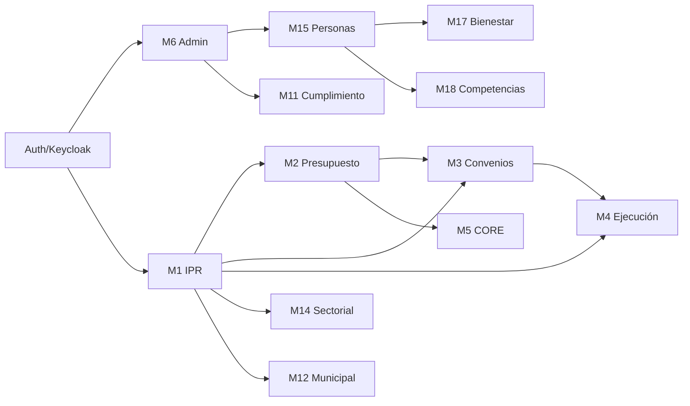

# 🗺️ GORE OS — Roadmap de Desarrollo

> **Versión**: 6.1.0 INTEGRAL-CONCATENATION  
> **Paradigma**: Desarrollo por Fases (sin fechas fijas)

---

## Visión Estratégica

```text
┌─────────┬─────────┬─────────┬─────────┬─────────┬─────────┐
│  FASE 0 │  FASE 1 │  FASE 2 │  FASE 3 │  FASE 4 │  FASE 5 │
│ GENESIS │  CORE   │ EXPAND  │ INTEG   │ SCALE   │ MATURE  │
│ Infra   │ IPR+Fin │ CORE+Ext│ RRHH    │ Geo+Perf│ Go-Live │
└─────────┴─────────┴─────────┴─────────┴─────────┴─────────┘
```

---

## Fase 0: GENESIS

> **Objetivo**: Infraestructura base y primer módulo funcionando end-to-end.

### Entregables

| Sprint | Entregable              | Stories | Criterio de Éxito                          |
| ------ | ----------------------- | ------- | ------------------------------------------ |
| S0.1   | Monorepo + Docker       | -       | `docker compose up` levanta stack completo |
| S0.1   | DB Schema base          | 5       | Migraciones ejecutan sin error             |
| S0.2   | Auth (Keycloak)         | 3       | Login con ClaveÚnica mock                  |
| S0.2   | API skeleton            | 5       | `/health` responde 200                     |
| S0.3   | **M1-IPR: Postulación** | 8       | Formulador puede postular IPR              |
| S0.3   | FSM-IPR (6 estados)     | 3       | Transiciones validan correctamente         |

### Hitos

- [ ] **H0.1**: Primer `docker compose up` exitoso
- [ ] **H0.2**: Primer login funcional
- [ ] **H0.3**: Primera IPR postulada end-to-end

### Riesgos

| Riesgo                          | Impacto | Mitigación                             |
| ------------------------------- | ------- | -------------------------------------- |
| Integración ClaveÚnica demorada | Alto    | Usar mock Keycloak local               |
| Complejidad FSM-IPR             | Medio   | Empezar con 6 estados, escalar gradual |

---

## Fase 1: CORE

> **Objetivo**: Ciclo IPR completo + Presupuesto + Convenios operativos.

### Módulos

| Módulo                     | Stories | Prioridad | Dependencias |
| -------------------------- | ------- | --------- | ------------ |
| **M1 IPR** (completar)     | 24      | P0        | Auth         |
| **M2 Presupuesto**         | 15      | P0        | M1           |
| **M3 Convenios**           | 19      | P1        | M1, M2       |
| **M4 Ejecución** (parcial) | 15      | P1        | M1           |

### Entregables

| Sprint | Entregable                 | Stories |
| ------ | -------------------------- | ------- |
| S1.1   | M1: Admisibilidad + MDSF   | 10      |
| S1.2   | M1: Priorización + Cartera | 8       |
| S1.3   | M2: Asignaciones + CDP     | 10      |
| S1.4   | M2: Compromisos + Devengos | 5       |
| S1.5   | M3: Convenios + Cuotas     | 12      |
| S1.6   | M3: SISREC + Rendiciones   | 7       |
| S1.7   | M4: Seguimiento básico     | 10      |
| S1.8   | M4: Compromisos AR         | 5       |

### Hitos

- [ ] **H1.1**: IPR puede recibir RATE de MDSF
- [ ] **H1.2**: CDP emitido y descontado
- [ ] **H1.3**: Convenio vigente con cuotas programadas
- [ ] **H1.4**: Dashboard AR con compromisos

---

## Fase 1.5: MECHANISMS

> **Objetivo**: Completar todos los mecanismos de inversión especializados.

### Módulos

| Módulo                      | Stories | Prioridad | Dependencias |
| --------------------------- | ------- | --------- | ------------ |
| **M21 Gobernanza** (CDR/OP) | 3       | P0        | M1           |
| **M22 PPR**                 | 4       | P0        | M1, M2       |
| **M23 FRIL**                | 4       | P0        | M1           |
| **M24 FRPD**                | 4       | P1        | M1, M2       |
| **M25 Subvenciones (8%)**   | 6       | P0        | M1 (Portal)  |
| **M26 Circ33**              | 3       | P1        | M1, M2       |

### Entregables

| Sprint | Entregable                         | Stories |
| ------ | ---------------------------------- | ------- |
| S1.5.1 | M21: Filtro Estratégico CDR        | 3       |
| S1.5.2 | M22: PPR Track A + B (ITF)         | 4       |
| S1.5.3 | M23: FRIL + Marcos Presupuestarios | 4       |
| S1.5.4 | M24: FRPD + Comité Estrategia      | 4       |
| S1.5.5 | **M25: Portal Comunitario 8%**     | 6       |
| S1.5.6 | M26: Circ33 + Track Emergencia     | 3       |

### Hitos

- [ ] **H1.5.1**: CDR puede priorizar cartera
- [ ] **H1.5.2**: Postulante Comunitario postula online (8%)
- [ ] **H1.5.3**: FRIL valida cuota municipal automáticamente

---

## Fase 2: EXPAND

> **Objetivo**: Ampliar a actores externos y dashboards ejecutivos.

### Módulos

| Módulo                | Stories | Prioridad | Dependencias |
| --------------------- | ------- | --------- | ------------ |
| **M5 CORE**           | 17      | P0        | M1, M2       |
| **M12 Municipal**     | 6       | P1        | M1           |
| **M13 Gob.Central**   | 7       | P1        | M1, M2       |
| **M6 Administración** | 8       | P0        | Auth         |
| **M10 TIC**           | 5       | P1        | M6           |

### Entregables

| Sprint | Entregable                                       | Stories |
| ------ | ------------------------------------------------ | ------- |
| S2.1   | M5: Sesiones CORE                                | 8       |
| S2.2   | M5: Votaciones + Actas                           | 9       |
| S2.3   | M12: Portal Municipal                            | 6       |
| S2.4   | M13: Interop MDSF/MH                             | 7       |
| S2.5   | M6: Usuarios + Roles                             | 5       |
| S2.6   | M6: Logs + Backup                                | 3       |
| S2.7   | M10: DocDigital/FirmaGob                         | 3       |
| S2.8   | M10: Dashboard TDE                               | 2       |
| S2.9   | **DS10: Backbone Expediente**                    | 5       |
| S2.10  | **Dashboard BI IDI** (Histórico, Mapas, Alertas) | 5       |

### Hitos

- [ ] **H2.1**: Consejero vota proyecto en sesión
- [ ] **H2.2**: UF Municipal postula vía portal
- [ ] **H2.3**: Resolución firmada con FEA
- [ ] **H2.4**: **Expediente Electrónico DS10 operativo** (IUIe/Índice)

---

## Fase 3: INTEGRATE

> **Objetivo**: Gestión interna (Personas, Activos, Bienestar) + Cumplimiento.

### Módulos

| Módulo               | Stories | Prioridad | Dependencias |
| -------------------- | ------- | --------- | ------------ |
| **M15 Personas**     | 19      | P0        | M6           |
| **M16 Activos**      | 5       | P1        | M6           |
| **M17 Bienestar**    | 4       | P2        | M15          |
| **M18 Competencias** | 3       | P2        | M15          |
| **M11 Cumplimiento** | 5       | P0        | M6           |
| **M14 Sectorial**    | 9       | P1        | M1           |

### Entregables

| Sprint | Entregable                        | Stories |
| ------ | --------------------------------- | ------- |
| S3.1   | M15: Ficha funcionario + Permisos | 7       |
| S3.2   | M15: Licencias + Liquidaciones    | 6       |
| S3.3   | M15: Calificaciones               | 6       |
| S3.4   | M16: Activo Fijo + Bodega         | 3       |
| S3.5   | M16: Flota vehicular              | 2       |
| S3.6   | M17: Bienestar + Reembolsos       | 4       |
| S3.7   | M11: DIP + Lobby                  | 3       |
| S3.8   | M11: Transparencia SAI            | 2       |
| S3.8.1 | **M11: RAT + Ciclo Datos (DPO)**  | 4       |
| S3.8.2 | **M11: Anonimización/Seudonim.**  | 2       |
| S3.9   | M14: RIS Deportes/Cultura         | 5       |
| S3.10  | M14: RIS Patrimonio               | 4       |

### Hitos

- [ ] **H3.1**: Funcionario solicita feriado online
- [ ] **H3.2**: Inventario activo fijo con QR
- [ ] **H3.3**: Alerta DIP automática
- [ ] **H3.4**: Proyecto RIS evaluado con criterios sectoriales
- [ ] **H3.5**: RAT operativo con trazabilidad (Ley 21.719)

---

## Fase 4: SCALE

> **Objetivo**: Geo/IDE, Emergencias, Optimización y Performance.

### Módulos

| Módulo             | Stories | Prioridad |
| ------------------ | ------- | --------- |
| **M7 Territorial** | 6       | P1        |
| **M8 CIES**        | 5       | P1        |
| **M9 IDE**         | 6       | P2        |
| **M19 Evolución**  | 15      | P1        |

### Entregables

| Sprint | Entregable                      |
| ------ | ------------------------------- |
| S4.1   | M7: Dashboard ERD + Brechas     |
| S4.2   | M7: Proceso ARI/PROPIR          |
| S4.3   | M8: CIES alertas + coordinación |
| S4.4   | M9: IDE visor cartográfico      |
| S4.5   | M9: Capas IPR geo-referenciadas |
| S4.6   | M19: Panel deuda técnica        |
| S4.7   | M19: Métricas sistema           |
| S4.8   | Performance tuning + Cache      |

### Hitos

- [ ] **H4.1**: Mapa con IPR por comuna
- [ ] **H4.2**: Alerta CIES dispara flujo
- [ ] **H4.3**: Dashboard métricas sistema

---

## Fase 5: MATURE

> **Objetivo**: Estabilización, documentación, capacitación, Go-Live.

### Actividades

| Orden | Actividad                          |
| ----- | ---------------------------------- |
| 1     | Freeze funcional, solo bugfixes    |
| 2     | Testing de carga y seguridad       |
| 3     | Documentación usuario final        |
| 4     | Capacitación funcionarios (piloto) |
| 5     | Migración datos legacy → GORE OS   |
| 6     | Go-Live soft (usuarios piloto)     |
| 7     | Go-Live full + soporte intensivo   |

### Hitos

- [ ] **H5.1**: Pen-test aprobado
- [ ] **H5.2**: 80% funcionarios capacitados
- [ ] **H5.3**: Migración completa
- [ ] **H5.4**: **🎉 GO-LIVE**

---

## Métricas de Proyecto

| Métrica                  | Target              |
| ------------------------ | ------------------- |
| Stories totales          | 261                 |
| Velocidad estimada       | 8-10 stories/sprint |
| Sprints totales          | ~32                 |
| Bugs críticos en Go-Live | 0                   |
| Cobertura de tests       | ≥80%                |
| Uptime objetivo          | 99.5%               |

---

## Dependencias Críticas



---

## Equipo Recomendado

| Rol                    | Cantidad | Fases     |
| ---------------------- | -------- | --------- |
| Tech Lead / Arquitecto | 1        | Todas     |
| Backend Developer      | 2        | Todas     |
| Frontend Developer     | 1-2      | F1+       |
| DevOps                 | 0.5      | F0, F4-F5 |
| QA                     | 1        | F2+       |
| UX/UI (consultor)      | 0.5      | F0-F2     |
| Product Owner          | 1        | Todas     |

---

> **Última actualización**: 2025-12-12  
> **Nota**: Las fases son secuenciales pero sin fechas fijas; avanzan según velocidad del equipo.
