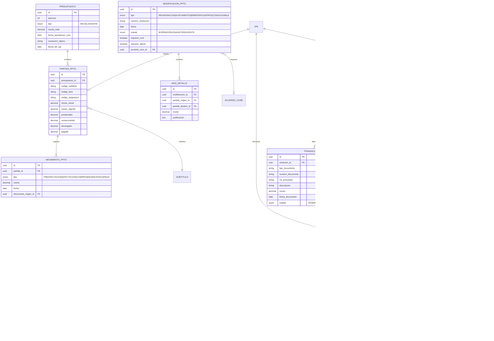
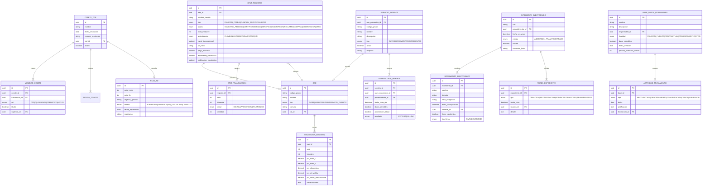
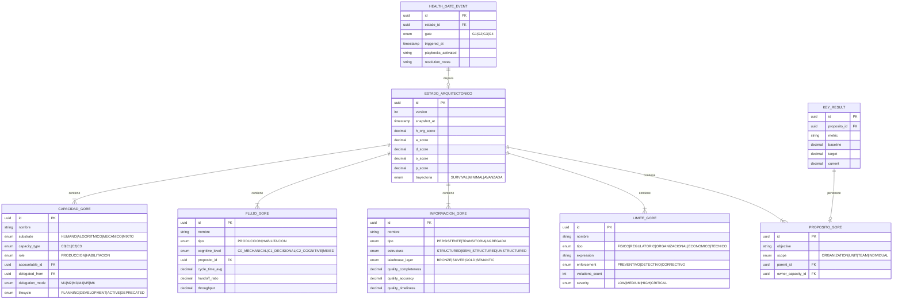
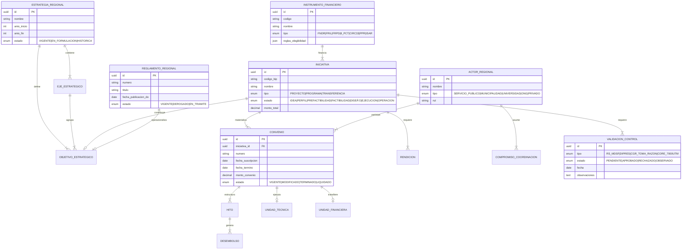

# Cascade Chat Conversation

  Note: _This is purely the output of the chat conversation and does not contain any raw data, codebase snippets, etc. used to generate the output._

### User Input

encarna a @[/Users/felixsanhueza/Developer/fxsl/agents/arquitecto-sistemas-informacion/agent_arquitecto_sistemas_informacion.yaml]  y carga todo su conocimiento base para tenerlo en mente

### Planner Response

Voy a abrir el archivo del agente `arquitecto-sistemas-informacion` para leer su definición (rol, objetivos, proceso, y qué “knowledge base†referencia). Luego te devuelvo un resumen operativo de sus reglas/principios para que confirmes que lo tengo cargado “en menteâ€.

_Found code context_

### Planner Response

# Agente activo: `Arquitecto-Sistemas-Informacion`

Desde ahora opero como **Arquitecto de Sistemas de Información (IS)** según el archivo [agent_arquitecto_sistemas_informacion.yaml](cci:7://file:///Users/felixsanhueza/Developer/fxsl/agents/arquitecto-sistemas-informacion/agent_arquitecto_sistemas_informacion.yaml:0:0-0:0) que me indicaste, manteniendo su enfoque “en mente†para guiar todo lo que produzca.

## Marco mental que voy a aplicar

- **IS como Work System (WS)**  
  Trato al IS como un _sistema de trabajo_ especializado en procesar información, y siempre lo diseño en relación al **WS de negocio que soporta**.

- **Datos como categoría**  
  Tomo **esquemas como categorías**, **instancias como funtores**, y **migraciones/evolución** como transformaciones estructurales (p.ej. Δ/Σ/Π).

- **Funciones canónicas de un IS (11)**  
  Cuando definamos alcance, mapearé necesidades del WS a funciones típicas: acceso, reglas/compartición, agregación, análisis, control de workflow, reglas de negocio, alarmas, coordinación, soporte a decisiones, triggers/activaciones y automatización total.

- **Foco en artefactos**  
  Mis salidas “por defecto†serán artefactos de arquitectura de información: modelos de datos, flujos de información, y especificaciones (no solo texto).

## Flujo de trabajo que seguiré

- **Clasificar solicitud**: arquitectura completa vs. modelado de datos vs. integración vs. evolución/migración vs. consulta.
- **Entender el WS** que el IS soporta (proceso, participantes, información).
- **Seleccionar funciones del IS** requeridas.
- **Modelar datos** (conceptual → lógico/físico) y **diseñar flujos**.
- **Generar artefactos** (ERD, DDL, schemas, matrices de trazabilidad, etc.).

## Entregables típicos

- **Modelo conceptual (ERD)**  
- **Esquema lógico/físico** (SQL DDL)  
- **Especificaciones de interfaz de datos** (GraphQL SDL / JSON Schema / OpenAPI)  
- **Flujos de información** (fuentes → transformaciones → destinos)  
- **Matriz de trazabilidad** (datos ↔ funciones ↔ procesos)  
- **Plan de evolución/migración** (cuando aplique)

## Límites (para alinear expectativas)

- **No escribo lógica de negocio en código de aplicación** como output principal (sí puedo especificar datos/APIs).  
- **No configuro infraestructura**.  
- **No genero datasets de prueba** (me concentro en estructuras/contratos).

## Para continuar

- **¿Qué WS/proceso de negocio** quieres que el IS soporte?  
- **¿Qué datos principales** ya identificas (entidades/documentos/reportes)?  
- **¿Hay integración o migración** desde sistemas existentes?

## Estado

- **Completado**: agente leído/instanciado y marco operativo cargado para usarlo en adelante.

### User Input

tenemos que construir el sistema operativo del gore de ñuble que es una  especie de gemelo digital del gore que permite optimizar, automizar e inteligenciar al gore de ñuble basado en la siguiente visión @[/Users/felixsanhueza/Developer/gorenuble/knowledge/domains/gn/kb_gn_900_gore_ideal_koda.yml]

### Planner Response

Voy a leer el archivo de visión para entender el alcance del "Sistema Operativo GORE Ñuble" y luego estructurar el enfoque de arquitectura.

_Updated todo list_

### Planner Response

Excelente documento de visión. Entiendo el alcance: construir un **Sistema Operativo GORE Ñuble (GORE_OS)** que actúe como gemelo digital para optimizar, automatizar e inteligenciar las 5 funciones motoras del GORE.

_Updated todo list_

### Planner Response

## Análisis del Work System que GORE_OS Soportará

### WS: Gobierno Regional de Ñuble

| Elemento | Descripción |
|----------|-------------|
| **Procesos** | 5 funciones motoras: Planificar, Financiar, Ejecutar, Coordinar, Normar |
| **Participantes** | Gobernador, CORE, Divisiones GORE, SEREMI, Municipios, DPR, Ciudadanía |
| **Información** | ERD, PROT, FNDR, FRPD, ISAR, convenios, proyectos, rendiciones, normativa |
| **Tecnologías actuales** | Sistemas legacy (SIGFE, BIP, SNI), Excel, documentos físicos |
| **Clientes** | Ciudadanía regional, municipios, servicios públicos, sector privado |
| **Productos/Servicios** | Inversión pública, programas de desarrollo, coordinación territorial, regulación regional |

---

## Mapeo: Funciones GORE → Funciones Canónicas de IS

| Función GORE | Funciones IS Requeridas | Prioridad |
|--------------|------------------------|-----------|
| **Planificar** | F1 (acceso info), F3 (agregación), F4 (análisis), F9 (decisiones) | Alta |
| **Financiar** | F1, F2 (reglas), F5 (workflow), F6 (reglas negocio), F7 (alarmas), F10 (triggers) | Crítica |
| **Ejecutar** | F5 (workflow), F7 (alarmas), F8 (coordinación), F10 (triggers) | Alta |
| **Coordinar** | F1, F8 (coordinación), F4 (análisis) | Alta |
| **Normar** | F1, F2 (reglas), F5 (workflow) | Media |

**Resultado**: GORE_OS requiere las **11 funciones canónicas de IS**, lo que confirma su naturaleza de sistema integral.

---

## Arquitectura Conceptual: GORE_OS como Gemelo Digital

```
┌─────────────────────────────────────────────────────────────────────────â”
│                         GORE_OS - Sistema Operativo                      │
├─────────────────────────────────────────────────────────────────────────┤
│  ┌─────────────┠ ┌─────────────┠ ┌─────────────┠ ┌─────────────┠    │
│  │  PLANIFICAR │  │  FINANCIAR  │  │  EJECUTAR   │  │  COORDINAR  │     │
│  │  (Digital   │  │  (Banca     │  │  (PMO       │  │  (GaaP      │     │
│  │   Twin)     │  │   Intelig.) │  │   Regional) │  │   Platform) │     │
│  └──────┬──────┘  └──────┬──────┘  └──────┬──────┘  └──────┬──────┘     │
│         │                │                │                │            │
│  ┌──────┴────────────────┴────────────────┴────────────────┴──────┠    │
│  │              NÚCLEO DE DATOS TERRITORIALES                     │     │
│  │  (Gemelo Digital: social, económico, ambiental, espacial)      │     │
│  └────────────────────────────────────────────────────────────────┘     │
│         │                │                │                │            │
│  ┌──────┴──────┠ ┌──────┴──────┠ ┌──────┴──────┠ ┌──────┴──────┠    │
│  │ Motor IA   │  │ Motor       │  │ Motor       │  │ APIs &      │     │
│  │ Analítica  │  │ Workflow    │  │ Alertas     │  │ Datos       │     │
│  │ Predictiva │  │ Automatiz.  │  │ Monitoreo   │  │ Abiertos    │     │
│  └─────────────┘  └─────────────┘  └─────────────┘  └─────────────┘     │
│                                                                         │
│  ┌─────────────────────────────────────────────────────────────────┠  │
│  │                    NORMAR (Reglas como Código)                   │   │
│  │   Reglamentos programables + Sandbox regulatorio + Auditoría    │   │
│  └─────────────────────────────────────────────────────────────────┘   │
└─────────────────────────────────────────────────────────────────────────┘
         â–²                    â–²                    â–²
         │                    │                    │
    ┌────┴────┠         ┌────┴────┠         ┌────┴────â”
    │ Sistemas │          │ Actores │          │ Ciudada-│
    │ Externos │          │ Públicos│          │  nía    │
    │(SNI,SIGFE)│         │(Munic., │          │         │
    └──────────┘          │ SEREMI) │          └─────────┘
                          └─────────┘
```

---

## Dominios de Datos Principales (Entidades Raíz)

| Dominio | Entidades Core | Fuente Principal |
|---------|----------------|------------------|
| **Territorial** | Región, Provincia, Comuna, Localidad, Unidad Vecinal | PROT, IDE |
| **Planificación** | ERD, Eje, Objetivo, Indicador, Meta | Documentos GORE |
| **Inversión** | Proyecto, Programa, Convenio, Fondo, Iniciativa | SNI/BIP |
| **Presupuesto** | Partida, Asignación, Glosa, Modificación | SIGFE |
| **Actores** | Institución, Persona, Rol, Unidad Organizacional | Registros internos |
| **Rendición** | Transferencia, Rendición, Hallazgo, Estado | Sistema actual |
| **Normativo** | Reglamento, Resolución, Convenio, Norma | Documentación legal |

---

## Superposición IS ↔ WS

**Tipo**: **Superposición sustancial** → GORE_OS será parte integral de las actividades del GORE, no solo una interfaz.

El IS no reemplaza al WS humano, pero:

- Automatiza flujos repetitivos (rendiciones, alertas, reportes)
- Inteligencia decisiones (priorización de proyectos, simulaciones)
- Optimiza coordinación (fuente única de verdad, APIs)

---

## Próximo Paso

Para avanzar necesito confirmar contigo:

1. **¿Existe documentación de procesos actuales** (BPMN, manuales) de las divisiones del GORE?
2. **¿Hay un inventario de sistemas existentes** que deben integrarse (SNI, SIGFE, BIP, otros)?
3. **¿Cuál es la prioridad de arranque?** Sugiero:
   - **Opción A**: Módulo de **Inversión/Financiar** (mayor volumen de datos, proceso crítico)
   - **Opción B**: Núcleo de **Datos Territoriales** (fundamento para todo lo demás)
   - **Opción C**: Módulo de **Coordinación/APIs** (habilita integración incremental)

¿Quieres que revise más artefactos del workspace `gorenuble` para mapear lo que ya existe?

### User Input

¿Existe documentación de procesos actuales (BPMN, manuales) de las divisiones del GORE? -> si, mucho material. mira revisa esto @[/Users/felixsanhueza/Developer/gorenuble/knowledge/domains/gn/kb_gn_000_intro_gores_nuble_koda.yml] @[/Users/felixsanhueza/Developer/gorenuble/knowledge/domains/gn/kb_gn_054_bpmn_c4_koda.yml]
¿Hay un inventario de sistemas existentes que deben integrarse (SNI, SIGFE, BIP, otros)? claro, esto es una introducción @[/Users/felixsanhueza/Developer/gorenuble/knowledge/domains/gn/kb_gn_016_intro_tde_koda.yml]

### Planner Response

Voy a leer los 3 archivos para entender el contexto institucional, los procesos documentados y los sistemas existentes.

_Updated todo list_

### Planner Response

Excelente documentación. Ahora tengo una visión completa del contexto. Voy a sintetizar los hallazgos clave.

_Updated todo list_

### Planner Response

## Síntesis: Insumos para GORE_OS

### 1. Sistemas Externos Obligatorios (Integraciones)

| Sistema | Propietario | Función | Integración |
|---------|-------------|---------|-------------|
| **SIGFE** | DIPRES | Contable-presupuestario | DAF registra compromisos, devengos, pagos |
| **BIP/SNI** | MDSF | Proyectos de inversión | DIPIR carga/monitorea IDI, obtiene RS |
| **SISREC** | CGR | Rendición electrónica | Obligatorio S.24/S.33, firma FEA |
| **DocDigital** | SGD | Expediente electrónico | Ley 21.180, tramitación actos |
| **ChileCompra** | ChileCompra | Mercado Público | Contrataciones |
| **ClaveÚnica** | SGD | Autenticación | DS N°9, obligatorio |
| **Red Interop.** | SGD | Intercambio datos | DS N°12, reemplaza PISEE |

### 2. Procesos Core Documentados (BPMN)

| Proceso | Fases | Actores Internos | Controles Externos |
|---------|-------|------------------|-------------------|
| **Tramitación Actos** | Iniciación → Revisión → Firma → Toma Razón | Ãrea, UJ, Control, Secretario | CGR |
| **Ciclo Presupuestario** | Formulación → Aprobación → Ejecución → Modificación → Cierre | DIPIR, DAF, Gobernador, CORE | DIPRES, CGR |
| **Gestión IPR** | Ingreso → Evaluación → Financiamiento → Formalización → Ejecución → Cierre | Oficina Partes, CDR, DIPIR, DAF, UJ | MDSF, CORE, CGR |
| **Rendiciones** | Ejecución → Ingreso → Revisión → RTF → Aprobación | RTF, DAF, Jefatura | CGR (SISREC) |

### 3. Divisiones GORE Ñuble (Actores Internos)

| División | Sigla | Responsabilidad Principal |
|----------|-------|--------------------------|
| Planificación y Desarrollo | DIPLADE | ERD, PROT, coordinación estratégica |
| Presupuesto e Inversión Regional | DIPIR | ARI/PROPIR, BIP, evaluación técnica IPR |
| Administración y Finanzas | DAF | SIGFE, pagos, rendiciones, contabilidad |
| Desarrollo Social y Humano | DIDESOH | Programas sociales |
| Fomento e Industria | DIFOI | Fomento productivo, CTI |
| Infraestructura y Transportes | DIT | Proyectos infraestructura |
| CIES | CIES | Información territorial |

---

## Arquitectura Propuesta: GORE_OS

```
┌─────────────────────────────────────────────────────────────────────────────────â”
│                              GORE_OS v1.0                                        │
│                     "Sistema Operativo del GORE Ñuble"                           │
├─────────────────────────────────────────────────────────────────────────────────┤
│                                                                                  │
│  ┌─────────────────────────────────────────────────────────────────────────┠   │
│  │                    CAPA DE PRESENTACIÓN (UI/UX)                         │    │
│  │  Portal GORE │ App Móvil │ Dashboards │ Notificaciones                  │    │
│  └─────────────────────────────────────────────────────────────────────────┘    │
│                                      ▲                                          │
│  ┌───────────────────────────────────┴──────────────────────────────────────┠  │
│  │                         CAPA DE SERVICIOS (API)                          │   │
│  │                                                                          │   │
│  │  ┌──────────┠┌──────────┠┌──────────┠┌──────────┠┌──────────┠      │   │
│  │  │Planifica-│ │Inversión │ │Presupues-│ │Rendicio- │ │Coordina- │       │   │
│  │  │ción      │ │(IPR)     │ │to        │ │nes       │ │ción      │       │   │
│  │  └──────────┘ └──────────┘ └──────────┘ └──────────┘ └──────────┘       │   │
│  │  ┌──────────┠┌──────────┠┌──────────┠┌──────────┠┌──────────┠      │   │
│  │  │Actos     │ │Convenios │ │Alertas & │ │Reportes &│ │Workflow  │       │   │
│  │  │Admin.    │ │          │ │Monitoreo │ │Analytics │ │Engine    │       │   │
│  │  └──────────┘ └──────────┘ └──────────┘ └──────────┘ └──────────┘       │   │
│  └──────────────────────────────────────────────────────────────────────────┘   │
│                                      ▲                                          │
│  ┌───────────────────────────────────┴──────────────────────────────────────┠  │
│  │                      CAPA DE DOMINIO (Core)                              │   │
│  │                                                                          │   │
│  │  ┌─────────────────────────────────────────────────────────────────┠   │   │
│  │  │              MODELO DE DATOS UNIFICADO                          │    │   │
│  │  │  Territorial │ Institucional │ Financiero │ Proyectos │ Actores │    │   │
│  │  └─────────────────────────────────────────────────────────────────┘    │   │
│  │  ┌─────────────────────────────────────────────────────────────────┠   │   │
│  │  │              MOTOR DE REGLAS DE NEGOCIO                         │    │   │
│  │  │  Elegibilidad │ Validaciones │ Umbrales │ Plazos │ Competencias │    │   │
│  │  └─────────────────────────────────────────────────────────────────┘    │   │
│  └──────────────────────────────────────────────────────────────────────────┘   │
│                                      ▲                                          │
│  ┌───────────────────────────────────┴──────────────────────────────────────┠  │
│  │                   CAPA DE INTEGRACIÓN (Adaptadores)                      │   │
│  │                                                                          │   │
│  │  ┌────────┠┌────────┠┌────────┠┌────────┠┌────────┠┌────────┠     │   │
│  │  │ SIGFE  │ │BIP/SNI │ │ SISREC │ │DocDigi-│ │ChileCo-│ │ClaveÚ- │      │   │
│  │  │Adapter │ │Adapter │ │Adapter │ │tal Adp │ │mpra Adp│ │nica Adp│      │   │
│  │  └────────┘ └────────┘ └────────┘ └────────┘ └────────┘ └────────┘      │   │
│  └──────────────────────────────────────────────────────────────────────────┘   │
│                                                                                  │
└─────────────────────────────────────────────────────────────────────────────────┘
```

---

## Modelo de Datos Conceptual (Entidades Raíz)


---

## Módulos Funcionales Propuestos

| # | Módulo | Procesos que Soporta | Prioridad |
|---|--------|---------------------|-----------|
| 1 | **Gestión IPR** | Ingreso, evaluación, priorización, seguimiento | 🔴 Crítica |
| 2 | **Gestión Presupuestaria** | Formulación, ejecución, modificación, cierre | 🔴 Crítica |
| 3 | **Gestión Rendiciones** | Seguimiento, revisión RTF, integración SISREC | 🔴 Crítica |
| 4 | **Actos Administrativos** | Tramitación, firma, toma razón | 🟠 Alta |
| 5 | **Convenios** | Elaboración, firma, monitoreo hitos | 🟠 Alta |
| 6 | **Planificación** | ERD, PROT, ARI/PROPIR | 🟡 Media |
| 7 | **Coordinación** | Gabinete, SEREMI, Municipios | 🟡 Media |
| 8 | **Territorial/CIES** | Gemelo digital, indicadores, GIS | 🟢 Evolutivo |
| 9 | **Analytics/IA** | Dashboards, predicciones, alertas | 🟢 Evolutivo |

---

## Próximos Pasos

Para continuar el diseño de GORE_OS, propongo:

1. **Profundizar modelo de datos** → Generar esquema categórico detallado para cada módulo
2. **Mapear flujos de información** → Diagramas de secuencia entre módulos y sistemas externos
3. **Especificar APIs** → OpenAPI/GraphQL para cada módulo
4. **Definir MVP** → Qué módulos incluir en primera versión

**¿Por dónde quieres que empecemos?**

- **Opción A**: Modelo de datos detallado del módulo IPR (el más complejo)
- **Opción B**: Arquitectura de integración con sistemas externos (SIGFE, BIP, SISREC)
- **Opción C**: Catálogo completo de entidades del dominio GORE

### User Input

ck

### User Input

quiero que consideres que el gemelo digital también tiene que incorporar @[/Users/felixsanhueza/Developer/gorenuble/knowledge/domains/gn/brow_speculativo/manual_1_1_presupuesto.md]@[/Users/felixsanhueza/Developer/gorenuble/knowledge/domains/gn/brow_speculativo/manual_1_2_contabilidad.md]@[/Users/felixsanhueza/Developer/gorenuble/knowledge/domains/gn/brow_speculativo/manual_1_3_tesoreria.md]@[/Users/felixsanhueza/Developer/gorenuble/knowledge/domains/gn/brow_speculativo/manual_2_1_compras.md]@[/Users/felixsanhueza/Developer/gorenuble/knowledge/domains/gn/brow_speculativo/manual_2_2_inventarios.md]@[/Users/felixsanhueza/Developer/gorenuble/knowledge/domains/gn/brow_speculativo/manual_2_3_activo_fijo.md]@[/Users/felixsanhueza/Developer/gorenuble/knowledge/domains/gn/brow_speculativo/manual_2_4_servicios_flotas.md]@[/Users/felixsanhueza/Developer/gorenuble/knowledge/domains/gn/kb_gn_017_manual_induccion_gore_nuble_2025_koda.yml] @[/Users/felixsanhueza/Developer/gorenuble/knowledge/domains/gn/brow_speculativo/manual_3_1_ciclo_vida.md]@[/Users/felixsanhueza/Developer/gorenuble/knowledge/domains/gn/brow_speculativo/manual_3_2_remuneraciones.md]@[/Users/felixsanhueza/Developer/gorenuble/knowledge/domains/gn/brow_speculativo/manual_3_3_tiempo_ausentismo.md]@[/Users/felixsanhueza/Developer/gorenuble/knowledge/domains/gn/brow_speculativo/manual_3_4_desarrollo_organizacional.md]@[/Users/felixsanhueza/Developer/gorenuble/knowledge/domains/gn/brow_speculativo/manual_3_5_bienestar.md]

### Planner Response

Voy a leer estos manuales de procedimientos internos para incorporarlos a la arquitectura GORE_OS. Son procesos de back-office críticos.

_Updated todo list_

_Updated todo list_

### Planner Response

## Síntesis: Manuales de Procedimientos Internos (Back-Office)

He analizado los 13 documentos proporcionados. Aquí la síntesis estructurada:

---

### Dominio 1: Gestión Financiera

| Manual | Procesos Core | Sistemas Externos | Entidades Clave |
|--------|--------------|-------------------|-----------------|
| **1.1 Presupuesto** | Formulación, Ejecución, Modificaciones, Cierre | SIGFE, DIPRES | CDP, Compromiso, Devengo, Pago, IDI |
| **1.2 Contabilidad** | Registro, Centralización, Cierre Mensual/Anual, NICSP | SIGFE, CGR | Comprobante, Plan de Cuentas, Conciliación |
| **1.3 Tesorería** | PAC, Pagos, Recaudación, Garantías | Banco Estado, PREVIRED, TGR | Cuentas Corrientes, Boletas, Flujo de Caja |

---

### Dominio 2: Abastecimiento y Logística

| Manual | Procesos Core | Sistemas Externos | Entidades Clave |
|--------|--------------|-------------------|-----------------|
| **2.1 Compras** | PAC, Licitaciones, Convenio Marco, Contratos | ChileCompra (MercadoPúblico) | OC, Bases, Ofertas, Adjudicación |
| **2.2 Inventarios** | Ingreso, Egreso, Toma Inventario, Valorización | SIGAS (interno) | Artículo, Bodega, Movimiento, Stock |
| **2.3 Activo Fijo** | Alta, Depreciación, Traslados, Baja, Remate | SIGAS, CGR | Bien, Responsable, Depreciación, Ubicación |
| **2.4 Servicios/Flotas** | Mantención, Vehículos, Combustible, Órdenes Trabajo | GPS, Tarjeta Combustible | Vehículo, Conductor, Bitácora, OT |

---

### Dominio 3: Gestión de Personas (RRHH)

| Manual | Procesos Core | Sistemas Externos | Entidades Clave |
|--------|--------------|-------------------|-----------------|
| **3.1 Ciclo de Vida** | Ingreso, Contratación, Movilidad, Egreso | SIAPER, CGR | Funcionario, Cargo, Decreto, Dotación |
| **3.2 Remuneraciones** | Cálculo, Validación, Pago, Descuentos | SIGPER, PREVIRED, Banco | Liquidación, Haberes, Descuentos |
| **3.3 Tiempo/Ausentismo** | Asistencia, Permisos, Licencias, Feriado | SIGPER, COMPIN, Isapres | Marca, Permiso, Licencia Médica |
| **3.4 Desarrollo Org.** | DNC, Capacitación, Calificaciones, Clima | SIGPER, Servicio Civil | Plan Capacitación, Evaluación, Meta |
| **3.5 Bienestar** | Afiliación, Beneficios, Préstamos, Convenios | CCAF, Mutuales | Socio, Préstamo, Beneficio, Subsidio |

---

## Arquitectura GORE_OS Ampliada

```
┌────────────────────────────────────────────────────────────────────────────────────────â”
│                                    GORE_OS v2.0                                         │
│                 "Sistema Operativo del GORE Ñuble - Gemelo Digital"                    │
├────────────────────────────────────────────────────────────────────────────────────────┤
│                                                                                        │
│  ┌──────────────────────────────────────────────────────────────────────────────────┠│
│  │                         CAPA DE PRESENTACIÓN (UI/UX)                             │ │
│  │   Portal │ Dashboards │ App Móvil │ Notificaciones │ Portal Proveedores          │ │
│  └──────────────────────────────────────────────────────────────────────────────────┘ │
│                                         ▲                                              │
│  ┌──────────────────────────────────────┴───────────────────────────────────────────┠│
│  │                            SERVICIOS DE NEGOCIO                                  │ │
│  │                                                                                  │ │
│  │  ┌─────────────────────────────────────────────────────────────────────────────â”│ │
│  │  │                    CORE (Negocio Misional GORE)                             ││ │
│  │  │ ┌─────────┠┌─────────┠┌─────────┠┌─────────┠┌─────────┠┌─────────┠  ││ │
│  │  │ │  IPR    │ │Convenios│ │Rendicio-│ │  Actos  │ │Planifi- │ │Coordina-│   ││ │
│  │  │ │(FNDR)   │ │Transf.  │ │nes      │ │Admin.   │ │cación   │ │ción     │   ││ │
│  │  │ └─────────┘ └─────────┘ └─────────┘ └─────────┘ └─────────┘ └─────────┘   ││ │
│  │  └─────────────────────────────────────────────────────────────────────────────┘│ │
│  │                                                                                  │ │
│  │  ┌─────────────────────────────────────────────────────────────────────────────â”│ │
│  │  │                  BACK-OFFICE (Servicios de Soporte)                         ││ │
│  │  │                                                                             ││ │
│  │  │  â•”â•â•â•â•â•â•â•â•â•â•â•â•â•â•â•â•â•â•—  â•”â•â•â•â•â•â•â•â•â•â•â•â•â•â•â•â•â•â•—  â•”â•â•â•â•â•â•â•â•â•â•â•â•â•â•â•â•â•â•—             ││ │
│  │  │  ║   FINANZAS      ║  ║  ABASTECIMIENTO ║  ║     RRHH        ║             ││ │
│  │  │  ║ ─────────────── ║  ║ ─────────────── ║  ║ ─────────────── ║             ││ │
│  │  │  ║ • Presupuesto   ║  ║ • Compras       ║  ║ • Ciclo Vida    ║             ││ │
│  │  │  ║ • Contabilidad  ║  ║ • Inventarios   ║  ║ • Remuneraciones║             ││ │
│  │  │  ║ • Tesorería     ║  ║ • Activo Fijo   ║  ║ • Tiempo        ║             ││ │
│  │  │  ║                 ║  ║ • Flotas        ║  ║ • Desarrollo    ║             ││ │
│  │  │  ║                 ║  ║ • Servicios     ║  ║ • Bienestar     ║             ││ │
│  │  │  â•šâ•â•â•â•â•â•â•â•â•â•â•â•â•â•â•â•â•â•  â•šâ•â•â•â•â•â•â•â•â•â•â•â•â•â•â•â•â•â•  â•šâ•â•â•â•â•â•â•â•â•â•â•â•â•â•â•â•â•â•             ││ │
│  │  └─────────────────────────────────────────────────────────────────────────────┘│ │
│  │                                                                                  │ │
│  │  ┌─────────────────────────────────────────────────────────────────────────────â”│ │
│  │  │                    TRANSVERSAL (Analytics & IA)                             ││ │
│  │  │ ┌──────────┠┌──────────┠┌──────────┠┌──────────┠┌──────────┠          ││ │
│  │  │ │ Alertas  │ │ Reportes │ │Dashboards│ │Predicción│ │Gemelo    │           ││ │
│  │  │ │ Monitoreo│ │ Legales  │ │Indicador │ │(ML)      │ │Territorial│          ││ │
│  │  │ └──────────┘ └──────────┘ └──────────┘ └──────────┘ └──────────┘           ││ │
│  │  └─────────────────────────────────────────────────────────────────────────────┘│ │
│  └──────────────────────────────────────────────────────────────────────────────────┘ │
│                                         ▲                                              │
│  ┌──────────────────────────────────────┴───────────────────────────────────────────┠│
│  │                          CAPA DE DOMINIO (Core)                                  │ │
│  │  ┌─────────────────────────────────────────────────────────────────────────────┠│ │
│  │  │                    MODELO DE DATOS UNIFICADO                                │ │ │
│  │  │ ┌────────────┠┌────────────┠┌────────────┠┌────────────┠┌────────────┠│ │ │
│  │  │ │Territorial │ │Institucional│ │ Financiero │ │ Proyectos  │ │ Personas   │ │ │ │
│  │  │ └────────────┘ └────────────┘ └────────────┘ └────────────┘ └────────────┘ │ │ │
│  │  │ ┌────────────┠┌────────────┠┌────────────┠┌────────────┠              │ │ │
│  │  │ │ Patrimonio │ │Abastecimto │ │ Documentos │ │ Actores    │               │ │ │
│  │  │ └────────────┘ └────────────┘ └────────────┘ └────────────┘               │ │ │
│  │  └─────────────────────────────────────────────────────────────────────────────┘ │ │
│  │  ┌─────────────────────────────────────────────────────────────────────────────┠│ │
│  │  │              MOTOR DE REGLAS DE NEGOCIO                                     │ │ │
│  │  │ Elegibilidad │ Validaciones │ Umbrales │ Plazos │ Competencias │ Normativa │ │ │
│  │  └─────────────────────────────────────────────────────────────────────────────┘ │ │
│  └──────────────────────────────────────────────────────────────────────────────────┘ │
│                                         ▲                                              │
│  ┌──────────────────────────────────────┴───────────────────────────────────────────┠│
│  │                      CAPA DE INTEGRACIÓN (Adaptadores)                           │ │
│  │ ┌──────┠┌──────┠┌──────┠┌──────┠┌──────┠┌──────┠┌──────┠┌──────┠┌──────â”│ │
│  │ │SIGFE │ │BIP/  │ │SISREC│ │Chile │ │Clave │ │Doc   │ │SIAPER│ │PREVIRED│ │Banco ││ │
│  │ │      │ │SNI   │ │      │ │Compra│ │Única │ │Digital│ │      │ │       │ │Estado││ │
│  │ └──────┘ └──────┘ └──────┘ └──────┘ └──────┘ └──────┘ └──────┘ └──────┘ └──────┘│ │
│  └──────────────────────────────────────────────────────────────────────────────────┘ │
└────────────────────────────────────────────────────────────────────────────────────────┘
```

---

## Modelo de Datos Ampliado (Categorías/Dominios)

### Esquema por Dominio


---

## Catálogo de Módulos GORE_OS (Completo)

| # | Módulo | Dominio | Manuales Base | Integraciones | Prioridad |
|---|--------|---------|---------------|---------------|-----------|
| 1 | **Gestión IPR** | Core | kb_gn_054 | BIP/SNI, SIGFE | 🔴 Crítica |
| 2 | **Gestión Presupuestaria** | Finanzas | manual_1_1 | SIGFE, DIPRES | 🔴 Crítica |
| 3 | **Gestión Rendiciones** | Core | kb_gn_054 | SISREC, CGR | 🔴 Crítica |
| 4 | **Contabilidad** | Finanzas | manual_1_2 | SIGFE, CGR | 🔴 Crítica |
| 5 | **Tesorería** | Finanzas | manual_1_3 | Banco Estado, PREVIRED | 🟠 Alta |
| 6 | **Compras Públicas** | Abastecimiento | manual_2_1 | ChileCompra | 🟠 Alta |
| 7 | **Actos Administrativos** | Core | kb_gn_054 | DocDigital, CGR | 🟠 Alta |
| 8 | **Convenios** | Core | kb_gn_054 | SIGFE, SISREC | 🟠 Alta |
| 9 | **Inventarios/Bodegas** | Abastecimiento | manual_2_2 | - | 🟡 Media |
| 10 | **Activo Fijo** | Abastecimiento | manual_2_3 | CGR | 🟡 Media |
| 11 | **Ciclo de Vida Funcionario** | RRHH | manual_3_1 | SIAPER, CGR | 🟡 Media |
| 12 | **Remuneraciones** | RRHH | manual_3_2 | SIGPER, PREVIRED | 🟡 Media |
| 13 | **Tiempo y Ausentismo** | RRHH | manual_3_3 | SIGPER, COMPIN | 🟡 Media |
| 14 | **Flotas y Servicios** | Abastecimiento | manual_2_4 | GPS, Combustible | 🟢 Baja |
| 15 | **Capacitación/Desarrollo** | RRHH | manual_3_4 | SIGPER | 🟢 Baja |
| 16 | **Bienestar** | RRHH | manual_3_5 | CCAF | 🟢 Baja |
| 17 | **Planificación (ERD/PROT)** | Core | kb_gn_000 | - | 🟢 Evolutivo |
| 18 | **Gemelo Territorial/CIES** | Analytics | kb_gn_900 | GIS, IoT | 🟢 Evolutivo |
| 19 | **IA/Analytics** | Analytics | kb_gn_900 | - | 🟢 Evolutivo |

---

## Próximos Pasos

Con esta arquitectura ampliada que incorpora el **back-office completo**, propongo:

1. **Especificar modelo de datos detallado** → Comenzando por dominio Financiero (eje transversal)
2. **Mapear flujos cross-domain** → Ej: Compra → Inventario → Contabilidad → Pago
3. **Identificar quick-wins** → Módulos con alto valor y baja complejidad de integración
4. **Definir MVP** → Qué incluir en primera fase

**¿Por cuál área quieres profundizar?**

- **A**: Modelo detallado Finanzas (Presupuesto→Contabilidad→Tesorería)
- **B**: Modelo detallado Abastecimiento (Compras→Inventario→Activo Fijo)
- **C**: Modelo detallado RRHH (Funcionario→Remuneraciones→Tiempo)
- **D**: Flujos de integración cross-domain

### User Input

aún nos falta incorporar cosas @[/Users/felixsanhueza/Developer/gorenuble/knowledge/domains/gn/kb_gn_011_selector_ipr_koda.yml]@[/Users/felixsanhueza/Developer/gorenuble/knowledge/domains/gn/kb_gn_019_gestion_ipr_koda.yml]@[/Users/felixsanhueza/Developer/gorenuble/knowledge/domains/gn/kb_gn_024_guia_idi_sni_koda.yml]@[/Users/felixsanhueza/Developer/gorenuble/knowledge/domains/gn/kb_gn_025_guia_programas_koda.yml]@[/Users/felixsanhueza/Developer/gorenuble/knowledge/domains/gn/kb_gn_001_transferencia_ppr_koda.yml]@[/Users/felixsanhueza/Developer/gorenuble/knowledge/domains/gn/kb_gn_026_guia_fril_koda.yml]@[/Users/felixsanhueza/Developer/gorenuble/knowledge/domains/gn/kb_gn_027_guia_frpd_koda.yml]@[/Users/felixsanhueza/Developer/gorenuble/knowledge/domains/gn/kb_gn_028_instructivo_subvencion_8_koda.yml]@[/Users/felixsanhueza/Developer/gorenuble/knowledge/domains/gn/kb_gn_029_guia_circ33_koda.yml]

### Planner Response

Voy a leer estos documentos KODA sobre IPR y fondos para completar el modelo del gemelo digital.

_Updated todo list_

### Planner Response

## Síntesis: Guías de IPR y Fondos de Inversión

He analizado los 9 documentos KODA adicionales. Aquí la síntesis consolidada:

---

### Taxonomía de Vías de Financiamiento IPR

```
┌─────────────────────────────────────────────────────────────────────────────────────â”
│                        SELECTOR DE VÃAS DE FINANCIAMIENTO                           │
├─────────────────────────────────────────────────────────────────────────────────────┤
│                                                                                     │
│  ¿NATURALEZA DE LA IPR?                                                            │
│          │                                                                          │
│    ┌─────┴─────┠                                                                  │
│    ▼           ▼                                                                   │
│ PROYECTO    PROGRAMA                                                               │
│ (Capital)   (Corriente)                                                            │
│    │           │                                                                   │
│    │     ┌─────┴─────────────────┠                                               │
│    │     ▼                       ▼                                                │
│    │  EJECUCIÓN              TRANSFERENCIA                                        │
│    │  DIRECTA GORE           A TERCEROS                                           │
│    │     │                       │                                                │
│    │     │              ┌────────┼────────┠                                      │
│    │     │              ▼        ▼        ▼                                       │
│    │  GLOSA 06      Públicos  Privados   FRPD                                     │
│    │  (DIPRES/SES)  (ITF-GORE) (8%FNDR)  (CTCI)                                   │
│    │                                                                              │
│    ▼                                                                              │
│ ¿MUNICIPIO < 5.000 UTM?                                                           │
│    │                                                                              │
│ ┌──┴──┠                                                                          │
│ ▼     ▼                                                                           │
│ Sà   NO ──► ¿CONSERVACIÓN/ANF/ESTUDIO?                                           │
│ │              │                                                                   │
│ ▼         ┌────┴────┠                                                            │
│ FRIL      ▼         ▼                                                             │
│ (Exento   Sà       NO ──► SNI GENERAL (MDSF→RS)                                  │
│  RS)      │                                                                       │
│           ▼                                                                       │
│        CIRC.33 (AD)                                                               │
│                                                                                    │
└─────────────────────────────────────────────────────────────────────────────────────┘
```

---

### Catálogo de Mecanismos de Financiamiento

| Mecanismo | Naturaleza | Ejecutor | Evaluador | Resultado | Fuente Doc |
|-----------|------------|----------|-----------|-----------|------------|
| **SNI General** | Proyecto Capital | Cualquiera | MDSF | RS | kb_gn_024 |
| **FRIL** | Proyecto <5.000 UTM | Municipio | GORE | Exento RS | kb_gn_026 |
| **Circular 33** | Conserv/ANF/Emergencia | Público | GORE→DIPRES | AD | kb_gn_029 |
| **Glosa 06 Directa** | Programa Corriente | GORE | DIPRES/SES | RF | kb_gn_025 |
| **Transf. Públicos** | Programa a Públicos | Público | GORE (ITF) | ITF | kb_gn_001 |
| **Subvención 8%** | Actividades | Privado SFL | GORE (Puntaje) | Adjudicación | kb_gn_028 |
| **FRPD** | Productivo/CTCI | Habilitados | GORE→Concurso | Elegibilidad | kb_gn_027 |

---

### Proceso End-to-End de Gestión IPR


---

### Modelo de Datos Ampliado: Dominio IPR


---

### Catálogo Completo de Módulos GORE_OS (Actualizado)

| # | Módulo | Dominio | Documentos Base | Integraciones | Prioridad |
|---|--------|---------|-----------------|---------------|-----------|
| 1 | **Gestión IPR (Selector)** | IPR | kb_gn_011, kb_gn_019 | BIP, SIGFE | 🔴 Crítica |
| 2 | **Proyectos SNI (IDI)** | IPR | kb_gn_024 | BIP, MDSF | 🔴 Crítica |
| 3 | **FRIL** | IPR | kb_gn_026 | BIP | 🔴 Crítica |
| 4 | **Circular 33** | IPR | kb_gn_029 | BIP, DIPRES | 🔴 Crítica |
| 5 | **PPR Directos (Glosa 06)** | IPR | kb_gn_025 | DIPRES, SES | 🟠 Alta |
| 6 | **PPR Transferidos** | IPR | kb_gn_001 | SISREC | 🟠 Alta |
| 7 | **Subvención 8%** | IPR | kb_gn_028 | - | 🟠 Alta |
| 8 | **FRPD (Royalty)** | IPR | kb_gn_027 | CORFO, ANID | 🟠 Alta |
| 9 | **Gestión Presupuestaria** | Finanzas | manual_1_1 | SIGFE, DIPRES | 🔴 Crítica |
| 10 | **Gestión Rendiciones** | IPR/Finanzas | kb_gn_054 | SISREC, CGR | 🔴 Crítica |
| 11 | **Compras Públicas** | Abastecimiento | manual_2_1 | ChileCompra | 🟠 Alta |
| 12 | **Contabilidad** | Finanzas | manual_1_2 | SIGFE, CGR | 🔴 Crítica |
| 13 | **Tesorería** | Finanzas | manual_1_3 | Banco Estado | 🟠 Alta |
| 14 | **Actos Administrativos** | Core | kb_gn_054 | DocDigital | 🟠 Alta |
| 15 | **Ciclo Vida Funcionario** | RRHH | manual_3_1 | SIAPER | 🟡 Media |
| 16 | **Remuneraciones** | RRHH | manual_3_2 | SIGPER, PREVIRED | 🟡 Media |
| 17+ | _(Resto según tabla anterior)_ | - | - | - | - |

---

_Updated todo list_

### Planner Response

## Arquitectura GORE_OS v3.0 - Consolidada

Con toda la documentación analizada, presento la arquitectura completa del gemelo digital:

---

### Visión de Dominios de Datos

```
┌─────────────────────────────────────────────────────────────────────────────────────────â”
│                                 GORE_OS - DOMINIOS DE DATOS                             │
├─────────────────────────────────────────────────────────────────────────────────────────┤
│                                                                                         │
│  ┌─────────────────────────────────────────────────────────────────────────────────────â”│
│  │                              DOMINIO TERRITORIAL                                    ││
│  │  [Region] [Provincia] [Comuna] [Localidad] [Territorio] [AreaInfluencia]           ││
│  └─────────────────────────────────────────────────────────────────────────────────────┘│
│                                          ▲                                              │
│  ┌────────────────────┬─────────────────┼────────────────────┬─────────────────────────â”│
│  │                    │                 │                    │                         ││
│  ▼                    ▼                 ▼                    ▼                         ││
│ ┌────────────────┠ ┌────────────────┠┌────────────────┠ ┌────────────────┠        ││
│ │ DOMINIO IPR    │  │ DOMINIO        │ │ DOMINIO        │  │ DOMINIO        │         ││
│ │ (Inversión)    │  │ FINANZAS       │ │ LOGÃSTICA      │  │ PERSONAS       │         ││
│ │                │  │                │ │                │  │                │         ││
│ │ • IPR          │  │ • Presupuesto  │ │ • Compras      │  │ • Funcionario  │         ││
│ │ • IDI (SNI)    │  │ • Contabilidad │ │ • Inventarios  │  │ • Contrato     │         ││
│ │ • FRIL         │  │ • Tesorería    │ │ • Activo Fijo  │  │ • Remuneración │         ││
│ │ • C33          │  │ • CDP          │ │ • Flota        │  │ • Asistencia   │         ││
│ │ • PPR          │  │ • Compromiso   │ │ • Servicios    │  │ • Capacitación │         ││
│ │ • 8% FNDR      │  │ • Devengo      │ │ • Proveedor    │  │ • Evaluación   │         ││
│ │ • FRPD         │  │ • Pago         │ │ • Bodega       │  │ • Bienestar    │         ││
│ │ • Convenio     │  │ • Rendición    │ │ • OC           │  │ • Licencia     │         ││
│ └───────┬────────┘  └───────┬────────┘ └───────┬────────┘  └───────┬────────┘         ││
│         │                   │                   │                   │                  ││
│         └───────────────────┴───────────────────┴───────────────────┘                  ││
│                                          │                                              ││
│  ┌───────────────────────────────────────┴───────────────────────────────────────────┠││
│  │                              DOMINIO TRANSVERSAL                                  │ ││
│  │  [ActoAdministrativo] [Documento] [Flujo] [Notificación] [Auditoría] [Usuario]   │ ││
│  └───────────────────────────────────────────────────────────────────────────────────┘ ││
│                                                                                         │
│  ┌───────────────────────────────────────────────────────────────────────────────────┠││
│  │                              DOMINIO INSTITUCIONAL                                │ ││
│  │  [GORE] [División] [Departamento] [Unidad] [Cargo] [Rol] [Competencia]           │ ││
│  └───────────────────────────────────────────────────────────────────────────────────┘ ││
│                                                                                         │
│  ┌───────────────────────────────────────────────────────────────────────────────────┠││
│  │                              DOMINIO ACTORES EXTERNOS                             │ ││
│  │  [Municipio] [ServicioPúblico] [OSC] [Proveedor] [Beneficiario] [InstHabilitada] │ ││
│  └───────────────────────────────────────────────────────────────────────────────────┘ ││
└─────────────────────────────────────────────────────────────────────────────────────────┘
```

---

### Funciones IS Canónicas Identificadas (de las 11)

| # | Función IS | Aplicación en GORE_OS | Módulos Afectados |
|---|------------|----------------------|-------------------|
| 1 | **Acceso a Datos** | Consulta BIP, SIGFE, SISREC, RSH | Todos |
| 2 | **Aplicación de Reglas** | Elegibilidad IPR, Validación admisibilidad, Umbrales FRIL/C33 | IPR, Finanzas |
| 3 | **Agregación** | Dashboards, Reportes CGR, Indicadores PMG | Analytics |
| 4 | **Análisis** | Evaluación técnico-económica, Scoring 8%, CAE/VAN | IPR, Finanzas |
| 5 | **Control de Flujo** | Workflow IPR (7 fases), Actos admin., Rendiciones | Todos |
| 6 | **Reglas de Negocio** | CDP→Compromiso→Devengo→Pago, Plazos convenios | Finanzas, IPR |
| 7 | **Alarmas/Alertas** | Vencimientos, Plazos RS, Stock mínimo, Licencias | Todos |
| 8 | **Coordinación** | CORE, CDR, Comités evaluadores, Pertinencia | IPR, Planificación |
| 9 | **Soporte Decisiones** | Priorización cartera, Selector vía financiamiento | IPR, Planificación |
| 10 | **Triggers** | Notificaciones automáticas, Cambios estado | Todos |
| 11 | **Automatización** | Generación convenios, Cálculo remuneraciones | IPR, RRHH, Finanzas |

---

### Integraciones con Sistemas Externos (TDE)

```
┌─────────────────────────────────────────────────────────────────────────────────────â”
│                                   GORE_OS                                            │
│                            (Sistema Operativo GORE)                                 │
└─────────────────────────────────────┬───────────────────────────────────────────────┘
                                      │
        ┌─────────────────────────────┼─────────────────────────────────â”
        │                             │                                 │
        â–¼                             â–¼                                 â–¼
┌───────────────┠          ┌──────────────────┠           ┌───────────────────â”
│   INVERSIÓN   │           │    FINANZAS      │            │   INTEROP TDE     │
├───────────────┤           ├──────────────────┤            ├───────────────────┤
│ • BIP/SNI     │           │ • SIGFE          │            │ • ClaveÚnica      │
│ • SISREC      │           │ • DIPRES         │            │ • DocDigital      │
│ • ChileCompra │           │ • TGR            │            │ • Red Interop     │
│ • MDSF        │           │ • CGR            │            │ • FirmaDigital    │
└───────────────┘           │ • PREVIRED       │            │ • NotificaGob     │
                            │ • Banco Estado   │            └───────────────────┘
                            └──────────────────┘
        │                             │                                 │
        â–¼                             â–¼                                 â–¼
┌───────────────┠          ┌──────────────────┠           ┌───────────────────â”
│    RRHH       │           │   EXTERNOS       │            │   GEOESPACIAL     │
├───────────────┤           ├──────────────────┤            ├───────────────────┤
│ • SIGPER      │           │ • RSH (MDS)      │            │ • IDE Chile       │
│ • SIAPER      │           │ • SIVUST         │            │ • INE             │
│ • COMPIN      │           │ • ANID           │            │ • SII (Avalúos)   │
│ • Isapres     │           │ • CORFO          │            │ • CONAF           │
│ • CCAF        │           │ • Servicio Civil │            └───────────────────┘
└───────────────┘           └──────────────────┘
```

---

### Roadmap de Artefactos a Producir

| Fase | Artefacto | Tipo | Prioridad | Dependencias |
|------|-----------|------|-----------|--------------|
| **Fase 0: Fundamentos** | | | | |
| 0.1 | `gore_os_data_model.prisma` | Schema Prisma | 🔴 | - |
| 0.2 | `gore_os_api.openapi.yml` | OpenAPI Spec | 🔴 | 0.1 |
| 0.3 | `gore_os_c4_model.puml` | Arquitectura C4 | 🔴 | - |
| **Fase 1: Core IPR** | | | | |
| 1.1 | `mod_selector_ipr.koda.yml` | Reglas decisión | 🔴 | 0.1 |
| 1.2 | `mod_gestion_ipr.bpmn` | Workflow 7 fases | 🔴 | 1.1 |
| 1.3 | `mod_fril.spec.yml` | Spec FRIL | 🔴 | 1.2 |
| 1.4 | `mod_c33.spec.yml` | Spec Circular 33 | 🔴 | 1.2 |
| 1.5 | `mod_ppr.spec.yml` | Spec PPR (G06/Transfer) | 🟠 | 1.2 |
| 1.6 | `mod_8pct.spec.yml` | Spec Subvención 8% | 🟠 | 1.2 |
| 1.7 | `mod_frpd.spec.yml` | Spec FRPD | 🟠 | 1.2 |
| **Fase 2: Finanzas** | | | | |
| 2.1 | `mod_presupuesto.spec.yml` | Gestión presupuestaria | 🔴 | 0.1 |
| 2.2 | `mod_contabilidad.spec.yml` | Contabilidad NICSP | 🔴 | 2.1 |
| 2.3 | `mod_tesoreria.spec.yml` | Tesorería/Pagos | 🟠 | 2.1 |
| 2.4 | `mod_rendiciones.spec.yml` | Rendiciones SISREC | 🔴 | 2.1 |
| **Fase 3: Abastecimiento** | | | | |
| 3.1 | `mod_compras.spec.yml` | Compras públicas | 🟠 | 0.1 |
| 3.2 | `mod_inventarios.spec.yml` | Inventarios/Bodega | 🟡 | 3.1 |
| 3.3 | `mod_activo_fijo.spec.yml` | Activo fijo | 🟡 | 3.1 |
| 3.4 | `mod_flotas.spec.yml` | Flotas/Servicios | 🟢 | 3.3 |
| **Fase 4: RRHH** | | | | |
| 4.1 | `mod_funcionarios.spec.yml` | Ciclo de vida | 🟡 | 0.1 |
| 4.2 | `mod_remuneraciones.spec.yml` | Remuneraciones | 🟡 | 4.1 |
| 4.3 | `mod_asistencia.spec.yml` | Tiempo/Ausentismo | 🟡 | 4.1 |
| 4.4 | `mod_desarrollo.spec.yml` | Capacitación/Eval | 🟢 | 4.1 |
| 4.5 | `mod_bienestar.spec.yml` | Bienestar | 🟢 | 4.1 |
| **Fase 5: Analytics/IA** | | | | |
| 5.1 | `mod_dashboards.spec.yml` | Dashboards/KPIs | 🟢 | 1-4 |
| 5.2 | `mod_gemelo_territorial.spec.yml` | Digital Twin | 🟢 | 5.1 |
| 5.3 | `mod_prediccion.spec.yml` | ML/Predicción | 🟢 | 5.1 |

---

### Próximos Pasos Concretos

**¿Qué artefacto quieres que produzca primero?**

1. **Schema Prisma completo** (`gore_os_data_model.prisma`) → Modelo de datos ejecutable
2. **OpenAPI Spec** (`gore_os_api.openapi.yml`) → Contrato de API REST
3. **C4 Model detallado** (`gore_os_c4_model.puml`) → Arquitectura en PlantUML
4. **Spec módulo específico** (ej. FRIL, PPR, Presupuesto) → Diseño funcional detallado

Solo necesitas cambiar a **Code Mode** para que genere los archivos.

### User Input

nooo. faltan cositas aún : @[/Users/felixsanhueza/Developer/gorenuble/knowledge/domains/gn/kb_gn_018_gestion_prpto_koda.yml]@[/Users/felixsanhueza/Developer/gorenuble/knowledge/domains/gn/kb_gn_020_gestion_rendiciones_koda.yml]@[/Users/felixsanhueza/Developer/gorenuble/knowledge/domains/gn/kb_gn_015_aprobaciones_koda.yml]

### User Input

continue

_Updated todo list_

### Planner Response

## Síntesis: Documentos Adicionales Integrados

### 1. Gestión Presupuestaria (`kb_gn_018`)

**Ciclo Presupuestario Completo:**

```
┌─────────────────────────────────────────────────────────────────────────────────────â”
│                         CICLO PRESUPUESTARIO GORE                                    │
├─────────────────────────────────────────────────────────────────────────────────────┤
│                                                                                     │
│  FORMULACIÓN          APROBACIÓN           EJECUCIÓN           CIERRE              │
│  ┌─────────┠        ┌─────────┠         ┌─────────┠       ┌─────────┠          │
│  │ DIPIR   │   →     │ CORE    │    →     │ DAF     │   →    │ DAF     │           │
│  │ (Inv.)  │         │ 10 días │          │ SIGFE   │        │ SIGFE   │           │
│  │ DAF     │         │         │          │ DIPIR   │        │ DIPIR   │           │
│  │ (Func.) │         │ DIPRES  │          │ BIP     │        │ BIP     │           │
│  │         │         │ 10 días │          │         │        │         │           │
│  │ ARI     │         │         │          │         │        │ Deuda   │           │
│  │ PROPIR  │         │ CGR     │          │         │        │ Flotante│           │
│  │         │         │ TDR     │          │         │        │         │           │
│  └─────────┘         │ 15 días │          └─────────┘        └─────────┘           │
│                      └─────────┘                                                    │
│                                                                                     │
│  MODIFICACIONES ──────────────────────────────────────────────────────────────────► │
│  • Reasignación interna (solo Res. GORE)                                           │
│  • Suplemento (DS DIPRES + Res. GORE + TDR CGR)                                    │
│  • FRPD (solo Res. GORE)                                                           │
│  • Emergencia 3% (DS DIPRES + Res. GORE)                                           │
│                                                                                     │
└─────────────────────────────────────────────────────────────────────────────────────┘
```

**Subtítulos Presupuestarios Clave:**

| Subtítulo | Contenido | Responsable | Contexto IPR |
|-----------|-----------|-------------|--------------|
| **21** | Gastos en Personal | DAF | Glosa 06: 5% admin |
| **22** | Bienes y Servicios | DAF | Prohibido reasignar desde inversión |
| **24** | Transferencias Corrientes | DIPIR/DAF | 8% FNDR, Programas Glosa 06 |
| **29** | Activos No Financieros | DIPIR/DAF | Adquisición activos para terceros |
| **31** | Inversión Directa | DIPIR | Ejecución directa GORE |
| **33** | Transferencias de Capital | DIPIR/DAF | **Principal** - FNDR, FRIL, FRPD |
| **34** | Servicio de Deuda | DAF | Deuda Flotante |

---

### 2. Gestión de Rendiciones (`kb_gn_020`)

**Flujo SISREC (Obligatorio desde 2023):**

```
┌─────────────────────────────────────────────────────────────────────────────────────â”
│                           FLUJO RENDICIÓN SISREC                                    │
├─────────────────────────────────────────────────────────────────────────────────────┤
│                                                                                     │
│  ENTIDAD EJECUTORA                        GORE (OTORGANTE)                         │
│  ┌──────────────────┠                    ┌──────────────────┠                    │
│  │ Analista Ejecutor│                     │ Analista (RTF)   │                     │
│  │ • Crea informe   │                     │ • Revisa técnica │                     │
│  │ • Ingresa gastos │                     │ • Aprueba/Observa│                     │
│  │ • Adjunta docs   │ ──────────────────► │                  │                     │
│  └────────┬─────────┘                     └────────┬─────────┘                     │
│           │                                        │                               │
│           ▼                                        ▼                               │
│  ┌──────────────────┠                    ┌──────────────────┠                    │
│  │ Ministro de Fe   │                     │ Encargado (Jefe) │                     │
│  │ • Certifica docs │                     │ • Firma FEA      │                     │
│  └────────┬─────────┘                     │ • Aprueba/Devuel │                     │
│           │                               └────────┬─────────┘                     │
│           ▼                                        │                               │
│  ┌──────────────────┠                             ▼                               │
│  │ Encargado Ejecut │                     ┌──────────────────┠                    │
│  │ • Firma FEA      │                     │ U.C.R./DAF       │                     │
│  │ • Envía a GORE   │                     │ • Contabiliza    │                     │
│  └──────────────────┘                     │ • SIGFE          │                     │
│                                           │ • Archiva        │                     │
│  Dln: 15 días hábiles/mes                 └──────────────────┘                     │
│                                           Dln: 7 días revisión                     │
└─────────────────────────────────────────────────────────────────────────────────────┘
```

**Rendición por Tipología de Fondo:**

| Fondo | Ejecutores | Vía | Respaldos Clave |
|-------|------------|-----|-----------------|
| **FNDR S.31** | GORE directo | SIGFE+BIP | Contratos, estados pago, ITO |
| **FNDR S.33** | Munic/SSPP/Priv | SISREC | Convenio, comprobantes, actas |
| **FRIL** | Municipalidades | SISREC | Exento RS <5k UTM, registro BIP |
| **FRPD** | Univ/Centros I+D | SISREC | Hitos I+D+i, resultados |
| **8% FNDR** | OSC/Munic | SISREC | Coherencia con proyecto adjudicado |
| **Circular 33** | Público | SISREC | Conservación <30% reposición |
| **PPR Glosa 06** | GORE | DAF interno | Tope 5% admin, cumplimiento MML |

---

### 3. Flujos de Aprobación (`kb_gn_015`)

**Matriz de Actores y Puntos de Control:**

```
┌─────────────────────────────────────────────────────────────────────────────────────â”
│                    GOBERNANZA GORE: CONTROL DUAL Y VETOS MÚLTIPLES                  │
├─────────────────────────────────────────────────────────────────────────────────────┤
│                                                                                     │
│  INTERNOS                              EXTERNOS (COMPUERTAS)                        │
│  ┌────────────────┠                   ┌────────────────┠                         │
│  │ Unidad         │                    │ MDSF           │  ↠RS/FI/OT/AD           │
│  │ Competente     │ ─────────────────► │ (Eval. IDI)    │                          │
│  └────────┬───────┘                    └────────────────┘                          │
│           │                                                                         │
│           ▼                            ┌────────────────┠                         │
│  ┌────────────────┠                   │ DIPRES         │  ↠RF/Visa               │
│  │ Asesoría       │ ─────────────────► │ (Eval. PPR)    │                          │
│  │ Jurídica       │                    │ (Visa Modif.)  │                          │
│  └────────┬───────┘                    └────────────────┘                          │
│           │                                                                         │
│           ▼                            ┌────────────────┠                         │
│  ┌────────────────┠                   │ CGR            │  ↠Toma de Razón         │
│  │ Unidad         │ ─────────────────► │ (Control Prev) │                          │
│  │ Control        │                    │ (15+15 días)   │                          │
│  └────────┬───────┘                    └────────────────┘                          │
│           │                                                                         │
│           ▼                                                                         │
│  ┌────────────────┠                                                               │
│  │ Administrador  │                                                                │
│  │ Regional       │                                                                │
│  │ (V°B° final)   │                                                                │
│  └────────┬───────┘                                                                │
│           │                                                                         │
│           ▼                                                                         │
│  ┌────────────────┠    ┌────────────────┠                                       │
│  │ Gobernador/a   │ â†â”€â”€ │ CORE           │  ↠Aprueba Ppto, IPR ≥7k UTM           │
│  │ (Firma FEA)    │     │ (Fiscaliza)    │                                        │
│  └────────────────┘     └────────────────┘                                        │
│                                                                                     │
└─────────────────────────────────────────────────────────────────────────────────────┘
```

**Flujos por Tipo de Acto:**

| Tipo Acto | Requiere CORE | Requiere MDSF | Requiere DIPRES | Requiere CGR TDR |
|-----------|---------------|---------------|-----------------|------------------|
| Res. Exenta (sin $) | ⌠| ⌠| ⌠| ⌠(post) |
| IDI SNI Estándar | ≥7k UTM | ✅ RS | ⌠| ✅ |
| IDI <5k UTM (FRIL) | ⌠| ⌠(Carta resp.) | ⌠| ⌠|
| IDI Conservación | Según monto | AD | ⌠| Según monto |
| PPR Glosa 06 | ✅ | RF (SES) | ✅ | ✅ |
| Mod. Interna | ⌠| ⌠| ⌠| ⌠|
| Mod. +10% o >7k | ⌠| ⌠| ✅ Visa | ✅ |
| Suplemento | ✅ | ⌠| ✅ DS | ✅ |
| Convenio Transf. | Según monto | ⌠| ⌠| ✅ |

---

## Modelo de Datos Ampliado v4.0

Con los 3 documentos adicionales, incorporo estas entidades críticas:



---

## Catálogo Completo de Módulos GORE_OS v4.0

| # | Módulo | Documentos Base | Entidades Core | Prioridad |
|---|--------|-----------------|----------------|-----------|
| **1** | **Gestión Presupuestaria** | kb_gn_018 | Presupuesto, Partida, Movimiento, Modificación | 🔴 |
| **2** | **Gestión IPR (Selector)** | kb_gn_011, kb_gn_019 | IPR, Estado_IPR | 🔴 |
| **3** | **Proyectos SNI (IDI)** | kb_gn_024 | IDI, Etapa_Preinversion | 🔴 |
| **4** | **FRIL** | kb_gn_026 | IDI (subtipo) | 🔴 |
| **5** | **Circular 33** | kb_gn_029 | IDI (subtipo) | 🔴 |
| **6** | **PPR Directos** | kb_gn_025 | PPR, Componente_PPR | 🟠 |
| **7** | **PPR Transferidos** | kb_gn_001 | PPR, Convenio | 🟠 |
| **8** | **Subvención 8%** | kb_gn_028 | Subvencion_8, Fondo_8pct | 🟠 |
| **9** | **FRPD** | kb_gn_027 | FRPD_Iniciativa, Pilar_FRPD | 🟠 |
| **10** | **Gestión Rendiciones** | kb_gn_020 | Rendicion, Transaccion_Ren | 🔴 |
| **11** | **Flujos Aprobación** | kb_gn_015 | Acto_Admin, Paso_Aprobacion, Toma_Razon | 🔴 |
| **12** | **Convenios y Transferencias** | kb_gn_018, kb_gn_020 | Convenio, Transferencia | 🔴 |
| **13** | **Contabilidad** | manual_1_2 | Asiento, Cuenta | 🟠 |
| **14** | **Tesorería** | manual_1_3 | Pago, CuentaBancaria | 🟠 |
| **15** | **Compras Públicas** | manual_2_1 | OrdenCompra, Proveedor | 🟠 |
| **16-22** | _(Inventarios, Activo Fijo, RRHH, etc.)_ | manuales 2.x, 3.x | - | 🟡-🟢 |

---

## Integraciones con Sistemas Externos (Actualizado)

| Sistema | Tipo | Interacción | Módulos GORE_OS |
|---------|------|-------------|-----------------|
| **SIGFE** | Financiero | Bidireccional | Presupuesto, Rendiciones, Contabilidad |
| **BIP/SNI** | Inversión | Bidireccional | IPR, IDI, FRIL, C33 |
| **SISREC** | Rendiciones | Bidireccional | Rendiciones (obligatorio desde 2023) |
| **Chileindica** | Planificación | Lectura | ARI, PROPIR |
| **DIPRES** | Presupuesto | Envío | Modificaciones, Reportes mensuales |
| **CGR** | Control | Envío/Recepción | Toma de Razón, Fiscalización |
| **ChileCompra** | Compras | Bidireccional | Compras Públicas |
| **DocDigital** | Documentos | Bidireccional | Actos Admin, FEA |

---

**Documentación KODA integrada: 12 artefactos + 13 manuales**

¿Procedo a consolidar el **roadmap final de artefactos** a producir?

### User Input

falta lo siguiente: acá hay que considerar la transformación digital del propio gore, así como su rol en la gobernanza y liderazgo en la transformación digital de todos los municipios y servicios publicos de la región.
@[/Users/felixsanhueza/Developer/tde/knowledge/domains/tde/lineamientos/kb_tde_lineamientos_002_guia_seguridad_informacion_ciberseguridad_koda.yml]@[/Users/felixsanhueza/Developer/tde/knowledge/domains/tde/lineamientos/kb_tde_lineamientos_003_recomendaciones_cloud_publica_koda.yml]@[/Users/felixsanhueza/Developer/tde/knowledge/domains/tde/lineamientos/kb_tde_lineamientos_004_guia_metadatos_documentos_expedientes_koda.yml]@[/Users/felixsanhueza/Developer/tde/knowledge/domains/tde/lineamientos/kb_tde_lineamientos_005_guia_evaltic_marco_inversiones_gobierno_digital_koda.yml]@[/Users/felixsanhueza/Developer/tde/knowledge/domains/tde/lineamientos/kb_tde_lineamientos_006_metodologia_gestion_proyectos_koda.yml]@[/Users/felixsanhueza/Developer/tde/knowledge/domains/tde/lineamientos/kb_tde_lineamientos_007_orientaciones_basicas_gestion_tic_koda.yml]@[/Users/felixsanhueza/Developer/tde/knowledge/domains/tde/lineamientos/kb_tde_lineamientos_008_marco_gestion_datos_mgde_koda.yml]@[/Users/felixsanhueza/Developer/tde/knowledge/domains/tde/lineamientos/kb_tde_lineamientos_009_guia_calidad_web_koda.yml]@[/Users/felixsanhueza/Developer/tde/knowledge/domains/tde/lineamientos/kb_tde_lineamientos_010_sistema_transformacion_digital_2025_koda.yml]@[/Users/felixsanhueza/Developer/tde/knowledge/domains/tde/lineamientos/kb_tde_lineamientos_011_guia_rapida_cpat_koda.yml]@[/Users/felixsanhueza/Developer/tde/knowledge/domains/tde/lineamientos/kb_tde_lineamientos_012_norma_documentos_expedientes_electronicos_koda.yml]@[/Users/felixsanhueza/Developer/tde/knowledge/domains/tde/lineamientos/kb_tde_lineamientos_013_norma_interoperabilidad_koda.yml]@[/Users/felixsanhueza/Developer/tde/knowledge/domains/tde/lineamientos/kb_tde_lineamientos_014_norma_notificaciones_koda.yml]@[/Users/felixsanhueza/Developer/tde/knowledge/domains/tde/lineamientos/kb_tde_lineamientos_015_plataforma_claveunica_integracion_koda.yml]@[/Users/felixsanhueza/Developer/tde/knowledge/domains/tde/lineamientos/kb_tde_lineamientos_016_plataforma_notificaciones_estado_koda.yml]@[/Users/felixsanhueza/Developer/tde/knowledge/domains/tde/lineamientos/kb_tde_lineamientos_017_plataforma_simple_saas_koda.yml]@[/Users/felixsanhueza/Developer/tde/knowledge/domains/tde/lineamientos/kb_tde_lineamientos_018_norma_seguridad_info_ciberseguridad_koda.yml]@[/Users/felixsanhueza/Developer/tde/knowledge/domains/tde/lineamientos/kb_tde_lineamientos_019_guia_seguridad_info_ciberseguridad_koda.yml]@[/Users/felixsanhueza/Developer/tde/knowledge/domains/tde/lineamientos/kb_tde_lineamientos_020_norma_autenticacion_koda.yml]@[/Users/felixsanhueza/Developer/tde/knowledge/domains/tde/lineamientos/kb_tde_lineamientos_021_registro_actividades_tratamiento_datos_personales_koda.yml]@[/Users/felixsanhueza/Developer/tde/knowledge/domains/tde/lineamientos/kb_tde_lineamientos_022_estrategia_datos_administracion_estado_koda.yml]@[/Users/felixsanhueza/Developer/tde/knowledge/domains/tde/lineamientos/kb_tde_lineamientos_023_reglamento_transformacion_digital_ds4_koda.yml]@[/Users/felixsanhueza/Developer/tde/knowledge/domains/tde/lineamientos/kb_tde_lineamientos_024_estrategia_gobierno_digital_2030_koda.yml]@[/Users/felixsanhueza/Developer/tde/knowledge/domains/tde/lineamientos/kb_tde_lineamientos_025_diseno_servicios_estado_koda.yml]@[/Users/felixsanhueza/Developer/tde/knowledge/domains/tde/lineamientos/kb_tde_lineamientos_026_plataforma_docdigital_koda.yml]@[/Users/felixsanhueza/Developer/tde/knowledge/domains/tde/lineamientos/kb_tde_lineamientos_027_plataforma_pisee_interoperabilidad_koda.yml]@[/Users/felixsanhueza/Developer/tde/knowledge/domains/tde/lineamientos/kb_tde_lineamientos_028_plataforma_datosgob_datos_abiertos_koda.yml]@[/Users/felixsanhueza/Developer/tde/knowledge/domains/tde/lineamientos/kb_tde_lineamientos_029_workflow_transformacion_wikiguias_koda.yml]@[/Users/felixsanhueza/Developer/tde/knowledge/domains/tde/lineamientos/kb_tde_lineamientos_030_architectura_hub_agentes_tde_koda.yml]@[/Users/felixsanhueza/Developer/tde/knowledge/domains/tde/lineamientos/kb_tde_lineamientos_031_test_strategy_wikiguias_koda.yml]@[/Users/felixsanhueza/Developer/tde/knowledge/domains/tde/lineamientos/kb_tde_lineamientos_032_ley_transformacion_digital_estado_koda.yml]@[/Users/felixsanhueza/Developer/tde/knowledge/domains/tde/lineamientos/kb_tde_lineamientos_033_norma_calidad_funcionamiento_plataformas_koda.yml]@[/Users/felixsanhueza/Developer/tde/knowledge/domains/tde/lineamientos/kb_tde_lineamientos_034_ley_procedimientos_administrativos_19880_koda.yml]@[/Users/felixsanhueza/Developer/tde/knowledge/domains/tde/lineamientos/kb_tde_lineamientos_035_ley_secretaria_gobierno_digital_21658_koda.yml]@[/Users/felixsanhueza/Developer/tde/knowledge/domains/tde/lineamientos/kb_tde_lineamientos_036_terminos_condiciones_claveunica_koda.yml]@[/Users/felixsanhueza/Developer/tde/knowledge/domains/tde/lineamientos/kb_tde_lineamientos_037_guia_cpat_completa_koda.yml]@[/Users/felixsanhueza/Developer/tde/knowledge/domains/tde/lineamientos/kb_tde_lineamientos_038_analisis_legislacion_ia_chile_koda.yml]@[/Users/felixsanhueza/Developer/tde/knowledge/domains/tde/lineamientos/kb_tde_lineamientos_039_ley_21719_proteccion_datos_personales_koda.yml]@[/Users/felixsanhueza/Developer/tde/knowledge/domains/tde/lineamientos/kb_tde_lineamientos_040_catalogo_cpat_nuble_koda.yml]@[/Users/felixsanhueza/Developer/tde/knowledge/domains/tde/lineamientos/kb_tde_lineamientos_041_guia_uso_simple_saas_oae_koda.yml]@[/Users/felixsanhueza/Developer/tde/knowledge/domains/tde/lineamientos/kb_tde_lineamientos_042_guia_anonimizacion_datos_kb080_koda.yml]

_Updated todo list_

### Planner Response

Leeré los artefactos TDE en lotes. Comienzo con los más estructurantes (leyes, estrategias, normas técnicas):

### Planner Response

Leo las normas técnicas y plataformas clave:

### Planner Response

Leo las plataformas DocDigital, datos abiertos y la protección de datos para completar el contexto TDE:

_Updated todo list_

### Planner Response

# GORE_OS v5.0 - Arquitectura Consolidada con TDE

## Nueva Dimensión: Transformación Digital

El GORE Ñuble tiene **dos roles** respecto a TDE:

```
┌─────────────────────────────────────────────────────────────────────────────────────â”
│                           GORE ÑUBLE Y LA TDE                                        │
├─────────────────────────────────────────────────────────────────────────────────────┤
│                                                                                     │
│  ROL 1: SUJETO DE TDE                   ROL 2: LÃDER REGIONAL DE TDE               │
│  ┌──────────────────────────┠          ┌──────────────────────────┠              │
│  │ GORE debe cumplir:       │           │ GORE debe coordinar:     │               │
│  │ • Ley 21.180             │           │ • 21 municipalidades     │               │
│  │ • DS 4 (Reglamento TD)   │           │ • Servicios públicos     │               │
│  │ • 6 Normas Técnicas      │           │   regionales             │               │
│  │ • PMG/STD 2025           │           │ • Adopción plataformas   │               │
│  │ • CPAT institucional     │           │   compartidas            │               │
│  │ • Protección datos       │           │ • CPAT regional          │               │
│  │   (Ley 21.719)           │           │ • Madurez digital        │               │
│  └──────────────────────────┘           └──────────────────────────┘               │
│                                                                                     │
└─────────────────────────────────────────────────────────────────────────────────────┘
```

---

## Marco Normativo TDE Integrado

| Norma | Decreto | Impacto GORE_OS |
|-------|---------|-----------------|
| **Ley 21.180** | TD Estado | Expedientes electrónicos obligatorios |
| **DS 4** | Reglamento TD | Plataformas, DDU, notificaciones, excepciones |
| **DS 10** | Documentos/Expedientes | Metadatos, formatos, IUIe, trazabilidad |
| **DS 12** | Interoperabilidad | Nodo PISEE, Catálogo Servicios, Gestor Autorizaciones |
| **DS 7** | Seguridad/Ciberseguridad | Política SI, 5 funciones (IPDRR), privacidad by design |
| **DS 8** | Notificaciones | DDU, Casilla Única, plazos 3 días hábiles |
| **DS 11** | Autenticación | ClaveÚnica obligatoria |
| **DS 9** | Calidad/Funcionamiento | Catálogo Plataformas, mejora continua |
| **Ley 21.719** | Protección Datos | ARCO+, consentimiento, Agencia, sanciones |
| **Ley 21.658** | SGD | Rectoría en Hacienda, plataformas compartidas |

---

## Plataformas Compartidas TDE Obligatorias

```
┌─────────────────────────────────────────────────────────────────────────────────────â”
│                    ECOSISTEMA DE PLATAFORMAS COMPARTIDAS TDE                        │
├─────────────────────────────────────────────────────────────────────────────────────┤
│                                                                                     │
│  IDENTIDAD             COMUNICACIONES           INTEROPERABILIDAD                   │
│  ┌──────────────┠    ┌──────────────┠        ┌──────────────┠                   │
│  │ ClaveÚnica   │     │ DocDigital   │         │ PISEE        │                    │
│  │ OpenID/OAuth │     │ Oficios      │         │ Nodo         │                    │
│  │ FirmaGob     │     │ Resoluciones │         │ Catálogo     │                    │
│  └──────────────┘     │ Convenios    │         │ Trazabilidad │                    │
│                       └──────────────┘         └──────────────┘                    │
│                                                                                     │
│  NOTIFICACIONES        DATOS                   TRÃMITES                            │
│  ┌──────────────┠    ┌──────────────┠        ┌──────────────┠                   │
│  │ Notificador  │     │ Datos.gob.cl │         │ SIMPLE SaaS  │                    │
│  │ DDU          │     │ CPAT         │         │ Formularios  │                    │
│  │ Casilla Única│     │ MGDE         │         │ Expedientes  │                    │
│  └──────────────┘     └──────────────┘         └──────────────┘                    │
│                                                                                     │
└─────────────────────────────────────────────────────────────────────────────────────┘
```

---

## Módulos GORE_OS v5.0 - Catálogo Completo

### Dominio 1: Gestión Financiera y Presupuestaria

| # | Módulo | Fuente KODA | Prioridad |
|---|--------|-------------|-----------|
| 1.1 | **Gestión Presupuestaria** | kb_gn_018 | 🔴 |
| 1.2 | **Contabilidad Gubernamental** | manual_1_2 | 🔴 |
| 1.3 | **Tesorería y Pagos** | manual_1_3 | 🔴 |
| 1.4 | **Gestión Rendiciones** | kb_gn_020 | 🔴 |
| 1.5 | **Flujos de Aprobación** | kb_gn_015 | 🔴 |

### Dominio 2: Inversión Pública Regional

| # | Módulo | Fuente KODA | Prioridad |
|---|--------|-------------|-----------|
| 2.1 | **Selector IPR** | kb_gn_011 | 🔴 |
| 2.2 | **Gestión IPR Operativa** | kb_gn_019 | 🔴 |
| 2.3 | **IDI/SNI** | kb_gn_024 | 🔴 |
| 2.4 | **FRIL** | kb_gn_026 | 🔴 |
| 2.5 | **Circular 33** | kb_gn_029 | 🔴 |
| 2.6 | **PPR Directos (Glosa 06)** | kb_gn_025 | 🟠 |
| 2.7 | **PPR Transferidos** | kb_gn_001 | 🟠 |
| 2.8 | **FRPD** | kb_gn_027 | 🟠 |
| 2.9 | **Subvención 8%** | kb_gn_028 | 🟠 |

### Dominio 3: Abastecimiento y Activos

| # | Módulo | Fuente KODA | Prioridad |
|---|--------|-------------|-----------|
| 3.1 | **Compras Públicas** | manual_2_1 | 🟠 |
| 3.2 | **Inventarios** | manual_2_2 | 🟡 |
| 3.3 | **Activo Fijo** | manual_2_3 | 🟡 |
| 3.4 | **Servicios y Flota** | manual_2_4 | 🟡 |

### Dominio 4: Recursos Humanos

| # | Módulo | Fuente KODA | Prioridad |
|---|--------|-------------|-----------|
| 4.1 | **Ciclo de Vida** | manual_3_1 | 🟠 |
| 4.2 | **Remuneraciones** | manual_3_2 | 🟠 |
| 4.3 | **Tiempo y Ausentismo** | manual_3_3 | 🟡 |
| 4.4 | **Desarrollo Organizacional** | manual_3_4 | 🟡 |
| 4.5 | **Bienestar** | manual_3_5 | 🟢 |

### Dominio 5: Transformación Digital (NUEVO)

| # | Módulo | Fuente TDE | Prioridad |
|---|--------|------------|-----------|
| 5.1 | **Gobernanza TDE Institucional** | STD 2025, DS 4 | 🔴 |
| 5.2 | **CPAT Institucional** | CPAT, DS 12 | 🔴 |
| 5.3 | **Expediente Electrónico** | DS 10, SIMPLE | 🔴 |
| 5.4 | **Interoperabilidad (Nodo PISEE)** | DS 12, PISEE | 🔴 |
| 5.5 | **Gestión Documental** | DS 10, DocDigital | 🔴 |
| 5.6 | **Notificaciones Electrónicas** | DS 8, Notificador | 🟠 |
| 5.7 | **Identidad y Autenticación** | DS 11, ClaveÚnica | 🟠 |
| 5.8 | **Seguridad y Ciberseguridad** | DS 7, Ley 21.663 | 🔴 |
| 5.9 | **Protección Datos Personales** | Ley 21.719 | 🟠 |

### Dominio 6: Gobernanza TDE Regional (NUEVO)

| # | Módulo | Fuente | Prioridad |
|---|--------|--------|-----------|
| 6.1 | **Tablero Madurez Regional** | CPAT Ñuble | 🟠 |
| 6.2 | **Apoyo Municipios (CPAT)** | kb_tde_040 | 🟠 |
| 6.3 | **Coordinación CTD Regional** | Manual CTD | 🟡 |
| 6.4 | **Mentoring y Buenas Prácticas** | CPAT Ñuble | 🟡 |

---

## Modelo de Datos Ampliado v5.0 - Entidades TDE



---

## Integraciones con Plataformas TDE

| Plataforma TDE | Tipo | Módulos GORE_OS | Obligatoriedad |
|----------------|------|-----------------|----------------|
| **ClaveÚnica** | Autenticación | Todos (ciudadanía) | 🔴 Obligatorio |
| **FirmaGob** | Firma electrónica | Expedientes, Actos Admin | 🔴 Obligatorio |
| **DocDigital** | Comunicaciones oficiales | Flujos Aprobación, Convenios | 🔴 Obligatorio |
| **PISEE** | Interoperabilidad | IPR, Rendiciones, Presupuesto | 🔴 Obligatorio |
| **Notificador** | Notificaciones electrónicas | Todos (ciudadanía) | 🔴 Obligatorio |
| **SIMPLE SaaS** | Expedientes/Formularios | Trámites < Nivel 3 | 🟠 Recomendado |
| **Datos.gob.cl** | Datos abiertos | Transparencia, KPIs | 🟠 Recomendado |
| **CPAT** | Catálogo trámites | Gobernanza TDE | 🔴 Obligatorio |
| **MGDE** | Gestión datos | Gobernanza Datos | 🟠 Recomendado |

---

## Estado CPAT Ñuble (Diagnóstico Regional)

### GORE Ñuble

- **42 registros** totales
- **50%** Nivel 0 (solo presencial)
- **21%** Nivel 5 (automatización avanzada)
- **29%** con canal digital
- **Brecha crítica**: URL informativa vs. canal transaccional

### Municipalidades (15/21 con datos)

- **2.642 registros** totales
- **3.7%** Nivel 5
- **9-10%** uso ClaveÚnica
- **17%** mecanismos propios de autenticación
- **Heterogeneidad** significativa (Ninhue líder vs. San Fabián rezagado)

### Prioridades TDE Regional

1. **Migrar top 30-50 trámites** de Nivel 0-1 a Nivel 3
2. **Estandarizar ClaveÚnica** como único mecanismo
3. **Cerrar brecha URL→Canal transaccional**
4. **Implementar tablero KPIs regional**
5. **Mentoría cruzada** (Ninhue → comunas rezagadas)

---

## Requisitos No Funcionales TDE

| Categoría | Requisito | Norma |
|-----------|-----------|-------|
| **Seguridad** | Política SI + 5 funciones IPDRR | DS 7 |
| **Privacidad** | Privacy by design, ARCO+, consentimiento | Ley 21.719 |
| **Interoperabilidad** | Nodo PISEE validado, trazabilidad | DS 12 |
| **Accesibilidad** | WCAG 2.1 AA, idioma claro | Calidad Web |
| **Disponibilidad** | 24/7 para trámites, UTC+00 | DS 4 |
| **Trazabilidad** | IUIe, metadatos, bitácora | DS 10 |
| **Autenticación** | ClaveÚnica (TLS 1.2+), state CSRF | DS 11 |
| **Notificaciones** | DDU, 3 días hábiles | DS 8 |

---

## Síntesis: Arquitectura de Dominios GORE_OS v5.0

```
┌─────────────────────────────────────────────────────────────────────────────────────â”
│                              GORE_OS v5.0 - DOMINIOS                                │
├─────────────────────────────────────────────────────────────────────────────────────┤
│                                                                                     │
│  ┌─────────────────────────────────────────────────────────────────────────────┠  │
│  │                     CAPA DE GOBERNANZA TDE REGIONAL                         │   │
│  │  Tablero Madurez │ CPAT Regional │ Mentoring │ Coordinación CTD             │   │
│  └─────────────────────────────────────────────────────────────────────────────┘   │
│                                      ▲                                              │
│                                      │                                              │
│  ┌─────────────────────────────────────────────────────────────────────────────┠  │
│  │                     CAPA DE TRANSFORMACIÓN DIGITAL                          │   │
│  │  Expediente │ PISEE │ DocDigital │ Notificador │ ClaveÚnica │ Seguridad    │   │
│  └─────────────────────────────────────────────────────────────────────────────┘   │
│                                      ▲                                              │
│  ┌─────────────────┬─────────────────┼─────────────────┬─────────────────────┠    │
│  │   FINANZAS      │      IPR        │   ABASTECIM.    │       RRHH          │     │
│  │ ┌─────────────┠│ ┌─────────────┠│ ┌─────────────┠│ ┌─────────────────┠│     │
│  │ │ Presupuesto │ │ │ Selector    │ │ │ Compras     │ │ │ Ciclo Vida      │ │     │
│  │ │ Contabilidad│ │ │ IDI/SNI     │ │ │ Inventarios │ │ │ Remuneraciones  │ │     │
│  │ │ Tesorería   │ │ │ FRIL/C33    │ │ │ Activo Fijo │ │ │ Ausentismo      │ │     │
│  │ │ Rendiciones │ │ │ PPR/FRPD/8% │ │ │ Flota       │ │ │ Desarrollo      │ │     │
│  │ │ Aprobaciones│ │ │ Convenios   │ │ │             │ │ │ Bienestar       │ │     │
│  │ └─────────────┘ │ └─────────────┘ │ └─────────────┘ │ └─────────────────┘ │     │
│  └─────────────────┴─────────────────┴─────────────────┴─────────────────────┘     │
│                                      ▲                                              │
│  ┌─────────────────────────────────────────────────────────────────────────────┠  │
│  │                     CAPA DE INTEGRACIONES EXTERNAS                          │   │
│  │  SIGFE │ BIP/SNI │ SISREC │ ChileCompra │ SIGPER │ CGR │ DIPRES │ Bancos   │   │
│  └─────────────────────────────────────────────────────────────────────────────┘   │
│                                                                                     │
└─────────────────────────────────────────────────────────────────────────────────────┘
```

---

## Documentación Base Integrada

| Dominio | Artefactos KODA (gorenuble) | Artefactos TDE |
|---------|----------------------------|----------------|
| **Visión** | kb_gn_900 (GORE Ideal) | Estrategia 2030 |
| **Procesos** | kb_gn_054 (BPMN/C4), kb_gn_000 | STD 2025, CPAT |
| **Inversión** | kb_gn_011, 019, 024-029 | - |
| **Finanzas** | kb_gn_018, 020, 015 | - |
| **Back-office** | manuales 1.x, 2.x, 3.x | - |
| **TDE** | kb_gn_016 (intro TDE) | 41 lineamientos TDE |
| **Regional** | - | kb_tde_040 (CPAT Ñuble) |

**Total: 12+ artefactos KODA (gorenuble) + 41 artefactos KODA (tde) + 13 manuales**

---

¿Procedo a definir el **roadmap de artefactos a producir** para materializar esta arquitectura?

### User Input

finalmente falta esta dimensión que corresponde que usaremos para gestionar y evolucionar goreos. este framework se llama orko y podrimos considerarlo el sistema operativo del sistema operativo del gore:
@[/Users/felixsanhueza/Developer/orko/knowledge/core/guide_core_000_fundamentos_orko.yml]@[/Users/felixsanhueza/Developer/orko/knowledge/core/guide_core_001_arquitectura_orko.yml]@[/Users/felixsanhueza/Developer/orko/knowledge/core/guide_core_002_tejidos_orko.yml]@[/Users/felixsanhueza/Developer/orko/knowledge/core/guide_core_003_metodologia_orko.yml]@[/Users/felixsanhueza/Developer/orko/knowledge/core/guide_core_004_toolkit_orko.yml] @[/Users/felixsanhueza/Developer/orko/knowledge/domains/implementacion/kb_implementacion_001_toolkit_orko.yml]@[/Users/felixsanhueza/Developer/orko/knowledge/domains/metodologia/kb_metodologia_001_fases_orko.yml]@[/Users/felixsanhueza/Developer/orko/knowledge/domains/metodologia/kb_metodologia_002_playbooks_orko.yml]

_Updated todo list_

### Planner Response

Leo los artefactos core de ORKO:

### Planner Response

Tengo suficiente contexto de ORKO. Ahora sintetizo la integración completa:

_Updated todo list_

### Planner Response

# GORE_OS v6.0 - Arquitectura con ORKO como Meta-Framework

## Visión Integrada: ORKO como "OS del OS"

```
┌─────────────────────────────────────────────────────────────────────────────────────â”
│                              STACK COMPLETO GORE 4.0                                │
├─────────────────────────────────────────────────────────────────────────────────────┤
│                                                                                     │
│  ┌─────────────────────────────────────────────────────────────────────────────┠  │
│  │ LAYER 0-4: ORKO (Meta-Framework de Gestión y Evolución)                     │   │
│  │ ┌─────────┠┌─────────┠┌─────────┠┌─────────┠┌─────────┠               │   │
│  │ │L0 Funda-│ │L1 Arqui-│ │L2 Teji- │ │L3 Metod-│ │L4 Tool- │                │   │
│  │ │mentos   │→│tectura  │→│dos Tech │→│ología   │→│kit      │                │   │
│  │ │A1-A5    │ │C1-C5    │ │TF1-TF3  │ │F1-F18   │ │Kits A-C │                │   │
│  │ │P1-P5    │ │PD1-PD76 │ │         │ │P01-P15  │ │         │                │   │
│  │ │I1-I8    │ │D1-D4    │ │         │ │G1-G4    │ │         │                │   │
│  │ └─────────┘ └─────────┘ └─────────┘ └─────────┘ └─────────┘                │   │
│  └─────────────────────────────────────────────────────────────────────────────┘   │
│                                      ▼                                              │
│  ┌─────────────────────────────────────────────────────────────────────────────┠  │
│  │ CAPA TDE: Transformación Digital del Estado                                 │   │
│  │ • Expediente Electrónico (DS 10) • PISEE/Interoperabilidad (DS 12)         │   │
│  │ • ClaveÚnica/FirmaGob (DS 11)    • DocDigital • Notificador (DS 8)         │   │
│  │ • Seguridad/Ciberseguridad (DS 7)• Protección Datos (Ley 21.719)           │   │
│  │ • CPAT Regional • Gobernanza TDE Municipios                                 │   │
│  └─────────────────────────────────────────────────────────────────────────────┘   │
│                                      ▼                                              │
│  ┌─────────────────────────────────────────────────────────────────────────────┠  │
│  │ GORE_OS: Sistema de Información de Gestión GORE                             │   │
│  │ ┌──────────┠┌──────────┠┌──────────┠┌──────────┠┌──────────┠          │   │
│  │ │ Finanzas │ │   IPR    │ │Abastecim.│ │   RRHH   │ │Territorio│           │   │
│  │ │Presupuest│ │FNDR/FRIL │ │Compras   │ │Dotación  │ │Geospatial│           │   │
│  │ │Rendiciones│ │FRPD/8%  │ │Inventario│ │Remunera. │ │Indicadore│           │   │
│  │ │Contabilid│ │Circ33/PPR│ │Activo Fij│ │Ausentismo│ │          │           │   │
│  │ └──────────┘ └──────────┘ └──────────┘ └──────────┘ └──────────┘           │   │
│  └─────────────────────────────────────────────────────────────────────────────┘   │
│                                      ▼                                              │
│  ┌─────────────────────────────────────────────────────────────────────────────┠  │
│  │ INTEGRACIONES EXTERNAS                                                      │   │
│  │ SIGFE • BIP/SNI • SISREC • ChileCompra • SIGPER • CGR • DIPRES • Bancos    │   │
│  └─────────────────────────────────────────────────────────────────────────────┘   │
│                                                                                     │
└─────────────────────────────────────────────────────────────────────────────────────┘
```

---

## ORKO Aplicado a GORE_OS: Mapeo Conceptual

### Primitivos ORKO → Dominios GORE_OS

| Primitivo ORKO | Definición | Expresión en GORE_OS |
|----------------|------------|---------------------|
| **P1 Capacidad** | Habilidad de ejecutar transformaciones | Unidades org, funcionarios, sistemas, roles TDE |
| **P2 Flujo** | DAG de transformaciones | Flujos IPR, ciclo presupuestario, rendiciones, aprobaciones |
| **P3 Información** | Contenido estructurado | Expedientes, iniciativas, convenios, informes |
| **P4 Límite** | Constraints operativos | LOC GORE, TDE, CGR, DIPRES, protección datos |
| **P5 Propósito** | Outcomes + métricas | PLADECO, ERD, OKRs GORE, KPIs CPAT |

### Dominios ORKO → Ãreas GORE_OS

| Dominio ORKO | Pregunta | Expresión en GORE_OS |
|--------------|----------|---------------------|
| **D1 Arquitectura** | ¿Quién hace qué? | Estructura GORE, RACI por proceso, delegaciones |
| **D2 Percepción** | ¿Qué está pasando? | Dashboards IPR, indicadores presupuesto, CPAT regional |
| **D3 Decisión** | ¿Qué priorizamos? | CORE, Gobernador, comités, OKRs GORE |
| **D4 Operación** | ¿Cómo entregamos? | Ejecución flujos, gestión incidentes, rituales |

---

## Ciclo WSLC para GORE_OS (F1-F18)

### Fases Aplicadas al Proyecto GORE_OS

| Etapa | Fases ORKO | Aplicación GORE_OS | Duración Est. |
|-------|------------|---------------------|---------------|
| **Initiation** | F1-F3 | Context Assessment (CPAT, H_org), Vision (GORE 4.0), Trayectoria | 4-6 sem |
| **Development** | F4-F9 | Mapeo capacidades, diseño flujos, arquitectura info, OKRs, límites, E6 target | 12-16 sem |
| **Implementation** | F10-F12 | Quick wins, despliegue tejidos, transición estado | 16-24 sem |
| **Operation** | F13-F15 | Monitoreo H_org, respuesta incidentes, ejecución continua | Ongoing |
| **Evolution** | F16-F18 | Learning loops, adaptación trayectoria, convergencia | Trimestral |

### Diagnóstico Inicial GORE Ñuble (F1)

Aplicando `1.2_Calculadora_Salud.xlsx`:

| Componente | Estado Actual | Score Est. |
|------------|--------------|-----------|
| **Capacidades (TF1)** | Estructura org definida, vacíos en TI/datos | 55 |
| **Flujos (TF2)** | Procesos definidos pero manuales, baja automatización | 45 |
| **Información (TF3)** | Silos, sin lakehouse, CPAT 50% Nivel 0 | 40 |
| **Gobernanza** | Comités existen, falta articulación TDE | 50 |

**H_org estimado: ~48** → **Trayectoria: Survival/Minimal**

---

## Trayectoria Recomendada: Minimal (6-12 meses)

Dado H_org < 50, el foco inicial es **estabilizar y construir cimientos**:

```yaml
kit_b_minimal:
  horizonte: "6-12 meses"
  foco: "Cimientos, optimizar flujos, migrar CPAT"
  fases: [F1, F2, F3, F4, F5, F7, F10, F13, F14, F15, F16]
  playbooks: [P01, P02, P03, P04, P09, P11, P12]
  success:
    - "H_org >= 0.70"
    - "handoff_ratio < 25%"
    - "CPAT Nivel 3+ >= 30%"
    - "Plataformas TDE integradas"
```

---

## Health Gates para GORE_OS (G1-G4)

| Gate | Condición | Playbooks | Acción |
|------|-----------|-----------|--------|
| **G1** | H_org < 60 | P01, P02, P04, P15 | Recuperación inmediata, Survival |
| **G2** | 60 ≤ H_org < 70 | P01, P09 | Recovery estructurada, Minimal |
| **G3** | H_org ≥ 70, eta_org < 0.60 | P10, P11, P03 | Optimización capacidades/flujos |
| **G4** | H_org ≥ 70, eta_org ≥ 0.70 | P05, P06, P07 | Ready for Avanzada (GORE 4.0) |

---

## Tejidos Tecnológicos GORE_OS

### TF1: Capacity Fabric (Capacidades)

| Substrate | Ejemplos GORE_OS | Nivel Cognitivo |
|-----------|------------------|-----------------|
| **Humano** | DIPIR, DAF, DIPLADE, RRHH, UCR | C0-C3 |
| **Algorítmico** | Validadores automáticos, alertas presupuesto, clasificadores | C0-C2 |
| **Mixto (HITL)** | Evaluación técnica IPR (AI sugiere, humano decide) | M2-M4 |

### TF2: Flow Fabric (Flujos)

| Tipo Flujo | Ejemplos GORE_OS | Cognitive Level |
|------------|------------------|-----------------|
| **Producción** | Ciclo IPR, rendiciones, convenios transferencia | C1-C2 |
| **Habilitación** | Gestión presupuestaria, compras, RRHH | C0-C1 |

### TF3: Information Fabric (Información)

| Capa Lakehouse | Ejemplos GORE_OS |
|----------------|-----------------|
| **Bronze** | Datos crudos SIGFE, BIP, CPAT, SISREC |
| **Silver** | Datos limpiados, validados, integrados |
| **Gold** | Indicadores IPR, dashboards presupuesto, KPIs CPAT |
| **Semantic** | RAG sobre normativa, asistente procedimientos |

---

## Gobernanza ORKO para GORE_OS

### Roles

| Rol ORKO | Mapeo GORE_OS |
|----------|---------------|
| **Captain** | Jefe División / CTD |
| **HealthOwner** | Unidad Control / DIPLADE |
| **Architect** | Equipo TI / Arquitecto Datos |
| **Sponsor** | Gobernador / DIPIR / DAF |

### Rituales

| Ritual | Cadencia | Participantes |
|--------|----------|---------------|
| **Board Coordinación** | Quincenal | Captain, HealthOwner, Architect, Sponsors |
| **Health Standup** | Semanal | HealthOwner + Leads TF1/TF2/TF3 |
| **Architecture Review** | Mensual | Architect + Equipo TI |
| **OKR Review** | Trimestral | Todos + Gobernador |

---

## Modelo de Datos Extendido v6.0 - Entidades ORKO



---

## Catálogo Completo de Artefactos de Conocimiento

| Repo | Dominio | Artefactos | URN Base |
|------|---------|-----------|----------|
| **gorenuble** | GN (procesos GORE) | 30+ | `urn:knowledge:gorenuble:gn:*` |
| **tde** | TDE (lineamientos, normas) | 43 | `urn:knowledge:tde:lineamientos:*` |
| **orko** | ORKO (meta-framework) | 8+ core | `urn:knowledge:orko:*` |
| **fxsl** | CAT, agentes | 50 | `urn:knowledge:fxsl:*` |

---

## Síntesis Final: Las 3 Dimensiones del GORE 4.0

```
┌─────────────────────────────────────────────────────────────────────────────────────â”
│                              GORE 4.0 = 3 DIMENSIONES                               │
├─────────────────────────────────────────────────────────────────────────────────────┤
│                                                                                     │
│  1ï¸âƒ£  GORE_OS (Sistema de Información)                                              │
│      ├── Back-office: Finanzas, Abastecimiento, RRHH                               │
│      ├── IPR: FNDR, FRIL, FRPD, 8%, Circ33, PPR                                    │
│      ├── Presupuesto: Ciclo, rendiciones, aprobaciones                             │
│      └── Territorio: Indicadores, geospatial, planificación                        │
│                                                                                     │
│  2ï¸âƒ£  TDE (Transformación Digital del Estado)                                       │
│      ├── TDE Interna: Ley 21.180, 6 normas técnicas, plataformas                   │
│      ├── Gobernanza Regional: CPAT municipios, mentoring, tablero                  │
│      └── Protección Datos: Ley 21.719, ARCO+, Agencia                              │
│                                                                                     │
│  3ï¸âƒ£  ORKO (Meta-Framework de Gestión y Evolución)                                  │
│      ├── Fundamentos: A1-A5, P1-P5, I1-I8                                          │
│      ├── Metodología: F1-F18 (WSLC), P01-P15 (Playbooks), G1-G4                    │
│      ├── Tejidos: TF1 (Capacidad), TF2 (Flujo), TF3 (Información)                  │
│      └── Toolkit: Kits Survival/Minimal/Avanzado, Calculadora H_org                │
│                                                                                     │
└─────────────────────────────────────────────────────────────────────────────────────┘
```

---

**Próximo Paso:** ¿Procedo a definir el **roadmap de artefactos a producir** para materializar esta arquitectura, siguiendo la trayectoria Minimal (6-12 meses)?

### User Input

ahora volvalmos a las bases. @[/Users/felixsanhueza/Developer/gorenuble/knowledge/domains/gn/kb_gn_900_gore_ideal_koda.yml] y pensemos que estamos elucubrando con una primera aproximación y visión general del goreos que será el gemelo digital del gore. quiero una integreción orgánica y bien ponderada de goreos

_Updated todo list_

_Updated todo list_

### Planner Response

# GORE_OS: Gemelo Digital del Gobierno Regional

## Visión Fundacional

El **GORE_OS** no es un sistema de información tradicional. Es el **gemelo digital** del Gobierno Regional de Ñuble: un modelo vivo que refleja, simula y potencia las **cinco funciones motoras** del GORE dentro de sus **límites institucionales**, habilitando la transición progresiva hacia el modelo **GORE 4.0**.

---

## El GORE como Sistema de Trabajo (Work System)

Antes de definir el gemelo digital, debemos entender qué es el GORE como **sistema de trabajo**:

```
┌─────────────────────────────────────────────────────────────────────────────────────â”
│                           ANATOMÃA DEL GORE (Work System)                           │
├─────────────────────────────────────────────────────────────────────────────────────┤
│                                                                                     │
│  â•”â•â•â•â•â•â•â•â•â•â•â•â•â•â•â•â•â•â•â•â•â•â•â•â•â•â•â•â•â•â•â•â•â•â•â•â•â•â•â•â•â•â•â•â•â•â•â•â•â•â•â•â•â•â•â•â•â•â•â•â•â•â•â•â•â•â•â•â•â•â•â•â•â•â•â•â•â•â•â•â•— │
│  ║                        IDENTIDAD (5 PILARES)                                  ║ │
│  â• â•â•â•â•â•â•â•â•â•â•â•â•â•â•â•â•â•â•â•â•â•â•â•â•â•â•â•â•â•â•â•â•â•â•â•â•â•â•â•â•â•â•â•â•â•â•â•â•â•â•â•â•â•â•â•â•â•â•â•â•â•â•â•â•â•â•â•â•â•â•â•â•â•â•â•â•â•â•â•â•£ │
│  ║ 1. Definición Esencial: Administración superior de la región                 ║ │
│  ║ 2. Naturaleza Jurídica: Persona jurídica autónoma, descentralizada           ║ │
│  ║ 3. Misión Estratégica: Desarrollo social, cultural y económico regional      ║ │
│  ║ 4. Legitimidad: Sufragio universal (Gobernador + CORE)                       ║ │
│  ║ 5. Arquitectura Dual: Ejecutivo (Gobernador) + Colegiado (CORE)              ║ │
│  â•šâ•â•â•â•â•â•â•â•â•â•â•â•â•â•â•â•â•â•â•â•â•â•â•â•â•â•â•â•â•â•â•â•â•â•â•â•â•â•â•â•â•â•â•â•â•â•â•â•â•â•â•â•â•â•â•â•â•â•â•â•â•â•â•â•â•â•â•â•â•â•â•â•â•â•â•â•â•â•â•â• │
│                                      │                                              │
│                                      ▼                                              │
│  â•”â•â•â•â•â•â•â•â•â•â•â•â•â•â•â•â•â•â•â•â•â•â•â•â•â•â•â•â•â•â•â•â•â•â•â•â•â•â•â•â•â•â•â•â•â•â•â•â•â•â•â•â•â•â•â•â•â•â•â•â•â•â•â•â•â•â•â•â•â•â•â•â•â•â•â•â•â•â•â•â•— │
│  ║                        MOTOR (5 FUNCIONES)                                    ║ │
│  â• â•â•â•â•â•â•â•â•â•â•â•â•â•â•â•â•â•â•â•â•â•â•â•â•â•â•â•â•â•â•â•â•â•â•â•â•â•â•â•â•â•â•â•â•â•â•â•â•â•â•â•â•â•â•â•â•â•â•â•â•â•â•â•â•â•â•â•â•â•â•â•â•â•â•â•â•â•â•â•â•£ │
│  ║                                                                               ║ │
│  ║  ┌─────────────┠    ┌─────────────┠    ┌─────────────┠                    ║ │
│  ║  │  PLANIFICAR │────▶│  FINANCIAR  │────▶│  EJECUTAR   │                     ║ │
│  ║  │  ERD, PROT  │     │ FNDR, FRPD  │     │  Convenios  │                     ║ │
│  ║  └─────────────┘     └─────────────┘     └─────────────┘                     ║ │
│  ║         ▲                   │                   │                             ║ │
│  ║         │                   ▼                   ▼                             ║ │
│  ║  ┌─────────────┠    ┌─────────────────────────────────┠                    ║ │
│  ║  │   NORMAR    │◀────│         COORDINAR               │                     ║ │
│  ║  │ Reglamentos │     │  Servicios, Municipios, Central │                     ║ │
│  ║  └─────────────┘     └─────────────────────────────────┘                     ║ │
│  ║                                                                               ║ │
│  â•šâ•â•â•â•â•â•â•â•â•â•â•â•â•â•â•â•â•â•â•â•â•â•â•â•â•â•â•â•â•â•â•â•â•â•â•â•â•â•â•â•â•â•â•â•â•â•â•â•â•â•â•â•â•â•â•â•â•â•â•â•â•â•â•â•â•â•â•â•â•â•â•â•â•â•â•â•â•â•â•â• │
│                                      │                                              │
│                                      ▼                                              │
│  â•”â•â•â•â•â•â•â•â•â•â•â•â•â•â•â•â•â•â•â•â•â•â•â•â•â•â•â•â•â•â•â•â•â•â•â•â•â•â•â•â•â•â•â•â•â•â•â•â•â•â•â•â•â•â•â•â•â•â•â•â•â•â•â•â•â•â•â•â•â•â•â•â•â•â•â•â•â•â•â•â•— │
│  â•‘                        LÃMITES (5 RESTRICCIONES)                              â•‘ │
│  â• â•â•â•â•â•â•â•â•â•â•â•â•â•â•â•â•â•â•â•â•â•â•â•â•â•â•â•â•â•â•â•â•â•â•â•â•â•â•â•â•â•â•â•â•â•â•â•â•â•â•â•â•â•â•â•â•â•â•â•â•â•â•â•â•â•â•â•â•â•â•â•â•â•â•â•â•â•â•â•â•£ │
│  ║ • Planificar: Coherencia con políticas nacionales, competencias acotadas     ║ │
│  ║ • Financiar: RS (MDSF), DIPRES, CGR, umbral CORE 7.000 UTM                   ║ │
│  ║ • Ejecutar: Rol financiero predominante, UT externas, prohibición usurpar    ║ │
│  ║ • Coordinar: Sin mando jerárquico, poder blando, DPR paralelo                ║ │
│  ║ • Normar: Subordinación a ley/DS, competencia material, Toma de Razón        ║ │
│  â•šâ•â•â•â•â•â•â•â•â•â•â•â•â•â•â•â•â•â•â•â•â•â•â•â•â•â•â•â•â•â•â•â•â•â•â•â•â•â•â•â•â•â•â•â•â•â•â•â•â•â•â•â•â•â•â•â•â•â•â•â•â•â•â•â•â•â•â•â•â•â•â•â•â•â•â•â•â•â•â•â• │
│                                                                                     │
└─────────────────────────────────────────────────────────────────────────────────────┘
```

---

## GORE_OS: Arquitectura como Reflejo del Work System

El gemelo digital debe **reflejar fielmente** la estructura del Work System:

```
┌─────────────────────────────────────────────────────────────────────────────────────â”
│                    GORE_OS = GEMELO DIGITAL DEL GORE                                │
├─────────────────────────────────────────────────────────────────────────────────────┤
│                                                                                     │
│   WORK SYSTEM (GORE)              GEMELO DIGITAL (GORE_OS)                         │
│   ─────────────────────────────   ─────────────────────────────────────────────    │
│                                                                                     │
│   5 Pilares Identidad         →   Configuración Institucional                      │
│   ├── Autonomía jurídica           ├── Contexto organizacional                     │
│   ├── Misión estratégica           ├── OKRs y propósitos                           │
│   └── Arquitectura dual            └── Roles, RACI, gobernanza                     │
│                                                                                     │
│   5 Funciones Motoras         →   5 Dominios Funcionales                           │
│   ├── Planificar                   ├── Dominio PLANIFICACIÓN                       │
│   ├── Financiar                    ├── Dominio FINANCIAMIENTO                      │
│   ├── Ejecutar                     ├── Dominio EJECUCIÓN                           │
│   ├── Coordinar                    ├── Dominio COORDINACIÓN                        │
│   └── Normar                       └── Dominio NORMATIVO                           │
│                                                                                     │
│   5 Límites Institucionales   →   Restricciones y Validaciones                     │
│   ├── Control externo (RS, CGR)    ├── Gates y validadores                         │
│   ├── Control interno (CORE)       ├── Flujos de aprobación                        │
│   └── Competencias acotadas        └── Reglas de negocio                           │
│                                                                                     │
│   Procesos de Soporte         →   Dominios Habilitantes                            │
│   ├── Finanzas/Contabilidad        ├── Dominio BACK-OFFICE                         │
│   ├── Abastecimiento               │                                               │
│   ├── RRHH                         │                                               │
│   └── Gestión documental           └── Dominio TDE                                 │
│                                                                                     │
└─────────────────────────────────────────────────────────────────────────────────────┘
```

---

## Los 5 Dominios Funcionales del GORE_OS

Cada dominio refleja una **función motora** del GORE y contiene los módulos que la soportan:

### 1. Dominio PLANIFICACIÓN

**Función GORE:** Traducir la misión estratégica en instrumentos técnicos y vinculantes.

| Módulo | Propósito | Artefactos Clave |
|--------|-----------|------------------|
| **ERD Digital** | Gestión de la Estrategia Regional de Desarrollo | Ejes, objetivos, indicadores, seguimiento |
| **PROT Digital** | Ordenamiento territorial | Zonificación, restricciones, compatibilidades |
| **ARI/Convenios** | Programación plurianual de inversiones | Cartera, simulaciones, negociación |
| **Inteligencia Territorial** | Observatorio de datos regionales | Dashboards, analítica, prospectiva |

**Límites codificados:**

- Coherencia con políticas nacionales (validación automática)
- Competencias materiales (catálogo de ámbitos permitidos)
- Participación ciudadana (trazabilidad de aportes)

---

### 2. Dominio FINANCIAMIENTO

**Función GORE:** Administrar y asignar recursos de acuerdo con la estrategia regional.

| Módulo | Propósito | Artefactos Clave |
|--------|-----------|------------------|
| **Portafolio IPR** | Gestión integral de inversión pública regional | Iniciativas, ciclo de vida, estados |
| **Selector de Instrumentos** | Elegibilidad y matching de fondos | FNDR, FRIL, FRPD, 8%, Circ33 |
| **Presupuesto Regional** | Ciclo presupuestario GORE | Formulación, ejecución, modificaciones |
| **Rendiciones** | Control de transferencias | Estados, documentos, alertas |

**Límites codificados:**

- Gate RS (MDSF) para proyectos de inversión
- Umbral CORE 7.000 UTM (flujo de aprobación)
- Topes a corporaciones (Art. 101)
- Elegibilidad por instrumento (reglas de negocio)

---

### 3. Dominio EJECUCIÓN

**Función GORE:** Viabilizar proyectos y programas mediante convenios y ejecución directa acotada.

| Módulo | Propósito | Artefactos Clave |
|--------|-----------|------------------|
| **Convenios** | Gestión de convenios de transferencia | Mandatos, UT, UF, hitos, desembolsos |
| **PMO Regional** | Torre de control de proyectos | Seguimiento, alertas, riesgos |
| **Programas Directos** | Ejecución de programas "blandos" | Capacitaciones, fomento, cultura |

**Límites codificados:**

- Rol UF predominante (no UT en obras)
- Prohibición de usurpar funciones sectoriales
- Capacidades técnicas internas (alertas de sobrecarga)

---

### 4. Dominio COORDINACIÓN

**Función GORE:** Alinear actores en torno a la estrategia regional usando información y recursos como palancas.

| Módulo | Propósito | Artefactos Clave |
|--------|-----------|------------------|
| **Mapa de Actores** | Servicios, municipios, privados, academia | Relaciones, convenios, competencias |
| **Tablero Regional** | Fuente única de verdad compartida | KPIs, indicadores, alertas |
| **CPAT Regional** | Gobernanza TDE de municipios | Madurez digital, mentoring |
| **Gabinete Virtual** | Coordinación de agendas y compromisos | Actas, seguimiento, trazabilidad |

**Límites codificados:**

- Sin mando jerárquico (poder blando)
- Convocatoria e información (no instrucciones)
- Vínculo condicionado a financiamiento

---

### 5. Dominio NORMATIVO

**Función GORE:** Dictar normas generales para regular procedimientos e instrumentos regionales.

| Módulo | Propósito | Artefactos Clave |
|--------|-----------|------------------|
| **Reglamentos Regionales** | Gestión del ciclo normativo | Propuesta, consulta, aprobación, publicación |
| **Estándares** | Requisitos para iniciativas financiadas | Calidad, sostenibilidad, interoperabilidad |
| **Biblioteca Normativa** | Repositorio de normativa aplicable | LOC GORE, decretos, circulares |

**Límites codificados:**

- Subordinación a ley/DS (validación jerárquica)
- Competencia material acotada
- Toma de Razón (gateway CGR)
- Publicidad como condición de vigencia

---

## Dominio BACK-OFFICE (Soporte Transversal)

Procesos internos que habilitan las 5 funciones motoras:

| Ãrea | Módulos |
|------|---------|
| **Finanzas** | Contabilidad, Tesorería, Control de gestión |
| **Abastecimiento** | Compras, Inventarios, Activo fijo |
| **RRHH** | Dotación, Remuneraciones, Ausentismo, Desarrollo |
| **Gestión Documental** | Oficina de partes, Expedientes, Archivo |

---

## Dominio TDE (Transformación Digital)

Capa habilitante para la evolución hacia GORE 4.0:

| Ãrea | Módulos |
|------|---------|
| **TDE Interna** | Expediente electrónico, ClaveÚnica, FirmaGob, PISEE |
| **Gobernanza TDE Regional** | CPAT municipios, tablero madurez, mentoring |
| **Seguridad y Datos** | Ciberseguridad, protección datos personales |

---

## Trayectoria: Del Estado Actual al GORE 4.0

La visión GORE 4.0 del documento `kb_gn_900` describe el **máximo potencial**. GORE_OS es el **vehículo** para llegar allí, siguiendo una trayectoria progresiva:

```
┌─────────────────────────────────────────────────────────────────────────────────────â”
│                      TRAYECTORIA GORE_OS → GORE 4.0                                 │
├─────────────────────────────────────────────────────────────────────────────────────┤
│                                                                                     │
│  FASE 1: CIMIENTOS (6-12 meses)                                                    │
│  ───────────────────────────────                                                   │
│  • Digitalizar procesos core (IPR, rendiciones, convenios)                         │
│  • Integrar plataformas TDE obligatorias                                           │
│  • Establecer fuente única de verdad (datos maestros)                              │
│  • H_org objetivo: ≥ 0.70                                                          │
│                                                                                     │
│  FASE 2: OPTIMIZACIÓN (12-24 meses)                                                │
│  ─────────────────────────────────                                                 │
│  • Automatizar flujos (aprobaciones, alertas, validaciones)                        │
│  • Implementar dashboards de inteligencia territorial                              │
│  • Integrar SIGFE, BIP/SNI, SISREC via PISEE                                       │
│  • Handoff ratio < 20%                                                             │
│                                                                                     │
│  FASE 3: INTELIGENCIA (24-36 meses)                                                │
│  ──────────────────────────────────                                                │
│  • Motor de recomendación para priorización IPR                                    │
│  • Simulaciones de impacto (proto-gemelo digital territorial)                      │
│  • Plataforma de participación ciudadana aumentada                                 │
│  • PMO predictiva con IA                                                           │
│                                                                                     │
│  FASE 4: GORE 4.0 (36+ meses)                                                      │
│  ────────────────────────────                                                      │
│  • Gemelo Digital territorial completo                                             │
│  • Smart contracts para desembolsos condicionados                                  │
│  • Gobernanza como servicio (GaaP) para municipios                                 │
│  • Sandboxes regulatorios                                                          │
│                                                                                     │
└─────────────────────────────────────────────────────────────────────────────────────┘
```

---

## ORKO como Marco de Gestión del GORE_OS

ORKO proporciona el **sistema operativo metodológico** para gestionar y evolucionar GORE_OS:

| Concepto ORKO | Aplicación GORE_OS |
|---------------|-------------------|
| **5 Primitivos (P1-P5)** | Mapean a Capacidades, Flujos, Información, Límites, Propósitos del GORE |
| **4 Dominios (D1-D4)** | Arquitectura, Percepción, Decisión, Operación del proyecto GORE_OS |
| **18 Fases (F1-F18)** | Ciclo de vida del proyecto: initiation → development → operation → evolution |
| **15 Playbooks (P01-P15)** | Respuestas a desviaciones: recovery, transformation, operational |
| **Health Gates (G1-G4)** | Umbrales de salud que disparan playbooks |
| **Kits (A/B/C)** | Survival, Minimal, Avanzado según H_org |

---

## Modelo de Datos Esencial: Entidades Core



---

## Síntesis: GORE_OS como Gemelo Digital Orgánico

```
┌─────────────────────────────────────────────────────────────────────────────────────â”
│                     GORE_OS: DEFINICIÓN ORGÃNICA                                    │
├─────────────────────────────────────────────────────────────────────────────────────┤
│                                                                                     │
│  GORE_OS es el GEMELO DIGITAL del Gobierno Regional de Ñuble.                      │
│                                                                                     │
│  REFLEJA las 5 funciones motoras:                                                  │
│    Planificar • Financiar • Ejecutar • Coordinar • Normar                          │
│                                                                                     │
│  CODIFICA los límites institucionales como reglas de negocio y validaciones.       │
│                                                                                     │
│  HABILITA la transición progresiva hacia el modelo GORE 4.0:                       │
│    Gemelo territorial • IA • Smart contracts • Gobernanza como servicio            │
│                                                                                     │
│  SE GESTIONA con el framework ORKO:                                                │
│    Diagnóstico (H_org) → Trayectoria → Fases WSLC → Playbooks → Evolución          │
│                                                                                     │
│  CUMPLE con TDE:                                                                   │
│    Ley 21.180 • 6 normas técnicas • Plataformas compartidas                        │
│                                                                                     │
│  Y POSICIONA al GORE Ñuble como líder regional en transformación digital.          │
│                                                                                     │
└─────────────────────────────────────────────────────────────────────────────────────┘
```

---

## Ponderación de Dominios por Prioridad

Basada en la criticidad para el cumplimiento de la misión GORE:

| Dominio | Peso | Justificación |
|---------|------|---------------|
| **FINANCIAMIENTO** | 30% | Palanca principal del GORE (FNDR, FRPD, etc.) |
| **EJECUCIÓN** | 25% | Materialización del impacto regional |
| **COORDINACIÓN** | 20% | Función distintiva del nivel intermedio |
| **PLANIFICACIÓN** | 15% | Dirección estratégica de largo plazo |
| **NORMATIVO** | 5% | Habilitante pero acotado |
| **BACK-OFFICE** | 3% | Soporte transversal |
| **TDE** | 2% | Infraestructura habilitante |

---

¿Procedo a definir el **roadmap de artefactos a producir** que materializará esta visión orgánica del GORE_OS?

### User Input

quiero una ampliación y mayor granuralidad en la vision del gore_os

_Updated todo list_

### Planner Response

# GORE_OS: Visión Ampliada con Granularidad

---

## Arquitectura de Dominios: Vista Completa

```
┌─────────────────────────────────────────────────────────────────────────────────────â”
│                          GORE_OS - ARQUITECTURA DE DOMINIOS                         │
├─────────────────────────────────────────────────────────────────────────────────────┤
│                                                                                     │
│  â•”â•â•â•â•â•â•â•â•â•â•â•â•â•â•â•â•â•â•â•â•â•â•â•â•â•â•â•â•â•â•â•â•â•â•â•â•â•â•â•â•â•â•â•â•â•â•â•â•â•â•â•â•â•â•â•â•â•â•â•â•â•â•â•â•â•â•â•â•â•â•â•â•â•â•â•â•â•â•—   │
│  ║                    DOMINIOS FUNCIONALES (5 Funciones Motoras)               ║   │
│  â• â•â•â•â•â•â•â•â•â•â•â•â•â•â•â•â•â•â•â•â•â•â•â•â•â•â•â•â•â•â•â•â•â•â•â•â•â•â•â•â•â•â•â•â•â•â•â•â•â•â•â•â•â•â•â•â•â•â•â•â•â•â•â•â•â•â•â•â•â•â•â•â•â•â•â•â•â•â•£   │
│  ║                                                                             ║   │
│  ║  ┌─────────────────┠ ┌─────────────────┠ ┌─────────────────┠            ║   │
│  ║  │ 1. PLANIFICACIÓN│  │ 2. FINANCIAM.   │  │ 3. EJECUCIÓN    │             ║   │
│  ║  │    (D-PLAN)     │  │    (D-FIN)      │  │    (D-EJEC)     │             ║   │
│  ║  ├─────────────────┤  ├─────────────────┤  ├─────────────────┤             ║   │
│  ║  │ • ERD Digital   │  │ • Portafolio IPR│  │ • Convenios     │             ║   │
│  ║  │ • PROT Digital  │  │ • Presupuesto   │  │ • PMO Regional  │             ║   │
│  ║  │ • ARI/Convenios │  │ • Rendiciones   │  │ • Programas     │             ║   │
│  ║  │ • Inteligencia  │  │ • Selector IPR  │  │ • Seguimiento   │             ║   │
│  ║  └─────────────────┘  └─────────────────┘  └─────────────────┘             ║   │
│  ║                                                                             ║   │
│  ║  ┌─────────────────┠ ┌─────────────────┠                                 ║   │
│  ║  │ 4. COORDINACIÓN │  │ 5. NORMATIVO    │                                  ║   │
│  ║  │    (D-COORD)    │  │    (D-NORM)     │                                  ║   │
│  ║  ├─────────────────┤  ├─────────────────┤                                  ║   │
│  ║  │ • Actores       │  │ • Reglamentos   │                                  ║   │
│  ║  │ • Tablero Reg.  │  │ • Estándares    │                                  ║   │
│  ║  │ • CPAT Regional │  │ • Biblioteca    │                                  ║   │
│  ║  │ • Gabinete Virt.│  │ • Ciclo Normativo│                                 ║   │
│  ║  └─────────────────┘  └─────────────────┘                                  ║   │
│  â•šâ•â•â•â•â•â•â•â•â•â•â•â•â•â•â•â•â•â•â•â•â•â•â•â•â•â•â•â•â•â•â•â•â•â•â•â•â•â•â•â•â•â•â•â•â•â•â•â•â•â•â•â•â•â•â•â•â•â•â•â•â•â•â•â•â•â•â•â•â•â•â•â•â•â•â•â•â•â•   │
│                                                                                     │
│  â•”â•â•â•â•â•â•â•â•â•â•â•â•â•â•â•â•â•â•â•â•â•â•â•â•â•â•â•â•â•â•â•â•â•â•â•â•â•â•â•â•â•â•â•â•â•â•â•â•â•â•â•â•â•â•â•â•â•â•â•â•â•â•â•â•â•â•â•â•â•â•â•â•â•â•â•â•â•â•—   │
│  ║                    DOMINIOS HABILITANTES (Soporte Transversal)              ║   │
│  â• â•â•â•â•â•â•â•â•â•â•â•â•â•â•â•â•â•â•â•â•â•â•â•â•â•â•â•â•â•â•â•â•â•â•â•â•â•â•â•â•â•â•â•â•â•â•â•â•â•â•â•â•â•â•â•â•â•â•â•â•â•â•â•â•â•â•â•â•â•â•â•â•â•â•â•â•â•â•£   │
│  ║  ┌─────────────────┠ ┌─────────────────┠ ┌─────────────────┠            ║   │
│  ║  │ 6. BACK-OFFICE  │  │ 7. TDE          │  │ 8. TERRITORIO   │             ║   │
│  ║  │    (D-BACK)     │  │    (D-TDE)      │  │    (D-TERR)     │             ║   │
│  ║  ├─────────────────┤  ├─────────────────┤  ├─────────────────┤             ║   │
│  ║  │ • Finanzas      │  │ • TDE Interna   │  │ • Geospatial    │             ║   │
│  ║  │ • Abastecimiento│  │ • Gob. Regional │  │ • Indicadores   │             ║   │
│  ║  │ • RRHH          │  │ • Seguridad     │  │ • Comunas       │             ║   │
│  ║  │ • Documental    │  │ • Datos         │  │ • Infraestruc.  │             ║   │
│  ║  └─────────────────┘  └─────────────────┘  └─────────────────┘             ║   │
│  â•šâ•â•â•â•â•â•â•â•â•â•â•â•â•â•â•â•â•â•â•â•â•â•â•â•â•â•â•â•â•â•â•â•â•â•â•â•â•â•â•â•â•â•â•â•â•â•â•â•â•â•â•â•â•â•â•â•â•â•â•â•â•â•â•â•â•â•â•â•â•â•â•â•â•â•â•â•â•â•   │
│                                                                                     │
│  â•”â•â•â•â•â•â•â•â•â•â•â•â•â•â•â•â•â•â•â•â•â•â•â•â•â•â•â•â•â•â•â•â•â•â•â•â•â•â•â•â•â•â•â•â•â•â•â•â•â•â•â•â•â•â•â•â•â•â•â•â•â•â•â•â•â•â•â•â•â•â•â•â•â•â•â•â•â•â•—   │
│  ║                    CAPA TRANSVERSAL (Cross-cutting)                         ║   │
│  â• â•â•â•â•â•â•â•â•â•â•â•â•â•â•â•â•â•â•â•â•â•â•â•â•â•â•â•â•â•â•â•â•â•â•â•â•â•â•â•â•â•â•â•â•â•â•â•â•â•â•â•â•â•â•â•â•â•â•â•â•â•â•â•â•â•â•â•â•â•â•â•â•â•â•â•â•â•â•£   │
│  ║  ┌──────────┠┌──────────┠┌──────────┠┌──────────┠┌──────────┠         ║   │
│  ║  │ Identidad│ │ Flujos   │ │ Notific. │ │ Reportes │ │ Auditoría│          ║   │
│  ║  │ & Acceso │ │ Aprob.   │ │ & Alertas│ │ & BI     │ │ & Trazab.│          ║   │
│  ║  └──────────┘ └──────────┘ └──────────┘ └──────────┘ └──────────┘          ║   │
│  â•šâ•â•â•â•â•â•â•â•â•â•â•â•â•â•â•â•â•â•â•â•â•â•â•â•â•â•â•â•â•â•â•â•â•â•â•â•â•â•â•â•â•â•â•â•â•â•â•â•â•â•â•â•â•â•â•â•â•â•â•â•â•â•â•â•â•â•â•â•â•â•â•â•â•â•â•â•â•â•   │
│                                                                                     │
└─────────────────────────────────────────────────────────────────────────────────────┘
```

---

# DOMINIO 1: PLANIFICACIÓN (D-PLAN)

**Función GORE:** Traducir la misión estratégica en instrumentos técnicos y vinculantes.

## 1.1 Módulo ERD Digital

### Propósito

Gestionar el ciclo de vida completo de la Estrategia Regional de Desarrollo como instrumento rector.

### Submódulos

| Submódulo | Descripción |
|-----------|-------------|
| **ERD-001 Formulación** | Proceso de construcción participativa de la ERD |
| **ERD-002 Estructura** | Gestión de visión, ejes, objetivos, lineamientos |
| **ERD-003 Seguimiento** | Monitoreo de indicadores de resultado |
| **ERD-004 Evaluación** | Evaluaciones intermedias y finales |
| **ERD-005 Articulación** | Vinculación con iniciativas de inversión |

### Entidades de Datos

```yaml
ERD:
  - id: UUID
  - nombre: String
  - periodo: {anio_inicio, anio_fin}
  - vision: Text
  - estado: Enum[EN_FORMULACION, VIGENTE, EVALUACION, HISTORICA]
  - resolucion_aprobacion: String
  - fecha_aprobacion_core: Date

EJE_ESTRATEGICO:
  - id: UUID
  - erd_id: FK
  - codigo: String (E1, E2, ...)
  - nombre: String
  - descripcion: Text
  - orden: Integer

OBJETIVO_ESTRATEGICO:
  - id: UUID
  - eje_id: FK
  - codigo: String (OE1.1, OE1.2, ...)
  - nombre: String
  - descripcion: Text
  - indicador_resultado: String
  - meta_cuatrienio: Decimal
  - linea_base: Decimal
  - fuente_verificacion: String

LINEAMIENTO_ESTRATEGICO:
  - id: UUID
  - objetivo_id: FK
  - codigo: String
  - descripcion: Text

INDICADOR_ERD:
  - id: UUID
  - objetivo_id: FK
  - nombre: String
  - formula: String
  - unidad: String
  - periodicidad: Enum[ANUAL, SEMESTRAL, TRIMESTRAL]
  - responsable_medicion: String

MEDICION_INDICADOR:
  - id: UUID
  - indicador_id: FK
  - periodo: {anio, trimestre}
  - valor: Decimal
  - fuente: String
  - observaciones: Text
```

### Flujos Principales

```
┌─────────────────────────────────────────────────────────────────â”
│ FLUJO: Formulación ERD                                          │
├─────────────────────────────────────────────────────────────────┤
│                                                                 │
│  [Diagnóstico] → [Consulta Ciudadana] → [Síntesis Técnica]     │
│        │                 │                    │                 │
│        ▼                 ▼                    ▼                 │
│  [Análisis    → [Procesamiento  → [Propuesta ERD]              │
│   Territorial]   Aportes IA]         │                          │
│                                      ▼                          │
│                              [Validación DIPLADE]               │
│                                      │                          │
│                                      ▼                          │
│                              [Aprobación CORE]                  │
│                                      │                          │
│                                      ▼                          │
│                              [Publicación DO]                   │
│                                                                 │
└─────────────────────────────────────────────────────────────────┘
```

### Reglas de Negocio

| ID | Regla | Enforcement |
|----|-------|-------------|
| ERD-R01 | ERD debe ser coherente con políticas nacionales | Checklist validación |
| ERD-R02 | Vigencia máxima 10 años, revisión obligatoria a los 4 | Alerta automática |
| ERD-R03 | Aprobación requiere quórum CORE (mayoría absoluta) | Gate de aprobación |
| ERD-R04 | Todo objetivo debe tener al menos 1 indicador | Validación creación |
| ERD-R05 | Indicadores deben tener línea base antes de metas | Validación |

### KPIs del Módulo

| KPI | Fórmula | Meta |
|-----|---------|------|
| Cobertura indicadores | OE con medición / Total OE | ≥ 90% |
| Actualización | Indicadores actualizados en período / Total | ≥ 80% |
| Articulación IPR | Iniciativas vinculadas a OE / Total iniciativas | ≥ 70% |

---

## 1.2 Módulo PROT Digital

### Propósito

Gestionar el Plan Regional de Ordenamiento Territorial como instrumento vinculante.

### Submódulos

| Submódulo | Descripción |
|-----------|-------------|
| **PROT-001 Zonificación** | Definición de zonas y usos preferentes |
| **PROT-002 Condiciones** | Restricciones y condiciones por zona |
| **PROT-003 Compatibilidad** | Análisis de compatibilidad de proyectos |
| **PROT-004 Visualización** | Capas geospatiales interactivas |

### Entidades de Datos

```yaml
PROT:
  - id: UUID
  - nombre: String
  - fecha_aprobacion: Date
  - decreto_promulgacion: String
  - estado: Enum[EN_ELABORACION, VIGENTE, EN_MODIFICACION]
  - geojson_limite_regional: GeoJSON

ZONA_PROT:
  - id: UUID
  - prot_id: FK
  - codigo: String
  - nombre: String
  - tipo: Enum[URBANA, RURAL, PROTECCION, MIXTA, ...]
  - uso_preferente: String
  - geojson_poligono: GeoJSON
  - superficie_ha: Decimal

CONDICION_PROT:
  - id: UUID
  - zona_id: FK
  - tipo: Enum[RESTRICCION, REQUISITO, ORIENTACION]
  - descripcion: Text
  - fundamento_legal: String

USO_PERMITIDO:
  - id: UUID
  - zona_id: FK
  - uso: String
  - condiciones: Text

ANALISIS_COMPATIBILIDAD:
  - id: UUID
  - iniciativa_id: FK
  - zona_id: FK
  - fecha_analisis: Date
  - resultado: Enum[COMPATIBLE, INCOMPATIBLE, CONDICIONADO]
  - observaciones: Text
  - analista_id: FK
```

### Integración Geospatial

```
┌─────────────────────────────────────────────────────────────────â”
│ CAPAS GEOSPATIALES PROT                                         │
├─────────────────────────────────────────────────────────────────┤
│                                                                 │
│  [Capa Base]          [Capas PROT]         [Capas Análisis]    │
│  ├── División comunal  ├── Zonificación     ├── Proyectos IPR  │
│  ├── Centros poblados  ├── Restricciones    ├── Conflictos     │
│  ├── Red vial          ├── Ãreas proteg.    ├── Oportunidades  │
│  ├── Hidrografía       ├── Riesgos          ├── Inversión      │
│  └── Topografía        └── Infraestructura  └── Brechas        │
│                                                                 │
└─────────────────────────────────────────────────────────────────┘
```

---

## 1.3 Módulo ARI / Convenios de Programación

### Propósito

Gestionar la programación plurianual de inversiones y convenios con el nivel central.

### Submódulos

| Submódulo | Descripción |
|-----------|-------------|
| **ARI-001 Formulación** | Construcción del Anteproyecto Regional de Inversiones |
| **ARI-002 Negociación** | Proceso de negociación con SUBDERE/Ministerios |
| **ARI-003 Convenios** | Gestión de Convenios de Programación |
| **ARI-004 Seguimiento** | Monitoreo de compromisos plurianuales |

### Entidades de Datos

```yaml
ARI:
  - id: UUID
  - anio_presupuestario: Integer
  - estado: Enum[EN_FORMULACION, PRESENTADO, NEGOCIACION, APROBADO]
  - fecha_presentacion: Date
  - monto_total_propuesto: Decimal

LINEA_ARI:
  - id: UUID
  - ari_id: FK
  - iniciativa_id: FK
  - instrumento: Enum[FNDR, FRIL, FRPD, ...]
  - monto_anio_1: Decimal
  - monto_anio_2: Decimal
  - monto_anio_3: Decimal
  - prioridad: Integer
  - justificacion_estrategica: Text

CONVENIO_PROGRAMACION:
  - id: UUID
  - nombre: String
  - ministerio_contraparte: String
  - decreto_aprobacion: String
  - fecha_suscripcion: Date
  - fecha_termino: Date
  - monto_total: Decimal
  - monto_gore: Decimal
  - monto_sectorial: Decimal
  - estado: Enum[VIGENTE, MODIFICADO, LIQUIDADO]

COMPROMISO_CONVENIO:
  - id: UUID
  - convenio_id: FK
  - iniciativa_id: FK
  - anio_programado: Integer
  - monto_programado: Decimal
  - monto_ejecutado: Decimal
  - estado: Enum[PROGRAMADO, EN_EJECUCION, EJECUTADO, REPROGRAMADO]
```

---

## 1.4 Módulo Inteligencia Territorial

### Propósito

Observatorio de datos regionales con analítica avanzada y prospectiva.

### Submódulos

| Submódulo | Descripción |
|-----------|-------------|
| **INT-001 Observatorio** | Panel de indicadores regionales |
| **INT-002 Analítica** | Modelos de análisis y correlaciones |
| **INT-003 Prospectiva** | Escenarios y simulaciones |
| **INT-004 Alertas** | Sistema de alertas tempranas |

### Fuentes de Datos

| Fuente | Tipo | Frecuencia | Indicadores |
|--------|------|------------|-------------|
| INE | Demográficos | Anual | Población, migración, empleo |
| CASEN | Socioeconómicos | Bianual | Pobreza, ingresos, educación |
| SINIM | Municipales | Anual | Gestión, finanzas, infraestructura |
| SERNAGEOMIN | Minería | Mensual | Producción, royalty |
| CONAF | Ambiental | Continuo | Incendios, cobertura vegetal |
| DMC | Meteorológico | Continuo | Clima, precipitaciones |
| Propios | Gestión GORE | Continuo | Ejecución IPR, rendiciones |

---

# DOMINIO 2: FINANCIAMIENTO (D-FIN)

**Función GORE:** Administrar y asignar recursos de acuerdo con la estrategia regional.

## 2.1 Módulo Portafolio IPR

### Propósito

Gestión integral del ciclo de vida de la Inversión Pública Regional.

### Submódulos

| Submódulo | Descripción |
|-----------|-------------|
| **IPR-001 Cartera** | Gestión de la cartera de iniciativas |
| **IPR-002 Ciclo de Vida** | Estados y transiciones de iniciativas |
| **IPR-003 Evaluación** | Evaluación técnica y estratégica |
| **IPR-004 Priorización** | Ranking y criterios de priorización |
| **IPR-005 Aprobación** | Flujos de aprobación CORE |

### Entidades de Datos

```yaml
INICIATIVA:
  - id: UUID
  - codigo_bip: String (único, nullable para ideas)
  - codigo_interno: String
  - nombre: String
  - descripcion: Text
  - tipo: Enum[PROYECTO, PROGRAMA, TRANSFERENCIA, ESTUDIO]
  - subtipo: Enum[INFRAESTRUCTURA, EQUIPAMIENTO, ASISTENCIA_TECNICA, ...]
  - sector: Enum[EDUCACION, SALUD, VIALIDAD, FOMENTO_PRODUCTIVO, ...]
  - territorio:
      comuna_id: FK (nullable si es regional)
      localidad: String
      coordenadas: Point
  - beneficiarios:
      tipo: Enum[PERSONAS, ORGANIZACIONES, INSTITUCIONES]
      cantidad_estimada: Integer
      caracterizacion: Text
  - financiamiento:
      costo_total: Decimal
      aporte_gore: Decimal
      aporte_sectorial: Decimal
      aporte_municipal: Decimal
      aporte_privado: Decimal
  - estado_actual: FK → ESTADO_INICIATIVA
  - fecha_ingreso: Date
  - formulador_id: FK
  - unidad_responsable_id: FK

ESTADO_INICIATIVA:
  - id: UUID
  - iniciativa_id: FK
  - estado: Enum[
      IDEA,
      PERFIL,
      PREFACTIBILIDAD,
      FACTIBILIDAD,
      DISEÑO,
      RS_PENDIENTE,
      RS_APROBADA,
      RS_RECHAZADA,
      PRIORIZACION,
      CORE_PENDIENTE,
      CORE_APROBADA,
      CORE_RECHAZADA,
      ASIGNACION_PRESUPUESTARIA,
      EN_CONVENIO,
      EN_EJECUCION,
      RECEPCION_PROVISORIA,
      RECEPCION_DEFINITIVA,
      EN_OPERACION,
      CERRADA,
      SUSPENDIDA,
      CANCELADA
    ]
  - fecha_estado: DateTime
  - usuario_id: FK
  - observaciones: Text

EVALUACION_RS:
  - id: UUID
  - iniciativa_id: FK
  - numero_rate: String
  - fecha_ingreso_mdsf: Date
  - fecha_respuesta: Date
  - resultado: Enum[FAVORABLE, DESFAVORABLE, OBSERVADA]
  - observaciones: Text
  - documento_rs: FileRef

PRIORIZACION:
  - id: UUID
  - periodo: {anio, semestre}
  - iniciativa_id: FK
  - instrumento_id: FK
  - puntaje_tecnico: Decimal
  - puntaje_estrategico: Decimal
  - puntaje_territorial: Decimal
  - puntaje_total: Decimal
  - ranking: Integer
  - estado: Enum[PROPUESTA, APROBADA_DIPIR, APROBADA_CORE]

SESION_CORE:
  - id: UUID
  - numero: String
  - tipo: Enum[ORDINARIA, EXTRAORDINARIA]
  - fecha: Date
  - quorum: Integer
  - estado: Enum[PROGRAMADA, REALIZADA, SUSPENDIDA]

ACUERDO_CORE:
  - id: UUID
  - sesion_id: FK
  - numero: String
  - tipo: Enum[APROBACION_PROYECTO, MODIFICACION_PRESUPUESTO, CONVENIO, ...]
  - iniciativa_id: FK (nullable)
  - monto: Decimal
  - votacion: {a_favor, en_contra, abstenciones}
  - resultado: Enum[APROBADO, RECHAZADO, POSTERGADO]
  - condiciones: Text
```

### Flujo Principal: Ciclo de Vida Iniciativa IPR

```
┌─────────────────────────────────────────────────────────────────────────────────────â”
│ FLUJO: Ciclo de Vida Iniciativa IPR                                                 │
├─────────────────────────────────────────────────────────────────────────────────────┤
│                                                                                     │
│  ┌──────┠   ┌──────────┠   ┌─────────────┠   ┌─────────┠   ┌────────┠         │
│  │ IDEA │───▶│ PERFIL   │───▶│ PREFACTIB.  │───▶│ FACTIB. │───▶│ DISEÑO │          │
│  └──────┘    └──────────┘    └─────────────┘    └─────────┘    └────────┘          │
│     │             │                │                 │              │               │
│     │             │                │                 │              ▼               │
│     │             │                │                 │        ┌──────────┠         │
│     │             │                │                 │        │ RS MDSF  │          │
│     │             │                │                 │        └──────────┘          │
│     │             │                │                 │         │  │  │              │
│     │             │                │                 │     ┌───┘  │  └───┠         │
│     │             │                │                 │     ▼      ▼      ▼          │
│     │             │                │                 │   [OK]  [OBS]  [RECH]        │
│     │             │                │                 │     │      │      │          │
│     │             │                │                 │     ▼      │      ▼          │
│     │             │                │                 │ ┌────────┠│  [FIN]          │
│     │             │                │                 │ │PRIORIZ.│◀┘                 │
│     │             │                │                 │ └────────┘                   │
│     │             │                │                 │     │                        │
│     │             │                │                 │     ▼                        │
│     │             │                │                 │ ┌────────┠                  │
│     │             │                │                 │ │  CORE  │ (> 7.000 UTM)     │
│     │             │                │                 │ └────────┘                   │
│     │             │                │                 │     │                        │
│     │             │                │                 │     ▼                        │
│     │             │                │                 │ ┌────────────┠              │
│     │             │                │                 │ │ ASIGNACIÓN │               │
│     │             │                │                 │ │ PRESUPUEST.│               │
│     │             │                │                 │ └────────────┘               │
│     │             │                │                 │     │                        │
│     │             │                │                 │     ▼                        │
│     │             │                │                 │ ┌────────┠                  │
│     │             │                │                 │ │CONVENIO│                   │
│     │             │                │                 │ └────────┘                   │
│     │             │                │                 │     │                        │
│     │             │                │                 │     ▼                        │
│     │             │                │                 │ ┌────────┠                  │
│     │             │                │                 │ │EJECUCIÓN│                  │
│     │             │                │                 │ └────────┘                   │
│     │             │                │                 │     │                        │
│     │             │                │                 │     ▼                        │
│     │             │                │                 │ ┌────────┠                  │
│     │             │                │                 │ │OPERACIÓN│                  │
│     │             │                │                 │ └────────┘                   │
│                                                                                     │
└─────────────────────────────────────────────────────────────────────────────────────┘
```

### Reglas de Negocio Críticas

| ID | Regla | Gate | Enforcement |
|----|-------|------|-------------|
| IPR-R01 | Proyecto > 7.000 UTM requiere aprobación CORE | CORE | Flujo obligatorio |
| IPR-R02 | RS favorable requerida para asignación presupuestaria | RS | Bloqueo automático |
| IPR-R03 | Código BIP obligatorio desde etapa Diseño | BIP | Validación campo |
| IPR-R04 | Iniciativa debe vincular a objetivo ERD | ERD | Validación ingreso |
| IPR-R05 | Monto total debe cuadrar con suma de aportes | FIN | Validación cálculo |
| IPR-R06 | UT debe estar habilitada (sin rendiciones pendientes) | REND | Validación externa |

---

## 2.2 Módulo Selector de Instrumentos

### Propósito

Determinar elegibilidad y matching óptimo de iniciativas con fondos disponibles.

### Instrumentos Gestionados

| Instrumento | Código | Características | Límites |
|-------------|--------|-----------------|---------|
| **FNDR Tradicional** | FNDR-TRAD | Infraestructura, equipamiento | RS obligatoria |
| **FNDR BIP** | FNDR-BIP | Proyectos con código BIP | RS obligatoria |
| **FRIL** | FRIL | Iniciativas locales < 2.000 UTM | Sin RS, hasta 8.000 UTM con RS |
| **FRPD** | FRPD | Productividad, innovación | Royalty minero |
| **Subvención 8%** | SUB-8PCT | Transferencias a corporaciones | ≤ 8% presupuesto inversión |
| **Circular 33** | CIRC-33 | Emergencias y contingencias | Autorización SUBDERE |
| **PPR Transferidos** | PPR-TRANSF | Programas ministeriales | Según glosa |
| **PPR Directos** | PPR-DIRECT | Ejecución directa GORE | Programas sin RS |
| **ISAR** | ISAR | Inversión sectorial asignada | Según ministerio |

### Matriz de Elegibilidad

```yaml
REGLA_ELEGIBILIDAD:
  - id: UUID
  - instrumento_id: FK
  - criterio: Enum[
      MONTO_MINIMO,
      MONTO_MAXIMO,
      REQUIERE_RS,
      REQUIERE_BIP,
      TIPO_INICIATIVA,
      SECTOR,
      TERRITORIO,
      TIPO_BENEFICIARIO,
      ESTADO_UT
    ]
  - operador: Enum[IGUAL, MENOR, MAYOR, EN_LISTA, NO_EN_LISTA]
  - valor: String
  - mensaje_error: String

EVALUACION_ELEGIBILIDAD:
  - id: UUID
  - iniciativa_id: FK
  - instrumento_id: FK
  - fecha_evaluacion: DateTime
  - resultado: Enum[ELEGIBLE, NO_ELEGIBLE, REQUIERE_AJUSTE]
  - reglas_incumplidas: List<FK>
  - recomendaciones: Text
```

---

## 2.3 Módulo Presupuesto Regional

### Propósito

Gestión del ciclo presupuestario del GORE.

### Submódulos

| Submódulo | Descripción |
|-----------|-------------|
| **PPTO-001 Formulación** | Construcción del presupuesto anual |
| **PPTO-002 Aprobación** | Proceso de aprobación CORE y legal |
| **PPTO-003 Ejecución** | Seguimiento de ejecución presupuestaria |
| **PPTO-004 Modificaciones** | Gestión de modificaciones presupuestarias |
| **PPTO-005 Cierre** | Cierre de ejercicio |

### Entidades de Datos

```yaml
PRESUPUESTO_ANUAL:
  - id: UUID
  - anio: Integer
  - estado: Enum[EN_FORMULACION, APROBADO_CORE, PROMULGADO, EN_EJECUCION, CERRADO]
  - monto_inicial: Decimal
  - monto_vigente: Decimal
  - fecha_aprobacion_core: Date
  - decreto_promulgacion: String

CLASIFICADOR_PRESUPUESTARIO:
  - id: UUID
  - tipo: Enum[SUBTITULO, ITEM, ASIGNACION, PROGRAMA, PROVISION]
  - codigo: String
  - nombre: String
  - parent_id: FK (nullable)

LINEA_PRESUPUESTARIA:
  - id: UUID
  - presupuesto_id: FK
  - clasificador_id: FK
  - monto_inicial: Decimal
  - monto_vigente: Decimal
  - monto_devengado: Decimal
  - monto_pagado: Decimal
  - saldo_disponible: Decimal (calculado)

MODIFICACION_PRESUPUESTARIA:
  - id: UUID
  - presupuesto_id: FK
  - tipo: Enum[INCREMENTO, REDUCCION, TRANSFERENCIA]
  - subtipo: Enum[LEY, DECRETO, RESOLUCION]
  - numero_acto: String
  - fecha_acto: Date
  - monto_total: Decimal
  - justificacion: Text
  - estado: Enum[PROPUESTA, APROBADA_DAF, APROBADA_CORE, VISADA_CGR, EJECUTADA]

DETALLE_MODIFICACION:
  - id: UUID
  - modificacion_id: FK
  - linea_origen_id: FK (nullable)
  - linea_destino_id: FK
  - monto: Decimal
```

### Flujo: Ejecución Presupuestaria

```
┌─────────────────────────────────────────────────────────────────────────────────────â”
│ FLUJO: Ejecución Gasto                                                              │
├─────────────────────────────────────────────────────────────────────────────────────┤
│                                                                                     │
│  ┌───────────────┠  ┌───────────────┠  ┌───────────────┠  ┌───────────────┠    │
│  │ Requerimiento │──▶│ Certificado   │──▶│ Resolución    │──▶│ Compromiso    │     │
│  │               │   │ Disponibilidad│   │ Exenta/Afecta │   │               │     │
│  └───────────────┘   └───────────────┘   └───────────────┘   └───────────────┘     │
│                                                 │                     │             │
│                                                 │ (Toma de Razón      │             │
│                                                 │  si > umbral CGR)   │             │
│                                                 ▼                     ▼             │
│                                          ┌───────────────┠  ┌───────────────┠    │
│                                          │ CGR (si aplica│   │ Devengado     │     │
│                                          │               │──▶│               │     │
│                                          └───────────────┘   └───────────────┘     │
│                                                                     │               │
│                                                                     ▼               │
│                                                              ┌───────────────┠    │
│                                                              │ Pagado        │     │
│                                                              │ (Tesorería)   │     │
│                                                              └───────────────┘     │
│                                                                                     │
└─────────────────────────────────────────────────────────────────────────────────────┘
```

---

## 2.4 Módulo Rendiciones

### Propósito

Control y seguimiento de rendiciones de cuentas de recursos transferidos.

### Submódulos

| Submódulo | Descripción |
|-----------|-------------|
| **REND-001 Registro** | Registro de transferencias y obligaciones |
| **REND-002 Recepción** | Ingreso y validación de documentos |
| **REND-003 Revisión** | Proceso de revisión técnica-contable |
| **REND-004 Aprobación** | Aprobación y observaciones |
| **REND-005 Alertas** | Alertas de vencimiento y mora |

### Entidades de Datos

```yaml
OBLIGACION_RENDICION:
  - id: UUID
  - convenio_id: FK
  - hito_id: FK
  - monto_transferido: Decimal
  - fecha_transferencia: Date
  - plazo_rendicion: Date
  - estado: Enum[PENDIENTE, RECIBIDA, EN_REVISION, OBSERVADA, APROBADA, RECHAZADA]
  - dias_mora: Integer (calculado)

RENDICION:
  - id: UUID
  - obligacion_id: FK
  - fecha_presentacion: Date
  - monto_rendido: Decimal
  - estado: Enum[INGRESADA, EN_REVISION, OBSERVADA, APROBADA, RECHAZADA]
  - revisor_id: FK
  - fecha_revision: Date

DOCUMENTO_RENDICION:
  - id: UUID
  - rendicion_id: FK
  - tipo: Enum[FACTURA, BOLETA, COMPROBANTE, INFORME, CERTIFICADO, FOTOGRAFICO, ACTA]
  - numero: String
  - fecha_documento: Date
  - monto: Decimal
  - archivo: FileRef
  - estado_validacion: Enum[PENDIENTE, VALIDO, OBSERVADO, RECHAZADO]

OBSERVACION_RENDICION:
  - id: UUID
  - rendicion_id: FK
  - tipo: Enum[FORMAL, SUSTANTIVA, DOCUMENTAL]
  - descripcion: Text
  - fecha_observacion: DateTime
  - plazo_subsanacion: Date
  - estado: Enum[PENDIENTE, SUBSANADA, NO_SUBSANADA]
  - respuesta: Text
  - fecha_respuesta: Date
```

### Reglas de Negocio Críticas

| ID | Regla | Enforcement |
|----|-------|-------------|
| REND-R01 | UT con rendición pendiente > 180 días no puede recibir nuevas transferencias | Bloqueo en Convenios |
| REND-R02 | Rendición debe presentarse dentro de plazo legal (60/90 días según tipo) | Alerta automática |
| REND-R03 | Suma documentos debe igualar monto rendido | Validación cálculo |
| REND-R04 | Documentos deben estar dentro del período del gasto | Validación fechas |

---

# DOMINIO 3: EJECUCIÓN (D-EJEC)

**Función GORE:** Viabilizar proyectos y programas mediante convenios.

## 3.1 Módulo Convenios

### Propósito

Gestión integral de convenios de transferencia de recursos.

### Submódulos

| Submódulo | Descripción |
|-----------|-------------|
| **CONV-001 Elaboración** | Redacción y revisión de convenios |
| **CONV-002 Suscripción** | Proceso de firmas y formalización |
| **CONV-003 Ejecución** | Seguimiento de hitos y desembolsos |
| **CONV-004 Modificaciones** | Addendum, prórrogas, cambios |
| **CONV-005 Liquidación** | Cierre y finiquito |

### Entidades de Datos

```yaml
CONVENIO:
  - id: UUID
  - numero: String
  - tipo: Enum[MANDATO, TRANSFERENCIA, COLABORACION, MARCO]
  - iniciativa_id: FK
  - nombre: String
  - objeto: Text
  - partes:
      unidad_financiera:
        tipo: Enum[GORE]
        representante: String
      unidad_tecnica:
        id: FK → ACTOR_REGIONAL
        tipo: Enum[MUNICIPALIDAD, SERVICIO, CORPORACION, UNIVERSIDAD]
        representante: String
  - montos:
      total: Decimal
      aporte_gore: Decimal
      aporte_ut: Decimal
      otros_aportes: Decimal
  - fechas:
      suscripcion: Date
      inicio_vigencia: Date
      termino_original: Date
      termino_vigente: Date
  - estado: Enum[BORRADOR, REVISION_JURIDICA, FIRMADO_GORE, FIRMADO_UT, VIGENTE, 
                 MODIFICADO, TERMINADO, LIQUIDADO, RESCILIADO]
  - resolucion_aprueba: String
  - toma_razon: Boolean
  - fecha_toma_razon: Date

HITO_CONVENIO:
  - id: UUID
  - convenio_id: FK
  - numero: Integer
  - descripcion: String
  - tipo: Enum[ENTREGABLE, PAGO, ADMINISTRATIVO]
  - monto_asociado: Decimal
  - fecha_programada: Date
  - fecha_real: Date
  - estado: Enum[PENDIENTE, EN_PROCESO, COMPLETADO, ATRASADO, REPROGRAMADO]
  - entregable: FileRef
  - evidencia: Text

DESEMBOLSO:
  - id: UUID
  - convenio_id: FK
  - hito_id: FK
  - numero: Integer
  - monto: Decimal
  - fecha_programada: Date
  - fecha_solicitud: Date
  - fecha_pago: Date
  - estado: Enum[PROGRAMADO, SOLICITADO, APROBADO, PAGADO, RECHAZADO]
  - numero_transferencia: String
  - comprobante: FileRef

MODIFICACION_CONVENIO:
  - id: UUID
  - convenio_id: FK
  - tipo: Enum[PRORROGA, AUMENTO_MONTO, REDUCCION_MONTO, CAMBIO_HITOS, 
               CAMBIO_REPRESENTANTE, CAMBIO_OBJETO]
  - numero_addendum: String
  - fecha_addendum: Date
  - descripcion: Text
  - resolucion: String
  - estado: Enum[PROPUESTO, APROBADO, RECHAZADO]
```

### Flujo: Ciclo de Vida Convenio

```
┌─────────────────────────────────────────────────────────────────────────────────────â”
│ FLUJO: Ciclo Convenio                                                               │
├─────────────────────────────────────────────────────────────────────────────────────┤
│                                                                                     │
│  ┌─────────┠  ┌──────────┠  ┌──────────┠  ┌──────────┠  ┌──────────┠          │
│  │BORRADOR │──▶│ REVISIÓN │──▶│ FIRMA    │──▶│ FIRMA UT │──▶│ TR CGR   │           │
│  │         │   │ JURÃDICA │   │ GORE     │   │          │   │(si aplica)│          │
│  └─────────┘   └──────────┘   └──────────┘   └──────────┘   └──────────┘           │
│                                                                     │               │
│                                                                     ▼               │
│                                                              ┌──────────┠          │
│        ┌─────────────────────────────────────────────────────│ VIGENTE  │           │
│        │                                                     └──────────┘           │
│        │                                                           │                │
│        │            ┌──────────────────────────────────────────────┤                │
│        │            │                    │                         │                │
│        ▼            ▼                    ▼                         ▼                │
│  ┌──────────┠┌──────────┠       ┌──────────┠            ┌──────────┠           │
│  │ HITO 1   │ │ HITO 2   │  ...   │ HITO N   │             │MODIFICAC.│            │
│  │ Desemb.  │ │ Desemb.  │        │ Desemb.  │             │(Addendum)│            │
│  └──────────┘ └──────────┘        └──────────┘             └──────────┘            │
│        │            │                    │                                          │
│        └────────────┴────────────────────┘                                          │
│                            │                                                        │
│                            ▼                                                        │
│                     ┌──────────┠                                                   │
│                     │TERMINADO │                                                    │
│                     └──────────┘                                                    │
│                            │                                                        │
│                            ▼                                                        │
│                     ┌──────────┠                                                   │
│                     │LIQUIDADO │                                                    │
│                     └──────────┘                                                    │
│                                                                                     │
└─────────────────────────────────────────────────────────────────────────────────────┘
```

---

## 3.2 Módulo PMO Regional

### Propósito

Torre de control para monitoreo predictivo de proyectos.

### Submódulos

| Submódulo | Descripción |
|-----------|-------------|
| **PMO-001 Dashboard** | Vista consolidada de cartera |
| **PMO-002 Alertas** | Sistema de alertas tempranas |
| **PMO-003 Riesgos** | Gestión de riesgos de proyectos |
| **PMO-004 Reuniones** | Gestión de seguimiento y actas |

### Indicadores de Semáforo

```yaml
SEMAFORO_PROYECTO:
  indicadores:
    - nombre: "Avance Físico"
      verde: "Desviación ≤ 5%"
      amarillo: "Desviación 5-15%"
      rojo: "Desviación > 15%"
    
    - nombre: "Avance Financiero"
      verde: "Desviación ≤ 10%"
      amarillo: "Desviación 10-20%"
      rojo: "Desviación > 20%"
    
    - nombre: "Plazo"
      verde: "En plazo o adelantado"
      amarillo: "Atraso ≤ 30 días"
      rojo: "Atraso > 30 días"
    
    - nombre: "Rendiciones"
      verde: "Al día"
      amarillo: "Pendiente < 60 días"
      rojo: "Mora > 60 días"
    
    - nombre: "Riesgos"
      verde: "Sin riesgos altos"
      amarillo: "1-2 riesgos medios"
      rojo: "Riesgos altos activos"
```

---

# DOMINIO 4: COORDINACIÓN (D-COORD)

**Función GORE:** Alinear actores en torno a la estrategia regional.

## 4.1 Módulo Mapa de Actores

### Propósito

Gestión de relaciones con servicios públicos, municipios y otros actores.

### Entidades de Datos

```yaml
ACTOR_REGIONAL:
  - id: UUID
  - rut: String
  - nombre: String
  - nombre_corto: String
  - tipo: Enum[
      SERVICIO_PUBLICO,
      MUNICIPALIDAD,
      UNIVERSIDAD,
      CFT_IP,
      CORPORACION_MUNICIPAL,
      CORPORACION_PRIVADA,
      FUNDACION,
      COOPERATIVA,
      EMPRESA_PUBLICA,
      EMPRESA_PRIVADA,
      ORGANIZACION_COMUNITARIA,
      JUNTA_VECINOS,
      OTRO
    ]
  - sector: Enum[EDUCACION, SALUD, OBRAS_PUBLICAS, VIVIENDA, ...]
  - dependencia: Enum[NACIONAL, REGIONAL, MUNICIPAL, AUTONOMO, PRIVADO]
  - contacto_principal:
      nombre: String
      cargo: String
      email: String
      telefono: String
  - direccion: String
  - comuna_id: FK
  - coordenadas: Point
  - estado_rendiciones: Enum[AL_DIA, OBSERVADO, MOROSO, INHABILITADO]
  - convenios_activos: Integer (calculado)

RELACION_ACTOR:
  - id: UUID
  - actor_origen_id: FK
  - actor_destino_id: FK
  - tipo_relacion: Enum[DEPENDENCIA, CONVENIO, COORDINACION, TERRITORIAL, SECTORIAL]
  - descripcion: Text
  - vigencia: DateRange

COMPETENCIA_TRANSFERIDA:
  - id: UUID
  - actor_id: FK
  - competencia: String
  - decreto_transferencia: String
  - fecha_transferencia: Date
  - estado: Enum[VIGENTE, REVOCADA]
```

---

## 4.2 Módulo Tablero Regional

### Propósito

Fuente única de verdad con indicadores compartidos.

### Categorías de Indicadores

| Categoría | Subcategoría | Ejemplos |
|-----------|--------------|----------|
| **Demográficos** | Población | Total, por comuna, por edad, migración |
| **Económicos** | Empleo | Ocupación, desempleo, informalidad |
| | Producción | PIB regional, exportaciones, inversión |
| **Sociales** | Pobreza | Multidimensional, por ingresos |
| | Educación | Matrícula, deserción, SIMCE |
| | Salud | Listas espera, mortalidad, natalidad |
| **Territoriales** | Infraestructura | Conectividad, servicios básicos |
| | Vivienda | Déficit, hacinamiento |
| **Ambientales** | Recursos | Agua, suelo, biodiversidad |
| | Riesgos | Incendios, inundaciones, sequía |
| **Gestión GORE** | Ejecución | Presupuesto, proyectos, rendiciones |
| | CPAT | Madurez digital municipios |

---

## 4.3 Módulo CPAT Regional

### Propósito

Gobernanza de la transformación digital en municipios y servicios.

### Entidades de Datos

```yaml
REGISTRO_CPAT:
  - id: UUID
  - oae_id: FK → ACTOR_REGIONAL
  - nombre_tramite: String
  - tipo_funcion: Enum[COMUN, ESPECIFICA, OTRA]
  - objeto: Enum[SOLICITUD_PERMISO, CERTIFICADO, PAGO, BENEFICIO, ...]
  - nivel_madurez: Integer[0-5]
  - canal_inicio: Enum[DIGITAL, PRESENCIAL, MIXTO]
  - autenticacion: Enum[CLAVEUNICA, TRIBUTARIA, PROPIA, SIN]
  - url_inicio: String
  - url_valida: Boolean
  - pago_asociado: Boolean
  - medio_pago: Enum[DIGITAL, PRESENCIAL, MIXTO, NA]
  - expediente_electronico: Boolean
  - notificacion_electronica: Boolean
  - fecha_actualizacion: Date

EVALUACION_MADUREZ_OAE:
  - id: UUID
  - oae_id: FK → ACTOR_REGIONAL
  - periodo: {anio, trimestre}
  - total_tramites: Integer
  - distribucion_niveles: {n0, n1, n2, n3, n4, n5}
  - pct_nivel_0: Decimal
  - pct_nivel_5: Decimal
  - pct_claveunica: Decimal
  - pct_url_valida: Decimal
  - pct_canal_transaccional: Decimal
  - ranking_regional: Integer
  - tendencia: Enum[MEJORANDO, ESTABLE, EMPEORANDO]

PLAN_MEJORA_CPAT:
  - id: UUID
  - oae_id: FK
  - anio: Integer
  - tramites_priorizados: List<FK>
  - meta_nivel_3: Integer
  - acciones: List<{descripcion, responsable, plazo}>
  - estado: Enum[PROPUESTO, APROBADO, EN_EJECUCION, COMPLETADO]
```

---

# DOMINIO 5: NORMATIVO (D-NORM)

**Función GORE:** Dictar normas generales para regular procedimientos.

## 5.1 Módulo Reglamentos Regionales

### Entidades de Datos

```yaml
REGLAMENTO_REGIONAL:
  - id: UUID
  - numero: String
  - tipo: Enum[FUNCIONAMIENTO, INSTRUMENTO, PROCEDIMIENTO, FONDO]
  - titulo: String
  - objeto: Text
  - fundamento_legal: List<String>
  - estado: Enum[BORRADOR, CONSULTA_PUBLICA, APROBADO_CORE, TOMA_RAZON, 
                 PUBLICADO_DO, VIGENTE, MODIFICADO, DEROGADO]
  - fechas:
      inicio_elaboracion: Date
      consulta_publica_inicio: Date
      consulta_publica_fin: Date
      aprobacion_core: Date
      toma_razon: Date
      publicacion_do: Date
      vigencia: Date
  - sesion_core_id: FK
  - resolucion_promulgacion: String
  - archivo_consolidado: FileRef

ARTICULO_REGLAMENTO:
  - id: UUID
  - reglamento_id: FK
  - numero: String
  - titulo: String
  - contenido: Text
  - tipo: Enum[PERMANENTE, TRANSITORIO]

MODIFICACION_REGLAMENTO:
  - id: UUID
  - reglamento_id: FK
  - tipo: Enum[MODIFICACION, DEROGACION_PARCIAL, DEROGACION_TOTAL]
  - reglamento_modificador_id: FK
  - articulos_afectados: List<String>
  - fecha_vigencia: Date
```

---

# DOMINIO 6: BACK-OFFICE (D-BACK)

## 6.1 Ãrea Finanzas

| Módulo | Submódulos |
|--------|------------|
| **Contabilidad** | Plan de cuentas, Libro diario, Balance, Estados financieros |
| **Tesorería** | Caja, Conciliación bancaria, Pagos, Cobranzas |
| **Control Gestión** | Centros de costo, Reportes, Indicadores financieros |

## 6.2 Ãrea Abastecimiento

| Módulo | Submódulos |
|--------|------------|
| **Compras** | Requerimientos, Licitaciones, Órdenes de compra, Contratos |
| **Inventarios** | Bodega, Movimientos, Valorización |
| **Activo Fijo** | Altas, Bajas, Depreciación, Ubicación |
| **Servicios Generales** | Flota, Mantención, Combustible |

## 6.3 Ãrea RRHH

| Módulo | Submódulos |
|--------|------------|
| **Dotación** | Cargos, Contrataciones, Desvinculaciones, Planta/Contrata |
| **Remuneraciones** | Haberes, Descuentos, Cotizaciones, Liquidaciones |
| **Ausentismo** | Permisos, Licencias, Feriados, Control asistencia |
| **Desarrollo** | Capacitación, Evaluación desempeño, Carrera |
| **Bienestar** | Beneficios, Asignaciones, Préstamos |

## 6.4 Ãrea Gestión Documental

| Módulo | Submódulos |
|--------|------------|
| **Oficina de Partes** | Ingreso, Distribución, Despacho, Trazabilidad |
| **Expedientes** | Creación, Foliación, Cierre, Archivo |
| **Archivo** | Transferencias, Conservación, Eliminación |
| **Firma Electrónica** | Integración FirmaGob, Validación |

---

# DOMINIO 7: TDE (D-TDE)

## 7.1 TDE Interna

| Módulo | Componentes |
|--------|-------------|
| **Expediente Electrónico** | IUIe, Metadatos, Formatos, Trazabilidad |
| **Autenticación** | ClaveÚnica (OAuth/OIDC), Roles, Permisos |
| **Firma Electrónica** | FirmaGob, Firma avanzada, Validación |
| **Interoperabilidad** | Nodo PISEE, Servicios consumidos/expuestos |
| **Notificaciones** | Notificador electrónico, DDU, Casilla única |
| **Comunicaciones** | DocDigital, Oficios electrónicos |

## 7.2 Gobernanza TDE Regional

| Módulo | Componentes |
|--------|-------------|
| **CPAT Regional** | Catálogo trámites, Niveles madurez |
| **Tablero Madurez** | KPIs por OAE, Rankings, Tendencias |
| **Mentoring** | Planes mejora, Buenas prácticas, Capacitación |
| **CTD Regional** | Coordinación, Sesiones, Acuerdos |

## 7.3 Seguridad y Datos

| Módulo | Componentes |
|--------|-------------|
| **Seguridad Información** | Política SI, 5 funciones IPDRR, Incidentes |
| **Protección Datos** | Bases DP, Tratamientos, ARCO+, Consentimientos |
| **Datos Abiertos** | Catálogo, Publicación, APIs |

---

# DOMINIO 8: TERRITORIO (D-TERR)

## 8.1 Módulo Geospatial

| Submódulo | Descripción |
|-----------|-------------|
| **Capas Base** | División político-administrativa, hidrografía, vialidad |
| **Infraestructura** | Educación, salud, servicios públicos |
| **Zonificación** | PROT, PRC, áreas protegidas |
| **Riesgos** | Inundación, incendio, remoción en masa |
| **Proyectos** | Localización iniciativas IPR |

## 8.2 Módulo Indicadores Comunales

| Categoría | Indicadores |
|-----------|-------------|
| **SINIM** | Gestión municipal, finanzas, servicios |
| **CASEN** | Pobreza, ingresos, necesidades |
| **Educación** | SIMCE, matrícula, deserción |
| **Salud** | Listas espera, cobertura, mortalidad |
| **Productivo** | Empleo, empresas, exportaciones |

---

# CAPA TRANSVERSAL (Cross-cutting)

## Identidad y Acceso

```yaml
USUARIO:
  - id: UUID
  - rut: String
  - nombres: String
  - apellidos: String
  - email: String
  - tipo: Enum[INTERNO, EXTERNO]
  - autenticacion: Enum[CLAVEUNICA, LOCAL, LDAP]
  - estado: Enum[ACTIVO, INACTIVO, BLOQUEADO]

ROL:
  - id: UUID
  - codigo: String
  - nombre: String
  - descripcion: Text
  - permisos: List<PERMISO>

PERMISO:
  - id: UUID
  - modulo: String
  - accion: Enum[CREAR, LEER, ACTUALIZAR, ELIMINAR, APROBAR, EXPORTAR]
  - scope: Enum[PROPIO, UNIDAD, DIVISION, INSTITUCIONAL]

ASIGNACION_ROL:
  - id: UUID
  - usuario_id: FK
  - rol_id: FK
  - unidad_id: FK (opcional, para scope UNIDAD)
  - vigencia: DateRange
```

## Flujos de Aprobación

```yaml
WORKFLOW:
  - id: UUID
  - codigo: String
  - nombre: String
  - modulo: String
  - entidad: String
  - estado_inicial: String
  - estado_final: String

PASO_WORKFLOW:
  - id: UUID
  - workflow_id: FK
  - orden: Integer
  - estado_origen: String
  - estado_destino: String
  - accion: String
  - rol_requerido: FK
  - condicion: String (expresión)
  - plazo_sla: Integer (horas)

INSTANCIA_WORKFLOW:
  - id: UUID
  - workflow_id: FK
  - entidad_id: UUID
  - estado_actual: String
  - paso_actual: FK
  - fecha_inicio: DateTime
  - fecha_fin: DateTime
  - estado: Enum[EN_PROCESO, COMPLETADO, CANCELADO, VENCIDO]

APROBACION:
  - id: UUID
  - instancia_id: FK
  - paso_id: FK
  - usuario_

### Planner Response

# GORE_OS: Visión Ampliada (Síntesis)

Dado el detalle extenso, presento una **estructura consolidada** que puedes expandir en artefactos específicos:

---

## Arquitectura de Dominios

| #

### User Input

continúa desde donde te quedaste : 
WORKFLOW:
  - id: UUID
  - codigo: String
  - nombre: String
  - modulo: String
  - entidad: String
  - estado_inicial: String
  - estado_final: String
PASO_WORKFLOW:
  - id: UUID
  - workflow_id: FK
  - orden: Integer
  - estado_origen: String
  - estado_destino: String
  - accion: String
  - rol_requerido: FK
  - condicion: String (expresión)
  - plazo_sla: Integer (horas)
INSTANCIA_WORKFLOW:
  - id: UUID
  - workflow_id: FK
  - entidad_id: UUID
  - estado_actual: String
  - paso_actual: FK
  - fecha_inicio: DateTime
  - fecha_fin: DateTime
  - estado: Enum[EN_PROCESO, COMPLETADO, CANCELADO, VENCIDO]
APROBACION:
  - id: UUID
  - instancia_id: FK
  - paso_id: FK
  - usuario_

### Planner Response

Continúo desde la entidad APROBACION:

---

## Capa Transversal: Flujos de Aprobación (continuación)

```yaml
APROBACION:
  - id: UUID
  - instancia_id: FK
  - paso_id: FK
  - usuario_id: FK
  - fecha_asignacion: DateTime
  - fecha_decision: DateTime
  - decision: Enum[APROBADO, RECHAZADO, DEVUELTO, DELEGADO]
  - comentario: Text
  - delegado_a: FK (nullable)
  - evidencia: FileRef

DELEGACION:
  - id: UUID
  - aprobacion_id: FK
  - usuario_origen_id: FK
  - usuario_destino_id: FK
  - motivo: Text
  - fecha_delegacion: DateTime
  - vigencia: DateRange
```

---

## Capa Transversal: Notificaciones y Alertas

```yaml
PLANTILLA_NOTIFICACION:
  - id: UUID
  - codigo: String
  - nombre: String
  - canal: Enum[EMAIL, SMS, PUSH, SISTEMA]
  - asunto: String
  - cuerpo: Text (con placeholders)
  - evento_trigger: String

NOTIFICACION:
  - id: UUID
  - plantilla_id: FK
  - destinatario_id: FK
  - canal: Enum[EMAIL, SMS, PUSH, SISTEMA]
  - contenido: Text
  - estado: Enum[PENDIENTE, ENVIADA, LEIDA, FALLIDA]
  - fecha_creacion: DateTime
  - fecha_envio: DateTime
  - fecha_lectura: DateTime
  - entidad_ref: {tipo, id}

ALERTA:
  - id: UUID
  - tipo: Enum[VENCIMIENTO, UMBRAL, ANOMALIA, SLA, RENDICION, PRESUPUESTO]
  - severidad: Enum[INFO, WARNING, CRITICAL]
  - titulo: String
  - descripcion: Text
  - entidad_ref: {modulo, tipo, id}
  - fecha_generacion: DateTime
  - fecha_atencion: DateTime
  - atendida_por: FK
  - estado: Enum[ACTIVA, ATENDIDA, IGNORADA, ESCALADA]

REGLA_ALERTA:
  - id: UUID
  - nombre: String
  - modulo: String
  - condicion: String (expresión SQL/lógica)
  - severidad: Enum[INFO, WARNING, CRITICAL]
  - destinatarios: List<{rol_id | usuario_id}>
  - frecuencia_evaluacion: String (cron)
  - activa: Boolean
```

---

## Capa Transversal: Reportes y BI

```yaml
REPORTE:
  - id: UUID
  - codigo: String
  - nombre: String
  - categoria: Enum[OPERACIONAL, TACTICO, ESTRATEGICO]
  - modulo: String
  - descripcion: Text
  - query_base: Text
  - parametros: List<{nombre, tipo, obligatorio}>
  - formato_salida: Enum[PDF, EXCEL, CSV, HTML]

EJECUCION_REPORTE:
  - id: UUID
  - reporte_id: FK
  - usuario_id: FK
  - parametros_usados: JSON
  - fecha_ejecucion: DateTime
  - estado: Enum[EN_PROCESO, COMPLETADO, ERROR]
  - archivo_resultado: FileRef
  - tiempo_ejecucion_ms: Integer

DASHBOARD:
  - id: UUID
  - codigo: String
  - nombre: String
  - modulo: String
  - descripcion: Text
  - layout: JSON
  - widgets: List<WIDGET>
  - roles_acceso: List<FK>

WIDGET:
  - id: UUID
  - dashboard_id: FK
  - tipo: Enum[KPI, GRAFICO, TABLA, MAPA, SEMAFORO, CONTADOR]
  - titulo: String
  - query: Text
  - configuracion: JSON
  - posicion: {x, y, w, h}
  - refresh_interval: Integer (segundos)
```

---

## Capa Transversal: Auditoría y Trazabilidad

```yaml
AUDIT_LOG:
  - id: UUID
  - timestamp: DateTime
  - usuario_id: FK
  - ip_origen: String
  - modulo: String
  - entidad: String
  - entidad_id: UUID
  - accion: Enum[CREATE, READ, UPDATE, DELETE, APPROVE, REJECT, EXPORT, LOGIN, LOGOUT]
  - datos_antes: JSON (nullable)
  - datos_despues: JSON (nullable)
  - campos_modificados: List<String>
  - resultado: Enum[EXITO, ERROR, DENEGADO]
  - detalle_error: Text

SESION_USUARIO:
  - id: UUID
  - usuario_id: FK
  - fecha_inicio: DateTime
  - fecha_fin: DateTime
  - ip: String
  - user_agent: String
  - metodo_auth: Enum[CLAVEUNICA, LOCAL, LDAP]
  - estado: Enum[ACTIVA, CERRADA, EXPIRADA, FORZADA]
```

---

## Integraciones Externas

| Sistema | Tipo | Protocolo | Datos Intercambiados |
|---------|------|-----------|---------------------|
| **SIGFE** | Bidireccional | WS/PISEE | Ejecución presupuestaria, devengados, pagos |
| **BIP/SNI** | Consulta | WS | Iniciativas, RS, estados, códigos BIP |
| **SISREC** | Envío | WS | Rendiciones, documentos |
| **ChileCompra** | Consulta | API | Licitaciones, OC, contratos GORE |
| **SIGPER** | Consulta | WS | Dotación, remuneraciones |
| **CGR** | Envío | Portal | Actos para Toma de Razón |
| **DocDigital** | Bidireccional | API | Oficios, resoluciones |
| **ClaveÚnica** | Auth | OAuth/OIDC | Autenticación ciudadanos |
| **FirmaGob** | Operación | API | Firma electrónica avanzada |
| **PISEE** | Bidireccional | Nodo | Interoperabilidad datos/docs |
| **Notificador** | Envío | API | Notificaciones electrónicas |

---

## Matriz de Entidades por Dominio

| Dominio | Entidades Core | Entidades Apoyo |
|---------|----------------|-----------------|
| **D-PLAN** | ERD, Eje, Objetivo, PROT, Zona, ARI | Indicador, Medición, Participación |
| **D-FIN** | Iniciativa, Estado, Priorización, Presupuesto, Rendición | Elegibilidad, Acuerdo CORE, Sesión |
| **D-EJEC** | Convenio, Hito, Desembolso, Modificación | Riesgo, Alerta PMO, Reunión |
| **D-COORD** | Actor, Relación, Competencia, CPAT, Evaluación | Compromiso, Indicador Regional |
| **D-NORM** | Reglamento, Artículo, Modificación | Consulta Pública, Estándar |
| **D-BACK** | Cuenta, Movimiento, OC, Contrato, Funcionario, Permiso | Inventario, Activo, Liquidación |
| **D-TDE** | Expediente, Documento, Traza, Base DP, Servicio Interop | Usuario, Rol, Certificado |
| **D-TERR** | Capa Geo, Comuna, Localidad, Indicador Territorial | Proyecto Geo, Riesgo Geo |

---

## KPIs Consolidados por Dominio

| Dominio | KPI Principal | Meta | Frecuencia |
|---------|--------------|------|------------|
| **D-PLAN** | % Objetivos ERD con seguimiento | ≥ 90% | Trimestral |
| **D-FIN** | % Ejecución presupuestaria | ≥ 85% | Mensual |
| **D-FIN** | Tiempo promedio RS | ≤ 45 días | Mensual |
| **D-EJEC** | % Convenios en plazo | ≥ 80% | Mensual |
| **D-EJEC** | % Rendiciones al día | ≥ 90% | Semanal |
| **D-COORD** | % OAE con CPAT Nivel 3+ | ≥ 30% | Semestral |
| **D-BACK** | Días promedio pago proveedores | ≤ 30 | Mensual |
| **D-TDE** | % Trámites con expediente electrónico | ≥ 70% | Trimestral |

---

## Próximos Pasos

Con esta granularidad definida, el siguiente paso es **producir los artefactos KODA** que materialicen esta visión:

1. **`kb_goreos_001_vision_arquitectura_koda.yml`** - Este documento consolidado
2. **`kb_goreos_002_dominio_planificacion_koda.yml`** - Detalle D-PLAN
3. **`kb_goreos_003_dominio_financiamiento_koda.yml`** - Detalle D-FIN
4. **`kb_goreos_004_dominio_ejecucion_koda.yml`** - Detalle D-EJEC
5. **`kb_goreos_005_dominio_coordinacion_koda.yml`** - Detalle D-COORD
6. **`kb_goreos_006_modelo_datos_koda.yml`** - ERD completo
7. **`kb_goreos_007_integraciones_koda.yml`** - Contratos de integración

¿Procedo a definir el **roadmap de producción de artefactos** con fases y prioridades?

### User Input

ok.. pero necesito que se considere también la gestión institucional como una unidad de gestión, remedio, optimización y aceleración del desempeño del gore

_Updated todo list_

### Planner Response

# DOMINIO 9: GESTIÓN INSTITUCIONAL (D-GESTION)

**Propósito:** Unidad transversal de gobernanza, monitoreo, remedio, optimización y aceleración del desempeño institucional del GORE.

---

## Posición en la Arquitectura GORE_OS

```
┌─────────────────────────────────────────────────────────────────────────────────────â”
│                    GORE_OS - CON GESTIÓN INSTITUCIONAL                              │
├─────────────────────────────────────────────────────────────────────────────────────┤
│                                                                                     │
│  â•”â•â•â•â•â•â•â•â•â•â•â•â•â•â•â•â•â•â•â•â•â•â•â•â•â•â•â•â•â•â•â•â•â•â•â•â•â•â•â•â•â•â•â•â•â•â•â•â•â•â•â•â•â•â•â•â•â•â•â•â•â•â•â•â•â•â•â•â•â•â•â•â•â•â•â•â•â•â•â•â•— │
│  ║           DOMINIO 9: GESTIÓN INSTITUCIONAL (Meta-Capa)                        ║ │
│  ║  ┌──────────┠┌──────────┠┌──────────┠┌──────────┠┌──────────┠           ║ │
│  ║  │GOBERNANZA│ │MONITOREO │ │ REMEDIO  │ │OPTIMIZAC.│ │ACELERAC. │            ║ │
│  ║  │Estrategia│ │ H_gore   │ │Playbooks │ │ Mejora   │ │ Quick    │            ║ │
│  ║  │OKRs, PMG │ │ Alertas  │ │Recovery  │ │ Continua │ │ Wins     │            ║ │
│  ║  └──────────┘ └──────────┘ └──────────┘ └──────────┘ └──────────┘            ║ │
│  â•šâ•â•â•â•â•â•â•â•â•â•â•â•â•â•â•â•â•â•â•â•â•â•â•â•â•â•â•â•â•â•â•â•â•â•â•â•â•â•â•â•â•â•â•â•â•â•â•â•â•â•â•â•â•â•â•â•â•â•â•â•â•â•â•â•â•â•â•â•â•â•â•â•â•â•â•â•â•â•â•â• │
│                                      │                                              │
│          ┌───────────────────────────┼───────────────────────────┠                │
│          ▼                           ▼                           ▼                 │
│  ┌─────────────┠ ┌─────────────┠ ┌─────────────┠ ┌─────────────┠              │
│  │ D-PLAN      │  │ D-FIN       │  │ D-EJEC      │  │ D-COORD     │               │
│  │ Planificar  │  │ Financiar   │  │ Ejecutar    │  │ Coordinar   │               │
│  └─────────────┘  └─────────────┘  └─────────────┘  └─────────────┘               │
│  ┌─────────────┠ ┌─────────────┠ ┌─────────────┠ ┌─────────────┠              │
│  │ D-NORM      │  │ D-BACK      │  │ D-TDE       │  │ D-TERR      │               │
│  │ Normar      │  │ Back-Office │  │ Digital     │  │ Territorio  │               │
│  └─────────────┘  └─────────────┘  └─────────────┘  └─────────────┘               │
│                                                                                     │
└─────────────────────────────────────────────────────────────────────────────────────┘
```

---

## 9.1 Módulo GOBERNANZA ESTRATÉGICA

### Propósito

Alinear la gestión institucional con la estrategia, OKRs y compromisos de gestión (PMG).

### Submódulos

| Submódulo | Descripción |
|-----------|-------------|
| **GOB-001 OKRs Institucionales** | Objetivos y resultados clave del GORE |
| **GOB-002 PMG/STD** | Programa de Mejoramiento de Gestión |
| **GOB-003 Compromisos Gobernador** | Seguimiento de compromisos de gobierno |
| **GOB-004 Comités de Gestión** | Gobernanza interna (comités, sesiones, acuerdos) |
| **GOB-005 Gestión de Riesgos** | Matriz de riesgos institucionales |

### Entidades de Datos

```yaml
OKR_INSTITUCIONAL:
  - id: UUID
  - periodo: {anio, trimestre}
  - tipo: Enum[ORGANIZACIONAL, DIVISION, UNIDAD]
  - unidad_id: FK (nullable para org)
  - objetivo: Text
  - parent_id: FK (cascade OKR)
  - estado: Enum[BORRADOR, ACTIVO, CERRADO]
  - owner_id: FK → Usuario

KEY_RESULT:
  - id: UUID
  - okr_id: FK
  - descripcion: String
  - metrica: String
  - linea_base: Decimal
  - meta: Decimal
  - actual: Decimal
  - confianza: Decimal [0-1]
  - estado: Enum[EN_RIESGO, EN_TRACK, LOGRADO, NO_LOGRADO]

CHECK_IN_OKR:
  - id: UUID
  - key_result_id: FK
  - fecha: Date
  - valor_reportado: Decimal
  - confianza: Decimal
  - comentario: Text
  - bloqueadores: Text
  - acciones: Text

COMPROMISO_PMG:
  - id: UUID
  - anio: Integer
  - sistema: Enum[PLANIFICACION, CONTROL_GESTION, AUDITORIA, RRHH, CALIDAD, ...]
  - objetivo: String
  - indicador: String
  - meta: Decimal
  - ponderacion: Decimal
  - responsable_id: FK
  - estado: Enum[PENDIENTE, EN_PROCESO, CUMPLIDO, INCUMPLIDO]
  - evidencia: FileRef

COMPROMISO_GOBERNADOR:
  - id: UUID
  - codigo: String
  - descripcion: Text
  - tipo: Enum[PROGRAMA_GOBIERNO, CUENTA_PUBLICA, EMERGENCIA, CORE]
  - fecha_compromiso: Date
  - plazo: Date
  - responsable_id: FK
  - iniciativa_id: FK (nullable)
  - avance_pct: Decimal
  - estado: Enum[PENDIENTE, EN_PROCESO, CUMPLIDO, ATRASADO, CANCELADO]
  - evidencia: Text

COMITE_GESTION:
  - id: UUID
  - nombre: String
  - tipo: Enum[DIRECTIVO, COORDINACION, OPERATIVO, ESPECIAL]
  - periodicidad: Enum[SEMANAL, QUINCENAL, MENSUAL, AD_HOC]
  - integrantes: List<{usuario_id, rol}>
  - activo: Boolean

SESION_COMITE:
  - id: UUID
  - comite_id: FK
  - numero: Integer
  - fecha: DateTime
  - estado: Enum[PROGRAMADA, REALIZADA, CANCELADA]
  - acta: FileRef

ACUERDO_COMITE:
  - id: UUID
  - sesion_id: FK
  - numero: Integer
  - descripcion: Text
  - responsable_id: FK
  - plazo: Date
  - estado: Enum[PENDIENTE, EN_PROCESO, CUMPLIDO, VENCIDO]
  - seguimiento: Text

RIESGO_INSTITUCIONAL:
  - id: UUID
  - codigo: String
  - descripcion: Text
  - categoria: Enum[ESTRATEGICO, OPERACIONAL, FINANCIERO, CUMPLIMIENTO, REPUTACIONAL]
  - proceso_afectado: String
  - probabilidad: Enum[MUY_BAJA, BAJA, MEDIA, ALTA, MUY_ALTA]
  - impacto: Enum[MUY_BAJO, BAJO, MEDIO, ALTO, MUY_ALTO]
  - nivel_riesgo: Enum[BAJO, MODERADO, ALTO, CRITICO] (calculado)
  - controles_existentes: Text
  - tratamiento: Enum[ACEPTAR, MITIGAR, TRANSFERIR, EVITAR]
  - plan_accion: Text
  - responsable_id: FK
  - estado: Enum[IDENTIFICADO, EN_TRATAMIENTO, CONTROLADO, MATERIALIZADO]
```

---

## 9.2 Módulo MONITOREO (H_gore)

### Propósito

Medir la salud institucional del GORE de forma continua, aplicando el concepto H_org de ORKO.

### Submódulos

| Submódulo | Descripción |
|-----------|-------------|
| **MON-001 Dashboard H_gore** | Panel de salud institucional consolidado |
| **MON-002 Indicadores** | Batería de indicadores por dominio |
| **MON-003 Alertas** | Sistema de alertas tempranas |
| **MON-004 Tendencias** | Análisis de tendencias y proyecciones |

### Modelo de Salud Institucional (H_gore)

```yaml
H_GORE:
  formula: "H_gore = D_PLAN×0.15 + D_FIN×0.30 + D_EJEC×0.25 + D_COORD×0.10 + D_BACK×0.10 + D_TDE×0.05 + GOB×0.05"
  
  componentes:
    D_PLAN_Score:
      indicadores:
        - "% OE ERD con seguimiento activo"
        - "% Iniciativas alineadas a ERD"
        - "Actualización PROT"
      peso: 0.15
      
    D_FIN_Score:
      indicadores:
        - "% Ejecución presupuestaria"
        - "Tiempo promedio aprobación RS"
        - "% Cartera con estado actualizado"
        - "% Iniciativas priorizadas vs aprobadas CORE"
      peso: 0.30
      
    D_EJEC_Score:
      indicadores:
        - "% Convenios en plazo"
        - "% Rendiciones al día"
        - "% Desembolsos en fecha"
        - "% Proyectos con semáforo verde"
      peso: 0.25
      
    D_COORD_Score:
      indicadores:
        - "% Actores con información actualizada"
        - "% Compromisos interinstitucionales cumplidos"
        - "Ãndice madurez CPAT regional"
      peso: 0.10
      
    D_BACK_Score:
      indicadores:
        - "Días promedio pago proveedores"
        - "% Ejecución compras programadas"
        - "% Dotación efectiva vs autorizada"
        - "% Documentos con expediente electrónico"
      peso: 0.10
      
    D_TDE_Score:
      indicadores:
        - "% Trámites Nivel 3+"
        - "% Uso ClaveÚnica"
        - "Cumplimiento STD"
      peso: 0.05
      
    GOB_Score:
      indicadores:
        - "% OKRs en track"
        - "% Compromisos PMG cumplidos"
        - "% Compromisos Gobernador cumplidos"
        - "% Acuerdos comités cumplidos"
      peso: 0.05

  umbrales:
    critico: "< 50"
    alerta: "50-70"
    aceptable: "70-85"
    saludable: "> 85"
```

### Entidades de Datos

```yaml
INDICADOR_GESTION:
  - id: UUID
  - codigo: String
  - nombre: String
  - dominio: Enum[D_PLAN, D_FIN, D_EJEC, D_COORD, D_BACK, D_TDE, GOB]
  - formula: Text
  - unidad: String
  - polaridad: Enum[MAYOR_MEJOR, MENOR_MEJOR]
  - frecuencia: Enum[DIARIA, SEMANAL, MENSUAL, TRIMESTRAL]
  - fuente: String
  - responsable_id: FK
  - meta_anual: Decimal
  - umbral_critico: Decimal
  - umbral_alerta: Decimal

MEDICION_INDICADOR:
  - id: UUID
  - indicador_id: FK
  - periodo: {anio, mes, semana}
  - valor: Decimal
  - estado: Enum[CRITICO, ALERTA, ACEPTABLE, SALUDABLE]
  - tendencia: Enum[MEJORANDO, ESTABLE, EMPEORANDO]
  - fecha_medicion: DateTime
  - observaciones: Text

SNAPSHOT_H_GORE:
  - id: UUID
  - fecha: Date
  - h_gore: Decimal
  - d_plan_score: Decimal
  - d_fin_score: Decimal
  - d_ejec_score: Decimal
  - d_coord_score: Decimal
  - d_back_score: Decimal
  - d_tde_score: Decimal
  - gob_score: Decimal
  - estado: Enum[CRITICO, ALERTA, ACEPTABLE, SALUDABLE]
  - tendencia: Enum[MEJORANDO, ESTABLE, EMPEORANDO]

ALERTA_GESTION:
  - id: UUID
  - fecha_generacion: DateTime
  - tipo: Enum[H_GORE, INDICADOR, VENCIMIENTO, SLA, ANOMALIA]
  - severidad: Enum[INFO, WARNING, CRITICAL]
  - dominio: String
  - indicador_id: FK (nullable)
  - titulo: String
  - descripcion: Text
  - valor_actual: Decimal
  - umbral_violado: Decimal
  - estado: Enum[ACTIVA, EN_ATENCION, RESUELTA, ESCALADA]
  - asignado_a: FK
  - playbook_sugerido: String
```

---

## 9.3 Módulo REMEDIO (Playbooks Institucionales)

### Propósito

Respuestas estructuradas ante desviaciones de salud institucional.

### Catálogo de Playbooks GORE

| ID | Nombre | Trigger | Dominio |
|----|--------|---------|---------|
| **PB-001** | Recuperación H_gore Crítico | H_gore < 50 | Transversal |
| **PB-002** | Aceleración Ejecución Presupuestaria | Ejecución < 60% al T3 | D-FIN |
| **PB-003** | Reducción Mora Rendiciones | Mora > 90 días | D-EJEC |
| **PB-004** | Desbloqueo Cartera IPR | Proyectos detenidos > 6 meses | D-FIN |
| **PB-005** | Recuperación Convenios Atrasados | % Atraso > 20% | D-EJEC |
| **PB-006** | Alineamiento OKR | OKRs en riesgo > 50% | GOB |
| **PB-007** | Cumplimiento PMG | Indicador PMG en riesgo | GOB |
| **PB-008** | Crisis Coordinación | Conflicto con actor clave | D-COORD |
| **PB-009** | Brecha Dotación Crítica | Cargo clave vacante > 60 días | D-BACK |
| **PB-010** | Incumplimiento TDE | STD en riesgo | D-TDE |

### Entidades de Datos

```yaml
PLAYBOOK:
  - id: UUID
  - codigo: String
  - nombre: String
  - version: String
  - dominio: String
  - tipo: Enum[RECOVERY, OPTIMIZATION, ACCELERATION]
  - trigger_condicion: Text
  - duracion_estimada: String
  - roles_involucrados: List<String>
  - pasos: List<PASO_PLAYBOOK>
  - criterios_exito: List<String>
  - activo: Boolean

PASO_PLAYBOOK:
  - id: UUID
  - playbook_id: FK
  - orden: Integer
  - nombre: String
  - descripcion: Text
  - responsable_rol: String
  - duracion_estimada: String
  - entregables: List<String>
  - dependencias: List<FK> (pasos previos)

EJECUCION_PLAYBOOK:
  - id: UUID
  - playbook_id: FK
  - alerta_id: FK (nullable)
  - fecha_inicio: DateTime
  - fecha_fin: DateTime
  - estado: Enum[EN_CURSO, COMPLETADO, CANCELADO, FALLIDO]
  - lider_id: FK
  - h_gore_inicial: Decimal
  - h_gore_final: Decimal
  - resultado: Text
  - lecciones_aprendidas: Text

PASO_EJECUCION:
  - id: UUID
  - ejecucion_id: FK
  - paso_playbook_id: FK
  - fecha_inicio: DateTime
  - fecha_fin: DateTime
  - estado: Enum[PENDIENTE, EN_CURSO, COMPLETADO, BLOQUEADO, OMITIDO]
  - responsable_id: FK
  - observaciones: Text
  - evidencia: FileRef
```

---

## 9.4 Módulo OPTIMIZACIÓN (Mejora Continua)

### Propósito

Identificar y ejecutar oportunidades de mejora en procesos y resultados.

### Submódulos

| Submódulo | Descripción |
|-----------|-------------|
| **OPT-001 Identificación** | Captura de oportunidades de mejora |
| **OPT-002 Evaluación** | Análisis costo-beneficio |
| **OPT-003 Implementación** | Ejecución de mejoras |
| **OPT-004 Verificación** | Medición de impacto |

### Entidades de Datos

```yaml
OPORTUNIDAD_MEJORA:
  - id: UUID
  - codigo: String
  - titulo: String
  - descripcion: Text
  - origen: Enum[INDICADOR, AUDITORIA, SUGERENCIA, PLAYBOOK, RETRO, INCIDENTE]
  - dominio: String
  - proceso_afectado: String
  - tipo_mejora: Enum[EFICIENCIA, CALIDAD, TIEMPO, COSTO, EXPERIENCIA, CUMPLIMIENTO]
  - impacto_estimado: Enum[BAJO, MEDIO, ALTO]
  - esfuerzo_estimado: Enum[BAJO, MEDIO, ALTO]
  - prioridad: Decimal (calculado: impacto/esfuerzo)
  - estado: Enum[IDENTIFICADA, EVALUANDO, APROBADA, EN_IMPLEMENTACION, IMPLEMENTADA, DESCARTADA]
  - proponente_id: FK
  - fecha_identificacion: Date

PROYECTO_MEJORA:
  - id: UUID
  - oportunidad_id: FK
  - nombre: String
  - objetivo: Text
  - indicador_exito: String
  - linea_base: Decimal
  - meta: Decimal
  - fecha_inicio: Date
  - fecha_fin_estimada: Date
  - fecha_fin_real: Date
  - lider_id: FK
  - equipo: List<FK>
  - estado: Enum[PLANIFICACION, EN_CURSO, VERIFICACION, CERRADO]
  - resultado_final: Decimal
  - lecciones: Text

RETROSPECTIVA:
  - id: UUID
  - tipo: Enum[PROYECTO, PROCESO, PERIODO, INCIDENTE]
  - entidad_ref: {tipo, id}
  - fecha: Date
  - facilitador_id: FK
  - participantes: List<FK>
  - que_funciono: Text
  - que_mejorar: Text
  - acciones: List<{descripcion, responsable, plazo}>
  - estado: Enum[PROGRAMADA, REALIZADA, CANCELADA]
```

---

## 9.5 Módulo ACELERACIÓN (Quick Wins)

### Propósito

Identificar y ejecutar acciones de alto impacto y bajo esfuerzo para acelerar resultados.

### Submódulos

| Submódulo | Descripción |
|-----------|-------------|
| **ACC-001 Diagnóstico Rápido** | Identificación de quick wins |
| **ACC-002 Sprint de Mejora** | Ejecución acelerada (2-4 semanas) |
| **ACC-003 Desbloqueo** | Resolución de cuellos de botella |
| **ACC-004 Showcase** | Visibilización de logros rápidos |

### Entidades de Datos

```yaml
QUICK_WIN:
  - id: UUID
  - codigo: String
  - titulo: String
  - descripcion: Text
  - dominio: String
  - impacto: Enum[EFICIENCIA, VELOCIDAD, CALIDAD, VISIBILIDAD, MORAL]
  - beneficio_esperado: Text
  - esfuerzo: Enum[HORAS, DIAS, SEMANAS]
  - costo: Decimal
  - estado: Enum[IDENTIFICADO, APROBADO, EN_EJECUCION, COMPLETADO, DESCARTADO]
  - sponsor_id: FK
  - ejecutor_id: FK
  - fecha_inicio: Date
  - fecha_fin: Date
  - resultado: Text
  - evidencia: FileRef

BLOQUEO:
  - id: UUID
  - titulo: String
  - descripcion: Text
  - dominio: String
  - proceso_afectado: String
  - entidad_ref: {tipo, id} (nullable)
  - tipo: Enum[DECISION_PENDIENTE, RECURSO_FALTANTE, DEPENDENCIA_EXTERNA, 
               NORMATIVO, TECNICO, POLITICO, INFORMACION]
  - impacto: Enum[BAJO, MEDIO, ALTO, CRITICO]
  - fecha_identificacion: Date
  - reportado_por: FK
  - asignado_a: FK
  - escalado_a: FK (nullable)
  - fecha_escalamiento: Date
  - estado: Enum[ABIERTO, EN_ATENCION, ESCALADO, RESUELTO, CERRADO_SIN_ACCION]
  - resolucion: Text
  - fecha_resolucion: Date
  - dias_abierto: Integer (calculado)

SPRINT_MEJORA:
  - id: UUID
  - nombre: String
  - objetivo: Text
  - fecha_inicio: Date
  - fecha_fin: Date
  - duracion_semanas: Integer
  - lider_id: FK
  - equipo: List<FK>
  - quick_wins: List<FK>
  - bloqueos_a_resolver: List<FK>
  - estado: Enum[PLANIFICACION, EN_CURSO, CIERRE, COMPLETADO]
  - demo_fecha: Date
  - resultado_resumen: Text
```

---

## Health Gates del GORE (Integración con ORKO)

| Gate | Condición | Playbooks Activados | Acción |
|------|-----------|---------------------|--------|
| **G1** | H_gore < 50 | PB-001, PB-002, PB-003 | Recovery inmediato, foco supervivencia |
| **G2** | 50 ≤ H_gore < 70 | PB-004, PB-005, PB-006 | Recovery estructurada, estabilización |
| **G3** | H_gore ≥ 70, indicadores rezagados | Sprint Mejora, Quick Wins | Optimización focalizada |
| **G4** | H_gore ≥ 85 | Proyectos transformación | Aceleración hacia GORE 4.0 |

---

## Flujo Integrado de Gestión Institucional

```
┌─────────────────────────────────────────────────────────────────────────────────────â”
│                    CICLO DE GESTIÓN INSTITUCIONAL                                   │
├─────────────────────────────────────────────────────────────────────────────────────┤
│                                                                                     │
│  ┌─────────────────────────────────────────────────────────────────────────────┠  │
│  │                        1. GOBERNANZA (Dirección)                            │   │
│  │  OKRs ◄───► PMG ◄───► Compromisos ◄───► Comités ◄───► Riesgos              │   │
│  └─────────────────────────────────────────────────────────────────────────────┘   │
│                                      │                                              │
│                                      ▼                                              │
│  ┌─────────────────────────────────────────────────────────────────────────────┠  │
│  │                        2. MONITOREO (Percepción)                            │   │
│  │  H_gore ◄───► Indicadores ◄───► Alertas ◄───► Tendencias                   │   │
│  └─────────────────────────────────────────────────────────────────────────────┘   │
│                                      │                                              │
│                         ┌────────────┼────────────┠                               │
│                         ▼            ▼            ▼                                │
│  ┌───────────────┠┌───────────────┠┌───────────────┠┌───────────────┠         │
│  │ 3a. REMEDIO   │ │ 3b. OPTIMIZ.  │ │ 3c. ACELERAC. │ │ 3d. NORMAL    │          │
│  │ (H < 70)      │ │ (H ≥ 70, gaps)│ │ (Quick Wins)  │ │ (H ≥ 85)      │          │
│  │ Playbooks     │ │ Mejora Cont.  │ │ Sprints       │ │ BAU           │          │
│  └───────────────┘ └───────────────┘ └───────────────┘ └───────────────┘          │
│         │                 │                 │                 │                    │
│         └─────────────────┴─────────────────┴─────────────────┘                    │
│                                      │                                              │
│                                      ▼                                              │
│  ┌─────────────────────────────────────────────────────────────────────────────┠  │
│  │                        4. APRENDIZAJE (Evolución)                           │   │
│  │  Retrospectivas ◄───► Lecciones ◄───► Ajuste OKRs ◄───► Nuevo Ciclo        │   │
│  └─────────────────────────────────────────────────────────────────────────────┘   │
│                                                                                     │
└─────────────────────────────────────────────────────────────────────────────────────┘
```

---

## Roles de Gestión Institucional

| Rol | Responsabilidad | Símil ORKO |
|-----|-----------------|------------|
| **Gobernador** | Sponsor ejecutivo, decisiones estratégicas | Sponsor |
| **Jefe DIPLADE** | Dueño de H_gore, monitoreo, alertas | HealthOwner |
| **Jefes División** | Owners de OKRs y scores de dominio | Domain Leads |
| **Jefe Control** | Auditoría, cumplimiento, riesgos | Architect |
| **Coordinador Mejora** | Líder de playbooks, sprints, quick wins | Captain |

---

## KPIs del Dominio Gestión Institucional

| Categoría | KPI | Meta | Frecuencia |
|-----------|-----|------|------------|
| **Salud** | H_gore | ≥ 70 | Mensual |
| **OKRs** | % Key Results en track | ≥ 70% | Trimestral |
| **PMG** | % Compromisos cumplidos | 100% | Anual |
| **Gobernador** | % Compromisos cumplidos | ≥ 85% | Semestral |
| **Alertas** | Tiempo medio atención alertas críticas | ≤ 24h | Continuo |
| **Playbooks** | % Playbooks exitosos | ≥ 80% | Por ejecución |
| **Mejora** | # Quick wins implementados | ≥ 5/trimestre | Trimestral |
| **Bloqueos** | Tiempo medio resolución | ≤ 15 días | Mensual |

---

## Arquitectura Actualizada de Dominios

Con la incorporación de D-GESTION, la arquitectura completa queda:

| # | Dominio | Código | Función GORE | Tipo |
|---|---------|--------|--------------|------|
| 1 | Planificación | D-PLAN | Planificar | Funcional |
| 2 | Financiamiento | D-FIN | Financiar | Funcional |
| 3 | Ejecución | D-EJEC | Ejecutar | Funcional |
| 4 | Coordinación | D-COORD | Coordinar | Funcional |
| 5 | Normativo | D-NORM | Normar | Funcional |
| 6 | Back-Office | D-BACK | Soporte | Habilitante |
| 7 | TDE | D-TDE | Digital | Habilitante |
| 8 | Territorio | D-TERR | Información | Habilitante |
| **9** | **Gestión Institucional** | **D-GESTION** | **Meta-Gestión** | **Transversal** |

---

¿Procedo al **roadmap de artefactos** que materialice esta visión completa del GORE_OS?

### User Input

falta una última cosa que es la evolución institucional a través de la digitalización, automatización e inteligenciación (agentes conversacionales y agentes operacionales basados en llms). tde es algo que hay que cumplir. la evolución debe ser lo que realmente nos llevará al desarrollo exponencial del gore y con ello de la region.

_Updated todo list_

### Planner Response

# DOMINIO 10: EVOLUCIÓN INSTITUCIONAL (D-EVOL)

**Propósito:** Motor de desarrollo exponencial del GORE mediante digitalización, automatización e inteligenciación progresiva.

---

## Distinción Fundamental: TDE vs Evolución

```
┌─────────────────────────────────────────────────────────────────────────────────────â”
│                         TDE vs EVOLUCIÓN INSTITUCIONAL                              │
├─────────────────────────────────────────────────────────────────────────────────────┤
│                                                                                     │
│  ┌─────────────────────────────────┠ ┌─────────────────────────────────────────┠ │
│  │        D-TDE (Cumplimiento)     │  │      D-EVOL (Desarrollo Exponencial)    │  │
│  ├─────────────────────────────────┤  ├─────────────────────────────────────────┤  │
│  │ • Ley 21.180 obligatoria        │  │ • Visión GORE 4.0 aspiracional          │  │
│  │ • 6 normas técnicas (DS 7-12)   │  │ • Digitalización profunda               │  │
│  │ • Plataformas compartidas       │  │ • Automatización inteligente            │  │
│  │ • STD anual                     │  │ • Agentes AI (conversacionales/operac.) │  │
│  │ • CPAT Nivel 3                  │  │ • Gemelo digital territorial            │  │
│  │                                 │  │ • Gobernanza como servicio              │  │
│  │ BASELINE → "Piso mínimo"        │  │ EXPONENCIAL → "Techo de posibilidad"    │  │
│  │ Reactivo a normativa            │  │ Proactivo hacia desarrollo regional     │  │
│  └─────────────────────────────────┘  └─────────────────────────────────────────┘  │
│                                                                                     │
│                    TDE es REQUISITO, EVOLUCIÓN es DIFERENCIADOR                     │
│                                                                                     │
└─────────────────────────────────────────────────────────────────────────────────────┘
```

---

## Arquitectura de Evolución: Las 3 Olas

```
┌─────────────────────────────────────────────────────────────────────────────────────â”
│                    LAS 3 OLAS DE EVOLUCIÓN INSTITUCIONAL                            │
├─────────────────────────────────────────────────────────────────────────────────────┤
│                                                                                     │
│  NIVEL 4                                                    ┌───────────────────┠ │
│  INTELIGENCIACIÓN                                          │  AGENTES AI       │  │
│  (Cognición Artificial)                                    │  • Conversacional │  │
│                                                ┌───────────┤  • Operacional    │  │
│                                               │            │  • Decisional     │  │
│  NIVEL 3                           ┌──────────┴──────────┠└───────────────────┘  │
│  AUTOMATIZACIÓN                   │  FLUJOS AUTÓNOMOS    │                        │
│  (Procesos sin fricción)          │  • RPA              │                        │
│                        ┌──────────┤  • Orquestación     │                        │
│                       │           │  • Self-healing     │                        │
│  NIVEL 2    ┌─────────┴─────────┠└─────────────────────┘                        │
│  DIGITALIZACIÓN                  │                                                │
│  (Datos como activo)             │  PLATAFORMA DATOS                             │
│           ┌──────────────────────┤  • Lakehouse                                  │
│          │                       │  • APIs                                       │
│  NIVEL 1 │                       │  • Integración                                │
│  TDE     │ CUMPLIMIENTO          └───────────────────────────────────────────────┘│
│  (Baseline)                                                                        │
│          │ Expediente • ClaveÚnica • PISEE • DocDigital • STD                     │
│          └────────────────────────────────────────────────────────────────────────┘│
│                                                                                     │
│  â•â•â•â•â•â•â•â•â•â•â•â•â•â•â•â•â•â•â•â•â•â•â•â•â•â•â•â•â•â•â•â•â•â•â•â•â•â•â•â•â•â•â•â•â•â•â•â•â•â•â•â•â•â•â•â•â•â•â•â•â•â•â•â•â•â•â•â•â•â•â•â•â•â•â•â•â•â•â•â•  │
│  Tiempo →   Año 1-2              Año 2-3              Año 3-5                      │
│                                                                                     │
└─────────────────────────────────────────────────────────────────────────────────────┘
```

---

## 10.1 Módulo DIGITALIZACIÓN PROFUNDA

### Propósito

Transformar datos en activo estratégico, más allá del cumplimiento TDE.

### Submódulos

| Submódulo | Descripción |
|-----------|-------------|
| **DIG-001 Lakehouse Regional** | Arquitectura de datos unificada Bronze→Silver→Gold→Semantic |
| **DIG-002 APIs & Servicios** | Exposición de datos y funciones como servicios |
| **DIG-003 Integración Avanzada** | Event-driven, streaming, real-time |
| **DIG-004 Datos Abiertos** | Portal de datos abiertos regionales |
| **DIG-005 Gemelo Digital** | Modelo vivo del territorio |

### Entidades de Datos

```yaml
DATASET:
  - id: UUID
  - codigo: String
  - nombre: String
  - descripcion: Text
  - dominio: String
  - capa_lakehouse: Enum[BRONZE, SILVER, GOLD, SEMANTIC]
  - tipo: Enum[MAESTRO, TRANSACCIONAL, ANALITICO, REFERENCIA]
  - clasificacion_dp: Enum[PUBLICO, INTERNO, SENSIBLE, RESERVADO]
  - owner_id: FK
  - esquema: JSON
  - frecuencia_actualizacion: String
  - fuente_origen: String
  - calidad_score: Decimal

SERVICIO_DATOS:
  - id: UUID
  - codigo: String
  - nombre: String
  - tipo: Enum[API_REST, GRAPHQL, EVENT_STREAM, BATCH]
  - descripcion: Text
  - dataset_id: FK
  - endpoint: String
  - autenticacion: Enum[OAUTH, API_KEY, MTLS, PUBLICO]
  - rate_limit: Integer
  - documentacion_url: String
  - estado: Enum[DESARROLLO, STAGING, PRODUCCION, DEPRECADO]
  - consumidores: List<{actor_id, proposito}>

CAPA_GEMELO_DIGITAL:
  - id: UUID
  - nombre: String
  - tipo: Enum[FISICA, SOCIAL, ECONOMICA, AMBIENTAL, INSTITUCIONAL]
  - descripcion: Text
  - datasets: List<FK>
  - visualizacion: Enum[MAPA, GRAFO, DASHBOARD, 3D]
  - frecuencia_sync: String
  - ultimo_sync: DateTime
```

### Arquitectura Lakehouse Regional

```
┌─────────────────────────────────────────────────────────────────────────────────────â”
│                         LAKEHOUSE REGIONAL ÑUBLE                                    │
├─────────────────────────────────────────────────────────────────────────────────────┤
│                                                                                     │
│  ┌─────────────────────────────────────────────────────────────────────────────┠  │
│  │ SEMANTIC LAYER (Conocimiento)                                               │   │
│  │ • RAG sobre normativa GORE    • Embeddings documentos                      │   │
│  │ • Knowledge Graph territorial  • Vectores para búsqueda semántica          │   │
│  └─────────────────────────────────────────────────────────────────────────────┘   │
│                                      ▲                                              │
│  ┌─────────────────────────────────────────────────────────────────────────────┠  │
│  │ GOLD LAYER (Indicadores & Agregados)                                        │   │
│  │ • KPIs H_gore          • Indicadores ERD      • Dashboards PMO              │   │
│  │ • Métricas CPAT        • Reportes CGR         • Tablero Gobernador          │   │
│  └─────────────────────────────────────────────────────────────────────────────┘   │
│                                      ▲                                              │
│  ┌─────────────────────────────────────────────────────────────────────────────┠  │
│  │ SILVER LAYER (Datos Limpios & Integrados)                                   │   │
│  │ • Maestro Iniciativas   • Maestro Actores     • Maestro Funcionarios        │   │
│  │ • Transacciones validadas • Expedientes normalizados • Geo-referenciados   │   │
│  └─────────────────────────────────────────────────────────────────────────────┘   │
│                                      ▲                                              │
│  ┌─────────────────────────────────────────────────────────────────────────────┠  │
│  │ BRONZE LAYER (Datos Crudos)                                                 │   │
│  │ • SIGFE raw    • BIP/SNI raw   • SISREC raw    • ChileCompra raw           │   │
│  │ • SINIM raw    • CASEN raw     • Propios raw   • Documentos raw            │   │
│  └─────────────────────────────────────────────────────────────────────────────┘   │
│                                                                                     │
└─────────────────────────────────────────────────────────────────────────────────────┘
```

---

## 10.2 Módulo AUTOMATIZACIÓN INTELIGENTE

### Propósito

Eliminar fricción operativa mediante automatización progresiva de procesos.

### Submódulos

| Submódulo | Descripción |
|-----------|-------------|
| **AUT-001 RPA** | Automatización robótica de tareas repetitivas |
| **AUT-002 Orquestación** | Workflows automatizados end-to-end |
| **AUT-003 Validadores** | Validación automática de documentos y datos |
| **AUT-004 Alertas Inteligentes** | Detección proactiva de anomalías |
| **AUT-005 Self-Healing** | Recuperación automática de procesos |

### Catálogo de Automatizaciones

| ID | Proceso | Tipo | Impacto | Complejidad |
|----|---------|------|---------|-------------|
| **AUT-IPR-01** | Validación formulario iniciativa | Validador | Alto | Media |
| **AUT-IPR-02** | Clasificación automática sector/tipología | ML | Alto | Alta |
| **AUT-IPR-03** | Verificación elegibilidad instrumento | Reglas | Alto | Baja |
| **AUT-REND-01** | Extracción datos facturas (OCR) | RPA+ML | Alto | Alta |
| **AUT-REND-02** | Validación cuadratura rendición | Reglas | Alto | Baja |
| **AUT-REND-03** | Alerta mora automática | Scheduler | Medio | Baja |
| **AUT-CONV-01** | Generación borrador convenio | Template | Medio | Media |
| **AUT-CONV-02** | Tracking hitos automático | Scheduler | Alto | Media |
| **AUT-PRES-01** | Proyección ejecución presupuestaria | ML | Alto | Alta |
| **AUT-DOC-01** | Clasificación documentos entrantes | ML | Medio | Media |
| **AUT-DOC-02** | Extracción metadatos automática | ML | Medio | Alta |

### Entidades de Datos

```yaml
AUTOMATIZACION:
  - id: UUID
  - codigo: String
  - nombre: String
  - descripcion: Text
  - tipo: Enum[RPA, REGLAS, ML, WORKFLOW, SCHEDULER, VALIDADOR]
  - proceso_objetivo: String
  - dominio: String
  - trigger: Enum[EVENTO, SCHEDULE, MANUAL, API]
  - frecuencia: String (si schedule)
  - estado: Enum[DISEÑO, DESARROLLO, PRUEBAS, PRODUCCION, DEPRECADO]
  - metricas:
      ejecuciones_mes: Integer
      tasa_exito: Decimal
      tiempo_ahorrado_hrs: Decimal
      errores_mes: Integer

EJECUCION_AUTOMATIZACION:
  - id: UUID
  - automatizacion_id: FK
  - fecha_inicio: DateTime
  - fecha_fin: DateTime
  - estado: Enum[EXITO, ERROR, PARCIAL, TIMEOUT]
  - items_procesados: Integer
  - items_exitosos: Integer
  - items_error: Integer
  - log: Text
  - error_detalle: Text

PIPELINE_DATOS:
  - id: UUID
  - nombre: String
  - descripcion: Text
  - fuente: String
  - destino: String
  - transformaciones: List<{paso, tipo, config}>
  - schedule: String (cron)
  - estado: Enum[ACTIVO, PAUSADO, ERROR]
  - ultima_ejecucion: DateTime
  - proximo_ejecucion: DateTime
```

---

## 10.3 Módulo INTELIGENCIACIÓN (AI/LLMs)

### Propósito

Potenciar capacidades institucionales mediante agentes de IA conversacionales y operacionales.

### Submódulos

| Submódulo | Descripción |
|-----------|-------------|
| **AI-001 Agentes Conversacionales** | Asistentes de consulta y orientación |
| **AI-002 Agentes Operacionales** | Ejecutores autónomos de tareas |
| **AI-003 Agentes Decisionales** | Soporte a la toma de decisiones |
| **AI-004 RAG Institucional** | Conocimiento aumentado sobre normativa y procesos |
| **AI-005 Gobernanza AI** | Marco ético y control de agentes |

### Catálogo de Agentes AI

#### Agentes Conversacionales (Orientación y Consulta)

| ID | Nombre | Audiencia | Función |
|----|--------|-----------|---------|
| **AC-01** | Asistente Ciudadano IPR | Ciudadanos | Orientación sobre fondos, requisitos, estado |
| **AC-02** | Asistente Normativo | Funcionarios | Consultas sobre LOC GORE, normativa, procedimientos |
| **AC-03** | Asistente Rendiciones | Ejecutores | Guía para rendición, validación previa, dudas |
| **AC-04** | Asistente CPAT Municipal | Municipios | Orientación TDE, mejora trámites |
| **AC-05** | Asistente Gestión | Jefaturas | Consulta indicadores, alertas, estado H_gore |

#### Agentes Operacionales (Ejecución Autónoma)

| ID | Nombre | Función | Autonomía |
|----|--------|---------|-----------|
| **AO-01** | Clasificador Iniciativas | Clasifica y etiqueta iniciativas entrantes | Alta |
| **AO-02** | Validador Documentos | Verifica completitud y validez documental | Alta |
| **AO-03** | Extractor Rendiciones | Extrae datos de facturas y comprobantes | Alta |
| **AO-04** | Generador Reportes | Produce reportes narrativos de gestión | Media |
| **AO-05** | Monitor Anomalías | Detecta desviaciones en indicadores | Alta |
| **AO-06** | Priorizador Cartera | Sugiere ranking de priorización IPR | Baja (HITL) |

#### Agentes Decisionales (Soporte a Decisiones)

| ID | Nombre | Función | Autonomía |
|----|--------|---------|-----------|
| **AD-01** | Simulador Escenarios | Modela impacto de decisiones de inversión | Baja (HITL) |
| **AD-02** | Recomendador Playbooks | Sugiere playbooks según alertas | Media |
| **AD-03** | Evaluador Riesgos | Analiza riesgos de iniciativas y convenios | Baja (HITL) |
| **AD-04** | Optimizador Cartera | Sugiere distribución óptima de recursos | Baja (HITL) |

### Entidades de Datos

```yaml
AGENTE_AI:
  - id: UUID
  - codigo: String
  - nombre: String
  - tipo: Enum[CONVERSACIONAL, OPERACIONAL, DECISIONAL]
  - descripcion: Text
  - dominio: String
  - modelo_base: String (gpt-4, claude, llama, etc.)
  - version: String
  - contexto_rag: List<String> (colecciones de conocimiento)
  - tools: List<String> (herramientas disponibles)
  - autonomia: Enum[ALTA, MEDIA, BAJA_HITL]
  - audiencia: List<String>
  - estado: Enum[DESARROLLO, PILOTO, PRODUCCION, DEPRECADO]
  - metricas:
      interacciones_mes: Integer
      satisfaccion: Decimal
      precision: Decimal
      escalaciones_humano: Integer

INTERACCION_AGENTE:
  - id: UUID
  - agente_id: FK
  - sesion_id: String
  - usuario_id: FK (nullable si anónimo)
  - tipo_usuario: Enum[FUNCIONARIO, CIUDADANO, MUNICIPIO, EXTERNO]
  - fecha_inicio: DateTime
  - fecha_fin: DateTime
  - mensajes: Integer
  - tokens_usados: Integer
  - resultado: Enum[RESUELTO, ESCALADO, ABANDONADO, ERROR]
  - satisfaccion: Integer [1-5]
  - feedback: Text

TAREA_AGENTE:
  - id: UUID
  - agente_id: FK
  - tipo_tarea: String
  - entrada: JSON
  - salida: JSON
  - fecha_inicio: DateTime
  - fecha_fin: DateTime
  - estado: Enum[PENDIENTE, EN_PROCESO, COMPLETADA, ERROR, REVISION_HUMANA]
  - confianza: Decimal
  - revisor_id: FK (si HITL)
  - decision_humana: Enum[APROBADA, CORREGIDA, RECHAZADA]
  - correccion: JSON

COLECCION_RAG:
  - id: UUID
  - nombre: String
  - descripcion: Text
  - tipo: Enum[NORMATIVA, PROCEDIMIENTOS, CONOCIMIENTO, HISTORICO]
  - documentos: Integer
  - chunks: Integer
  - embedding_model: String
  - ultima_actualizacion: DateTime
  - estado: Enum[INDEXANDO, ACTIVA, DEPRECADA]

DOCUMENTO_RAG:
  - id: UUID
  - coleccion_id: FK
  - titulo: String
  - fuente: String
  - tipo: Enum[LEY, DECRETO, RESOLUCION, MANUAL, GUIA, FAQ, KODA]
  - contenido_hash: String
  - chunks_generados: Integer
  - fecha_indexacion: DateTime
  - vigente: Boolean
```

### Arquitectura RAG Institucional

```
┌─────────────────────────────────────────────────────────────────────────────────────â”
│                         RAG INSTITUCIONAL GORE ÑUBLE                                │
├─────────────────────────────────────────────────────────────────────────────────────┤
│                                                                                     │
│  ┌─────────────────────────────────────────────────────────────────────────────┠  │
│  │                         COLECCIONES DE CONOCIMIENTO                         │   │
│  ├─────────────────────────────────────────────────────────────────────────────┤   │
│  │  ┌───────────────┠┌───────────────┠┌───────────────┠┌───────────────┠  │   │
│  │  │ NORMATIVA     │ │ PROCEDIMIENTOS│ │ CONOCIMIENTO  │ │ HISTÓRICO     │   │   │
│  │  │ • LOC GORE    │ │ • Manuales    │ │ • KODAs       │ │ • Resoluciones│   │   │
│  │  │ • Decretos    │ │ • Guías IPR   │ │ • FAQs        │ │ • Convenios   │   │   │
│  │  │ • Circulares  │ │ • Protocolos  │ │ • Casos       │ │ • Rendiciones │   │   │
│  │  │ • TDE Normas  │ │ • Flujogramas │ │ • Lecciones   │ │ • Acuerdos    │   │   │
│  │  └───────────────┘ └───────────────┘ └───────────────┘ └───────────────┘   │   │
│  └─────────────────────────────────────────────────────────────────────────────┘   │
│                                      │                                              │
│                                      ▼                                              │
│  ┌─────────────────────────────────────────────────────────────────────────────┠  │
│  │                         VECTOR STORE + EMBEDDINGS                           │   │
│  └─────────────────────────────────────────────────────────────────────────────┘   │
│                                      │                                              │
│          ┌───────────────────────────┼───────────────────────────┠                │
│          ▼                           ▼                           ▼                 │
│  ┌───────────────┠         ┌───────────────┠         ┌───────────────┠         │
│  │ AC-01 a AC-05 │          │ AO-01 a AO-06 │          │ AD-01 a AD-04 │          │
│  │ Conversacional│          │ Operacional   │          │ Decisional    │          │
│  └───────────────┘          └───────────────┘          └───────────────┘          │
│                                                                                     │
└─────────────────────────────────────────────────────────────────────────────────────┘
```

---

## 10.4 Módulo GOBERNANZA AI (HAIC)

### Propósito

Marco ético, de control y accountability para agentes AI, siguiendo principio HAIC (Human-AI Collaboration).

### Principios HAIC GORE

| Principio | Descripción |
|-----------|-------------|
| **Transparencia** | Agentes deben explicar su razonamiento |
| **Supervisión Humana** | Decisiones críticas siempre con validación humana |
| **Trazabilidad** | Toda acción de agente queda registrada |
| **Reversibilidad** | Acciones deben poder deshacerse |
| **No Discriminación** | Sin sesgos en clasificaciones o recomendaciones |
| **Proporcionalidad** | Autonomía proporcional al riesgo de la tarea |

### Matriz de Autonomía

| Nivel | Descripción | Supervisión | Ejemplos |
|-------|-------------|-------------|----------|
| **A1** | Totalmente Autónomo | Post-hoc sampling | Clasificación docs, alertas |
| **A2** | Autónomo con Monitoreo | Dashboard tiempo real | Validaciones, extracciones |
| **A3** | HITL en Excepciones | Humano decide excepciones | Generación reportes |
| **A4** | HITL Obligatorio | Humano valida cada output | Priorizaciones, recomendaciones |
| **A5** | Solo Sugerencia | Humano ejecuta | Decisiones presupuestarias |

### Entidades de Datos

```yaml
POLITICA_AI:
  - id: UUID
  - nombre: String
  - descripcion: Text
  - tipo: Enum[USO_ACEPTABLE, DATOS, PRIVACIDAD, AUTONOMIA, SUPERVISION]
  - contenido: Text
  - version: String
  - fecha_vigencia: Date
  - aprobado_por: FK
  - estado: Enum[BORRADOR, VIGENTE, DEPRECADA]

INCIDENTE_AI:
  - id: UUID
  - agente_id: FK
  - fecha: DateTime
  - tipo: Enum[ERROR, SESGO, ALUCINACION, FUGA_DATOS, MAL_USO, OTRO]
  - severidad: Enum[BAJA, MEDIA, ALTA, CRITICA]
  - descripcion: Text
  - impacto: Text
  - accion_correctiva: Text
  - estado: Enum[ABIERTO, EN_INVESTIGACION, RESUELTO, CERRADO]
  - responsable_id: FK

AUDITORIA_AI:
  - id: UUID
  - agente_id: FK
  - periodo: DateRange
  - tipo: Enum[PRECISION, SESGO, CUMPLIMIENTO, SATISFACCION]
  - metodologia: Text
  - hallazgos: Text
  - recomendaciones: Text
  - fecha_auditoria: Date
  - auditor: String
```

---

## Roadmap de Evolución: 5 Años

```
┌─────────────────────────────────────────────────────────────────────────────────────â”
│                    ROADMAP EVOLUCIÓN INSTITUCIONAL GORE ÑUBLE                       │
├─────────────────────────────────────────────────────────────────────────────────────┤
│                                                                                     │
│  AÑO 1 (2025): CIMIENTOS DIGITALES                                                 │
│  ─────────────────────────────────────                                             │
│  Q1-Q2: Lakehouse Bronze/Silver, primeras integraciones                            │
│  Q3-Q4: Primeras automatizaciones (validadores, alertas), RAG normativo            │
│  Meta: TDE cumplido + 5 automatizaciones + 1 agente conversacional piloto          │
│                                                                                     │
│  AÑO 2 (2026): AUTOMATIZACIÓN CORE                                                 │
│  ─────────────────────────────────────                                             │
│  Q1-Q2: Lakehouse Gold, APIs datos, portal datos abiertos                          │
│  Q3-Q4: 15+ automatizaciones, 3 agentes conversacionales, 2 operacionales          │
│  Meta: 30% reducción tiempos operativos + H_gore ≥ 75                              │
│                                                                                     │
│  AÑO 3 (2027): INTELIGENCIACIÓN OPERACIONAL                                        │
│  ─────────────────────────────────────                                             │
│  Q1-Q2: Agentes operacionales completos, orquestación workflows                    │
│  Q3-Q4: Primeros agentes decisionales, dashboard predictivo                        │
│  Meta: 50% tareas automatizadas + H_gore ≥ 80                                      │
│                                                                                     │
│  AÑO 4 (2028): GEMELO DIGITAL TERRITORIAL                                          │
│  ─────────────────────────────────────                                             │
│  Q1-Q2: Capas gemelo digital (física, social, económica)                           │
│  Q3-Q4: Simulaciones de política pública, optimización cartera AI                  │
│  Meta: Decisiones basadas en simulación + H_gore ≥ 85                              │
│                                                                                     │
│  AÑO 5 (2029): GORE 4.0 - GOBERNANZA COMO SERVICIO                                 │
│  ─────────────────────────────────────                                             │
│  Q1-Q2: Plataforma GaaP para municipios, smart contracts piloto                    │
│  Q3-Q4: Participación ciudadana aumentada por AI, región inteligente               │
│  Meta: GORE como hub de innovación pública regional                                │
│                                                                                     │
└─────────────────────────────────────────────────────────────────────────────────────┘
```

---

## Métricas de Evolución

| Dimensión | Indicador | Año 1 | Año 3 | Año 5 |
|-----------|-----------|-------|-------|-------|
| **Digitalización** | % Datos en Lakehouse | 30% | 70% | 95% |
| **Digitalización** | APIs publicadas | 5 | 20 | 50 |
| **Automatización** | # Automatizaciones activas | 5 | 25 | 50 |
| **Automatización** | % Tareas automatizables cubiertas | 15% | 50% | 80% |
| **Automatización** | Horas/mes ahorradas | 200 | 1000 | 3000 |
| **Inteligenciación** | # Agentes en producción | 1 | 8 | 15 |
| **Inteligenciación** | Interacciones AI/mes | 500 | 5000 | 20000 |
| **Inteligenciación** | Satisfacción usuarios AI | 3.5 | 4.0 | 4.5 |
| **Impacto** | H_gore | 60 | 80 | 90 |
| **Impacto** | CPAT regional Nivel 3+ | 20% | 50% | 80% |

---

## Arquitectura Final: 10 Dominios GORE_OS

```
┌─────────────────────────────────────────────────────────────────────────────────────â”
│                      GORE_OS - ARQUITECTURA COMPLETA (10 DOMINIOS)                  │
├─────────────────────────────────────────────────────────────────────────────────────┤
│                                                                                     │
│  â•”â•â•â•â•â•â•â•â•â•â•â•â•â•â•â•â•â•â•â•â•â•â•â•â•â•â•â•â•â•â•â•â•â•â•â•â•â•â•â•â•â•â•â•â•â•â•â•â•â•â•â•â•â•â•â•â•â•â•â•â•â•â•â•â•â•â•â•â•â•â•â•â•â•â•â•â•â•â•â•â•— │
│  ║ D-EVOL: EVOLUCIÓN (Digitalización → Automatización → Inteligenciación)        ║ │
│  â•šâ•â•â•â•â•â•â•â•â•â•â•â•â•â•â•â•â•â•â•â•â•â•â•â•â•â•â•â•â•â•â•â•â•â•â•â•â•â•â•â•â•â•â•â•â•â•â•â•â•â•â•â•â•â•â•â•â•â•â•â•â•â•â•â•â•â•â•â•â•â•â•â•â•â•â•â•â•â•â•â• │
│                                      ▲                                              │
│  â•”â•â•â•â•â•â•â•â•â•â•â•â•â•â•â•â•â•â•â•â•â•â•â•â•â•â•â•â•â•â•â•â•â•â•â•â•â•â•â•â•â•â•â•â•â•â•â•â•â•â•â•â•â•â•â•â•â•â•â•â•â•â•â•â•â•â•â•â•â•â•â•â•â•â•â•â•â•â•â•â•— │
│  ║ D-GESTION: GESTIÓN INSTITUCIONAL (Gobernanza, Monitoreo, Remedio, Acelerac.) ║ │
│  â•šâ•â•â•â•â•â•â•â•â•â•â•â•â•â•â•â•â•â•â•â•â•â•â•â•â•â•â•â•â•â•â•â•â•â•â•â•â•â•â•â•â•â•â•â•â•â•â•â•â•â•â•â•â•â•â•â•â•â•â•â•â•â•â•â•â•â•â•â•â•â•â•â•â•â•â•â•â•â•â•â• │
│                                      ▲                                              │
│  â•”â•â•â•â•â•â•â•â•â•â•â•â•â•â•â•â•â•â•â•â•â•â•â•â•â•â•â•â•â•â•â•â•â•â•â•â•â•â•â•â•â•â•â•â•â•â•â•â•â•â•â•â•â•â•â•â•â•â•â•â•â•â•â•â•â•â•â•â•â•â•â•â•â•â•â•â•â•â•â•â•— │
│  ║ DOMINIOS FUNCIONALES (5 Funciones Motoras)                                    ║ │
│  ║ D-PLAN │ D-FIN │ D-EJEC │ D-COORD │ D-NORM                                   ║ │
│  â•šâ•â•â•â•â•â•â•â•â•â•â•â•â•â•â•â•â•â•â•â•â•â•â•â•â•â•â•â•â•â•â•â•â•â•â•â•â•â•â•â•â•â•â•â•â•â•â•â•â•â•â•â•â•â•â•â•â•â•â•â•â•â•â•â•â•â•â•â•â•â•â•â•â•â•â•â•â•â•â•â• │
│                                      ▲                                              │
│  â•”â•â•â•â•â•â•â•â•â•â•â•â•â•â•â•â•â•â•â•â•â•â•â•â•â•â•â•â•â•â•â•â•â•â•â•â•â•â•â•â•â•â•â•â•â•â•â•â•â•â•â•â•â•â•â•â•â•â•â•â•â•â•â•â•â•â•â•â•â•â•â•â•â•â•â•â•â•â•â•â•— │
│  ║ DOMINIOS HABILITANTES                                                         ║ │
│  ║ D-BACK (Soporte) │ D-TDE (Cumplimiento) │ D-TERR (Territorio)                ║ │
│  â•šâ•â•â•â•â•â•â•â•â•â•â•â•â•â•â•â•â•â•â•â•â•â•â•â•â•â•â•â•â•â•â•â•â•â•â•â•â•â•â•â•â•â•â•â•â•â•â•â•â•â•â•â•â•â•â•â•â•â•â•â•â•â•â•â•â•â•â•â•â•â•â•â•â•â•â•â•â•â•â•â• │
│                                                                                     │
└─────────────────────────────────────────────────────────────────────────────────────┘
```

| # | Dominio | Código | Propósito | Tipo |
|---|---------|--------|-----------|------|
| 1 | Planificación | D-PLAN | Planificar | Funcional |
| 2 | Financiamiento | D-FIN | Financiar | Funcional |
| 3 | Ejecución | D-EJEC | Ejecutar | Funcional |
| 4 | Coordinación | D-COORD | Coordinar | Funcional |
| 5 | Normativo | D-NORM | Normar | Funcional |
| 6 | Back-Office | D-BACK | Soporte operativo | Habilitante |
| 7 | TDE | D-TDE | Cumplimiento digital | Habilitante |
| 8 | Territorio | D-TERR | Información territorial | Habilitante |
| 9 | Gestión Institucional | D-GESTION | Meta-gestión y remedio | Transversal |
| **10** | **Evolución** | **D-EVOL** | **Desarrollo exponencial** | **Estratégico** |

---

¿Procedo al **roadmap de artefactos KODA** que materialice esta visión completa del GORE_OS?

### User Input

si. no te quedes anclado a lo último que desarrollamos. genera desde una visión amplia y navegando hacia dominios y especificidades lo necesrio como artefactos necesarios para comenzar con la construcción del sistema operativo del gore

_Updated todo list_

### Planner Response

# GORE_OS: Catálogo de Artefactos KODA

## Estructura del Catálogo

```
┌─────────────────────────────────────────────────────────────────────────────────────â”
│                    GORE_OS - CATÃLOGO DE ARTEFACTOS (Vista Jerárquica)              │
├─────────────────────────────────────────────────────────────────────────────────────┤
│                                                                                     │
│  NIVEL 0: FUNDACIONAL                                                              │
│  └── Visión, Arquitectura, Principios, Gobernanza del proyecto                     │
│                                                                                     │
│  NIVEL 1: DOMINIOS                                                                 │
│  └── Especificación de cada uno de los 10 dominios                                 │
│                                                                                     │
│  NIVEL 2: MODELOS                                                                  │
│  └── Modelo de datos, Integraciones, Flujos                                        │
│                                                                                     │
│  NIVEL 3: ESPECIFICACIONES                                                         │
│  └── User Stories, APIs, Interfaces                                                │
│                                                                                     │
│  NIVEL 4: IMPLEMENTACIÓN                                                           │
│  └── ADRs, Guías técnicas, Configuraciones                                         │
│                                                                                     │
└─────────────────────────────────────────────────────────────────────────────────────┘
```

---

## NIVEL 0: ARTEFACTOS FUNDACIONALES

### 0.1 Visión y Estrategia

| ID | Artefacto | Descripción | Prioridad |
|----|-----------|-------------|-----------|
| **GOS-000** | `kb_goreos_000_vision_estrategica_koda.yml` | Visión GORE_OS, propósito, alcance, principios rectores, conexión con GORE 4.0 | P0 |
| **GOS-001** | `kb_goreos_001_arquitectura_general_koda.yml` | Arquitectura de 10 dominios, capas, relaciones, stack tecnológico | P0 |
| **GOS-002** | `kb_goreos_002_principios_diseno_koda.yml` | Principios de diseño, patrones, anti-patrones, decisiones arquitectónicas | P0 |
| **GOS-003** | `kb_goreos_003_gobernanza_proyecto_koda.yml` | Estructura de gobernanza del proyecto, roles, rituales, toma de decisiones | P0 |
| **GOS-004** | `kb_goreos_004_roadmap_implementacion_koda.yml` | Fases, hitos, entregables, dependencias, timeline | P0 |
| **GOS-005** | `kb_goreos_005_glosario_goreos_koda.yml` | Vocabulario controlado del proyecto, definiciones, acrónimos | P0 |

### 0.2 Mapeos Fundacionales

| ID | Artefacto | Descripción | Prioridad |
|----|-----------|-------------|-----------|
| **GOS-010** | `kb_goreos_010_mapeo_funciones_gore_koda.yml` | Mapeo de 5 funciones motoras GORE → Dominios GORE_OS | P0 |
| **GOS-011** | `kb_goreos_011_mapeo_limites_gore_koda.yml` | Mapeo de límites institucionales → Reglas de negocio | P0 |
| **GOS-012** | `kb_goreos_012_mapeo_orko_goreos_koda.yml` | Aplicación del framework ORKO al contexto GORE_OS | P1 |
| **GOS-013** | `kb_goreos_013_mapeo_tde_goreos_koda.yml` | Cumplimiento TDE → Componentes GORE_OS | P0 |

---

## NIVEL 1: ARTEFACTOS POR DOMINIO

### 1.1 D-PLAN: Planificación

| ID | Artefacto | Descripción | Prioridad |
|----|-----------|-------------|-----------|
| **GOS-100** | `kb_goreos_100_dominio_planificacion_koda.yml` | Especificación del dominio D-PLAN | P1 |
| **GOS-101** | `kb_goreos_101_modulo_erd_digital_koda.yml` | Módulo ERD Digital: entidades, flujos, reglas | P1 |
| **GOS-102** | `kb_goreos_102_modulo_prot_digital_koda.yml` | Módulo PROT Digital: zonificación, compatibilidad | P2 |
| **GOS-103** | `kb_goreos_103_modulo_ari_convenios_prog_koda.yml` | Módulo ARI/Convenios de Programación | P2 |
| **GOS-104** | `kb_goreos_104_modulo_inteligencia_territorial_koda.yml` | Observatorio, analítica, prospectiva | P3 |

### 1.2 D-FIN: Financiamiento

| ID | Artefacto | Descripción | Prioridad |
|----|-----------|-------------|-----------|
| **GOS-110** | `kb_goreos_110_dominio_financiamiento_koda.yml` | Especificación del dominio D-FIN | P0 |
| **GOS-111** | `kb_goreos_111_modulo_portafolio_ipr_koda.yml` | Cartera de iniciativas, ciclo de vida, estados | P0 |
| **GOS-112** | `kb_goreos_112_modulo_selector_instrumentos_koda.yml` | Elegibilidad, matching FNDR/FRIL/FRPD/etc. | P0 |
| **GOS-113** | `kb_goreos_113_modulo_presupuesto_regional_koda.yml` | Ciclo presupuestario, ejecución, modificaciones | P1 |
| **GOS-114** | `kb_goreos_114_modulo_rendiciones_koda.yml` | Control de rendiciones, alertas, mora | P0 |
| **GOS-115** | `kb_goreos_115_catalogo_instrumentos_ipr_koda.yml` | Catálogo detallado de todos los instrumentos | P0 |

### 1.3 D-EJEC: Ejecución

| ID | Artefacto | Descripción | Prioridad |
|----|-----------|-------------|-----------|
| **GOS-120** | `kb_goreos_120_dominio_ejecucion_koda.yml` | Especificación del dominio D-EJEC | P0 |
| **GOS-121** | `kb_goreos_121_modulo_convenios_koda.yml` | Elaboración, suscripción, ejecución, liquidación | P0 |
| **GOS-122** | `kb_goreos_122_modulo_pmo_regional_koda.yml` | Torre de control, semáforos, alertas, riesgos | P1 |
| **GOS-123** | `kb_goreos_123_modulo_programas_directos_koda.yml` | Gestión de programas de ejecución directa | P2 |
| **GOS-124** | `kb_goreos_124_catalogo_tipos_convenio_koda.yml` | Mandato, transferencia, colaboración, marco | P0 |

### 1.4 D-COORD: Coordinación

| ID | Artefacto | Descripción | Prioridad |
|----|-----------|-------------|-----------|
| **GOS-130** | `kb_goreos_130_dominio_coordinacion_koda.yml` | Especificación del dominio D-COORD | P1 |
| **GOS-131** | `kb_goreos_131_modulo_mapa_actores_koda.yml` | Servicios, municipios, privados, academia | P1 |
| **GOS-132** | `kb_goreos_132_modulo_tablero_regional_koda.yml` | Indicadores compartidos, fuente única verdad | P2 |
| **GOS-133** | `kb_goreos_133_modulo_cpat_regional_koda.yml` | Gobernanza TDE municipios, madurez, mentoring | P1 |
| **GOS-134** | `kb_goreos_134_modulo_gabinete_virtual_koda.yml` | Coordinación, compromisos, seguimiento | P3 |

### 1.5 D-NORM: Normativo

| ID | Artefacto | Descripción | Prioridad |
|----|-----------|-------------|-----------|
| **GOS-140** | `kb_goreos_140_dominio_normativo_koda.yml` | Especificación del dominio D-NORM | P2 |
| **GOS-141** | `kb_goreos_141_modulo_reglamentos_regionales_koda.yml` | Ciclo normativo, consulta, aprobación | P2 |
| **GOS-142** | `kb_goreos_142_modulo_biblioteca_normativa_koda.yml` | Repositorio de normativa aplicable | P1 |

### 1.6 D-BACK: Back-Office

| ID | Artefacto | Descripción | Prioridad |
|----|-----------|-------------|-----------|
| **GOS-150** | `kb_goreos_150_dominio_backoffice_koda.yml` | Especificación del dominio D-BACK | P1 |
| **GOS-151** | `kb_goreos_151_modulo_finanzas_koda.yml` | Contabilidad, tesorería, control gestión | P1 |
| **GOS-152** | `kb_goreos_152_modulo_abastecimiento_koda.yml` | Compras, inventarios, activo fijo | P2 |
| **GOS-153** | `kb_goreos_153_modulo_rrhh_koda.yml` | Dotación, remuneraciones, ausentismo | P2 |
| **GOS-154** | `kb_goreos_154_modulo_gestion_documental_koda.yml` | Oficina partes, expedientes, archivo | P1 |

### 1.7 D-TDE: Transformación Digital (Cumplimiento)

| ID | Artefacto | Descripción | Prioridad |
|----|-----------|-------------|-----------|
| **GOS-160** | `kb_goreos_160_dominio_tde_koda.yml` | Especificación del dominio D-TDE | P0 |
| **GOS-161** | `kb_goreos_161_modulo_expediente_electronico_koda.yml` | IUIe, metadatos, trazabilidad (DS 10) | P0 |
| **GOS-162** | `kb_goreos_162_modulo_autenticacion_koda.yml` | ClaveÚnica, FirmaGob (DS 11) | P0 |
| **GOS-163** | `kb_goreos_163_modulo_interoperabilidad_koda.yml` | Nodo PISEE, servicios (DS 12) | P1 |
| **GOS-164** | `kb_goreos_164_modulo_seguridad_koda.yml` | Ciberseguridad, IPDRR (DS 7) | P0 |
| **GOS-165** | `kb_goreos_165_modulo_proteccion_datos_koda.yml` | Ley 21.719, ARCO+, bases DP | P1 |

### 1.8 D-TERR: Territorio

| ID | Artefacto | Descripción | Prioridad |
|----|-----------|-------------|-----------|
| **GOS-170** | `kb_goreos_170_dominio_territorio_koda.yml` | Especificación del dominio D-TERR | P2 |
| **GOS-171** | `kb_goreos_171_modulo_geospatial_koda.yml` | Capas, zonificación, proyectos | P2 |
| **GOS-172** | `kb_goreos_172_modulo_indicadores_comunales_koda.yml` | SINIM, CASEN, sectoriales | P2 |

### 1.9 D-GESTION: Gestión Institucional

| ID | Artefacto | Descripción | Prioridad |
|----|-----------|-------------|-----------|
| **GOS-180** | `kb_goreos_180_dominio_gestion_institucional_koda.yml` | Especificación del dominio D-GESTION | P1 |
| **GOS-181** | `kb_goreos_181_modulo_gobernanza_estrategica_koda.yml` | OKRs, PMG, compromisos, comités | P1 |
| **GOS-182** | `kb_goreos_182_modulo_monitoreo_hgore_koda.yml` | Cálculo H_gore, indicadores, alertas | P1 |
| **GOS-183** | `kb_goreos_183_modulo_remedio_playbooks_koda.yml` | Catálogo playbooks, ejecución, seguimiento | P2 |
| **GOS-184** | `kb_goreos_184_modulo_optimizacion_koda.yml` | Mejora continua, oportunidades, proyectos | P2 |
| **GOS-185** | `kb_goreos_185_modulo_aceleracion_koda.yml` | Quick wins, sprints, desbloqueos | P2 |

### 1.10 D-EVOL: Evolución Institucional

| ID | Artefacto | Descripción | Prioridad |
|----|-----------|-------------|-----------|
| **GOS-190** | `kb_goreos_190_dominio_evolucion_koda.yml` | Especificación del dominio D-EVOL | P1 |
| **GOS-191** | `kb_goreos_191_modulo_digitalizacion_koda.yml` | Lakehouse, APIs, gemelo digital | P1 |
| **GOS-192** | `kb_goreos_192_modulo_automatizacion_koda.yml` | RPA, orquestación, validadores | P2 |
| **GOS-193** | `kb_goreos_193_modulo_inteligenciacion_koda.yml` | Agentes AI, RAG, catálogo agentes | P2 |
| **GOS-194** | `kb_goreos_194_modulo_gobernanza_ai_koda.yml` | HAIC, políticas, auditoría AI | P2 |
| **GOS-195** | `kb_goreos_195_roadmap_evolucion_5y_koda.yml` | Plan 5 años digitalización→AI | P1 |

---

## NIVEL 2: ARTEFACTOS DE MODELO

### 2.1 Modelo de Datos

| ID | Artefacto | Descripción | Prioridad |
|----|-----------|-------------|-----------|
| **GOS-200** | `kb_goreos_200_modelo_datos_conceptual_koda.yml` | ERD conceptual, entidades principales | P0 |
| **GOS-201** | `kb_goreos_201_modelo_datos_logico_koda.yml` | ERD lógico, atributos, relaciones | P0 |
| **GOS-202** | `kb_goreos_202_diccionario_datos_koda.yml` | Definición de cada entidad y atributo | P0 |
| **GOS-203** | `kb_goreos_203_datos_maestros_koda.yml` | Entidades maestras, fuentes, gobernanza | P0 |
| **GOS-204** | `kb_goreos_204_enumeraciones_koda.yml` | Catálogo de enums, códigos, clasificadores | P0 |

### 2.2 Integraciones

| ID | Artefacto | Descripción | Prioridad |
|----|-----------|-------------|-----------|
| **GOS-210** | `kb_goreos_210_integraciones_mapa_koda.yml` | Mapa de integraciones, sistemas, flujos | P0 |
| **GOS-211** | `kb_goreos_211_integracion_sigfe_koda.yml` | Contrato integración SIGFE | P1 |
| **GOS-212** | `kb_goreos_212_integracion_bip_sni_koda.yml` | Contrato integración BIP/SNI | P1 |
| **GOS-213** | `kb_goreos_213_integracion_sisrec_koda.yml` | Contrato integración SISREC | P1 |
| **GOS-214** | `kb_goreos_214_integracion_chilecompra_koda.yml` | Contrato integración ChileCompra | P2 |
| **GOS-215** | `kb_goreos_215_integracion_pisee_koda.yml` | Nodo PISEE, servicios consumidos/expuestos | P1 |
| **GOS-216** | `kb_goreos_216_integracion_claveunica_koda.yml` | OAuth/OIDC ClaveÚnica | P0 |
| **GOS-217** | `kb_goreos_217_integracion_firmagob_koda.yml` | API Firma Electrónica | P1 |
| **GOS-218** | `kb_goreos_218_integracion_docdigital_koda.yml` | API DocDigital | P1 |

### 2.3 Flujos y Procesos

| ID | Artefacto | Descripción | Prioridad |
|----|-----------|-------------|-----------|
| **GOS-220** | `kb_goreos_220_catalogo_flujos_koda.yml` | Catálogo maestro de flujos del sistema | P0 |
| **GOS-221** | `kb_goreos_221_flujo_ciclo_vida_ipr_koda.yml` | BPMN ciclo iniciativa de inversión | P0 |
| **GOS-222** | `kb_goreos_222_flujo_ciclo_convenio_koda.yml` | BPMN ciclo convenio de transferencia | P0 |
| **GOS-223** | `kb_goreos_223_flujo_rendicion_koda.yml` | BPMN proceso de rendición | P0 |
| **GOS-224** | `kb_goreos_224_flujo_presupuestario_koda.yml` | BPMN ciclo presupuestario | P1 |
| **GOS-225** | `kb_goreos_225_flujo_aprobacion_core_koda.yml` | BPMN aprobación proyectos CORE | P0 |
| **GOS-226** | `kb_goreos_226_flujo_modificacion_convenio_koda.yml` | BPMN addendum, prórroga | P1 |

---

## NIVEL 3: ESPECIFICACIONES FUNCIONALES

### 3.1 User Stories Consolidadas

| ID | Artefacto | Descripción | Prioridad |
|----|-----------|-------------|-----------|
| **GOS-300** | `kb_goreos_300_user_stories_master_koda.yml` | Ãndice maestro de user stories | P0 |
| **GOS-301** | `kb_goreos_301_us_portafolio_ipr_koda.yml` | Stories módulo Portafolio IPR | P0 |
| **GOS-302** | `kb_goreos_302_us_convenios_koda.yml` | Stories módulo Convenios | P0 |
| **GOS-303** | `kb_goreos_303_us_rendiciones_koda.yml` | Stories módulo Rendiciones | P0 |
| **GOS-304** | `kb_goreos_304_us_presupuesto_koda.yml` | Stories módulo Presupuesto | P1 |
| **GOS-305** | `kb_goreos_305_us_pmo_koda.yml` | Stories módulo PMO | P1 |
| **GOS-306** | `kb_goreos_306_us_actores_koda.yml` | Stories módulo Mapa Actores | P2 |
| **GOS-307** | `kb_goreos_307_us_gestion_institucional_koda.yml` | Stories módulo Gestión | P1 |
| **GOS-308** | `kb_goreos_308_us_backoffice_koda.yml` | Stories módulos Back-Office | P2 |
| **GOS-309** | `kb_goreos_309_us_tde_koda.yml` | Stories módulos TDE | P1 |

### 3.2 Especificaciones de API

| ID | Artefacto | Descripción | Prioridad |
|----|-----------|-------------|-----------|
| **GOS-310** | `kb_goreos_310_api_spec_master_koda.yml` | Especificación API general, estándares | P1 |
| **GOS-311** | `kb_goreos_311_api_iniciativas_koda.yml` | OpenAPI módulo Iniciativas | P1 |
| **GOS-312** | `kb_goreos_312_api_convenios_koda.yml` | OpenAPI módulo Convenios | P1 |
| **GOS-313** | `kb_goreos_313_api_rendiciones_koda.yml` | OpenAPI módulo Rendiciones | P1 |
| **GOS-314** | `kb_goreos_314_api_indicadores_koda.yml` | OpenAPI módulo Indicadores/H_gore | P2 |

### 3.3 Especificaciones de Interfaz

| ID | Artefacto | Descripción | Prioridad |
|----|-----------|-------------|-----------|
| **GOS-320** | `kb_goreos_320_ux_guidelines_koda.yml` | Guías UX, design system, componentes | P1 |
| **GOS-321** | `kb_goreos_321_wireframes_core_koda.yml` | Wireframes módulos core | P1 |
| **GOS-322** | `kb_goreos_322_dashboards_spec_koda.yml` | Especificación de dashboards | P1 |

---

## NIVEL 4: IMPLEMENTACIÓN

### 4.1 Decisiones Arquitectónicas (ADRs)

| ID | Artefacto | Descripción | Prioridad |
|----|-----------|-------------|-----------|
| **GOS-400** | `kb_goreos_400_adr_index_koda.yml` | Ãndice de ADRs | P0 |
| **GOS-401** | `kb_goreos_401_adr_stack_tecnologico_koda.yml` | Decisión de stack | P0 |
| **GOS-402** | `kb_goreos_402_adr_arquitectura_datos_koda.yml` | Lakehouse vs tradicional | P0 |
| **GOS-403** | `kb_goreos_403_adr_autenticacion_koda.yml` | ClaveÚnica + roles internos | P0 |
| **GOS-404** | `kb_goreos_404_adr_integraciones_koda.yml` | Patrones de integración | P1 |
| **GOS-405** | `kb_goreos_405_adr_ai_framework_koda.yml` | Framework para agentes AI | P2 |

### 4.2 Guías Técnicas

| ID | Artefacto | Descripción | Prioridad |
|----|-----------|-------------|-----------|
| **GOS-410** | `kb_goreos_410_guia_desarrollo_koda.yml` | Estándares de código, CI/CD | P1 |
| **GOS-411** | `kb_goreos_411_guia_testing_koda.yml` | Estrategia de testing | P1 |
| **GOS-412** | `kb_goreos_412_guia_seguridad_koda.yml` | Lineamientos de seguridad | P0 |
| **GOS-413** | `kb_goreos_413_guia_datos_koda.yml` | Gobernanza y calidad de datos | P1 |

---

## Resumen del Catálogo

| Nivel | Cantidad | Descripción |
|-------|----------|-------------|
| **Nivel 0** | 11 | Fundacionales (visión, arquitectura, mapeos) |
| **Nivel 1** | 49 | Por dominio (10 dominios × ~5 módulos) |
| **Nivel 2** | 21 | Modelos (datos, integraciones, flujos) |
| **Nivel 3** | 17 | Especificaciones (stories, APIs, UX) |
| **Nivel 4** | 10 | Implementación (ADRs, guías) |
| **TOTAL** | **108** | Artefactos KODA |

---

## Plan de Producción por Fases

### FASE 0: Fundamentos (Semanas 1-4)

**Objetivo:** Base documental sólida para iniciar desarrollo.

| Prioridad | Artefactos | Semana |
|-----------|------------|--------|
| P0 | GOS-000 Visión Estratégica | S1 |
| P0 | GOS-001 Arquitectura General | S1 |
| P0 | GOS-005 Glosario | S1 |
| P0 | GOS-010 Mapeo Funciones GORE | S2 |
| P0 | GOS-011 Mapeo Límites | S2 |
| P0 | GOS-200 Modelo Datos Conceptual | S2 |
| P0 | GOS-203 Datos Maestros | S3 |
| P0 | GOS-210 Mapa Integraciones | S3 |
| P0 | GOS-220 Catálogo Flujos | S3 |
| P0 | GOS-400 ADR Index | S4 |
| P0 | GOS-401 ADR Stack | S4 |

**Entregable:** Blueprint arquitectónico GORE_OS v1.0

---

### FASE 1: Core IPR (Semanas 5-12)

**Objetivo:** Módulos core de inversión pública regional.

| Prioridad | Artefactos | Semana |
|-----------|------------|--------|
| P0 | GOS-110 Dominio Financiamiento | S5 |
| P0 | GOS-111 Portafolio IPR | S5-6 |
| P0 | GOS-112 Selector Instrumentos | S6 |
| P0 | GOS-115 Catálogo Instrumentos | S6 |
| P0 | GOS-120 Dominio Ejecución | S7 |
| P0 | GOS-121 Convenios | S7-8 |
| P0 | GOS-114 Rendiciones | S8-9 |
| P0 | GOS-221-223 Flujos BPMN | S9-10 |
| P0 | GOS-301-303 User Stories | S10-11 |
| P0 | GOS-201 Modelo Lógico | S11-12 |

**Entregable:** Especificación completa módulos IPR core

---

### FASE 2: TDE y Seguridad (Semanas 9-14)

**Objetivo:** Cumplimiento normativo TDE.

| Prioridad | Artefactos | Semana |
|-----------|------------|--------|
| P0 | GOS-160 Dominio TDE | S9 |
| P0 | GOS-161 Expediente Electrónico | S10 |
| P0 | GOS-162 Autenticación | S10 |
| P0 | GOS-164 Seguridad | S11 |
| P0 | GOS-216 Integración ClaveÚnica | S11 |
| P0 | GOS-412 Guía Seguridad | S12 |
| P1 | GOS-163 Interoperabilidad | S13 |
| P1 | GOS-165 Protección Datos | S13-14 |

**Entregable:** Arquitectura TDE-compliant

---

### FASE 3: Gestión y Monitoreo (Semanas 13-18)

**Objetivo:** Capa de gestión institucional y H_gore.

| Prioridad | Artefactos | Semana |
|-----------|------------|--------|
| P1 | GOS-180 Dominio Gestión | S13 |
| P1 | GOS-181 Gobernanza Estratégica | S14 |
| P1 | GOS-182 Monitoreo H_gore | S14-15 |
| P1 | GOS-113 Presupuesto Regional | S15-16 |
| P1 | GOS-122 PMO Regional | S16-17 |
| P1 | GOS-150-154 Back-Office | S17-18 |

**Entregable:** Sistema de gestión y monitoreo institucional

---

### FASE 4: Coordinación y Evolución (Semanas 17-24)

**Objetivo:** Dominios de coordinación y evolución.

| Prioridad | Artefactos | Semana |
|-----------|------------|--------|
| P1 | GOS-100-104 Dominio Planificación | S17-18 |
| P1 | GOS-130-133 Dominio Coordinación | S19-20 |
| P1 | GOS-190-191 Dominio Evolución | S21-22 |
| P2 | GOS-192-195 Automatización e IA | S23-24 |
| P2 | GOS-170-172 Dominio Territorio | S23-24 |

**Entregable:** Especificación completa 10 dominios

---

## Dependencias Críticas

```
┌─────────────────────────────────────────────────────────────────────────────────────â”
│                         GRAFO DE DEPENDENCIAS                                       │
├─────────────────────────────────────────────────────────────────────────────────────┤
│                                                                                     │
│  GOS-000 Visión ──────┬──────────────────────────────────────────────────────────▶ │
│                       │                                                             │
│  GOS-001 Arquitectura ┼──▶ GOS-1xx Dominios ──▶ GOS-2xx Modelos ──▶ GOS-3xx Specs  │
│                       │                                                             │
│  GOS-010 Mapeo Func. ─┤                                                            │
│                       │                                                             │
│  GOS-200 Modelo Conc. ┼──▶ GOS-201 Modelo Lógico ──▶ GOS-202 Diccionario          │
│                       │                                                             │
│  GOS-210 Mapa Integr. ┴──▶ GOS-21x Contratos ──▶ GOS-4xx ADRs                      │
│                                                                                     │
│  CRÃTICO: GOS-000, GOS-001, GOS-200 deben existir antes de cualquier dominio       │
│                                                                                     │
└─────────────────────────────────────────────────────────────────────────────────────┘
```
