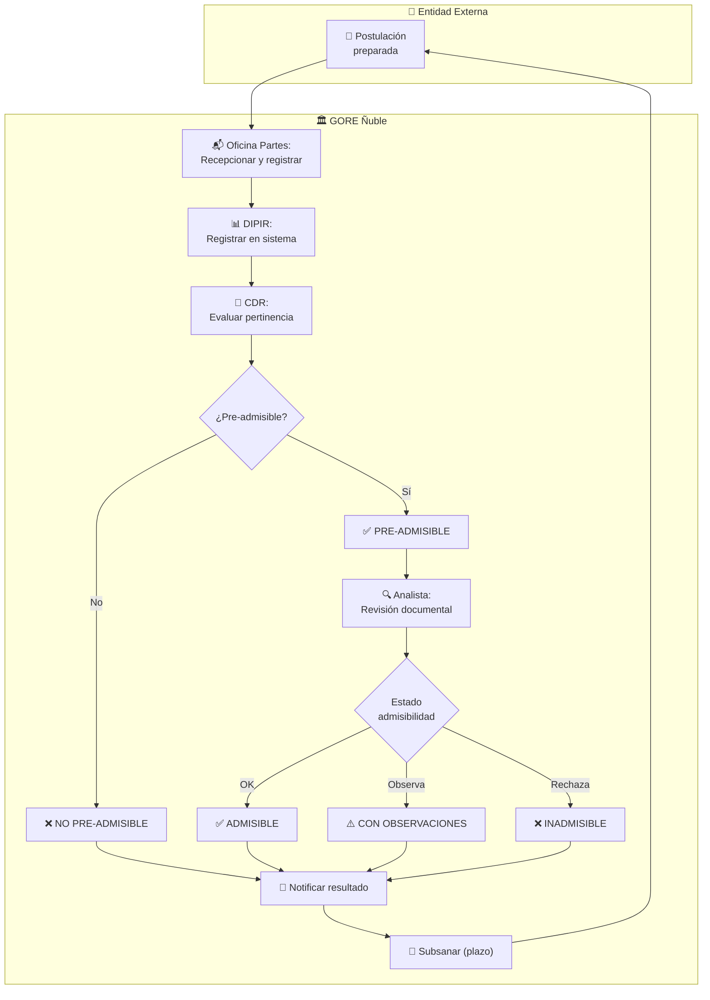
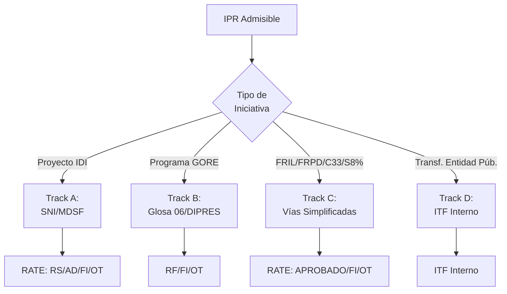
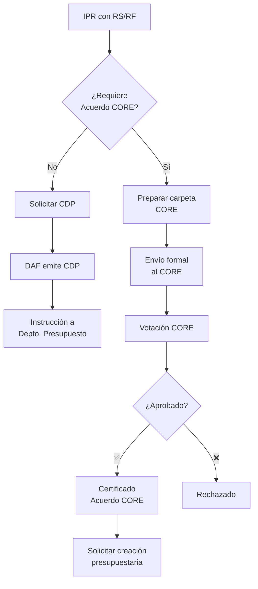
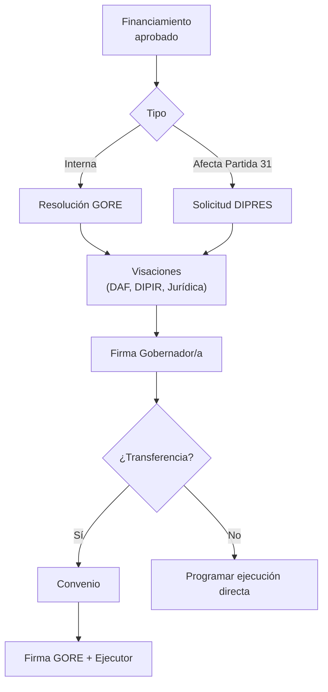
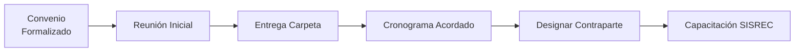
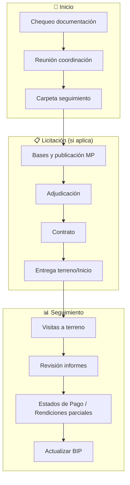
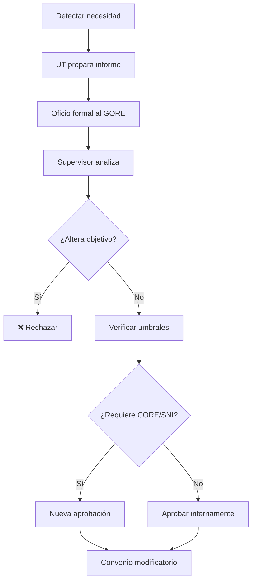
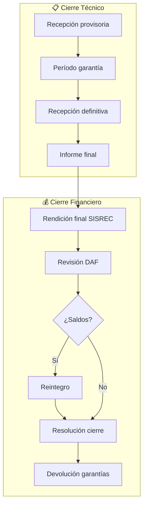

# D-FIN Subdominio: Core IPR

> Parte de: [D-FIN](../domain_d-fin.md) | [GORE_OS Blueprint](../../vision_general.md)  
> Función: Gestión del Ciclo de Vida de Intervenciones Públicas Regionales

---

## Taxonomía IPR

```text
IPR (Intervención Pública Regional)
├── IDI (Iniciativa de Inversión)
│   ├── Gasto de capital (S.31/S.33)
│   ├── Requiere RS/AD de MDSF
│   └── Registro obligatorio en BIP
├── PPR (Programa Público Regional)
│   ├── Gasto corriente/mixto (S.24)
│   ├── Ejecución directa GORE (Glosa 06) → RF DIPRES/SES
│   └── Transferencia a entidad pública → ITF interno GORE
└── Proyecto_Seguridad
    ├── Hereda de IPR
    └── Reglas especiales: validación SPD, convenio municipal
```

---

## Fases del Ciclo de Vida

| Fase | Nombre                            | Descripción                                | Resultado                |
| ---- | --------------------------------- | ------------------------------------------ | ------------------------ |
| 1    | Ingreso/Pertinencia/Admisibilidad | Recepción, filtro CDR, revisión documental | ADMISIBLE / INADMISIBLE  |
| 2    | Evaluación Técnico-Económica      | RS/RF/ITF según track                      | RATE aprobado            |
| 3    | Financiamiento                    | CDP, Acuerdo CORE si aplica                | Recursos asegurados      |
| 4    | Gestión Presupuestaria            | Resolución, Convenio                       | Formalización            |
| 5    | Ejecución                         | Licitación, Supervisión, EP/Transferencias | Avance físico-financiero |
| 6    | Modificaciones                    | Aumento costo, Prórroga, Cambio alcance    | Convenio modificatorio   |
| 7    | Cierre                            | Recepción, Rendición, Reintegro, Garantías | IPR cerrada              |

Estados Transversales: `SUSPENDIDA`, `CANCELADA`

---

## Procesos BPMN

### P1: Ingreso, Pertinencia y Admisibilidad



| Rol                   | Responsabilidad                 |
| --------------------- | ------------------------------- |
| Oficina de Partes     | Recepcionar, registrar, derivar |
| Jefatura DIPIR        | Registrar, convocar CDR         |
| CDR                   | Evaluar pertinencia estratégica |
| Analista Preinversión | Revisión documental exhaustiva  |

### P2: Evaluación Técnico-Económica



| Código | Tipo                        | Evaluador  | Aplica a             |
| ------ | --------------------------- | ---------- | -------------------- |
| RS     | Recomendación Satisfactoria | MDSF/SNI   | IDI                  |
| AD     | Admisible                   | MDSF/SNI   | Conservación         |
| RF     | Resultado Favorable         | DIPRES/SES | PPR Glosa 06         |
| ITF    | Informe Técnico Favorable   | GORE       | PPR Transferencia    |
| FI     | Favorable con Indicaciones  | Varios     | Aprobado con ajustes |
| OT     | Objetado Técnicamente       | Cualquiera | Rechazado            |

### P3: Obtención de Financiamiento



| Condición                       | ¿Requiere CORE? | Fundamento       |
| ------------------------------- | --------------- | ---------------- |
| Nueva asignación presupuestaria | ✅ Sí            | LOC GORE Art. 36 |
| Nuevo programa/proyecto         | ✅ Sí            | LOC GORE Art. 36 |
| Modificación > 5% costo total   | ✅ Sí            | Glosa 02         |
| Aumento costo ≤ 5%              | ❌ No            | Res. Gobernador  |
| Uso 3% emergencia (Glosa 14)    | ❌ No            | Glosa 14         |

### P4: Formalización



### P4-bis: Inducción de Ejecutor



### P5: Ejecución y Supervisión

> [!IMPORTANT]
> **Flujos bidireccionales según tipo de instrumento:**
> - **Patrón A (IDI/Obras):** Ejecuta → Presenta EP → Valida D-EJEC → Paga D-BACK
> - **Patrón B (PPR/Transf):** Paga anticipo → Ejecuta → Rinde SISREC → Aprueba DAF



### P6: Modificaciones en Ejecución



### P7: Cierre Técnico-Financiero



---

## Estados de Admisibilidad

| Estado                        | Descripción              | Siguiente Paso          |
| ----------------------------- | ------------------------ | ----------------------- |
| `PRE-ADMISIBLE CDR`           | Pertinencia aprobada     | Revisión documental     |
| `NO PRE-ADMISIBLE CDR`        | Pertinencia rechazada    | Archivar                |
| `ADMISIBLE`                   | Documentación completa   | Evaluación técnica (P2) |
| `ADMISIBLE CON OBSERVACIONES` | Documentación subsanable | 10 días para subsanar   |
| `INADMISIBLE`                 | Defectos no subsanables  | Rechazo formal          |

---

## Entidades de Datos

| Entidad              | Atributos Clave                                          | Relaciones                           |
| -------------------- | -------------------------------------------------------- | ------------------------------------ |
| `IPR`                | id, codigo_bip, nombre, naturaleza, mecanismo_id, estado | → Oportunidad, Mecanismo, Convenio[] |
| `Proyecto_Seguridad` | hereda IPR + tipo_prevencion, validacion_spd             | → IPR                                |
| `ActorIPR`           | id, ipr_id, actor_id, rol, fase, activo                  | → IPR, Actor                         |
| `EvaluacionIPR`      | id, ipr_id, tipo, resultado, observaciones               | → IPR                                |

---

## Referencias

- **Guía Gestión IPR:** [kb_gn_019_gestion_ipr_koda.yml](file:///Users/felixsanhueza/Developer/gorenuble/knowledge/domains/gn/kb_gn_019_gestion_ipr_koda.yml)
- **Integración D-EJEC:** [domain_d-ejec.md](../domain_d-ejec.md) (Validación EP)
- **Integración D-BACK:** [domain_d-back.md](../domain_d-back.md#contabilidad-operativa) (Cadena contable)

---

*Subdominio parte de D-FIN | GORE_OS Blueprint Integral v5.5*
