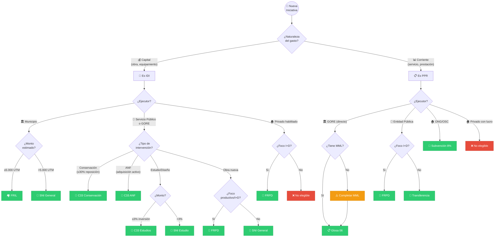

# D-FIN Subdominio: Selector de Mecanismos

> Parte de: [D-FIN](../domain_d-fin.md) | [GORE_OS Blueprint](../../vision_general.md)  
> Función: Clasificación y selección de vías de financiamiento para IPR

---

## Catálogo de Mecanismos

| Código | Nombre                | Tope UTM  | Evaluador | Ejecutor      | Guía KODA                                                                                                                         |
| ------ | --------------------- | --------- | --------- | ------------- | --------------------------------------------------------------------------------------------------------------------------------- |
| SNI    | IDI General           | Sin tope  | RS MDSF   | Público       | [kb_gn_024](file:///Users/felixsanhueza/Developer/gorenuble/knowledge/domains/gn/ipr/kb_gn_024_guia_idi_sni_koda.yml)             |
| FRIL   | Fondo Reg. Inf. Local | 5.000     | GORE      | Municipios    | [kb_gn_026](file:///Users/felixsanhueza/Developer/gorenuble/knowledge/domains/gn/ipr/kb_gn_026_guia_fril_koda.yml)                |
| FRPD   | Royalty (I+D+i)       | Variable¹ | SNI/GORE¹ | Habilitados   | [kb_gn_027](file:///Users/felixsanhueza/Developer/gorenuble/knowledge/domains/gn/ipr/kb_gn_027_guia_frpd_koda.yml)                |
| C33    | Circular 33           | ≤30%²     | GORE      | Público       | [kb_gn_029](file:///Users/felixsanhueza/Developer/gorenuble/knowledge/domains/gn/ipr/kb_gn_029_guia_circ33_koda.yml)              |
| G06    | PPR Glosa 06          | Sin tope  | RF DIPRES | GORE directo  | [kb_gn_025](file:///Users/felixsanhueza/Developer/gorenuble/knowledge/domains/gn/ipr/kb_gn_025_guia_programas_koda.yml)           |
| TRANSF | PPR Transferencia     | Sin tope  | ITF GORE  | Entidad Públ. | [kb_gn_001](file:///Users/felixsanhueza/Developer/gorenuble/knowledge/domains/gn/ipr/kb_gn_001_transferencia_ppr_koda.yml)        |
| S8%    | Subvención 8%         | Variable  | GORE      | ONG/OSC/Muni  | [kb_gn_028](file:///Users/felixsanhueza/Developer/gorenuble/knowledge/domains/gn/ipr/kb_gn_028_instructivo_subvencion_8_koda.yml) |

> **Notas:**  
> ¹ FRPD bifurca evaluación según tipo/umbral  
> ² C33 Conservación ≤30% costo reposición; ANF sin tope

---

## Árbol de Decisión

---

## Tabla Comparativa Expandida

| Mecanismo | Naturaleza | Ejecutor Elegible           | Evaluador       | Tope        | Ciclo Típico | Rendición     | Convocatoria        |
| --------- | ---------- | --------------------------- | --------------- | ----------- | ------------ | ------------- | ------------------- |
| SNI       | IDI        | Muni, Servicio, GORE        | MDSF → RS       | Sin tope    | 6-18 meses   | SISREC        | Ventanilla          |
| FRIL      | IDI        | Municipios                  | GORE            | ≤5.000 UTM  | 4-8 meses    | SISREC        | Concurso feb-mar    |
| FRPD      | IDI/PPR    | Público/Privado habilitado  | SNI o GORE      | Variable    | 6-12 meses   | SISREC        | Concurso/Ventanilla |
| C33       | IDI        | Entidad pública             | GORE            | ≤30% repos. | 3-6 meses    | SISREC        | Ventanilla          |
| G06       | PPR        | GORE directo                | DIPRES/SES → RF | Sin tope    | 8-14 meses   | N/A (directo) | Programación anual  |
| TRANSF    | PPR        | Muni, Servicio              | GORE → ITF      | Sin tope    | 3-6 meses    | SISREC        | Ventanilla          |
| S8%       | PPR        | ONG, OSC, Fundaciones, Muni | GORE            | % FNDR      | 4-6 meses    | SISREC        | Concurso mar-abr    |

---

## Criterios de Selección Rápida

| Pregunta Clave                         | Si la respuesta es... | Mecanismo    |
| -------------------------------------- | --------------------- | ------------ |
| ¿Infraestructura municipal <5.000 UTM? | Sí                    | **FRIL**     |
| ¿Conservación de activo existente?     | Sí                    | **C33**      |
| ¿Estudio o diseño sin obra?            | Sí                    | C33 o SNI    |
| ¿I+D+i o productividad regional?       | Sí                    | **FRPD**     |
| ¿Programa ejecutado por el GORE?       | Sí                    | **Glosa 06** |
| ¿Transferencia a entidad pública?      | Sí                    | **TRANSF**   |
| ¿Apoyo a ONG/OSC sin fines de lucro?   | Sí                    | **S8%**      |
| ¿Inversión tradicional >5.000 UTM?     | Sí                    | **SNI**      |

---

## Antipatrones Frecuentes

| Error Común                     | Consecuencia        | Corrección             |
| ------------------------------- | ------------------- | ---------------------- |
| Postular FRIL sin ser municipio | Inadmisible         | Redirigir a SNI o FRPD |
| Usar C33 para obra nueva        | Rechazado           | Usar SNI o FRIL        |
| PPR Transferencia a privado     | Inadmisible         | Usar S8%               |
| FRPD sin foco productivo        | Baja priorización   | SNI                    |
| Glosa 06 sin MML                | No obtiene RF       | Completar Marco Lógico |
| Omitir SISREC post-2023         | Rendición rechazada | SISREC obligatorio     |

---

## Guías Operativas por Mecanismo

### IDI - Sistema Nacional de Inversiones
- **URN:** `urn:knowledge:gorenuble:gn:guia-idi-sni-sts:1.0.0`
- **Archivo:** [kb_gn_024_guia_idi_sni_koda.yml](file:///Users/felixsanhueza/Developer/gorenuble/knowledge/domains/gn/ipr/kb_gn_024_guia_idi_sni_koda.yml)
- **Contenido:** Formulación IDI, principios SNI (proporcionalidad, separabilidad), indicadores VAN/TIR/VAC

### FRIL - Fondo Regional de Iniciativa Local
- **URN:** `urn:knowledge:gorenuble:gn:guia-fril-2025-sts:1.0.0`
- **Archivo:** [kb_gn_026_guia_fril_koda.yml](file:///Users/felixsanhueza/Developer/gorenuble/knowledge/domains/gn/ipr/kb_gn_026_guia_fril_koda.yml)
- **Contenido:** Instructivo FRIL 2025, requisitos municipales, procesos simplificados

### FRPD - Fondo Regional Productividad y Desarrollo
- **URN:** `urn:knowledge:gorenuble:gn:guia-frpd-nuble:1.0.0`
- **Archivo:** [kb_gn_027_guia_frpd_koda.yml](file:///Users/felixsanhueza/Developer/gorenuble/knowledge/domains/gn/ipr/kb_gn_027_guia_frpd_koda.yml)
- **Contenido:** Concurso FRPD, líneas de fomento, criterios de elegibilidad

### C33 - Circular 33
- **URN:** `urn:knowledge:gorenuble:gn:guia-circular-33-sts:1.0.0`
- **Archivo:** [kb_gn_029_guia_circ33_koda.yml](file:///Users/felixsanhueza/Developer/gorenuble/knowledge/domains/gn/ipr/kb_gn_029_guia_circ33_koda.yml)
- **Contenido:** Estudios, ANF, conservación, emergencias

### PPR Glosa 06 - Ejecución Directa GORE
- **URN:** `urn:knowledge:gorenuble:gn:guia-programas-directos-gore:1.0.0`
- **Archivo:** [kb_gn_025_guia_programas_koda.yml](file:///Users/felixsanhueza/Developer/gorenuble/knowledge/domains/gn/ipr/kb_gn_025_guia_programas_koda.yml)
- **Contenido:** Metodología MML, evaluación DIPRES/SES, ciclo de programa

### PPR Transferencia - Entidades Públicas
- **URN:** `urn:knowledge:gorenuble:gn:transferencia-ppr:1.0.0`
- **Archivo:** [kb_gn_001_transferencia_ppr_koda.yml](file:///Users/felixsanhueza/Developer/gorenuble/knowledge/domains/gn/ipr/kb_gn_001_transferencia_ppr_koda.yml)
- **Contenido:** Proceso ITF, convenios, formularios estandarizados

### S8% - Subvención Vinculación Comunidad
- **URN:** `urn:knowledge:gorenuble:gn:instructivo-subvencion-8-2025-sts:1.0.0`
- **Archivo:** [kb_gn_028_instructivo_subvencion_8_koda.yml](file:///Users/felixsanhueza/Developer/gorenuble/knowledge/domains/gn/ipr/kb_gn_028_instructivo_subvencion_8_koda.yml)
- **Contenido:** Concurso 8%, requisitos ONG/OSC, áreas de postulación

---

## Entidades de Datos

### Catálogo Maestro
**`MecanismoFinanciamiento`** (`d_fin_mecanismos_catalogo.yml`)
Catálogo centralizado (SSOT) que define reglas, umbrales y evaluadores.

| Código     | Naturaleza | Tope UTM | Evaluador |
| :--------- | :--------- | :------- | :-------- |
| **SNI**    | IDI        | ∞        | MDSF      |
| **FRIL**   | IDI        | 5.000    | GORE      |
| **FRPD**   | Mixto      | Variable | Variable  |
| **C33**    | IDI        | Variable | GORE      |
| **G06**    | PPR        | ∞        | DIPRES    |
| **TRANSF** | PPR        | ∞        | GORE      |
| **S8%**    | PPR        | 8% FNDR  | GORE      |

> [!NOTE]
> Las entidades operativas (`IPR`, `IDI`, `PPR`) referencian a este catálogo mediante `mecanismo_id`.

| Entidad     | Atributos Clave                                                                          |
| ----------- | ---------------------------------------------------------------------------------------- |
| `Mecanismo` | id, codigo, nombre, tope_utm, tipo_evaluacion, ejecutor_tipo, requiere_rs, guia_koda_ref |

---

## Roles Asociados (SSOT: inventario_roles_v8.yml)

| Role Key           | Título             | Función                    |
| ------------------ | ------------------ | -------------------------- |
| jefe_dipir         | Jefe DIPIR         | Aprobación de vía          |
| analista_inversion | Analista Inversión | Evaluación de mecanismo    |
| analista_fril      | Analista FRIL      | Vía simplificada municipal |
| formulador_externo | Formulador Externo | Consultor postulante       |

---

*Subdominio parte de D-FIN | GORE_OS Blueprint Integral v5.5*  
*SSOT: inventario_roles_v8.yml*
