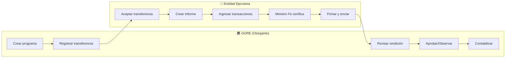
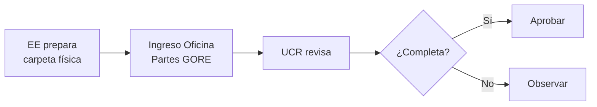
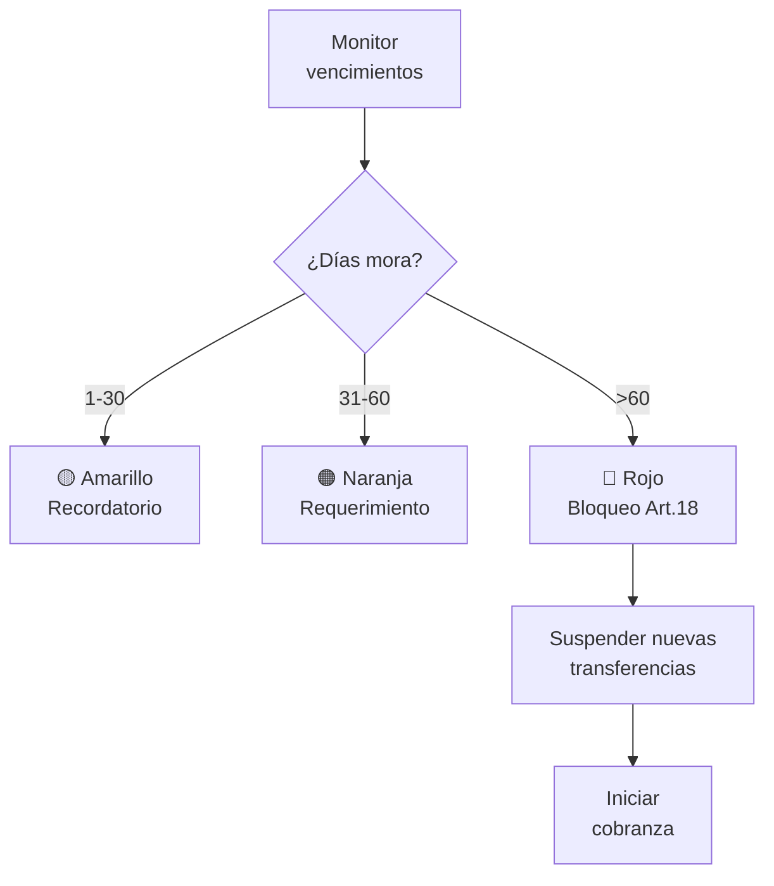

# D-FIN Subdominio: Rendiciones

> Parte de: [D-FIN](../domain_d-fin.md) | [GORE_OS Blueprint](../../vision_general.md)  
> Función: Gestión del ciclo de rendición de cuentas

---

## Flujos de Rendición

> [!IMPORTANT]
> **Dos patrones según tipo de instrumento:**
> 
> | Patrón | Instrumento | Flujo | Tipo Rendición |
> |--------|-------------|-------|----------------|
> | **A** | IDI, Obras FRIL, FNDR | Ejecuta → EP → Paga | EP como rendición parcial |
> | **B** | PPR, S8%, Transferencias | Paga anticipo → Ejecuta → Rinde | Rendición final post-ejecución |

---

## Estados de Rendición

```text
PENDIENTE → EN_REVISIÓN → APROBADA
           ↓
    (OBSERVADA, EN_MORA, RECHAZADA)
```

---

## REND-P1: Rendición vía SISREC (Obligatorio desde 2023)



---

## REND-P2: Rendición Tradicional (Legado)

> ⚠️ Obsoleto desde 2023. Aplica solo a convenios anteriores a Res. 1858/2023 CGR.



---

## REND-P3: Gestión de Mora



### Umbrales de Mora

| Días  | Nivel      | Acción                     | Responsable |
| ----- | ---------- | -------------------------- | ----------- |
| 1-30  | 🟡 Amarillo | Recordatorio automático    | Sistema     |
| 31-60 | 🟠 Naranja  | Requerimiento formal       | UCR         |
| >60   | 🔴 Rojo     | Bloqueo Art.18, suspensión | Jefe DAF    |
| >90   | ⚫ Crítico  | Cobranza judicial          | Jurídica    |

---

## Marco Normativo

| Norma                    | Alcance                                 |
| ------------------------ | --------------------------------------- |
| Resolución 30/2015 CGR   | Procedimiento general                   |
| Resolución 1858/2023 CGR | SISREC obligatorio                      |
| Res. 30/2015 Art. 18     | ⚠️ Prohibe nuevos fondos si pendientes   |
| Res. 30/2015 Art. 31     | Obligación restituir no rendidos        |
| Res. 30/2015 Art. 35     | Plazo máximo 60 días desde última cuota |

---

## Entidades de Datos

| Entidad            | Atributos Clave                                                                            | Relaciones              |
| ------------------ | ------------------------------------------------------------------------------------------ | ----------------------- |
| `Transferencia`    | id, convenio_id, monto, fecha_giro, estado                                                 | → Convenio, Rendicion[] |
| `Rendicion`        | id, transferencia_id, estado, monto_rendido, ubicacion_fisica, codigo_qr, coherencia_sigfe | → Transferencia         |
| `InformeRendicion` | id, rendicion_id, tipo, estado_sisrec, firma_fea                                           | → Rendicion             |
| `Observacion`      | id, rendicion_id, descripcion, estado, fecha_respuesta                                     | → Rendicion             |

---

## KPIs

| Indicador             | Fórmula                      | Meta | Responsable |
| --------------------- | ---------------------------- | ---- | ----------- |
| Mora rendiciones      | Rendiciones >60 días / Total | ≤5%  | UCR         |
| % Rendiciones SISREC  | SISREC / Total               | ≥95% | UCR         |
| Reintegros pendientes | Monto / Total transferido    | ≤2%  | DAF         |

---

## Referencias

- **Guía Rendiciones:** [kb_gn_020_gestion_rendiciones_koda.yml](file:///Users/felixsanhueza/Developer/gorenuble/knowledge/domains/gn/kb_gn_020_gestion_rendiciones_koda.yml)
- **Integración D-BACK:** [domain_d-back.md](../domain_d-back.md) (Contabilización)

---

*Subdominio parte de D-FIN | GORE_OS Blueprint Integral v5.5*
