# D-BACK: Dominio de Gestión de Recursos Institucionales

> **Parte de:** [GORE_OS Vision General](../vision_general.md)  
> **Capa:** Habilitante (Soporte Operativo)  
> **Función GORE:** ADMINISTRAR  
> **Procesos BPMN:** 14 | **Subprocesos:** ~49 | **User Stories:** 58

---

## Glosario D-BACK

| Término              | Definición                                                                 |
| -------------------- | -------------------------------------------------------------------------- |
| **EUS**              | Escala Única de Sueldos. Tabla de grados y asignaciones del sector público |
| **PAC-Compras**      | Plan Anual de Compras. Programación de adquisiciones en Mercado Público    |
| **PAC-Capacitación** | Plan Anual de Capacitación. Programa de formación funcionaria              |
| **DNC**              | Detección de Necesidades de Capacitación. Insumo para PAC-Capacitación     |
| **CDP**              | Certificado de Disponibilidad Presupuestaria. Ver D-FIN                    |
| **OC**               | Orden de Compra. Documento que formaliza adquisición                       |
| **CM**               | Convenio Marco. Mecanismo de compra pre-negociado en ChileCompra           |
| **PPP**              | Precio Promedio Ponderado. Método de valorización de inventarios           |
| **FIFO**             | First In, First Out. Método de valorización                                |
| **FEFO**             | First Expired, First Out. Para productos perecibles                        |
| **SIGPER**           | Sistema de Gestión de Personal del Estado                                  |
| **SIAPER**           | Sistema de Información y Control del Personal de la Administración         |
| **SIGAS**            | Sistema de Gestión de Activos y Suministros                                |
| **PREVIRED**         | Plataforma de pago de cotizaciones previsionales                           |

---

## Propósito

Gestionar el ciclo de vida de todos los recursos institucionales del GORE: personas, bienes, servicios, infraestructura y presupuesto operativo, asegurando eficiencia, transparencia y cumplimiento normativo.

> **Visión:** Los recursos institucionales —humanos, materiales, financieros y tecnológicos— se gestionan como un sistema integrado que maximiza la eficiencia operativa y minimiza los riesgos de incumplimiento.

---

## Cuatro Pilares del Dominio

| Pilar              | Componentes                                          |
| ------------------ | ---------------------------------------------------- |
| **Personas**       | Ciclo de vida funcionario, remuneraciones, bienestar |
| **Abastecimiento** | Compras, contratos, proveedores                      |
| **Patrimonio**     | Inventarios, activo fijo, bodegas                    |
| **Servicios**      | Flota vehicular, mantención, infraestructura         |

---

## Módulos

### 1. Gestión de Personas (RRHH)

**Ciclo de Vida:**
```
INGRESO → INDUCCIÓN → DESARROLLO → EVALUACIÓN → EGRESO
```

**Subsistemas:**
- Reclutamiento y selección
- Contratación y nombramiento
- Remuneraciones (EUS)
- Tiempo y asistencia
- Capacitación y desarrollo
- Bienestar funcionario
- Calificaciones

### 2. Abastecimiento y Compras

**Cadena de Adquisición:**
```
PAC-Compras → REQUERIMIENTO → CDP → LICITACIÓN/CM → OC → RECEPCIÓN → PAGO
```

> **Nota:** CDP (Certificado de Disponibilidad Presupuestaria) se gestiona en [D-FIN](domain_d-fin.md#cadena-presupuestaria-sigfe).

**Mecanismos:**
| Mecanismo          | Umbral        | Plataforma      |
| ------------------ | ------------- | --------------- |
| Convenio Marco     | Sin límite    | Mercado Público |
| Licitación Pública | > 1.000 UTM   | Mercado Público |
| Licitación Privada | 100-1.000 UTM | Mercado Público |
| Compra Directa     | < 100 UTM     | Mercado Público |

### 3. Inventarios y Bodega

**Métodos de Valorización:**
| Método | Uso                                   |
| ------ | ------------------------------------- |
| PPP    | Precio Promedio Ponderado (default)   |
| FIFO   | First In, First Out                   |
| FEFO   | First Expired, First Out (perecibles) |

### 4. Activo Fijo

**Criterio de Capitalización:** Valor ≥ 3 UTM y vida útil > 1 año

**Ciclo:**
```
ALTA → VALORIZACIÓN → DEPRECIACIÓN → MOVIMIENTOS → BAJA
```

### 5. Flota Vehicular

**Restricciones D.L. 799:**
- Uso solo en horario laboral
- Prohibido uso particular
- Autorización para fines de semana

### 6. Bienestar Funcionario

**Prestaciones:**
- Bonificaciones médicas
- Préstamos
- Subsidios por eventos
- Convenios con terceros

---

## 📋 Procesos BPMN

### Mapa General Integrado

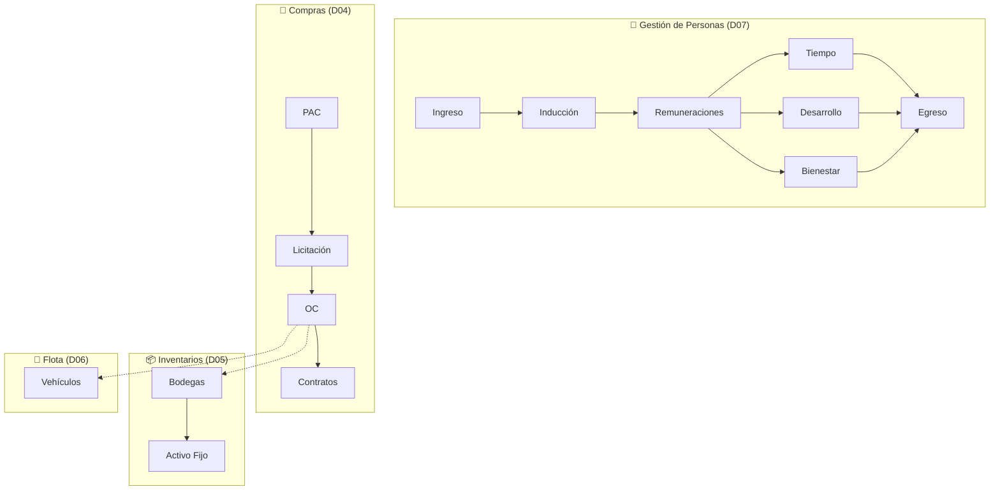

---

### D04: Compras Públicas y Contrataciones

| Campo          | Valor                    |
| -------------- | ------------------------ |
| **ID**         | `DOM-COMPRAS`            |
| **Criticidad** | 🟠 Alta                   |
| **Dueño**      | Unidad de Abastecimiento |
| **Procesos**   | 4                        |

#### P1: Plan Anual de Compras (PAC)

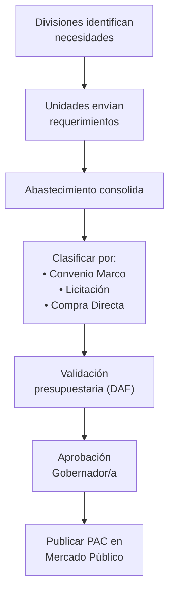

#### P2: Licitación Pública

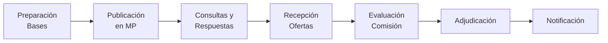

#### Mecanismos de Compra

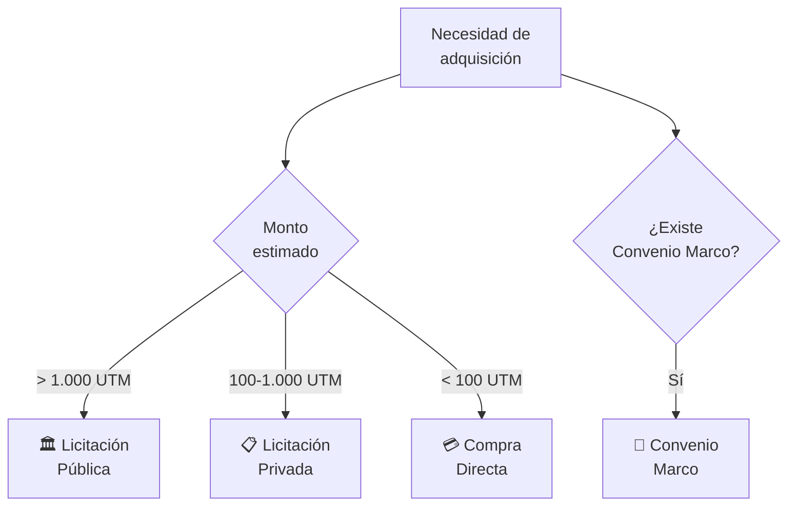

#### P3: Órdenes de Compra

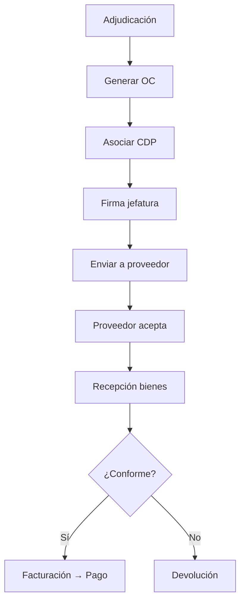

#### P4: Gestión de Contratos

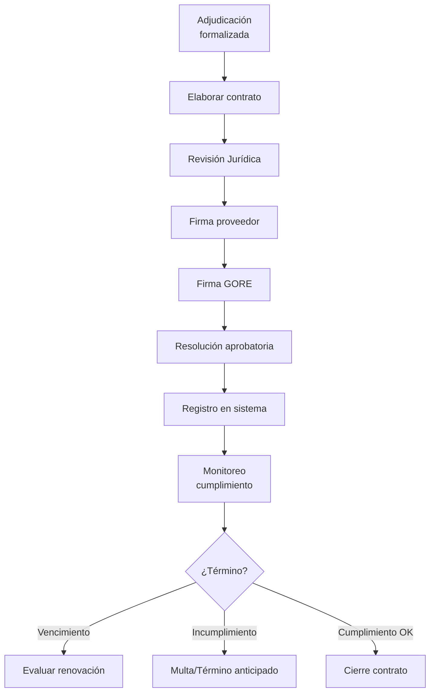

---

### D05: Gestión de Inventarios y Activo Fijo

| Campo          | Valor                |
| -------------- | -------------------- |
| **ID**         | `DOM-INVENTARIOS-AF` |
| **Criticidad** | 🟡 Media              |
| **Dueño**      | DAF                  |
| **Procesos**   | 2                    |

#### Recepción de Bienes

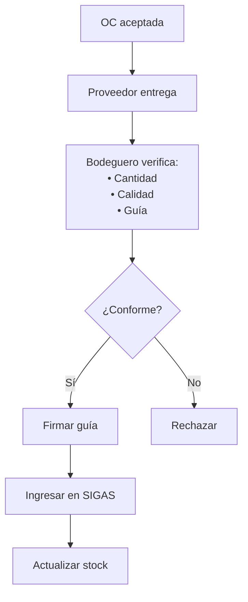

#### Alta de Activo Fijo

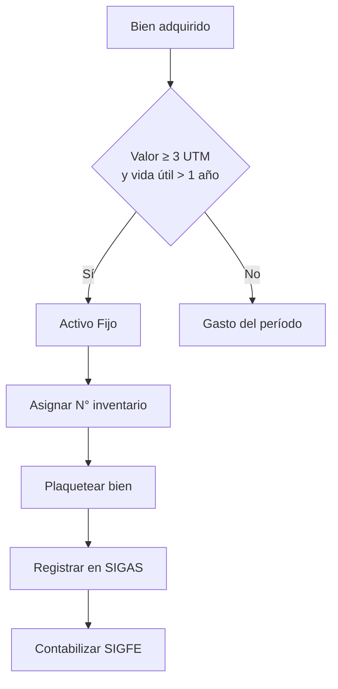

#### Baja de Bienes

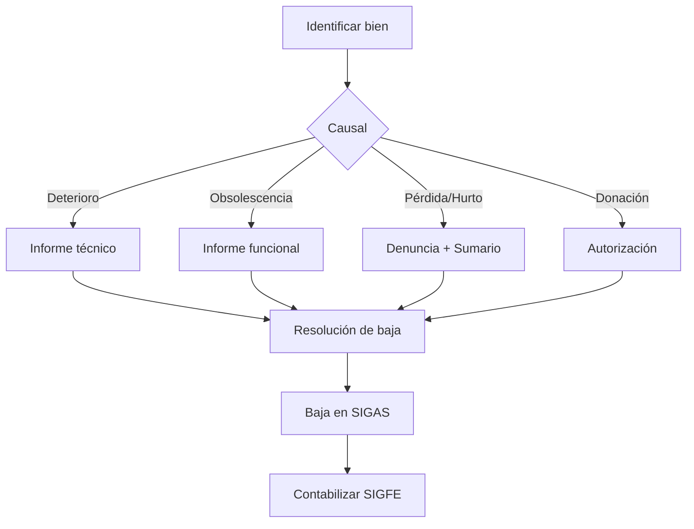

---

### D06: Gestión de Flota Vehicular

| Campo           | Valor                    |
| --------------- | ------------------------ |
| **ID**          | `DOM-FLOTA`              |
| **Criticidad**  | 🟡 Media                  |
| **Dueño**       | Jefe Servicios Generales |
| **Subprocesos** | 6                        |

#### Solicitud y Asignación

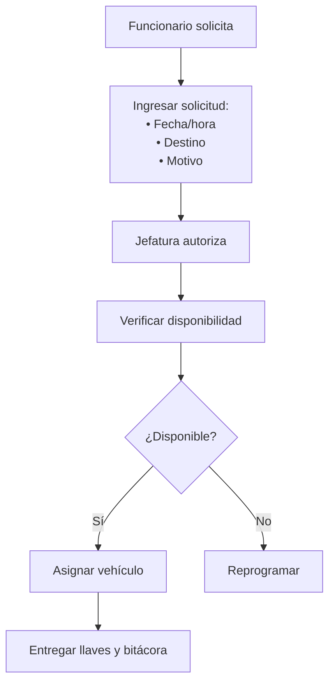

#### Mantención Vehicular

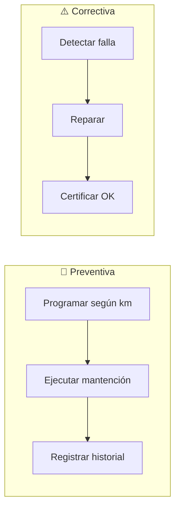

#### Programa de Mantención

| Tipo       | Frecuencia | Acciones                  |
| ---------- | ---------- | ------------------------- |
| Básica     | 5.000 km   | Cambio aceite, filtros    |
| Intermedia | 15.000 km  | Frenos, neumáticos        |
| Mayor      | 30.000 km  | Revisión completa         |
| Documentos | Anual      | Revisión técnica, permiso |

---

### D07: Gestión de Personas

| Campo          | Valor                       |
| -------------- | --------------------------- |
| **ID**         | `DOM-RRHH`                  |
| **Criticidad** | 🟠 Alta                      |
| **Dueño**      | Área de Gestión de Personas |
| **Procesos**   | 7                           |

#### P1: Ingreso y Contratación


#### Tipos de Contrato

| Tipo           | Descripción                        |
| -------------- | ---------------------------------- |
| **Planta**     | Cargo titular, carrera funcionaria |
| **Contrata**   | Transitorio, renovación anual      |
| **Honorarios** | Servicios específicos              |

#### P3: Remuneraciones

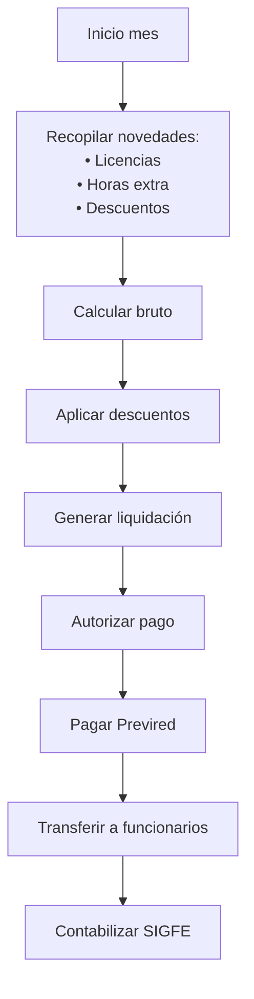

#### P5: Capacitación y Calificaciones

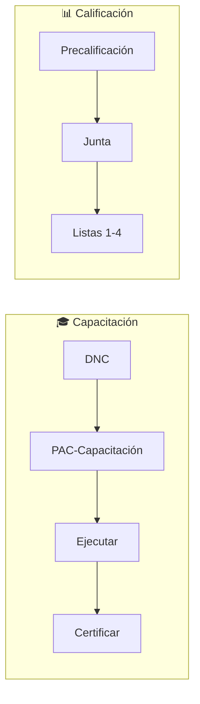

#### P7: Egreso

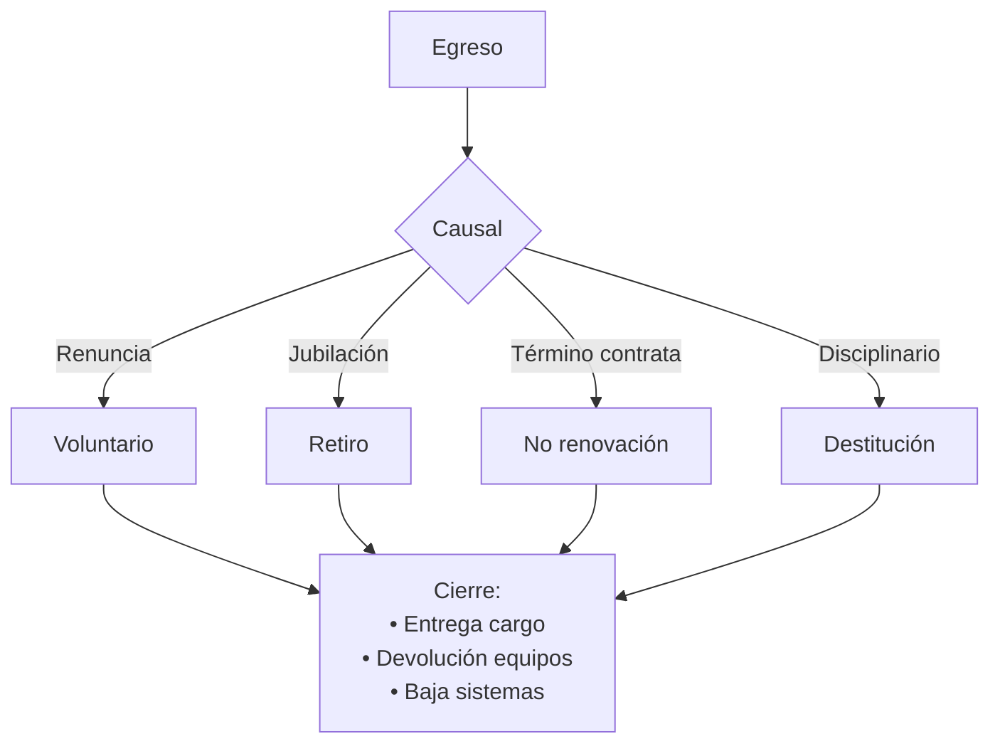

---

## 📝 User Stories por Módulo

### Resumen

| Módulo          | US Críticas | US Altas | US Medias | Total  |
| --------------- | ----------- | -------- | --------- | ------ |
| Personas        | 8           | 8        | 2         | 18     |
| Abastecimiento  | 4           | 4        | 0         | 8      |
| Contabilidad    | 2           | 1        | 0         | 3      |
| Inventarios     | 2           | 1        | 0         | 3      |
| Activo Fijo     | 1           | 3        | 0         | 4      |
| Flota/Servicios | 2           | 3        | 2         | 7      |
| Bienestar       | 1           | 6        | 2         | 9      |
| Competencias    | 2           | 2        | 2         | 6      |
| **Total**       | **22**      | **28**   | **8**     | **58** |

> **Fuente:** [kb_goreos_us_d-back.yml](../user-stories/kb_goreos_us_d-back.yml)

### Catálogo por Proceso

#### D04: Compras

| ID              | Título                 | Prioridad | Actor               |
| --------------- | ---------------------- | --------- | ------------------- |
| US-BACK-ABS-001 | Plan Anual de Compras  | Alta      | Enc. Abastecimiento |
| US-BACK-ABS-003 | Publicar licitaciones  | Crítica   | Enc. Abastecimiento |
| US-BACK-ABS-004 | Evaluar ofertas        | Crítica   | Enc. Abastecimiento |
| US-BACK-ABS-005 | Emitir Orden de Compra | Crítica   | Enc. Abastecimiento |
| US-BACK-ABS-006 | Gestionar contratos    | Alta      | Enc. Abastecimiento |

#### D05: Inventarios y Activo Fijo

| ID              | Título                      | Prioridad | Actor            |
| --------------- | --------------------------- | --------- | ---------------- |
| US-BACK-BOD-001 | Registrar ingresos a bodega | Crítica   | Enc. Bodega      |
| US-BACK-BOD-002 | Despachar solicitudes       | Crítica   | Enc. Bodega      |
| US-BACK-AF-001  | Alta activo fijo            | Crítica   | Enc. Activo Fijo |
| US-BACK-AF-003  | Baja de bienes              | Alta      | Enc. Activo Fijo |

#### D06: Flota

| ID              | Título                   | Prioridad | Actor      |
| --------------- | ------------------------ | --------- | ---------- |
| US-BACK-FLO-002 | Solicitudes de vehículos | Alta      | Enc. Flota |
| US-BACK-FLO-003 | Control km/combustible   | Alta      | Enc. Flota |

#### D07: Personas

| ID              | Título                       | Prioridad | Actor              |
| --------------- | ---------------------------- | --------- | ------------------ |
| US-BACK-PER-001 | Visualizar ficha funcionario | Crítica   | Funcionario        |
| US-BACK-PER-003 | Solicitar feriado/permiso    | Crítica   | Funcionario        |
| US-BACK-PER-004 | Declarar licencia médica     | Crítica   | Funcionario        |
| US-BACK-PER-006 | Visualizar liquidación       | Crítica   | Funcionario        |
| US-BACK-PER-010 | Calcular liquidaciones       | Crítica   | Gestor Personas    |
| US-BACK-PER-011 | Generar planilla Previred    | Crítica   | Gestor Personas    |
| US-BACK-PER-016 | Registrar precalificación    | Crítica   | Junta Calificadora |
| US-BACK-PER-017 | Consolidar calificaciones    | Crítica   | Junta Calificadora |

#### Bienestar

| ID               | Título                        | Prioridad | Actor           |
| ---------------- | ----------------------------- | --------- | --------------- |
| US-BACK-BIEN-008 | Coordinar con Mutual          | Crítica   | Prof. Bienestar |
| US-BACK-BIEN-003 | Gestionar bonificación médica | Alta      | Prof. Bienestar |
| US-BACK-BIEN-005 | Evaluar préstamos             | Alta      | Prof. Bienestar |

*Ver catálogo completo en [kb_goreos_us_d-back.yml](../user-stories/kb_goreos_us_d-back.yml)*

---

## 🔗 Matriz de Trazabilidad

| Proceso BPMN           | Subproceso    | User Stories           |
| ---------------------- | ------------- | ---------------------- |
| D04 P1: PAC            | Consolidación | US-BACK-ABS-001        |
| D04 P2: Licitación     | Publicación   | US-BACK-ABS-003        |
| D04 P2: Licitación     | Evaluación    | US-BACK-ABS-004        |
| D04 P3: OC             | Emisión       | US-BACK-ABS-005        |
| D04 P4: Contratos      | Gestión       | US-BACK-ABS-006        |
| D05 P1: Bodegas        | Recepción     | US-BACK-BOD-001        |
| D05 P1: Bodegas        | Despacho      | US-BACK-BOD-002        |
| D05 P2: AF             | Alta          | US-BACK-AF-001         |
| D05 P2: AF             | Baja          | US-BACK-AF-003         |
| D06: Flota             | Asignación    | US-BACK-FLO-002        |
| D06: Flota             | Control       | US-BACK-FLO-003        |
| D07 P1: Ingreso        | Selección     | US-BACK-PER-015        |
| D07 P3: Remuneraciones | Liquidación   | US-BACK-PER-010, 011   |
| D07 P4: Tiempo         | Feriados      | US-BACK-PER-003        |
| D07 P4: Tiempo         | Licencias     | US-BACK-PER-004, 009   |
| D07 P5: Desarrollo     | Calificación  | US-BACK-PER-016, 017   |
| D07 P6: Bienestar      | Prestaciones  | US-BACK-BIEN-001 a 012 |

---

## Entidades de Datos

### Personas

| Entidad           | Atributos Clave                                                       | Relaciones                                   |
| ----------------- | --------------------------------------------------------------------- | -------------------------------------------- |
| `Funcionario`     | id, rut, nombre, cargo, grado_eus, division_id, fecha_ingreso, estado | → ContratoLaboral, Liquidacion[], Licencia[] |
| `ContratoLaboral` | id, funcionario_id, tipo, fecha_inicio, fecha_termino                 | → Funcionario                                |
| `Liquidacion`     | id, funcionario_id, periodo, bruto, descuentos, liquido               | → Funcionario                                |
| `Licencia`        | id, funcionario_id, tipo, dias, fecha_inicio, estado                  | → Funcionario                                |

### Abastecimiento

| Entidad               | Atributos Clave                                              | Relaciones              |
| --------------------- | ------------------------------------------------------------ | ----------------------- |
| `OrdenCompra`         | id, numero_mp, proveedor_id, monto, estado, fecha            | → Proveedor, ItemOC[]   |
| `Licitacion`          | id, numero_mp, tipo, estado, fecha_publicacion, fecha_cierre | → OrdenCompra           |
| `ContratoAdquisicion` | id, licitacion_id, proveedor_id, monto, vigencia             | → Licitacion, Proveedor |

### Inventarios

| Entidad          | Atributos Clave                                                     | Relaciones                  |
| ---------------- | ------------------------------------------------------------------- | --------------------------- |
| `ItemInventario` | id, codigo, descripcion, unidad, stock, ubicacion, valor_unitario   | → MovimientoStock[]         |
| `ActivoFijo`     | id, codigo, descripcion, valor_compra, vida_util, depreciacion_acum | → Funcionario (responsable) |
| `Vehiculo`       | id, patente, modelo, año, km_actual, estado                         | → Bitacora[], Mantencion[]  |

---

## Sistemas Involucrados

| Sistema           | Función                             |
| ----------------- | ----------------------------------- |
| `SYS-SIGPER`      | Gestión de personas, remuneraciones |
| `SYS-SIAPER`      | Control personal Estado             |
| `SYS-PREVIRED`    | Cotizaciones previsionales          |
| `ORG-CHILECOMPRA` | Mercado Público, licitaciones, OC   |
| `SYS-SIGAS`       | Inventarios y activo fijo           |
| `SYS-SIGFE`       | Contabilización                     |

---

## Normativa Aplicable

| Norma                | Alcance                     |
| -------------------- | --------------------------- |
| **Ley 18.834**       | Estatuto Administrativo     |
| **Ley 19.886**       | Compras públicas            |
| **D.S. 250**         | Reglamento Ley 19.886       |
| **D.L. 799**         | Uso vehículos fiscales      |
| **NICSP 17, 21, 31** | Activo fijo, depreciación   |
| **Ley 18.575**       | Bases Administración Estado |

---

## Referencias Cruzadas

| Dominio     | Relación                                     | Entidades Compartidas      |
| ----------- | -------------------------------------------- | -------------------------- |
| **D-FIN**   | CDP requerido para OC, cadena presupuestaria | CDP, Compromiso            |
| **D-NORM**  | Resoluciones de adjudicación, contratos      | ActoAdministrativo         |
| **D-TDE**   | Interoperabilidad SIGFE, Mercado Público     | IntegracionPISEE           |
| **D-COORD** | Proveedores como actores                     | Actor                      |
| **D-SEG**   | Equipamiento CIES, vehículos seguridad       | Vehiculo, ActivoFijo       |
| **D-TERR**  | Geolocalización bienes fiscales, flota       | Ubicacion, CapaGeoespacial |

---

*Documento parte de GORE_OS Blueprint Integral v5.0*  
*Última actualización: 2025-12-16*
