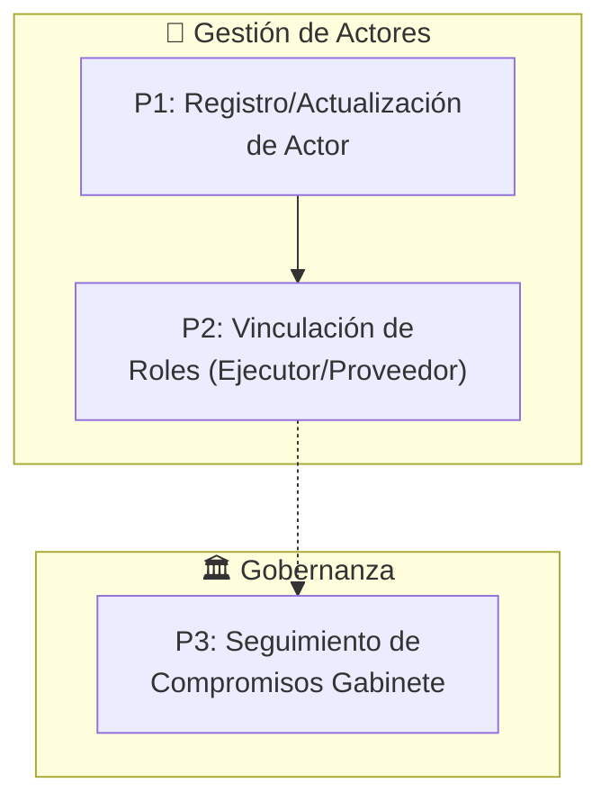
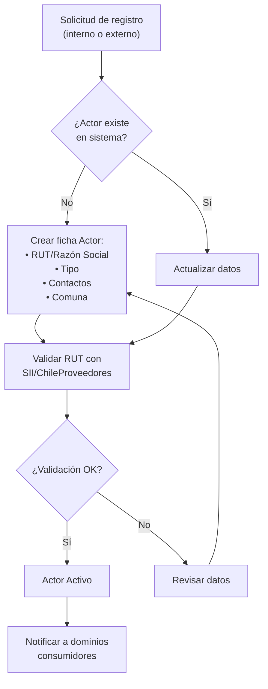
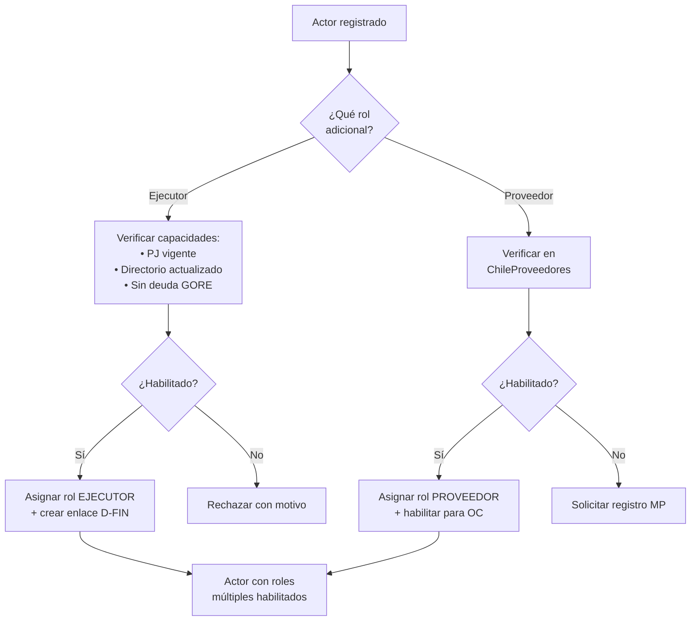
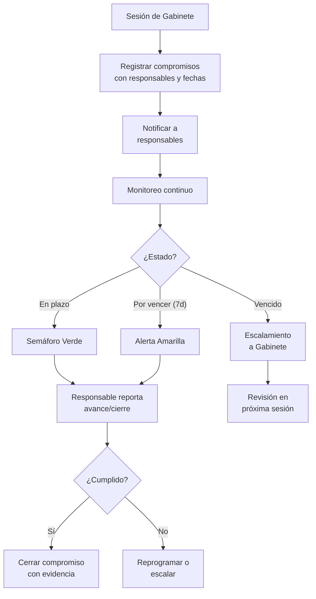

# D-COORD: Dominio de Coordinación y Gestión Relacional

> **Parte de:** [GORE_OS Vision General](../vision_general.md)  
> **Capa:** Núcleo (Dimensión Táctica)  
> **Función GORE:** COORDINAR  
> **Procesos BPMN:** 3 | **Subprocesos:** ~9 | **User Stories:** 8 (referenciadas de D-GOB)

---

## Glosario D-COORD

| Término              | Definición                                                                                                |
| -------------------- | --------------------------------------------------------------------------------------------------------- |
| **Actor**            | Entidad externa o interna que interactúa con el GORE: municipios, servicios, universidades, ONG, personas |
| **Ejecutor**         | Actor con rol de ejecución de proyectos/convenios. Es un `tipo` de Actor                                  |
| **Proveedor**        | Actor habilitado para suministrar bienes/servicios. Es un `tipo` de Actor                                 |
| **SSOT**             | Single Source of Truth. Fuente única de datos maestros                                                    |
| **OIRS**             | Oficina de Información, Reclamos y Sugerencias (Ley 19.880, 20.285)                                       |
| **COSOC**            | Consejo de Organizaciones de la Sociedad Civil                                                            |
| **Gabinete**         | División del GORE que coordina agenda y relaciones del Gobernador Regional                                |
| **ChileProveedores** | Plataforma estatal de registro de proveedores                                                             |
| **ActorIPR**         | Rol de un Actor en una IPR (ver D-FIN)                                                                    |
| **H_org**            | Dashboard de Estado de Salud Organizacional (ver D-EVOL)                                                  |
| **DIPLADE**          | División de Planificación y Desarrollo Regional                                                           |
| **DAF**              | División de Administración y Finanzas                                                                     |

---

## Propósito

Gestionar las relaciones con actores territoriales, ejecutores, proveedores, ciudadanos y la gobernanza regional, actuando como **SSOT del directorio de entidades externas**.

> **Principio Core:** D-COORD gestiona los **datos maestros** de actores (quién es, contacto, historial). Otros dominios consumen esa información para sus procesos específicos (D-FIN: rating financiero, D-BACK: operación de compras).

---

## Cuatro Módulos del Dominio

| Módulo                      | Función                                           | SSOT de                            |
| --------------------------- | ------------------------------------------------- | ---------------------------------- |
| **Directorio de Actores**   | Registro y mantenimiento de actores territoriales | Actor, Ejecutor, Proveedor         |
| **Participación Ciudadana** | Consultas públicas, transparencia                 | ConsultaPublica                    |
| **Gabinete**                | Sesiones, compromisos, seguimiento                | CompromisoGabinete, SesionGabinete |
| **Gobernanza Regional**     | Consejos, articulación multiactor                 | InstanciaGobernanza                |

> **Nota de Diseño:** La gestión de OIRS (solicitudes ciudadanas) se centraliza en **D-NORM** como proceso administrativo reglado.

---

## Módulos

### 1. Directorio de Actores

**Tipos de Actores:**

| Tipo             | Descripción                                   | Ejemplo                        |
| ---------------- | --------------------------------------------- | ------------------------------ |
| Municipalidad    | 21 comunas de Ñuble                           | I. Municipalidad de Chillán    |
| Servicio Público | SEREMIs, Direcciones regionales               | SEREMI Salud, Vialidad         |
| Universidad      | IES públicas y privadas                       | UBB, UCSC                      |
| Corporación      | Entidades sin fines de lucro                  | CORFO, CONAF Regional          |
| ONG              | Sociedad civil organizada                     | Fundaciones, ONG territoriales |
| Persona          | Beneficiarios, consultores                    | RUT individual                 |
| Ejecutor         | Actor habilitado para ejecutar proyectos      | Muni + Rating D-FIN            |
| Proveedor        | Actor habilitado para vender bienes/servicios | Proveedor ChileProveedores     |

**Funcionalidades:**

- Directorio centralizado con contactos y representantes legales
- Historial de interacciones (reuniones, convenios, compromisos)
- Convenios vigentes por actor (referencia a D-NORM)
- Compromisos pendientes con alertas de vencimiento
- Mapa georreferenciado de actores (integración D-TERR)
- Scoring de relación (frecuencia, cumplimiento, conflictos)

### 2. Participación Ciudadana

> **Nota de Diseño:** La gestión de solicitudes OIRS (Información, Reclamos, Sugerencias) se centraliza en **D-NORM** como proceso administrativo con SLA de 20 días hábiles. D-COORD gestiona las **consultas públicas y participación** no reglada.

**Funcionalidades:**

- Gestión de consultas públicas (convocatoria, participación, resultados)
- Coordinación con COSOC Regional
- Métricas de satisfacción ciudadana
- Integración con portal de transparencia

### 3. Gabinete

**Funcionalidades:**

- Agenda de sesiones (programación, convocatoria, asistencia)
- Registro de compromisos del Gobernador
- Seguimiento de acuerdos con estados y alertas
- Minutas y documentación de reuniones
- Reportes de cumplimiento para H_org (D-EVOL)

### 4. Instancias de Gobernanza Regional

**Consejo Regional de Seguridad Pública** (Ley 21.730):

| Instancia                    | Descripción                     | Participación GORE                  |
| ---------------------------- | ------------------------------- | ----------------------------------- |
| Consejo Regional             | Coordinación regional (Art. 10) | Gobernador como miembro permanente  |
| Comité Prevención del Delito | Instancia técnica               | Jefe División Prevención del Delito |
| Consejos Comunales           | Instancias locales (Art. 12)    | Representante designado             |

**Otras Instancias:**

- COSOC Regional (Ley 20.500)
- Mesas territoriales temáticas
- Comités de emergencia (GRD)

**Funcionalidades:**

- Calendario unificado de instancias
- Registro de participantes y representantes
- Actas y acuerdos de cada sesión
- Seguimiento de compromisos multiactor
- Coordinación con SEREMI de Seguridad Pública

---

## 📋 Procesos BPMN

### Mapa General D-COORD

---

### P1: Registro y Actualización de Actor

---

### P2: Vinculación de Roles (Ejecutor/Proveedor)

---

### P3: Seguimiento de Compromisos de Gabinete

---

## 📝 User Stories Relacionadas

> **Nota:** D-COORD no tiene archivo de US propio. Las historias relevantes provienen de **D-GOB** (Gabinete, actores).

### Resumen por Origen

| Dominio Fuente | Módulo     | US Aplicables | Prioridad             |
| -------------- | ---------- | ------------- | --------------------- |
| D-GOB          | Gabinete   | 6             | 2 Crítica, 4 Alta     |
| D-GOB          | Gobernador | 2             | 2 Crítica             |
| **Total**      |            | **8**         | **4 Crítica, 4 Alta** |

### Catálogo de US Relevantes

#### Gabinete y Actores (de D-GOB)

| ID             | Título                          | Actor    | Prioridad |
| -------------- | ------------------------------- | -------- | --------- |
| US-GOB-GAB-001 | Gestionar agenda Gobernador     | Gabinete | Alta      |
| US-GOB-GAB-002 | Seguimiento compromisos GR      | Gabinete | Crítica   |
| US-GOB-GAB-004 | Coordinar articulación política | Gabinete | Alta      |
| US-GOB-GAB-005 | Preparar minutas                | Gabinete | Alta      |
| US-GOB-GAB-006 | Coordinar relación COSOC        | Gabinete | Alta      |
| US-GOB-DEL-001 | Coordinar Gabinete Regional     | Delegado | Alta      |

---

## Entidades de Datos

### Entidades Core

| Entidad            | Atributos Clave                                                                                                                                                                                                    | Relaciones                                                 |
| ------------------ | ------------------------------------------------------------------------------------------------------------------------------------------------------------------------------------------------------------------ | ---------------------------------------------------------- |
| `Actor`            | id, rut, razon_social, tipo (enum: municipalidad\|servicio_publico\|universidad\|corporacion\|ong\|persona), contacto_principal, email, telefono, direccion, comuna_id, estado, scoring_relacional, fecha_registro | → HistorialActor[], ActorIPR[] (D-FIN), InteraccionActor[] |
| `HistorialActor`   | id, actor_id, evento_tipo, descripcion, fecha, funcionario_id                                                                                                                                                      | → Actor                                                    |
| `InteraccionActor` | id, actor_id, tipo (reunion/llamada/email/convenio), fecha, resumen, participantes                                                                                                                                 | → Actor                                                    |

### Participación Ciudadana

| Entidad           | Atributos Clave                                                                           | Relaciones           |
| ----------------- | ----------------------------------------------------------------------------------------- | -------------------- |
| `ConsultaPublica` | id, titulo, descripcion, fecha_inicio, fecha_fin, participantes_count, estado, resultados | → DocumentoAdjunto[] |

> **Nota:** La entidad `SolicitudCiudadana` (OIRS) se gestiona en **D-NORM**.

### Gobernanza

| Entidad               | Atributos Clave                                                                                                        | Relaciones                    |
| --------------------- | ---------------------------------------------------------------------------------------------------------------------- | ----------------------------- |
| `SesionGabinete`      | id, fecha, tipo (ordinaria/extraordinaria), asistentes, acta_url                                                       | → CompromisoGabinete[]        |
| `CompromisoGabinete`  | id, sesion_id, descripcion, responsable_id, fecha_limite, estado (pendiente/cumplido/vencido/cancelado), evidencia_url | → Funcionario, SesionGabinete |
| `InstanciaGobernanza` | id, nombre, tipo (consejo/comite/mesa), normativa_base, periodicidad                                                   | → SesionInstancia[]           |

---

## Sistemas Involucrados

| Sistema                | Función                            | Integración                   |
| ---------------------- | ---------------------------------- | ----------------------------- |
| `ORG-CHILEPROVEEDORES` | Registro de proveedores            | API verificación habilitación |
| `SYS-OIRS`             | Solicitudes ciudadanas             | Portal + workflow D-NORM      |
| `SYS-SIGFE`            | Validación RUT servicios públicos  | Consulta                      |
| `SYS-SII`              | Validación RUT empresas/personas   | API verificación              |
| `INT-GOREOS`           | Directorio centralizado de actores | SSOT interno                  |

---

## Normativa Aplicable

| Norma          | Alcance                                               |
| -------------- | ----------------------------------------------------- |
| **Ley 19.880** | Procedimientos administrativos, plazos de respuesta   |
| **Ley 20.285** | Transparencia, acceso a información pública           |
| **Ley 20.500** | Participación ciudadana, COSOC                        |
| **Ley 21.730** | Sistema de Seguridad Pública, Consejos Regionales     |
| **Ley 21.074** | Fortalecimiento regional, competencias del Gobernador |

---

## Referencias Cruzadas

| Dominio    | Relación                                | Entidades Compartidas                  |
| ---------- | --------------------------------------- | -------------------------------------- |
| **D-FIN**  | ActorIPR (roles en IPR), RatingEjecutor | Actor → RatingEjecutor                 |
| **D-BACK** | Proveedor para operación de compras     | Actor.tipo=PROVEEDOR → OrdenCompra     |
| **D-EJEC** | Ejecutor para convenios                 | Actor.tipo=EJECUTOR → Convenio         |
| **D-NORM** | OIRS, actores en convenios              | SolicitudCiudadana, ActoAdministrativo |
| **D-PLAN** | Compromisos vinculados a ERD            | CompromisoGabinete → ObjetivoERD       |
| **D-TERR** | Georreferenciación de actores           | Actor → Ubicacion                      |
| **D-SEG**  | Consejo Regional de Seguridad           | InstanciaGobernanza, Actor (FFOO)      |
| **D-EVOL** | Scoring predictivo de actores           | Actor.scoring_relacional               |
| **FÉNIX**  | Escalamiento de conflictos críticos     | AlertaFenix                            |

---

*Documento parte de GORE_OS Blueprint Integral v5.0*  
*Última actualización: 2025-12-16*
