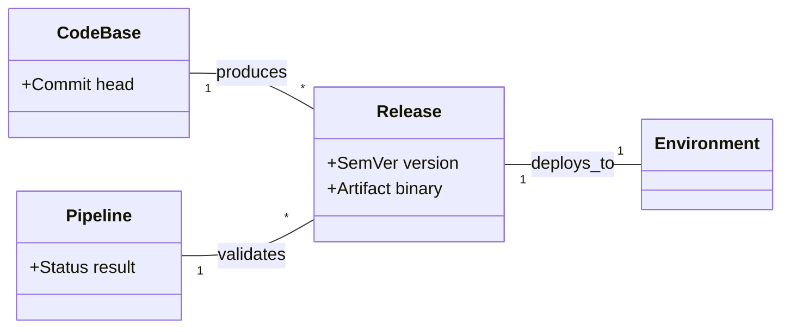
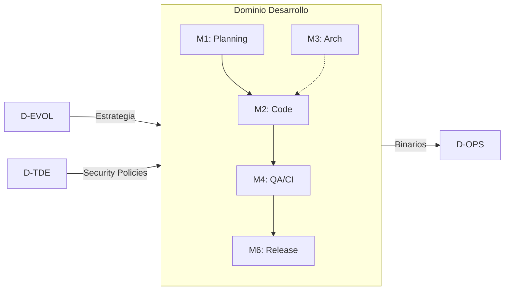
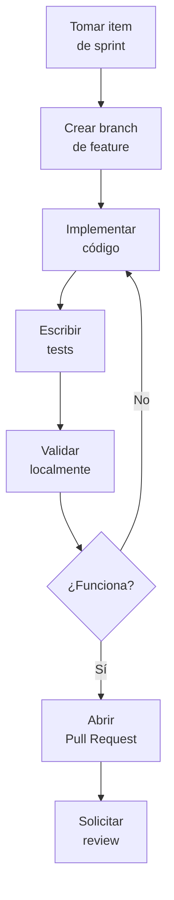
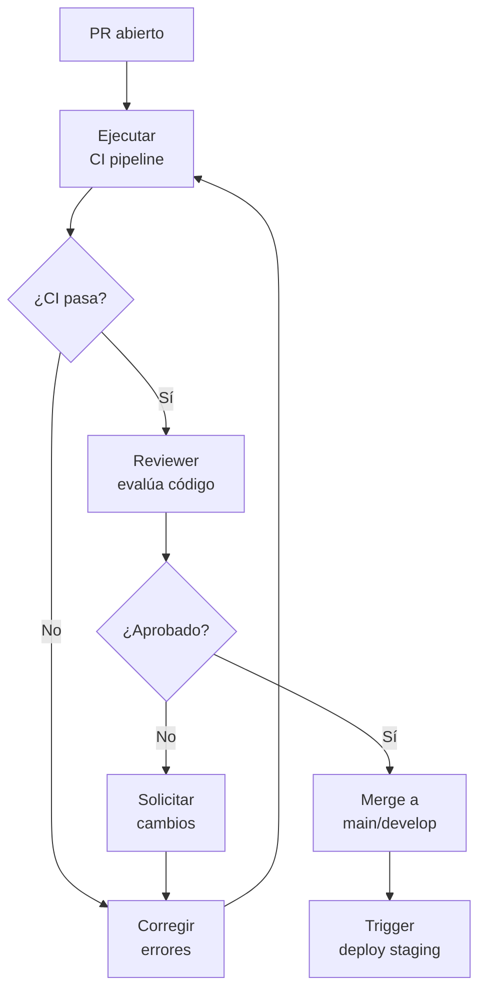
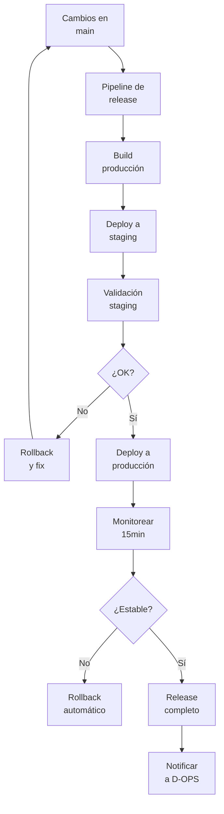

# D-DEV — Dominio de Desarrollo del Sistema

## 🧭 1. Resumen Ejecutivo
- **Propósito**: Orquestar el ciclo de vida completo de construcción de software, asegurando que el código sea un reflejo fiel del diseño y seguro para operar.
- **Resultado principal**: Releases confiables, iterativos y trazables (DORA metrics bajo control).
- **Usuarios/beneficiarios**: Equipo de Desarrollo, QA, Producto, Operaciones.
- **Interfaces críticas**:
  - `D-OPS` (Entrega artefactos desplegables).
  - `D-TDE` (Asegura que el código cumpla estándares de seguridad).

## 🎯 2. Alcance
### 2.1 Qué cubre
- **Incluye**: Gestión de Backlog, Arquitectura, Testing, CI/CD, Releases y Mantenimiento de Código (Refactor).
### 2.2 Qué NO cubre
- **Excluye**: Operación en ambiente productivo (→ `D-OPS`), Definición de estrategia organizacional (→ `D-EVOL`).

## 🧠 3. Modelo Conceptual (Ontología)
> Definición abstracta de los conceptos y relaciones (Genoma Humano).

### 3.1 Diccionario de Conceptos
- **Release**: Conjunto inmutable de artefactos de software versionados semánticamente y listos para despliegue.
- **Backlog Item**: Unidad de trabajo (Historia, Bug, Tarea) que aporta valor o resuelve deuda.
- **Pipeline**: Secuencia determinística de transformaciones (Build -> Test -> Deploy) aplicada al código.
- **Invariante de Calidad**: Regla que impide que código defectuoso avance en el pipeline (Gatekeeper).

### 3.2 Diagrama Conceptual

## 🧬 4. Genotipo Categorial (Modelo de Datos Formal)
> Especificación Matemática para el Desarrollo (Genoma Técnico). **Source of Truth**.

### 4.1 Objetos (Entidades) $A \in Ob(C_{dev})$

| Objeto (Entity) | Definición Formal (Tipo)                                     | Invariante (Regla)                            | Source |
| --------------- | ------------------------------------------------------------ | --------------------------------------------- | ------ |
| `BacklogItem`   | `struct { id: UUID, type: ItemType, state: ItemState }`      | `INV_01: priority must be set`                | D-DEV  |
| `PullRequest`   | `struct { id: UUID, branch: String, reviews: List[Review] }` | `INV_02: PR cannot merge to main w/o review`  | D-DEV  |
| `Release`       | `struct { id: UUID, version: SemVer, sha: CommitHash }`      | `INV_03: version must be strictly increasing` | D-DEV  |
| `ADR`           | `struct { id: UUID, decision: Status, context: Text }`       | `INV_04: immutable once approved`             | D-DEV  |
| `TestResult`    | `struct { id: UUID, coverage: Percentage, passed: Bool }`    | `INV_05: coverage >= 80%`                     | D-DEV  |

### 4.2 Morfismos (Relaciones/Procesos) $f: A \to B$

| Morfismo (Func)    | Dominio $\to$ Codominio                | Tipo           | Implementación             |
| ------------------ | -------------------------------------- | -------------- | -------------------------- |
| `merge_pr`         | `PullRequest` $\to$ `Commit`           | Transformation | `git merge` / `github.api` |
| `run_pipeline`     | `Commit` $\to$ `TestResult`            | Compute        | `github.actions`           |
| `promover_release` | `Release` $\times$ `EnvA` $\to$ `EnvB` | Effect         | `deploy.script`            |
| `priorizar_item`   | `BacklogItem` $\to$ `BacklogItem`      | Update         | `trpc.mutation`            |
| `check_coverage`   | `TestResult` $\to$ `Bool`              | Predicate      | `vitest.coverage`          |

### 4.3 Ecuaciones y Restricciones (Paths)
- **EQ1 (Safe Deploy):** `run_pipeline(commit) == passed => deploy_allowed(commit)`.
- **EQ2 (Traceability):** `release.features = map(pr => pr.linked_items, release.commits)`.
- **INV_MAIN:** La rama `main` siempre debe ser desplegable (Green Build).

## 🗺️ 5. Mapa del Dominio

## 🧩 6. Módulos / Capacidades

| Código | Módulo           | Objetivo                   | Entradas               | Salidas                 | Owner       |
| ------ | ---------------- | -------------------------- | ---------------------- | ----------------------- | ----------- |
| M1     | Gestión Producto | Definir roadmap y backlog  | Necesidades Negocio    | Backlog Priorizado      | PM          |
| M2     | Desarrollo       | Construcción de código     | Backlog Item           | Pull Request            | Lead Dev    |
| M3     | Arquitectura     | Diseño técnico y contratos | Requerimientos No-Func | ADRs / Schemas          | Arq         |
| M4     | CI/CD & QA       | Validación automática      | PR / Commit            | Build Artifact / Report | DevOps      |
| M5     | Releases         | Empaquetado y versión      | Build Validado         | Release Note / Tag      | Release Mgr |

## 🔄 7. Procesos (Índice BPMN)

| ID Proceso | Nombre           | Trigger       | Output          | BPMN/Link                                      |
| ---------- | ---------------- | ------------- | --------------- | ---------------------------------------------- |
| P1         | Ciclo de Feature | Item en ToDo  | Feature en Prod | [Ver Diagrama](#71-p1-desarrollo-de-feature)   |
| P2         | Code Review Gate | PR Abierto    | Merge o Rechazo | [Ver Diagrama](#72-p2-code-review-y-testing)   |
| P3         | Release Train    | Fin de Sprint | Versión Tagged  | [Ver Diagrama](#73-p3-despliegue-a-producción) |

### 7.1 P1: Desarrollo de Feature

### 7.2 P2: Code Review y Testing

### 7.3 P3: Despliegue a Producción

## 👥 8. Roles y Actores

| Rol            | Responsabilidad            | Decisiones                         | US relacionadas |
| -------------- | -------------------------- | ---------------------------------- | --------------- |
| `ProductOwner` | Priorizar backlog          | Qué se hace y qué no               | `US-DEV-PROD-*` |
| `Developer`    | Implementar código y tests | Cómo se implementa (dentro de arq) | `US-DEV-CODE-*` |
| `TechLead`     | Guardián de calidad y arq  | Aprobar PRs complejos, Definir ADR | `US-DEV-ARCH-*` |
| `DevOps`       | Mantener pipeline CI/CD    | Estrategia de branching y deploy   | `US-DEV-CICD-*` |

## 🔌 9. Sistemas e Integraciones

| Código   | Sistema      | Tipo (Interno/Externo) | Rol                      | Dominio |
| -------- | ------------ | ---------------------- | ------------------------ | ------- |
| `SYS-04` | GitHub       | Externo (SaaS)         | SCM, CI/CD, Project Mgmt | D-DEV   |
| `SYS-05` | Bun/Vitest   | Interno (Toolchain)    | Build & Test Runner      | D-DEV   |
| `SYS-06` | Sonar/ESLint | Interno (Toolchain)    | Calidad de Código        | D-DEV   |

## ⚖️ 10. Normativa Aplicable

| Norma      | Artículos | Obligación           | Impacto en el dominio                   |
| ---------- | --------- | -------------------- | --------------------------------------- |
| Ley 21.180 | Art 2     | Seguridad por Diseño | Testing de seguridad en pipeline (SAST) |
| ISO 25010  | Calidad   | Mantenibilidad       | Estándares de código y ADRs             |

## 🧪 11. Historias de Usuario (Resumen)

| ID               | Título               | Prioridad | Actor       |
| ---------------- | -------------------- | --------- | ----------- |
| `US-DEV-CODE-01` | Crear PR con Tests   | Crítica   | Developer   |
| `US-DEV-CICD-01` | Pipeline Automático  | Crítica   | DevOps      |
| `US-DEV-REL-01`  | Generar Release Note | Alta      | Release Mgr |

## 🔗 12. Matriz de Trazabilidad

| Proceso      | Fase   | US               | Entidades                    |
| ------------ | ------ | ---------------- | ---------------------------- |
| P1 (Feature) | Coding | `US-DEV-CODE-01` | `BacklogItem`, `PullRequest` |
| P3 (Release) | Deploy | `US-DEV-REL-01`  | `Release`, `Pipeline`        |

## 📈 13. Indicadores (KPIs - DORA)

| KPI              | Definición               | Fórmula                        | Meta    | Fuente |
| ---------------- | ------------------------ | ------------------------------ | ------- | ------ |
| Deploy Frequency | Frecuencia despliegues   | `Count(Deploys) / Week`        | > 1/sem | CI/CD  |
| Lead Time        | Tiempo commit $\to$ prod | `Avg(DeployTime - CommitTime)` | < 24h   | GitHub |
| CFR              | Change Failure Rate      | `FailedDeploys / TotalDeploys` | < 5%    | D-OPS  |

## 🤝 14. Referencias Cruzadas

| Dominio  | Relación                   | Entidades compartidas (canónicas) |
| -------- | -------------------------- | --------------------------------- |
| `D-OPS`  | Operación de lo construido | `Artifact` (Docker Image)         |
| `D-EVOL` | Alineación estratégica     | `Roadmap`                         |

## 📝 15. Changelog

- **2025-12-18**: Refactorización completa a v5.5 (Genotipo Categorial). Integración con modelo formal de desarrollo.

---
*Documento parte de GORE_OS Blueprint Release v5.5 (Categorical Genotype)*
*Última actualización: 2025-12-18*
