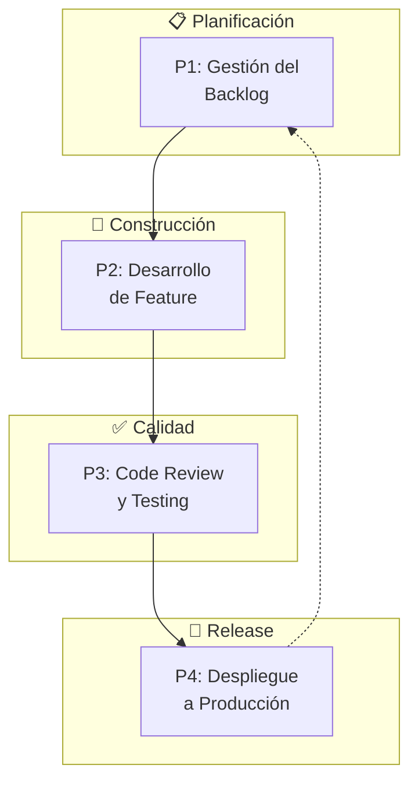
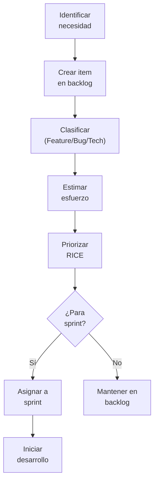
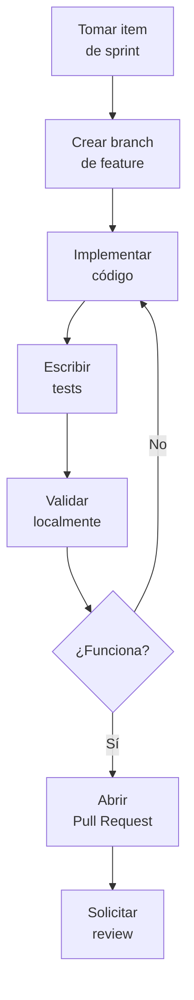
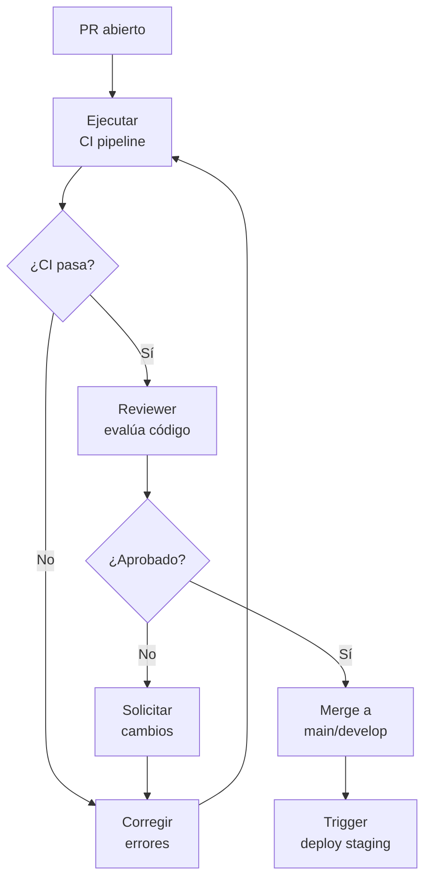
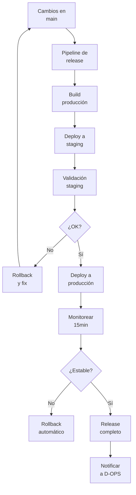
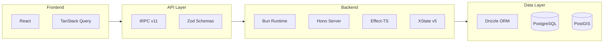

# D-DEV: Dominio de Desarrollo del Sistema

> Parte de: [GORE_OS Vision General](../vision_general.md)  
> Capa: Habilitante (Infraestructura Técnica)  
> Función GORE: CONSTRUIR  
> Responsable: Líder Técnico / DevOps Lead  
> Ciclo ORKO: W2-W3 (Development + Implementation)

---

## Glosario D-DEV

| Término          | Definición                                                                            |
| ---------------- | ------------------------------------------------------------------------------------- |
| CI/CD            | Continuous Integration / Continuous Deployment. Automatización de build y despliegue. |
| Sprint           | Iteración de desarrollo con duración fija (típicamente 2 semanas).                    |
| Release          | Versión del sistema desplegada en producción.                                         |
| Backlog          | Lista priorizada de trabajo pendiente (features, bugs, mejoras).                      |
| ADR              | Architecture Decision Record. Documento de decisión arquitectónica.                   |
| DORA             | DevOps Research and Assessment. Métricas de rendimiento DevOps.                       |
| Lead Time        | Tiempo desde commit hasta producción.                                                 |
| Deploy Frequency | Frecuencia de despliegues a producción.                                               |
| CFR              | Change Failure Rate. Tasa de cambios que causan fallos.                               |
| Pipeline         | Secuencia automatizada de pasos de CI/CD.                                             |
| Code Review      | Revisión de código por pares antes de merge.                                          |
| Feature Flag     | Toggle para activar/desactivar funcionalidades sin despliegue.                        |
| Rollback         | Reversión a versión anterior ante fallo de despliegue.                                |
| SemVer           | Semantic Versioning. Esquema de versionado (MAJOR.MINOR.PATCH).                       |

---

## Propósito

Gestionar el ciclo de vida de desarrollo del sistema GORE_OS: desde la planificación de features hasta el despliegue en producción, asegurando calidad, velocidad y trazabilidad.

> **D-DEV vs D-OPS**: D-DEV construye el sistema (W2-W3 ORKO). D-OPS opera el sistema en producción (W4 ORKO).

> **D-DEV vs D-EVOL**: D-DEV es desarrollo técnico del software. D-EVOL es evolución estratégica de la organización.

---

## Módulos

### M1: Gestión de Producto (Product Management)

| Atributo       | Descripción                                      |
| -------------- | ------------------------------------------------ |
| Propósito      | Planificar y priorizar el desarrollo del sistema |
| Primitivo ORKO | C5 (Propósito)                                   |

Funcionalidades:
- Gestión del backlog de producto
- Roadmap técnico por dominio
- Priorización con RICE (Reach, Impact, Confidence, Effort)
- Definición de épicas y features
- Gestión de releases y milestones
- Versionamiento semántico (SemVer)
- Changelogs automáticos

### M2: Desarrollo de Software

| Atributo       | Descripción                           |
| -------------- | ------------------------------------- |
| Propósito      | Escribir y mantener código de calidad |
| Primitivo ORKO | C2 (Flujo)                            |

Funcionalidades:
- Estándares de código (Effect-TS, Zod, tRPC)
- Branching strategy (GitFlow o Trunk-based)
- Code review y merge policies
- Pair programming y mob programming
- Refactoring y mejora continua
- Gestión de dependencias
- Documentación de código (TSDoc)

### M3: Arquitectura Técnica

| Atributo       | Descripción                                      |
| -------------- | ------------------------------------------------ |
| Propósito      | Diseñar y documentar la arquitectura del sistema |
| Primitivo ORKO | D1 (Arquitectura)                                |

Funcionalidades:
- Diagramas C4 (Context, Container, Component, Code)
- Architecture Decision Records (ADRs)
- Diseño de APIs (contratos tRPC, schemas Zod)
- Modelado de datos (Drizzle schemas)
- Diseño de FSM (XState)
- Patrones y anti-patrones
- Documentación técnica (Wiki)

### M4: Integración y Entrega Continua (CI/CD)

| Atributo       | Descripción                          |
| -------------- | ------------------------------------ |
| Propósito      | Automatizar build, test y despliegue |
| Primitivo ORKO | C2 (Flujo)                           |

Funcionalidades:
- Pipelines de integración continua
- Build automatizado (Bun)
- Análisis estático (ESLint, TypeScript strict)
- Despliegue automatizado a ambientes
- Gestión de ambientes (dev, staging, prod)
- Rollback automático ante fallos
- Feature flags para despliegue gradual
- Notificaciones de estado de pipeline

### M5: Testing y QA

| Atributo       | Descripción                   |
| -------------- | ----------------------------- |
| Propósito      | Asegurar calidad del software |
| Primitivo ORKO | C4 (Límite)                   |

Funcionalidades:
- Tests unitarios (Vitest)
- Tests de integración
- Tests end-to-end (Playwright)
- Property-based testing
- Cobertura de código
- Pruebas de regresión
- Pruebas de rendimiento
- Acceptance criteria validation

### M6: Gestión de Releases

| Atributo       | Descripción                        |
| -------------- | ---------------------------------- |
| Propósito      | Planificar y ejecutar lanzamientos |
| Primitivo ORKO | C2 (Flujo)                         |

Funcionalidades:
- Planificación de releases
- Versionado semántico
- Generación de changelogs
- Comunicación de releases
- Documentación de release notes
- Coordinación con D-OPS para despliegue
- Post-release monitoring

---

## Procesos BPMN

### Mapa General D-DEV

---

### P1: Gestión del Backlog

---

### P2: Desarrollo de Feature

---

### P3: Code Review y Testing

---

### P4: Despliegue a Producción

---

## Historias de Usuario

### M1: Gestión de Producto

| ID              | Título                         | Prioridad |
| --------------- | ------------------------------ | --------- |
| US-DEV-PROD-001 | Gestionar backlog de producto  | Crítica   |
| US-DEV-PROD-002 | Priorizar items con RICE       | Alta      |
| US-DEV-PROD-003 | Planificar sprint              | Crítica   |
| US-DEV-PROD-004 | Visualizar roadmap por dominio | Alta      |
| US-DEV-PROD-005 | Generar changelog automático   | Alta      |

### M2: Desarrollo

| ID              | Título                         | Prioridad |
| --------------- | ------------------------------ | --------- |
| US-DEV-CODE-001 | Aplicar estándares de código   | Crítica   |
| US-DEV-CODE-002 | Crear branch de feature        | Alta      |
| US-DEV-CODE-003 | Ejecutar code review           | Crítica   |
| US-DEV-CODE-004 | Merge con protección de branch | Alta      |

### M3: Arquitectura

| ID              | Título                     | Prioridad |
| --------------- | -------------------------- | --------- |
| US-DEV-ARCH-001 | Documentar decisión en ADR | Alta      |
| US-DEV-ARCH-002 | Generar diagrama C4        | Alta      |
| US-DEV-ARCH-003 | Definir contrato de API    | Crítica   |
| US-DEV-ARCH-004 | Diseñar schema de datos    | Crítica   |

### M4: CI/CD

| ID              | Título                       | Prioridad |
| --------------- | ---------------------------- | --------- |
| US-DEV-CICD-001 | Ejecutar pipeline automático | Crítica   |
| US-DEV-CICD-002 | Desplegar a staging          | Crítica   |
| US-DEV-CICD-003 | Desplegar a producción       | Crítica   |
| US-DEV-CICD-004 | Rollback automático          | Crítica   |
| US-DEV-CICD-005 | Configurar feature flag      | Alta      |

### M5: Testing

| ID              | Título                        | Prioridad |
| --------------- | ----------------------------- | --------- |
| US-DEV-TEST-001 | Ejecutar tests unitarios      | Crítica   |
| US-DEV-TEST-002 | Ejecutar tests de integración | Alta      |
| US-DEV-TEST-003 | Verificar cobertura mínima    | Alta      |
| US-DEV-TEST-004 | Ejecutar tests E2E            | Alta      |

### M6: Releases

| ID             | Título                           | Prioridad |
| -------------- | -------------------------------- | --------- |
| US-DEV-REL-001 | Crear release con SemVer         | Alta      |
| US-DEV-REL-002 | Publicar release notes           | Alta      |
| US-DEV-REL-003 | Notificar release a stakeholders | Alta      |

---

## Entidades de Datos

### Gestión de Producto

| Entidad       | Atributos Clave                                                                                 | Relaciones      |
| ------------- | ----------------------------------------------------------------------------------------------- | --------------- |
| `BacklogItem` | id, titulo, tipo (Feature/Bug/Tech), descripcion, estado, prioridad_rice, estimacion, sprint_id | → Sprint, Epic  |
| `Epic`        | id, titulo, descripcion, dominio, estado                                                        | → BacklogItem[] |
| `Sprint`      | id, nombre, fecha_inicio, fecha_fin, objetivo, estado                                           | → BacklogItem[] |
| `Roadmap`     | id, periodo, dominio, milestones[]                                                              | → Epic[]        |

### Desarrollo

| Entidad       | Atributos Clave                                           | Relaciones                  |
| ------------- | --------------------------------------------------------- | --------------------------- |
| `PullRequest` | id, titulo, branch, estado, autor, reviewers[], ci_status | → BacklogItem, CodeReview[] |
| `CodeReview`  | id, pr_id, reviewer, decision, comentarios[], timestamp   | → PullRequest               |
| `Branch`      | id, nombre, tipo, base, estado                            | → PullRequest               |

### Arquitectura

| Entidad       | Atributos Clave                                              | Relaciones |
| ------------- | ------------------------------------------------------------ | ---------- |
| `ADR`         | id, titulo, contexto, decision, consecuencias, estado, fecha | → Dominio  |
| `DiagramaC4`  | id, tipo, nombre, contenido_mermaid, version                 | → Dominio  |
| `ContratoAPI` | id, endpoint, metodo, input_schema, output_schema, version   | → Dominio  |

### CI/CD

| Entidad       | Atributos Clave                                     | Relaciones             |
| ------------- | --------------------------------------------------- | ---------------------- |
| `Pipeline`    | id, tipo, trigger, estado, duracion, logs           | → PullRequest, Release |
| `Ambiente`    | id, nombre, url, version_actual, estado             | → Release[]            |
| `FeatureFlag` | id, nombre, estado, porcentaje_rollout, condiciones |                        |

### Releases

| Entidad       | Atributos Clave                                         | Relaciones                |
| ------------- | ------------------------------------------------------- | ------------------------- |
| `Release`     | id, version, fecha, changelog, estado, ambiente_destino | → BacklogItem[], Pipeline |
| `ReleaseNote` | id, release_id, contenido_md, fecha_publicacion         | → Release                 |

---

## Indicadores D-DEV (DORA Metrics)

| KPI                   | Definición                              | Meta       |
| --------------------- | --------------------------------------- | ---------- |
| Deploy Frequency      | Frecuencia de despliegues a producción  | ≥ 1/semana |
| Lead Time for Changes | Tiempo desde commit hasta producción    | ≤ 1 día    |
| Change Failure Rate   | % de despliegues que causan fallos      | ≤ 5%       |
| MTTR                  | Tiempo medio de recuperación tras fallo | ≤ 1 hora   |
| Test Coverage         | Cobertura de código por tests           | ≥ 80%      |
| PR Review Time        | Tiempo promedio de review de PRs        | ≤ 4 horas  |
| Sprint Velocity       | Story points completados por sprint     | Tracking   |
| Backlog Groomed       | % de backlog priorizado y estimado      | ≥ 90%      |

---

## Sistemas Involucrados

| Sistema    | Función                           | Integración  |
| ---------- | --------------------------------- | ------------ |
| GitHub     | Repositorio de código, PRs, CI/CD | Git, Actions |
| Bun        | Runtime y build                   | CLI          |
| Vitest     | Testing                           | CLI          |
| PostgreSQL | Base de datos                     | Drizzle      |
| fxeon      | Infraestructura de despliegue     | SSH, Docker  |

---

## Referencias Cruzadas

| Dominio | Relación                                     | Entidades Compartidas   |
| ------- | -------------------------------------------- | ----------------------- |
| D-OPS   | Coordina despliegues, recibe tickets de bugs | Release, Ticket         |
| D-EVOL  | Deuda técnica estratégica, KB técnica        | DeudaTecnica, Artefacto |
| D-TDE   | Cumplimiento de seguridad en código          | Audit, FeatureFlag      |
| Todos   | Backlog incluye items de todos los dominios  | BacklogItem, Epic       |

---

## Stack Tecnológico

---

*Documento parte de GORE_OS Blueprint Integral v5.5*  
*Última actualización: 2025-12-18*
