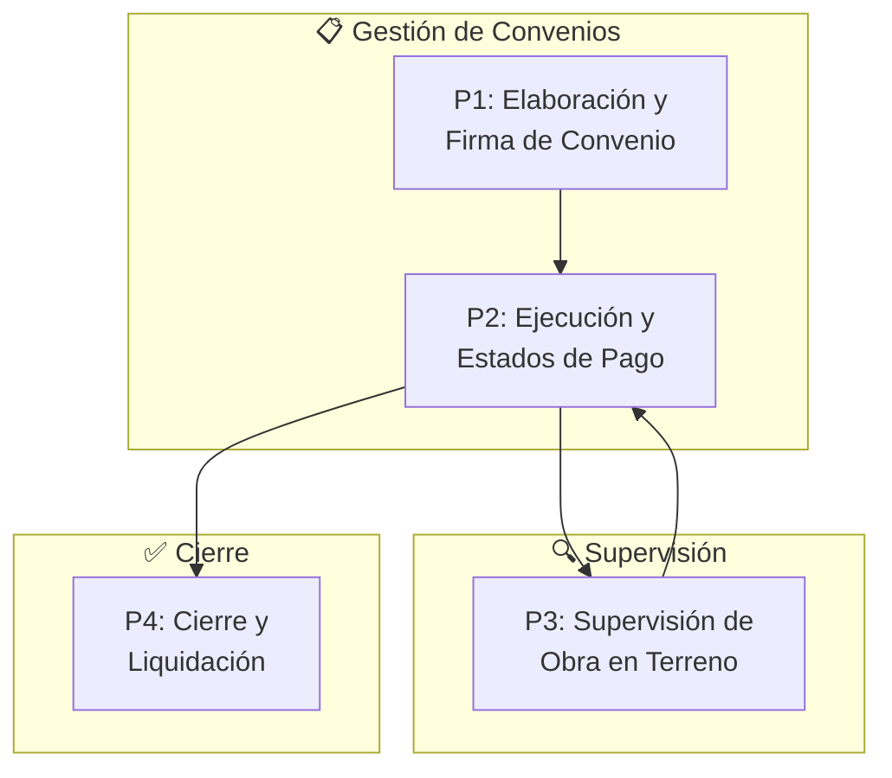
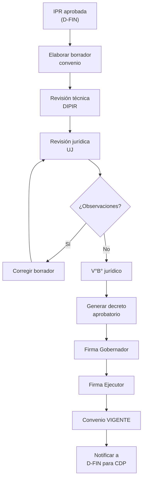
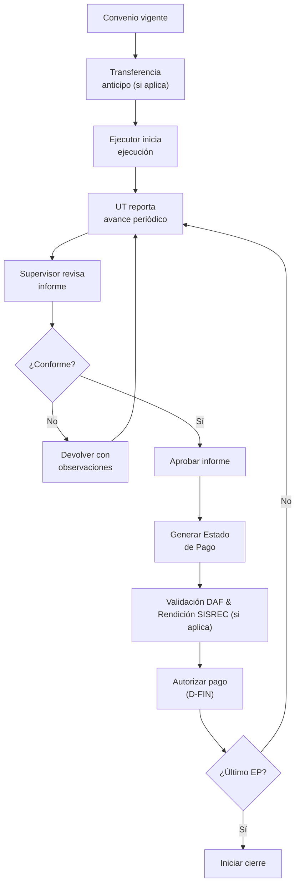
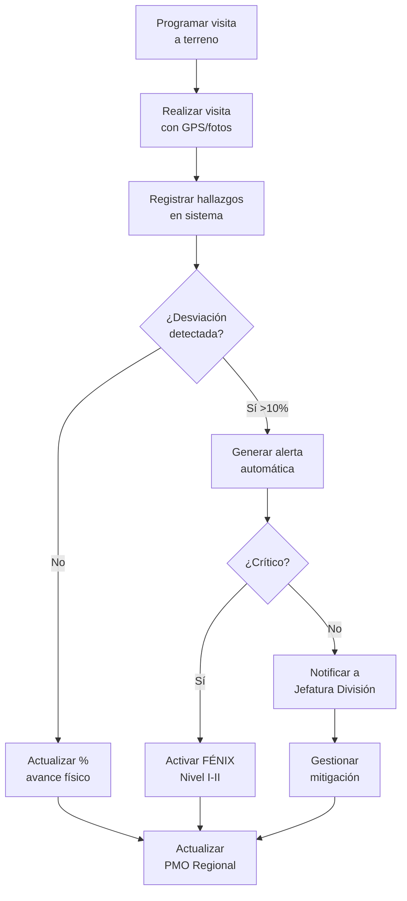
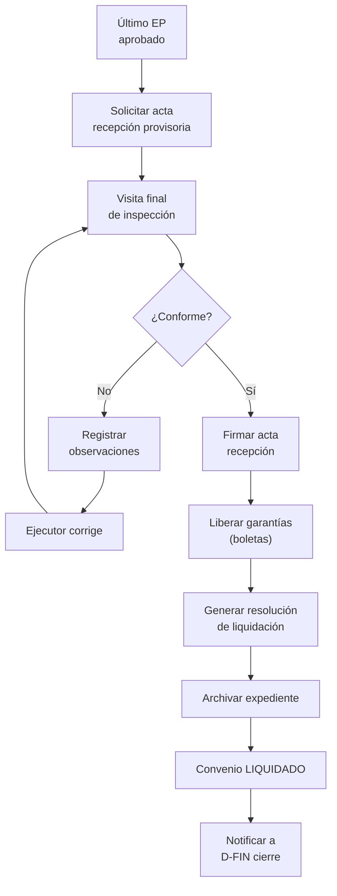

# D-EJEC: Dominio de Ejecución y Seguimiento

> Parte de: [GORE_OS Vision General](../vision_general.md)  
> Capa: Núcleo (Dimensión Táctica)  
> Función GORE: EJECUTAR  

---

## Glosario D-EJEC

| Término  | Definición                                                                                                              |
| -------- | ----------------------------------------------------------------------------------------------------------------------- |
| Convenio | Acto administrativo formal que establece obligaciones entre GORE y un ejecutor. SADV (Fuente Única de Verdad) en D-NORM |
| Ejecutor | Actor habilitado para materializar proyectos. Ver D-GOB.Actor                                                           |
| PMO      | Oficina de Gestión de Proyectos (Project Management Office). Torre de control de proyectos regional                     |
| EP       | Estado de Pago. Documento que autoriza transferencia parcial o final                                                    |
| UT       | Unidad Técnica. Equipo ejecutor responsable de la obra                                                                  |
| UJ       | Unidad Jurídica. Área encargada de visación de actos administrativos                                                    |
| DIPIR    | División de Presupuesto e Inversión Regional                                                                            |
| ARI      | Anteproyecto Regional de Inversión. Priorización anual de IPR                                                           |
| IPR      | Iniciativa/Proyecto Regional. Ver D-FIN                                                                                 |
| H_org    | Panel de Salud Organizacional. Ver D-EVOL                                                                               |
| FÉNIX    | Sistema de intervención para proyectos críticos. Ver fenix.md                                                           |
| SISREC   | Sistema de Rendición de Cuentas SUBDERE                                                                                 |
| FRIL     | Fondo Regional de Iniciativa Local                                                                                      |
| DAF      | División de Administración y Finanzas                                                                                   |

---

## Propósito

Gestionar la materialización de las iniciativas de inversión a través de convenios, supervisión de obras y seguimiento de compromisos, asegurando el cumplimiento de plazos, costos y alcance.

> Principio Núcleo: D-EJEC es el dominio de *ejecución operativa*. Consume definiciones formales de D-NORM (Convenio) y D-FIN (IPR), y produce información de avance para el Panel de Salud Organizacional (H_org) en D-EVOL.

---

## Módulos

### 1. Supervisión de Obras

Funcionalidades:

- Carpeta de seguimiento por IPR (visitas, informes)
- Registro de visitas a terreno con fotos geolocalizadas
- Revisión de informes de Unidad Técnica
- **Control Normativo Circular 33** (para adquisición de equipamiento y vehículos)
- Gestión de estados de pago
- Alertas de desviaciones >10%
- Validación de actas de recepción

> **⚠️ Triángulo de Integración Presupuestaria**:
> 1. D-EJEC **valida técnicamente** el Estado de Pago (EP) basado en avance físico
> 2. EP aprobado se envía a [D-BACK (Contabilidad)](domain_d-back.md#contabilidad-operativa) para Devengo → Pago
> 3. D-FIN **consume** el % de ejecución presupuestaria como indicador de SaludIPR

### 2. Gestión de Convenios

> Nota de Diseño: La entidad `Convenio` (SADV) se define en D-NORM. D-EJEC gestiona la *ejecución operativa* (hitos, pagos, riesgos).

Tipos de Convenio: (→ Ver D-NORM para definición formal)

| Tipo          | Descripción                                  | Ejemplo                       |
| ------------- | -------------------------------------------- | ----------------------------- |
| MANDATO       | GORE encarga ejecución a otro órgano         | MOP ejecuta obra vial         |
| TRANSFERENCIA | GORE transfiere recursos a ejecutor          | Municipio ejecuta multicancha |
| COLABORACIÓN  | Ejecución conjunta con aportes de ambos      | GORE+CORFO programa fomento   |
| MARCO         | Convenio paraguas para múltiples iniciativas | Marco con universidad         |
| PROGRAMACIÓN  | Convenio plurianual con Ministerio           | CP de infraestructura con MOP |

Ciclo de Vida:

```text
ELABORACIÓN → REVISIÓN JURÍDICA → FIRMA → EJECUCIÓN → LIQUIDACIÓN
```

Estados:

- BORRADOR → EN_REVISION_JURIDICA → PARA_FIRMA → VIGENTE
- PRORROGA_SOLICITADA, ADDENDUM_EN_PROCESO
- TERMINADO → LIQUIDADO
- CADUCADO

### 3. PMO Regional (Torre de Control)

Dimensiones de Monitoreo:

| Tiempo           | Costo                    | Alcance                   | Riesgo         |
| ---------------- | ------------------------ | ------------------------- | -------------- |
| % avance vs plan | Presupuesto vs ejecución | Cambios de especificación | Identificación |
| Hitos cumplidos  | Desvío %                 | EP estados                | Matriz riesgos |

Semáforo de Proyecto:

| Semáforo   | Condición                    | Acción                       |
| ---------- | ---------------------------- | ---------------------------- |
| 🟢 VERDE    | Conforme a plan (±5%)        | Monitoreo normal             |
| 🟡 AMARILLO | Desviación menor (5-15%)     | Seguimiento reforzado        |
| 🔴 ROJO     | Desviación crítica (>15%)    | Candidato FÉNIX Nivel II-III |
| ⚫ NEGRO    | Proyecto detenido/suspendido | Activación FÉNIX Nivel I-II  |

> Ver: [fenix.md](fenix.md) para detalle de niveles de intervención.

### 4. Gestión de Compromisos

Actores:

- Administrador Regional
- Jefaturas de División
- Encargados Operativos

Funcionalidades:

- Panel ejecutivo con alertas
- Creación y asignación de compromisos
- Seguimiento con semáforo de vencimiento
- **Validación de Percepción Ciudadana**: Registro de feedback social durante la obra.
- Reportes semanales automáticos

### 5. Coordinación Municipal

Funcionalidades:

- Guías por mecanismo de financiamiento
- Asistente (Wizard) de vía de financiamiento
- Verificación de elegibilidad FRIL
- Reuniones de inicio con supervisor
- Reportes de avance periódicos
- Rendición final SISREC

### 6. Relaciones Sectoriales

Funcionalidades:

- Gestión de convenios marco sectoriales
- Panel de relaciones sectoriales
- Coordinación con ministerios

---

## 📋 Procesos BPMN

### Mapa General D-EJEC


```mermaid
flowchart TB
    subgraph CONVENIOS["📋 Gestión de Convenios"]
        C1["P1: Elaboración y<br/>Firma de Convenio"]
        C2["P2: Ejecución y<br/>Estados de Pago"]
    end

    subgraph SUPERVISION["🔍 Supervisión"]
        S1["P3: Supervisión de<br/>Obra en Terreno"]
    end

    subgraph CIERRE["✅ Cierre"]
        X1["P4: Cierre y<br/>Liquidación"]
    end

    C1 --> C2
    C2 --> S1
    S1 --> C2
    C2 --> X1
```

---

### P1: Elaboración y Firma de Convenio


```mermaid
flowchart TD
    A["IPR aprobada<br/>(D-FIN)"] --> B["Elaborar borrador<br/>convenio"]
    B --> C["Revisión técnica<br/>DIPIR"]
    C --> D["Revisión jurídica<br/>UJ"]
    D --> E{"¿Observaciones?"}
    E -->|"Sí"| F["Corregir borrador"]
    F --> D
    E -->|"No"| G["V°B° jurídico"]
    G --> H["Generar decreto<br/>aprobatorio"]
    H --> I["Firma Gobernador"]
    I --> J["Firma Ejecutor"]
    J --> K["Convenio VIGENTE"]
    K --> L["Notificar a<br/>D-FIN para CDP"]
```

---

### P2: Ejecución y Estados de Pago


```mermaid
flowchart TD
    A["Convenio vigente"] --> B["Transferencia<br/>anticipo (si aplica)"]
    B --> C["Ejecutor inicia<br/>ejecución"]
    C --> D["UT reporta<br/>avance periódico"]
    D --> E["Supervisor revisa<br/>informe"]
    E --> F{"¿Conforme?"}
    F -->|"No"| G["Devolver con<br/>observaciones"]
    G --> D
    F -->|"Sí"| H["Aprobar informe"]
    H --> I["Generar Estado<br/>de Pago"]
    I --> J["Validación DAF & Rendición SISREC (si aplica)"]
    J --> K["Autorizar pago<br/>(D-FIN)"]
    K --> L{"¿Último EP?"}
    L -->|"No"| D
    L -->|"Sí"| M["Iniciar cierre"]
```

---

### P3: Supervisión de Obra en Terreno


```mermaid
flowchart TD
    A["Programar visita<br/>a terreno"] --> B["Realizar visita<br/>con GPS/fotos"]
    B --> C["Registrar hallazgos<br/>en sistema"]
    C --> D{"¿Desviación<br/>detectada?"}
    D -->|"No"| E["Actualizar %<br/>avance físico"]
    D -->|"Sí >10%"| F["Generar alerta<br/>automática"]
    F --> G{"¿Crítico?"}
    G -->|"Sí"| H["Activar FÉNIX<br/>Nivel I-II"]
    G -->|"No"| I["Notificar a<br/>Jefatura División"]
    I --> J["Gestionar<br/>mitigación"]
    E --> K["Actualizar<br/>PMO Regional"]
    H --> K
    J --> K
```

---

### P4: Cierre y Liquidación de Convenio


```mermaid
flowchart TD
    A["Último EP<br/>aprobado"] --> B["Solicitar acta<br/>recepción provisoria"]
    B --> C["Visita final<br/>de inspección"]
    C --> D{"¿Conforme?"}
    D -->|"No"| E["Registrar<br/>observaciones"]
    E --> F["Ejecutor corrige"]
    F --> C
    D -->|"Sí"| G["Firmar acta<br/>recepción"]
    G --> H["Liberar garantías<br/>(boletas)"]
    H --> I["Generar resolución<br/>de liquidación"]
    I --> J["Archivar expediente"]
    J --> K["Convenio LIQUIDADO"]
    K --> L["Notificar a<br/>D-FIN cierre"]
```

---

> **Umbrales sin Reevaluación MDSyF** (Glosa 01, Circular 11):
> - Incremento costo total proyecto: hasta 10%, tope 7.000 UTM
> - Adjudicación sobre monto recomendado: hasta 10%, tope 7.000 UTM
> - Si excede estos límites: requiere reevaluación MDSyF y nuevo acuerdo CORE obligatorio.

## 📝 Historias de Usuario por Módulo

### Catálogo por Módulo

#### Supervisión

| ID              | Título                    | Prioridad |
| --------------- | ------------------------- | --------- |
| US-EJEC-SUP-001 | Crear carpeta seguimiento | Crítica   |
| US-EJEC-SUP-002 | Registrar visitas terreno | Crítica   |
| US-EJEC-SUP-003 | Revisar informes UT       | Crítica   |
| US-EJEC-SUP-004 | Gestionar estados de pago | Crítica   |
| US-EJEC-SUP-005 | Alertar desviaciones      | Alta      |
| US-EJEC-SUP-006 | Validar actas recepción   | Alta      |

#### Administrador Regional

| ID             | Título                            | Prioridad |
| -------------- | --------------------------------- | --------- |
| US-EJEC-AR-001 | Panel ejecutivo AR                | Crítica   |
| US-EJEC-AR-002 | Monitor proyectos alerta crítica  | Crítica   |
| US-EJEC-AR-003 | Compromisos vencidos por división | Crítica   |
| US-EJEC-AR-004 | Crear compromiso en reunión       | Crítica   |
| US-EJEC-AR-005 | Verificar compromisos completados | Crítica   |
| US-EJEC-AR-006 | Resumen semanal Gobernador        | Crítica   |
| US-EJEC-AR-007 | Reasignar compromisos             | Alta      |
| US-EJEC-AR-008 | Reabrir compromiso devuelto       | Alta      |
| US-EJEC-AR-009 | Monitor problemas escalados       | Crítica   |

#### Jefatura División

| ID             | Título                           | Prioridad |
| -------------- | -------------------------------- | --------- |
| US-EJEC-JD-001 | Métricas división                | Crítica   |
| US-EJEC-JD-002 | Crear compromiso y asignar       | Crítica   |
| US-EJEC-JD-003 | Registrar problema IPR           | Crítica   |
| US-EJEC-JD-004 | Cerrar problema resuelto         | Alta      |
| US-EJEC-JD-005 | Filtrar compromisos por estado   | Alta      |
| US-EJEC-JD-006 | Validar compromisos completados  | Crítica   |
| US-EJEC-JD-007 | Reportes divisionales periódicos | Alta      |

#### Encargado Operativo

| ID             | Título                             | Prioridad |
| -------------- | ---------------------------------- | --------- |
| US-EJEC-EO-001 | Lista compromisos con semáforo     | Crítica   |
| US-EJEC-EO-002 | Marcar en progreso                 | Crítica   |
| US-EJEC-EO-003 | Marcar completado                  | Crítica   |
| US-EJEC-EO-004 | Registrar problema detectado       | Alta      |
| US-EJEC-EO-005 | Solicitar extensión plazo          | Alta      |
| US-EJEC-EO-006 | Ver historial del compromiso       | Media     |
| US-EJEC-EO-007 | Recibir notificaciones vencimiento | Alta      |

#### Municipal

| ID               | Título                        | Prioridad |
| ---------------- | ----------------------------- | --------- |
| US-EJEC-MUNI-001 | Consultar guías por mecanismo | Alta      |
| US-EJEC-MUNI-002 | Wizard vía financiamiento     | Crítica   |
| US-EJEC-MUNI-003 | Coordinar reunión inicio      | Alta      |
| US-EJEC-MUNI-004 | Reportar avance periódico     | Crítica   |
| US-EJEC-MUNI-005 | Verificar elegibilidad FRIL   | Alta      |
| US-EJEC-MUNI-006 | Rendición final SISREC        | Crítica   |

#### Sectorial y Comunicaciones

| ID              | Título                          | Prioridad |
| --------------- | ------------------------------- | --------- |
| US-EJEC-SEC-001 | Gestionar convenios sectoriales | Alta      |
| US-EJEC-SEC-002 | Panel de relaciones sectoriales | Alta      |
| US-EJEC-PER-001 | Cubrir hito comunicacional obra | Alta      |
| US-EJEC-PER-002 | Entrevistar beneficiarios       | Media     |

#### Ejecución (Ejecutor/Rendición)

| ID               | Título                       | Prioridad |
| ---------------- | ---------------------------- | --------- |
| US-EJEC-EJEC-001 | Ingresar transacciones       | Alta      |
| US-EJEC-EJEC-002 | Certificar autenticidad      | Crítica   |
| US-EJEC-EJEC-003 | Devolver a analista          | Alta      |
| US-EJEC-EJEC-004 | Crear informe regularización | Alta      |

---

## Entidades de Datos

### Ejecución de Convenios

| Entidad                | Atributos Clave                                                                            | Relaciones                                        |
| ---------------------- | ------------------------------------------------------------------------------------------ | ------------------------------------------------- |
| `HitoConvenio`         | id, convenio_id, descripcion, fecha_compromiso, fecha_real, estado                         | → Convenio (D-NORM)                               |
| `EstadoPago`           | id, convenio_id, numero, monto, fecha_solicitud, fecha_aprobacion, estado                  | → Convenio (D-NORM)                               |
| `Riesgo`               | id, convenio_id, descripcion, probabilidad, impacto, mitigacion, estado                    | → Convenio (D-NORM)                               |
| `VisitaTerreno`        | id, convenio_id, fecha, inspector_id, hallazgos, fotografias[], ubicacion_gps, estado      | → Convenio, Funcionario, CapaGeoespacial (D-TERR) |
| `BitacoraObra`         | id, convenio_id, fecha_hora, tipo_evento, descripcion, adjuntos[]                          | → Convenio                                        |
| `ActaRecepcion`        | id, convenio_id, tipo (PARCIAL/DEFINITIVA), fecha, observaciones, conformidad, firmantes[] | → Convenio, ActoAdministrativo (D-NORM)           |
| `ModificacionConvenio` | id, convenio_id, tipo (ADDENDUM/PRORROGA/CAMBIO_MONTO), justificacion, acto_id, fecha      | → Convenio (D-NORM)                               |
| `InformeAvance`        | id, convenio_id, periodo, avance_fisico_pct, avance_financiero_pct, observaciones          | → Convenio (D-NORM)                               |
| `GarantiaConvenio`     | id, convenio_id, tipo (BOLETA/POLIZA), numero, entidad_emisora, monto, fecha_vencimiento   | → Convenio (D-NORM)                               |

### Gestión de Compromisos

| Entidad       | Atributos Clave                                                                       | Relaciones                 |
| ------------- | ------------------------------------------------------------------------------------- | -------------------------- |
| `Compromiso`  | id, descripcion, ipr_id, responsable_id, fecha_creacion, fecha_limite, estado, origen | → IPR (D-FIN), Funcionario |
| `ProblemaIPR` | id, ipr_id, tipo, descripcion, solucion_propuesta, fecha_registro, estado             | → IPR (D-FIN), Funcionario |

---

## Sistemas Involucrados

| Sistema      | Función                      | Integración             |
| ------------ | ---------------------------- | ----------------------- |
| `SYS-SISREC` | Rendición de cuentas SUBDERE | Rendiciones municipales |
| `SYS-SIGFE`  | Contabilización pagos        | Estados de pago         |
| `INT-PMO`    | Torre de control             | Panel regional          |
| `SYS-GPS`    | Geolocalización visitas      | Fotos geolocalizadas    |

---

## Normativa Aplicable

| Norma            | Alcance                      |
| ---------------- | ---------------------------- |
| Ley 19.175       | Orgánica Regional, convenios |
| D.S. 148         | Reglamento convenios GORE    |
| Ley 19.886       | Contratos públicos           |
| Res. CGR 30/2015 | Rendición de cuentas         |

---

## Referencias Cruzadas

| Dominio | Relación                                         | Entidades Compartidas        |
| ------- | ------------------------------------------------ | ---------------------------- |
| D-PLAN  | IPR priorizadas en ARI se ejecutan vía convenios | IPR, ObjetivoERD             |
| D-NORM  | Convenio (SADV del acto administrativo)          | Convenio, ActoAdministrativo |
| D-FIN   | IPR, Transferencias, Calificación Ejecutores     | IPR, CDP, Transferencia      |
| D-BACK  | EP aprobado → Devengo → Pago (cadena contable)   | EstadoPago, Devengo, Pago    |
| D-GOB   | Actor (entidad base del ejecutor)                | Actor.tipo=EJECUTOR          |
| D-TERR  | Geolocalización de obras en ejecución            | CapaGeoespacial, Ubicacion   |
| D-EVOL  | Indicadores de ejecución para H_org              | Metrica, Alerta              |
| D-SEG   | PMO para proyectos de seguridad                  | Proyecto_Seguridad           |
| FÉNIX   | Convenios en riesgo activan intervención         | AlertaFenix, CasoFenix       |

---

*Documento parte de GORE_OS Blueprint Integral v5.3*  
*Última actualización: 2025-12-18*
