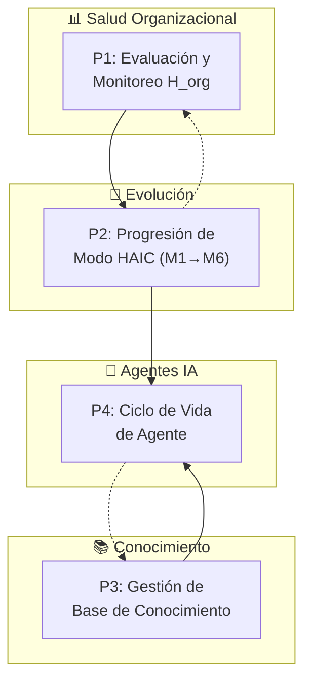
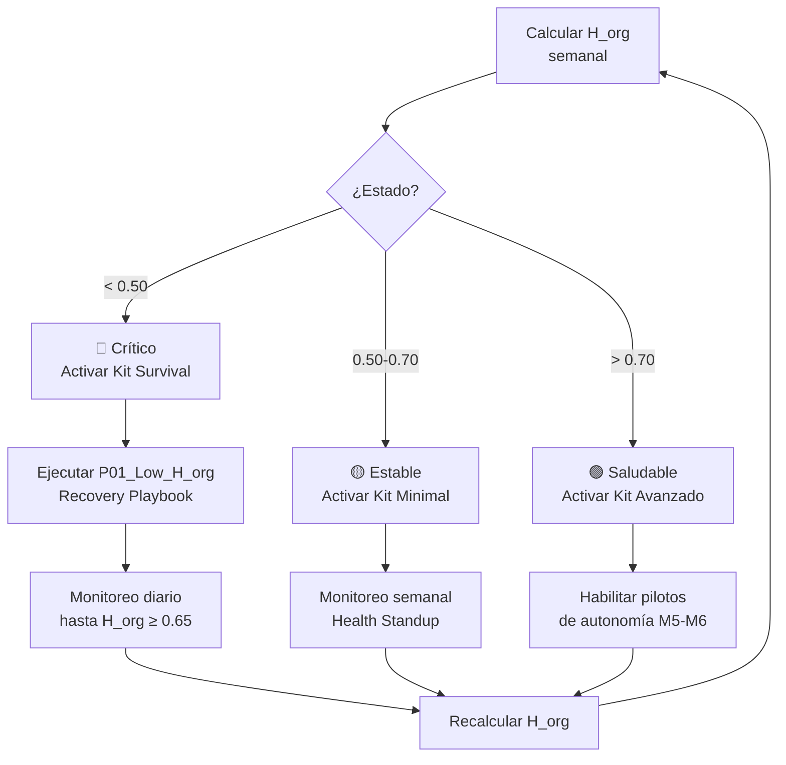
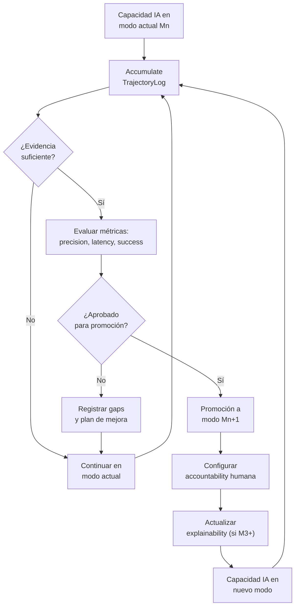
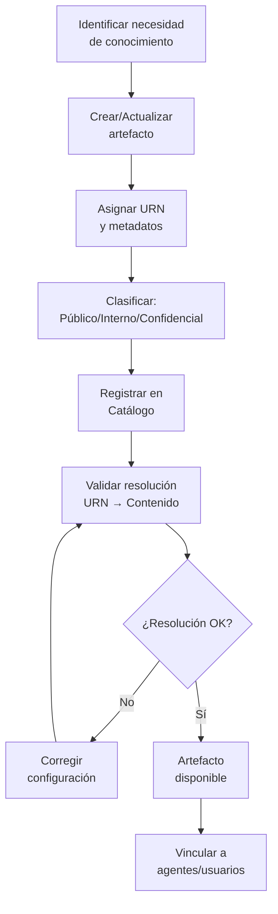

# D-EVOL: Dominio de Evolución e Inteligencia

> Parte de: [GORE_OS Vision General](../vision_general.md)  
> Capa: Estratégica  
> Función GORE: EVOLUCIONAR  

---

## Glosario D-EVOL

| Término        | Definición                                                                                                                          |
| -------------- | ----------------------------------------------------------------------------------------------------------------------------------- |
| H_org          | Health Score Organizacional. Strategic metric for systemic maturity and health. Formula: A×0.30 + F×0.30 + C×0.20 + I×0.10 + G×0.10 |
| H_gore         | Health Score Institucional GORE. Tactical metric for daily/weekly GORE operational performance (see D-GESTION).                     |
| HAIC           | Human-AI Collaboration. Framework for human-AI interaction (M1-M6). ORKO Invariant I5.                                              |
| SDA            | Sense-Decide-Act. Operational cycle of perception, analysis, and execution.                                                         |
| P1-P5          | Fundamental Primitives: Capacity, Flow, Information, Limit, Purpose.                                                                |
| M1-M6          | AI Delegation Modes: Monitor, Assist, Enable, Control, Supervise, Execute.                                                          |
| L0-L5          | Maturity Levels: Initial, Digitalized, Integrated, Automated, Intelligent, Autonomous.                                              |
| TrajectoryLog  | Historical performance log of AI capabilities for autonomy progression.                                                             |
| DriftDetection | Detection of ML model degradation against a baseline.                                                                               |
| FeatureFlag    | Mechanism for gradual feature enablement.                                                                                           |
| RICE           | Reach, Impact, Confidence, Effort. Prioritization framework.                                                                        |
| DataSteward    | Role responsible for the quality and governance of a dataset.                                                                       |
| Playbook       | Structured procedure for responding to known situations.                                                                            |
| URN            | Uniform Resource Name. Unique identifier for knowledge artifacts.                                                                   |
| Catalog        | Master inventory of knowledge artifacts with metadata.                                                                              |
| Lineage        | Traceability of origin and transformations of an artifact.                                                                          |
| AI Agent       | Declarative capability with deterministic behavior governed by HAIC.                                                                |
| Orchestrator   | Agent that coordinates a fleet of sub-agents for complex tasks.                                                                     |
| ANCI           | Agencia Nacional de Ciberseguridad. Security regulator for critical AI systems (Law 21.663).                                        |
| Bias           | Unfair distortion in AI results favoring or disadvantaging specific groups/territories.                                             |

> Fuente canónica: [orko/knowledge/core](file:///Users/felixsanhueza/Developer/orko/knowledge/core) para HAIC, H_org, P1-P5

---

## Propósito

Gestionar la evolución nativa del sistema operativo regional hacia niveles superiores de madurez organizacional, basándose en un framework formal de transformación que va más allá del cumplimiento normativo.

> Evolución Nativa vs. Cumplimiento: Mientras D-TDE asegura el piso normativo (Ley 21.180), D-EVOL representa el techo de capacidades. La TDE es obligatoria; la evolución nativa es estratégica.

---

## Módulos

### 1. Salud Organizacional (H_org)

> Fuente: orko/knowledge/core/guide_core_004_toolkit_orko.yml

Fórmula H_org (Celeridad y Madurez):

```javascript
H_org = Purpose(P5)×0.30 + Flow(P2)×0.30 + Capacity(P1)×0.20 + Information(P3)×0.10 + Governance(P4)×0.10
// Governance(P4) explicitly includes TDEScore (Compliance Floor)
```

Umbrales de Estado:

| Estado      | Rango H_org | Kit Aplicable | Acción                     |
| ----------- | ----------- | ------------- | -------------------------- |
| 🔴 Crítico   | < 0.50      | Kit Survival  | Estabilización 3-6 semanas |
| 🟡 Estable   | 0.50-0.70   | Kit Minimal   | Cimientos 6-12 semanas     |
| 🟢 Saludable | > 0.70      | Kit Avanzado  | Transformación 3-6 meses   |

Gates de Transición:

- G1: H_org < 70 → Activar P01_Low_H_org_Recovery
- GATE transformación estructural: H_org ≥ 70

### 2. Trayectoria del Sistema

Funcionalidades:

- Configuración de Banderas de Función (despliegue gradual)
- Ajuste de umbrales de riesgo
- Reporte de brechas de capacidad
- Trayectoria de evolución L0→L5

### 3. Pilotos de Autonomía

Funcionalidades:

- Activación de pilotos M6 (autonomía máxima)
- Escalamiento de configuración a nuevas divisiones
- Retrospectivas de sistema
- Métricas de seguimiento de pilotos

### 4. Playbooks de Remediación

Catálogo:

| Playbook          | Trigger                 | Objetivo                          |
| ----------------- | ----------------------- | --------------------------------- |
| P01_Low_H_org     | H_org < 60              | Recuperar H_org > 65 en 7-14 días |
| P02_High_Handoffs | Handoffs > umbral       | Reducir fricciones operativas     |
| P03_Alerta_Deriva | Puntaje Deriva > umbral | Recalibrar modelo ML              |

Funcionalidades:

- Ejecución guiada de playbooks
- Monitor de progreso por paso
- Registro de resultados

### 5. Gobierno de Evolución

Funcionalidades:

- Aprobación de cambios críticos
- Auditoría de Sesgo y Ética Algorítmica: Revisión de justicia territorial y social.
- Arbitraje de prioridades (RICE)
- Comité de Gobierno para decisiones mayores

### 6. Deuda Técnica

Funcionalidades:

- Inventario de deuda técnica
- Plan de pago de deuda
- Planificación de evolución de schema (migraciones)
- Monitoreo de KPIs técnicos

### 7. Base de Conocimiento Institucional

> Principio: El conocimiento institucional es un activo estratégico que requiere gobernanza, curación y acceso estructurado.

Componentes:

| Componente | Descripción                                      | Función                          |
| ---------- | ------------------------------------------------ | -------------------------------- |
| Catálogo   | Inventario maestro de artefactos de conocimiento | Fuente de verdad para resolución |
| Artefactos | Documentos estructurados con semántica explícita | Conocimiento formalizado         |
| URN        | Identificador único de artefacto                 | Resolución determinística        |
| Linaje     | Trazabilidad de origen y transformaciones        | Auditoría y confianza            |

Tipos de Artefacto:

| Tipo      | Descripción                   | Ejemplo            |
| --------- | ----------------------------- | ------------------ |
| Guía      | Conocimiento procedimental    | Manual de procesos |
| Normativa | Regulación y leyes aplicables | Ley 19.175         |
| Técnico   | Especificaciones sistema      | ERD, API specs     |
| Operativo | Procedimientos internos       | Protocolos GORE    |

Políticas de Uso:

| Política      | Descripción                        | Caso de Uso           |
| ------------- | ---------------------------------- | --------------------- |
| USO_EXCLUSIVO | Solo usar artefactos especificados | Respuestas normativas |
| HÍBRIDO       | KB + conocimiento general LLM      | Consultas abiertas    |
| TIEMPO_REAL   | KB + búsqueda web                  | Datos actuales        |

Funcionalidades:

- Catálogo de artefactos con metadatos
- Resolución de URN a contenido
- Versionamiento semántico
- Trazabilidad de linaje
- Clasificación (Público/Interno/Confidencial)

### 8. Agentes IA Especializados

> Principio: Los agentes IA son capacidades declarativas con comportamiento determinístico, gobernados por HAIC.

Arquitectura de Agente:

```mermaid
IDENTIDAD → CONOCIMIENTO → COMPORTAMIENTO → SEGURIDAD → EVALUACIÓN
    │            │              │              │            │
    ▼            ▼              ▼              ▼            ▼
  Rol+Obj    KB Sources     States+WF      Guardrails   Checklist
```

Tipos de Agente:

| Tipo        | Descripción                 | Modo HAIC | Ejemplo                |
| ----------- | --------------------------- | --------- | ---------------------- |
| Asesor      | Consultas y recomendaciones | M2-M3     | Asesor IPR             |
| Operativo   | Tareas rutinarias           | M4-M5     | Procesador rendiciones |
| Orquestador | Coordina otros agentes      | M4        | Gestor de casos        |
| Monitor     | Observa y alerta            | M1-M2     | Vigilante de mora      |

Ciclo de Vida del Agente:

```mermaid
DISEÑO → VALIDACIÓN → DESPLIEGUE → MONITOREO → PROMOCIÓN/DEGRADACIÓN
```

Funcionalidades:

- Definición declarativa de agentes
- Gobernanza HAIC por agente
- Trajectory log de desempeño
- Detección de deriva automático
- Promoción/degradación de modo

### 9. Orquestación de Agentes

> Principio: Agentes complejos coordinan flotas de sub-agentes para tareas multi-paso.

Patrones de Orquestación:

| Patrón      | Descripción                       | Caso de Uso                  |
| ----------- | --------------------------------- | ---------------------------- |
| SECUENCIAL  | Ejecutar agentes en cadena        | Pipeline de procesamiento    |
| PARALELO    | Ejecutar agentes simultáneamente  | Recopilación de perspectivas |
| CONDICIONAL | Seleccionar agente según contexto | Routing especializado        |
| ITERATIVO   | Repetir hasta condición           | Ciclos de refinamiento       |

Funcionalidades:

- Definición de flotas de agentes
- Contexto compartido entre agentes
- Síntesis de resultados
- Log de evidencia de delegación

### 10. Arquitectura Organizacional (AO)

> Principio: ORKO es la base para la transformación/evolución del GORE más allá del cumplimiento de la TDE. D-TDE = Piso; D-EVOL M10 = Techo.

| Atributo           | Descripción                                                                    |
| :----------------- | :----------------------------------------------------------------------------- |
| **Propósito**      | Gestionar el inventario completo de activos tecnológicos y organizacionales.   |
| **Base ORKO**      | Contratos C1-C5, Inventario Maestro (Toolkit 1.1), E6_Estado_Arquitectónico.   |
| **Diferencia TDE** | D-TDE es el piso normativo; D-EVOL M10 es capacidad estratégica **ilimitada**. |

#### Portafolio de Recursos (Inventario Maestro ORKO)

| Categoría                     | Contrato ORKO  | Activos Típicos del GORE                          |
| :---------------------------- | :------------- | :------------------------------------------------ |
| **Aplicaciones/Sistemas**     | C1_Capacidad   | GORE OS, SITIA, SIGFE, DocDigital, SISREC         |
| **Bases de Datos**            | C3_Información | PostgreSQL Institucional, BDs legacy, OLTP        |
| **Data Lakes**                | C3_Información | DataLake Regional (zonas raw/curated/trusted)     |
| **Data Warehouses**           | C3_Información | DataWarehouse para BI, cubos dimensionales        |
| **Base de Conocimiento (KB)** | C3_Información | Artefactos KODA, manuales, normativa digitalizada |
| **APIs y Servicios**          | C2_Flujo       | Integraciones PISEE, APIs internas, webhooks      |
| **Infraestructura**           | C1_Capacidad   | Servidores, redes, cloud, equipamiento TI         |
| **Procesos/Flujos**           | C2_Flujo       | Ciclo de IPR, Rendición de Cuentas, RRHH, Compras |
| **Restricciones**             | C4_Límite      | Normativa CGR, TDE, Ciberseguridad ANCI           |
| **Propósitos/OKRs**           | C5_Propósito   | Ejes ERD, OKRs Divisionales, Indicadores H_gore   |
| **Agentes IA**                | AgentSpec      | Digitrans (TDE), Asesor IPR, Mora Watcher         |

#### Funcionalidades del Repositorio Arquitectónico

**Gestión de Catálogos:**

1. Catálogo de Sistemas: Inventario maestro de aplicaciones con Ciclo de Vida (L0→L5).
2. Catálogo de Datos: BDs, DataLakes, DataWarehouses con esquemas y métricas de calidad.
3. Catálogo de Conocimiento: Artefactos KB, URNs, linaje, políticas de uso.
4. Catálogo de Integración: APIs, servicios PISEE, puntos de interoperabilidad.
5. Catálogo de Agentes IA: Especificaciones, modos HAIC, logs de trayectoria. Incluye a `Digitrans` (Asesor TDE).

**Visualizaciones del Portafolio:**

| Vista                      | Descripción                                           | Uso Principal            |
| :------------------------- | :---------------------------------------------------- | :----------------------- |
| **Mapa de Recursos**       | Vista consolidada de todos los activos por categoría. | Inventario ejecutivo.    |
| **Grafo de Dependencias**  | Vista interconectada de Sistema-Proceso-Datos.        | Análisis de impacto.     |
| **Radar de Madurez**       | Niveles L0-L5 por dominio/sistema.                    | Prioridad de inversión.  |
| **Heatmap de Integración** | Densidad de conexión entre sistemas.                  | Identificación de silos. |
| **Timeline de Evolución**  | Hoja de ruta con hitos y fechas.                      | Planificación TI.        |
| **Dashboard de Salud TI**  | KPIs técnicos consolidados.                           | Monitoreo operativo.     |

**Análisis y Gobernanza:**

1. Mapeo Capacidad-Proceso: Soporte de sistemas para flujos (matriz de dependencia).
2. Linaje de Datos: Trazabilidad de punta a punta desde el origen hasta el consumo.
3. Análisis de Impacto: Simulación de cambios antes de la implementación.
4. Identificación de Redundancias: Sistemas duplicados, datos inconsistentes.
5. Hoja de Ruta Tecnológica: Planificación de la evolución de sistemas L0→L5.
6. Deuda Técnica Priorizada: Backlog de modernización con scoring RICE.
7. Gobernanza de Datos: Custodios, calidad, políticas de acceso.

### 11. Puente TDE-ORKO (Estrategia Regional)

> **Principio:** Usar el cumplimiento de la TDE como un vehículo ("Caballo de Troya") para ejecutar la evolución estratégica regional de ORKO.
> **Piso vs. Techo:** D-TDE satisface el piso legal; D-EVOL construye el techo estratégico.

| Dimensión      | D-TDE (El Piso)                | D-EVOL (El Techo)              |
| :------------- | :----------------------------- | :----------------------------- |
| **Rol**        | Cumplimiento Normativo         | Capacidad Estratégica          |
| **Impulsores** | Ley 21.180, L21.463 (ANCI)     | WSLC F1-F18, Teoremas ORKO     |
| **Métricas**   | Score de Cumplimiento (0-100%) | H_org (Salud Organizacional)   |
| **Horizonte**  | Anual (Reportes MINSEGPRES)    | Multianual (Trayectoria L0→L5) |

#### Mapeo de Primitivos (El "Acoplamiento Fuerte")
Las actividades de cumplimiento en D-TDE habilitan automáticamente primitivos ORKO específicos en D-EVOL:

**Funcionalidades del Puente (Mapeo Profundo):**

1. Mapeo TDE→ORKO (Ingesta de Primitivos):
   - **TDE M2 (Servicios)** → Alimenta **ORKO P1 (Capacidad)**: La identidad y firma digital son capacidades fundacionales.
   - **TDE M3 (Interop)** → Alimenta **ORKO P2 (Flujo)**: PISEE asegura el flujo sistémico de información.
   - **TDE M7 (Expediente Electrónico)** → Alimenta **ORKO P3 (Información)**: Validación estructural de la verdad administrativa.
   - **TDE M1/M4 (Cumplimiento)** → Alimenta **ORKO P4 (Límite)**: La seguridad y regulación como restricciones habilitantes.

2. Cumplimiento como Componente de H_org: Integrar el `TDEScore` explícitamente en la variable de cálculo de Gobernanza (P4).
3. Liderazgo TDE Regional: Coordinar el cumplimiento de los servicios dependientes.
4. Propagación Metodológica: Extender las prácticas de ORKO al ecosistema regional.

| Módulo TDE                    | Habilita Primitivo ORKO | Lógica                                                                          |
| :---------------------------- | :---------------------- | :------------------------------------------------------------------------------ |
| **M2 Servicio Digital**       | **P1: Capacidad**       | Un servicio digitalizado aumenta la capacidad del GORE para entregar valor.     |
| **M3 Interoperabilidad**      | **P2: Flujo**           | La integración PISEE reduce la fricción y acelera el flujo de datos.            |
| **M7 Expediente Electrónico** | **P3: Información**     | Los archivos digitales estructurados crean activos de información consultables. |
| **M1/M4 Gob y Seguridad**     | **P4: Límite**          | La seguridad y gobernanza definen fronteras operativas válidas.                 |

#### Integración de H_org
El `TDEScore` es consumido explícitamente por el componente de Gobernanza/Límite del Health Score:


#### Autonomía de Evolución Nativa (Desarrollo Sin Límites)

> **Principio de Supremacía Nativa:** La evolución nativa (ORKO) **NO ESPERA** al cumplimiento burocrático (TDE). El desarrollo de capacidades estratégicas es **ilimitado** y debe avanzar a la máxima velocidad posible.

**Reglas de Coexistencia:**
1. **Desarrollo Desenfrenado:** La innovación (Agentes, IA, Optimización) avanza sin restricciones de velocidad (Fast Track). No se requiere "permiso TDE" para innovar.
2. **Límite de No-Conflicto:** La única restricción es no entrar en *conflicto franco* con la ley (ej: no violar privacidad de datos). Si no es ilegal, se hace.
3. **Validación Ex-Post:** La burocracia TDE valida y documenta *después* de que la capacidad ya ha generado valor, no antes.
4. **Gobernanza Híbrida:** La métrica `H_org` valora la utilidad nativa tanto o más que el timbre burocrático.


#### Funcionalidades del Puente
1. Ingesta Automatizada (`US-EVOL-BRIDGE-001`): Sincronización diaria de métricas TDE hacia D-EVOL.
2. **Certificación de Base:** Alcanzar el 100% TDE *oficializa* el estado L2 (Integrado), aunque el dominio puede operar en niveles superiores (L3-L5) por vía nativa (Fast Track).
3. Integración de Agentes: El `Agente: Digitrans` actúa como el puente operativo, monitoreando el cumplimiento de la TDE y reportando a D-EVOL.

---

## Framework de Evolución Organizacional

### Primitivos Fundamentales (P1-P5)

| Primitivo       | Pregunta             | Descripción              |
| --------------- | -------------------- | ------------------------ |
| P1: CAPACIDAD   | ¿Quién ejecuta?      | Humano/IA/Mixto          |
| P2: FLUJO       | ¿Cómo se transforma? | Procesos y pasos         |
| P3: INFORMACIÓN | ¿Qué se transforma?  | Entrada/salida           |
| P4: LÍMITE      | ¿Qué restringe?      | Normas, recursos, plazos |
| P5: PROPÓSITO   | ¿Para qué?           | OKRs, outcomes           |

### Ciclo Operacional: SDA

```mermaid
SENSE → DECIDE → ACT → (feedback loop)
Percibir   Analizar   Ejecutar
datos      priorizar  transformación
```

---

## Modelo HAIC: Colaboración Humano-IA

> Fuente: orko/knowledge/core/guide_core_000_fundamentos_orko.yml → I5_HAIC

### Niveles de Delegación (M1-M6)

| Nivel | Nombre     | Descripción                             |
| ----- | ---------- | --------------------------------------- |
| M1    | MONITOREAR | Humano ejecuta, IA observa y aprende    |
| M2    | ASISTIR    | Humano ejecuta, IA sugiere opciones     |
| M3    | HABILITAR  | IA prepara, humano decide y ejecuta     |
| M4    | CONTROLAR  | IA ejecuta, humano aprueba cada acción  |
| M5    | SUPERVISAR | IA ejecuta, humano audita por excepción |
| M6    | EJECUTAR   | IA autónoma, humano override disponible |

### Invariantes HAIC

- ∀ Capacidad IA (nivel ≥ M2): ∃ Humano accountable
- Progresión M1→M6 solo con trajectory log y evidencia de desempeño
- Explainability y Evaluación de Sesgo requerida para niveles M3+

---

## Niveles de Madurez

| Nivel | Nombre       | Características                                      |
| ----- | ------------ | ---------------------------------------------------- |
| L0    | INICIAL      | Procesos ad-hoc, sin estandarización                 |
| L1    | DIGITALIZADO | Captura digital, repositorio único, trazabilidad     |
| L2    | INTEGRADO    | Datos unificados, dashboards tiempo real             |
| L3    | AUTOMATIZADO | Alertas, validaciones, flujos automáticos            |
| L4    | INTELIGENTE  | Decisiones asistidas por IA (M2-M4)                  |
| L5    | AUTÓNOMO     | Agentes IA operativos (M5-M6), optimización continua |

---

## 📋 Procesos BPMN

### Mapa General D-EVOL



---

### P1: Evaluación y Monitoreo H_org



---

### P2: Progresión de Modo HAIC (M1→M6)



---

### P3: Gestión de Base de Conocimiento



---

### P4: Ciclo de Vida de Agente IA


---

## 📝 User Stories por Módulo

> Fuente: [kb_goreos_us_d-evol.yml](../user-stories/kb_goreos_us_d-evol.yml)

### Catálogo por Módulo

#### Salud Organizacional (HealthOrg)

| ID            | Título                                  | Prioridad |
| ------------- | --------------------------------------- | --------- |
| US-EVOL-H-001 | Tablero salud del sistema (H_org)       | Crítica   |
| US-EVOL-H-002 | Declarar cambio Estado de Salud (Gate)  | Crítica   |
| US-EVOL-H-003 | Simular impacto configuración (What-if) | Alta      |

#### Trayectoria

| ID               | Título                                       | Prioridad |
| ---------------- | -------------------------------------------- | --------- |
| US-EVOL-TRAY-001 | Configurar trayectoria (Banderas de Función) | Alta      |
| US-EVOL-TRAY-002 | Ajustar umbrales de riesgo                   | Alta      |
| US-EVOL-TRAY-003 | Revisar brechas de capacidad                 | Alta      |

#### Pilotos

| ID                | Título                                 | Prioridad |
| ----------------- | -------------------------------------- | --------- |
| US-EVOL-PILOT-001 | Activar pilotos de autonomía (M6)      | Alta      |
| US-EVOL-PILOT-002 | Escalar configuración a nueva división | Alta      |
| US-EVOL-PILOT-003 | Crear retrospectiva de sistema         | Alta      |

#### Playbooks

| ID               | Título                           | Prioridad |
| ---------------- | -------------------------------- | --------- |
| US-EVOL-PLAY-001 | Ejecutar playbook de remediación | Alta      |
| US-EVOL-PLAY-002 | Monitor progreso playbooks       | Alta      |

#### Gobierno

| ID              | Título                          | Prioridad |
| --------------- | ------------------------------- | --------- |
| US-EVOL-GOV-001 | Aprobar cambios críticos        | Crítica   |
| US-EVOL-GOV-002 | Arbitraje de prioridades (RICE) | Alta      |

#### Deuda Técnica

| ID             | Título                      | Prioridad |
| -------------- | --------------------------- | --------- |
| US-EVOL-DT-001 | Gestionar deuda técnica     | Alta      |
| US-EVOL-DT-002 | Planificar evolución schema | Alta      |
| US-EVOL-DT-003 | Monitorear KPIs sistema     | Crítica   |

#### Base de Conocimiento

| ID             | Título                                              | Prioridad |
| -------------- | --------------------------------------------------- | --------- |
| US-EVOL-KB-001 | Crear/actualizar artefacto de conocimiento          | Crítica   |
| US-EVOL-KB-002 | Registrar artefacto en catálogo                     | Crítica   |
| US-EVOL-KB-003 | Validar resolución URN                              | Alta      |
| US-EVOL-KB-004 | Clasificar artefacto (Público/Interno/Confidencial) | Alta      |
| US-EVOL-KB-005 | Gestionar ciclo de vida (Draft/Review/Published)    | Alta      |
| US-EVOL-KB-006 | Consultar linaje de artefacto                       | Alta      |

#### Agentes IA

| ID              | Título                                | Prioridad |
| --------------- | ------------------------------------- | --------- |
| US-EVOL-AGT-001 | Definir agente declarativo (YAML)     | Crítica   |
| US-EVOL-AGT-002 | Desplegar agente en modo M1 (Monitor) | Crítica   |
| US-EVOL-AGT-003 | Monitorear drift de agente            | Alta      |
| US-EVOL-AGT-004 | Promover/degradar modo HAIC           | Alta      |
| US-EVOL-AGT-005 | Validar compliance guardrails         | Alta      |
| US-EVOL-AGT-006 | Configurar memoria y contexto         | Alta      |

#### Orquestación

| ID               | Título                                              | Prioridad |
| ---------------- | --------------------------------------------------- | --------- |
| US-EVOL-ORCH-001 | Definir flota de agentes y roles                    | Crítica   |
| US-EVOL-ORCH-002 | Ejecutar patrón de delegación (Secuencial/Paralelo) | Alta      |
| US-EVOL-ORCH-003 | Monitorizar sesión de orquestación                  | Alta      |
| US-EVOL-ORCH-004 | Gestionar fallback de sub-agentes                   | Alta      |

#### Arquitectura Organizacional (M10-M11)

| ID             | Título                                                | Prioridad |
| -------------- | ----------------------------------------------------- | --------- |
| US-EVOL-AO-001 | Registrar sistema en catálogo de aplicaciones         | Crítica   |
| US-EVOL-AO-002 | Registrar base de datos/datalake en catálogo de datos | Crítica   |
| US-EVOL-AO-003 | Registrar artefacto KB en catálogo de conocimiento    | Alta      |
| US-EVOL-AO-004 | Mapear dependencias sistema-proceso                   | Alta      |
| US-EVOL-AO-005 | Consultar linaje de dato institucional end-to-end     | Alta      |
| US-EVOL-AO-006 | Visualizar mapa de recursos por categoría             | Alta      |
| US-EVOL-AO-007 | Visualizar grafo de dependencias sistema-proceso-dato | Alta      |
| US-EVOL-AO-008 | Visualizar radar de madurez L0-L5 por dominio         | Alta      |
| US-EVOL-AO-009 | Visualizar mapa de calor de integraciones             | Alta      |
| US-EVOL-AO-010 | Publicar hoja de ruta tecnológica por dominio         | Alta      |
| US-EVOL-AO-011 | Gestionar portafolio de integraciones PISEE           | Crítica   |
| US-EVOL-AO-012 | Tablero de salud de arquitectura (H_arq)              | Alta      |
| US-EVOL-AO-013 | Mapear obligación TDE a primitivo ORKO                | Alta      |
| US-EVOL-AO-014 | Integrar puntaje TDE en cálculo H_org                 | Alta      |
| US-EVOL-AO-015 | Coordinar cumplimiento TDE de servicios dependientes  | Crítica   |
| US-EVOL-AO-016 | Ejecutar análisis de impacto ante cambio planificado  | Alta      |
| US-EVOL-AO-017 | Identificar redundancias y brechas en portafolio      | Alta      |

---

## Entidades de Datos

### Evolution Framework

| Entity          | Key Attributes                                                                                    | Relationships             |
| --------------- | ------------------------------------------------------------------------------------------------- | ------------------------- |
| `Capability`    | id, name, substrate (human/algorithmic/mixto), cognitive_level, haic_mode (M1-M6), accountable_id | → Flow[], TrajectoryLog[] |
| `MaturityLevel` | id, process_id, current_level (L0-L5), target_level, evaluation_date, gaps[]                      | → EvolutionPlan           |

### Organizational Health

| Entity              | Key Attributes                                                    | Relationships         |
| ------------------- | ----------------------------------------------------------------- | --------------------- |
| `HealthScore`       | id, date, h_org_value, a_score, d_score, o_score, p_score, status | → Alert[]             |
| `Playbook`          | id, name, trigger_condition, steps[], owner_id, expected_result   | → PlaybookExecution[] |
| `PlaybookExecution` | id, playbook_id, start_date, end_date, status, actual_result      | → Playbook            |

### Human-AI Collaboration

| Entity          | Key Attributes                                                                   | Relationships          |
| --------------- | -------------------------------------------------------------------------------- | ---------------------- |
| `Delegation`    | id, ai_capability_id, human_accountable_id, mode (M1-M6), start_date, evidence   | → Capability, Official |
| `TrajectoryLog` | id, capability_id, timestamp, input, output, success, latency                    | → Capability           |
| `DriftAlert`    | id, capability_id, date, affected_metric, expected_value, actual_value, severity | → Capability           |

### Governance

| Entity              | Key Attributes                                                          | Relationships        |
| ------------------- | ----------------------------------------------------------------------- | -------------------- |
| `TechnicalDebt`     | id, description, source, impact, estimated_effort, payment_plan, status | → Sprint[]           |
| `ApprovedChange`    | id, description, type, risk, approver_id, date, evidence                | → Official           |
| `EthicalEvaluation` | id, agent_spec_id, justice_crit, transparency_crit, result, v_id        | → AgentSpec, Auditor |

### Institutional Knowledge Base

| Entity     | Key Attributes                                                    | Relationships           |
| ---------- | ----------------------------------------------------------------- | ----------------------- |
| `Artifact` | id, urn, type, version, status (Draft/Published), content, hash   | → Metadata[], Lineage[] |
| `Catalog`  | id, namespace, registered_artifacts[], resolution_policy          | → Artifact[]            |
| `Lineage`  | id, artifact_id, source_origin, transformation, date, responsible | → Artifact              |

### Agents & Orchestration

| Entity                 | Key Attributes                                                  | Relationships     |
| ---------------------- | --------------------------------------------------------------- | ----------------- |
| `AgentSpec`            | id, name, role, goal, cognitive_model, guardrails, kb_policy    | → AgentExecution  |
| `AgentExecution`       | id, spec_id, current_haic_mode, operational_status, drift_score | → TrajectoryLog[] |
| `Fleet`                | id, name, member_agents[], coordination_strategy                | → AgentSpec[]     |
| `OrchestrationSession` | id, fleet_id, user_input, steps[], status, result               | → Fleet           |

### Organizational Architecture (M10-M11)

**Information Assets:**

| Entity          | Key Attributes                                                                               | Relationships           |
| --------------- | -------------------------------------------------------------------------------------------- | ----------------------- |
| `Database`      | id, name, type (OLTP/OLAP/NoSQL), engine, schema, owner_id, criticality_level, quality_score | → System, DataLineage[] |
| `DataLake`      | id, name, zone (raw/curated/trusted), format, volume_tb, ingesta_freq, owner_id              | → DataLineage[]         |
| `DataWarehouse` | id, name, model (star/snowflake), cubes[], owner_id, bi_connectors[]                         | → Database, Dashboard[] |
| `ITResource`    | id, name, category (server/network/cloud/storage), location, status, monthly_cost, owner_id  | → System[]              |

**Systems & Integrations:**

| Entity             | Key Attributes                                                                              | Relationships           |
| ------------------ | ------------------------------------------------------------------------------------------- | ----------------------- |
| `System`           | id, name, type (core/support/external), lifecycle (L0-L5), owner_id, domain_id, criticality | → Flow[], Integration[] |
| `Integration`      | id, source_system_id, target_system_id, type (sync/async), protocol (PISEE/direct), status  | → System[]              |
| `SystemDependency` | id, system_id, flow_id, type (critical/operational/optional), failure_impact                | → System, Flow          |

**Evolution & Governance:**

| Entity           | Key Attributes                                                                                          | Relationships                |
| ---------------- | ------------------------------------------------------------------------------------------------------- | ---------------------------- |
| `RoadmapItem`    | id, system_id, current_level (L0-L5), target_level, deadline, owner_id, status                          | → System, Milestone[]        |
| `DataLineage`    | id, data_id, source_system_id, target_system_id, transformation, frequency, quality_score               | → System[], Artifact         |
| `TDEMapping`     | id, tde_obligation, orko_primitive (P1-P5), compliance_status, h_org_contribution                       | → TDEObligation, Primitive   |
| `TDEScore`       | id, date, docdigital_score, cybersec_score, tramites_score, total_score, integrated_in_h_org            | → Indicator[]                |
| `ImpactAnalysis` | id, proposed_change, affected_systems[], affected_data[], estimated_risk, mitigations[]                 | → System[], Database[]       |
| `PortfolioView`  | id, name, type (ResourceMap/DependencyGraph/MaturityRadar), filters, configuration_json, last_generated | → Database, System, DataLake |

---

## Sistemas Involucrados

| Sistema          | Función                         | Integración      |
| ---------------- | ------------------------------- | ---------------- |
| `INT-H_ORG`      | Tablero de salud organizacional | Cálculo semanal  |
| `INT-TRAJECTORY` | Registro de desempeño IA        | ML training data |
| `INT-PLAYBOOKS`  | Motor de ejecución de playbooks | Automatización   |
| `INT-DRIFT`      | Detección de drift en modelos   | MLOps            |

---

## Normativa Aplicable

| Norma      | Alcance                                   |
| ---------- | ----------------------------------------- |
| Ley 21.719 | Protección de datos personales (datasets) |
| Ley 21.180 | TDE - piso normativo digitalización       |
| ISO 27001  | Seguridad de información                  |
| ISO 38500  | Gobierno de TI                            |

---

## Referencias Cruzadas

| Dominio | Relación                                             | Entidades Compartidas |
| ------- | ---------------------------------------------------- | --------------------- |
| D-PLAN  | Proyección de cumplimiento ERD                       | OKR, Indicator        |
| D-FIN   | Analytics predictivo para IPR                        | IPR, Projection       |
| D-EJEC  | Automatización de alertas de convenios               | Alert, Agreement      |
| D-GOB   | Scoring predictivo de actores                        | Actor, Rating         |
| D-NORM  | Automatización de expedientes                        | AdministrativeAct     |
| D-BACK  | Predicción de necesidades de recursos                | Inventory             |
| D-TDE   | D-TDE es piso normativo, D-EVOL es techo estratégico | Capability            |
| D-TERR  | Analytics geoespacial avanzado                       | GeospatialLayer       |
| D-SEG   | Analytics predictivo de incidentes                   | Incident              |
| FÉNIX   | Detección automatizada de condiciones de activación  | FenixAlert, FenixCase |
| Todos   | Agentes IA operan sobre todos los dominios           | AI_Agent, Capability  |

---

*Documento parte de GORE_OS Blueprint Integral v5.2*  
*Última actualización: 2025-12-18*
