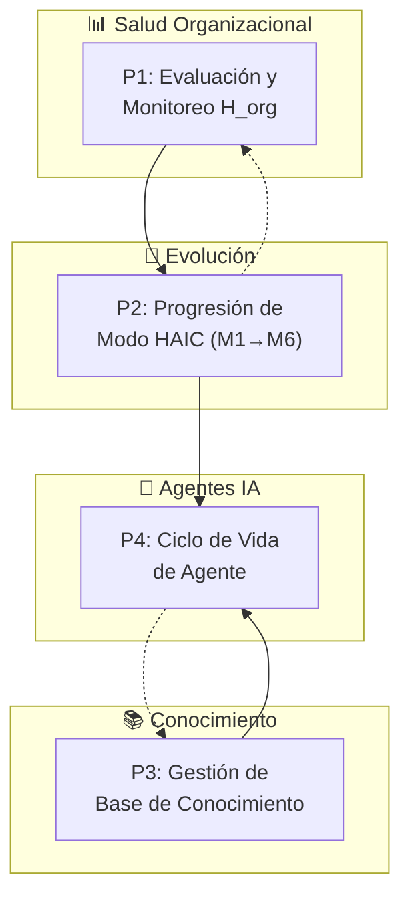
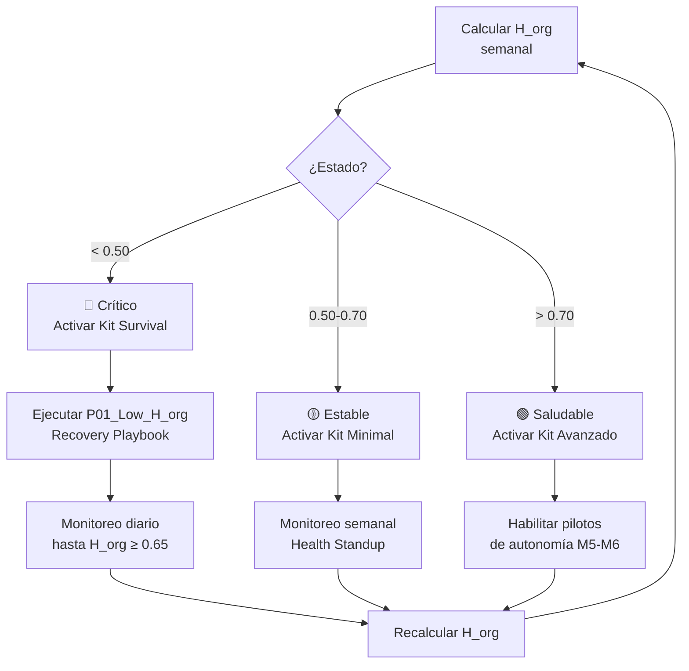
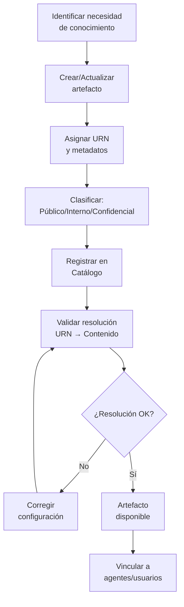
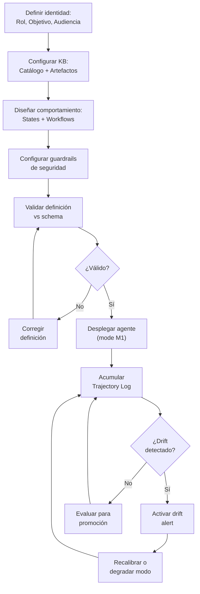

# D-EVOL: Dominio de Evolución e Inteligencia

> **Parte de:** [GORE_OS Vision General](../vision_general.md)  
> **Capa:** Estratégica  
> **Función GORE:** EVOLUCIONAR  
> **Procesos BPMN:** 4 | **Subprocesos:** ~40 | **User Stories:** 32

---

## Glosario D-EVOL

| Término             | Definición                                                                                                           |
| ------------------- | -------------------------------------------------------------------------------------------------------------------- |
| **H_org**           | Health Score Organizacional. Índice compuesto que mide salud del sistema. Fórmula: A×0.25 + D×0.25 + O×0.30 + P×0.20 |
| **HAIC**            | Human-AI Collaboration. Framework de colaboración humano-IA con niveles M1-M6. Invariante I5 de orko                 |
| **SDA**             | Sense-Decide-Act. Ciclo operacional de percepción, análisis y ejecución                                              |
| **P1-P5**           | Primitivos fundamentales: Capacidad, Flujo, Información, Límite, Propósito                                           |
| **M1-M6**           | Modos de delegación IA: Monitorear, Asistir, Habilitar, Controlar, Supervisar, Ejecutar                              |
| **L0-L5**           | Niveles de madurez: Inicial, Digitalizado, Integrado, Automatizado, Inteligente, Autónomo                            |
| **Trajectory Log**  | Registro histórico de desempeño de capacidades IA para progresión de autonomía                                       |
| **Drift Detection** | Detección de degradación de modelos ML mediante comparación con baseline                                             |
| **Feature Flag**    | Mecanismo de habilitación gradual de funcionalidades                                                                 |
| **RICE**            | Reach, Impact, Confidence, Effort. Framework de priorización                                                         |
| **Data Steward**    | Responsable de calidad y gobernanza de un dataset                                                                    |
| **Playbook**        | Procedimiento estructurado de respuesta a situaciones conocidas                                                      |
| **URN**             | Uniform Resource Name. Identificador único de artefacto de conocimiento                                              |
| **Catálogo**        | Inventario maestro de artefactos de conocimiento con metadatos                                                       |
| **Linaje**          | Trazabilidad de origen y transformaciones de un artefacto                                                            |
| **Agente IA**       | Capacidad declarativa con comportamiento determinista gobernada por HAIC                                             |
| **Orquestador**     | Agente que coordina flota de sub-agentes para tareas complejas                                                       |

> **Fuente canónica:** [orko/knowledge/core](file:///Users/felixsanhueza/Developer/orko/knowledge/core) para HAIC, H_org, P1-P5

---

## Propósito

Gestionar la evolución nativa del sistema operativo regional hacia niveles superiores de madurez organizacional, basándose en un framework formal de transformación que va más allá del cumplimiento normativo.

> **Evolución Nativa vs. Cumplimiento:** Mientras D-TDE asegura el piso normativo (Ley 21.180), D-EVOL representa el **techo de capacidades**. La TDE es obligatoria; la evolución nativa es estratégica.

---

## Módulos

### 1. Salud Organizacional (H_org)

> **Fuente:** orko/knowledge/core/guide_core_004_toolkit_orko.yml

**Fórmula H_org:**

```javascript
H_org = Capacity×0.30 + Flow×0.30 + Info×0.25 + Governance×0.15
```

**Umbrales de Estado:**

| Estado      | Rango H_org | Kit Aplicable | Acción                     |
| ----------- | ----------- | ------------- | -------------------------- |
| 🔴 Crítico   | < 0.50      | Kit Survival  | Estabilización 3-6 semanas |
| 🟡 Estable   | 0.50-0.70   | Kit Minimal   | Cimientos 6-12 semanas     |
| 🟢 Saludable | > 0.70      | Kit Avanzado  | Transformación 3-6 meses   |

**Gates de Transición:**

- G1: H_org < 70 → Activar P01_Low_H_org_Recovery
- GATE transformación estructural: H_org ≥ 70

### 2. Trayectoria del Sistema

**Funcionalidades:**

- Configuración de Feature Flags (rollout gradual)
- Ajuste de umbrales de riesgo
- Reporte de brechas de capacidad
- Trayectoria de evolución L0→L5

### 3. Pilotos de Autonomía

**Funcionalidades:**

- Activación de pilotos M6 (autonomía máxima)
- Escalamiento de configuración a nuevas divisiones
- Retrospectivas de sistema
- Métricas de seguimiento de pilotos

### 4. Playbooks de Remediación

**Catálogo:**

| Playbook          | Trigger                 | Objetivo                          |
| ----------------- | ----------------------- | --------------------------------- |
| P01_Low_H_org     | H_org < 60              | Recuperar H_org > 65 en 7-14 días |
| P02_High_Handoffs | Handoffs > umbral       | Reducir fricciones operativas     |
| P03_Drift_Alert   | Drift Score > threshold | Recalibrar modelo ML              |

**Funcionalidades:**

- Ejecución guiada de playbooks
- Monitor de progreso por paso
- Registro de resultados

### 5. Gobierno de Evolución

**Funcionalidades:**

- Aprobación de cambios críticos
- Arbitraje de prioridades (RICE)
- Comité de Gobierno para decisiones mayores

### 6. Deuda Técnica

**Funcionalidades:**

- Inventario de deuda técnica
- Plan de pago de deuda
- Planificación de evolución de schema (migraciones)
- Monitoreo de KPIs técnicos

### 7. Base de Conocimiento Institucional

> **Principio:** El conocimiento institucional es un activo estratégico que requiere gobernanza, curación y acceso estructurado.

**Componentes:**

| Componente     | Descripción                                      | Función                          |
| -------------- | ------------------------------------------------ | -------------------------------- |
| **Catálogo**   | Inventario maestro de artefactos de conocimiento | Fuente de verdad para resolución |
| **Artefactos** | Documentos estructurados con semántica explícita | Conocimiento formalizado         |
| **URN**        | Identificador único de artefacto                 | Resolución determinística        |
| **Linaje**     | Trazabilidad de origen y transformaciones        | Auditoría y confianza            |

**Tipos de Artefacto:**

| Tipo      | Descripción                   | Ejemplo            |
| --------- | ----------------------------- | ------------------ |
| Guía      | Conocimiento procedimental    | Manual de procesos |
| Normativa | Regulación y leyes aplicables | Ley 19.175         |
| Técnico   | Especificaciones sistema      | ERD, API specs     |
| Operativo | Procedimientos internos       | Protocolos GORE    |

**Políticas de Uso:**

| Política      | Descripción                        | Caso de Uso           |
| ------------- | ---------------------------------- | --------------------- |
| USO_EXCLUSIVO | Solo usar artefactos especificados | Respuestas normativas |
| HÍBRIDO       | KB + conocimiento general LLM      | Consultas abiertas    |
| TIEMPO_REAL   | KB + búsqueda web                  | Datos actuales        |

**Funcionalidades:**

- Catálogo de artefactos con metadatos
- Resolución de URN a contenido
- Versionamiento semántico
- Trazabilidad de linaje
- Clasificación (Público/Interno/Confidencial)

### 8. Agentes IA Especializados

> **Principio:** Los agentes IA son capacidades declarativas con comportamiento determinístico, gobernados por HAIC.

**Arquitectura de Agente:**

```mermaid
IDENTIDAD → CONOCIMIENTO → COMPORTAMIENTO → SEGURIDAD → EVALUACIÓN
    │            │              │              │            │
    ▼            ▼              ▼              ▼            ▼
  Rol+Obj    KB Sources     States+WF      Guardrails   Checklist
```

**Tipos de Agente:**

| Tipo        | Descripción                 | Modo HAIC | Ejemplo                |
| ----------- | --------------------------- | --------- | ---------------------- |
| Asesor      | Consultas y recomendaciones | M2-M3     | Asesor IPR             |
| Operativo   | Tareas rutinarias           | M4-M5     | Procesador rendiciones |
| Orquestador | Coordina otros agentes      | M4        | Gestor de casos        |
| Monitor     | Observa y alerta            | M1-M2     | Vigilante de mora      |

**Ciclo de Vida del Agente:**

```mermaid
DISEÑO → VALIDACIÓN → DESPLIEGUE → MONITOREO → PROMOCIÓN/DEGRADACIÓN
```

**Funcionalidades:**

- Definición declarativa de agentes
- Gobernanza HAIC por agente
- Trajectory log de desempeño
- Drift detection automático
- Promoción/degradación de modo

### 9. Orquestación de Agentes

> **Principio:** Agentes complejos coordinan flotas de sub-agentes para tareas multi-paso.

**Patrones de Orquestación:**

| Patrón      | Descripción                       | Caso de Uso                  |
| ----------- | --------------------------------- | ---------------------------- |
| SECUENCIAL  | Ejecutar agentes en cadena        | Pipeline de procesamiento    |
| PARALELO    | Ejecutar agentes simultáneamente  | Recopilación de perspectivas |
| CONDICIONAL | Seleccionar agente según contexto | Routing especializado        |
| ITERATIVO   | Repetir hasta condición           | Ciclos de refinamiento       |

**Funcionalidades:**

- Definición de flotas de agentes
- Contexto compartido entre agentes
- Síntesis de resultados
- Log de evidencia de delegación

---

## Framework de Evolución Organizacional

### Primitivos Fundamentales (P1-P5)

| Primitivo           | Pregunta             | Descripción              |
| ------------------- | -------------------- | ------------------------ |
| **P1: CAPACIDAD**   | ¿Quién ejecuta?      | Humano/IA/Mixto          |
| **P2: FLUJO**       | ¿Cómo se transforma? | Procesos y pasos         |
| **P3: INFORMACIÓN** | ¿Qué se transforma?  | Entrada/salida           |
| **P4: LÍMITE**      | ¿Qué restringe?      | Normas, recursos, plazos |
| **P5: PROPÓSITO**   | ¿Para qué?           | OKRs, outcomes           |

### Ciclo Operacional: SDA

```mermaid
SENSE → DECIDE → ACT → (feedback loop)
Percibir   Analizar   Ejecutar
datos      priorizar  transformación
```

---

## Modelo HAIC: Colaboración Humano-IA

> **Fuente:** orko/knowledge/core/guide_core_000_fundamentos_orko.yml → I5_HAIC

### Niveles de Delegación (M1-M6)

| Nivel  | Nombre     | Descripción                             |
| ------ | ---------- | --------------------------------------- |
| **M1** | MONITOREAR | Humano ejecuta, IA observa y aprende    |
| **M2** | ASISTIR    | Humano ejecuta, IA sugiere opciones     |
| **M3** | HABILITAR  | IA prepara, humano decide y ejecuta     |
| **M4** | CONTROLAR  | IA ejecuta, humano aprueba cada acción  |
| **M5** | SUPERVISAR | IA ejecuta, humano audita por excepción |
| **M6** | EJECUTAR   | IA autónoma, humano override disponible |

### Invariantes HAIC

- **∀ Capacidad IA (nivel ≥ M2): ∃ Humano accountable**
- Progresión M1→M6 solo con trajectory log y evidencia de desempeño
- Explainability requerida para niveles M3+

---

## Niveles de Madurez

| Nivel  | Nombre       | Características                                      |
| ------ | ------------ | ---------------------------------------------------- |
| **L0** | INICIAL      | Procesos ad-hoc, sin estandarización                 |
| **L1** | DIGITALIZADO | Captura digital, repositorio único, trazabilidad     |
| **L2** | INTEGRADO    | Datos unificados, dashboards tiempo real             |
| **L3** | AUTOMATIZADO | Alertas, validaciones, flujos automáticos            |
| **L4** | INTELIGENTE  | Decisiones asistidas por IA (M2-M4)                  |
| **L5** | AUTÓNOMO     | Agentes IA operativos (M5-M6), optimización continua |

---

## 📋 Procesos BPMN

### Mapa General D-EVOL



---

### P1: Evaluación y Monitoreo H_org



---

### P2: Progresión de Modo HAIC (M1→M6)


---

### P3: Gestión de Base de Conocimiento



---

### P4: Ciclo de Vida de Agente IA



---

## 📝 User Stories por Módulo

### Resumen

| Módulo           | US Críticas | US Altas | Total  |
| ---------------- | ----------- | -------- | ------ |
| HealthOrg        | 2           | 1        | 3      |
| Trayectoria      | 0           | 3        | 3      |
| Pilotos          | 0           | 3        | 3      |
| Playbooks        | 0           | 2        | 2      |
| Gobierno         | 1           | 1        | 2      |
| DeudaTecnica     | 1           | 2        | 3      |
| BaseConocimiento | 2           | 4        | 6      |
| AgentesIA        | 2           | 4        | 6      |
| Orquestacion     | 1           | 3        | 4      |
| **Total**        | **9**       | **23**   | **32** |

> **Fuente:** [kb_goreos_us_d-evol.yml](../user-stories/kb_goreos_us_d-evol.yml)

### Catálogo por Módulo

#### Salud Organizacional (HealthOrg)

| ID            | Título                                  | Prioridad |
| ------------- | --------------------------------------- | --------- |
| US-EVOL-H-001 | Dashboard salud del sistema (H_org)     | Crítica   |
| US-EVOL-H-002 | Declarar cambio Estado de Salud (Gate)  | Crítica   |
| US-EVOL-H-003 | Simular impacto configuración (What-if) | Alta      |

#### Trayectoria

| ID               | Título                                 | Prioridad |
| ---------------- | -------------------------------------- | --------- |
| US-EVOL-TRAY-001 | Configurar trayectoria (Feature Flags) | Alta      |
| US-EVOL-TRAY-002 | Ajustar umbrales de riesgo             | Alta      |
| US-EVOL-TRAY-003 | Revisar brechas de capacidad           | Alta      |

#### Pilotos

| ID                | Título                                 | Prioridad |
| ----------------- | -------------------------------------- | --------- |
| US-EVOL-PILOT-001 | Activar pilotos de autonomía (M6)      | Alta      |
| US-EVOL-PILOT-002 | Escalar configuración a nueva división | Alta      |
| US-EVOL-PILOT-003 | Crear retrospectiva de sistema         | Alta      |

#### Playbooks

| ID               | Título                           | Prioridad |
| ---------------- | -------------------------------- | --------- |
| US-EVOL-PLAY-001 | Ejecutar playbook de remediación | Alta      |
| US-EVOL-PLAY-002 | Monitor progreso playbooks       | Alta      |

#### Gobierno

| ID              | Título                          | Prioridad |
| --------------- | ------------------------------- | --------- |
| US-EVOL-GOV-001 | Aprobar cambios críticos        | Crítica   |
| US-EVOL-GOV-002 | Arbitraje de prioridades (RICE) | Alta      |

#### Deuda Técnica

| ID             | Título                      | Prioridad |
| -------------- | --------------------------- | --------- |
| US-EVOL-DT-001 | Gestionar deuda técnica     | Alta      |
| US-EVOL-DT-002 | Planificar evolución schema | Alta      |
| US-EVOL-DT-003 | Monitorear KPIs sistema     | Crítica   |

#### Base de Conocimiento

| ID             | Título                                              | Prioridad |
| -------------- | --------------------------------------------------- | --------- |
| US-EVOL-KB-001 | Crear/actualizar artefacto de conocimiento          | Crítica   |
| US-EVOL-KB-002 | Registrar artefacto en catálogo                     | Crítica   |
| US-EVOL-KB-003 | Validar resolución URN                              | Alta      |
| US-EVOL-KB-004 | Clasificar artefacto (Público/Interno/Confidencial) | Alta      |
| US-EVOL-KB-005 | Gestionar ciclo de vida (Draft/Review/Published)    | Alta      |
| US-EVOL-KB-006 | Consultar linaje de artefacto                       | Alta      |

#### Agentes IA

| ID              | Título                                | Prioridad |
| --------------- | ------------------------------------- | --------- |
| US-EVOL-AGT-001 | Definir agente declarativo (YAML)     | Crítica   |
| US-EVOL-AGT-002 | Desplegar agente en modo M1 (Monitor) | Crítica   |
| US-EVOL-AGT-003 | Monitorear drift de agente            | Alta      |
| US-EVOL-AGT-004 | Promover/degradar modo HAIC           | Alta      |
| US-EVOL-AGT-005 | Validar compliance guardrails         | Alta      |
| US-EVOL-AGT-006 | Configurar memoria y contexto         | Alta      |

#### Orquestación

| ID               | Título                                              | Prioridad |
| ---------------- | --------------------------------------------------- | --------- |
| US-EVOL-ORCH-001 | Definir flota de agentes y roles                    | Crítica   |
| US-EVOL-ORCH-002 | Ejecutar patrón de delegación (Secuencial/Paralelo) | Alta      |
| US-EVOL-ORCH-003 | Monitorizar sesión de orquestación                  | Alta      |
| US-EVOL-ORCH-004 | Gestionar fallback de sub-agentes                   | Alta      |

---

## Entidades de Datos

### Framework de Evolución

| Entidad        | Atributos Clave                                                                                     | Relaciones                 |
| -------------- | --------------------------------------------------------------------------------------------------- | -------------------------- |
| `Capacidad`    | id, nombre, sustrato (humano/algorítmico/mixto), nivel_cognitivo, modo_haic (M1-M6), accountable_id | → Flujo[], TrajectoryLog[] |
| `NivelMadurez` | id, proceso_id, nivel_actual (L0-L5), nivel_objetivo, fecha_evaluacion, gaps[]                      | → PlanEvolucion            |

### Salud Organizacional

| Entidad             | Atributos Clave                                                      | Relaciones            |
| ------------------- | -------------------------------------------------------------------- | --------------------- |
| `HealthScore`       | id, fecha, h_org_value, a_score, d_score, o_score, p_score, estado   | → Alerta[]            |
| `Playbook`          | id, nombre, trigger_condition, pasos[], owner_id, resultado_esperado | → PlaybookExecution[] |
| `PlaybookExecution` | id, playbook_id, fecha_inicio, fecha_fin, estado, resultado_actual   | → Playbook            |

### Colaboración Humano-IA

| Entidad         | Atributos Clave                                                                    | Relaciones               |
| --------------- | ---------------------------------------------------------------------------------- | ------------------------ |
| `Delegacion`    | id, capacidad_ia_id, humano_accountable_id, modo (M1-M6), fecha_inicio, evidencia  | → Capacidad, Funcionario |
| `TrajectoryLog` | id, capacidad_id, timestamp, input, output, success, latency                       | → Capacidad              |
| `DriftAlert`    | id, capacidad_id, fecha, metrica_afectada, valor_esperado, valor_actual, severidad | → Capacidad              |

### Gobierno

| Entidad          | Atributos Clave                                                        | Relaciones    |
| ---------------- | ---------------------------------------------------------------------- | ------------- |
| `DeudaTecnica`   | id, descripcion, origen, impacto, esfuerzo_estimado, plan_pago, estado | → Sprint[]    |
| `CambioAprobado` | id, descripcion, tipo, riesgo, aprobador_id, fecha, evidencia          | → Funcionario |

### Base de Conocimiento Institucional

| Entidad     | Atributos Clave                                                     | Relaciones             |
| ----------- | ------------------------------------------------------------------- | ---------------------- |
| `Artefacto` | id, urn, tipo, version, estado (Draft/Published), contenido, hash   | → Metadato[], Linaje[] |
| `Catalogo`  | id, namespace, artefactos_registrados[], politica_resolucion        | → Artefacto[]          |
| `Linaje`    | id, artefacto_id, fuente_origen, transformacion, fecha, responsable | → Artefacto            |

### Agentes y Orquestación

| Entidad              | Atributos Clave                                                    | Relaciones        |
| -------------------- | ------------------------------------------------------------------ | ----------------- |
| `AgenteSpec`         | id, nombre, rol, objetivo, modelo_cognitivo, guardrails, kb_policy | → AgenteRuntime   |
| `AgenteRuntime`      | id, spec_id, modo_haic_actual, estado_operativo, drift_score       | → TrajectoryLog[] |
| `Flota`              | id, nombre, agentes_miembros[], estrategia_coordinacion            | → AgenteSpec[]    |
| `SesionOrquestacion` | id, flota_id, input_usuario, pasos[], estado, resultado            | → Flota           |

---

## Sistemas Involucrados

| Sistema          | Función                           | Integración      |
| ---------------- | --------------------------------- | ---------------- |
| `INT-H_ORG`      | Dashboard de salud organizacional | Cálculo semanal  |
| `INT-TRAJECTORY` | Registro de desempeño IA          | ML training data |
| `INT-PLAYBOOKS`  | Motor de ejecución de playbooks   | Automatización   |
| `INT-DRIFT`      | Detección de drift en modelos     | MLOps            |

---

## Normativa Aplicable

| Norma          | Alcance                                   |
| -------------- | ----------------------------------------- |
| **Ley 21.719** | Protección de datos personales (datasets) |
| **Ley 21.180** | TDE - piso normativo digitalización       |
| **ISO 27001**  | Seguridad de información                  |
| **ISO 38500**  | Gobierno de TI                            |

---

## Referencias Cruzadas

| Dominio     | Relación                                             | Entidades Compartidas  |
| ----------- | ---------------------------------------------------- | ---------------------- |
| **D-PLAN**  | Proyección de cumplimiento ERD                       | OKR, Indicador         |
| **D-FIN**   | Analytics predictivo para IPR                        | IPR, Proyeccion        |
| **D-EJEC**  | Automatización de alertas de convenios               | Alerta, Convenio       |
| **D-COORD** | Scoring predictivo de actores                        | Actor, Rating          |
| **D-NORM**  | Automatización de expedientes                        | ActoAdministrativo     |
| **D-BACK**  | Predicción de necesidades de recursos                | Inventario             |
| **D-TDE**   | D-TDE es piso normativo, D-EVOL es techo estratégico | Capacidad              |
| **D-TERR**  | Analytics geoespacial avanzado                       | CapaGeoespacial        |
| **D-SEG**   | Analytics predictivo de incidentes                   | Incidente              |
| **FÉNIX**   | Detección automatizada de condiciones de activación  | AlertaFenix, CasoFenix |
| **Todos**   | Agentes IA operan sobre todos los dominios           | Agente, Capacidad      |

---

*Documento parte de GORE_OS Blueprint Integral v5.0*  
*Última actualización: 2025-12-16*
