# D-FIN: Dominio de Financiamiento e Inversión Pública

> Parte de: [GORE_OS Vision General](../vision_general.md)  
> Capa: Núcleo (Dimensión Táctica)  
> Función GORE: FINANCIAR  

---

## Glosario D-FIN

| Término                  | Definición                                                                                                                                                  |
| ------------------------ | ----------------------------------------------------------------------------------------------------------------------------------------------------------- |
| IPR                      | Intervención Pública Regional (término interno GORE Ñuble). Paragua operativo que agrupa IDI, PPR y tipologías específicas regionales                       |
| IDI                      | Iniciativa de Inversión. Gasto de capital (S.31/S.33). Puede requerir RS/AD de MDSF y registro obligatorio en BIP                                           |
| PPR                      | Programa Público Regional. Gasto corriente/mixto (S.24). En ejecución directa (Glosa 06) requiere RF DIPRES/SES; en transferencia a entidad pública usa ITF |
| RS                       | Recomendación Satisfactoria (MDSF/SNI). Resultado favorable para IDI                                                                                        |
| AD                       | Admisible (MDSF/SNI). Resultado favorable para proyectos de conservación (cuando aplica)                                                                    |
| RF                       | Resultado Favorable (DIPRES/SES). Resultado favorable para programas (p. ej., PPR Glosa 06)                                                                 |
| ITF                      | Informe Técnico Favorable. Evaluación interna GORE para PPR Transferencia                                                                                   |
| FI                       | Favorable con Indicaciones. Aprobado con ajustes requeridos previo financiamiento                                                                           |
| OT                       | Objetado Técnicamente. Rechazado, requiere reformulación completa                                                                                           |
| RATE                     | Resultado de Admisibilidad Técnico-Económica (genérico): RS, AD, RF, ITF, FI, OT                                                                            |
| CDP                      | Certificado de Disponibilidad Presupuestaria. Primer paso cadena SIGFE                                                                                      |
| BIP                      | Banco Integrado de Proyectos. Registro SNI de iniciativas de inversión                                                                                      |
| SISREC                   | Sistema de Rendición Electrónica de Cuentas (CGR). Obligatorio desde 2023                                                                                   |
| DAF                      | División de Administración y Finanzas                                                                                                                       |
| UCR                      | Unidad de Control de Rendiciones (DAF)                                                                                                                      |
| RTF                      | Referente Técnico-Financiero (revisor otorgante)                                                                                                            |
| UT                       | Unidad Técnica (equipo ejecutor responsable de la obra/ejecución)                                                                                           |
| ARI                      | Anteproyecto Regional de Inversiones. Priorización anual de IPR                                                                                             |
| CDR                      | Comité de Desarrollo Regional. Órgano consultivo que evalúa pertinencia estratégica de IPR                                                                  |
| FNDR                     | Fondo Nacional de Desarrollo Regional. Principal fuente de inversión                                                                                        |
| FRPD                     | Fondo Regional de Productividad y Desarrollo (Royalty minero)                                                                                               |
| FRIL                     | Fondo Regional de Iniciativa Local. Infraestructura municipal ≤5.000 UTM                                                                                    |
| ISAR                     | Inversión Sectorial de Asignación Regional. Recursos de ministerios (MOP, MINVU) priorizados por el GORE                                                    |
| SPD                      | Subsecretaría de Prevención del Delito (validaciones y reglas asociadas a tipologías de seguridad cuando aplique)                                           |
| MDSF                     | Ministerio de Desarrollo Social y Familia                                                                                                                   |
| DIPRES                   | Dirección de Presupuestos                                                                                                                                   |
| SES                      | Subsecretaría de Evaluación Social (MDSF) / evaluación de programas cuando aplique                                                                          |
| MML                      | Marco de Metodología Lógica. Herramienta de diseño y evaluación de programas públicos (requerido para Glosa 06).                                            |
| SNI                      | Sistema Nacional de Inversiones. Plataforma del Estado para la evaluación y seguimiento de iniciativas de inversión pública (BIP, RS, etc.)                 |
| Retorno Territorial      | Impacto medible de una inversión en indicadores de desarrollo regional (empleos, productividad, calidad de vida, sostenibilidad).                           |
| Cultivo de Oportunidades | Proceso de maduración de una iniciativa desde su detección hasta que cumple los requisitos para ser admisible o priorizada.                                 |
| Teoría de Cambio         | Hipótesis causal que explica cómo una intervención produce el resultado esperado en desarrollo regional.                                                    |
| PuntajeImpacto           | Puntuación 0-100 que mide el retorno territorial esperado de una IPR, ponderando dimensiones social, económica, ambiental e institucional.                  |
| Proyecto Emblemático     | Iniciativa de alto impacto regional incluida en la agenda Ñuble 250 o equivalente, con seguimiento priorizado.                                              |

---

## Propósito

Gestión integral 360° del ciclo de vida de las inversiones públicas regionales, integrando cuatro perspectivas:

1. Captación de Oportunidades - Identificar y priorizar necesidades de desarrollo
2. Gestión de Capital - Maximizar el retorno en desarrollo regional
3. Gestión de Ejecutores - Administrar relaciones y capacidades institucionales
4. Evaluación Continua - Asegurar calidad y resultados (ex ante, ex durante, ex post)

> Visión: El GORE opera como gestor integral del desarrollo regional: capta oportunidades de intervención, administra capital público para generar retorno en desarrollo, cultiva relaciones con ejecutores, y evalúa continuamente resultados e impacto.

---

## Módulos

### 1. Captación de Oportunidades

Fuentes de Captación:

- ERD/Brechas - Brechas identificadas en Estrategia Regional
- Diagnósticos - Estudios territoriales, sectoriales, comunales
- Demanda ciudadana - OIRS, cabildos, consultas públicas
- Compromisos - Compromisos de Gobernador, CORE, autoridades
- Fondos disponibles - Convocatorias sectoriales, cofinanciamientos
- Emergencias - Situaciones de emergencia declarada (Glosa 02, Inciso 4)
- Ejecutores - Propuestas de municipios, servicios, universidades

Embudo de Oportunidades:

```text
DETECTADA (100%) → CALIFICADA (60%) → PRIORIZADA (35%) → EN CULTIVO (20%) → CONVERTIDA (15%)
```

Funcionalidades Adicionales M1:

- **Lista de Documentos por Mecanismo**: Lista de verificación dinámica de requisitos según FRIL/FRPD/FNDR/PPR
- **Gestión de Oportunidades en Cultivo**: Seguimiento de iniciativas en maduración con próximos pasos
- **Vista 360° de Oportunidad**: Panel integrado con ejecutor, alineamiento ERD y potencial de conversión

### 2. Capital Base

| Fuente      | Descripción                                         | Ñuble 2026 (M$) |
| ----------- | --------------------------------------------------- | --------------- |
| FNDR        | Fondo Nacional Desarrollo Regional (principal)      | 41.562.476      |
| FRPD        | Fondo Regional Productividad y Desarrollo (Royalty) | 12.829.611      |
| F. Equidad  | Fondo de Equidad Interregional                      | 6.353.223       |
| Transporte  | Fondo de Apoyo al Transporte y Conectividad         | 18.790.488      |
| Sectoriales | Transferencias de ministerios (consolidables)       | -               |
| Propios     | Patentes mineras, código aguas, cultura             | 1.863.175       |
| SIC         | Saldo Inicial de Caja (arrastre)                    | -               |

> Fuente: Ley 21.796 (Presupuesto 2026), Partida 31, Glosa 02. Ver `kb_gn_210_ley_presupuestos_2026_partida_31_koda.yml`

### 3. Portafolio IPR

Taxonomía IPR:

```text
IPR (Término paraguas)
├── IDI (Iniciativa de Inversión) - Gasto de capital: obras, activos (S.31, S.33)
│   └── Requiere RS/AD de MDSF, Registro obligatorio en BIP
├── PPR (Programa Público Regional) - Gasto corriente/mixto (S.24)
│   └── Puede ser ejecución directa (Glosa 06, requiere RF DIPRES/SES) o transferencia a entidad pública (requiere ITF interno GORE)
└── Proyecto_Seguridad - Prevención del delito y seguridad pública
    └── Hereda de IPR + reglas especiales (validación SPD, convenio municipal)
```

Fases del Ciclo de Vida IPR (según `kb_gn_019_gestion_ipr_koda.yml`):

```text
Fase 1: INGRESO/PERTINENCIA/ADMISIBILIDAD
Fase 2: EVALUACIÓN TÉCNICO-ECONÓMICA (RS/RF/ITF)
Fase 3: FINANCIAMIENTO (CDP, Acuerdo CORE)
Fase 4: GESTIÓN PRESUPUESTARIA (Resolución, Convenio)
Fase 5: EJECUCIÓN (Licitación, Supervisión, Estados de Pago)
Fase 6: MODIFICACIONES (Aumento costo, Prórroga, Cambio alcance)
Fase 7: CIERRE (Recepción, Rendición, Reintegro, Garantías)
```

Estados Transversales: `SUSPENDIDA`, `CANCELADA`

### 4. Selector de Mecanismos

| Código | Nombre              | Tope UTM  | Eval.     | Ejecutor      | Guía KODA |
| ------ | ------------------- | --------- | --------- | ------------- | --------- |
| SNI    | IDI General         | Sin tope  | RS MDSF   | Público       | kb_gn_024 |
| FRIL   | Fondo Reg.Inf.Local | 5.000     | GORE      | Municipios    | kb_gn_026 |
| FRPD   | Royalty (I+D+i)     | Variable¹ | SNI/GORE¹ | Habilitados   | kb_gn_027 |
| C33    | Circular 33         | ≤30%²     | GORE      | Público       | kb_gn_029 |
| G06    | PPR Glosa 06        | Sin tope  | RF DIPRES | GORE directo  | kb_gn_025 |
| TRANSF | PPR Transferencia   | Sin tope  | ITF GORE  | Entidad Públ. | kb_gn_001 |
| S8%    | Subvención 8%       | Variable  | GORE      | ONG/OSC/Muni  | kb_gn_028 |
| ISAR   | Inv. Sectorial Reg. | Variable  | Sectorial | MOP/MINVU/Etc | kb_gn_030 |

> Notas:  
> ¹ FRPD bifurca: la evaluación puede requerir evaluación externa (SNI/MDSF) o evaluación simplificada GORE según tipo/umbral de iniciativa; ver `kb_gn_027_guia_frpd_koda.yml`  
> ² C33: Conservación ≤30% costo reposición; ANF sin tope; Estudios hasta 3% inversión total

#### Tabla Comparativa Expandida de Mecanismos

| Mecanismo | Naturaleza         | Ejecutor Elegible                      | Evaluador                       | Tope Presup.                   | Plazo Ciclo Típico           | Tipo Rendición          | Convocatoria             |
| --------- | ------------------ | -------------------------------------- | ------------------------------- | ------------------------------ | ---------------------------- | ----------------------- | ------------------------ |
| SNI       | IDI (Capital)      | Entidad pública (Muni, Servicio, GORE) | MDSF/SNI → RS                   | Sin tope                       | 6-18 meses (según etapa BIP) | SISREC                  | Ventanilla abierta       |
| FRIL      | IDI (Capital)      | Municipios exclusivamente              | GORE (interno)                  | ≤5.000 UTM                     | 4-8 meses                    | SISREC                  | Concurso anual (feb-mar) |
| FRPD      | IDI/PPR (Variable) | Público o privado habilitado           | SNI o GORE (según umbral/tipo)  | Variable por línea             | 6-12 meses                   | SISREC                  | Concurso o ventanilla    |
| C33       | IDI (Capital)      | Entidad pública                        | GORE (interno)                  | ≤30% reposición / Sin tope ANF | 3-6 meses                    | SISREC                  | Ventanilla abierta       |
| G06       | PPR (Corriente)    | GORE (ejecución directa)               | DIPRES/SES → RF                 | Sin tope                       | 8-14 meses (incluye SES)     | N/A (ejecución directa) | Programación anual       |
| TRANSF    | PPR (Corriente)    | Entidad pública (Muni, Servicio)       | GORE (interno) → ITF            | Sin tope                       | 3-6 meses                    | SISREC                  | Ventanilla abierta       |
| S8%       | PPR (Corriente)    | ONG, OSC, Fundaciones, Municipios      | GORE (interno)                  | Variable (% FNDR)              | 4-6 meses                    | SISREC                  | Concurso anual (mar-abr) |
| ISAR      | IDI Sectorial      | MOP, MINVU, Servicios Públicos         | Sectorial + GORE (Priorización) | Según Sector                   | Anual (Ley Ppto)             | Sectorial               | Decretos Sectoriales     |

Criterios de Selección Rápida:

| Pregunta Clave                               | Si la respuesta es... | Mecanismo Sugerido   |
| -------------------------------------------- | --------------------- | -------------------- |
| ¿Es infraestructura municipal <5.000 UTM?    | Sí                    | FRIL                 |
| ¿Es conservación de activo existente?        | Sí                    | C33 (Conservación)   |
| ¿Es estudio o diseño sin obra?               | Sí                    | C33 (Estudios) o SNI |
| ¿Es I+D+i o productividad regional?          | Sí                    | FRPD                 |
| ¿Es programa ejecutado por el GORE?          | Sí                    | G06 (Glosa 06)       |
| ¿Es transferencia a entidad pública?         | Sí                    | TRANSF               |
| ¿Es apoyo a ONG/OSC sin fines de lucro?      | Sí                    | S8%                  |
| ¿Es inversión tradicional >5.000 UTM?        | Sí                    | SNI                  |
| ¿Es inversión sectorial priorizada por GORE? | Sí                    | ISAR                 |

Antipatrones Frecuentes:

| Error Común                                | Consecuencia        | Corrección                   |
| ------------------------------------------ | ------------------- | ---------------------------- |
| Postular FRIL sin ser municipio            | Inadmisible         | Redirigir a SNI o FRPD       |
| Usar C33 para obra nueva (no conservación) | Rechazado           | Usar SNI o FRIL              |
| PPR Transferencia a entidad privada        | Inadmisible         | Usar S8% (subvención)        |
| FRPD sin foco productivo/I+D               | Baja priorización   | Reformular o usar SNI        |
| Glosa 06 sin metodología MML               | No obtiene RF       | Completar Marco Lógico       |
| Omitir SISREC en rendición post-2023       | Rendición rechazada | Usar SISREC obligatoriamente |

#### Árbol de Decisión Detallado para Selección de Mecanismo

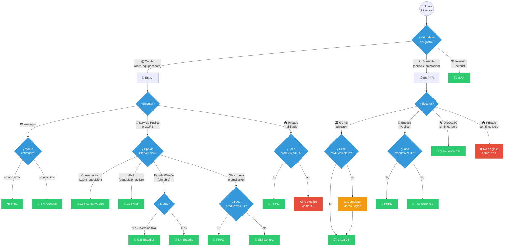

### 5. Presupuesto Regional (Dimensión Estratégica)

> **⚠️ Nota de Diseño**: Este módulo cubre la **distribución estratégica** de recursos (ARI, CORE, fondos regionales). La **ejecución contable** (cadena CDP→Compromiso→Devengo→Pago) se gestiona operativamente en [D-BACK (Tesorería y Contabilidad)](domain_d-back.md#contabilidad-operativa). D-FIN **consume** el % de ejecución presupuestaria como KPI de salud del portafolio.

Ciclo Presupuestario:

```text
ENE-MAR: Ejecución año n
ABR-JUN: ARI (mayo)
JUL-SEP: Ley Presupuesto (agosto)
OCT-DIC: Aprobación CORE (diciembre)
ENE-DIC (n+1): Ejecución año n+1
```

#### Glosas Presupuestarias 2025 (Circular 11 DIPRES)

| Glosa | Asunto                                | Restricción/Habilitación Principal                           |
| ----- | ------------------------------------- | ------------------------------------------------------------ |
| 01    | Distribución inicial y modificaciones | Define 6 excepciones que no requieren acuerdo CORE           |
| 03    | Prohibiciones recursos inversión      | Prohibición de financiar personal (ST.21) receptoras         |
| 04    | Reasignaciones entre subtítulos       | Flexibilidad para cambios excepto subtítulo 22               |
| 05    | Transferencias universidades          | Limitado a DFL N°4 de 1981 y casa central en la región       |
| 06    | Transferencias corrientes             | Gastos de administración tope 5% de la transferencia         |
| 07    | Subsidios 8%                          | 10% del fondo disponible para asignación directa emblemática |
| 08    | Corporaciones art.101                 | Tope 5% presupuesto inversión y 50% cofinanciamiento         |
| 09    | ST.29 Activos no financieros          | Exclusivamente para reposición; 90 días para transferir      |
| 10    | ST.31 Iniciativas Inversión           | Sujetas a normativa SNI y evaluación MDSyF                   |
| 11    | ST.33 Transferencias Capital          | Normas para subsidios a empresas en áreas rurales            |
| 12    | FRIL                                  | Montos <5000 UTM no requieren MDSyF (solo Ficha IDI)         |
| 13    | Fondo Productividad y Desarrollo      | Tipologías priorizadas de Innovación y Competitividad        |


### 6. Rendiciones

Estados de Rendición:

```text
`PENDIENTE` → `EN_REVISIÓN` → `APROBADA`
(`OBSERVADA`, `EN_MORA`, `RECHAZADA`)
```

### 7. Gestión de Ejecutores (SSOT)

Calificación de Ejecutor:

| Dimensión             | Peso | Indicadores                         |
| --------------------- | ---- | ----------------------------------- |
| Historial rendiciones | 40%  | % a tiempo, días mora promedio      |
| Capacidad técnica     | 25%  | Equipo, metodologías, experiencia   |
| Ejecución proyectos   | 25%  | % avance vs plan, sobrecostos       |
| Gobernanza            | 10%  | Transparencia, controles, auditoría |

Niveles: A (≥85) Confiable | B (70-84) Estándar | C (55-69) Observación | D (<55) Crítico

### 8. Acompañamiento a Ejecutores (Mesa de Ayuda)

| Atributo  | Descripción                                                                 |
| --------- | --------------------------------------------------------------------------- |
| Propósito | Prevenir rechazos en rendiciones mediante capacitación y asistencia         |
| Canales   | Mesa de Solicitudes, Asistente Virtual, Videollamada, Capacitación en Línea |

Funcionalidades:

- Base de conocimiento de errores frecuentes en rendiciones (Preguntas Frecuentes Dinámica)
- Simulador de rendiciones (Entorno de Pruebas)
- Agendamiento de horas con analista contable
- Cursos certificados en normativa financiera GORE (Res. 30 CGR)

### 9. Portafolio Estratégico (Banca de Inversión Regional)

| Atributo   | Descripción                                                                            |
| ---------- | -------------------------------------------------------------------------------------- |
| Propósito  | Gestionar el portafolio IPR como un fondo de inversión con enfoque en retorno regional |
| Paradigma  | El GORE como Banca de Inversión para el desarrollo territorial de Ñuble                |
| Referencia | Agente `banca_inversion` (KODA), ERD 2024-2030, Ñuble 250                              |

Funcionalidades:

- **Panel de Portafolio**: Visión consolidada IPR por eje ERD, riesgo y retorno esperado
- **Teoría de Cambio**: Registro de hipótesis causal y supuestos clave por IPR estratégica
- **Puntaje de Impacto (PuntajeImpacto)**: Puntuación ponderada de retorno territorial (Social 30% + Económico 30% + Ambiental 25% + Institucional 15%)
- **Análisis de Diversificación**: Alertas de concentración por eje, territorio o ejecutor
- **Proyectos Emblemáticos**: Seguimiento priorizado para iniciativas Ñuble 250
- **Simulador de Escenarios**: Proyección de impacto ante reasignación de recursos

Dimensiones PuntajeImpacto:

| Dimensión     | Peso | Indicadores Clave                           |
| ------------- | ---- | ------------------------------------------- |
| Social        | 30%  | Beneficiarios, equidad, vulnerabilidad      |
| Económico     | 30%  | Empleos, productividad, encadenamientos     |
| Ambiental     | 25%  | Sostenibilidad, huella carbono, resiliencia |
| Institucional | 15%  | Gobernanza, transparencia, capacidad local  |

### 10. Alertas Proactivas por Ciclo (Gestión 360° IPR)

| Atributo  | Descripción                                                                         |
| --------- | ----------------------------------------------------------------------------------- |
| Propósito | Proporcionar alertas inteligentes diferenciadas según la fase del ciclo de vida IPR |
| Paradigma | Cada fase del ciclo tiene necesidades de información y alertas específicas          |

Alertas por Fase:

| Fase           | Tipo de Alerta                                      | Destinatario   | Umbral                |
| -------------- | --------------------------------------------------- | -------------- | --------------------- |
| Formulación    | Documentación incompleta, vencimiento pre-inversión | Formulador     | 15 días sin avance    |
| Evaluación     | RS/ITF pendiente, observaciones SNI sin respuesta   | Analista DIPIR | 10 días sin respuesta |
| Financiamiento | Sesión CORE próxima, CDP pendiente                  | Jefe DIPIR     | 5 días antes sesión   |
| Ejecución      | Hito atrasado, EP sin validar, visita pendiente     | Supervisor     | 7 días de atraso      |
| Rendición      | Vencimiento plazo SISREC, observaciones CGR         | Ejecutor/UCR   | 30/15/7 días          |

Funcionalidades:

- **Panel de Alertas por Fase**: Vista consolidada filtrable por fase del ciclo
- **Salud de IPR (SaludIPR)**: Indicador 0-100 que consolida avance, rendiciones, riesgos y observaciones
- **Historial de Interacciones**: Registro de consultas, capacitaciones y observaciones subsanadas por ejecutor
- **Próximos Pasos Automáticos**: Sugerencias de acciones según fase y estado actual

---

## 📋 Procesos BPMN

### Mapa General (D1 Gestión Financiera)

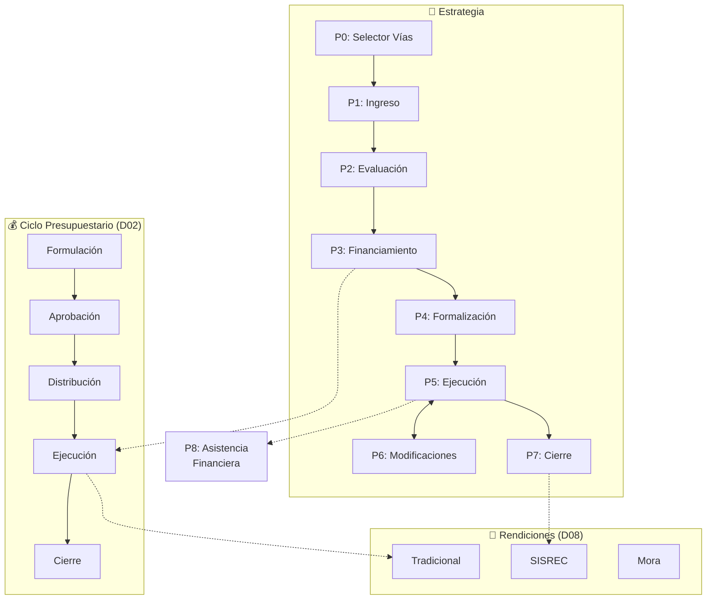

Leyenda: líneas punteadas indican dependencias o flujos de información entre ciclos (no necesariamente una transición de estado).

---

### D03: Gestión de IPR

| Campo      | Valor          |
| ---------- | -------------- |
| ID         | `DOM-IPR`      |
| Criticidad | 🔴 Crítica      |
| Dueño      | Jefatura DIPIR |

#### P0: Selector de Vías de Financiamiento

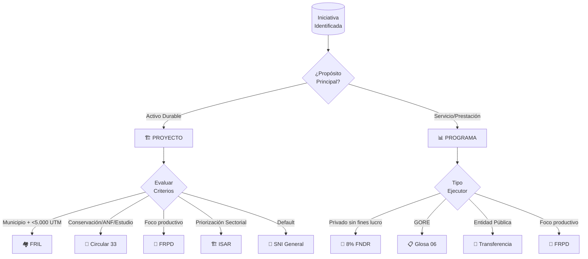

#### P1: Ingreso, Pertinencia y Admisibilidad

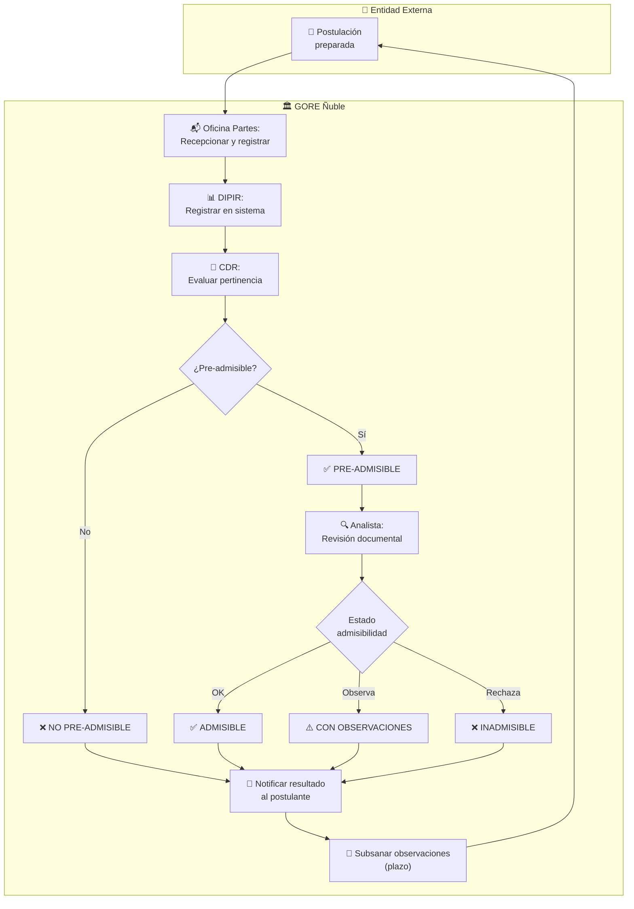

| Rol                   | Responsabilidad                 |
| --------------------- | ------------------------------- |
| Oficina de Partes     | Recepcionar, registrar, derivar |
| Jefatura DIPIR        | Registrar, convocar CDR         |
| CDR                   | Evaluar pertinencia estratégica |
| Analista Preinversión | Revisión documental exhaustiva  |

Estados de Admisibilidad (según `kb_gn_019_gestion_ipr_koda.yml`):

| Estado                        | Descripción                       | Siguiente Paso                      |
| ----------------------------- | --------------------------------- | ----------------------------------- |
| `PRE-ADMISIBLE CDR`           | Pertinencia aprobada por CDR      | Pasa a revisión documental          |
| `NO PRE-ADMISIBLE CDR`        | Pertinencia rechazada por CDR     | Comunicar al postulante, archivar   |
| `ADMISIBLE`                   | Documentación completa y correcta | Asignar a evaluación técnica (P2)   |
| `ADMISIBLE CON OBSERVACIONES` | Documentación subsanable          | Plazo 10 días hábiles para subsanar |
| `INADMISIBLE`                 | Defectos no subsanables           | Comunicar rechazo formal            |

#### P2: Evaluación Técnico-Económica

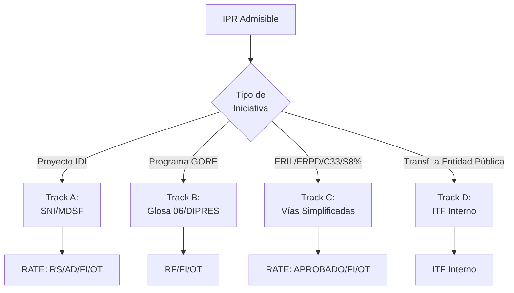

Tipos de RATE (Resolución de Admisibilidad Técnico-Económica):

| Código | Tipo                        | Evaluador      | Aplica a                                              |
| ------ | --------------------------- | -------------- | ----------------------------------------------------- |
| RS     | Recomendación Satisfactoria | MDSF/SNI       | IDI (proyectos de inversión)                          |
| AD     | Admisible                   | MDSF/SNI       | Conservación (cuando aplica)                          |
| RF     | Resultado Favorable         | DIPRES/SES     | PPR Glosa 06 (ejecución directa GORE)                 |
| ITF    | Informe Técnico Favorable   | GORE (interno) | PPR Transferencia a entidad pública                   |
| FI     | Favorable con Indicaciones  | MDSF/DIPRES    | Aprobado con ajustes requeridos previo financiamiento |
| OT     | Objetado Técnicamente       | Cualquiera     | Rechazado, requiere reformulación completa            |

#### P3: Obtención de Financiamiento

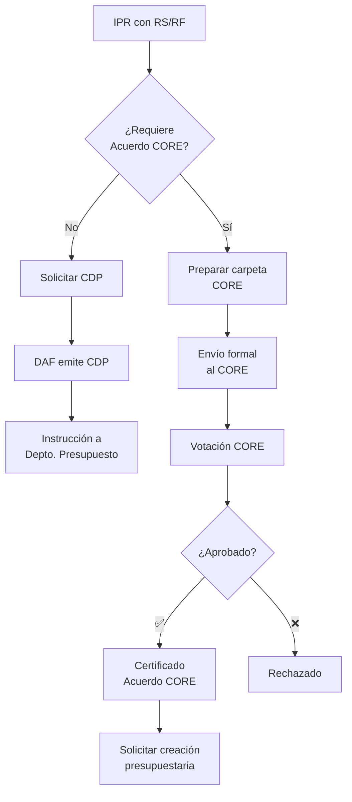

| Condición                                         | ¿Requiere CORE? | Fundamento            |
| ------------------------------------------------- | --------------- | --------------------- |
| Nueva asignación presupuestaria (cualquier monto) | ✅ Sí            | LOC GORE Art. 36      |
| Nuevo programa/proyecto                           | ✅ Sí            | LOC GORE Art. 36      |
| Modificación > 5% costo total                     | ✅ Sí            | Glosa 02 Ley Ppto.    |
| Aumento costo ≤ 5% (mismo objetivo)               | ❌ No            | Resolución Gobernador |
| Uso 3% emergencia (Glosa 14)                      | ❌ No            | Glosa 14, Res. Gob.   |
| Reasignación interna mismo subtítulo              | ❌ No            | Resolución interna    |

#### P4: Formalización

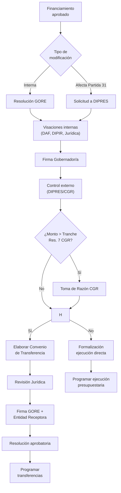

#### P4-bis: Inducción de Ejecutor

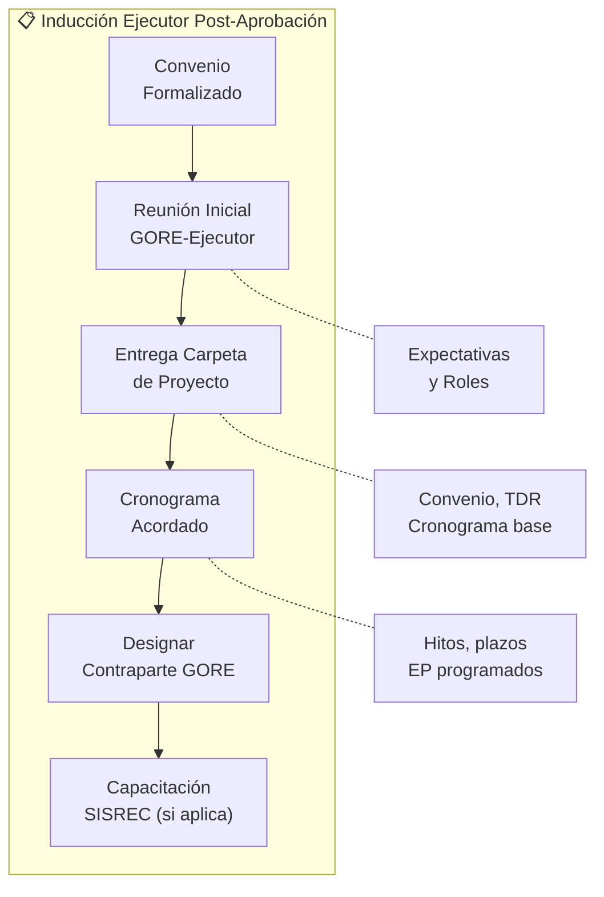

Actores: Jefe DIPIR, Supervisor GORE, Ejecutor  
Frecuencia: Por cada IPR aprobada con convenio

#### P5: Ejecución y Supervisión

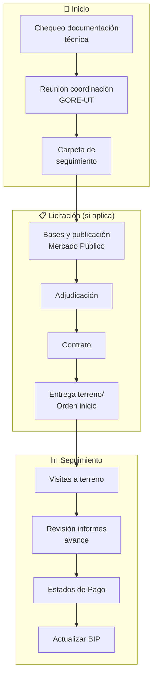

#### P6: Modificaciones en Ejecución

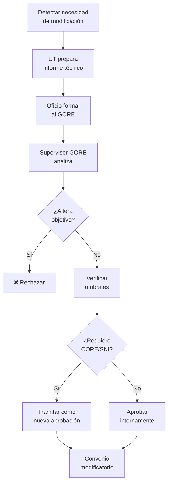

#### P7: Cierre Técnico-Financiero

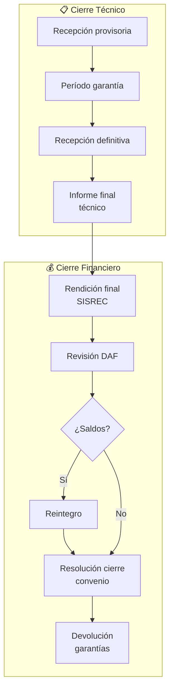

---

### D02: Ciclo Presupuestario (Vista Estratégica)

> **⚠️ Nota de Integración**: Esta sección describe el ciclo **desde la perspectiva de inversión regional**. Los procesos operativos de contabilización, devengos y pagos se ejecutan en [D-BACK (Contabilidad Operativa)](domain_d-back.md#contabilidad-operativa). D-FIN solicita CDP y monitorea ejecución; D-BACK procesa la cadena contable.

| Campo      | Valor                                    |
| ---------- | ---------------------------------------- |
| ID         | `DOM-PRESUPUESTO`                        |
| Criticidad | 🔴 Crítica                                |
| Dueño      | DAF (Funcionamiento) / DIPIR (Inversión) |

#### Mapa del Ciclo

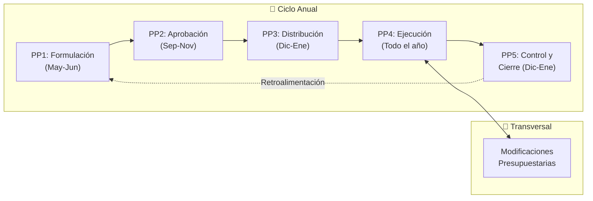

#### Cadena Presupuestaria SIGFE

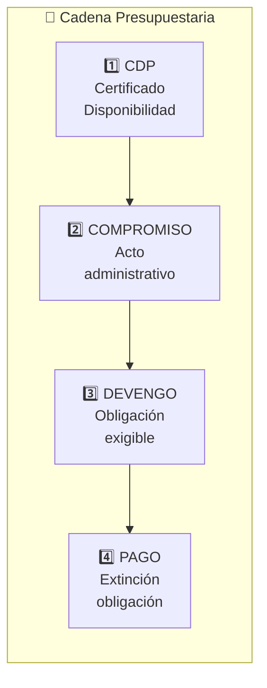

#### Modificaciones sin Acuerdo CORE (Excepciones Glosa 01)

Según la Circular 11 de DIPRES, el Ejecutivo Regional puede realizar las siguientes modificaciones mediante Resolución Exenta sin consulta al Consejo Regional:

1.  **Aumentos por mayores ingresos propios** (excepto Ley de Rentas Regionales).
2.  **Incorporación de Saldos Iniciales de Caja** (arrastre) debidamente validados por DIPRES.
3.  **Transferencias consolidadas** (ingresos provenientes de otros servicios públicos).
4.  **Uso de la Glosa 02 (Inciso 4)** para emergencias declaradas.
5.  **Reasignaciones internas** que no alteren el monto total del Subtítulo ni la asignación presupuestaria.
6.  **Actualizaciones de moneda extranjera** (tipo de cambio) sin afectar el presupuesto total en pesos.

#### Modificaciones Presupuestarias

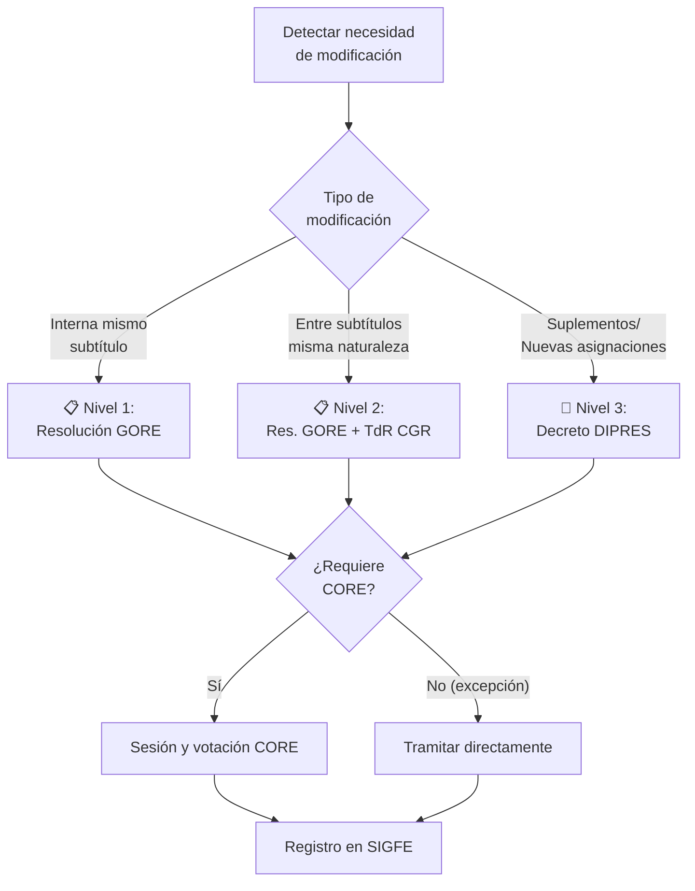

| Subtítulo | Concepto                  | Responsable |
| --------- | ------------------------- | ----------- |
| 21        | Personal                  | DAF         |
| 22        | Bienes y Servicios        | DAF         |
| 24        | Transferencias Corrientes | DAF/DIPIR   |
| 29        | Activos No Financieros    | DAF         |
| 31        | Inversión (Iniciativas)   | DIPIR       |
| 33        | Transferencias de Capital | DIPIR       |

---

### D08: Rendiciones de Cuentas

| Campo      | Valor             |
| ---------- | ----------------- |
| ID         | `DOM-RENDICIONES` |
| Criticidad | 🔴 Crítica         |
| Dueño      | UCR/DAF           |

> - Por Canal: SISREC (obligatorio desde 2023), Tradicional (legado)
> - Por Estado: PENDIENTE → EN_REVISIÓN → APROBADA | OBSERVADA | EN_MORA | RECHAZADA
> - Refrendación: Requiere Certificado de Refrendación Presupuestaria electrónico vía SISREC

#### REND-P1: Rendición vía SISREC (Obligatorio)

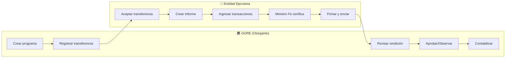

#### REND-P2: Rendición Tradicional (Legado)

> ⚠️ Obsoleto desde 2023. Aplica solo a convenios anteriores a Res. 1858/2023 CGR.

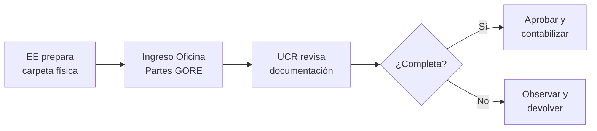

#### REND-P3: Seguimiento y Gestión de Mora

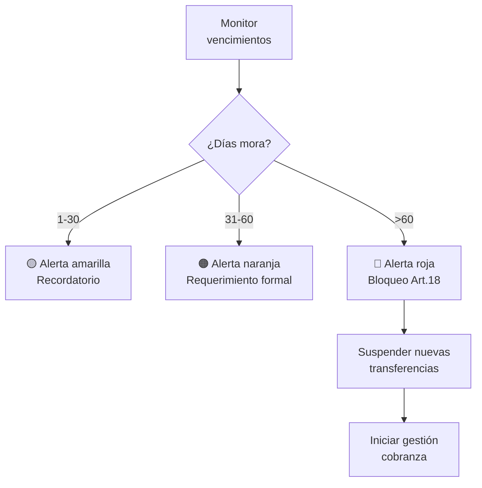

Umbrales de Mora:

| Días  | Nivel      | Acción                                    | Responsable |
| ----- | ---------- | ----------------------------------------- | ----------- |
| 1-30  | 🟡 Amarillo | Recordatorio automático por correo        | Sistema     |
| 31-60 | 🟠 Naranja  | Requerimiento formal con copia a Jefatura | UCR         |
| >60   | 🔴 Rojo     | Bloqueo Art.18, suspensión transferencias | Jefe DAF    |
| >90   | ⚫ Crítico  | Inicio gestión cobranza judicial          | Jurídica    |

#### Marco Normativo Rendiciones

| Norma                    | Alcance                                               |
| ------------------------ | ----------------------------------------------------- |
| Resolución 30/2015 CGR   | Procedimiento general rendiciones                     |
| Resolución 1858/2023 CGR | Uso obligatorio SISREC                                |
| Res. 30/2015 Art. 18     | ⚠️ Prohibe nuevos fondos si hay rendiciones pendientes |
| Res. 30/2015 Art. 31     | Obligación de restituir fondos no rendidos            |
| Res. 30/2015 Art. 35     | Plazo máximo 60 días para rendir desde última cuota   |

---

### P8: Asistencia Financiera

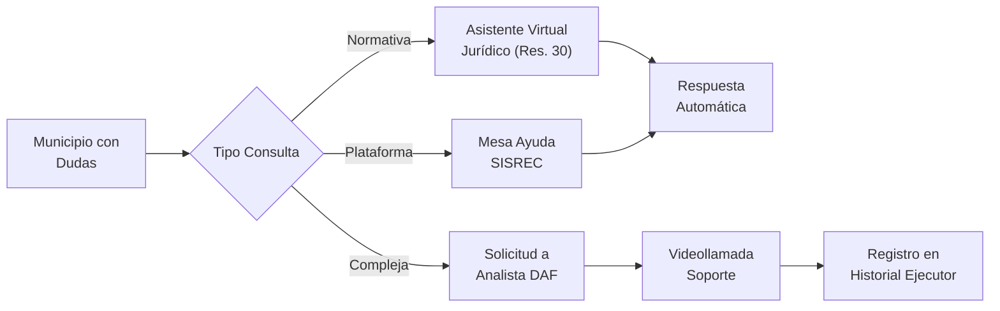

---

## 📝 Historias de Usuario por Módulo

### Catálogo por Proceso

#### Proceso P1: Ingreso y Admisibilidad

| ID             | Título                                         | Prioridad | Actor              |
| -------------- | ---------------------------------------------- | --------- | ------------------ |
| US-FIN-IPR-001 | Ver convocatorias de financiamiento unificadas | Crítica   | Formulador Externo |
| US-FIN-IPR-002 | Consultar árbol de decisión de financiamiento  | Crítica   | Formulador Externo |
| US-FIN-IPR-003 | Ver documentos obligatorios por mecanismo      | Crítica   | Formulador Externo |
| US-FIN-IPR-004 | Cargar postulación IPR digitalizada            | Crítica   | Formulador Externo |
| US-FIN-IPR-019 | Evaluar admisibilidad formal                   | Crítica   | Analista DIPIR     |
| US-FIN-GOB-001 | Sesión de Pertinencia CDR                      | Crítica   | CDR                |
| US-FIN-GOB-004 | Recepcionar Oficio Ingreso IPR                 | Crítica   | Oficina de Partes  |

#### Proceso P2: Evaluación Técnico-Económica

| ID              | Título                                  | Prioridad | Actor          |
| --------------- | --------------------------------------- | --------- | -------------- |
| US-FIN-IPR-020  | Evaluar Track A (SNI)                   | Crítica   | Analista DIPIR |
| US-FIN-IPR-021  | Evaluar Track B (Glosa 06) - Perfil     | Crítica   | Analista DIPIR |
| US-FIN-IPR-022  | Evaluar Track B (Glosa 06) - Diseño MML | Crítica   | Analista DIPIR |
| US-FIN-IPR-023  | Evaluar Track C (Simplificado)          | Alta      | Analista DIPIR |
| US-FIN-IPR-025  | Registrar resultado evaluación externa  | Crítica   | Analista DIPIR |
| US-FIN-FRIL-003 | Emitir RATE FRIL                        | Crítica   | Analista FRIL  |
| US-FIN-FRPD-001 | Filtro estratégico FRPD                 | Crítica   | Comité FRPD    |

#### Proceso P3: Financiamiento

| ID              | Título                                 | Prioridad | Actor           |
| --------------- | -------------------------------------- | --------- | --------------- |
| US-FIN-PPTO-001 | Emitir CDP                             | Crítica   | Analista DAF    |
| US-FIN-PPTO-002 | Tramitar Resolución Identificatoria    | Crítica   | Analista DAF    |
| US-FIN-PPTO-006 | Emitir CDP validando saldo             | Crítica   | Profesional DAF |
| US-FIN-APR-001  | Presentar distribución inicial al CORE | Crítica   | Gobernador      |
| US-FIN-GOB-002  | Priorización Estratégica CDR           | Crítica   | CDR             |

#### Proceso P5: Ejecución y Supervisión

| ID              | Título                            | Prioridad | Actor             |
| --------------- | --------------------------------- | --------- | ----------------- |
| US-FIN-IPR-011  | Reportar avance mensual           | Crítica   | Entidad Ejecutora |
| US-FIN-IPR-016  | Registrar adjudicación y contrato | Alta      | Entidad Ejecutora |
| US-FIN-IPR-017  | Subir acta de inicio de obras     | Crítica   | Entidad Ejecutora |
| US-FIN-GEST-001 | Panel cartera ejecución           | Crítica   | Analista Gestión  |
| US-FIN-GEST-004 | Validar estado de pago            | Crítica   | Analista Gestión  |
| US-FIN-GEST-008 | Semáforos de ejecución            | Crítica   | Analista Gestión  |

#### Proceso P7: Cierre y Rendiciones

| ID              | Título                                   | Prioridad | Actor                   |
| --------------- | ---------------------------------------- | --------- | ----------------------- |
| US-FIN-IPR-012  | Ingresar rendición SISREC                | Crítica   | Entidad Ejecutora       |
| US-FIN-IPR-015  | Reintegrar saldos no ejecutados          | Crítica   | Entidad Ejecutora       |
| US-FIN-IPR-018  | Solicitar recepción de obras             | Crítica   | Entidad Ejecutora       |
| US-FIN-REND-001 | Crear proyectos SISREC                   | Crítica   | Encargado Rendiciones   |
| US-FIN-REND-002 | Revisar rendiciones                      | Crítica   | Encargado Rendiciones   |
| US-FIN-REND-005 | Verificar elegibilidad ejecutor (Art.18) | Crítica   | Analista Transferencias |
| US-FIN-PPTO-015 | Monitor rendiciones vencidas             | Crítica   | Jefatura DAF            |
| US-FIN-REND-008 | Alertas bloqueo Art.18                   | Crítica   | UCR                     |

*Ver catálogo completo en [kb_goreos_us_d-fin.yml](../user-stories/kb_goreos_us_d-fin.yml)*

> Nota: La Matriz de Trazabilidad puede referenciar IDs de US que no están listadas en este resumen Markdown; el SSOT del catálogo es el archivo YAML enlazado.

---

## 🔗 Matriz de Trazabilidad

| Proceso BPMN       | Subproceso                 | Historias de Usuario Relacionadas                                 |
| ------------------ | -------------------------- | ----------------------------------------------------------------- |
| P0: Selector Vías  | Decisión estratégica       | US-FIN-IPR-001, US-FIN-IPR-002                                    |
| P1: Ingreso        | Recepción                  | US-FIN-IPR-004, US-FIN-GOB-004                                    |
| P1: Ingreso        | Pertinencia CDR            | US-FIN-GOB-001, US-FIN-GOB-002                                    |
| P1: Ingreso        | Admisibilidad              | US-FIN-IPR-003, US-FIN-IPR-019                                    |
| P2: Evaluación     | Track A SNI                | US-FIN-IPR-020, US-FIN-IPR-024, US-FIN-IPR-025                    |
| P2: Evaluación     | Track B Glosa 06           | US-FIN-IPR-021, US-FIN-IPR-022, US-FIN-PPR-001, US-FIN-PPR-002    |
| P2: Evaluación     | Track C Simplificado       | US-FIN-IPR-023, US-FIN-FRIL-001, US-FIN-FRIL-002, US-FIN-FRIL-003 |
| P3: Financiamiento | CDP                        | US-FIN-PPTO-001, US-FIN-PPTO-006                                  |
| P3: Financiamiento | Acuerdo CORE               | US-FIN-APR-001, US-FIN-IPR-030, US-FIN-IPR-031                    |
| P4: Formalización  | Convenio                   | US-FIN-PPTO-003, US-FIN-PPTO-004, US-FIN-CONV-001-005             |
| P5: Ejecución      | Seguimiento                | US-FIN-IPR-011, US-FIN-GEST-001, US-FIN-GEST-008                  |
| P5: Ejecución      | Estados de Pago            | US-FIN-GEST-004, US-FIN-IPR-016                                   |
| P6: Modificaciones | Solicitud                  | US-FIN-IPR-014, US-FIN-GEST-002, US-FIN-GEST-003                  |
| P7: Cierre         | Rendición SISREC           | US-FIN-IPR-012, US-FIN-REND-001-008, US-FIN-SISREC-001-003        |
| P7: Cierre         | Reintegro                  | US-FIN-IPR-015                                                    |
| P7: Cierre         | Garantías                  | US-FIN-IPR-026                                                    |
| Presupuesto        | Formulación                | US-FIN-FORM-001-005                                               |
| Presupuesto        | Ejecución                  | US-FIN-PPTO-005-013                                               |
| Presupuesto        | Modificaciones             | US-FIN-PPTO-010, US-FIN-MOD-002                                   |
| Presupuesto        | Cierre                     | US-FIN-PPTO-012, US-FIN-PPTO-019                                  |
| Acompañamiento     | Soporte                    | US-FIN-SUP-001 a 003                                              |
| Ejecutores         | Calificación y Seguimiento | US-FIN-EJEC-001 a 004                                             |
| P8: Asistencia     | Mesa de Ayuda              | US-FIN-ASIST-001 a 004                                            |
| M9: Portafolio     | Estrategia                 | US-FIN-PORT-001 a 006, US-FIN-EXPOST-001 a 003                    |
| M10: Gestión 360°  | Ciclo y Relación           | US-FIN-360-001 a 009                                              |

---

## 📊 Matriz de Concordancia (Módulo ↔ Proceso ↔ US ↔ Entidades)

| Módulo                         | Proceso BPMN                | Historias de Usuario                     | Entidades de Datos                          |
| ------------------------------ | --------------------------- | ---------------------------------------- | ------------------------------------------- |
| **M1: Captación**              | P0: Selector de Vías        | US-FIN-IPR-001, 002, US-FIN-360-001, 002 | `Oportunidad`, `FaseEmbudo`, `Mecanismo`    |
| **M2: Capital Base**           | PP1: Formulación (D02)      | US-FIN-FORM-001 a 005                    | `AsignacionPresupuestaria`                  |
| **M3: Portafolio IPR**         | P1: Ingreso, P2: Evaluación | US-FIN-IPR-003 a 025, US-FIN-GOB-001     | `IPR`, `EvaluacionIPR`, `ActorIPR`          |
| **M4: Selector Mecanismos**    | P0: Selector de Vías        | US-FIN-IPR-001, 002                      | `Mecanismo`                                 |
| **M5: Presupuesto**            | PP1-PP5 (D02), P3           | US-FIN-PPTO-001 a 019                    | `CDP`, `Compromiso`, `Devengo`              |
| **M6: Rendiciones**            | REND-P1, P2, P3 (D08)       | US-FIN-REND-001 a 008                    | `Transferencia`, `Rendicion`, `Observacion` |
| **M7: Gestión Ejecutores**     | P4-bis: Inducción           | US-FIN-EJEC-001 a 004                    | `CalificacionEjecutor`, `RelacionEjecutor`  |
| **M8: Mesa Ayuda**             | P8: Asistencia Financiera   | US-FIN-ASIST-001 a 004                   | `InteraccionEjecutor`                       |
| **M9: Portafolio Estratégico** | (Transversal)               | US-FIN-PORT-001 a 006, EXPOST-001 a 003  | `TeoriaCambio`, `PuntajeImpacto`            |
| **M10: Alertas 360°**          | P1-P7 (Alertas)             | US-FIN-360-003 a 009                     | `SaludIPR`, `AlertaCiclo`                   |

### ✅ Verificación de Cobertura

| Componente | Total | Con Proceso | Con US | Con Entidad |
| ---------- | ----- | ----------- | ------ | ----------- |
| Módulos    | 10    | 10 ✓        | 10 ✓   | 10 ✓        |

> **Resultado**: Concordancia completa. Todo módulo tiene proceso, historias de usuario y entidades asociadas.

### US Módulo Gestión de Ejecutores (M7)

| ID              | Título                                                                                      | Prioridad | Actor          |
| --------------- | ------------------------------------------------------------------------------------------- | --------- | -------------- |
| US-FIN-EJEC-001 | Como Analista DIPIR quiero actualizar la calificación de un ejecutor basado en su historial | Alta      | Analista DIPIR |
| US-FIN-EJEC-002 | Como Jefe DIPIR quiero ver el ranking de ejecutores ordenados por nivel                     | Alta      | Jefe DIPIR     |
| US-FIN-EJEC-003 | Como Sistema quiero alertar cuando un ejecutor baje a nivel C o D                           | Alta      | Sistema        |
| US-FIN-EJEC-004 | Como Analista DAF quiero consultar el historial de rendiciones de un ejecutor               | Alta      | Analista DAF   |

### US Módulo Asistencia Financiera (P8)

| ID               | Título                                                                                          | Prioridad | Actor             |
| ---------------- | ----------------------------------------------------------------------------------------------- | --------- | ----------------- |
| US-FIN-ASIST-001 | Como Municipio quiero acceder al simulador de rendiciones para prevenir errores                 | Alta      | Entidad Ejecutora |
| US-FIN-ASIST-002 | Como Municipio quiero agendar sesión de capacitación en normativa financiera                    | Media     | Entidad Ejecutora |
| US-FIN-ASIST-003 | Como Analista DAF quiero registrar consultas frecuentes para alimentar las Preguntas Frecuentes | Media     | Analista DAF      |
| US-FIN-ASIST-004 | Como Sistema quiero medir tiempo de respuesta promedio de la mesa de ayuda                      | Media     | Sistema           |

### US Portafolio Estratégico (M9 - Banca de Inversión)

| ID                | Título                                                                                           | Prioridad | Actor          |
| ----------------- | ------------------------------------------------------------------------------------------------ | --------- | -------------- |
| US-FIN-PORT-001   | Como Gobernador quiero ver el Panel de Portafolio con distribución por eje ERD                   | Crítica   | Gobernador     |
| US-FIN-PORT-002   | Como DIPIR quiero registrar la Teoría de Cambio de una IPR estratégica                           | Alta      | Analista DIPIR |
| US-FIN-PORT-003   | Como Sistema quiero calcular el PuntajeImpacto de cada IPR basado en sus indicadores             | Crítica   | Sistema        |
| US-FIN-PORT-004   | Como Jefe DIPIR quiero ver alertas de concentración de inversiones por eje o territorio          | Alta      | Jefe DIPIR     |
| US-FIN-PORT-005   | Como DIPLADE quiero marcar una IPR como Proyecto Emblemático (Ñuble 250)                         | Alta      | DIPLADE        |
| US-FIN-PORT-006   | Como Analista quiero simular escenarios de reasignación y ver el impacto en el portafolio        | Media     | Analista DIPIR |
| US-FIN-EXPOST-001 | Como Jefe DIPIR quiero seleccionar proyectos cerrados para evaluación ex-post de impacto         | Alta      | Jefe DIPIR     |
| US-FIN-EXPOST-002 | Como Observatorio quiero medir indicadores de impacto 1-3 años después del cierre                | Alta      | Observatorio   |
| US-FIN-EXPOST-003 | Como Sistema quiero comparar el PuntajeImpacto proyectado vs real para aprendizaje institucional | Alta      | Sistema        |

### US Gestión 360° de IPR

| ID             | Título                                                                                       | Prioridad | Actor          |
| -------------- | -------------------------------------------------------------------------------------------- | --------- | -------------- |
| US-FIN-360-001 | Como Analista DIPIR quiero ver el pipeline de oportunidades por fase del embudo              | Crítica   | Analista DIPIR |
| US-FIN-360-002 | Como Sistema quiero mover automáticamente oportunidades entre fases según criterios          | Alta      | Sistema        |
| US-FIN-360-003 | Como Supervisor quiero programar reunión de inducción con ejecutor post-aprobación           | Crítica   | Supervisor     |
| US-FIN-360-004 | Como Ejecutor quiero ver la lista de verificación de documentos requeridos para mi mecanismo | Crítica   | Ejecutor       |
| US-FIN-360-005 | Como Sistema quiero calcular la Salud (SaludIPR) de cada IPR consolidando sus indicadores    | Crítica   | Sistema        |
| US-FIN-360-006 | Como Analista quiero registrar una interacción con ejecutor (consulta, capacitación, alerta) | Alta      | Analista DIPIR |
| US-FIN-360-007 | Como Jefe DIPIR quiero ver el estado de la relación con cada ejecutor activo                 | Alta      | Jefe DIPIR     |
| US-FIN-360-008 | Como Sistema quiero emitir alertas diferenciadas según la fase del ciclo de la IPR           | Crítica   | Sistema        |
| US-FIN-360-009 | Como Analista quiero ver los próximos pasos sugeridos para cada IPR según su fase            | Alta      | Analista DIPIR |

---

## Entidades de Datos

### Portafolio y Ciclo de Vida

| Entidad                | Atributos Clave                                                                          | Relaciones                                        |
| ---------------------- | ---------------------------------------------------------------------------------------- | ------------------------------------------------- |
| `IPR`                  | id, codigo_bip, codigo_sisrec_prog, nombre, naturaleza, mecanismo_id, estado             | → Oportunidad, Mecanismo, ObjetivoERD, Convenio[] |
| `Proyecto_Seguridad`   | hereda IPR + tipo_prevencion, validacion_spd, convenio_municipal                         | → IPR, PoliticaRegionalSeguridad                  |
| `ActorIPR`             | id, ipr_id, actor_id, rol, fase, activo                                                  | → IPR, Actor                                      |
| `CalificacionEjecutor` | id, actor_id, puntaje_total, nivel (A/B/C/D)                                             | → Actor                                           |
| `EvaluacionIPR`        | id, ipr_id, tipo, resultado, observaciones                                               | → IPR                                             |
| `Mecanismo`            | id, codigo, nombre, tope_utm, tipo_evaluacion, ejecutor_tipo, requiere_rs, guia_koda_ref | → IPR[]                                           |
| `Oportunidad`          | id, fuente, descripcion, estado_embudo, fecha_deteccion, ipr_vinculada_id                | → IPR (una vez convertida)                        |

### Gestión 360° de IPR

| Entidad               | Atributos Clave                                                                                                  | Relaciones                     |
| --------------------- | ---------------------------------------------------------------------------------------------------------------- | ------------------------------ |
| `FaseEmbudo`          | id, nombre (DETECTADA/CALIFICADA/PRIORIZADA/EN_CULTIVO/CONVERTIDA), orden, criterios_avance                      | → Oportunidad[]                |
| `RelacionEjecutor`    | id, actor_id, estado_relacion (ACTIVO/SUSPENDIDO/EGRESADO), nivel_compromiso, fecha_ultimo_contacto              | → Actor, InteraccionEjecutor[] |
| `InteraccionEjecutor` | id, relacion_id, tipo (CONSULTA/CAPACITACION/ALERTA/OBSERVACION), fecha, canal, resumen, resultado               | → RelacionEjecutor             |
| `SaludIPR`            | id, ipr_id, puntaje_avance, puntaje_rendicion, puntaje_riesgo, puntaje_observaciones, salud_total, fecha_calculo | → IPR                          |
| `AlertaCiclo`         | id, ipr_id, fase_ciclo, tipo_alerta, fecha_emision, fecha_vencimiento, estado, destinatario_id                   | → IPR, Funcionario             |

### Portafolio Estratégico (Banca de Inversión)

| Entidad              | Atributos Clave                                                                                        | Relaciones               |
| -------------------- | ------------------------------------------------------------------------------------------------------ | ------------------------ |
| `TeoriaCambio`       | id, ipr_id, hipotesis, supuestos_clave[], riesgos_logicos[], fecha_registro                            | → IPR                    |
| `PuntajeImpacto`     | id, ipr_id, puntaje_social, puntaje_economico, puntaje_ambiental, puntaje_institucional, puntaje_total | → IPR                    |
| `EvaluacionImpacto`  | id, ipr_id, tipo (EX_ANTE/EX_POST), fecha, indicadores_resultado[], puntaje_atribucion                 | → IPR, TeoriaCambio      |
| `RetornoTerritorial` | id, ipr_id, indicador, linea_base, meta, valor_real, horizonte_anios, fecha_medicion                   | → IPR, EvaluacionImpacto |

### Presupuesto

| Entidad                      | Atributos Clave                                               | Relaciones                 |
| ---------------------------- | ------------------------------------------------------------- | -------------------------- |
| `AsignacionPresupuestaria`   | id, subtitulo, item, asignacion, monto_inicial, monto_vigente | → Programa                 |
| `CDP`                        | id, asignacion_id, monto, fecha, estado                       | → AsignacionPresupuestaria |
| `Compromiso`                 | id, cdp_id, acto_id, monto, fecha                             | → CDP, ActoAdministrativo  |
| `Devengo`                    | id, compromiso_id, monto, fecha                               | → Compromiso               |
| `ModificacionPresupuestaria` | id, tipo, nivel, monto, justificacion, acuerdo_core           | → AsignacionPresupuestaria |

### Rendiciones

| Entidad            | Atributos Clave                                                 | Relaciones              |
| ------------------ | --------------------------------------------------------------- | ----------------------- |
| `Transferencia`    | id, convenio_id, monto, fecha_giro, estado                      | → Convenio, Rendicion[] |
| `Rendicion`        | id, transferencia_id, estado, monto_rendido, fecha_presentacion | → Transferencia         |
| `InformeRendicion` | id, rendicion_id, tipo, estado_sisrec, firma_fea                | → Rendicion             |
| `Observacion`      | id, rendicion_id, descripcion, estado, fecha_respuesta          | → Rendicion             |

---

## Sistemas Involucrados

| Sistema              | Fases de Uso                | Integración               |
| -------------------- | --------------------------- | ------------------------- |
| `SYS-BIP-SNI`        | P1, P2, P5, P7              | API consulta RS/RATE      |
| `SYS-SIGFE`          | P3, P4, P5, P7, Presupuesto | DS12 - PISEE              |
| `SYS-SISREC`         | P7, Rendiciones             | API CGR                   |
| `SYS-MERCADOPUBLICO` | P5                          | Licitaciones, OC          |
| `SYS-GESDOC`         | P1, P2                      | Expediente digital        |
| `SYS-SES`            | P2 (Track B)                | Evaluación PPR DIPRES     |
| `SYS-DIPRES-PISEE`   | Presupuesto                 | Modificaciones Partida 31 |
| `SYS-CGR-TOMA-RAZON` | P4                          | Control externo decretos  |

---

## KPIs del Dominio

| Indicador                       | Fórmula                                              | Meta     | Responsable |
| ------------------------------- | ---------------------------------------------------- | -------- | ----------- |
| Tasa de conversión IPR          | IPR financiadas / IPR ingresadas                     | ≥25%     | DIPIR       |
| Tiempo ciclo admisibilidad      | Días promedio desde ingreso hasta RATE               | ≤45 días | DIPIR       |
| Ejecución presupuestaria        | Devengado / Presupuesto vigente                      | ≥90%     | DAF         |
| Mora rendiciones                | Rendiciones >60 días / Total activas                 | ≤5%      | UCR         |
| Calificación ejecutores A/B     | Ejecutores nivel A+B / Total activos                 | ≥70%     | DIPIR       |
| Modificaciones IPR              | IPR con modificación / Total en ejecución            | ≤20%     | DIPIR       |
| Cumplimiento ARI                | IPR ejecutadas / IPR priorizadas ARI                 | ≥80%     | DIPIR       |
| Reintegros pendientes           | Monto reintegros pendientes / Total transferido      | ≤2%      | DAF         |
| % Rendiciones vía SISREC        | Rendiciones SISREC / Total rendiciones               | ≥95%     | UCR         |
| PuntajeImpacto Promedio Cartera | Promedio PuntajeImpacto de IPR en ejecución          | ≥70      | DIPIR       |
| % Diversificación por Eje       | Ningún eje concentra >35% del presupuesto            | ≤35%     | DIPIR       |
| Proyectos Emblemáticos %        | IPR emblemáticas en ejecución según plan             | ≥80%     | DIPLADE     |
| Tasa Conversión Oportunidades   | Oportunidades convertidas / Oportunidades detectadas | ≥15%     | DIPIR       |
| Salud Promedio Cartera          | Promedio SaludIPR de IPR activas                     | ≥75      | DIPIR       |
| % Inducciones Completadas       | Ejecutores con inducción formal / Total nuevos       | 100%     | DIPIR       |

---

## Normativa Aplicable

| Norma                      | Alcance                                   |
| -------------------------- | ----------------------------------------- |
| LOC 19.175 Art. 16, 24, 36 | Competencias GORE, CORE, presupuesto      |
| Ley 21.796 (Ppto. 2026)    | Marco legal ejercicio presupuestario      |
| Glosa 01 Partida 31        | Funcionamiento regional                   |
| Glosa 02 Partida 31        | Inversión regional (distribución fondos)  |
| Glosa 06 Partida 31        | PPR ejecución directa GORE                |
| Glosa 07 Partida 31        | Subvenciones 8%                           |
| Glosa 12 Partida 31        | FRIL                                      |
| Glosa 13 Partida 31        | FRPD (Royalty)                            |
| Glosa 14 Partida 31        | 3% emergencia                             |
| Instructivo SUBDERE FRIL   | Guía operativa FRIL                       |
| Circular 33 MDSF           | Conservación, ANF, estudios               |
| Res. 30/2015 CGR           | Procedimiento rendiciones                 |
| Res. 1858/2023 CGR         | SISREC obligatorio                        |
| DL 1.263/1975 Art. 19 bis  | Administración financiera, transferencias |

---

## Referencias Cruzadas

| Dominio       | Relación                                               | Entidades Compartidas        |
| ------------- | ------------------------------------------------------ | ---------------------------- |
| D-PLAN        | IPR vinculadas a objetivos ERD                         | ObjetivoERD, Brecha          |
| D-EJEC        | EP validado técnicamente → D-BACK para pago            | Convenio, Hito, EstadoPago   |
| D-GOB         | Actor (entidad base de ejecutores), CIES/SITIA         | Actor, Proyecto_Seguridad    |
| D-NORM        | Convenio SSOT, Actos aprobatorios                      | ActoAdministrativo           |
| D-TERR        | Localización geoespacial de IPR                        | Ubicacion, Territorio        |
| D-BACK        | Cadena contable CDP→Devengo→Pago, % Ejecución como KPI | CDP, Compromiso, Devengo     |
| D-PLAN (N250) | Proyectos Emblemáticos Ñuble 250 como IPR estratégicas | ObjetivoERD, ProyEmblematico |
| D-GESTION     | Indicadores de ejecución y mora alimentan H_gore       | KPI, IndicadorGestion        |
| FÉNIX         | IPR Problemáticas activan intervención Nivel I-III     | Alerta, Intervencion         |

---

*Documento parte de GORE_OS Blueprint Integral v5.3*  
*Última actualización: 2025-12-18*
