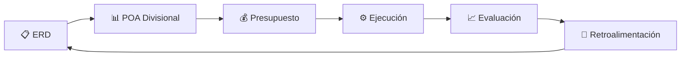
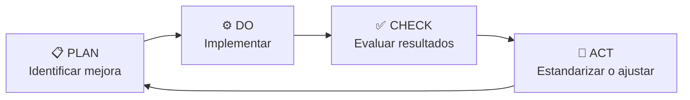
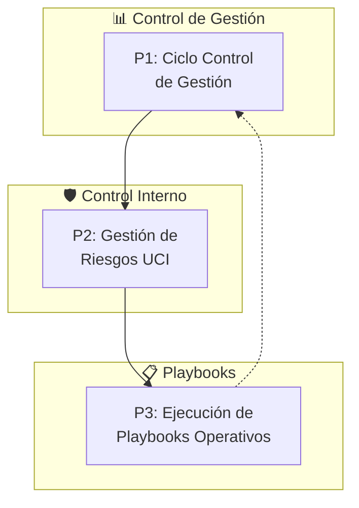
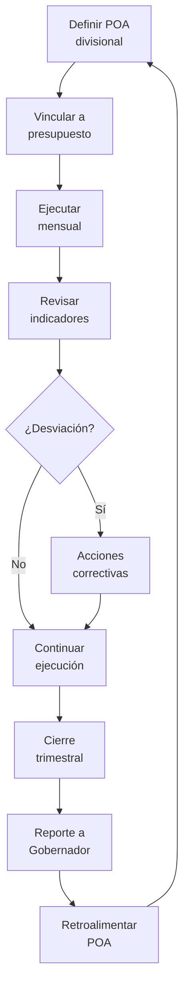
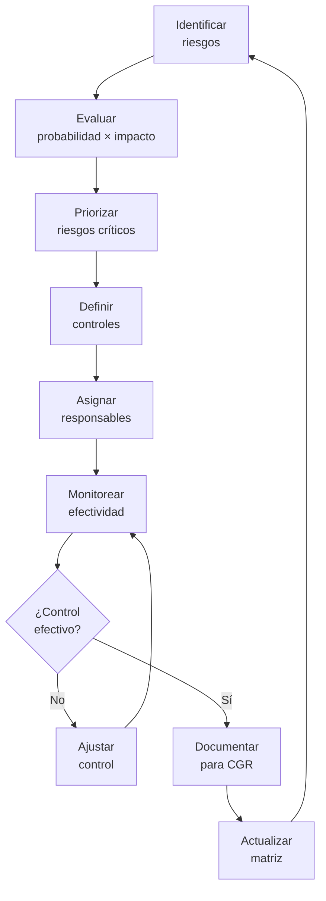
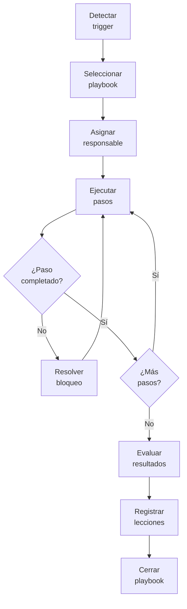
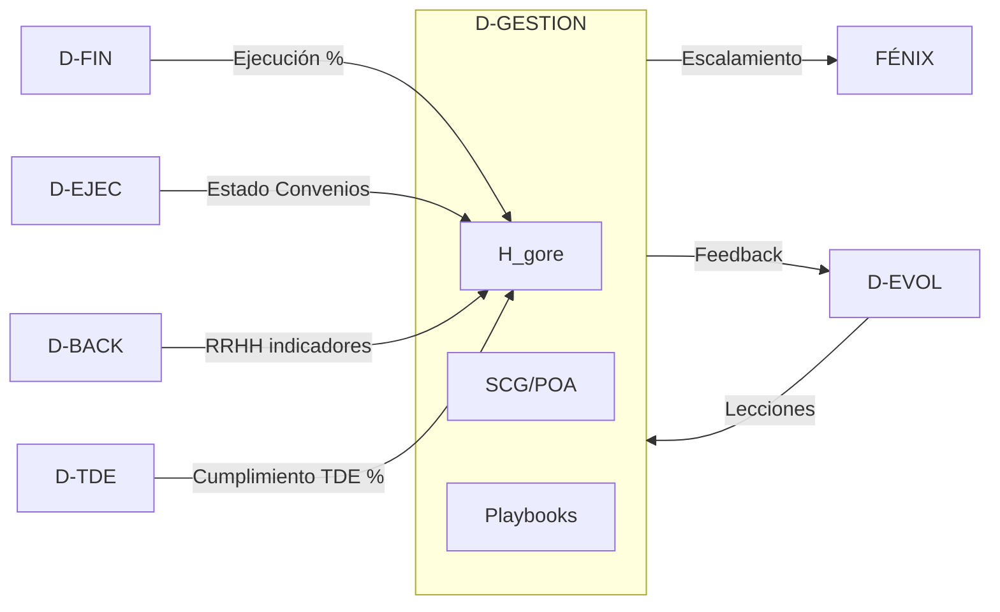

# D-GESTION: Dominio de Gestión Institucional

> Parte de: [GORE_OS Vision General](../vision_general.md)  
> Capa: Operativa  
> Función GORE: GESTIONAR  
> Responsable: Administrador Regional  


---

## Glosario D-GESTION

| Término            | Definición                                                                                                           |
| ------------------ | -------------------------------------------------------------------------------------------------------------------- |
| H_gore             | Puntaje de Salud Táctico (Tactical Health Score). Salud operativa diaria/semanal del GORE.                           |
| H_org              | Puntaje de Salud Organizacional (Organizational Health Score). Índice de madurez sistémica estratégica (ver D-EVOL). |
| SCG                | Sistema de Control de Gestión. Conecta estrategia (ERD), presupuesto y resultados operativos                         |
| OKRs               | Objectives & Key Results. Metodología de gestión por objetivos implementada vía POA                                  |
| UCI                | Unidad de Control Interno. Gestión de riesgos, controles y contraparte técnica CGR                                   |
| POA                | Plan Operativo Anual. Desagregación de objetivos ERD en metas divisionales                                           |
| PDCA               | Plan-Do-Check-Act. Ciclo de mejora continua institucional                                                            |
| Playbook Operativo | Procedimiento estructurado para tareas recurrentes, crisis o onboarding                                              |
| DPR                | Delegado Presidencial Regional. Representante del gobierno central en la región                                      |
| COSOC              | Consejo de la Sociedad Civil Regional. Órgano consultivo de participación                                            |
| CTCI               | Comité Regional de Ciencia, Tecnología, Conocimiento e Innovación para el Desarrollo                                 |
| LDP                | Ley de Protección de Datos Personales (Ley 21.719)                                                                   |
| NPS                | Net Promoter Score. Indicador de satisfacción y lealtad de usuarios/funcionarios                                     |
| RACI               | Responsible, Accountable, Consulted, Informed. Matriz de asignación de responsabilidades                             |
| SMART              | Specific, Measurable, Achievable, Relevant, Time-bound. Criterios para indicadores                                   |
| IPR                | Inversión Pública Regional. Proyectos de inversión financiados por el GORE                                           |

> Fuente canónica: [kb_gn_035_estrategia_gestion_koda.yml](file:///Users/felixsanhueza/Developer/gorenuble/knowledge/domains/gn/gestion/kb_gn_035_estrategia_gestion_koda.yml)

---

## Roles y Actores D-GESTION

| Rol                       | Responsabilidad en D-GESTION                              | Módulos Principales            |
| ------------------------- | --------------------------------------------------------- | ------------------------------ |
| Administrador Regional    | Responsable del dominio, decisiones H_gore, lidera comité | SCG, H_gore, Playbooks, Coord. |
| Jefe UCI                  | Gestión de riesgos y controles, reporte CGR               | UCI                            |
| Jefe DAF                  | Indicadores de personas, recursos administrativos         | Personas                       |
| Encargado Control Gestión | Operación SCG, ciclos PDCA, ejecución playbooks           | SCG, Mejora, Playbooks         |
| Jefe de División          | Define POA divisional, monitorea indicadores propios      | SCG                            |
| Encargado OIRS            | Atención ciudadana y seguimiento de plazos legales        | Procesos                       |
| Encargado RRHH            | Gestión de inducción y clima organizacional               | Personas                       |
| Funcionario GORE          | Registra mejoras, gestiona expedientes digitales          | Mejora, Procesos               |

---

## Propósito

Gestionar el desempeño institucional diario, la operación transversal y la mejora continua del GORE, asegurando eficiencia operativa y coordinación interdivisional bajo el liderazgo del Administrador Regional.

> D-GESTION vs D-EVOL: D-GESTION es la gestión operativa diaria (Administrador Regional), mientras D-EVOL es la evolución estratégica (Encargado TDE). H_gore mide salud operativa; H_org mide madurez sistémica.

---

## Módulos

### 1. Sistema de Control de Gestión (SCG)

> Fuente: kb_gn_035_estrategia_gestion_koda.yml → Sistemas_Control_Gestion_y_Desempeno

Vinculación Estrategia-Presupuesto:



Indicadores de Desempeño (SMART):

| Tipo       | Descripción            | Ejemplo                     |
| ---------- | ---------------------- | --------------------------- |
| Eficacia   | Logro de objetivos     | % metas POA cumplidas       |
| Eficiencia | Recursos vs resultados | Costo por IPR ejecutada     |
| Calidad    | Satisfacción y tiempos | NPS interno, días respuesta |
| Impacto    | Outcomes regionales    | Brechas ERD cerradas        |

Funcionalidades:

- Definición de POA alineado a ERD
- Panel de indicadores por división
- Reportes mensuales automatizados
- Convenios de desempeño divisionales

### 2. H_gore (Salud Institucional)

> Diferencia con H_org: H_gore es operativo (diario/semanal); H_org es estratégico (madurez sistémica).

Tabla Comparativa H_gore vs H_org:

| Aspecto     | H_gore                 | H_org                    |
| ----------- | ---------------------- | ------------------------ |
| Alcance     | Operativo diario       | Madurez sistémica        |
| Frecuencia  | Diario/Semanal         | Trimestral               |
| Dominio     | D-GESTION              | D-EVOL                   |
| Responsable | Administrador Regional | Encargado TDE            |
| Escala      | 0-100 (zona verde ≥80) | Niveles L0-L5            |
| Trigger     | Degradación → FÉNIX    | Gaps → Pilotos evolución |

Dimensiones H_gore:

| Dimensión                | Indicadores                          | Peso |
| ------------------------ | ------------------------------------ | ---- |
| Ejecución Presupuestaria | % ejecución, desviación vs plan      | 20%  |
| Cartera de IPR           | % avance, proyectos en riesgo        | 20%  |
| Responsabilidades        | % mora, días promedio de revisión    | 20%  |
| Cumplimiento Normativo   | Hallazgos UCI/CGR, sumarios en plazo | 15%  |
| Convenios                | % convenios vigentes, vencimientos   | 10%  |
| Cumplimiento TDE         | % normas cumplidas (Piso Basal)      | 10%  |
| Satisfacción             | NPS Interno, tiempos de respuesta    | 5%   |

> **Nota:** El cumplimiento TDE indica higiene normativa. Un bajo puntaje aquí no invalida el alto desempeño en dimensiones operativas (Presupuesto/IPR), reflejando el principio de "Evolución Paralela".

Calculation:

```javascript
H_gore = Σ (weight_i × normalized_indicator_i)
Scale: 0-100 | Target: ≥80 (green zone)
```

Escalation Thresholds:

| Umbral               | Acción                                  |
| -------------------- | --------------------------------------- |
| H_gore < 60 (2 sem.) | Notificación a Dirección + Playbook P01 |
| H_gore < 50          | Activación FÉNIX Nivel IV               |

Funcionalidades:

- Panel H_gore en tiempo real
- Análisis detallado (Drill-down) por dimensión
- Tendencia histórica (7-30-90 días)
- Alertas configurables con escalamiento

### 3. Playbooks Operativos

> Fuente: [kb_metodologia_002_playbooks_orko.yml](file:///Users/felixsanhueza/Developer/orko/knowledge/domains/metodologia/kb_metodologia_002_playbooks_orko.yml)

Catálogo de Playbooks Operativos:

| ID  | Nombre                     | Trigger                                | Duración  |
| --- | -------------------------- | -------------------------------------- | --------- |
| P01 | Recuperación H_gore Bajo   | H_gore < 60                            | 1 día     |
| P02 | Reducción de Traspasos     | Traspasos (Handoffs) excesivos         | 2 días    |
| P09 | Respuesta Detección Deriva | Degradación sostenida del cumplimiento | 3 días    |
| P12 | Recuperación Calidad Datos | Problemas calidad datos                | 2 semanas |
| P13 | Alineamiento Político      | Conflictos partes interesadas          | 2 semanas |
| P14 | Gestión de Expectativas    | Insatisfacción partes interesadas      | 3-7 días  |
| P15 | Cadencia Adaptativa        | Shocks contextuales                    | Variable  |

Estructura de Playbook:

- Condiciones de disparo (Disparadores/Triggers)
- Pasos de ejecución (checklist)
- RACI (Responsable, Encargado, Consultado, Informado)
- Criterios de éxito
- Salidas (Outputs) y artefactos

Funcionalidades:

- Catálogo de playbooks por categoría
- Ejecución guiada paso a paso
- Registro de resultados
- Métricas pre/post playbook

### 4. Unidad de Control Interno (UCI)

> Fuente: kb_gn_035_estrategia_gestion_koda.yml → Gestion_Riesgos_en_GORE

Matriz de Riesgos:

| Categoría    | Ejemplos                         | Tratamiento               |
| ------------ | -------------------------------- | ------------------------- |
| Político     | Cambio gobierno, conflictos CORE | Monitoreo, anticipación   |
| Financiero   | Subejec., sobrecostos            | Controles presupuestarios |
| Operacional  | Procesos deficientes             | Mejora continua           |
| Probidad     | Conflictos interés, fraude       | Prevención, auditoría     |
| Reputacional | Crisis mediáticas                | Protocolo comunicación    |

Funcionalidades:

- Mapa de riesgos institucional
- Controles asociados por riesgo
- Monitoreo de efectividad
- Reportes para CGR

### 5. Mejora Continua (PDCA)

Ciclo PDCA Institucional:



Funcionalidades:

- Registro de oportunidades de mejora
- Priorización por impacto/esfuerzo
- Seguimiento de implementación
- Lecciones aprendidas (incluye aprendizajes FÉNIX)

### 6. Gestión de Personas (DAF/RRHH)

> Ref cruzada: D-BACK para procesos detallados de RRHH

Matriz de Responsabilidad D-BACK vs D-GESTION:

| Función                   | D-BACK | D-GESTION |
| ------------------------- | ------ | --------- |
| CRUD Funcionarios         | ✅      | -         |
| Nómina y remuneraciones   | ✅      | -         |
| Dotación y planta         | ✅      | -         |
| Panel de ausentismo       | -      | ✅         |
| Clima organizacional      | -      | ✅         |
| Onboarding (proceso)      | ✅      | -         |
| Onboarding (checklist AR) | -      | ✅         |

Indicadores Clave:

| Indicador    | Fórmula                      | Meta         |
| ------------ | ---------------------------- | ------------ |
| Ausentismo   | Días ausencia / Días hábiles | < 5%         |
| Rotación     | Salidas / Dotación promedio  | < 10% anual  |
| Clima        | Score encuesta clima         | ≥ 75         |
| Capacitación | Horas/funcionario            | ≥ 40 anuales |

Funcionalidades:

- Panel de ausentismo por tipo/unidad
- Gestión de inducción (checklist, mentor)
- Clima organizacional
- Plan de capacitación

### 7. Procesos Operativos Críticos

Procesos Gestionados:

| Proceso                      | Responsable            | Sistema              |
| ---------------------------- | ---------------------- | -------------------- |
| Gestión documental           | Oficina de Partes      | GesDoc/SIAPER        |
| Atención ciudadana (OIRS)    | Encargado OIRS         | OIRS Regional        |
| Coordinación interdivisional | Administrador Regional | Interno              |
| Transparencia activa         | UCI                    | Portal Transparencia |

Funcionalidades:

- Expediente 100% digital (Ley 21.180)
- Seguimiento de plazos legales
- Métricas de satisfacción ciudadana

### 8. Coordinación Institucional

Niveles de Coordinación:

| Nivel             | Actores         | Mecanismo                |
| ----------------- | --------------- | ------------------------ |
| Interno           | Divisiones GORE | Comité directivo semanal |
| Gobierno Interior | DPR, SEREMIs    | Reuniones bilaterales    |
| Territorial       | Municipios      | Mesas de trabajo         |
| Auxiliar          | COSOC, CCTID    | Sesiones formales        |

Funcionalidades:

- Gestión de comité directivo (agenda, acuerdos, seguimiento)
- Coordinación con DPR
- Relación con municipios
- Secretaría COSOC

---

## 📋 Procesos BPMN

### Mapa General D-GESTION



---

### P1: Ciclo de Control de Gestión



---

### P2: Gestión de Riesgos UCI



---

### P3: Ejecución de Playbooks Operativos



---

## 📝 Historias de Usuario por Módulo

### Catálogo por Módulo

#### Sistema de Control de Gestión (SCG)

| ID              | Título                              | Prioridad |
| --------------- | ----------------------------------- | --------- |
| US-GEST-SCG-001 | Definir POA alineado a ERD          | Crítica   |
| US-GEST-SCG-002 | Monitorear indicadores divisionales | Crítica   |
| US-GEST-SCG-003 | Generar reporte mensual de gestión  | Alta      |

#### H_gore (Salud Institucional)

| ID             | Título                                        | Prioridad |
| -------------- | --------------------------------------------- | --------- |
| US-GEST-HG-001 | Panel H_gore tiempo real                      | Crítica   |
| US-GEST-HG-002 | Configurar umbrales de alerta                 | Alta      |
| US-GEST-HG-003 | Análisis detallado (Drill-down) por dimensión | Alta      |

#### Playbooks Operativos

| ID             | Título                               | Prioridad |
| -------------- | ------------------------------------ | --------- |
| US-GEST-PB-001 | Ejecutar playbook P01 (Recovery)     | Crítica   |
| US-GEST-PB-002 | Ejecutar playbook P14 (Expectativas) | Alta      |
| US-GEST-PB-003 | Registrar resultados playbook        | Alta      |

#### Unidad de Control Interno (UCI)

| ID              | Título                        | Prioridad |
| --------------- | ----------------------------- | --------- |
| US-GEST-UCI-001 | Actualizar matriz de riesgos  | Crítica   |
| US-GEST-UCI-002 | Monitorear controles internos | Alta      |

#### Mejora Continua

| ID             | Título                          | Prioridad |
| -------------- | ------------------------------- | --------- |
| US-GEST-MC-001 | Registrar oportunidad de mejora | Alta      |
| US-GEST-MC-002 | Ejecutar ciclo PDCA             | Alta      |

#### Gestión de Personas

| ID              | Título                           | Prioridad |
| --------------- | -------------------------------- | --------- |
| US-GEST-PER-001 | Panel de ausentismo              | Alta      |
| US-GEST-PER-002 | Gestionar inducción funcionarios | Alta      |

#### Procesos Operativos

| ID               | Título                       | Prioridad |
| ---------------- | ---------------------------- | --------- |
| US-GEST-PROC-001 | Gestionar expediente digital | Crítica   |
| US-GEST-PROC-002 | Atención ciudadana (OIRS)    | Alta      |

#### Coordinación Institucional

| ID                | Título                        | Prioridad |
| ----------------- | ----------------------------- | --------- |
| US-GEST-COORD-001 | Gestionar comité directivo    | Crítica   |
| US-GEST-COORD-002 | Coordinación con DPR          | Alta      |
| US-GEST-COORD-003 | Gestionar relación municipios | Alta      |

---

## Entidades de Datos

### E: Control de Gestión

| Entidad          | Atributos Clave                                              | Relaciones        |
| ---------------- | ------------------------------------------------------------ | ----------------- |
| `POA`            | id, division_id, periodo, objetivos[], indicadores[], estado | → Division, ERD   |
| `IndicadorPOA`   | id, poa_id, nombre, meta, valor_actual, tendencia            | → POA, Medicion[] |
| `ReporteGestion` | id, periodo, tipo (mensual/trimestral), contenido, aprobador | → POA[]           |

### Entidades: Salud Táctica (H_gore)

| Entidad            | Atributos Clave                                               | Relaciones         |
| ------------------ | ------------------------------------------------------------- | ------------------ |
| `PuntajeSaludGore` | id, fecha, valor_compuesto, puntajes_dimension (JSON), estado | → Alerta[]         |
| `DimensionSalud`   | id, nombre, peso, indicadores[], umbral_alerta                | → PuntajeSaludGore |

### E: Playbooks

| Entidad             | Atributos                                                   | Relaciones                     |
| ------------------- | ----------------------------------------------------------- | ------------------------------ |
| `Playbook`          | id, codigo, nombre, categoria, condicion_disparo, pasos[]   | → EjecucionPlaybook[]          |
| `EjecucionPlaybook` | id, id_playbook, fecha_inicio, fecha_fin, estado, resultado | → Playbook, LeccionAprendida[] |

### E: Control Interno

| Entidad   | Atributos Clave                                                          | Relaciones  |
| --------- | ------------------------------------------------------------------------ | ----------- |
| `Riesgo`  | id, categoria, descripcion, probabilidad, impacto, nivel, id_responsable | → Control[] |
| `Control` | id, id_riesgo, descripcion, efectividad, evidencia                       | → Riesgo    |

### E: Mejora Continua

| Entidad             | Atributos Clave                                            | Relaciones          |
| ------------------- | ---------------------------------------------------------- | ------------------- |
| `OportunidadMejora` | id, descripcion, fuente, area, estado, id_responsable      | → ProyectoMejora    |
| `ProyectoMejora`    | id, id_oportunidad, plan_pdca, metricas_impacto, resultado | → OportunidadMejora |

---

## Sistemas Involucrados

| Sistema      | Función                      | Integración        |
| ------------ | ---------------------------- | ------------------ |
| `SYS-SCG`    | Control de gestión y POA     | Paneles internos   |
| `SYS-RRHH`   | Gestión de personas          | SIAPER             |
| `SYS-GESDOC` | Gestión documental           | Expediente digital |
| `SYS-OIRS`   | Atención ciudadana           | Portal regional    |
| `INT-H_GORE` | Panel de salud institucional | Cálculo diario     |

---

## Normativa Aplicable

| Norma                  | Alcance                                    |
| ---------------------- | ------------------------------------------ |
| Ley 19.175 Art. 24 bis | Rol Administrador Regional                 |
| Ley 21.180             | Transformación Digital del Estado          |
| Ley 20.285             | Transparencia activa y pasiva              |
| Ley 20.880             | Probidad, declaración intereses/patrimonio |
| Res. 30/2015 CGR       | Control interno y auditoría                |

---

## Referencias Cruzadas

Diagrama de Integraciones D-GESTION:



Tabla de Referencias:

| Dominio | Relación                                           | Entidades Compartidas |
| ------- | -------------------------------------------------- | --------------------- |
| D-EVOL  | Lecciones de mejora alimentan pilotos de evolución | ImprovementOpp        |
| D-FIN   | Indicadores ejecución presupuestaria para H_gore   | Execution, CDP        |
| D-EJEC  | Estado convenios como dimensión H_gore             | Agreement             |
| D-BACK  | Procesos RRHH detallados                           | Official, Absence     |
| D-NORM  | Expedientes digitales, OIRS                        | AdministrativeAct     |
| D-TDE   | Cumplimiento TDE como dimensión H_gore             | TDEIndicator          |
| D-GOB   | Relación con actores externos                      | Actor, Stakeholder    |
| D-GOB   | Sesiones CORE, Acuerdos para POA, Informes Gob.    | Agreement, Session    |
| FÉNIX   | Escalamiento por H_gore crítico                    | FenixAlert            |

---

## Indicadores D-GESTION

| KPI                       | Definición                                               | Meta     |
| ------------------------- | -------------------------------------------------------- | -------- |
| H_gore Score              | Valor compuesto de salud institucional                   | ≥ 80     |
| % POA cumplido            | Metas divisionales alcanzadas / Total metas              | ≥ 90%    |
| Días resolución playbook  | Promedio días desde trigger hasta cierre                 | ≤ 5 días |
| % Controles UCI efectivos | Controles efectivos / Total controles evaluados          | ≥ 85%    |
| NPS interno               | Net Promoter Score de satisfacción funcionarios          | ≥ 70     |
| % Mejoras implementadas   | Iniciativas PDCA cerradas exitosamente / Total iniciadas | ≥ 80%    |

---

*Documento parte de GORE_OS Blueprint Integral v5.2*  
*Última actualización: 2025-12-18*
