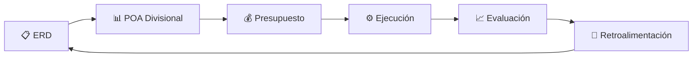
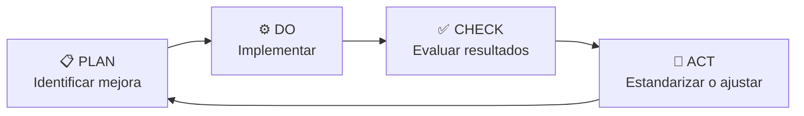
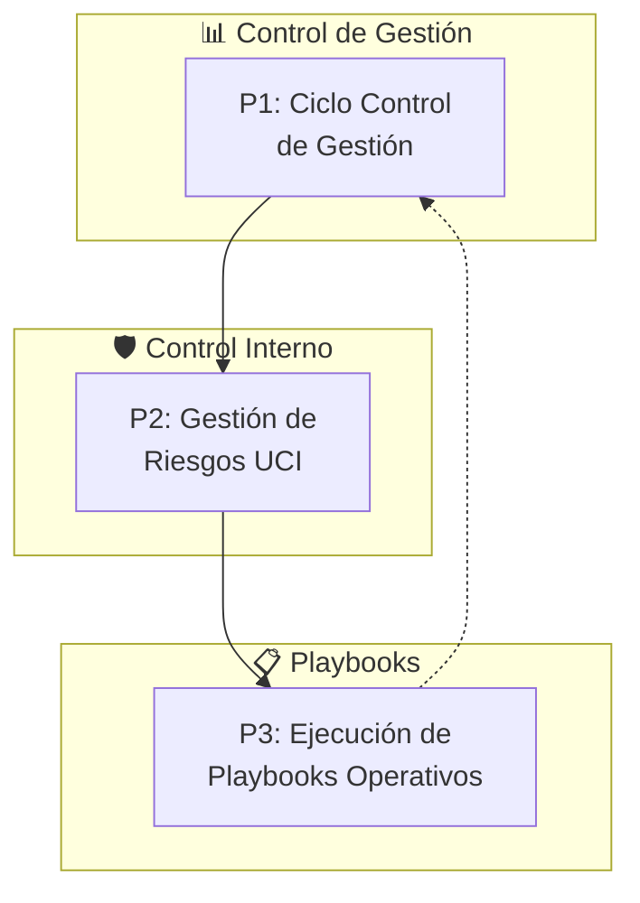
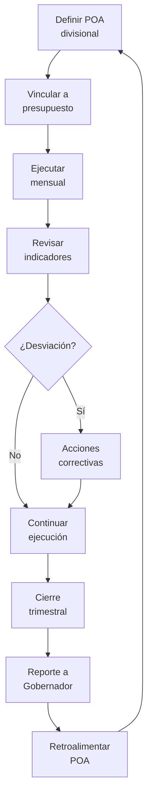
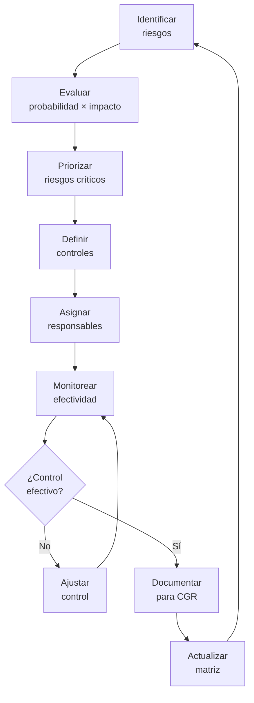
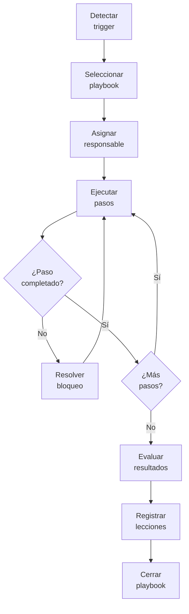

# D-GESTION: Dominio de Gestión Institucional Transversal

> **Parte de:** [GORE_OS Vision General](../vision_general.md)  
> **Capa:** Operativa  
> **Función GORE:** GESTIONAR  
> **Responsable:** Administrador Regional  
> **Procesos BPMN:** 3 | **Subprocesos:** ~15 | **User Stories:** 20

---

## Glosario D-GESTION

| Término                | Definición                                                                                   |
| ---------------------- | -------------------------------------------------------------------------------------------- |
| **H_gore**             | Health Score Institucional GORE. Índice operativo de salud diaria del GORE                   |
| **SCG**                | Sistema de Control de Gestión. Conecta estrategia (ERD), presupuesto y resultados operativos |
| **UCI**                | Unidad de Control Interno. Gestión de riesgos, controles y contraparte técnica CGR           |
| **POA**                | Plan Operativo Anual. Desagregación de objetivos ERD en metas divisionales                   |
| **PDCA**               | Plan-Do-Check-Act. Ciclo de mejora continua institucional                                    |
| **Playbook Operativo** | Procedimiento estructurado para tareas recurrentes, crisis o onboarding                      |
| **DPR**                | Delegado Presidencial Regional. Representante del gobierno central en la región              |
| **COSOC**              | Consejo de la Sociedad Civil Regional. Órgano consultivo de participación                    |
| **CCTID**              | Comité Regional de Ciencia, Tecnología e Innovación para el Desarrollo                       |

> **Fuente canónica:** [gorenuble/knowledge/domains/gn/gestion](file:///Users/felixsanhueza/Developer/gorenuble/knowledge/domains/gn/gestion) para SCG, UCI, Administrador Regional

---

## Propósito

Gestionar el desempeño institucional diario, la operación transversal y la mejora continua del GORE, asegurando eficiencia operativa y coordinación interdivisional bajo el liderazgo del Administrador Regional.

> **D-GESTION vs D-EVOL:** D-GESTION es la **gestión operativa diaria** (Administrador Regional), mientras D-EVOL es la **evolución estratégica** (Encargado TDE). H_gore mide salud operativa; H_org mide madurez sistémica.

---

## Módulos

### 1. Sistema de Control de Gestión (SCG)

> **Fuente:** kb_gn_035_estrategia_gestion_koda.yml → Sistemas_Control_Gestion_y_Desempeno

**Vinculación Estrategia-Presupuesto:**



**Indicadores de Desempeño (SMART):**

| Tipo       | Descripción            | Ejemplo                     |
| ---------- | ---------------------- | --------------------------- |
| Eficacia   | Logro de objetivos     | % metas POA cumplidas       |
| Eficiencia | Recursos vs resultados | Costo por IPR ejecutada     |
| Calidad    | Satisfacción y tiempos | NPS interno, días respuesta |
| Impacto    | Outcomes regionales    | Brechas ERD cerradas        |

**Funcionalidades:**

- Definición de POA alineado a ERD
- Dashboard de indicadores por división
- Reportes mensuales automatizados
- Convenios de desempeño divisionales

### 2. H_gore (Salud Institucional)

> **Diferencia con H_org:** H_gore es operativo (diario/semanal); H_org es estratégico (madurez sistémica).

**Dimensiones H_gore:**

| Dimensión                | Indicadores                          | Peso |
| ------------------------ | ------------------------------------ | ---- |
| Ejecución Presupuestaria | % ejecución, desvío vs plan          | 25%  |
| Cartera IPR              | % avance, proyectos en riesgo        | 20%  |
| Rendiciones              | % mora, días promedio revisión       | 20%  |
| Convenios                | % vigentes OK, vencimientos próximos | 15%  |
| Cumplimiento TDE         | % normas cumplidas, brechas          | 10%  |
| Satisfacción             | NPS interno, tiempos respuesta       | 10%  |

**Cálculo:**

```javascript
H_gore = Σ (peso_i × indicador_normalizado_i)
Escala: 0-100 | Meta: ≥80 (zona verde)
```

**Umbrales de Escalamiento:**

| Umbral                  | Acción                                 |
| ----------------------- | -------------------------------------- |
| H_gore < 60 (2 semanas) | Notificación a Jefatura + Playbook P01 |
| H_gore < 50             | Activación FÉNIX Nivel IV              |

**Funcionalidades:**

- Dashboard H_gore en tiempo real
- Drill-down por dimensión
- Tendencia histórica (7-30-90 días)
- Alertas configurables con escalamiento

### 3. Playbooks Operativos

> **Fuente:** orko/metodologia/kb_metodologia_002_playbooks_orko.yml

**Catálogo de Playbooks Operativos:**

| ID  | Nombre                   | Trigger                                | Duración  |
| --- | ------------------------ | -------------------------------------- | --------- |
| P01 | Low H_gore Recovery      | H_gore < 60                            | 1 día     |
| P02 | Handoff Reduction        | Handoffs excesivos                     | 2 días    |
| P09 | Drift Detection Response | Degradación sostenida del cumplimiento | 3 días    |
| P12 | Data Quality Recovery    | Problemas calidad datos                | 2 semanas |
| P13 | Political Alignment      | Conflictos stakeholders                | 2 semanas |
| P14 | Client Expectation Mgmt  | Insatisfacción stakeholders            | 3-7 días  |
| P15 | Adaptive Cadence         | Shocks contextuales                    | Variable  |

**Estructura de Playbook:**

- Trigger conditions (métricas, umbrales)
- Pasos de ejecución (checklist)
- RACI (Responsible, Accountable, Consulted, Informed)
- Criterios de éxito
- Outputs y artefactos

**Funcionalidades:**

- Catálogo de playbooks por categoría
- Ejecución guiada paso a paso
- Registro de resultados
- Métricas pre/post playbook

### 4. Unidad de Control Interno (UCI)

> **Fuente:** kb_gn_035_estrategia_gestion_koda.yml → Gestion_Riesgos_en_GORE

**Matriz de Riesgos:**

| Categoría    | Ejemplos                         | Tratamiento               |
| ------------ | -------------------------------- | ------------------------- |
| Político     | Cambio gobierno, conflictos CORE | Monitoreo, anticipación   |
| Financiero   | Subejec., sobrecostos            | Controles presupuestarios |
| Operacional  | Procesos deficientes             | Mejora continua           |
| Probidad     | Conflictos interés, fraude       | Prevención, auditoría     |
| Reputacional | Crisis mediáticas                | Protocolo comunicación    |

**Funcionalidades:**

- Mapa de riesgos institucional
- Controles asociados por riesgo
- Monitoreo de efectividad
- Reportes para CGR

### 5. Mejora Continua (PDCA)

**Ciclo PDCA Institucional:**



**Funcionalidades:**

- Registro de oportunidades de mejora
- Priorización por impacto/esfuerzo
- Seguimiento de implementación
- Lecciones aprendidas (incluye aprendizajes FÉNIX)

### 6. Gestión de Personas (DAF/RRHH)

> **Ref cruzada:** D-BACK para procesos detallados de RRHH

**Indicadores Clave:**

| Indicador    | Fórmula                      | Meta         |
| ------------ | ---------------------------- | ------------ |
| Ausentismo   | Días ausencia / Días hábiles | < 5%         |
| Rotación     | Salidas / Dotación promedio  | < 10% anual  |
| Clima        | Score encuesta clima         | ≥ 75         |
| Capacitación | Horas/funcionario            | ≥ 40 anuales |

**Funcionalidades:**

- Dashboard de ausentismo por tipo/unidad
- Gestión de inducción (checklist, mentor)
- Clima organizacional
- Plan de capacitación

### 7. Procesos Operativos Críticos

**Procesos Gestionados:**

| Proceso                      | Responsable            | Sistema              |
| ---------------------------- | ---------------------- | -------------------- |
| Gestión documental           | Oficina de Partes      | GesDoc/SIAPER        |
| Atención ciudadana (OIRS)    | Encargado OIRS         | OIRS Regional        |
| Coordinación interdivisional | Administrador Regional | Interno              |
| Transparencia activa         | UCI                    | Portal Transparencia |

**Funcionalidades:**

- Expediente 100% digital (Ley 21.180)
- Seguimiento de plazos legales
- Métricas de satisfacción ciudadana

### 8. Coordinación Institucional

**Niveles de Coordinación:**

| Nivel             | Actores         | Mecanismo                |
| ----------------- | --------------- | ------------------------ |
| Interno           | Divisiones GORE | Comité directivo semanal |
| Gobierno Interior | DPR, SEREMIs    | Reuniones bilaterales    |
| Territorial       | Municipios      | Mesas de trabajo         |
| Auxiliar          | COSOC, CCTID    | Sesiones formales        |

**Funcionalidades:**

- Gestión de comité directivo (agenda, acuerdos, seguimiento)
- Coordinación con DPR
- Relación con municipios
- Secretaría COSOC

---

## 📋 Procesos BPMN

### Mapa General D-GESTION



---

### P1: Ciclo de Control de Gestión



---

### P2: Gestión de Riesgos UCI



---

### P3: Ejecución de Playbooks Operativos



---

## 📝 User Stories por Módulo

### Resumen

| Módulo       | US Críticas | US Altas | Total  |
| ------------ | ----------- | -------- | ------ |
| SCG          | 2           | 1        | 3      |
| H_gore       | 1           | 2        | 3      |
| Playbooks    | 1           | 2        | 3      |
| UCI          | 1           | 1        | 2      |
| Mejora       | 0           | 2        | 2      |
| Personas     | 0           | 2        | 2      |
| Procesos     | 1           | 1        | 2      |
| Coordinación | 1           | 2        | 3      |
| **Total**    | **7**       | **13**   | **20** |

> **Fuente:** [kb_goreos_us_d-gestion.yml](../user-stories/kb_goreos_us_d-gestion.yml)

### Catálogo por Módulo

#### Sistema de Control de Gestión (SCG)

| ID              | Título                              | Prioridad |
| --------------- | ----------------------------------- | --------- |
| US-GEST-SCG-001 | Definir POA alineado a ERD          | Crítica   |
| US-GEST-SCG-002 | Monitorear indicadores divisionales | Crítica   |
| US-GEST-SCG-003 | Generar reporte mensual de gestión  | Alta      |

#### H_gore (Salud Institucional)

| ID             | Título                        | Prioridad |
| -------------- | ----------------------------- | --------- |
| US-GEST-HG-001 | Dashboard H_gore tiempo real  | Crítica   |
| US-GEST-HG-002 | Configurar umbrales de alerta | Alta      |
| US-GEST-HG-003 | Drill-down por dimensión      | Alta      |

#### Playbooks Operativos

| ID             | Título                               | Prioridad |
| -------------- | ------------------------------------ | --------- |
| US-GEST-PB-001 | Ejecutar playbook P01 (Recovery)     | Crítica   |
| US-GEST-PB-002 | Ejecutar playbook P14 (Expectativas) | Alta      |
| US-GEST-PB-003 | Registrar resultados playbook        | Alta      |

#### Unidad de Control Interno (UCI)

| ID              | Título                        | Prioridad |
| --------------- | ----------------------------- | --------- |
| US-GEST-UCI-001 | Actualizar matriz de riesgos  | Crítica   |
| US-GEST-UCI-002 | Monitorear controles internos | Alta      |

#### Mejora Continua

| ID             | Título                          | Prioridad |
| -------------- | ------------------------------- | --------- |
| US-GEST-MC-001 | Registrar oportunidad de mejora | Alta      |
| US-GEST-MC-002 | Ejecutar ciclo PDCA             | Alta      |

#### Gestión de Personas

| ID              | Título                           | Prioridad |
| --------------- | -------------------------------- | --------- |
| US-GEST-PER-001 | Dashboard ausentismo             | Alta      |
| US-GEST-PER-002 | Gestionar inducción funcionarios | Alta      |

#### Procesos Operativos

| ID               | Título                       | Prioridad |
| ---------------- | ---------------------------- | --------- |
| US-GEST-PROC-001 | Gestionar expediente digital | Crítica   |
| US-GEST-PROC-002 | Atención ciudadana (OIRS)    | Alta      |

#### Coordinación Institucional

| ID                | Título                        | Prioridad |
| ----------------- | ----------------------------- | --------- |
| US-GEST-COORD-001 | Gestionar comité directivo    | Crítica   |
| US-GEST-COORD-002 | Coordinación con DPR          | Alta      |
| US-GEST-COORD-003 | Gestionar relación municipios | Alta      |

---

## Entidades de Datos

### Control de Gestión

| Entidad          | Atributos Clave                                              | Relaciones        |
| ---------------- | ------------------------------------------------------------ | ----------------- |
| `POA`            | id, division_id, periodo, objetivos[], indicadores[], estado | → Division, ERD   |
| `IndicadorPOA`   | id, poa_id, nombre, meta, valor_actual, tendencia            | → POA, Medicion[] |
| `ReporteGestion` | id, periodo, tipo (mensual/trimestral), contenido, aprobador | → POA[]           |

### Salud Institucional

| Entidad           | Atributos Clave                                             | Relaciones |
| ----------------- | ----------------------------------------------------------- | ---------- |
| `H_gore`          | id, fecha, valor_compuesto, dimension_scores (JSON), estado | → Alerta[] |
| `DimensionH_gore` | id, nombre, peso, indicadores[], umbral_alerta              | → H_gore   |

### Playbooks

| Entidad             | Atributos Clave                                             | Relaciones                     |
| ------------------- | ----------------------------------------------------------- | ------------------------------ |
| `Playbook`          | id, codigo, nombre, categoria, trigger_condition, pasos[]   | → EjecucionPlaybook[]          |
| `EjecucionPlaybook` | id, playbook_id, fecha_inicio, fecha_fin, estado, resultado | → Playbook, LeccionAprendida[] |

### Control Interno

| Entidad   | Atributos Clave                                                       | Relaciones  |
| --------- | --------------------------------------------------------------------- | ----------- |
| `Riesgo`  | id, categoria, descripcion, probabilidad, impacto, nivel, responsable | → Control[] |
| `Control` | id, riesgo_id, descripcion, efectividad, evidencia                    | → Riesgo    |

### Mejora Continua

| Entidad             | Atributos Clave                                            | Relaciones          |
| ------------------- | ---------------------------------------------------------- | ------------------- |
| `OportunidadMejora` | id, descripcion, origen, area, estado, responsable_id      | → IniciativaMejora  |
| `IniciativaMejora`  | id, oportunidad_id, plan_pdca, metricas_impacto, resultado | → OportunidadMejora |

---

## Sistemas Involucrados

| Sistema      | Función                       | Integración         |
| ------------ | ----------------------------- | ------------------- |
| `SYS-SCG`    | Control de gestión y POA      | Dashboards internos |
| `SYS-RRHH`   | Gestión de personas           | SIGPER              |
| `SYS-GESDOC` | Gestión documental            | Expediente digital  |
| `SYS-OIRS`   | Atención ciudadana            | Portal regional     |
| `INT-H_GORE` | Dashboard salud institucional | Cálculo diario      |

---

## Normativa Aplicable

| Norma                      | Alcance                                    |
| -------------------------- | ------------------------------------------ |
| **Ley 19.175** Art. 24 bis | Rol Administrador Regional                 |
| **Ley 21.180**             | Transformación Digital del Estado          |
| **Ley 20.285**             | Transparencia activa y pasiva              |
| **Ley 20.880**             | Probidad, declaración intereses/patrimonio |
| **Res. 30/2015 CGR**       | Control interno y auditoría                |

---

## Referencias Cruzadas

| Dominio     | Relación                                           | Entidades Compartidas   |
| ----------- | -------------------------------------------------- | ----------------------- |
| **D-EVOL**  | Lecciones de mejora alimentan pilotos de evolución | IniciativaMejora        |
| **D-FIN**   | Indicadores ejecución presupuestaria para H_gore   | Ejecucion, CDP          |
| **D-EJEC**  | Estado convenios como dimensión H_gore             | Convenio                |
| **D-BACK**  | Procesos RRHH detallados                           | Funcionario, Ausentismo |
| **D-NORM**  | Expedientes digitales, OIRS                        | ActoAdministrativo      |
| **D-TDE**   | Cumplimiento TDE como dimensión H_gore             | Indicador TDE           |
| **D-COORD** | Relación con actores externos                      | Actor, Stakeholder      |
| **FÉNIX**   | Escalamiento por H_gore crítico                    | AlertaFenix             |

---

*Documento parte de GORE_OS Blueprint Integral v5.0*  
*Última actualización: 2025-12-16*
