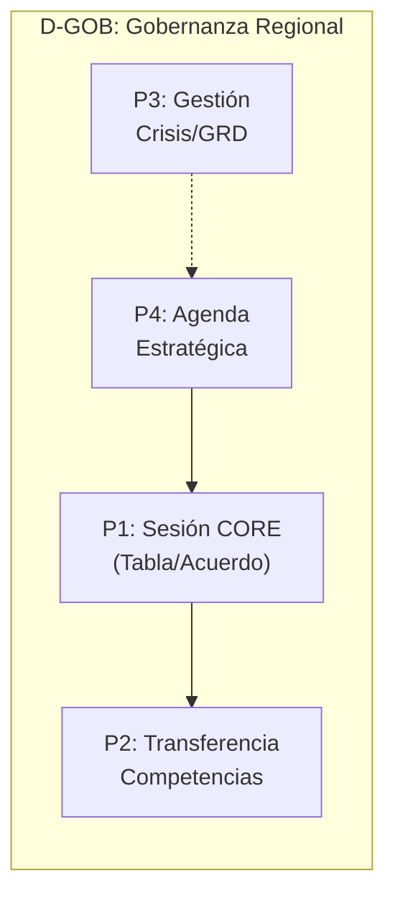
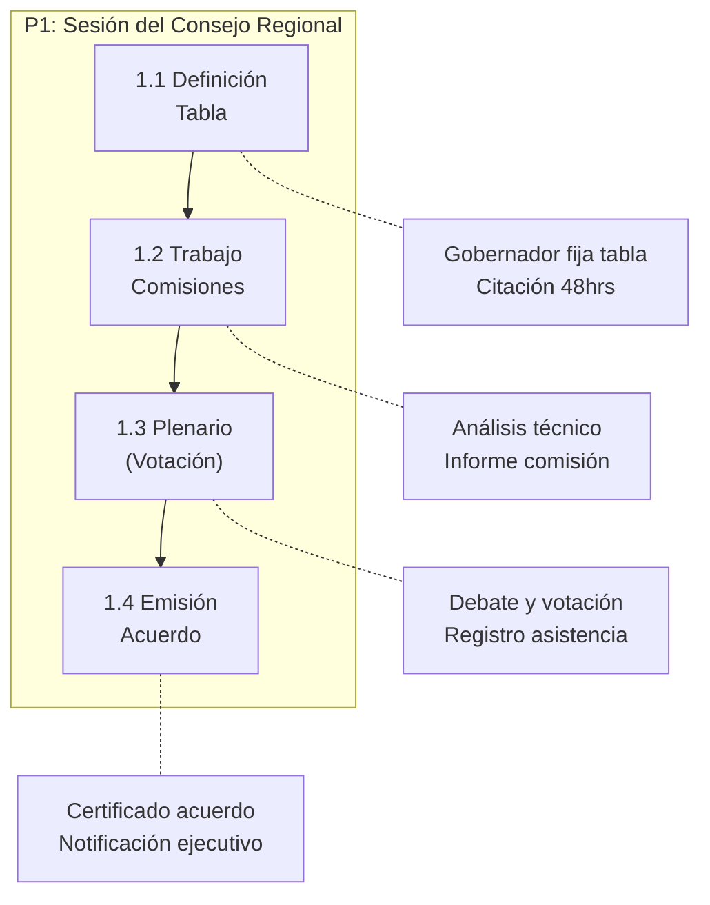
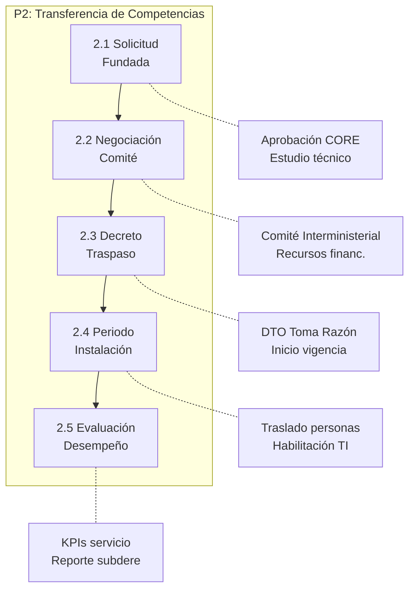
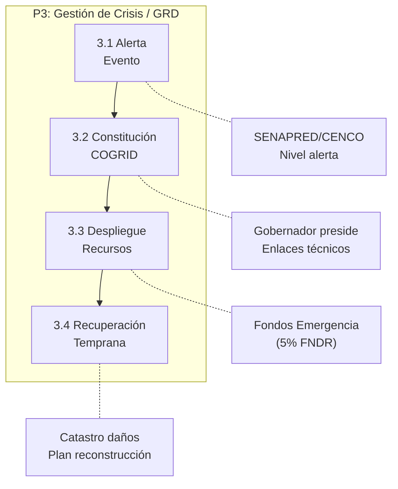
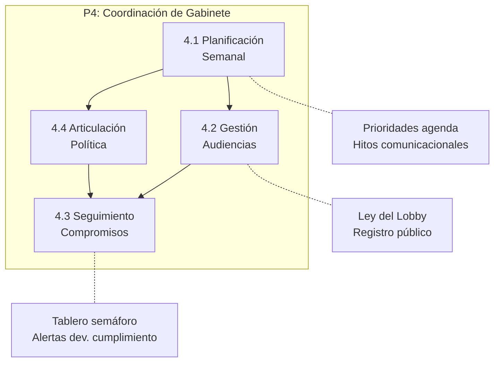

# D-GOB: Dominio de Gobernanza Regional

> **Procesos BPMN:** 4 | **Subprocesos:** ~18 | **User Stories:** 49
> **Parte de:** [GORE_OS Vision General](../vision_general.md)  
> **Capa:** Estratégica (Dimensión Política)  
> **Función GORE:** GOBERNAR / COORDINAR  
> **División:** Gobernación / Secretaría Ejecutiva CORE

---

## Glosario D-GOB

| Término                       | Sigla | Definición                                                                                    |
| ----------------------------- | ----- | --------------------------------------------------------------------------------------------- |
| **Consejo Regional**          | CORE  | Órgano colegiado normativo, resolutivo y fiscalizador del Gobierno Regional.                  |
| **Gobernador Regional**       | GR    | Órgano ejecutivo del Gobierno Regional, electo por votación popular.                          |
| **Gabinete Regional**         | GAB   | Equipo asesor directo del Gobernador para coordinación política y comunicacional.             |
| **Comité de Coordinación**    | CIG   | Instancia de coordinación entre servicios públicos regionales (ex Gabinete Regional).         |
| **Transferencia Competencia** | TC    | Proceso administrativo de traspaso de facultades desde nivel central a regional (Ley 19.175). |
| **Glosa 02/16**               | -     | Disposiciones de Ley de Presupuestos sobre transparencia y gastos de funcionamiento CORE.     |
| **Circunscripción**           | -     | División electoral territorial de la región (Diguillín, Punilla, Itata).                      |
| **Tabla de Sesión**           | -     | Agenda oficial de temas a tratar en una sesión del CORE.                                      |
| **Voto Dirimente**            | -     | Facultad del Gobernador para resolver empates en votaciones del CORE.                         |
| **Comité GRD**                | GRD   | Comité Regional para la Gestión del Riesgo de Desastres (SENAPRED).                           |

---

## Propósito

Facilitar la gobernanza política de la región, gestionando el funcionamiento del Consejo Regional, la agenda estratégica del Gobernador, el proceso de descentralización (transferencia de competencias) y la coordinación con el gobierno interior (Delegación) y la sociedad civil.

**Fundamento Legal:** Ley 19.175 (LOC GORE), Ley 21.074 (Fortalecimiento Regional), Ley 21.364 (SENAPRED).

---

## Diagrama de Dominio

```mermaid
flowchart TB
    subgraph GOBIERNO["🏛️ Gobierno Regional"]
        GR["Gobernador<br/>Regional"]
        GAB["Gabinete"]
        DESC["Unidad<br/>Descentralización"]
    end

    subgraph CONSEJO["👨‍⚖️ Consejo Regional"]
        CORE["Plenario CORE"]
        COMISION["Comisiones<br/>Temáticas"]
        SEC["Secretaría<br/>Ejecutiva"]
    end

    subgraph EXT["🤝 Relacionamiento"]
        DPR["Delegado<br/>Presidencial"]
        COSOC["Sociedad<br/>Civil"]
        GRD["Comité<br/>Desastres"]
    end

    GR --> CORE : "Preside"
    CORE --> GR : "Fiscaliza"
    GR --> GAB : "Dirige"
    GAB --> COSOC : "Coordina"
    DESC --> GR : "Asesora TC"
    GR --> DPR : "Coordina"
    GR --> GRD : "Lidera"
```

---

## Módulos

### M1: Consejo Regional (CORE)

| Atributo        | Descripción                                                               |
| --------------- | ------------------------------------------------------------------------- |
| **Propósito**   | Gestionar el funcionamiento normativo y fiscalizador del órgano colegiado |
| **Componentes** | Gestión de Tablas, Votaciones, Comisiones, Transparencia                  |

**Funcionalidades:**
- Carpeta digital de consejero (documentos, citaciones)
- Mapa de inversiones por circunscripción
- Registro de votaciones y acuerdos
- Portal de transparencia Glosa 16 (gastos funcionamiento)

### M2: Despacho Gobernador

| Atributo        | Descripción                                                      |
| --------------- | ---------------------------------------------------------------- |
| **Propósito**   | Apoyar la labor ejecutiva y estratégica de la autoridad regional |
| **Componentes** | Agenda, Gabinete, Comunicaciones, Protocolo                      |

**Funcionalidades:**
- Dashboard ejecutivo integrado (KPIs regionales)
- Gestión de compromisos de autoridad
- Firma electrónica avanzada de actos
- Coordinación de relaciones internacionales (URAI)

### M3: Descentralización

| Atributo        | Descripción                                                  |
| --------------- | ------------------------------------------------------------ |
| **Propósito**   | Gestionar la transferencia de nuevas competencias y recursos |
| **Componentes** | Expedientes TC, Negociación, Instalación                     |

**Funcionalidades:**
- Flujo de solicitud de competencias (Art. 21)
- Monitoreo de indicadores de desempeño servicios traspasados
- Plan de instalación de competencias (recursos, personas)

### M4: Coordinación & Emergencias

| Atributo        | Descripción                                                                     |
| --------------- | ------------------------------------------------------------------------------- |
| **Propósito**   | Articular la respuesta regional ante crisis y la relación con niveles centrales |
| **Componentes** | Comité GRD, Relación DPR, Seguridad Pública                                     |

**Funcionalidades:**
- Activación de Comité de Gestión de Riesgos
- Coordinación con Delegación Presidencial
- Gestión de crisis comunicacionales

---

## Procesos BPMN

### Mapa General de Procesos



---

### P1: Sesión CORE



**Actores:** Gobernador, Consejeros, Secretario Ejecutivo  
**Frecuencia:** Bimensual (Ordinaria) / A demanda (Extraordinaria)

---

### P2: Transferencia Competencias



**Actores:** Unidad Descentralización, Gobernador, SUBDERE  
**Frecuencia:** Anual / Por ventana de solicitud

---

### P3: Gestión Crisis / GRD



**Actores:** Gobernador, SENAPRED, Delegado Presidencial  
**Frecuencia:** Eventual (Emergencias)

---

### P4: Coordinación Gabinete



**Actores:** Jefatura Gabinete, Asesores, Periodistas  
**Frecuencia:** Diaria/Semanal

---

## Catálogo por Proceso

### Resumen de User Stories

| Proceso               | Módulo                | US Total |
| --------------------- | --------------------- | -------- |
| P1: Sesión CORE       | M1: CORE              | 12       |
| P2: Descentralización | M3: Descentralización | 7        |
| P3: Gestión Crisis    | M4: GRD/Delegado      | 6        |
| P4: Gabinete/Agenda   | M2: Gobernador/Gab    | 18       |
| **Total**             |                       | **~43**  |

### Selección de US Clave

| ID              | Título                        | Proceso | Prioridad |
| --------------- | ----------------------------- | ------- | --------- |
| US-GOB-CORE-001 | Carpeta digital sesión CORE   | P1      | Crítica   |
| US-GOB-CORE-007 | Cumplimiento acuerdos CORE    | P1      | Crítica   |
| US-GOB-DESC-002 | Negociar transferencia        | P2      | Crítica   |
| US-GOB-GRD-001  | Aprobar Plan RRD              | P3      | Alta      |
| US-GOB-GR-006   | Dashboard ejecutivo integrado | P4      | Crítica   |
| US-GOB-GAB-002  | Seguimiento compromisos GR    | P4      | Crítica   |

> *Para el detalle completo de las 49 historias, ver catálogo YAML adjunto.*

---

## Entidades de Datos

### Consejo Regional

| Entidad       | Atributos Clave                                          | Relaciones                |
| ------------- | -------------------------------------------------------- | ------------------------- |
| `SesionCORE`  | id, numero, tipo, fecha, estado, acta_url                | → Acuerdo[], Asistencia[] |
| `AcuerdoCORE` | id, numero, materia, votacion_resultado, fecha           | → SesionCORE, IPR         |
| `Votacion`    | id, acuerdo_id, consejero_id, opcion (A/R/A), fundamento | → Consejero               |
| `Comision`    | id, nombre, presidente_id, integrantes[]                 | → SesionComision[]        |

### Gobernanza

| Entidad        | Atributos Clave                                                         | Relaciones             |
| -------------- | ----------------------------------------------------------------------- | ---------------------- |
| `CompromisoGR` | id, descripcion, origen (audiencia/terreno), fecha, estado, responsable | → Audiencia            |
| `Competencia`  | id, nombre, ministerio_origen, estado_TC, fecha_traspaso                | → IndicadorDesempeño[] |
| `Emergencia`   | id, tipo, zona_afectada, nivel_alerta, fecha_inicio                     | → AccionRespuesta[]    |

---

## Sistemas Involucrados

| Sistema            | Rol                                  | Dominio   |
| ------------------ | ------------------------------------ | --------- |
| **SGC (Sesiones)** | Gestión de sesiones y actas CORE     | D-GOB     |
| **Lobby**          | Registro de audiencias (Infolobby)   | D-GOB     |
| **Transparencia**  | Portal de transparencia activa       | D-GESTION |
| **SENAPRED**       | Plataforma de gestión de emergencias | Externo   |

---

## Normativa Aplicable

| Norma          | Descripción                                              |
| -------------- | -------------------------------------------------------- |
| **Ley 19.175** | Orgánica Constitucional (Funcionamiento CORE/Gobernador) |
| **Ley 20.730** | Ley del Lobby (Agenda pública)                           |
| **Ley 20.285** | Transparencia (Actas y acuerdos públicos)                |
| **Ley 21.074** | Fortalecimiento de la Regionalización (Competencias)     |

---

## Referencias Cruzadas

| Dominio       | Relación                                         |
| ------------- | ------------------------------------------------ |
| **D-PLAN**    | CORE aprueba instrumentos (ERD, PROT, ARI)       |
| **D-FIN**     | CORE aprueba presupuesto y distribución FNDR     |
| **D-GESTION** | Seguimiento operativo de acuerdos CORE           |
| **D-COORD**   | Relación con alcaldes y servicios (actores)      |
| **D-EVOL**    | Gobernanza de la transformación digital regional |

---

*Documento parte de GORE_OS v5.0*
