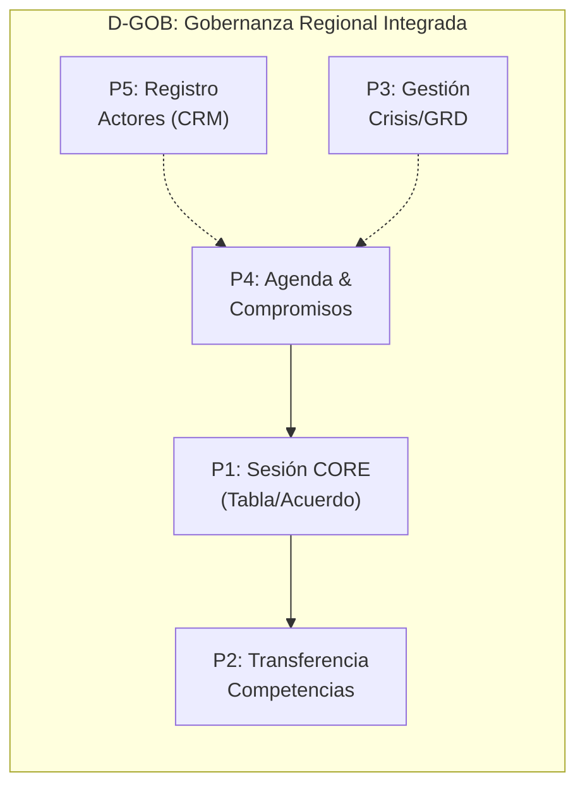
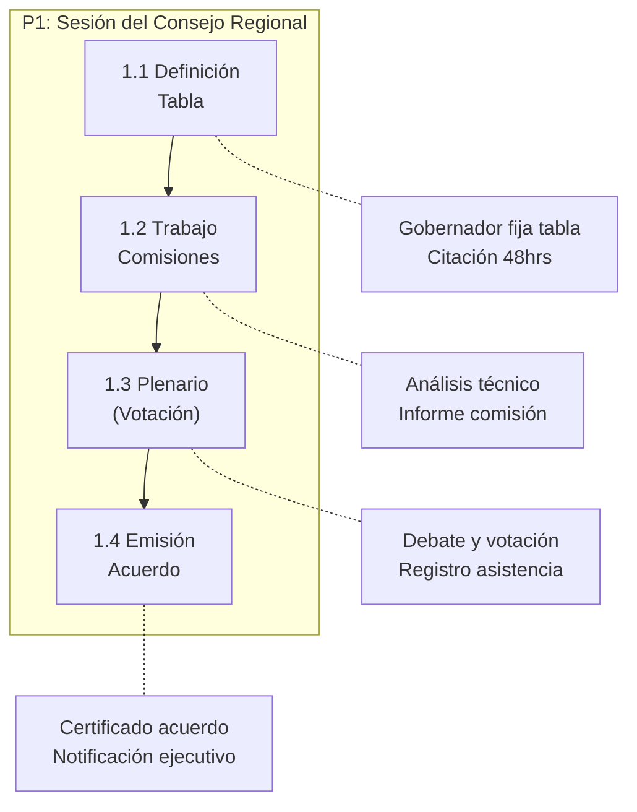
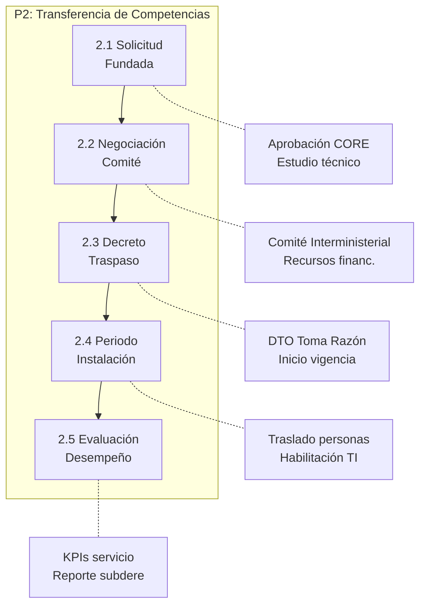
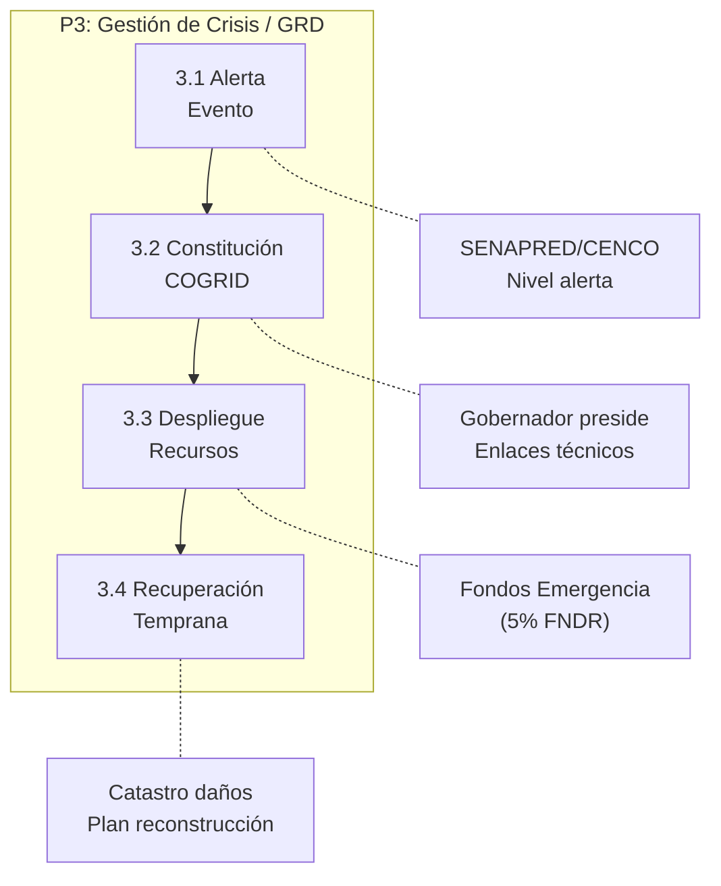
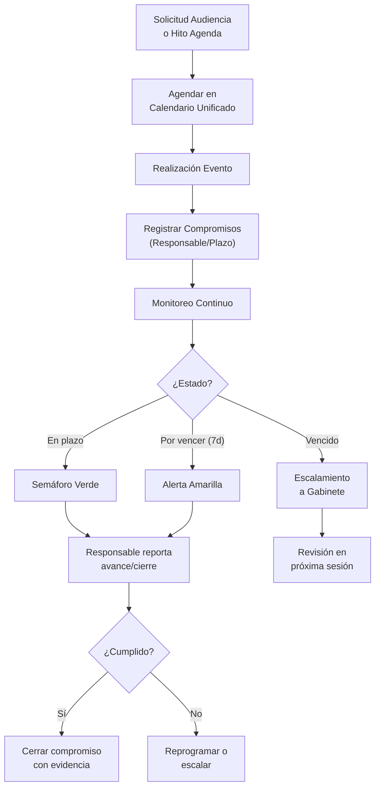
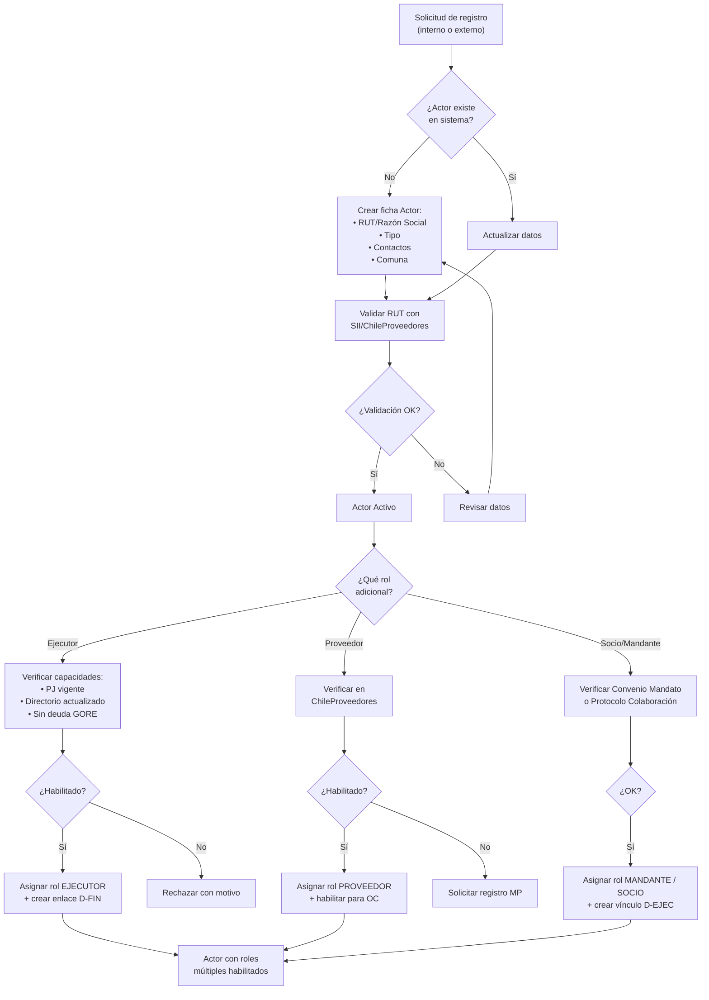

# D-GOB: Dominio de Gobernanza y Relacionamiento Regional

> Parte de: [GORE_OS Vision General](../vision_general.md)  
> Capa: Estratégica (Dimensión Política)  
> Función GORE: GOBERNAR  
> División: Gobernación / Secretaría Ejecutiva CORE / Gabinete

---

## Glosario D-GOB

| Término                   | Sigla | Definición                                                                                    |
| ------------------------- | ----- | --------------------------------------------------------------------------------------------- |
| Consejo Regional          | CORE  | Órgano colegiado normativo, resolutivo y fiscalizador del Gobierno Regional.                  |
| Gobernador Regional       | GR    | Órgano ejecutivo del Gobierno Regional, electo por votación popular.                          |
| Gabinete Regional         | GAB   | Equipo asesor directo del Gobernador para coordinación política y comunicacional.             |
| Comité de Coordinación    | CIG   | Instancia de coordinación entre servicios públicos regionales (ex Gabinete Regional).         |
| Transferencia Competencia | TC    | Proceso administrativo de traspaso de facultades desde nivel central a regional (Ley 19.175). |
| Glosa 02/16               | -     | Disposiciones de Ley de Presupuestos sobre transparencia y gastos de funcionamiento CORE.     |
| Circunscripción           | -     | División electoral territorial de la región (Diguillín, Punilla, Itata).                      |
| Tabla de Sesión           | -     | Agenda oficial de temas a tratar en una sesión del CORE.                                      |
| Voto Dirimente            | -     | Facultad del Gobernador para resolver empates en votaciones del CORE.                         |
| Comité GRD                | GRD   | Comité Regional para la Gestión del Riesgo de Desastres (SENAPRED).                           |
| Actor                     | -     | Entidad externa o interna (Municipio, Servicio, ONG, Persona) que interactúa con el GORE.     |
| SSOT de Actores           | -     | Single Source of Truth. Directorio maestro de todos los actores del ecosistema regional.      |
| COSOC                     | -     | Consejo de Organizaciones de la Sociedad Civil.                                               |
| CTCI                      | -     | Comité Regional de Ciencia, Tecnología, Conocimiento e Innovación.                            |
| AM                        | -     | Área Metropolitana. Conurbación con gobernanza coordinada (Art. 104 bis LOC).                 |

---

## Propósito

Facilitar la gobernanza política de la región y gestionar el relacionamiento integral con todos los actores del territorio (ciudadanía, municipios, gobierno central, privados). Centraliza el funcionamiento del CORE, la agenda del Gobernador, el Directorio de Actores y la participación ciudadana.

Fundamento Legal: Ley 19.175 (LOC GORE), Ley 21.074 (Fortalecimiento Regional), Ley 21.364 (SENAPRED), Ley 20.500 (Participación).

---

## Diagrama de Dominio

```mermaid
flowchart TB
    subgraph GOBIERNO["🏛️ Gobierno Regional"]
        GR["Gobernador<br/>Regional"]
        GAB["Gabinete"]
        DESC["Unidad<br/>Descentralización"]
    end

    subgraph CONSEJO["👨‍⚖️ Consejo Regional"]
        CORE["Plenario CORE"]
        COMISION["Comisiones<br/>Temáticas"]
        SEC["Secretaría<br/>Ejecutiva"]
    end

    subgraph RELACIONES["🤝 Relacionamiento (CRM)"]
        ACTOR["Directorio<br/>Actores"]
        PART["Participación<br/>COSOC"]
    end

    subgraph EXT["🔗 Externos"]
        DPR["Delegado<br/>Presidencial"]
        GRD["Comité<br/>Desastres"]
    end

    GR --> CORE : "Preside"
    CORE --> GR : "Fiscaliza"
    GR --> GAB : "Dirige"
    GAB --> ACTOR : "Gestiona Relaciones"
    GAB --> PART : "Coordina"
    DESC --> GR : "Asesora TC"
    GR --> DPR : "Coordina"
    GR --> GRD : "Lidera"
```

---

## Módulos

### M1: Consejo Regional (CORE)

| Atributo    | Descripción                                                               |
| ----------- | ------------------------------------------------------------------------- |
| Propósito   | Gestionar el funcionamiento normativo y fiscalizador del órgano colegiado |
| Componentes | Gestión de Tablas, Votaciones, Comisiones, Transparencia                  |

Funcionalidades:

- Carpeta digital de consejero (documentos, citaciones)
- Mapa de inversiones por circunscripción
- Registro de votaciones y acuerdos
- Portal de transparencia Glosa 16 (gastos funcionamiento)

### M2: Despacho Gobernador y Gabinete

| Atributo    | Descripción                                                      |
| ----------- | ---------------------------------------------------------------- |
| Propósito   | Apoyar la labor ejecutiva y estratégica de la autoridad regional |
| Componentes | Agenda, Gabinete, Comunicaciones, Protocolo, Compromisos         |

Funcionalidades:

- Dashboard ejecutivo integrado (KPIs regionales)
- Gestión de compromisos de autoridad (Semáforo de cumplimiento)
- Firma electrónica avanzada de actos
- Coordinación de relaciones internacionales (URAI)

### M3: Descentralización

| Atributo    | Descripción                                                  |
| ----------- | ------------------------------------------------------------ |
| Propósito   | Gestionar la transferencia de nuevas competencias y recursos |
| Componentes | Expedientes TC, Negociación, Instalación                     |

Funcionalidades:

- Flujo de solicitud de competencias (Art. 21)
- Monitoreo de indicadores de desempeño servicios traspasados
- Plan de instalación de competencias (recursos, personas)
- **Gobernanza Metropolitana**: Gestión de la conurbación (e.g. Chillán-Chillán Viejo) en transporte, residuos y medio ambiente.

### M4: Coordinación & Emergencias

| Atributo    | Descripción                                                                     |
| ----------- | ------------------------------------------------------------------------------- |
| Propósito   | Articular la respuesta regional ante crisis y la relación con niveles centrales |
| Componentes | Comité GRD, Relación DPR, Seguridad Pública                                     |

Funcionalidades:

- Activación de Comité de Gestión de Riesgos
- Coordinación con Delegación Presidencial
- Gestión de crisis comunicacionales

### M5: Gestión Relacional (CRM) *(Integrado desde D-COORD)*

| Atributo    | Descripción                                                         |
| ----------- | ------------------------------------------------------------------- |
| Propósito   | Directorio maestro de actores territoriales (SSOT)                  |
| Componentes | Registro de Actores, Roles (Ejecutor/Proveedor), Historial, Scoring |

Funcionalidades:

- Registro Único de Actores: SSOT para D-FIN (Ejecutores), D-BACK (Proveedores).
- Historial de Interacciones: Trazabilidad de reuniones, convenios y conflictos.
- Scoring Relacional: Nivel de vinculación y cumplimiento.
- **Mesa CTCI**: Articulación con universidades y centros de investigación para la estrategia regional.

### M6: Participación Ciudadana *(Integrado desde D-COORD)*

| Atributo    | Descripción                                     |
| ----------- | ----------------------------------------------- |
| Propósito   | Vinculación con la sociedad civil               |
| Componentes | Consultas Públicas, COSOC, Transparencia Activa |

Funcionalidades:

- Gestión de consultas públicas (convocatoria, participación, resultados)
- Coordinación con COSOC Regional
- Métricas de satisfacción ciudadana
- Integración con portal de transparencia

---

## Procesos BPMN

### Mapa General de Procesos



---

### P1: Sesión CORE



Actores: Gobernador, Consejeros, Secretario Ejecutivo  
Frecuencia: Bimensual (Ordinaria) / A demanda (Extraordinaria)

---

### P2: Transferencia Competencias



Actores: Unidad Descentralización, Gobernador, SUBDERE  
Frecuencia: Anual / Por ventana de solicitud

---

### P3: Gestión Crisis / GRD



Actores: Gobernador, SENAPRED, Delegado Presidencial  
Frecuencia: Eventual (Emergencias)

---

### P4: Gestión Agenda & Compromisos

*Integra Agenda (ex D-GOB) y Seguimiento (ex D-COORD).*



Actores: Jefatura Gabinete, Asesores, Periodistas  
Frecuencia: Diaria/Semanal

---

### P5: Registro y Vinculación de Actores *(Nuevo)*

*Centraliza la creación de actores para todo el GORE.*



Actores: Gabinete, División que requiere, Actor externo  
Frecuencia: A demanda

---

### Selección de US Clave

| ID              | Título                        | Proceso | Prioridad |
| --------------- | ----------------------------- | ------- | --------- |
| US-GOB-CORE-001 | Carpeta digital sesión CORE   | P1      | Crítica   |
| US-GOB-CORE-007 | Cumplimiento acuerdos CORE    | P1      | Crítica   |
| US-GOB-DESC-002 | Negociar transferencia        | P2      | Crítica   |
| US-GOB-GRD-001  | Aprobar Plan RRD              | P3      | Alta      |
| US-GOB-GR-006   | Dashboard ejecutivo integrado | P4      | Crítica   |
| US-GOB-GAB-002  | Seguimiento compromisos GR    | P4      | Crítica   |
| US-GOB-ACT-001  | Registrar nuevo actor         | P5      | Alta      |
| US-GOB-ACT-003  | Habilitar rol ejecutor        | P5      | Crítica   |

> *Para el detalle completo de las 57 historias, ver catálogo YAML adjunto.*

---

## Entidades de Datos

### Consejo Regional

| Entidad       | Atributos Clave                                          | Relaciones                |
| ------------- | -------------------------------------------------------- | ------------------------- |
| `SesionCORE`  | id, numero, tipo, fecha, estado, acta_url                | → Acuerdo[], Asistencia[] |
| `AcuerdoCORE` | id, numero, materia, votacion_resultado, fecha           | → SesionCORE, IPR         |
| `Votacion`    | id, acuerdo_id, consejero_id, opcion (A/R/A), fundamento | → Consejero               |
| `Comision`    | id, nombre, presidente_id, integrantes[]                 | → SesionComision[]        |

### Gobernanza

| Entidad        | Atributos Clave                                                         | Relaciones             |
| -------------- | ----------------------------------------------------------------------- | ---------------------- |
| `CompromisoGR` | id, descripcion, origen (audiencia/terreno), fecha, estado, responsable | → Audiencia, Actor     |
| `Competencia`  | id, nombre, ministerio_origen, estado_TC, fecha_traspaso                | → IndicadorDesempeño[] |
| `Emergencia`   | id, tipo, zona_afectada, nivel_alerta, fecha_inicio                     | → AccionRespuesta[]    |

### Relacionamiento (CRM)

| Entidad             | Atributos Clave                                                                                         | Relaciones                                                |
| ------------------- | ------------------------------------------------------------------------------------------------------- | --------------------------------------------------------- |
| `Actor`             | id, rut, razon_social, tipo, contacto_principal, email, telefono, comuna_id, estado, scoring_relacional | → HistorialActor[], ActorIPR[] (D-FIN), ConvenioMandato[] |
| `HistorialActor`    | id, actor_id, evento_tipo, descripcion, fecha, funcionario_id                                           | → Actor                                                   |
| `InteraccionActor`  | id, actor_id, tipo (reunion/llamada/email/convenio), fecha, resumen                                     | → Actor                                                   |
| `RolActor`          | id, actor_id, rol (EJECUTOR/PROVEEDOR/MANDANTE/SOCIO), estado, fecha_habilitacion                       | → Actor                                                   |
| `ConvenioMandato`   | id, mandante_id, mandatario_id, hito_inicio, presupuesto, estado                                        | → Actor (Mandante)                                        |
| `AreaMetropolitana` | id, nombre, comunas_constituyentes[], director_am_id, estado                                            | → Comuna[]                                                |

### Participación Ciudadana

| Entidad               | Atributos Clave                                                                   | Relaciones           |
| --------------------- | --------------------------------------------------------------------------------- | -------------------- |
| `ConsultaPublica`     | id, titulo, descripcion, fecha_inicio, fecha_fin, participantes_count, resultados | → DocumentoAdjunto[] |
| `InstanciaGobernanza` | id, nombre, tipo (consejo/comite/mesa), normativa_base, periodicidad              | → SesionInstancia[]  |
| `SesionGabinete`      | id, fecha, tipo (ordinaria/extraordinaria), asistentes, acta_url                  | → CompromisoGR[]     |

---

## Sistemas Involucrados

| Sistema              | Rol                                  | Dominio   |
| -------------------- | ------------------------------------ | --------- |
| SGC (Sesiones)       | Gestión de sesiones y actas CORE     | D-GOB     |
| Lobby                | Registro de audiencias (Infolobby)   | D-GOB     |
| Transparencia        | Portal de transparencia activa       | D-GESTION |
| SENAPRED             | Plataforma de gestión de emergencias | Externo   |
| ORG-CHILEPROVEEDORES | Registro de proveedores              | Externo   |
| SYS-SII              | Validación RUT empresas/personas     | Externo   |
| INT-GOREOS           | Directorio centralizado de actores   | SSOT      |

---

## Normativa Aplicable

| Norma      | Descripción                                              |
| ---------- | -------------------------------------------------------- |
| Ley 19.175 | Orgánica Constitucional (Funcionamiento CORE/Gobernador) |
| Ley 20.730 | Ley del Lobby (Agenda pública)                           |
| Ley 20.285 | Transparencia (Actas y acuerdos públicos)                |
| Ley 21.074 | Fortalecimiento de la Regionalización (Competencias)     |
| Ley 20.500 | Participación Ciudadana (COSOC)                          |
| Ley 21.364 | Sistema Nacional de Emergencia (SENAPRED)                |

---

## Referencias Cruzadas

| Dominio   | Relación                                               |
| --------- | ------------------------------------------------------ |
| D-PLAN    | CORE aprueba instrumentos (ERD, PROT, ARI)             |
| D-FIN     | CORE aprueba presupuesto; consume Actor (rol Ejecutor) |
| D-BACK    | Consume Actor (rol Proveedor) para compras             |
| D-NORM    | Vincula Actor a Actos Administrativos y Convenios      |
| D-GESTION | Seguimiento operativo de acuerdos CORE                 |
| D-EVOL    | Gobernanza de la transformación digital regional       |
| D-SEG     | Consejo Regional de Seguridad Pública                  |

---

*Documento parte de GORE_OS Blueprint v5.0 (Consolidado)*  
*Última actualización: 2025-12-17*
