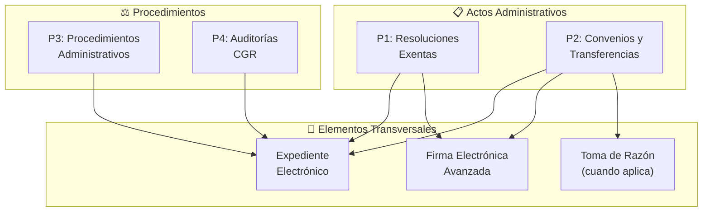
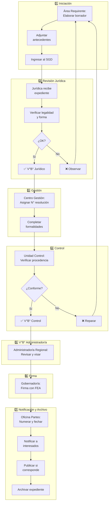
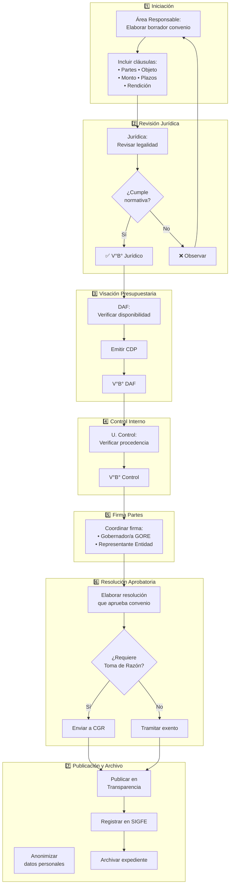
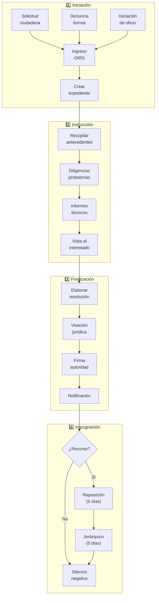
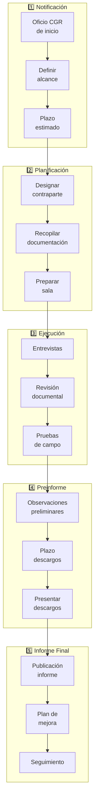

# D-NORM: Dominio de Gestión Jurídico-Administrativa y Cumplimiento

> Parte de: [GORE_OS Vision General](../vision_general.md)  
> Capa: Habilitante (Jurídico-Administrativa)  
> Función GORE: NORMAR  

---

## Glosario D-NORM

| Término | Definición                                                                                    |
| ------- | --------------------------------------------------------------------------------------------- |
| LBPA    | Ley de Bases de Procedimientos Administrativos (19.880). Marco de actuación formal del Estado |
| TDE     | Transformación Digital del Estado (Ley 21.180). Protocolo digital obligatorio                 |
| FEA     | Firma Electrónica Avanzada. Equivalente legal a firma óloga                                   |
| SSOT    | Fuente Única de Verdad (Single Source of Truth). Los convenios viven en D-NORM                |
| DIP     | Declaración de Intereses y Patrimonio. Obligación anual de probidad                           |
| SAI     | Solicitud de Acceso a Información (Ley 20.285)                                                |
| SGD     | Sistema de Gestión Documental. Plataforma de trámites electrónicos                            |
| CDP     | Certificado de Disponibilidad Presupuestaria. Requisito para compromisos                      |
| CPLT    | Consejo para la Transparencia. Órgano autónomo de tutela de acceso                            |
| OIRS    | Oficina de Información, Reclamos y Sugerencias. Canal ciudadano                               |
| CORE    | Consejo Regional. Órgano colegiado con facultades normativas y fiscalizadoras                 |
| RS      | Recomendación Satisfactoria. Evaluación técnico-económica MDSF para proyectos                 |
| LOC     | Ley Orgánica Constitucional. Norma de rango cuasiconstitucional (quorum 4/7)                  |

## Propósito

Gestionar el ciclo completo de actos administrativos, procedimientos formales, cumplimiento normativo y control interno, asegurando la validez jurídica y trazabilidad de las actuaciones del GORE.

> Visión: Toda actuación formal del GORE —resoluciones, convenios, procedimientos— debe ser jurídicamente válida, trazable y verificable. Este dominio garantiza que los procesos jurídico-administrativos se ejecuten con rigor, cumpliendo plazos legales, fundamentación adecuada y control preventivo.

---

## Tres Dimensiones Integradas

| Dimensión      | Componentes                                          |
| -------------- | ---------------------------------------------------- |
| Actos Formales | Resoluciones, Convenios, Reglamentos, Oficios        |
| Procedimientos | Ley 19.880, Plazos legales, Recursos, Notificaciones |
| Cumplimiento   | Probidad, Transparencia, Control CGR, Auditoría      |

---

## Módulos

### 1. Actos Administrativos

Ciclo de Vida:

```text
BORRADOR → VISACIÓN Jurídica → FIRMA FEA → TOMA RAZÓN (si aplica) → NOTIFICACIÓN → VIGENTE
```

Tipos de Actos:

| Tipo         | Características                                                    |
| ------------ | ------------------------------------------------------------------ |
| Res. Exenta  | Sin toma de razón CGR (mayoría de actos GORE)                      |
| Res. Afecta  | Requiere toma de razón (plurianual, personal, montos sobre umbral) |
| Decreto      | Acto del Gobernador con efectos normativos                         |
| Oficio       | Comunicación formal a terceros                                     |
| Acuerdo CORE | Decisiones colegiadas del Consejo Regional                         |
| Certificado  | Constancia de hechos o estados                                     |

Estructura Formal (Ley 19.880):

- VISTOS → Competencia y antecedentes que habilitan el acto

- CONSIDERANDO → Fundamentos de hecho y de derecho (Art. 11, 41)

- RESUELVO → Decisión formal con articulado

### 2. Procedimientos Administrativos

#### Marco: Ley 19.880

Etapas:

```text
INICIACIÓN → INSTRUCCIÓN → FINALIZACIÓN → IMPUGNACIÓN (eventual)
```

Plazos Legales Críticos:

| Plazo           | Aplicación                                 |
| --------------- | ------------------------------------------ |
| 5 días hábiles  | Recurso de reposición                      |
| 5 días hábiles  | Recurso jerárquico                         |
| 10 días hábiles | Respuesta a solicitudes ciudadanas         |
| 30 días hábiles | Silencio administrativo negativo (rechazo) |
| 6 meses         | Plazo máximo procedimiento (prorrogable)   |
| 2 años          | Invalidación de oficio                     |

### 3. Expediente Electrónico

#### Marco: Ley 21.180 (TDE)

Principios:

- Expediente único por procedimiento

- Foliación automática y correlativa

- Trazabilidad completa de actuaciones

- Firma electrónica avanzada (FEA)

- Interoperabilidad con DocDigital

Integraciones: DocDigital, Cero Papel, ClaveÚnica

### 4. Cumplimiento y Control Interno

Probidad y Transparencia (Leyes 20.285, 20.880):

- Declaraciones de intereses y patrimonio

- Inhabilidades e incompatibilidades

- Transparencia activa (portal institucional)

- Solicitudes de acceso a información

Ley de Lobby (Ley 20.730):

- Registro de audiencias

- Gestiones de interés particular

- Viajes pagados por terceros

Control Interno:

- Sumarios administrativos

- Investigaciones sumarias

- Auditoría interna

- Plan de integridad institucional

### 5. Convenios Institucionales (SSOT)

Ciclo de Vida:

```text
NEGOCIACIÓN → REDACCIÓN → VISACIÓN Jurídica → APROBACIÓN (Res.+CGR) → EJECUCIÓN → TÉRMINO
```

Tipos de Convenio (SSOT):

| Tipo          | Descripción                                     | Ejemplo                             | Control CGR |
| ------------- | ----------------------------------------------- | ----------------------------------- | ----------- |
| MANDATO       | GORE encarga ejecución a otro órgano del Estado | MOP ejecuta obra vial               | Afecto      |
| TRANSFERENCIA | GORE transfiere recursos a ejecutor externo     | Municipio ejecuta multicancha       | Afecto      |
| COLABORACIÓN  | Ejecución conjunta con aportes de ambas partes  | GORE+CORFO programa fomento         | Exento      |
| MARCO         | Convenio paraguas para múltiples iniciativas    | Marco con universidad para estudios | Exento      |
| PROGRAMACIÓN  | Convenio plurianual con Ministerio sectorial    | CP de infraestructura con MOP       | Afecto      |

> Nota: La *ejecución operativa* de convenios (hitos, pagos, riesgos) se gestiona en D-EJEC.

### 6. Control Externo

Órganos de Control:

| Órgano              | Función                                        | Marco Legal             |
| ------------------- | ---------------------------------------------- | ----------------------- |
| CGR                 | Control de legalidad, fiscalización, auditoría | Ley 10.336, Art. 98 CPR |
| CPLT                | Acceso a información pública                   | Ley 20.285              |
| Tribunal de Cuentas | Responsabilidad funcionaria                    | Ley 10.336 Art. 107     |

---

## 📋 Procesos BPMN

### Mapa General del Dominio (D01)

| Campo      | Valor             |
| ---------- | ----------------- |
| ID         | `DOM-ACTOS-ADMIN` |
| Criticidad | 🟠 Alta            |
| Dueño      | Unidad Jurídica   |



---

### P1: Flujo de Resoluciones Exentas

| Campo | Valor                                          |
| ----- | ---------------------------------------------- |
| ID    | `BPMN-GN-RES-EXENTAS-FLUJO-01`                 |
| ANS   | 15 días hábiles (Acuerdo de Nivel de Servicio) |



#### Roles por Fase

| Fase             | Responsable              | Acción Principal      |
| ---------------- | ------------------------ | --------------------- |
| 1. Iniciación    | Área Requirente          | Elaborar borrador     |
| 2. Rev. Jurídica | Unidad Jurídica          | Verificar legalidad   |
| 3. Gestión       | Centro de Gestión        | Asignar N°            |
| 4. Control       | Unidad de Control        | Verificar procedencia |
| 5. V°B°          | Administrador/a Regional | Visar                 |
| 6. Firma         | Gobernador/a             | Firma FEA             |
| 7. Notificación  | Oficina de Partes        | Notificar, archivar   |

---

### P2: Aprobación de Transferencias y Convenios

| Campo | Valor                                          |
| ----- | ---------------------------------------------- |
| ID    | `PROC-GORE-BPMN-TRAMITACION-CONVENIOS-01`      |
| ANS   | 30 días hábiles (Acuerdo de Nivel de Servicio) |



#### Contenido Mínimo del Convenio

| Elemento     | Descripción                       |
| ------------ | --------------------------------- |
| Partes       | GORE + Entidad receptora          |
| Objeto       | Descripción del programa/proyecto |
| Monto        | Valor total y calendario          |
| Plazos       | Duración y fechas clave           |
| Obligaciones | Deberes de cada parte             |
| Rendición    | Modalidad, plazos, SISREC         |
| Restitución  | Condiciones de devolución         |
| Probidad     | Cláusulas anticorrupción          |

---

### P3: Procedimientos Administrativos (Ley 19.880)

| Campo | Valor                                         |
| ----- | --------------------------------------------- |
| ID    | `BPMN-GN-PROC-ADMIN-01`                       |
| ANS   | 6 meses máximo (Acuerdo de Nivel de Servicio) |



#### Plazos Críticos (Ley 19.880)

| Etapa                  | Plazo Máximo          |
| ---------------------- | --------------------- |
| Procedimiento total    | 6 meses (prorrogable) |
| Recurso reposición     | 5 días hábiles        |
| Recurso jerárquico     | 5 días hábiles        |
| Silencio negativo      | 30 días hábiles       |
| Invalidación de oficio | 2 años                |

---

### P4: Auditorías CGR

| Campo | Valor                   |
| ----- | ----------------------- |
| ID    | `BPMN-GN-AUDITORIAS-01` |
| Fases | 5                       |
| ANS   | Variable según alcance  |



---

### Expediente Electrónico (Ley 21.180)

```text
📄 Borrador<br/>resolución → 📎 Antecedentes<br/>de respaldo → 📝 Visaciones<br/>electrónicas → ✍️ Firma FEA<br/>Gobernador/a → 📬 Notificación<br/>electrónica
```

#### Principios TDE

| Principio               | Aplicación                           |
| ----------------------- | ------------------------------------ |
| Equivalencia funcional  | Documento digital = papel            |
| Neutralidad tecnológica | Sin dependencia de proveedor         |
| Interoperabilidad       | Comunicación entre sistemas          |
| Seguridad               | Integridad, autenticidad, no repudio |

---

## 📝 Historias de Usuario por Módulo

### Catálogo por Proceso

#### Proceso P1: Resoluciones Exentas

| ID               | Título                             | Prioridad | Actor          |
| ---------------- | ---------------------------------- | --------- | -------------- |
| US-NORM-ACTO-001 | Gestionar actos administrativos    | Crítica   | Abogado UJ     |
| US-NORM-ACTO-007 | Revisión legal de borrador         | Crítica   | Abogado UJ     |
| US-NORM-ACTO-008 | Devolver trámite con observaciones | Alta      | Abogado UJ     |
| US-NORM-ACTO-009 | Numerar y fechar actos             | Crítica   | Centro Gestión |
| US-NORM-ACTO-010 | Distribución de actos              | Alta      | Oficina Partes |
| US-NORM-ACTO-011 | Control de plazos de firma         | Media     | Centro Gestión |
| US-NORM-ACTO-012 | Certificar copia fiel              | Alta      | Ministro de Fe |

#### Proceso P2: Convenios y Transferencias

| ID               | Título                             | Prioridad | Actor          |
| ---------------- | ---------------------------------- | --------- | -------------- |
| US-NORM-ACTO-002 | Asesorar y revisar bases/convenios | Crítica   | Abogado UJ     |
| US-NORM-ACTO-003 | Tramitar ante CGR                  | Crítica   | Abogado UJ     |
| US-NORM-ACTO-006 | Clasificar convenio AFECTA/EXENTA  | Alta      | Analista DIPIR |

#### Expediente Electrónico

| ID              | Título                                  | Prioridad | Actor         |
| --------------- | --------------------------------------- | --------- | ------------- |
| US-NORM-EXP-001 | Gestionar Expediente Electrónico (DS10) | Crítica   | Admin Sistema |
| US-NORM-EXP-002 | Mantener índice electrónico             | Crítica   | Admin Sistema |
| US-NORM-EXP-003 | Registrar trazabilidad expediente       | Alta      | Admin Sistema |
| US-NORM-EXP-004 | Registrar eventos documentales          | Alta      | Admin Sistema |

#### Transparencia y Cumplimiento

| ID                | Título                                   | Prioridad | Actor              |
| ----------------- | ---------------------------------------- | --------- | ------------------ |
| US-NORM-TRANS-001 | Verificar transparencia activa           | Alta      | Enc. Transparencia |
| US-NORM-TRANS-002 | Gestionar solicitudes SAI/OIRS           | Crítica   | Enc. Transparencia |
| US-NORM-LOBBY-001 | Verificar registros audiencias/donativos | Crítica   | Enc. Transparencia |
| US-NORM-DIP-001   | Alertas vencimiento DIP                  | Crítica   | Control Interno    |
| US-NORM-CTRL-001  | Alertar conflicto de interés             | Crítica   | Control Interno    |

#### Control Externo

| ID               | Título                       | Prioridad | Actor          |
| ---------------- | ---------------------------- | --------- | -------------- |
| US-NORM-CGR-001  | Toma de Razón Digital        | Crítica   | CGR (Externo)  |
| US-NORM-CGR-002  | Verificar rendiciones SISREC | Crítica   | CGR (Externo)  |
| US-NORM-CPLT-001 | Requerir información amparo  | Alta      | CPLT (Externo) |

#### Proceso P3: Procedimientos Administrativos

| ID               | Título                              | Prioridad | Actor          |
| ---------------- | ----------------------------------- | --------- | -------------- |
| US-NORM-PROC-001 | Gestionar solicitudes ciudadanas    | Crítica   | Enc. OIRS      |
| US-NORM-PROC-002 | Instruir procedimiento de oficio    | Alta      | Jefe División  |
| US-NORM-PROC-003 | Tramitar recursos administrativos   | Crítica   | Abogado UJ     |
| US-NORM-PROC-004 | Gestionar silencio administrativo   | Crítica   | Enc. OIRS      |
| US-NORM-PROC-005 | Notificar resoluciones electrónicas | Alta      | Oficina Partes |
| US-NORM-PROC-006 | Invalidar acto de oficio            | Alta      | Abogado UJ     |

#### Proceso P4: Auditorías CGR

| ID              | Título                           | Prioridad | Actor             |
| --------------- | -------------------------------- | --------- | ----------------- |
| US-NORM-AUD-001 | Coordinar auditoría CGR          | Crítica   | Contraparte UCI   |
| US-NORM-AUD-002 | Preparar documentación auditoría | Alta      | Áreas auditadas   |
| US-NORM-AUD-003 | Presentar descargos pre-informe  | Crítica   | Abogado UJ        |
| US-NORM-AUD-004 | Gestionar plan de mejora         | Alta      | UCI               |
| US-NORM-AUD-005 | Seguimiento de observaciones     | Alta      | UCI               |
| US-NORM-AUD-006 | Reportar cumplimiento a CGR      | Alta      | Administrador Reg |

*Ver catálogo completo en [kb_goreos_us_d-norm.yml](../user-stories/kb_goreos_us_d-norm.yml)*

---

## 🔗 Matriz de Trazabilidad (Historias de Usuario)

| Proceso BPMN       | Fase                     | Historias de Usuario Relacionadas                       |
| ------------------ | ------------------------ | ------------------------------------------------------- |
| P1: Resoluciones   | Fase 1 Iniciación        | US-NORM-ACTO-001                                        |
| P1: Resoluciones   | Fase 2 Revisión Jurídica | US-NORM-ACTO-007, US-NORM-ACTO-008                      |
| P1: Resoluciones   | Fase 3 Gestión           | US-NORM-ACTO-009                                        |
| P1: Resoluciones   | Fase 4 Control           | US-NORM-CTRL-001, US-NORM-CTRL-002                      |
| P1: Resoluciones   | Fase 6 Firma             | US-NORM-ACTO-011                                        |
| P1: Resoluciones   | Fase 7 Notificación      | US-NORM-ACTO-010, US-NORM-ACTO-012                      |
| P2: Convenios      | Fase 1-2 Elaboración     | US-NORM-ACTO-002, US-NORM-ACTO-006                      |
| P2: Convenios      | Fase 6 Toma Razón        | US-NORM-ACTO-003, US-NORM-CGR-001                       |
| P2: Convenios      | Fase 7 Publicación       | US-NORM-TRANS-001                                       |
| Expediente         | Todas las fases          | US-NORM-EXP-001 a 004                                   |
| Transparencia      | Continuo                 | US-NORM-TRANS-001, US-NORM-TRANS-002, US-NORM-TRANS-003 |
| Control CGR        | Auditorías               | US-NORM-CGR-002, US-NORM-CGR-003                        |
| Probidad           | DIP anual                | US-NORM-DIP-001                                         |
| P3: Procedimientos | Fase 1 Iniciación        | US-NORM-PROC-001, US-NORM-PROC-002                      |
| P3: Procedimientos | Fase 3 Finalización      | US-NORM-PROC-005                                        |
| P3: Procedimientos | Fase 4 Impugnación       | US-NORM-PROC-003, US-NORM-PROC-004, US-NORM-PROC-006    |
| P4: Auditorías     | Fase 1-2 Inicio          | US-NORM-AUD-001, US-NORM-AUD-002                        |
| P4: Auditorías     | Fase 4 Preinforme        | US-NORM-AUD-003                                         |
| P4: Auditorías     | Fase 5 Informe Final     | US-NORM-AUD-004, US-NORM-AUD-005, US-NORM-AUD-006       |

---

## Entidades de Datos

### Actos Administrativos

| Entidad              | Atributos Clave                                                                          | Relaciones                                           |
| -------------------- | ---------------------------------------------------------------------------------------- | ---------------------------------------------------- |
| `ActoAdministrativo` | id, tipo, numero, fecha, materia, estado_tramitacion, requiere_toma_razon, expediente_id | → ExpedienteElectronico, FirmaActo[], Notificacion[] |
| `FirmaActo`          | id, acto_id, firmante_id, tipo, fecha, estado                                            | → ActoAdministrativo, Funcionario                    |
| `Notificacion`       | id, acto_id, destinatario, medio, fecha_envio, fecha_recepcion, estado                   | → ActoAdministrativo                                 |

### Procedimientos y Expedientes

| Entidad                 | Atributos Clave                                                           | Relaciones                                    |
| ----------------------- | ------------------------------------------------------------------------- | --------------------------------------------- |
| `ExpedienteElectronico` | id, iuie, codigo, materia, fecha_inicio, estado, folio_actual             | → DocumentoExpediente[], ActoAdministrativo[] |
| `DocumentoExpediente`   | id, expediente_id, folio, tipo, fecha_ingreso, origen                     | → ExpedienteElectronico                       |
| `ProcedimientoAdmin`    | id, tipo, iniciador, fecha_inicio, plazo_legal, fecha_vencimiento, estado | → ExpedienteElectronico, ActoAdministrativo   |
| `RecursoAdmin`          | id, procedimiento_id, tipo, fecha_interposicion, plazo_respuesta, estado  | → ProcedimientoAdmin                          |

### Cumplimiento y Control

| Entidad              | Atributos Clave                                                  | Relaciones                   |
| -------------------- | ---------------------------------------------------------------- | ---------------------------- |
| `DeclaracionInteres` | id, funcionario_id, tipo, fecha, estado_verificacion             | → Funcionario                |
| `AudienciaLobby`     | id, funcionario_id, fecha, solicitante, materia, resultado       | → Funcionario                |
| `SumarioAdmin`       | id, tipo, fecha_inicio, inculpado_id, fiscal_id, estado, sancion | → Funcionario, FiscalSumario |
| `FiscalSumario`      | id, funcionario_id, carga_actual, especialidad, estado           | → Funcionario                |
| `Auditoria_CGR`      | id, oficio_inicio, tipo, alcance, estado, observaciones[]        | → Plan_Mejora                |

### Convenios

| Entidad                | Atributos Clave                                                             | Relaciones                                |
| ---------------------- | --------------------------------------------------------------------------- | ----------------------------------------- |
| `Convenio`             | id, tipo, numero, partes[], objeto, fecha_suscripcion, vigencia_fin, estado | → ActoAdministrativo, Rendicion[] (D-FIN) |
| `ModificacionConvenio` | id, convenio_id, tipo, fecha, acto_id, descripcion                          | → Convenio, ActoAdministrativo            |

---

## Sistemas Involucrados

| Sistema             | Función                        |
| ------------------- | ------------------------------ |
| `SYS-DOCDIGITAL`    | Gestión documental, expediente |
| `SYS-FIRMAGOB`      | Firma Electrónica Avanzada     |
| `SYS-SIGFE`         | Registro de compromisos        |
| `SYS-TRANSPARENCIA` | Publicación                    |
| `SYS-CGR-SISTRADOC` | Toma de Razón                  |

---

## Normativa Aplicable

| Norma                  | Alcance                      |
| ---------------------- | ---------------------------- |
| Ley 19.880 LBPA        | Procedimiento administrativo |
| Ley 21.180 TDE         | Expediente electrónico       |
| Ley 19.799             | Firma electrónica            |
| Ley 20.285             | Transparencia                |
| Ley 20.880             | Probidad                     |
| Ley 20.730             | Lobby                        |
| Resolución 30/2015 CGR | Rendiciones                  |
| Resolución 7/2019 CGR  | Toma de Razón                |
| Ley 19.886             | Contratación pública         |

---

## Referencias Cruzadas

| Dominio   | Relación                                                           |
| --------- | ------------------------------------------------------------------ |
| D-PLAN    | Reglamentos regionales vinculados con ERD                          |
| D-FIN     | Convenios → Rendiciones                                            |
| D-EJEC    | Convenio (SSOT) → Ejecución operativa                              |
| D-GOB     | Actores como partes en convenios                                   |
| D-BACK    | Gestión documental, expediente electrónico                         |
| D-TDE     | Expediente electrónico, interoperabilidad, Admin Sistema (migrado) |
| D-SEG     | Convenios de Seguridad Municipal, Solicitud_Evidencia → Expediente |
| D-GOB     | Reglamentos CORE, Sesiones formales, Acuerdos                      |
| D-GESTION | Plan de Integridad Institucional, OKRs de cumplimiento             |
| D-EVOL    | Agentes de cumplimiento automatizado, alertas predictivas          |
| FÉNIX     | Actos vencidos o con observaciones CGR activan intervención        |

---

## Roles por Módulo

| Rol                | Responsabilidad Principal                  | US Asociadas                              |
| ------------------ | ------------------------------------------ | ----------------------------------------- |
| Abogado UJ         | Visación legal, tramitación CGR, litigios  | ACTO-001 a 008, PROC-003/006, AUD-003     |
| Enc. Transparencia | SAI/OIRS, Lobby, DIP, Transparencia Activa | TRANS-001/002/003, LOBBY-001/002, DIP-001 |
| Centro Gestión     | Numeración, fechamiento, distribución      | ACTO-009, ACTO-010, ACTO-011              |
| Unidad Control     | Auditoría interna, conflictos de interés   | CTRL-001 a 005, AUD-001 a 006             |
| Ministro de Fe     | Certificación de copias fieles             | ACTO-012                                  |
| Fiscal Sumariante  | Expedientes disciplinarios                 | CTRL-005                                  |
| CGR (Externo)      | Toma de razón, fiscalización               | CGR-001, CGR-002, CGR-003                 |
| CPLT (Externo)     | Tutela acceso a información                | CPLT-001                                  |

---

## Indicadores D-NORM

| KPI                         | Definición                                     | Meta   |
| --------------------------- | ---------------------------------------------- | ------ |
| % Actos tramitados en plazo | Actos firmados ≤ ANS / Total actos             | ≥ 95%  |
| Tasa de representación CGR  | Actos representados / Total enviados a TDR     | ≤ 5%   |
| Tiempo promedio TDR         | Días desde envío hasta pronunciamiento CGR     | ≤ 25 d |
| % SAI respondidas en plazo  | SAI respondidas ≤ 20 días / Total SAI          | 100%   |
| Índice de cumplimiento DIP  | Funcionarios con DIP vigente / Total obligados | 100%   |
| Auditorías sin hallazgos    | Auditorías CGR sin observaciones / Total       | ≥ 80%  |

---

*Documento parte de GORE_OS Blueprint Integral v5.5*  
*Última actualización: 2025-12-18*  
*Auditoría aplicada: Fase 1-3 completadas (migración Admin, glosario, roles, indicadores)*
