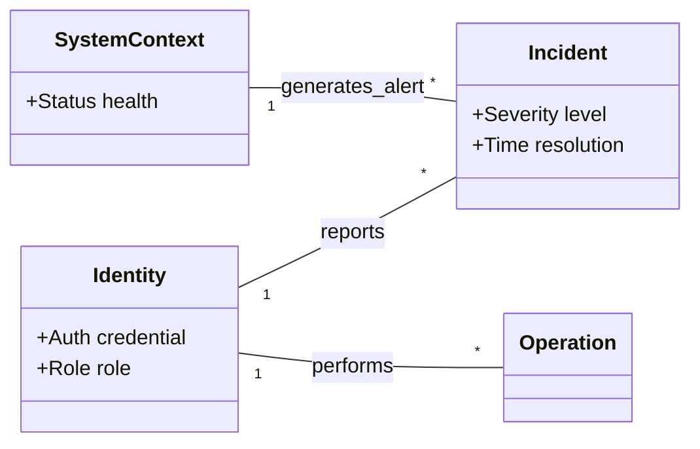
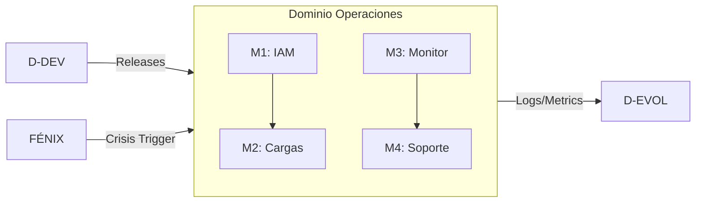
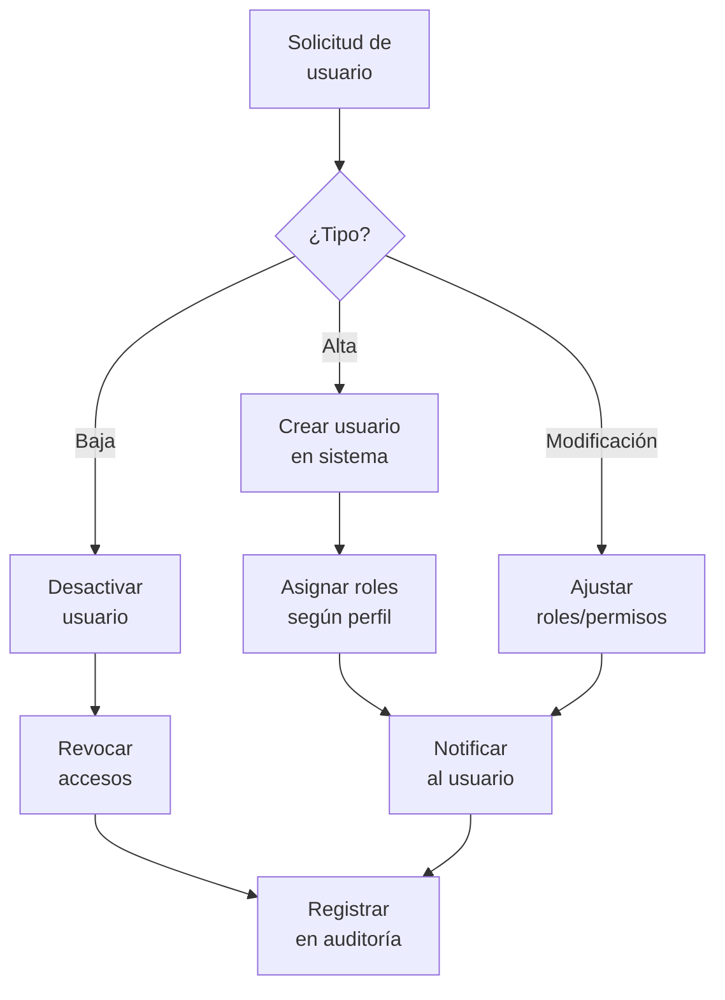
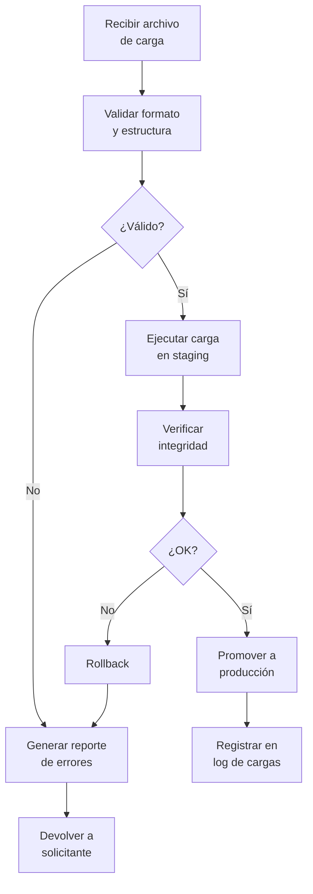
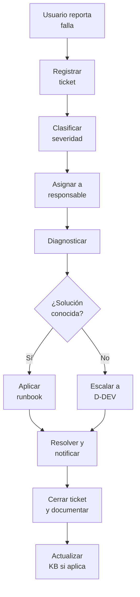

# D-OPS — Dominio de Operaciones del Sistema

## 🧭 1. Resumen Ejecutivo

- **Propósito**: Garantizar la continuidad operativa, seguridad y soporte del ecosistema GORE_OS en producción.
- **Resultado principal**: Sistema disponible (99.5%), seguro y con usuarios atendidos eficientemente.
- **Usuarios/beneficiarios**: Todos los funcionarios (Usuarios finales), Equipo TI (Administradores).
- **Interfaces críticas**:
  - `D-DEV` (Recibe releases).
  - `D-TDE` (Implementa controles de seguridad).
  - `FÉNIX` (Reporta incidentes críticos).

## 🎯 2. Alcance

### 2.1 Qué cubre

- **Incluye**: Gestión de Identidades (IAM), Monitoreo (Observabilidad), Incidentes (Help Desk), Cargas Masivas, Backup/Recovery y Configuración de Entorno.

### 2.2 Qué NO cubre

- **Excluye**: Desarrollo de nuevas funcionalidades (→ `D-DEV`), Definición de normativas legales (→ `D-NORM`).

## 🧠 3. Modelo Conceptual (Ontología)
>
> Definición abstracta de los conceptos y relaciones (Genoma Humano).

### 3.1 Diccionario de Conceptos

- **Operación**: Acto de mantener un sistema en funcionamiento productivo.
- **Incidente**: Interrupción no planificada o reducción en la calidad del servicio.
- **Identidad Digital**: Representación única de un agente (humano o máquina) en el sistema.
- **Observabilidad**: Capacidad de entender el estado interno del sistema basándose en sus outputs (logs, métricas).

### 3.2 Diagrama Conceptual

## 🧬 4. Genotipo Categorial (Modelo de Datos Formal)
>
> Especificación Matemática para el Desarrollo (Genoma Técnico). **Source of Truth**.

### 4.1 Objetos (Entidades) $A \in Ob(C_{ops})$

| Objeto (Entity)  | Definición Formal (Tipo)                                         | Invariante (Regla)                         | Source |
| ---------------- | ---------------------------------------------------------------- | ------------------------------------------ | ------ |
| `UsuarioSistema` | `struct { id: UUID, email: Email, estado: UserState }`           | `INV_01: email must be unique`             | D-OPS  |
| `Rol`            | `struct { id: UUID, codigo: String, scopes: Json }`              | `INV_02: scopes non-empty`                 | D-OPS  |
| `Ticket`         | `struct { id: UUID, severidad: Severity, estado: TicketStatus }` | `INV_03: resolution_date >= creation_date` | D-OPS  |
| `CargaMasiva`    | `struct { id: UUID, checksum: String, total_rows: Int }`         | `INV_04: total_rows >= 0`                  | D-OPS  |
| `Alerta`         | `struct { id: UUID, source: String, threshold: Float }`          | `INV_05: source must be registered`        | D-OPS  |

### 4.2 Morfismos (Relaciones/Procesos) $f: A \to B$

| Morfismo (Func)   | Dominio $\to$ Codominio                                | Tipo                      | Implementación                |
| ----------------- | ------------------------------------------------------ | ------------------------- | ----------------------------- |
| `asignar_rol`     | `UsuarioSistema` $\times$ `Rol` $\to$ `UsuarioSistema` | State Transformation      | `drizzle` (M-to-N) / `xstate` |
| `reportar_ticket` | `UsuarioSistema` $\to$ `Ticket`                        | Creation                  | `trpc.procedure`              |
| `escalar_ticket`  | `Ticket` $\to$ `Ticket`                                | Endofuntor (State Change) | `xstate.transition`           |
| `ingestar_carga`  | `File` $\to$ `CargaMasiva`                             | ETL Map                   | `effect.stream`               |
| `emitir_alerta`   | `Metric` $\to$ `Alerta`                                | Trigger                   | `effect.fiber`                |

### 4.3 Ecuaciones y Restricciones (Paths)

- **EQ1 (Audit):** `asignar_rol ; log_audit = identity` (Toda asignación debe generar log).
- **EQ2 (Resolution):** `reportar ; resolver ; cerrar = ciclo_completo`.
- **INV_IAM:** Todo usuario activo DEBE tener al menos un Rol asignado o un perfil 'Guest' por defecto.

## 🗺️ 5. Mapa del Dominio

## 🧩 6. Módulos / Capacidades

| Código | Módulo         | Objetivo                        | Entradas           | Salidas             | Owner     |
| ------ | -------------- | ------------------------------- | ------------------ | ------------------- | --------- |
| M1     | Gestión IAM    | Administrar ciclo vida usuarios | Solicitud Acceso   | Credenciales        | DAF       |
| M2     | Cargas Masivas | Ingesta de datos bulk           | Archivos CSV/Excel | Datos Estructurados | UI        |
| M3     | Monitoreo      | Vigilar salud técnica           | Métricas/Logs      | Alertas/Dashboards  | UI        |
| M4     | Soporte        | Resolver incidentes             | Reporte Usuario    | Solución/Runbook    | Help Desk |
| M5     | Backup         | Continuidad de negocio          | Datos Prod         | Snapshots/Restore   | Infra     |
| M6     | Configuración  | Gestión de parámetros           | Cambio Config      | Feature Flag        | Arq       |

## 🔄 7. Procesos (Índice BPMN)

| ID Proceso | Nombre                 | Trigger        | Output                  | BPMN/Link                                    |
| ---------- | ---------------------- | -------------- | ----------------------- | -------------------------------------------- |
| P1         | Alta/Baja Usuario      | Solicitud RRHH | Usuario Activo/Inactivo | [Ver Diagrama](#71-p1-gestión-de-usuarios)   |
| P2         | Ejecución Carga Masiva | Archivo subido | Datos en DB o Error     | [Ver Diagrama](#72-p2-carga-masiva-de-datos) |
| P3         | Respuesta a Incidente  | Alerta/Ticket  | Servicio Restaurado     | [Ver Diagrama](#73-p3-gestión-de-incidentes) |

### 7.1 P1: Gestión de Usuarios

### 7.2 P2: Carga Masiva de Datos

### 7.3 P3: Gestión de Incidentes

## 👥 8. Roles y Actores

| Rol            | Responsabilidad                            | Decisiones                       | US relacionadas  |
| -------------- | ------------------------------------------ | -------------------------------- | ---------------- |
| `AdminSistema` | Configuración global y gestión usuarios TI | Feature Flags, Roles Críticos    | `US-OPS-*-*`     |
| `SoporteN1`    | Atención incidentes básicos                | Clasificación, Resolución simple | `US-OPS-SUP-*`   |
| `UsuarioFinal` | Reportar fallas, consumir sistema          | N/A                              | `US-OPS-SUP-001` |

## 🔌 9. Sistemas e Integraciones

| Código   | Sistema       | Tipo (Interno/Externo) | Rol                           | Dominio |
| -------- | ------------- | ---------------------- | ----------------------------- | ------- |
| `SYS-01` | ClaveÚnica    | Externo                | Autenticación Ciudadana/Func. | D-OPS   |
| `SYS-02` | Grafana       | Externo (Infra)        | Visualización Métricas        | D-OPS   |
| `SYS-03` | Hetzner Cloud | Externo (Infra)        | Hosting Base                  | D-OPS   |

## ⚖️ 10. Normativa Aplicable

| Norma      | Artículos      | Obligación                      | Impacto en el dominio             |
| ---------- | -------------- | ------------------------------- | --------------------------------- |
| Ley 19.628 | Todo           | Protección Datos Personales     | Anonimización en logs y backups   |
| DS 83      | Ciberseguridad | Controles de acceso y bitácoras | Diseño de M1 (IAM) y M3 (Monitor) |

## 🧪 11. Historias de Usuario (Resumen)

| ID              | Título             | Prioridad | Actor          |
| --------------- | ------------------ | --------- | -------------- |
| `US-OPS-IAM-01` | Alta de Usuario    | Crítica   | Admin          |
| `US-OPS-DAT-01` | Carga Masiva IPR   | Alta      | Analista D-FIN |
| `US-OPS-MON-01` | Alerta de Latencia | Media     | DevOps         |

## 🔗 12. Matriz de Trazabilidad

| Proceso    | Fase       | US              | Entidades                   |
| ---------- | ---------- | --------------- | --------------------------- |
| P1 (Alta)  | Creación   | `US-OPS-IAM-01` | `UsuarioSistema`, `Rol`     |
| P2 (Carga) | Validación | `US-OPS-DAT-04` | `CargaMasiva`, `ErrorCarga` |

## 📈 13. Indicadores (KPIs)

| KPI    | Definición              | Fórmula                                     | Meta  | Fuente |
| ------ | ----------------------- | ------------------------------------------- | ----- | ------ |
| Uptime | Disponibilidad mensual  | `(TiempoTotal - TiempoCaida) / TiempoTotal` | 99.5% | M3     |
| MTTR   | Tiempo medio reparación | `Sum(T_resolucion) / N_incidentes`          | < 2h  | M4     |

## 🤝 14. Referencias Cruzadas

| Dominio | Relación            | Entidades compartidas (canónicas) |
| ------- | ------------------- | --------------------------------- |
| `D-DEV` | Pipeline deploy     | `Release`, `Artifact`             |
| `D-TDE` | Auditoría seguridad | `LogAcceso`                       |

## 📝 15. Changelog

- **2025-12-18**: Refactorización completa a v5.5 (Genotipo Categorial). Se añadieron secciones ontológicas y formales.

---
*Documento parte de GORE_OS Blueprint Release v5.5 (Categorical Genotype)*
*Última actualización: 2025-12-19 | SSOT: inventario_roles_v8.yml, historias_usuarios_v2.yml*

---

## Catálogo Completo de Historias (SSOT)

> Fuente: `historias_usuarios_v2.yml` | Filtro: `target_domain: D-OPS`  
> Total: 14 historias

| ID | Role | Descripción | P |
|-----|------|-------------|---|
| US-ADM-PLAT-001-01 | admin_plataforma | gestión centralizada de permisos y roles... | P0 |
| US-DEV-001-01 | desarrollador_sistem | acceso a logs centralizados de errores... | P1 |
| US-DEVOPS-001-01 | desarrollador_devops | monitorización de infraestructura como código (IaC... | P0 |
| US-FINOPS-001-01 | finops_manager | reportes de consumo de créditos cloud por proyecto... | P2 |
| US-IPLAT-001-01 | ingeniero_plataforma | catálogo de servicios autogestionado (Base de dato... | P1 |
| US-ISEG-001-01 | ingeniero_seguridad | escaneo automático de vulnerabilidades en el códig... | P0 |
| US-JTI-001-01 | admin_ti | un inventario automatizado de activos TI... | P1 |
| US-MESA-001-01 | mesa_ayuda | una base de conocimientos con soluciones frecuente... | P1 |
| US-MON-001-01 | monitor_sistema | un wallboard con semáforos de estado de servicios... | P1 |
| US-NOC-001-01 | noc_soc | correlación de eventos de seguridad (SIEM)... | P0 |
| US-OPE-001-01 | operador_sistema | planificador de tareas con reporte de éxito/fallo... | P2 |
| US-QA-001-01 | qa_engineer | un entorno de staging idéntico a producción... | P1 |
| US-SOP-001-01 | soporte_tecnico | historial de mantenimiento por número de serie de ... | P1 |
| US-SRE-001-01 | ingeniero_sre | definir y monitorear SLIs y SLOs... | P1 |

