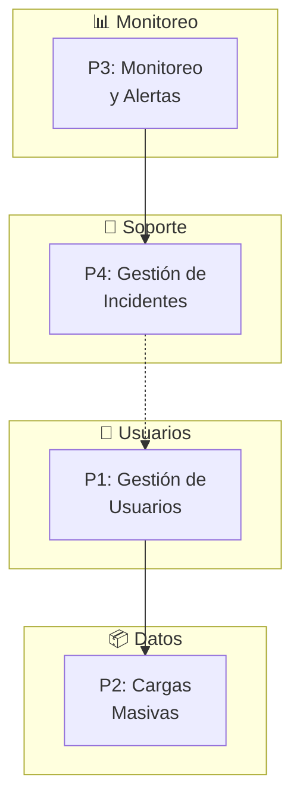
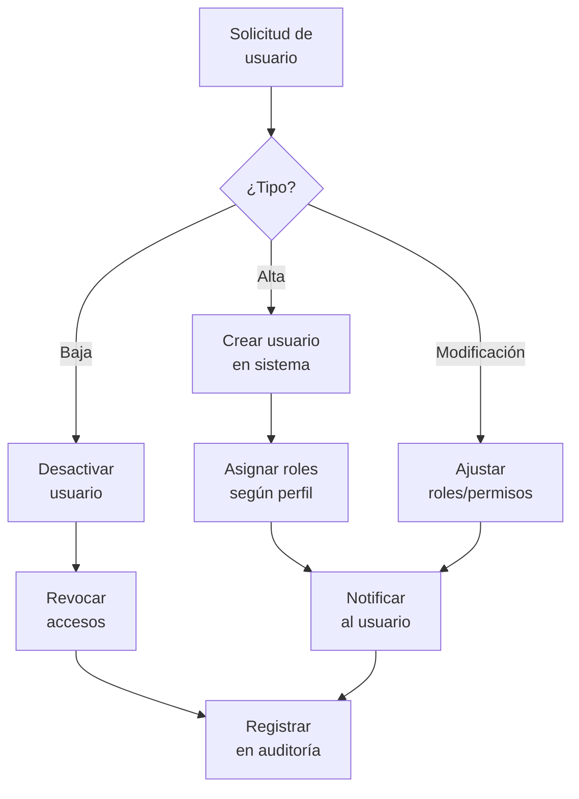
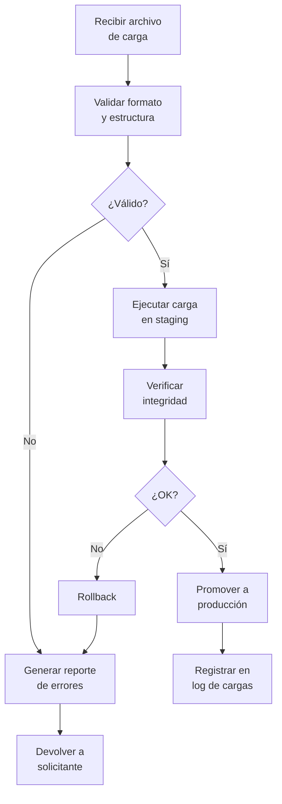
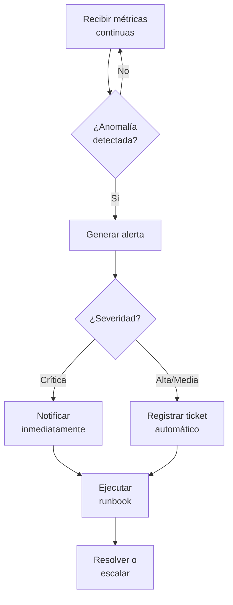
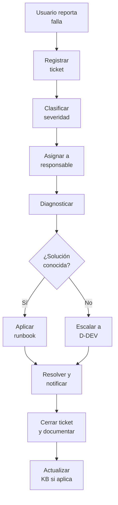

# D-OPS: Dominio de Operaciones del Sistema

> Parte de: [GORE_OS Vision General](../vision_general.md)  
> Capa: Habilitante (Infraestructura Técnica)  
> Función GORE: OPERAR  
> Responsable: Administrador de Sistema / Help Desk  
> Ciclo ORKO: W4 (Operation)

---

## Glosario D-OPS

| Término      | Definición                                                                   |
| ------------ | ---------------------------------------------------------------------------- |
| IAM          | Identity and Access Management. Gestión de identidades, usuarios y permisos. |
| MTTR         | Mean Time To Recovery. Tiempo promedio de recuperación ante incidentes.      |
| SLA          | Service Level Agreement. Acuerdo de nivel de servicio.                       |
| Ticket       | Solicitud de soporte o reporte de incidente registrado en sistema.           |
| Carga Masiva | Importación de grandes volúmenes de datos al sistema.                        |
| Migración    | Transferencia de datos desde sistemas legacy o externos a GORE_OS.           |
| Runbook      | Procedimiento documentado para resolver incidentes recurrentes.              |
| Uptime       | Porcentaje de disponibilidad del sistema.                                    |
| Backup       | Respaldo de datos para recuperación ante desastres.                          |
| DRP          | Disaster Recovery Plan. Plan de recuperación ante desastres.                 |

---

## Propósito

Gestionar la operación continua del sistema GORE_OS en producción: administración de usuarios, cargas de datos, monitoreo, resolución de incidentes y soporte a usuarios internos.

> **D-OPS vs D-DEV**: D-OPS opera el sistema en producción (W4 ORKO). D-DEV construye el sistema (W2-W3 ORKO). Responsables y ritmos diferentes.

> **D-OPS vs D-TDE**: D-OPS es operación técnica del sistema GORE_OS. D-TDE es cumplimiento normativo de la Ley 21.180.

---

## Módulos

### M1: Gestión de Usuarios y Accesos (IAM)

| Atributo       | Descripción                                          |
| -------------- | ---------------------------------------------------- |
| Propósito      | Administrar identidades, roles y permisos en GORE_OS |
| Primitivo ORKO | C1 (Capacidad)                                       |

Funcionalidades:
- CRUD de usuarios del sistema
- Asignación de roles por perfil funcional
- Gestión de permisos granulares por módulo/dominio
- Integración con ClaveÚnica (autenticación)
- Auditoría de accesos y cambios de permisos
- Políticas de contraseñas y MFA
- Desactivación/reactivación de usuarios

### M2: Cargas Masivas y Migraciones

| Atributo       | Descripción                                                |
| -------------- | ---------------------------------------------------------- |
| Propósito      | Importar datos en volumen y migrar desde sistemas externos |
| Primitivo ORKO | C3 (Información)                                           |

Funcionalidades:
- Plantillas de carga por entidad (IPR, Convenios, Ejecutores, etc.)
- Validación previa de datos (formato, integridad referencial)
- Ejecución de cargas con log de errores
- Rollback de cargas fallidas
- Migraciones desde sistemas legacy (Excel, Access)
- Sincronización con sistemas externos (SIGFE, BIP, SISREC)
- Programación de cargas recurrentes

### M3: Monitoreo y Observabilidad

| Atributo       | Descripción                                      |
| -------------- | ------------------------------------------------ |
| Propósito      | Vigilar salud técnica del sistema en tiempo real |
| Primitivo ORKO | D2 (Percepción)                                  |

Funcionalidades:
- Dashboard de uptime y disponibilidad
- Métricas de rendimiento (CPU, memoria, latencia)
- Logs centralizados y búsqueda
- Alertas configurables (umbrales, escalamiento)
- Monitoreo de integraciones externas
- Health checks de componentes críticos
- Histórico de métricas (tendencias)

### M4: Gestión de Incidentes y Soporte

| Atributo       | Descripción                                        |
| -------------- | -------------------------------------------------- |
| Propósito      | Registrar, clasificar y resolver fallas reportadas |
| Primitivo ORKO | D4 (Operación)                                     |

Funcionalidades:
- Portal de reporte de fallos (tickets)
- Clasificación por severidad (Crítico/Alto/Medio/Bajo)
- Asignación a responsables
- SLA por tipo de incidente
- Escalamiento automático
- Runbooks para incidentes conocidos
- Métricas MTTR, tasa de resolución
- Base de conocimiento de soluciones

### M5: Backup y Continuidad

| Atributo       | Descripción                                        |
| -------------- | -------------------------------------------------- |
| Propósito      | Asegurar disponibilidad y recuperabilidad de datos |
| Primitivo ORKO | C4 (Límite)                                        |

Funcionalidades:
- Respaldos automáticos programados
- Verificación de integridad de backups
- Procedimientos de restauración
- Plan de recuperación ante desastres (DRP)
- Pruebas periódicas de recovery
- Retención según normativa

### M6: Configuración del Sistema

| Atributo       | Descripción                                        |
| -------------- | -------------------------------------------------- |
| Propósito      | Gestionar parámetros y configuraciones del sistema |
| Primitivo ORKO | C4 (Límite)                                        |

Funcionalidades:
- Parámetros globales del sistema
- Feature flags (activar/desactivar funcionalidades)
- Configuración de integraciones
- Gestión de ambientes (staging/producción)
- Versionado de configuraciones

---

## Procesos BPMN

### Mapa General D-OPS

---

### P1: Gestión de Usuarios

---

### P2: Carga Masiva de Datos

---

### P3: Monitoreo y Alertas

---

### P4: Gestión de Incidentes

---

## Historias de Usuario

### M1: Gestión de Usuarios

| ID              | Título                            | Prioridad |
| --------------- | --------------------------------- | --------- |
| US-OPS-USER-001 | Crear usuario con rol asignado    | Crítica   |
| US-OPS-USER-002 | Modificar permisos de usuario     | Alta      |
| US-OPS-USER-003 | Desactivar usuario                | Alta      |
| US-OPS-USER-004 | Consultar auditoría de accesos    | Alta      |
| US-OPS-USER-005 | Integrar autenticación ClaveÚnica | Crítica   |

### M2: Cargas Masivas

| ID              | Título                            | Prioridad |
| --------------- | --------------------------------- | --------- |
| US-OPS-DATA-001 | Cargar IPRs desde plantilla Excel | Crítica   |
| US-OPS-DATA-002 | Cargar ejecutores masivamente     | Alta      |
| US-OPS-DATA-003 | Migrar datos desde sistema legacy | Alta      |
| US-OPS-DATA-004 | Validar datos antes de carga      | Crítica   |
| US-OPS-DATA-005 | Revertir carga fallida            | Alta      |

### M3: Monitoreo

| ID             | Título                            | Prioridad |
| -------------- | --------------------------------- | --------- |
| US-OPS-MON-001 | Dashboard de salud del sistema    | Crítica   |
| US-OPS-MON-002 | Configurar alertas por umbral     | Alta      |
| US-OPS-MON-003 | Consultar logs de errores         | Alta      |
| US-OPS-MON-004 | Monitorear integraciones externas | Alta      |

### M4: Soporte

| ID             | Título                         | Prioridad |
| -------------- | ------------------------------ | --------- |
| US-OPS-SUP-001 | Reportar falla en sistema      | Crítica   |
| US-OPS-SUP-002 | Consultar estado de mi ticket  | Alta      |
| US-OPS-SUP-003 | Escalar ticket no resuelto     | Alta      |
| US-OPS-SUP-004 | Consultar runbooks de solución | Alta      |

### M5: Backup

| ID             | Título                          | Prioridad |
| -------------- | ------------------------------- | --------- |
| US-OPS-BCK-001 | Ejecutar backup manual          | Alta      |
| US-OPS-BCK-002 | Verificar integridad de backups | Alta      |
| US-OPS-BCK-003 | Restaurar datos desde backup    | Crítica   |

---

## Entidades de Datos

### Gestión de Usuarios

| Entidad           | Atributos Clave                                          | Relaciones                 |
| ----------------- | -------------------------------------------------------- | -------------------------- |
| `UsuarioSistema`  | id, email, nombre, estado, fecha_creacion, ultimo_acceso | → Rol[], AuditoriaAcceso[] |
| `Rol`             | id, nombre, descripcion, permisos[]                      | → UsuarioSistema[]         |
| `Permiso`         | id, modulo, accion, recurso                              | → Rol[]                    |
| `AuditoriaAcceso` | id, usuario_id, accion, timestamp, ip, resultado         | → UsuarioSistema           |

### Cargas de Datos

| Entidad       | Atributos Clave                                                         | Relaciones      |
| ------------- | ----------------------------------------------------------------------- | --------------- |
| `CargaMasiva` | id, tipo_entidad, archivo, estado, registros_ok, registros_error, fecha | → ErrorCarga[]  |
| `ErrorCarga`  | id, carga_id, linea, campo, error, dato_original                        | → CargaMasiva   |
| `Migracion`   | id, sistema_origen, tipo, estado, fecha_inicio, fecha_fin               | → CargaMasiva[] |

### Monitoreo

| Entidad          | Atributos Clave                                 | Relaciones |
| ---------------- | ----------------------------------------------- | ---------- |
| `MetricaSistema` | id, componente, tipo, valor, timestamp          | → Alerta[] |
| `Alerta`         | id, tipo, severidad, mensaje, estado, timestamp | → Ticket   |
| `HealthCheck`    | id, componente, estado, latencia, timestamp     |            |

### Soporte

| Entidad      | Atributos Clave                                                                                         | Relaciones              |
| ------------ | ------------------------------------------------------------------------------------------------------- | ----------------------- |
| `Ticket`     | id, titulo, descripcion, severidad, estado, reportado_por, asignado_a, fecha_creacion, fecha_resolucion | → Comentario[], Runbook |
| `Comentario` | id, ticket_id, autor, contenido, timestamp                                                              | → Ticket                |
| `Runbook`    | id, titulo, problema, solucion, pasos[]                                                                 | → Ticket[]              |

---

## Indicadores D-OPS

| KPI                      | Definición                             | Meta      |
| ------------------------ | -------------------------------------- | --------- |
| Uptime                   | Disponibilidad del sistema             | ≥ 99.5%   |
| MTTR                     | Tiempo medio de recuperación           | ≤ 2 horas |
| Tickets resueltos en SLA | % tickets cerrados dentro de SLA       | ≥ 90%     |
| Cargas exitosas          | % cargas masivas sin errores críticos  | ≥ 95%     |
| Usuarios activos         | Usuarios con acceso en últimos 30 días | Monitoreo |
| Backups verificados      | % backups con integridad confirmada    | 100%      |

---

## Sistemas Involucrados

| Sistema            | Función                   | Integración |
| ------------------ | ------------------------- | ----------- |
| GORE_OS Core       | Sistema central           | Interno     |
| ClaveÚnica         | Autenticación de usuarios | OIDC        |
| Grafana/Prometheus | Monitoreo                 | Métricas    |
| PostgreSQL         | Base de datos             | Backup      |
| fxeon (Hetzner)    | Infraestructura           | SSH/API     |

---

## Referencias Cruzadas

| Dominio | Relación                                        | Entidades Compartidas       |
| ------- | ----------------------------------------------- | --------------------------- |
| D-DEV   | Escala tickets no resolubles, recibe releases   | Ticket, Release             |
| D-TDE   | Cumplimiento de seguridad (DS 7)                | AuditoriaAcceso             |
| D-BACK  | Usuarios funcionarios vinculados                | Funcionario, UsuarioSistema |
| D-EVOL  | Métricas alimentan H_org                        | MetricaSistema              |
| FÉNIX   | Incidentes críticos pueden activar intervención | Alerta, Ticket              |

---

*Documento parte de GORE_OS Blueprint Integral v5.5*  
*Última actualización: 2025-12-18*
