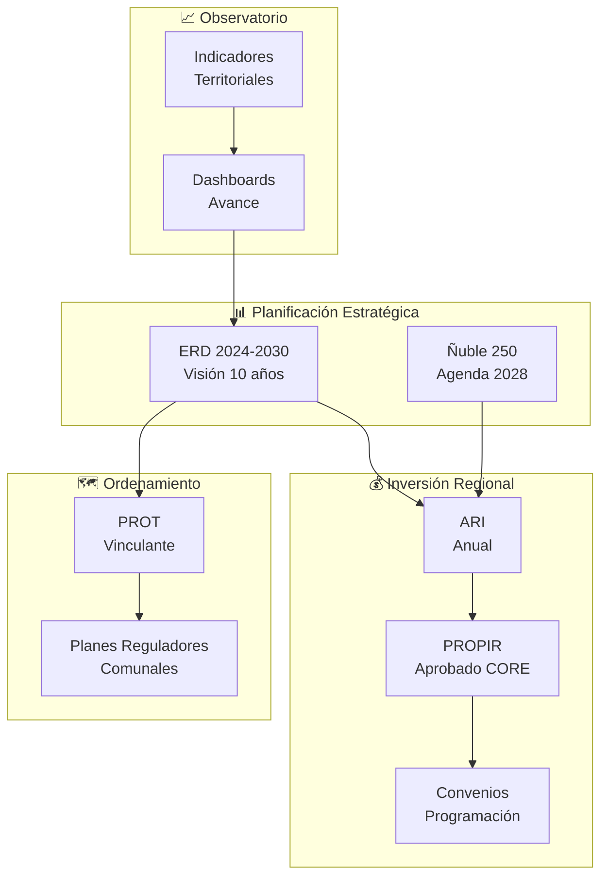
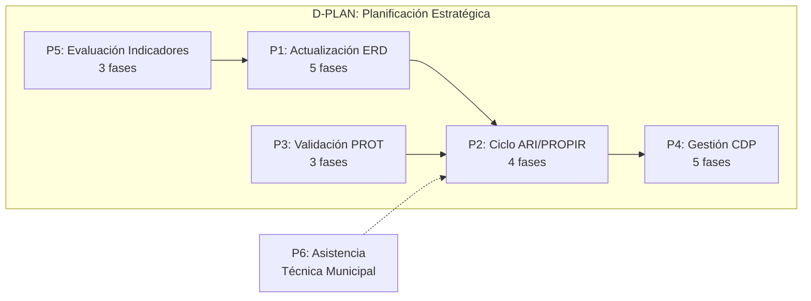
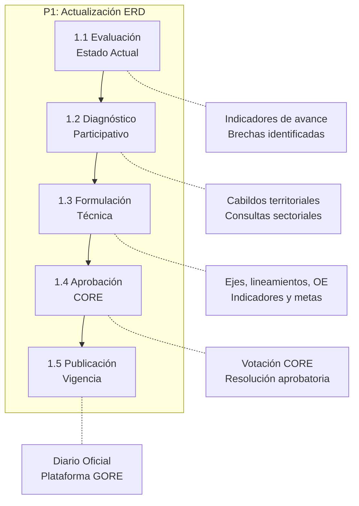
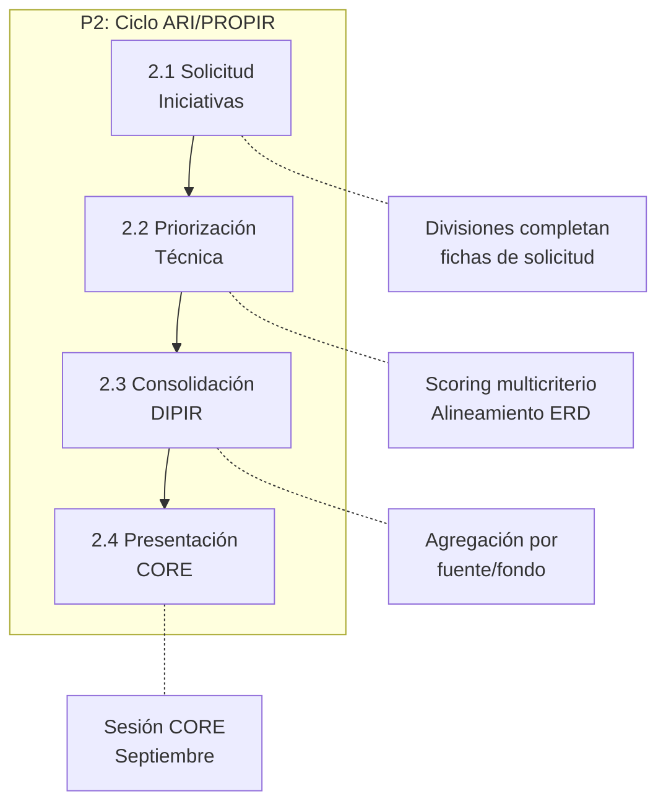
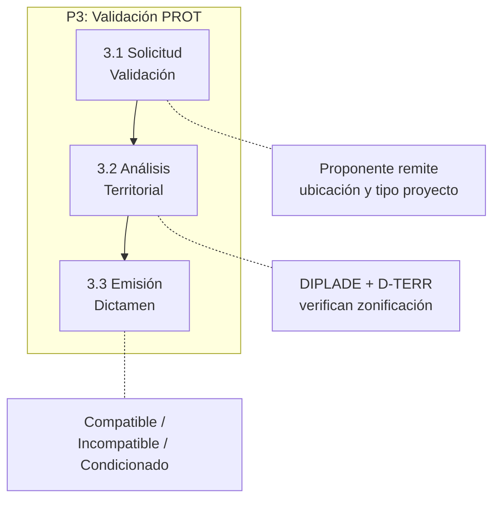
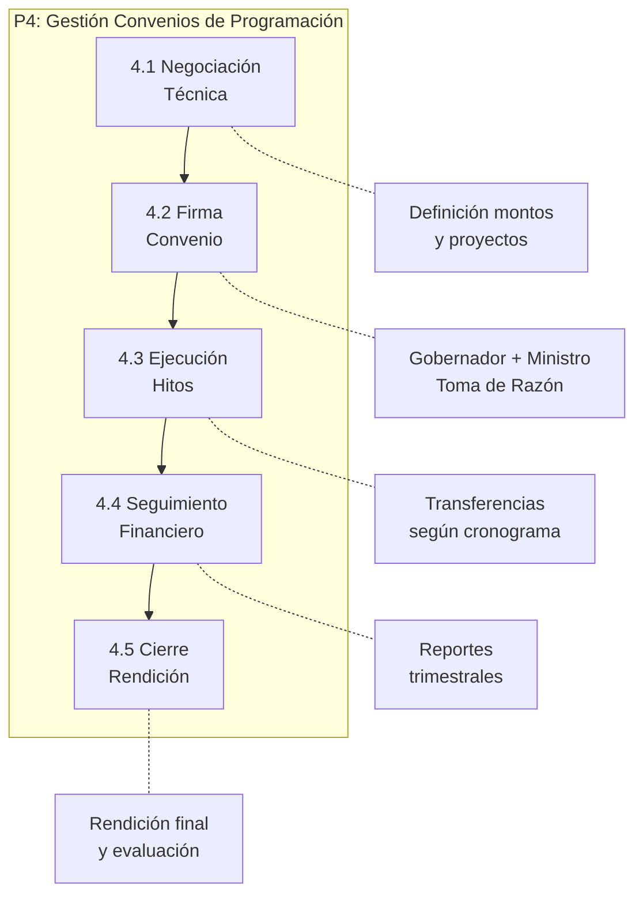
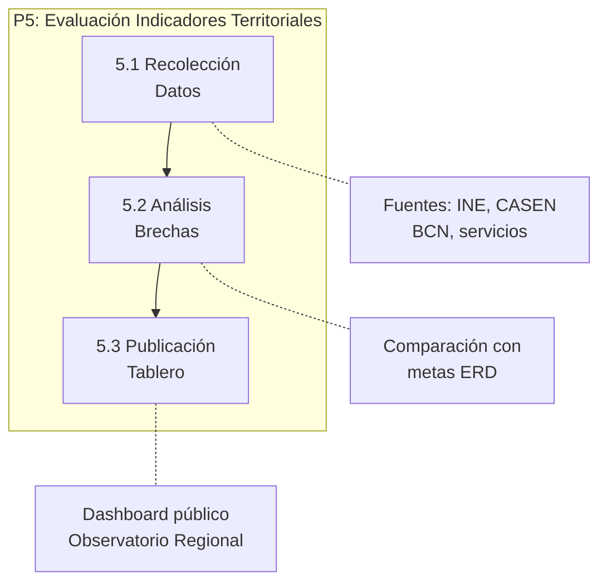
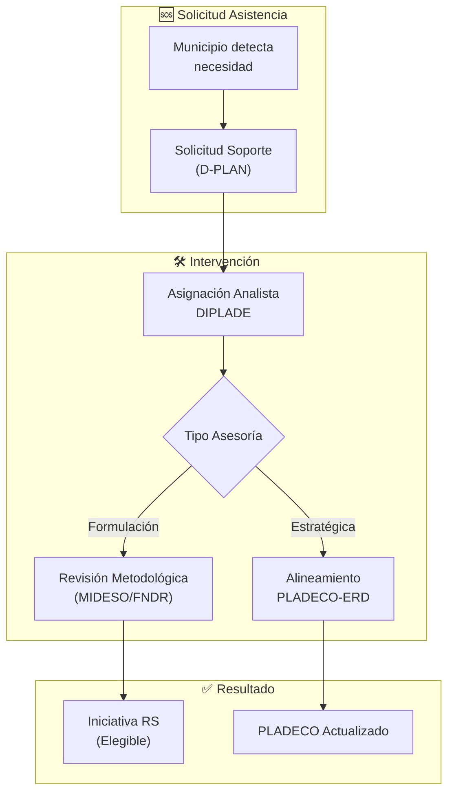

# D-PLAN: Dominio de Planificación Estratégica

> Parte de: [GORE_OS Vision General](../vision_general.md)  
> Capa: Habilitante (Dimensión Estratégica)  
> Función GORE: PLANIFICAR  
> División: DIPLADE (Planificación y Desarrollo Regional)

---

## Glosario D-PLAN

| Término                                   | Sigla   | Definición                                                                                                                                           |
| ----------------------------------------- | ------- | ---------------------------------------------------------------------------------------------------------------------------------------------------- |
| Estrategia Regional de Desarrollo         | ERD     | Instrumento de planificación de largo plazo (10 años) que define visión, ejes y objetivos estratégicos para el desarrollo regional. Art. 16 LOC GORE |
| Plan Regional de Ordenamiento Territorial | PROT    | Instrumento vinculante que orienta el uso del territorio regional mediante macrozonificación y condicionantes. Art. 17 LOC GORE                      |
| Anteproyecto Regional de Inversiones      | ARI     | Planificación presupuestaria anual que consolida iniciativas para presentación CORE (ciclo mayo-agosto)                                              |
| Programa Regional de Inversiones          | PROPIR  | Consolidación de ARI aprobada por CORE, base para ejecución presupuestaria del año siguiente                                                         |
| Convenio de Programación                  | CDP     | Acuerdo plurianual entre GORE y ministerios sectoriales para financiamiento conjunto de inversiones                                                  |
| Eje Estratégico                           | EE      | Gran área de desarrollo regional definida en ERD (4-6 por estrategia)                                                                                |
| Lineamiento                               | LIN     | Orientación programática dentro de un eje estratégico (2-4 por eje)                                                                                  |
| Objetivo Estratégico                      | OE      | Meta medible vinculada a lineamiento con indicadores y metas anuales                                                                                 |
| Macrozona                                 | MZ      | División territorial mayor del PROT para regulación diferenciada (3-5 por región)                                                                    |
| PLADECO                                   | PLADECO | Plan de Desarrollo Comunal. Instrumento rector del desarrollo vecinal.                                                                               |
| SECPLA                                    | SECPLA  | Secretaría Comunal de Planificación. Unidad municipal técnica.                                                                                       |
| División de Planificación y Desarrollo    | DIPLADE | División del GORE responsable de diseñar y monitorear instrumentos de planificación                                                                  |

---

## Propósito

Gestionar los instrumentos de planificación regional —ERD, PROT, ARI/PROPIR y Convenios de Programación— garantizando coherencia estratégica entre visión de largo plazo, ordenamiento territorial, priorización de inversiones y ejecución presupuestaria.

Fundamento Legal: LOC GORE Art. 16-21 (funciones de planificación), Art. 17 (PROT obligatorio), Art. 75-81 (fondos regionales).

---

## Diagrama de Dominio

---

## Módulos

### M1: ERD Digital

| Atributo   | Descripción                                                                               |
| ---------- | ----------------------------------------------------------------------------------------- |
| Propósito  | Gestionar la jerarquía completa de la ERD y vincular iniciativas a objetivos estratégicos |
| Estructura | ERD → Eje(5) → Lineamiento(15) → OE(96) → Indicador/Meta → Iniciativa                     |

Funcionalidades:

- Editor colaborativo de ERD (Objetivos, Lineamientos, Indicadores)
- Vinculación con ODS y Programas de Gobierno
- Repositorio documental de versiones ERDctos de seguridad)
- Dashboard de avance por eje estratégico con semáforos
- Alertas de objetivos sin iniciativas vinculadas (>180 días)

- Reportes de coherencia ERD ↔ Presupuesto ejecutado

### M2: PROT Digital

| Atributo   | Descripción                                                              |
| ---------- | ------------------------------------------------------------------------ |
| Propósito  | Gestionar zonificación territorial y validar compatibilidad de proyectos |
| Estructura | PROT → Macrozona(3-5) → Zona(n) → Uso(permitido/condicionado/prohibido)  |

Funcionalidades:
- Visor geoespacial de zonificación PROT integrado con D-TERR

- Validador automático de compatibilidad IPR ↔ Zona territorial

- Alertas de proyectos en zonas de uso incompatible

- Consulta pública de aptitud territorial para ciudadanos

### M3: ARI / PROPIR

| Atributo  | Descripción                                                               |
| --------- | ------------------------------------------------------------------------- |
| Propósito | Gestionar el ciclo anual de inversión regional                            |
| Ciclo     | Mayo-Agosto: solicitud → priorización → consolidación → presentación CORE |

Funcionalidades:
- Formulario digital de solicitud de iniciativas (divisiones)

- Scoring multicriterio de priorización (alineamiento ERD, impacto, factibilidad)

- Consolidación automática por fuente/fondo (FNDR, FRPD, ISAR)

- Simulación de escenarios presupuestarios

- Exportación formato DIPRES para integración nacional

### M4: Convenios de Programación

| Atributo  | Descripción                                                 |
| --------- | ----------------------------------------------------------- |
| Propósito | Gestionar acuerdos plurianuales con ministerios sectoriales |
| Tipos     | MOP, MINVU, MINSAL, CORFO, otros                            |

Funcionalidades:
- Registro de convenios con hitos y cronograma

- Seguimiento financiero (comprometido/pagado)

- Alertas de vencimiento y renovación

- Vinculación con IPR correspondientes

### M5: Observatorio Territorial

| Atributo  | Descripción                                                             |
| --------- | ----------------------------------------------------------------------- |
| Propósito | Proveer inteligencia territorial para planificación basada en evidencia |
| Fuentes   | BCN Indicadores Ñuble (800+), Ñuble250 Observatorio, CASEN, INE         |

Funcionalidades:

- Visualizador de capas territoriales (PROT, ZOIT, Pladecos)

- Análisis de solapamiento de inversiones

- Generación de reportes territoriales y proyecciones

- Vinculación indicadores ↔ objetivos ERD

- Alertas de brechas por eje estratégico

### M6: Planificación Participativa

| Atributo   | Descripción                                               |
| ---------- | --------------------------------------------------------- |
| Propósito  | Capturar y procesar insumos ciudadanos para planificación |
| Referencia | Ñuble250: 64 instancias, 2.297 participantes, 9 trazos    |

Funcionalidades:
- Registro de cabildos y consultas territoriales

- Síntesis asistida por IA de aportes ciudadanos

- Trazabilidad de propuestas ciudadanas → iniciativas

- Reportes de participación acumulada

### M7: Apoyo a Planificación Comunal

| Atributo     | Descripción                                                           |
| ------------ | --------------------------------------------------------------------- |
| Propósito    | Transferir capacidades técnicas a municipios para mejorar cartera IPR |
| Beneficiario | SECPLAN de 21 comunas de Ñuble                                        |

Funcionalidades:
- Mesa de ayuda para formulación de iniciativas (MIDESO)

- Repositorio de proyectos tipo y buenas prácticas

- Asistente de alineamiento PLADECO ↔ ERD

- Reporte de cartera comunal en proceso

---

## Procesos BPMN

### Mapa General de Procesos

---

### P1: Actualización ERD

Actores: DIPLADE, Consejeros CORE, Ciudadanía, Servicios Públicos  
Frecuencia: Cada 10 años (actualización periódica según Art. 16 LOC)

---

### P2: Ciclo ARI/PROPIR

Actores: Jefes de División, DIPLADE, DIPIR, CORE  
Frecuencia: Anual (mayo-agosto-septiembre)

---

### P3: Validación PROT

Actores: Proponente (división/municipio), DIPLADE, D-TERR  
Frecuencia: Por demanda

---

### P4: Gestión CDP

Actores: GORE, Ministerio Sectorial, DIPIR, CGR  
Frecuencia: Plurianual (3-5 años por convenio)

---

### P5: Evaluación Indicadores

Actores: Observatorio DIPLADE, Áreas técnicas  
Frecuencia: Mensual/Trimestral

---

### P6: Asistencia Técnica Municipal

---

## Catálogo por Proceso

### US Módulo ERD Digital

| ID              | User Story                                                                                                   | Prioridad |
| --------------- | ------------------------------------------------------------------------------------------------------------ | --------- |
| US-PLAN-ERD-001 | Como Analista DIPLADE quiero navegar el árbol ERD con filtros para ubicar rápidamente objetivos estratégicos | Alta      |
| US-PLAN-ERD-002 | Como Analista DIPIR quiero vincular una IPR a un objetivo ERD para garantizar alineamiento estratégico       | Alta      |
| US-PLAN-ERD-003 | Como Jefe DIPLADE quiero visualizar un dashboard de avance por eje para monitorear cumplimiento              | Alta      |
| US-PLAN-ERD-004 | Como Sistema quiero alertar objetivos sin iniciativas >180 días para activar intervención FÉNIX              | Media     |
| US-PLAN-ERD-005 | Como Jefe DIPLADE quiero generar reportes coherencia ERD-Presupuesto para evaluar ejecución                  | Media     |
| US-PLAN-ERD-006 | Como DIPLADE quiero gestionar proceso de actualización ERD para cumplir ciclo decenal                        | Alta      |

---

### US Módulo PROT Digital

| ID               | User Story                                                                                             | Prioridad |
| ---------------- | ------------------------------------------------------------------------------------------------------ | --------- |
| US-PLAN-PROT-001 | Como Analista DIPLADE quiero visualizar zonificación PROT en visor geoespacial para evaluar territorio | Alta      |
| US-PLAN-PROT-002 | Como Analista DIPLADE quiero validar compatibilidad IPR↔Zona para prevenir conflictos territoriales    | Alta      |
| US-PLAN-PROT-003 | Como Sistema quiero alertar proyectos en zonas incompatibles para bloquear avance sin revisión         | Alta      |
| US-PLAN-PROT-004 | Como Ciudadano quiero consultar aptitud territorial de un predio para orientar inversión privada       | Media     |

---

### US Módulo ARI/PROPIR

| ID              | User Story                                                                                              | Prioridad |
| --------------- | ------------------------------------------------------------------------------------------------------- | --------- |
| US-PLAN-ARI-001 | Como Jefe de División quiero solicitar iniciativa para ARI vía formulario digital para agilizar proceso | Alta      |
| US-PLAN-ARI-002 | Como DIPLADE quiero priorizar iniciativas con scoring multicriterio para transparentar decisiones       | Alta      |
| US-PLAN-ARI-003 | Como DIPIR quiero consolidar ARI por fuente de financiamiento para presentar CORE                       | Alta      |
| US-PLAN-ARI-004 | Como Jefe DIPLADE quiero simular escenarios presupuestarios para evaluar alternativas                   | Media     |
| US-PLAN-ARI-005 | Como DIPIR quiero exportar ARI en formato DIPRES para integración con presupuesto nacional              | Alta      |

---

### US Módulo Observatorio

| ID              | User Story                                                                                    | Prioridad |
| --------------- | --------------------------------------------------------------------------------------------- | --------- |
| US-PLAN-OBS-001 | Como Analista quiero consultar indicadores territoriales por comuna para diagnóstico local    | Alta      |
| US-PLAN-OBS-002 | Como DIPLADE quiero vincular indicadores a objetivos ERD para medir avance estratégico        | Alta      |
| US-PLAN-OBS-003 | Como Sistema quiero alertar brechas por eje estratégico para priorizar intervención           | Media     |
| US-PLAN-OBS-004 | Como Observatorio quiero publicar tablero mensual de indicadores para transparencia           | Media     |
| US-PLAN-OBS-005 | Como Usuario externo quiero descargar series históricas en formato abierto para investigación | Baja      |

---

### US Módulo Participación

| ID               | User Story                                                                                              | Prioridad |
| ---------------- | ------------------------------------------------------------------------------------------------------- | --------- |
| US-PLAN-PART-001 | Como DIPLADE quiero registrar cabildo territorial con asistencia y propuestas para documentar proceso   | Alta      |
| US-PLAN-PART-002 | Como Sistema quiero sintetizar aportes ciudadanos con IA para facilitar análisis                        | Media     |
| US-PLAN-PART-003 | Como DIPLADE quiero trazar propuesta ciudadana a iniciativa para demostrar incidencia                   | Media     |
| US-PLAN-PART-004 | Como Jefe DIPLADE quiero reportar participación acumulada por territorio para evaluar representatividad | Media     |

---

### US Módulo Apoyo Comunal

| ID              | User Story                                                                                   | Prioridad |
| --------------- | -------------------------------------------------------------------------------------------- | --------- |
| US-PLAN-MUN-001 | Como SECPLA quiero solicitar asistencia técnica para formulación de proyectos RS             | Alta      |
| US-PLAN-MUN-002 | Como Analista DIPLADE quiero acceder a repositorio de PLADECOs para verificar coherencia ERD | Alta      |
| US-PLAN-MUN-003 | Como Sistema quiero recomendar "Proyectos Tipo" a municipios según sus brechas territoriales | Media     |

---

## Matriz de Trazabilidad

| Proceso                    | User Stories                | Entidades                                             |
| -------------------------- | --------------------------- | ----------------------------------------------------- |
| P1: Actualización ERD      | US-PLAN-ERD-001 a 006       | ERD, EjeEstrategico, Lineamiento, ObjetivoEstrategico |
| P2: Ciclo ARI/PROPIR       | US-PLAN-ARI-001 a 005       | ARI, LineaARI, IPR                                    |
| P3: Validación PROT        | US-PLAN-PROT-001 a 004      | ZonaPROT, IPR                                         |
| P4: Gestión CDP            | (4 US implícitas en D-EJEC) | ConvenioProgramacion, HitoCDP                         |
| P5: Evaluación Indicadores | US-PLAN-OBS-001 a 005       | IndicadorERD, MedicionIndicador                       |
| P6: Asistencia Municipal   | US-PLAN-MUN-001 a 003       | SolicitudAsistencia, PLADECO                          |

---

## Entidades de Datos

| Entidad                | Atributos Clave                                                    | Relaciones                      |
| ---------------------- | ------------------------------------------------------------------ | ------------------------------- |
| `ERD`                  | id, nombre, periodo_inicio, periodo_fin, estado                    | → EjeEstrategico[]              |
| `EjeEstrategico`       | id, erd_id, codigo, nombre, descripcion                            | → Lineamiento[]                 |
| `Lineamiento`          | id, eje_id, codigo, nombre                                         | → ObjetivoEstrategico[]         |
| `ObjetivoEstrategico`  | id, lineamiento_id, codigo, nombre, indicador, meta                | → IPR[], ActividadEstrategica[] |
| `IndicadorERD`         | id, objetivo_id, nombre, formula, linea_base, meta, año            | → MedicionIndicador[]           |
| `MedicionIndicador`    | id, indicador_id, periodo, valor_real, fuente                      |                                 |
| `ZonaPROT`             | id, macrozona, tipo_uso, condiciones_vinculantes, geometria        | → Territorio                    |
| `ARI`                  | id, año, estado, fecha_presentacion, monto_total                   | → LineaARI[]                    |
| `LineaARI`             | id, ari_id, ipr_id, prioridad, monto_solicitado, monto_asignado    | → IPR                           |
| `ConvenioProgramacion` | id, ministerio, monto_total, vigencia_inicio, vigencia_fin, estado | → HitoCDP[]                     |
| `HitoCDP`              | id, convenio_id, descripcion, fecha_comprometida, monto, estado    |                                 |
| `CabildoTerritorial`   | id, fecha, comuna, participantes, propuestas_count                 | → PropuestaCiudadana[]          |

---

## Sistemas Involucrados

| Sistema   | Rol                                        | Dominio |
| --------- | ------------------------------------------ | ------- |
| GORE OS   | Sistema central de planificación y gestión | D-PLAN  |
| IDE Ñuble | Visor geoespacial para PROT y territorios  | D-TERR  |
| SIGFE     | Integración presupuestaria nacional        | D-FIN   |
| BIP       | Banco Integrado de Proyectos (SNI)         | D-FIN   |

---

## Normativa Aplicable

| Norma                   | Artículos  | Contenido                                                               |
| ----------------------- | ---------- | ----------------------------------------------------------------------- |
| LOC GORE (DFL 1-19.175) | Art. 16    | Funciones: diseñar, elaborar, aprobar políticas, planes, programas      |
| LOC GORE                | Art. 17    | PROT obligatorio: macrozonificación, condiciones vinculantes            |
| LOC GORE                | Art. 20    | Atribuciones CORE: aprobar ERD, PROT, planes reguladores metropolitanos |
| LOC GORE                | Art. 21    | Transferencia de competencias en ordenamiento territorial               |
| LOC GORE                | Art. 75-81 | Fondos regionales: FNDR, ISAR, convenios                                |
| Ley 20.500              | -          | Participación ciudadana en gestión pública                              |

---

## Referencias Cruzadas

| Dominio   | Relación                                                          |
| --------- | ----------------------------------------------------------------- |
| D-TERR    | ZonaPROT definida en IDE; visor geoespacial compartido            |
| D-FIN     | IPR vinculadas a objetivos ERD; rendiciones de convenios          |
| D-EJEC    | Iniciativas priorizadas en ARI se ejecutan vía convenios          |
| D-COORD   | Compromisos Gobernador vinculados a objetivos ERD                 |
| D-GESTION | OKRs institucionales alineados con ejes ERD                       |
| D-EVOL    | Proyección de cumplimiento ERD; alimenta KB regional              |
| D-SEG     | Política Regional Seguridad → Eje Seguridad en ERD                |
| FÉNIX     | Objetivos ERD sin avance >180 días activan intervención Nivel III |

---

*Documento parte de GORE_OS v5.0*
