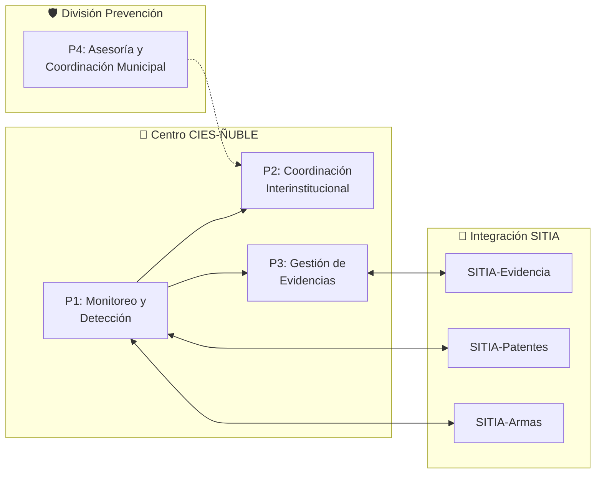
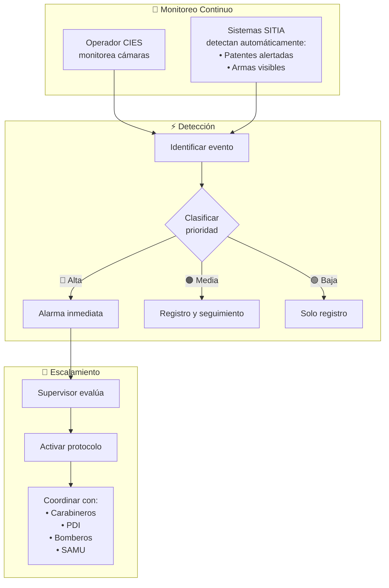
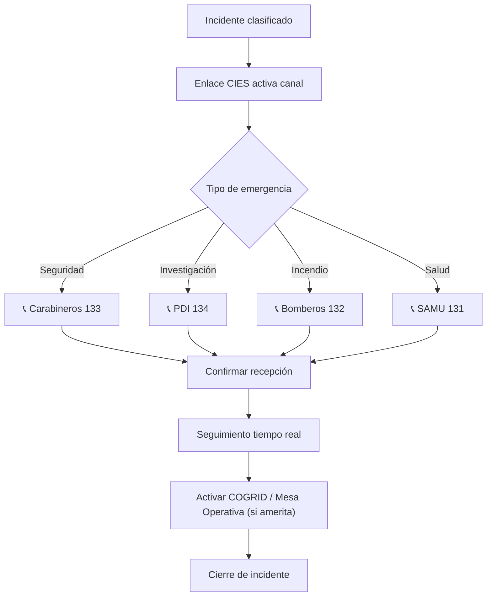
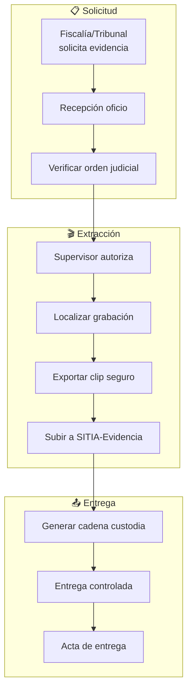
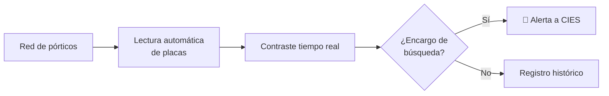
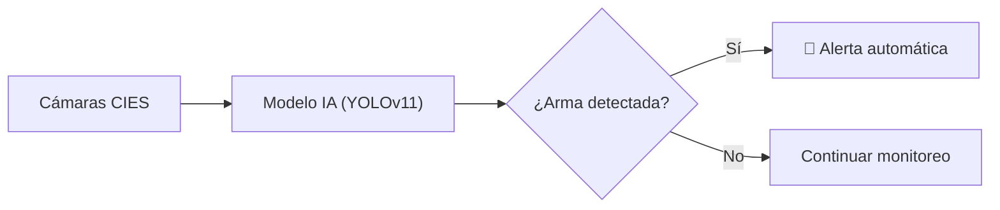
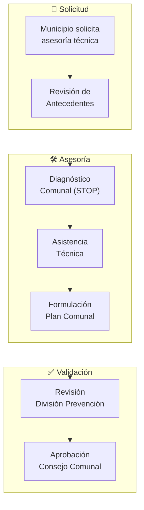

# D-SEG: Dominio de Seguridad Pública Regional

> Parte de: [GORE_OS Vision General](../vision_general.md)  
> Capa: Núcleo (Dimensión Táctica)  
> Función GORE: COORDINAR  

---

## Glosario D-SEG

| Término | Definición                                                                                         |
| :------ | :------------------------------------------------------------------------------------------------- |
| CIES    | Centro Integrado de Emergencias y Seguridad. Nodo (Hub) regional de monitoreo y coordinación 24/7. |
| SITIA   | Sistema Integrado de Televigilancia con Inteligencia Artificial. Plataforma tecnológica nacional.  |
| SPD     | Subsecretaría de Prevención del Delito. Ente rector técnico y financiero.                          |
| PTZ     | Pan-Tilt-Zoom. Cámaras robóticas controlables remotamente.                                         |
| LPR     | License Plate Recognition. Lectura automática de patentes vehiculares.                             |
| VMS     | Sistema de Gestión de Video (Video Management System). Software de gestión de video (HikCentral).  |
| IPR     | Inversión Pública Regional. Cartera de proyectos de inversión.                                     |
| COSOC   | Consejo de la Sociedad Civil. Instancia de participación ciudadana.                                |
| STOP    | Sistema Táctico de Operación Policial. Fuente de datos de delitos.                                 |
| ENUSC   | Encuesta Nacional Urbana de Seguridad Ciudadana. Fuente de percepción.                             |
| ANCI    | Agencia Nacional de Ciberseguridad (Ley 21.663).                                                   |
| COGRID  | Comité para Gestión del Riesgo de Desastres (ex-COE).                                              |
| L21730  | Ley 21.730 de Atribuciones en Seguridad para Gobiernos Regionales (2024).                          |

---

## Propósito

Gestionar las capacidades regionales de seguridad pública, integrando el Centro Integrado de Emergencias y Seguridad (CIES) con la inteligencia delictual, la prevención del delito y la coordinación interinstitucional.

> Visión: La región cuenta con un ecosistema de seguridad pública integrado que combina monitoreo tecnológico, coordinación multi-agencia y prevención basada en datos para reducir la victimización y aumentar la percepción de seguridad.

---

## Tres Pilares del Dominio

| Pilar      | Componentes                                            |
| ---------- | ------------------------------------------------------ |
| Prevención | Proyectos de iluminación, cámaras, intervención social |
| Monitoreo  | CIES, videovigilancia, SITIA                           |
| Respuesta  | Coordinación multi-agencia, evidencias                 |

---

## Módulos

### 1. CIES Ñuble

Contexto Operativo:

| Aspecto      | Detalle                                 |
| ------------ | --------------------------------------- |
| Cobertura    | 16 horas (08:00-00:00), proyección 24/7 |
| Ubicación    | Sala de monitoreo GORE Ñuble            |
| Coordinación | Policías, emergencias, 21 municipios    |
| Marco legal  | Ley 21.427, Ley 20.965, Ley 20.502      |

### 2. Prevención y Apoyo a Víctimas

Funciones División Prevención del Delito:
- Diseño de Políticas: Planes regionales de seguridad basados en evidencia (STOP/ENUSC).

- Asesoría Municipal: Asistencia técnica para planes comunales de seguridad.

- Apoyo a Víctimas: Gestión de programas de asistencia y reparación.

- Inversión Preventiva: Iluminación, televigilancia, recuperación de espacios.

### 3. Evidencias Digitales

Cadena de Custodia:

| Elemento        | Verificación      |
| --------------- | ----------------- |
| Hash de archivo | Integridad        |
| Metadatos       | Fecha/hora/cámara |
| Log de accesos  | Quién manipuló    |
| Firma digital   | Autenticidad      |

### 4. Gobernanza y Transparencia

Alcance:
- Coordinación del Consejo Regional de Seguridad Pública.
- Transparencia activa de inversiones a la ciudadanía (COSOC).
- Relacionamiento institucional con SPD y Ministerio del Interior.

---

## 📋 Procesos BPMN

### Mapa General (D09 CIES/SITIA)

| Campo      | Valor                                  |
| ---------- | -------------------------------------- |
| ID         | `DOM-CIES`                             |
| Criticidad | 🟠 Alta                                 |
| Dueño      | Jefe Div. Prevención / Supervisor CIES |

---

### P1: Monitoreo, Detección y Escalamiento

#### Clasificación de Incidentes

| Prioridad | Tipo                              | Acción                   |
| --------- | --------------------------------- | ------------------------ |
| 🔴 Alta    | Delito en curso, emergencia vital | Activación inmediata     |
| 🟠 Media   | Sospecha, situación anómala       | Seguimiento y evaluación |
| 🟢 Baja    | Evento menor                      | Solo documentar          |

---

### P2: Coordinación Interinstitucional

#### Protocolos de Comunicación

| Canal                  | Uso                           |
| ---------------------- | ----------------------------- |
| Radio VHF              | Comunicación directa policías |
| Líneas directas        | Centrales de emergencia       |
| WhatsApp institucional | Coordinación municipal        |
| Plataforma SITIA       | Integración nacional          |

---

### P3: Gestión de Evidencias Digitales

---

### Capacidades SITIA

#### SITIA-Patentes

#### SITIA-Armas

---

### P4: Asesoría y Coordinación Municipal

---

## 📝 Historias de Usuario por Módulo

### Catálogo por Proceso

#### P1: Monitoreo

| ID              | Título                         | Prioridad | Actor         |
| --------------- | ------------------------------ | --------- | ------------- |
| US-SEG-CIES-001 | Gestionar incidente            | Crítica   | Operador CIES |
| US-SEG-CIES-003 | Control PTZ cámara prioritaria | Crítica   | Operador CIES |
| US-SEG-CIES-004 | Alerta LPR/Prófugos            | Crítica   | Operador CIES |
| US-SEG-CIES-005 | Bitácora digital               | Alta      | Operador CIES |

#### P2: Coordinación

| ID              | Título                   | Prioridad | Actor           |
| --------------- | ------------------------ | --------- | --------------- |
| US-SEG-CIES-006 | Gestión sala crisis      | Crítica   | Supervisor CIES |
| US-SEG-CIES-007 | Derivación multi-agencia | Crítica   | Supervisor CIES |
| US-SEG-CIES-008 | Reporte operativo CIES   | Alta      | Supervisor CIES |

#### P3: Evidencias

| ID              | Título                     | Prioridad | Actor                 |
| --------------- | -------------------------- | --------- | --------------------- |
| US-SEG-EVID-001 | Extracción segura de video | Crítica   | Custodio de Evidencia |
| US-SEG-EVID-002 | Compartir con Fiscalía     | Crítica   | Custodio de Evidencia |
| US-SEG-EVID-003 | Cadena de custodia         | Crítica   | Custodio de Evidencia |

#### Prevención

| ID              | Título                        | Prioridad | Actor              |
| --------------- | ----------------------------- | --------- | ------------------ |
| US-SEG-PREV-001 | Mapa de calor delictual       | Crítica   | Enc. Prevención    |
| US-SEG-PREV-002 | Cartera proyectos preventivos | Crítica   | Enc. Prevención    |
| US-SEG-PREV-005 | Evaluar admisibilidad técnica | Alta      | Analista Proyectos |

*Ver catálogo completo en [kb_goreos_us_d-seg.yml](../user-stories/kb_goreos_us_d-seg.yml)*

---

## 🔗 Matriz de Trazabilidad (Historias de Usuario)

| Proceso BPMN     | Subproceso      | Historias de Usuario      |
| ---------------- | --------------- | ------------------------- |
| P1: Monitoreo    | Detección       | US-SEG-CIES-001           |
| P1: Monitoreo    | Control cámaras | US-SEG-CIES-003           |
| P1: Monitoreo    | Alertas SITIA   | US-SEG-CIES-004           |
| P1: Monitoreo    | Registro        | US-SEG-CIES-005, 002      |
| P2: Coordinación | Sala crisis     | US-SEG-CIES-006           |
| P2: Coordinación | Despacho        | US-SEG-CIES-007           |
| P2: Coordinación | Reportes        | US-SEG-CIES-008           |
| P3: Evidencias   | Extracción      | US-SEG-EVID-001           |
| P3: Evidencias   | Entrega         | US-SEG-EVID-002           |
| P3: Evidencias   | Custodia        | US-SEG-EVID-003           |
| Prevención       | Análisis        | US-SEG-PREV-001           |
| Prevención       | Cartera         | US-SEG-PREV-002, 005, 006 |
| Prevención       | Víctimas        | US-SEG-PREV-007           |
| Prevención       | Municipios      | US-SEG-PREV-008, 009      |

---

## Entidades de Datos

| Entidad              | Atributos Clave                                           | Relaciones                       |
| -------------------- | --------------------------------------------------------- | -------------------------------- |
| `Incidente`          | id, tipo, prioridad, id_ubicacion_geo, estado, fecha_hora | → AccionRespuesta[], Evidencia[] |
| `AccionRespuesta`    | id, id_incidente, tipo, agencia, tiempo_respuesta         | → Incidente                      |
| `Evidencia`          | id, id_incidente, tipo, hash, cadena_custodia             | → Incidente                      |
| `Proyecto_Seguridad` | hereda IPR + tipo_prevencion, validacion_spd              | → IPR, ConvenioMunicipal         |

---

## Sistemas Involucrados

| Sistema               | Función             |
| --------------------- | ------------------- |
| `SYS-HIKCENTRAL`      | VMS gestión cámaras |
| `SYS-SITIA`           | Plataforma nacional |
| `SYS-SITIA-EVIDENCIA` | Gestión evidencias  |
| `SYS-SITIA-PATENTES`  | Lectura placas      |
| `SYS-SITIA-ARMAS`     | Detección IA        |

---

## Normativa Aplicable

| Norma      | Alcance                                   |
| ---------- | ----------------------------------------- |
| Ley 21.427 | Sistema Nacional Seguridad                |
| Ley 20.965 | Cámaras vigilancia                        |
| Ley 20.502 | ONEMI/funcionamiento                      |
| Ley 19.628 | Protección vida privada                   |
| Ley 21.730 | Atribuciones en Seguridad GORE (Nov 2024) |
| Ley 21.663 | Marco de Ciberseguridad (ANCI)            |

---

## Referencias Cruzadas

| Dominio | Relación                                         |
| ------- | ------------------------------------------------ |
| D-FIN   | Proyecto_Seguridad hereda de IPR                 |
| D-NORM  | Convenios con municipios, evidencias             |
| D-TERR  | Georreferenciación cámaras e incidentes          |
| D-GOB   | Actores de respuesta (Carabineros, PDI, etc.)    |
| D-BACK  | Gestión financiera del equipamiento CIES y flota |

---

*Documento parte de GORE_OS Blueprint Integral v5.0*  
*Última actualización: 2025-12-16*
