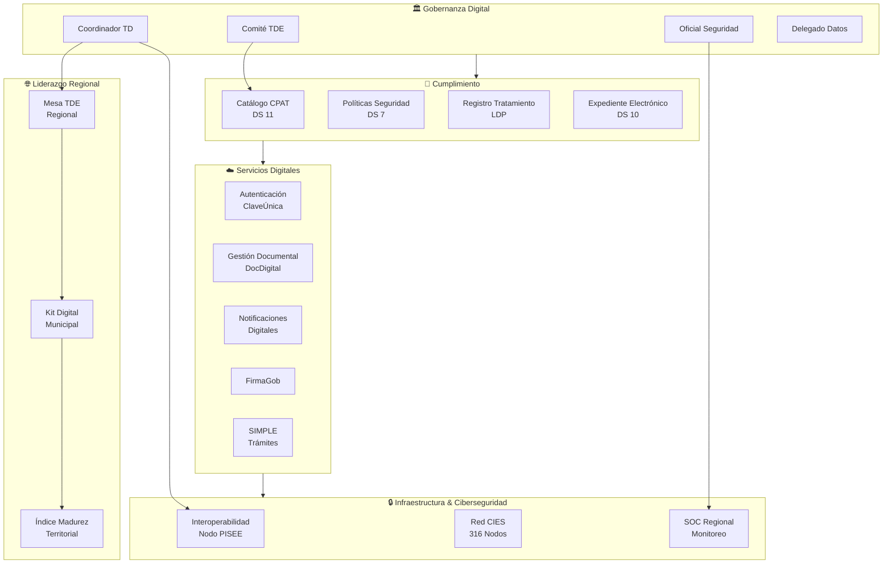
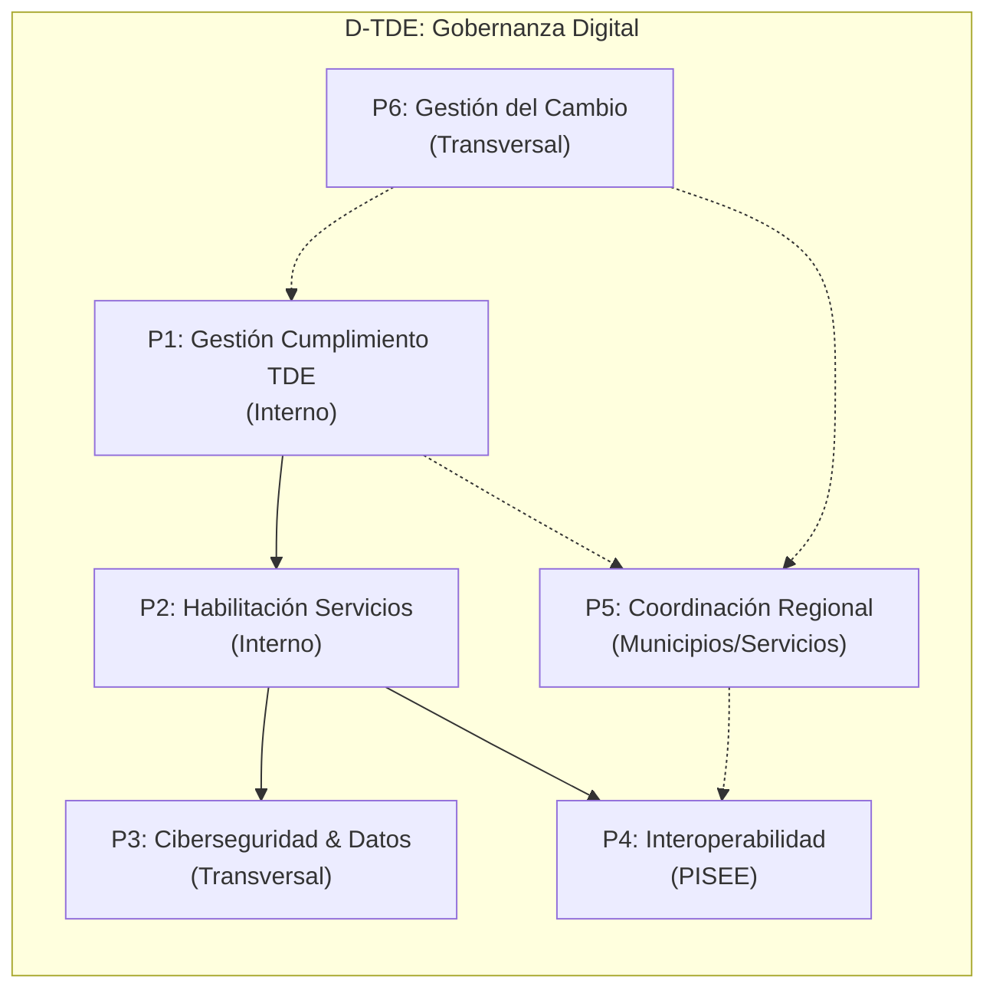
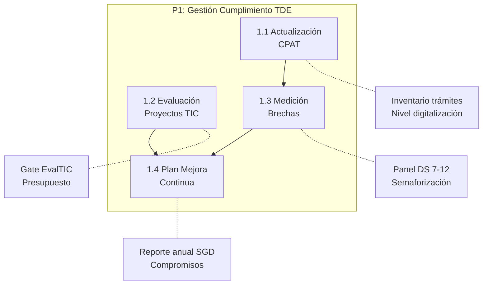
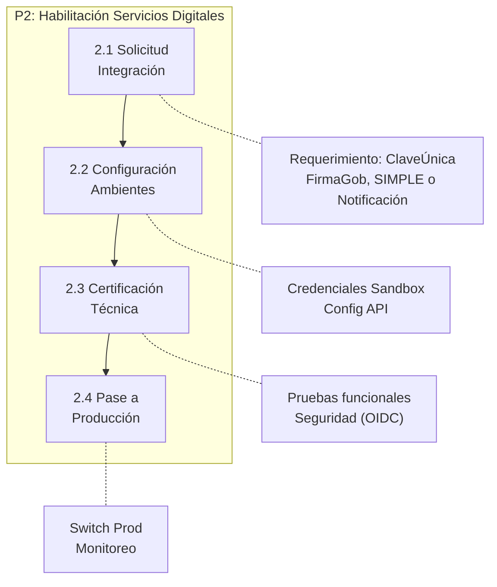
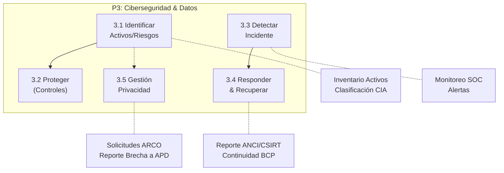
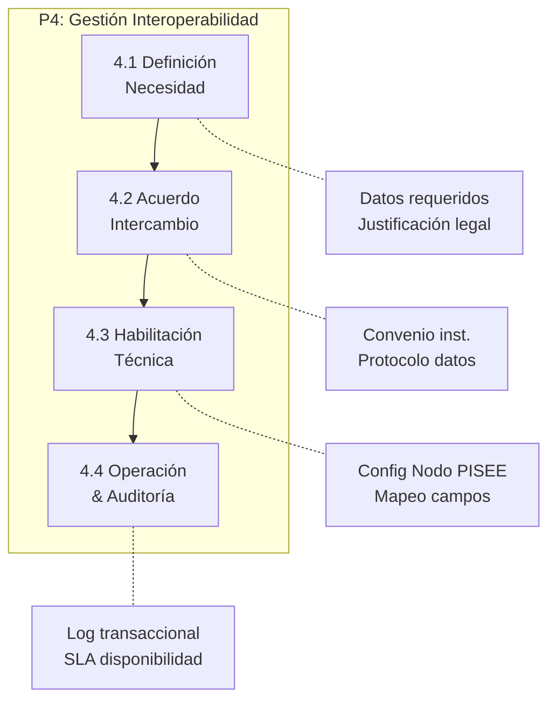
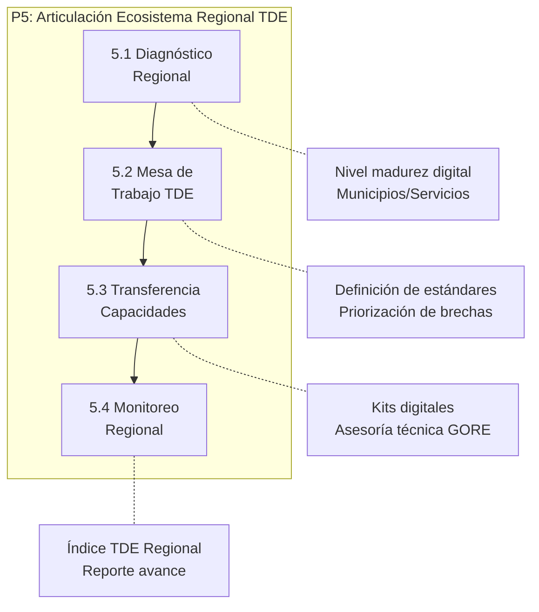
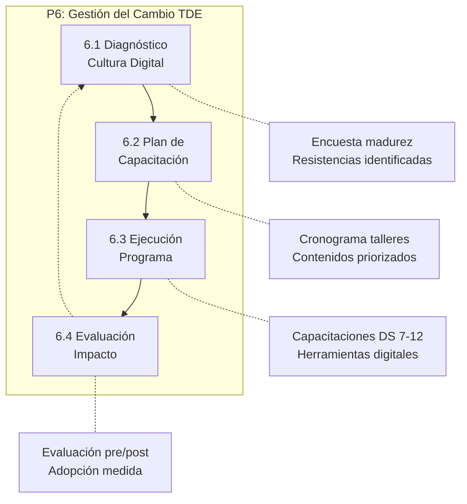
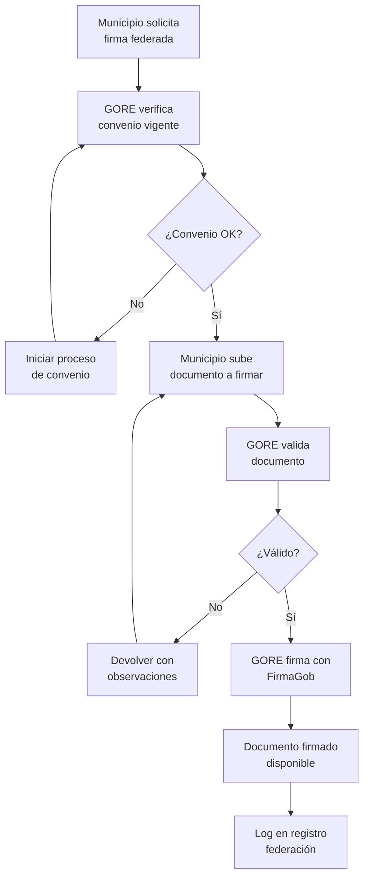

# D-TDE: Dominio de Gobernanza Digital

> Parte de: [GORE_OS Vision General](../vision_general.md)
> Capa: Habilitante (Dimensión Tecnológica)  
> Función GORE: GESTIONAR (Soporte Digital)  
> División: DAF (Departamento Informática) / Unidad de Transformación Digital

---

## Glosario D-TDE

| Término                           | Sigla | Definición                                                                             |
| --------------------------------- | ----- | -------------------------------------------------------------------------------------- |
| Transformación Digital del Estado | TDE   | Proceso de cambio cultural y tecnológico para mejorar servicios públicos (Ley 21.180). |
| Plataforma Integ. Serv. Estado    | PISEE | Bus de interoperabilidad del Estado para intercambio de datos entre instituciones.     |
| Coord. Transformación Digital     | CTD   | Rol encargado de liderar la Transformación Digital en la institución.                  |
| Oficial Seguridad Información     | CISO  | Responsable de la gestión de riesgos de seguridad de la información.                   |
| Delegado Protección Datos         | DPO   | Rol responsable de garantizar el cumplimiento de la Ley de Protección de Datos.        |
| Equipo Resp. Incidentes           | CSIRT | Centro de Respuesta ante Incidentes de Seguridad Informática del Gobierno.             |
| Catálogo Procedimientos           | CPAT  | Inventario oficial de trámites y procedimientos administrativos de la institución.     |
| Identidad Única Estado            | IUIe  | Código único que identifica un expediente electrónico en el Estado.                    |
| Derechos ARCO                     | ARCO  | Derechos de Acceso, Rectificación, Cancelación y Oposición sobre datos personales.     |
| Esquema Nac. Seguridad Inf.       | ENSI  | Conjunto de normas y estándares de seguridad (DS 7) basados en ISO 27001/NIST.         |
| Agencia Nac. Ciberseguridad       | ANCI  | Organismo rector y fiscalizador de la ciberseguridad (Ley 21.663). Sucesora del CSIRT. |
| Agencia Protección Datos          | APD   | Organismo autónomo que fiscaliza el cumplimiento de la Ley 21.719.                     |
| SIMPLE                            | -     | Plataforma de gestión de trámites del Estado para digitalización de procedimientos.    |
| Domicilio Digital Único           | DDU   | Casilla electrónica oficial para recibir notificaciones del Estado (DS 8).             |
| Documento Electrónico             | DE    | Documento nativo digital con validez legal equivalente al papel (DS 9).                |
| Expediente Electrónico            | EE    | Conjunto ordenado de documentos electrónicos con foliado e IUIe (DS 10).               |
| Single Sign-On                    | SSO   | Autenticación única para acceso a múltiples sistemas (DS 12, ClaveÚnica).              |

### Normas Técnicas TDE (DS 7-12)

| Decreto | Materia                    | Descripción                                                    |
| ------- | -------------------------- | -------------------------------------------------------------- |
| DS 7    | Seguridad                  | Norma técnica de seguridad de la información (ISO 27001/NIST). |
| DS 8    | Notificaciones             | Notificaciones electrónicas y domicilio digital único.         |
| DS 9    | Documento Electrónico      | Estándares para documentos electrónicos oficiales.             |
| DS 10   | Expediente Electrónico     | Estructura, foliado, IUIe y trazabilidad de expedientes.       |
| DS 11   | Catálogo (CPAT)            | Inventario y clasificación de procedimientos administrativos.  |
| DS 12   | Autenticación (ClaveÚnica) | Single Sign-On y niveles de autenticación (LoA).               |

---

## Propósito

Gestionar la gobernanza digital del GORE bajo un modelo de **doble mandato** unificado con el Framework ORKO:

1. **Cumplimiento Normativo Interno (Piso / Floor)**: Asegurar que el GORE cumpla con la Ley 21.180, Ley 21.663, Ley 21.719 y DS 7-12. Esto constituye el **Primitivo ORKO P4 (Límite)**: la base obligatoria sobre la cual se construye la evolución.

2. **Liderazgo Digital Regional (Habilitador)**: Articular el ecosistema digital territorial. Esto habilita el **Primitivo ORKO P1 (Capacidad)** al extender la madurez hacia el territorio.

> Visión Integrada: D-TDE es el vehículo de **Digitalización** (L1) que alimenta el motor de **Evolución** (L2-L5) de D-EVOL.
> **Principio de No Bloqueo:** El cumplimiento de TDE es un *Habilitador de Línea Base*. La ausencia de conformidad total no debe detener "Fast Tracks" de innovación en capas superiores (D-EVOL/D-FENIX) siempre que se respeten los límites de seguridad (P4).

Fundamento Legal: Ley 21.180 (TDE), Ley 21.663 (Ciberseguridad), Ley 21.719 (Datos Personales), DS 7-12/2020 (Normas Técnicas), Ley 19.175 Art. 16 (funciones de coordinación regional).

### Diagnóstico de Brechas Prioritarias (Absorción PTD / PMG-MEI)

El diagnóstico institucional (corte Junio 2025) identifica brechas críticas que este dominio debe resolver con máxima prioridad para cumplir el mandato normativo:

| Dimensión             | Brecha Crítica (Diagnóstico PTD)                                   | Estado  | Meta D-TDE          |
| --------------------- | ------------------------------------------------------------------ | ------- | ------------------- |
| **Interoperabilidad** | Ausencia crítica de integración con PISEE y OAE (ClaveÚnica, etc). | 0%      | 100% (M3/P4)        |
| **Gestión de Datos**  | Inexistencia de gobernanza, visión estratégica y calidad de datos. | 0%      | L3 Definido (M1/P3) |
| **Expediente Elec.**  | Incumplimiento de Ley 21.180 (DS 10) y falta de trazabilidad.      | 8%      | 100% (M7)           |
| **Autenticación**     | Bajo porcentaje de trámites integrados con ClaveÚnica.             | 8%      | 100% (M2)           |
| **Calidad Web**       | Deficiencias en arquitectura de información y atención ciudadana.  | Parcial | 100% (M1)           |

> **Nota de Absorción**: Las iniciativas del "Plan de Transformación Digital 2026-2029" (Res. Ex. 02034) han sido reformuladas e integradas como Historias de Usuario en este dominio para asegurar una ejecución coherente y acelerada, descartando sus cronogramas originales por ser incompatibles con la urgencia del GORE_OS.

### Matriz de Absorción PTD → D-TDE (15/15 Iniciativas)

| PTD ID    | Iniciativa Original                | US D-TDE Absorbente        | Prioridad |
| --------- | ---------------------------------- | -------------------------- | --------- |
| D1-01     | Autenticación ClaveÚnica           | US-TDE-AUTH-001            | Crítica   |
| D1-02     | Interoperabilidad PISEE            | US-TDE-INTEROP-001/002/003 | Crítica   |
| D1-03     | Notificaciones Electrónicas        | US-TDE-NOTIF-001           | Crítica   |
| D1-04     | Digitalización Ingreso Solicitudes | US-TDE-DIGITAL-001         | Alta      |
| D1-05     | Expediente Electrónico             | US-TDE-EXP-001/002/003/004 | Crítica   |
| D1-06     | DocDigital Comunicaciones          | US-TDE-DOCDIG-001          | Crítica   |
| D2.1-AI4  | Arq. Información Web               | US-TDE-WEB-001             | Media     |
| D2.1-TE9  | Tecnología Web                     | US-TDE-WEB-002             | Media     |
| D2.1-AC10 | Atención Ciudadana Web             | US-TDE-WEB-003             | Media     |
| D2.2-CL5  | Lenguaje Claro Servicio            | US-TDE-SERV-001            | Media     |
| D2.2-AI10 | Arq. Info Servicio Digital         | US-TDE-SERV-002            | Media     |
| D2.2-EG17 | Enfoque de Género                  | US-TDE-SERV-001            | Media     |
| D3-VE-01  | Visión Estratégica Datos           | US-TDE-DATA-001            | Crítica   |
| D3-GO-01  | Gobernanza Datos                   | US-TDE-DATA-001/002        | Crítica   |
| D3-AD-01  | Arquitectura/Doc Datos             | US-TDE-DATA-002/003        | Alta      |

---

## Roles y Actores D-TDE

| Rol                      | Responsabilidad en D-TDE                                  | Módulos Principales |
| ------------------------ | --------------------------------------------------------- | ------------------- |
| **Agente: Digitrans**    | **Guardián del Piso Normativo**. Monitoreo continuo 24/7. | **Transversal**     |
| Coordinador TD (CTD)     | Liderar TDE, coordinar cumplimiento, articular regional   | M1, M3, M5, M6      |
| Oficial Seguridad (CISO) | Gestión de riesgos, incidentes, cumplimiento DS 7         | M4                  |
| Delegado Datos (DPO)     | Cumplimiento Ley 21.719, solicitudes ARCO                 | M4                  |
| Administrador TI         | Operación técnica, integraciones, infraestructura         | M2, M3, M7          |
| Encargado CPAT           | Mantener catálogo de procedimientos, niveles 0-5          | M1                  |
| Encargado Expediente     | Gestión expediente electrónico, foliado, IUIe             | M7                  |
| Encargado Regional TDE   | Diagnóstico municipal, capacitación, mesa regional        | M5, M6              |
| Jefe DAF                 | Supervisión recursos TI, presupuesto proyectos TIC        | Transversal         |
| Comité TDE               | Gobernanza estratégica, priorización, aprobaciones        | Todos               |

---

## Diagrama de Dominio

---

## Módulos

### M1: Cumplimiento TDE

| Atributo    | Descripción                                                                         |
| ----------- | ----------------------------------------------------------------------------------- |
| Propósito   | Gestionar el ciclo de vida de digitalización de trámites y calidad de servicio      |
| Componentes | CPAT, Medición de Satisfacción, Plan de Mejora Continua                             |
| ORKO Link   | **Habilita P4: Límite**. El cumplimiento es la restricción habilitante del sistema. |

Funcionalidades:

- Gestión del Catálogo de Procedimientos (CPAT) nivel 0-5
- Programa de Gestión del Cambio y Alfabetización Digital Funcionaria
- Panel de cumplimiento decretos DS 7-12
- Gate de evaluación de proyectos TIC (EvalTIC)

### M2: Servicios Digitales Habilitantes

| Atributo    | Descripción                                                              |
| ----------- | ------------------------------------------------------------------------ |
| Propósito   | Proveer capacidades transversales de identidad y gestión administrativa  |
| Componentes | Broker ClaveÚnica, Integrador DocDigital, Motor Notificaciones, SIMPLE   |
| ORKO Link   | **Habilita P1: Capacidad**. Servicios básicos para la operación digital. |

Funcionalidades:

- Autenticación centralizada (SSO) con ClaveÚnica (OIDC/DS 12)
- Firma electrónica avanzada y simple (FirmaGob)
- Notificaciones electrónicas legales (DS 8) con domicilio digital
- Integración con SIMPLE para gestión de trámites digitalizados
- Gestión de domicilio digital único (DDU)

### M3: Interoperabilidad Regional

| Atributo    | Descripción                                                            |
| ----------- | ---------------------------------------------------------------------- |
| Propósito   | Facilitar el intercambio de datos con el ecosistema público            |
| Componentes | Nodo PISEE, Gestor de Convenios, API Gateway                           |
| ORKO Link   | **Habilita P2: Flujo**. Movimiento de información entre instituciones. |

Funcionalidades:

- Consumo y publicación de servicios web SOAP/REST
- Gestión de acuerdos de intercambio de información
- Trazabilidad centralizada de transacciones de datos

### M4: Ciberseguridad & Protección de Datos

| Atributo    | Descripción                                                                 |
| ----------- | --------------------------------------------------------------------------- |
| Propósito   | Proteger la confidencialidad, integridad y disponibilidad de la información |
| Componentes | ISMS, Gestión Incidentes, Privacy Hub                                       |

Funcionalidades:

- Gestión de activos de información y análisis de riesgos (DS 7)
- Reporte automático de incidentes a ANCI/CSIRT
- Gestión de consentimientos y solicitudes ARCO (Ley 21.719)
- Plan de continuidad operativa (BCP/DRP)

### M5: Liderazgo Digital Regional (Gobernanza Expandida)

| Atributo    | Descripción                                                                         |
| ----------- | ----------------------------------------------------------------------------------- |
| Propósito   | Liderar y articular el ecosistema digital regional (Municipios, Servicios Públicos) |
| Componentes | Mesa Regional TDE, Kit Digital Municipal, CSIRT Regional (Coordinación)             |

Funcionalidades:

- Diagnóstico de madurez digital municipal (21 comunas)
- Transferencia de capacidades y estándares TDE a municipios (especialmente zonas rezagadas)
- Coordinación de Mesa Regional de Transformación Digital
- Articulación de respuestas ante ciberataques a nivel regional (Red de CISO regionales)
- Compartición de activos digitales (software público regional)
- Capacitación y acompañamiento técnico a equipos municipales

### M6: Vinculación Territorial Digital

| Atributo     | Descripción                                                                    |
| ------------ | ------------------------------------------------------------------------------ |
| Propósito    | Proveer soluciones tecnológicas compartidas a los municipios (Economía Escala) |
| Beneficiario | Municipios y Servicios Públicos Locales                                        |

Funcionalidades:

- Gestión centralizada de Firmas Electrónicas Municipales (Convenio Marco)
- API Gateway Regional para interoperabilidad municipal (DIDECO, DOM, Tránsito)
- Soporte de infraestructura crítica y conectividad (Zonas Rezagadas)
- Monitoreo de Índice de Madurez TDE por comuna

### M7: Expediente Electrónico

| Atributo    | Descripción                                                               |
| ----------- | ------------------------------------------------------------------------- |
| Propósito   | Gestionar el ciclo de vida del expediente electrónico conforme a DS 10    |
| Componentes | Generador IUIe, Motor de Foliado, Integración DocDigital, Archivo Digital |
| ORKO Link   | **Habilita P3: Información**. Estructuración de la verdad administrativa. |

Funcionalidades:

- Generación automática de Identidad Única de Expediente (IUIe)
- Foliado electrónico automático y secuencial
- Integración con DocDigital para documentos oficiales
- Trazabilidad completa de acciones sobre expediente
- Archivo digital con retención conforme a normativa
- Consulta ciudadana de estado de expediente

---

## Procesos BPMN

### Mapa General de Procesos

---

### P1: Gestión Cumplimiento TDE

Actores: CTD, Comité TDE, Unidades de Negocio  
Frecuencia: Semestral (Reporte SGD) / Por proyecto

---

### P2: Habilitación Servicios Digitales

Actores: Desarrolladores, Administrador TI, CTD  
Frecuencia: A demanda (nuevos sistemas)

---

### P3: Ciberseguridad & Protección Datos

Actores: CISO, DPO, NOC/SOC, ANCI, Agencia Protección Datos  
Frecuencia: Continua (Monitoreo) / Incidentes

---

### P4: Gestión Interoperabilidad

Actores: CTD, Contraparte (Institución), Jurídica  
Frecuencia: A demanda

---

### P5: Articulación Ecosistema Regional

Actores: Gobernador, CTD GORE, Alcaldes, Jefes Servicios  
Frecuencia: Trimestral (Mesa) / Continua (Apoyo)

---

### P6: Gestión del Cambio TDE

Actores: CTD, RRHH (DAF), Jefaturas de División  
Frecuencia: Anual (Plan) / Continua (Ejecución)

---

### P7: Federación de Firma Municipal

Actores: GORE (CTD/Jurídica), Municipios (Contraparte)  
Frecuencia: Bajo demanda  
Módulo: M5 (Liderazgo Digital Regional)

---

## Catálogo de Historias de Usuario

### US Cumplimiento TDE (P1)

| ID                 | Título                           | Prioridad |
| ------------------ | -------------------------------- | --------- |
| US-TDE-CALIDAD-001 | Mantener Catálogo de Plataformas | Alta      |
| US-TDE-AVANCE-001  | Panel de avance TDE              | Alta      |
| US-TDE-CPAT-001    | Actualizar niveles CPAT          | Crítica   |
| US-TDE-CPAT-002    | Priorizar trámites a digitalizar | Alta      |

### US Servicios Digitales (P2)

| ID                 | Título                                   | Prioridad |
| ------------------ | ---------------------------------------- | --------- |
| US-TDE-AUTH-001    | Integrar ClaveÚnica OIDC                 | Crítica   |
| US-TDE-NOTIF-001   | Integrar Plataforma Notificaciones       | Crítica   |
| US-TDE-SIMPLE-001  | Publicar trámite en SIMPLE               | Alta      |
| US-TDE-FIRMA-001   | Habilitar firma electrónica              | Crítica   |
| US-TDE-FIRMA-002   | Conmutar Firma (FirmaGob ↔ Contingencia) | Alta      |
| US-TDE-DOCDIG-001  | Integrar DocDigital (Comms Oficiales)    | Crítica   |
| US-TDE-DOCDIG-002  | Generar Resolución con Link CeroPapel    | Alta      |
| US-TDE-DOCDIG-003  | Tramitar Convenios por DocDigital        | Alta      |
| US-TDE-DIGITAL-001 | Digitalizar Ingreso Solicitudes          | Alta      |

### US Ciberseguridad (P3)

| ID             | Título                             | Prioridad |
| -------------- | ---------------------------------- | --------- |
| US-TDE-SEG-001 | Inventariar activos TI             | Crítica   |
| US-TDE-SEG-002 | Evaluar riesgos DS 7               | Crítica   |
| US-TDE-SEG-003 | Implementar controles              | Alta      |
| US-TDE-SEG-004 | Reportar incidentes a ANCI         | Crítica   |
| US-TDE-SEG-005 | Asegurar cifrado TLS y en reposo   | Alta      |
| US-TDE-SEG-006 | Gestionar incidentes (CSIRT)       | Crítica   |
| US-TDE-SEG-007 | Configurar políticas IAM           | Crítica   |
| US-TDE-SEG-008 | Auditar logs acceso sensibles      | Alta      |
| US-TDE-SEG-009 | Simulaciones Phishing              | Alta      |
| US-TDE-SEG-010 | Auditar trazabilidad DS9           | Alta      |
| US-TDE-SEG-011 | Privacidad por diseño              | Alta      |
| US-TDE-SEG-012 | Generar Resolución Encargado Ciber | Alta      |
| US-TDE-SEG-013 | Inscribir GORE en Plataforma ANCI  | Crítica   |
| US-TDE-DPO-001 | Gestionar Solicitudes ARCO         | Crítica   |
| US-TDE-DPO-002 | Mantener registro tratamiento      | Alta      |

### US Gobernanza Datos & Calidad (Absorción PMG)

| ID              | Título                                    | Prioridad | PTD Origen          |
| --------------- | ----------------------------------------- | --------- | ------------------- |
| US-TDE-DATA-001 | Formalizar Política Gobernanza Datos      | Crítica   | D3-VE-01, D3-GO-01  |
| US-TDE-DATA-002 | Levantar Inventario Activos Datos         | Alta      | D3-AD-01            |
| US-TDE-DATA-003 | Establecer Directrices Metadatos          | Alta      | D3-AD-01            |
| US-TDE-WEB-001  | Mejorar Arq. Información Web GORE         | Media     | D2.1-AI4            |
| US-TDE-WEB-002  | Optimizar Tecnología Web (HTML5/W3C)      | Media     | D2.1-TE9            |
| US-TDE-WEB-003  | Mejorar Atención Ciudadana Web (FAQ/Chat) | Media     | D2.1-AC10           |
| US-TDE-SERV-001 | Aplicar Lenguaje Claro y Género           | Media     | D2.2-CL5, D2.2-EG17 |
| US-TDE-SERV-002 | Mejorar Arq. Info Servicio Digital        | Media     | D2.2-AI10           |

### US Interoperabilidad (P4)

| ID                 | Título                    | Prioridad |
| ------------------ | ------------------------- | --------- |
| US-TDE-INTEROP-001 | Habilitar Nodo PISEE      | Crítica   |
| US-TDE-INTEROP-002 | Publicar servicio web     | Alta      |
| US-TDE-INTEROP-003 | Consumir servicio externo | Alta      |

### US Liderazgo Regional (P5)

| ID              | Título                              | Prioridad |
| --------------- | ----------------------------------- | --------- |
| US-TDE-REG-001  | Convocar Mesa Regional TDE          | Alta      |
| US-TDE-REG-002  | Disponibilizar Kit Digital Muni     | Alta      |
| US-TDE-REG-003  | Diagnosticar madurez municipal      | Crítica   |
| US-TDE-REG-004  | Capacitar equipos municipales       | Alta      |
| US-TDE-REG-005  | Monitorear Índice TDE Regional      | Alta      |
| US-TDE-REG-006  | Coordinar respuesta ciberincidentes | Crítica   |
| US-TDE-REG-007  | Federar Firma Municipal             | Crítica   |
| US-TDE-REG-009  | Instancia SIMPLE Regional           | Crítica   |
| US-TDE-REG-010  | Habilitar ClaveÚnica Macro          | Crítica   |
| US-TDE-VINC-001 | Gestionar Firmas Municipales        | Alta      |
| US-TDE-VINC-002 | Habilitar API Gateway Municipal     | Alta      |

### US Expediente Electrónico (M7)

| ID             | Título                         | Prioridad |
| -------------- | ------------------------------ | --------- |
| US-TDE-EXP-001 | Generar IUIe automático        | Crítica   |
| US-TDE-EXP-002 | Foliar documentos electrónicos | Crítica   |
| US-TDE-EXP-003 | Consultar estado expediente    | Alta      |
| US-TDE-EXP-004 | Archivar expediente cerrado    | Alta      |

### US Gestión del Cambio (P6)

| ID                | Título                         | Prioridad |
| ----------------- | ------------------------------ | --------- |
| US-TDE-CAMBIO-001 | Diagnosticar cultura digital   | Alta      |
| US-TDE-CAMBIO-002 | Ejecutar plan capacitación TDE | Alta      |
| US-TDE-CAMBIO-003 | Evaluar adopción herramientas  | Alta      |

---

## Entidades de Datos

### Gobernanza y Calidad de Datos

| Entidad         | Atributos Clave                                     | Relaciones      |
| --------------- | --------------------------------------------------- | --------------- |
| `PoliticaDatos` | id, version, fecha_aprobacion, principios[]         | → ActivoDatos   |
| `ActivoDatos`   | id, nombre, fuente, id_propietario, puntaje_calidad | → PoliticaDatos |
| `TerminoDatos`  | id, termino, definicion, tipo_dato, formato         | → ActivoDatos   |

### Cumplimiento Normativo

| Entidad         | Atributos Clave                           | Relaciones           |
| --------------- | ----------------------------------------- | -------------------- |
| `RegulacionTDE` | id, codigo, nombre, vigente_desde         | → ItemCumplimiento[] |
| `Procedimiento` | id, nombre, nivel_digital, cpat_id        | → PlanDigital        |
| `Plataforma`    | id, nombre, linea_base, id_responsable_ti | → ActivoTI           |

### Gobernanza y Seguridad

| Entidad         | Atributos Clave                               | Relaciones              |
| --------------- | --------------------------------------------- | ----------------------- |
| `ActivoTI`      | id, nombre, clasificacion_cia, id_propietario | → Riesgo[], Incidente[] |
| `Incidente`     | id, fecha, tipo, severidad, estado_anci       | → ActivoTI[]            |
| `Riesgo`        | id, id_activo, amenaza, probabilidad, impacto | → ControlSeguridad      |
| `SolicitudARCO` | id, titular, tipo_derecho, fecha, estado      | → TratamientoDatos      |

### Expediente Electrónico

| Entidad                 | Atributos Clave                                                    | Relaciones               |
| ----------------------- | ------------------------------------------------------------------ | ------------------------ |
| `ExpedienteElectronico` | id, iuie, fecha_creacion, estado, tipo_procedimiento, total_folios | → DocumentoElectronico[] |
| `DocumentoElectronico`  | id, id_expediente, folio, hash, timestamp, tipo_doc                | → ExpedienteElectronico  |
| `AccionExpediente`      | id, id_expediente, accion, funcionario_id, timestamp               | → ExpedienteElectronico  |

### Interoperabilidad y Regional

| Entidad                   | Atributos Clave                                          | Relaciones                |
| ------------------------- | -------------------------------------------------------- | ------------------------- |
| `ServicioPISEE`           | id, nombre, proveedor, endpoint, wsdl_swagger            | → AcuerdoIntercambioDatos |
| `AcuerdoIntercambioDatos` | id, id_servicio, institucion_origen, institucion_destino | → TransaccionPISEE[]      |
| `EntidadRegional`         | id, nombre, tipo (Muni/Servicio), nivel_madurez_tde      | → FuerzaTareaTDE          |
| `DiagnosticoMuni`         | id, id_entidad, fecha, puntajes_dimension, brechas[]     | → EntidadRegional         |
| `PlanCapacitacion`        | id, id_entidad, objetivos, cronograma, estado            | → EntidadRegional         |
| `IndiceMadurezTDE`        | id, periodo, id_entidad, puntaje_global, dimensiones[]   | → EntidadRegional         |

### Gestión del Cambio

| Entidad              | Atributos Clave                                        | Relaciones             |
| -------------------- | ------------------------------------------------------ | ---------------------- |
| `PlanCambio`         | id, año, objetivos, cronograma, estado                 | → SesionCapacitacion[] |
| `SesionCapacitacion` | id, id_plan, tema, fecha, total_asistentes, evaluacion | → PlanCambio           |
| `EvaluacionAdopcion` | id, funcionario_id, puntaje_pre, puntaje_post, fecha   | → SesionCapacitacion   |

---

## Indicadores D-TDE

| KPI                               | Definición                                                  | Meta        |
| --------------------------------- | ----------------------------------------------------------- | ----------- |
| % Cumplimiento DS 7-12            | Normas cumplidas / Total normas aplicables                  | ≥ 90%       |
| Nivel CPAT promedio               | Promedio nivel digitalización trámites GORE                 | ≥ 3.5       |
| Tiempo medio resolución ARCO      | Días promedio para resolver solicitudes de datos personales | ≤ 15 días   |
| Incidentes reportados a ANCI      | Cantidad de incidentes de seguridad reportados en plazo     | 100%        |
| Servicios PISEE activos           | Cantidad de servicios de interoperabilidad publicados       | ≥ 10        |
| Índice TDE Regional               | Promedio ponderado de madurez digital de 21 comunas         | ≥ 2.5 (L2+) |
| Municipios con Kit Digital        | Municipios con Kit Digital implementado / Total municipios  | ≥ 80%       |
| Funcionarios capacitados TDE      | Funcionarios GORE con capacitación TDE vigente / Dotación   | ≥ 90%       |
| Expedientes 100% digitales        | Expedientes con IUIe y foliado completo / Total expedientes | ≥ 95%       |
| Disponibilidad servicios críticos | Uptime de ClaveÚnica, FirmaGob, Notificaciones              | ≥ 99.5%     |

---

## Sistemas Involucrados

| Sistema            | Rol                                              | Dominio |
| ------------------ | ------------------------------------------------ | ------- |
| GORE OS            | Plataforma central de gestión                    | D-TDE   |
| Plataformas Estado | ClaveÚnica, DocDigital, FirmaGob, Notificaciones | Externo |
| SIMPLE             | Gestión de trámites digitalizados                | Externo |
| PISEE              | Bus de interoperabilidad                         | Externo |
| ANCI/CSIRT         | Plataforma de reporte de incidentes              | Externo |

---

## Normativa Aplicable

| Norma      | Descripción                                |
| ---------- | ------------------------------------------ |
| Ley 21.180 | Transformación Digital del Estado          |
| Ley 21.663 | Ley Marco de Ciberseguridad (ANCI)         |
| Ley 21.719 | Protección de Datos Personales             |
| DS 7/2020  | Norma Técnica de Seguridad                 |
| DS 8/2020  | Norma Técnica de Notificaciones            |
| DS 9/2020  | Norma Técnica de Documento Electrónico     |
| DS 10/2020 | Norma Técnica de Expediente Electrónico    |
| DS 11/2020 | Norma Técnica de Catálogo (CPAT)           |
| DS 12/2020 | Norma Técnica de Autenticación (SSO)       |
| Ley 19.175 | LOC GORE - Art. 16 (Coordinación Regional) |

---

## Referencias Cruzadas

| Dominio   | Relación                                                                                                                                                                                                      | Entidades Compartidas                         |
| --------- | ------------------------------------------------------------------------------------------------------------------------------------------------------------------------------------------------------------- | --------------------------------------------- |
| D-NORM    | Expediente electrónico debe cumplir DS 10 del TDE                                                                                                                                                             | ExpedienteElectronico                                |
| FÉNIX     | Fallas críticas de ciberseguridad activan intervención                                                                                                                                                        | Incident                                      |
| D-BACK    | Integración de sistemas administrativos con ClaveÚnica                                                                                                                                                        | ActivoTI                                       |
| D-SEG     | Infraestructura de red CIES gestionada bajo normas TDE                                                                                                                                                        | ActivoTI                                       |
| D-GOB     | Liderazgo político del Gobernador en Mesa Regional TDE                                                                                                                                                        | EntidadRegional                                |
| D-PLAN    | Liderazgo TDE regional alineado con ERD (Eje Modernización)                                                                                                                                                   | TDEMaturityIndex                              |
| D-GESTION | Indicadores TDE como dimensión del H_gore                                                                                                                                                                     | Indicator                                     |
| D-EVOL    | **Piso vs Techo**: D-TDE provee piso normativo (L2), D-EVOL construye techo estratégico (L3-L5). `TDEScore` es input duro de `H_org.Gobernanza(P4)`. M5/M6 alimentan el Repositorio Arquitectónico de D-EVOL. | Capability, H_org, TDEScore, IndiceMadurezTDE |
| D-TERR    | Capas geoespaciales deben cumplir metadatos TDE (DS 9/10).                                                                                                                                                    | DocumentoElectronico                          |

---

*Documento parte de GORE_OS Blueprint Integral v5.5*  
*Última actualización: 2025-12-18*
