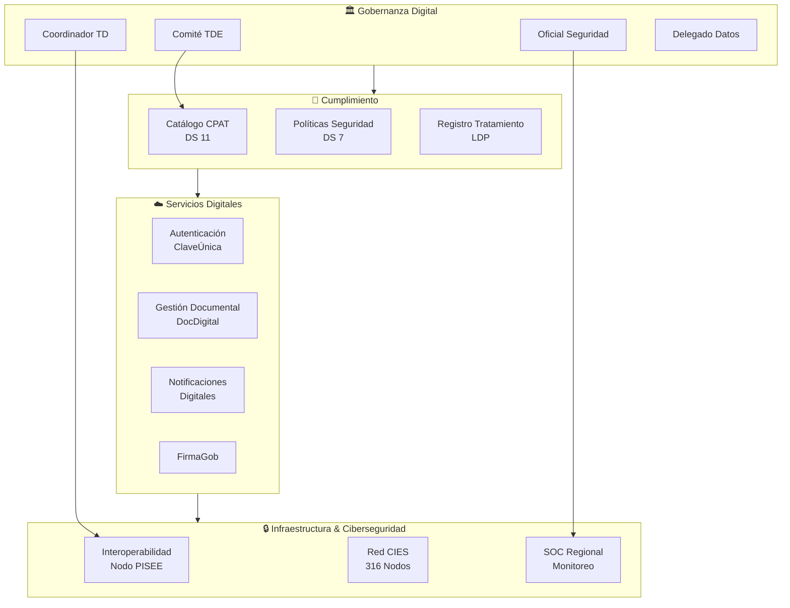
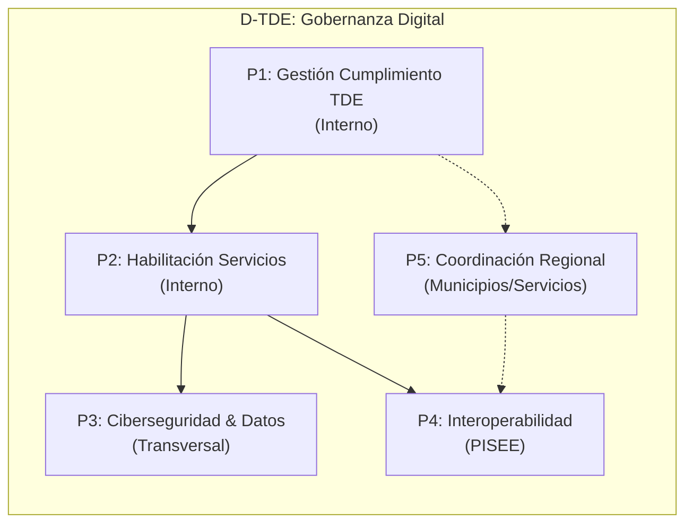
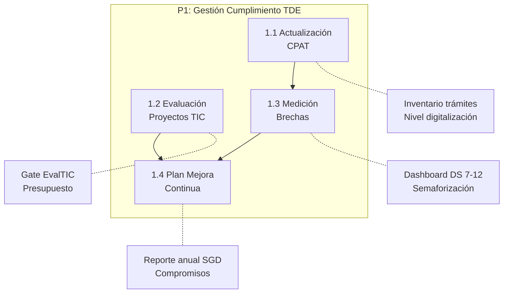
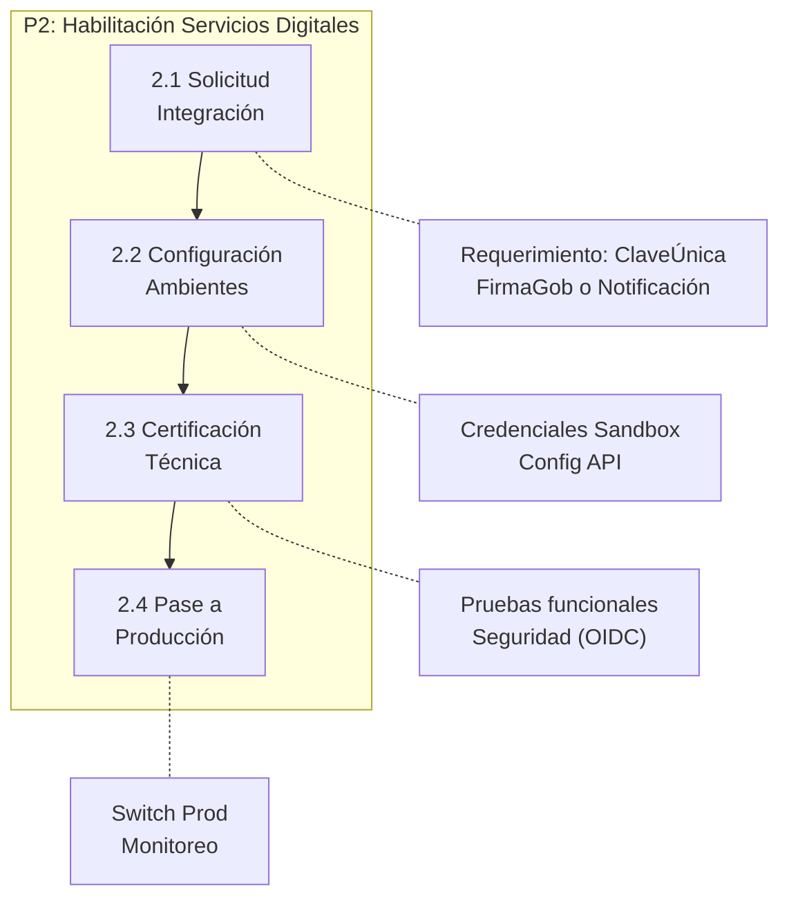
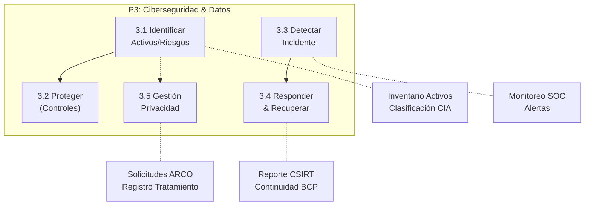
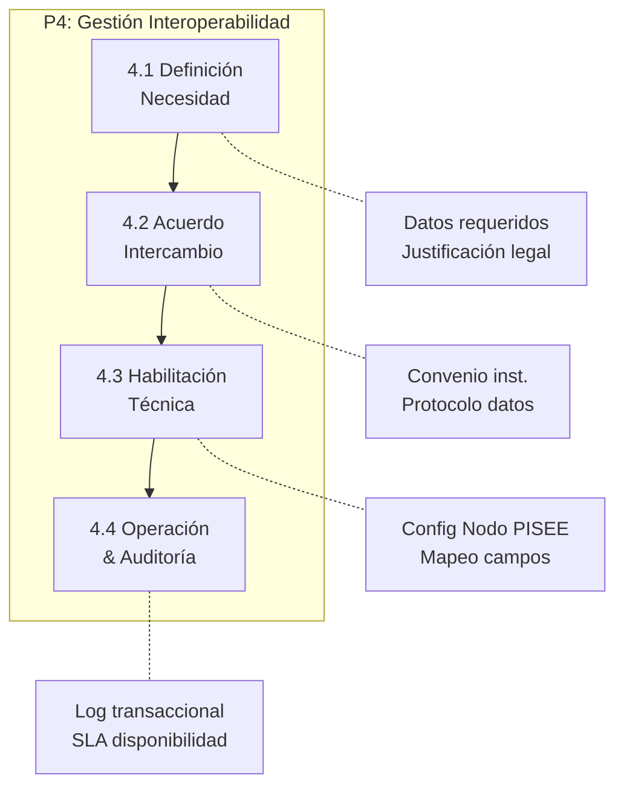
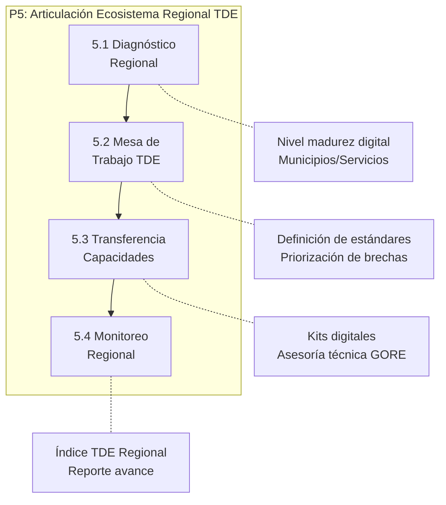

# D-TDE: Dominio de Gobernanza Digital

> Parte de: [GORE_OS Vision General](../vision_general.md)
> Capa: Habilitante (Dimensión Tecnológica)  
> Función GORE: GESTIONAR (Soporte Digital)  
> División: DAF (Departamento Informática) / Unidad de Transformación Digital

---

## Glosario D-TDE

| Término                           | Sigla | Definición                                                                             |
| --------------------------------- | ----- | -------------------------------------------------------------------------------------- |
| Transformación Digital del Estado | TDE   | Proceso de cambio cultural y tecnológico para mejorar servicios públicos (Ley 21.180). |
| Plataforma Integ. Serv. Estado    | PISEE | Bus de interoperabilidad del Estado para intercambio de datos entre instituciones.     |
| Coord. Transformación Digital     | CTD   | Rol encargado de lider### Notas de Implementación de la Ley TDE en la institución.     |
| Oficial Seguridad Información     | CISO  | Responsable de la gestión de riesgos de seguridad de la información.                   |
| Delegado Protección Datos         | DPO   | Rol responsable de garantizar el cumplimiento de la Ley de Protección de Datos.        |
| Equipo Resp. Incidentes           | CSIRT | Centro de Respuesta ante Incidentes de Seguridad Informática del Gobierno.             |
| Catálogo Procedimientos           | CPAT  | Inventario oficial de trámites y procedimientos administrativos de la institución.     |
| Identidad Única Estado            | IUIe  | Código único que identifica un expediente electrónico en el Estado.                    |
| Derechos ARCO                     | ARCO  | Derechos de Acceso, Rectificación, Cancelación y Oposición sobre datos personales.     |
| Esquema Nac. Seguridad Inf.       | ENSI  | Conjunto de normas y estándares de seguridad (DS 7) basados en ISO 27001/NIST.         |

---

## Propósito

Gestionar la gobernanza digital y el cumplimiento normativo (Ley TDE, Ciberseguridad) del GORE, y liderar la articulación del ecosistema digital regional, facilitando capacidades tecnológicas y estándares comunes para municipios y servicios públicos de la región, posicionando al GORE como motor de modernización territorial.

Fundamento Legal: Ley 21.180 (TDE), Ley 21.663 (Ciberseguridad), Ley 21.719 (Datos Personales), Decreto Supremo 4/2020 (Reglamento TDE).

---

## Diagrama de Dominio

---

## Módulos

### M1: Cumplimiento TDE

| Atributo    | Descripción                                                                    |
| ----------- | ------------------------------------------------------------------------------ |
| Propósito   | Gestionar el ciclo de vida de digitalización de trámites y calidad de servicio |
| Componentes | CPAT, Medición de Satisfacción, Plan de Mejora Continua                        |

Funcionalidades:

- Gestión del Catálogo de Procedimientos (CPAT) nivel 0-5
- Dashboard de cumplimiento decretos DS 7-12
- Gate de evaluación de proyectos TIC (EvalTIC)

### M2: Servicios Digitales Habilitantes

| Atributo    | Descripción                                                             |
| ----------- | ----------------------------------------------------------------------- |
| Propósito   | Proveer capacidades transversales de identidad y gestión administrativa |
| Componentes | Broker ClaveÚnica, Integrador DocDigital, Motor Notificaciones          |

Funcionalidades:

- Autenticación centralizada (SSO) con ClaveÚnica (OIDC)
- Firma electrónica avanzada y simple (FirmaGob)
- Notificaciones electrónicas legales (DS 8) con domicilio digital

### M3: Interoperabilidad Regional

| Atributo    | Descripción                                                 |
| ----------- | ----------------------------------------------------------- |
| Propósito   | Facilitar el intercambio de datos con el ecosistema público |
| Componentes | Nodo PISEE, Gestor de Convenios, API Gateway                |

Funcionalidades:

- Consumo y publicación de servicios web SOAP/REST
- Gestión de acuerdos de intercambio de información
- Trazabilidad centralizada de transacciones de datos

### M4: Ciberseguridad & Protección de Datos

| Atributo    | Descripción                                                                 |
| ----------- | --------------------------------------------------------------------------- |
| Propósito   | Proteger la confidencialidad, integridad y disponibilidad de la información |
| Componentes | ISMS, Gestión Incidentes, Privacy Hub                                       |

Funcionalidades:

- Gestión de activos de información y análisis de riesgos
- Reporte automático de incidentes a CSIRT
- Gestión de consentimientos y solicitudes ARCO (Datos Personales)

---

### M5: Liderazgo Digital Regional (Gobernanza Expandida)

| Atributo    | Descripción                                                                         |
| ----------- | ----------------------------------------------------------------------------------- |
| Propósito   | Liderar y articular el ecosistema digital regional (Municipios, Servicios Públicos) |
| Componentes | Mesa Regional TDE, Kit Digital Municipal, CSIRT Regional (Coordinación)             |

Funcionalidades:

- Transferencia de capacidades y estándares TDE a municipios (especialmente zonas rezagadas)
- Coordinación de Mesa Regional de Transformación Digital
- Articulación de respuestas ante ciberataques a nivel regional (Red de CISO regionales)
- Compartición de activos digitales (software público regional)

### M6: Vinculación Territorial Digital

| Atributo     | Descripción                                                                    |
| ------------ | ------------------------------------------------------------------------------ |
| Propósito    | Proveer soluciones tecnológicas compartidas a los municipios (Economía Escala) |
| Beneficiario | Municipios y Servicios Públicos Locales                                        |

Funcionalidades:

- Gestión centralizada de Firmas Electrónicas Municipales (Convenio Marco)
- API Gateway Regional para interoperabilidad municipal (DIDECO, DOM, Tránsito)
- Soporte de infraestructura crítica y conectividad (Zonas Rezagadas)

---

## Procesos BPMN

### Mapa General de Procesos

---

### P1: Gestión Cumplimiento TDE

Actores: CTD, Comité TDE, Unidades de Negocio  
Frecuencia: Semestral (Reporte SGD) / Por proyecto

---

### P2: Habilitación Servicios Digitales

Actores: Desarrolladores, Administrador TI, CTD  
Frecuencia: A demanda (nuevos sistemas)

---

### P3: Ciberseguridad & Protección Datos

Actores: CISO, DPO, NOC/SOC, CSIRT Nacional  
Frecuencia: Continua (Monitoreo) / Incidentes

---

### P4: Gestión Interoperabilidad

Actores: CTD, Contraparte (Institución), Jurídica  
Frecuencia: A demanda

---

### P5: Articulación Ecosistema Regional

Actores: Gobernador, CTD GORE, Alcaldes, Jefes Servicios  
Frecuencia: Trimestral (Mesa) / Continua (Apoyo)

---

## Catálogo por Proceso

### Selección de US Clave

| ID                 | Título                             | Proceso | Prioridad |
| ------------------ | ---------------------------------- | ------- | --------- |
| US-TDE-CALIDAD-001 | Mantener Catálogo de Plataformas   | P1      | Alta      |
| US-TDE-AVANCE-001  | Dashboard avance TDE               | P1      | Alta      |
| US-TDE-AUTH-001    | Integrar ClaveÚnica OIDC           | P2      | Crítica   |
| US-TDE-NOTIF-001   | Integrar Plataforma Notificaciones | P2      | Crítica   |
| US-TDE-SEG-004     | Reportar incidentes a CSIRT        | P3      | Crítica   |
| US-TDE-DPO-001     | Gestionar Solicitudes ARCO         | P3      | Crítica   |
| US-TDE-INTEROP-001 | Habilitar Nodo PISEE               | P4      | Crítica   |
| US-TDE-REG-001     | Convocar Mesa Regional TDE         | P5      | Alta      |
| US-TDE-REG-002     | Disponibilizar Kit Digital Muni    | P5      | Alta      |
| US-TDE-VINC-001    | Gestionar Firmas Municipales       | P5      | Alta      |

> *Para el detalle completo de las 48 historias, ver catálogo YAML adjunto.*

---

## Entidades de Datos

### Cumplimiento Normativo

| Entidad      | Atributos Clave                           | Relaciones            |
| ------------ | ----------------------------------------- | --------------------- |
| `NormaTDE`   | id, codigo, nombre, fecha_vigencia        | → CumplimientoNorma[] |
| `Tramite`    | id, nombre, nivel_digitalizacion, cpat_id | → PlanDigitalizacion  |
| `Plataforma` | id, nombre, linea_base, responsable_ti    | → ActivoTI            |

### Gobernanza & Seguridad

| Entidad         | Atributos Clave                               | Relaciones              |
| --------------- | --------------------------------------------- | ----------------------- |
| `ActivoTI`      | id, nombre, clasificacion_cia, propietario    | → Riesgo[], Incidente[] |
| `Incidente`     | id, fecha, tipo, severidad, estado_csirt      | → ActivoTI[]            |
| `Riesgo`        | id, activo_id, amenaza, probabilidad, impacto | → ControlSeguridad      |
| `SolicitudARCO` | id, titular, tipo_derecho, fecha, estado      | → TratamientoDatos      |

### Interoperabilidad & Regional

| Entidad              | Atributos Clave                                          | Relaciones           |
| -------------------- | -------------------------------------------------------- | -------------------- |
| `ServicioPISEE`      | id, nombre, proveedor, endpoint, wsdl_swagger            | → AcuerdoIntercambio |
| `AcuerdoIntercambio` | id, servicio_id, institucion_origen, institucion_destino | → TransaccionPISEE[] |
| `EntidadRegional`    | id, nombre, tipo (Muni/Servicio), nivel_madurez_tde      | → MesaTDE            |

---

## Sistemas Involucrados

| Sistema            | Rol                                              | Dominio |
| ------------------ | ------------------------------------------------ | ------- |
| GORE OS            | Plataforma central de gestión                    | D-TDE   |
| Plataformas Estado | ClaveÚnica, DocDigital, FirmaGob, Notificaciones | Externo |
| PISEE              | Bus de interoperabilidad                         | Externo |
| CSIRT              | Plataforma de reporte de incidentes              | Externo |

---

## Normativa Aplicable

| Norma      | Descripción                       |
| ---------- | --------------------------------- |
| Ley 21.180 | Transformación Digital del Estado |
| Ley 21.663 | Ley Marco de Ciberseguridad       |
| Ley 21.719 | Protección de Datos Personales    |
| DS 83/2020 | Norma Técnica de Ciberseguridad   |

---

## Referencias Cruzadas

| Dominio | Relación                                               |
| ------- | ------------------------------------------------------ |
| D-NORM  | Expediente electrónico debe cumplir DS 10 del TDE      |
| FÉNIX   | Fallas críticas de ciberseguridad activan intervención |
| D-BACK  | Integración de sistemas administrativos con ClaveÚnica |
| D-SEG   | Infraestructura de red CIES gestionada bajo normas TDE |
| D-GOB   | Liderazgo político del Gobernador en Mesa Regional TDE |

---

Documento parte de GORE_OS v5.0
