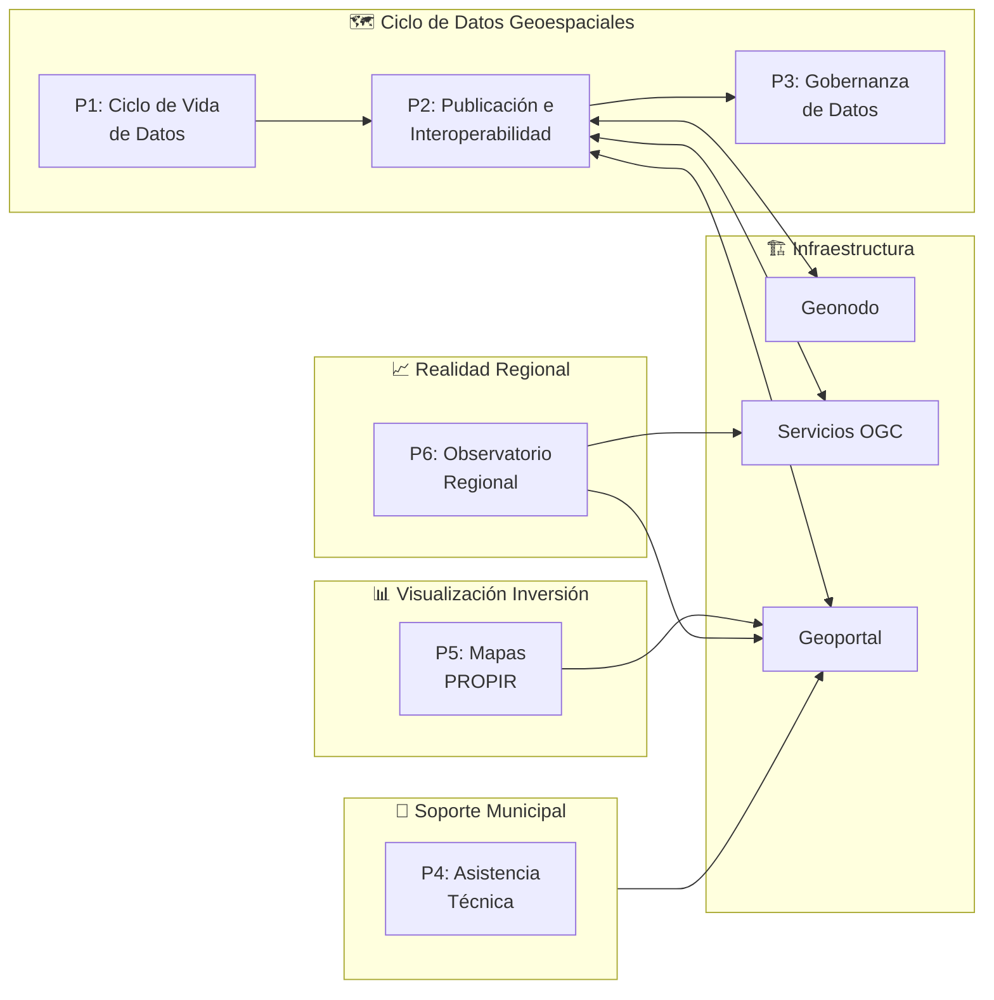
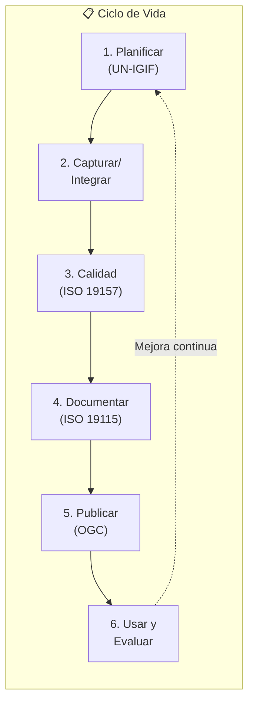
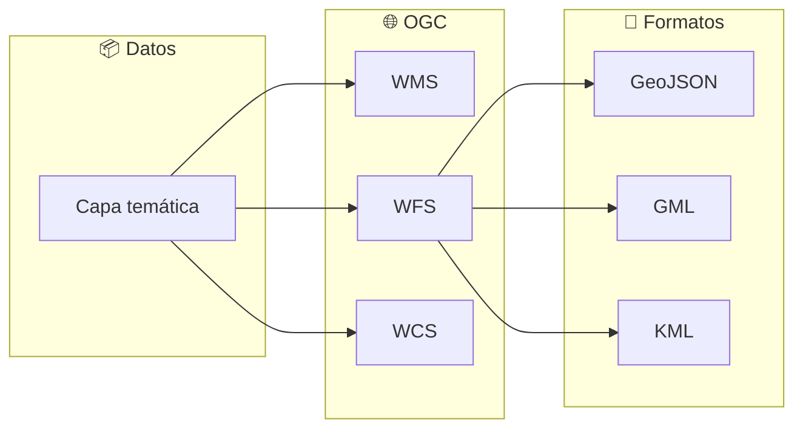
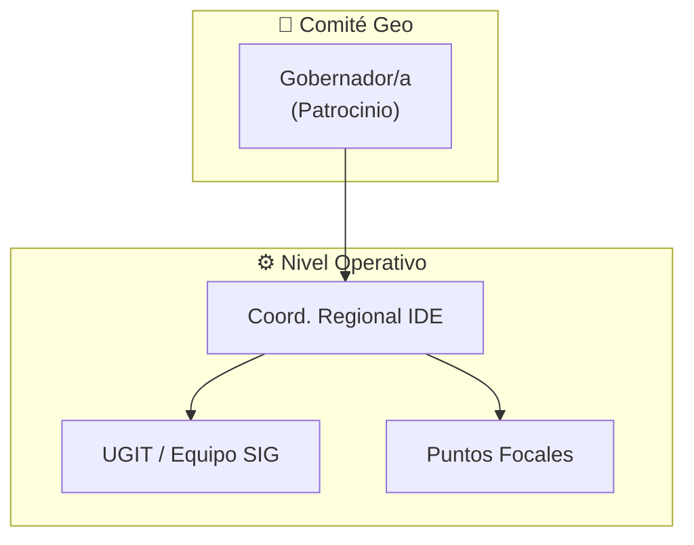
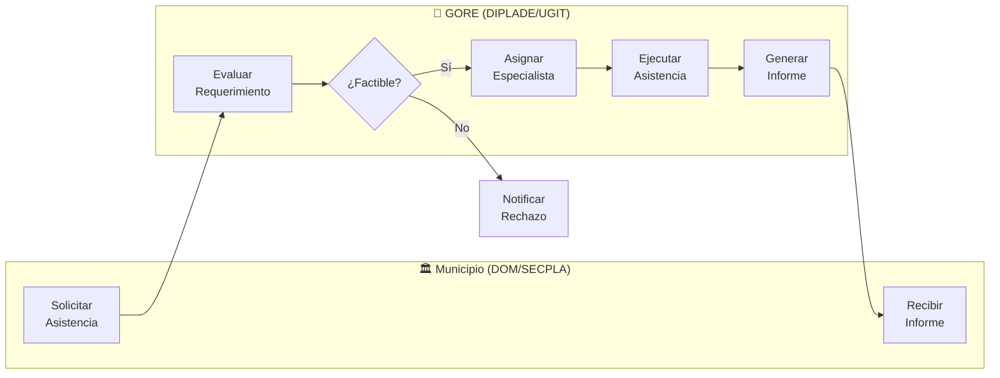
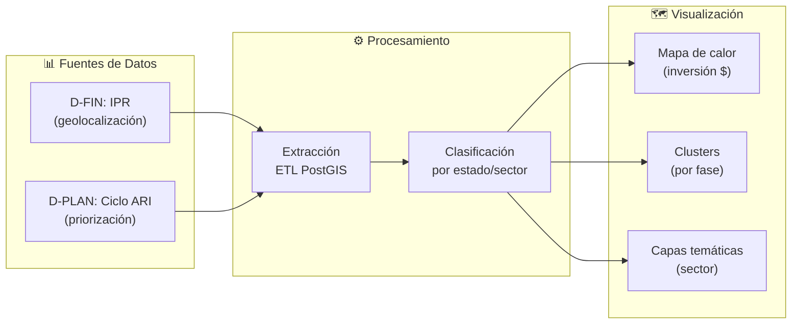
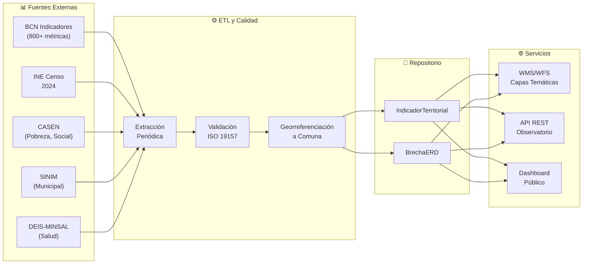

# D-TERR: Dominio de Inteligencia Territorial

> Parte de: [GORE_OS Vision General](../vision_general.md)  
> Capa: Habilitante (Dimensión Geoespacial)  
> Función GORE: PLANIFICAR  

---

## Propósito

Gestionar la infraestructura de datos espaciales (IDE) y las capacidades de inteligencia territorial para informar la planificación estratégica, la priorización de inversiones y el ordenamiento territorial de la región.

> Visión: La toma de decisiones del GORE está informada por datos territoriales de alta calidad, georreferenciados e interoperables, que permiten visualizar brechas, monitorear avances y optimizar la asignación de recursos en el territorio.

---

## Cuatro Pilares del Dominio

| Pilar         | Componentes                                                 |
| ------------- | ----------------------------------------------------------- |
| Planificación | ERD, ARI/PROPIR, instrumentos regionales                    |
| IDE           | Geonodo, servicios OGC, metadatos                           |
| Analítica     | Mapas temáticos, alertas duplicidad, evaluación comparativa |
| Gestión       | Catastro fiscal, calidad de datos, política geo             |

---

## Módulos

### 1. Inteligencia Estratégica (Visualización)

Instrumentos:

- PROT (Plan Regional de Ordenamiento Territorial): **Vinculante según Art. 17 LOC**.
- ARI (Anteproyecto Regional de Inversiones)
- PROPIR (Programa Público de Inversión Regional)
- Políticas regionales sectoriales

### 2. IDE Regional

Servicios OGC:

| Servicio | Función                                                      |
| -------- | ------------------------------------------------------------ |
| WMS      | Visualización de capas                                       |
| WFS      | Descarga de entidades                                        |
| WCS      | Coberturas raster                                            |
| CSW      | Catálogo de metadatos                                        |
| SENAPRED | Interoperabilidad con Visor Nacional de Riesgos (Ley 21.364) |

### 3. Analítica Territorial

Capacidades:

- Mapas de calor de inversión
- Brechas territoriales
- Alertas de duplicidad
- Evaluación comparativa (Benchmarking) de proyectos

### 4. Gestión y Gobernanza Territorial

Estándares:

| Norma       | Aplicación          |
| ----------- | ------------------- |
| ISO 19115-1 | Metadatos           |
| ISO 19157   | Calidad de datos    |
| ISO 19110   | Catálogo de objetos |

### 5. Asistencia Urbanística DOM

| Atributo     | Descripción                                                         |
| ------------ | ------------------------------------------------------------------- |
| Propósito    | Asesorar a los Municipios en la aplicación de normativa territorial |
| Beneficiario | DOM y Asesores Urbanistas Municipales                               |

Funcionalidades:

- Visor Unificado de Normativa (PRC Santiago + Intercomunal + PROT)

- Asistente de Actualización de IPTs (Indicadores de vigencia)

- Mesa de ayuda técnica para interpretación normativa

---

## 📋 Procesos BPMN

### Mapa General (D10 Geoespacial/IDE)

| Campo      | Valor                    |
| ---------- | ------------------------ |
| ID         | `DOM-GEO`                |
| Criticidad | 🟡 Media                  |
| Dueño      | Coordinador Regional IDE |

---

### P1: Ciclo de Vida de Datos Geoespaciales

#### Responsables por Etapa

| Etapa               | Responsable         |
| ------------------- | ------------------- |
| Planificar          | Coord. Regional IDE |
| Capturar/Calidad    | UGIT / Equipo SIG   |
| Documentar/Publicar | UGIT / Equipo SIG   |
| Usar y Evaluar      | Divisiones usuarias |

---

### P2: Publicación e Interoperabilidad

#### API Institucional

| Endpoint                | Función           |
| ----------------------- | ----------------- |
| `/conjuntos-datos`      | Listar conjuntos  |
| `/conjuntos-datos/{id}` | Detalle conjunto  |
| `/teselas/{z}/{x}/{y}`  | Teselas (Tiles)   |
| `/busqueda`             | Búsqueda avanzada |

---

### P3: Gobernanza de Datos Geoespaciales

#### Licenciamiento

| Tipo de Capa       | Licencia           |
| ------------------ | ------------------ |
| Datos abiertos     | CC BY 4.0          |
| Bases de datos     | ODbL               |
| Datos restringidos | Acuerdo específico |

---

### P4: Asistencia Técnica Territorial

> Propósito: Formalizar el flujo de solicitud y entrega de asistencia técnica a las DOMs y SECPLAs para la actualización de instrumentos y validación normativa.

#### Tipos de Asistencia

1. Actualización IPT: Diagnóstico de vigencia, apoyo metodológico.

2. Normativa: Interpretación de zonas de riesgo (PROT), validación de afectaciones.

3. Catastro: Apoyo en levantamiento de información territorial comunal.

---

### P5: Visualización y Análisis PROPIR

> Propósito: Proyectar el Programa Público de Inversión Regional (PROPIR) sobre el territorio para apoyar la toma de decisiones de planificación y priorización.

#### Capas Generadas

| Capa               | Descripción                                         | Actualización |
| ------------------ | --------------------------------------------------- | ------------- |
| `propir_heatmap`   | Densidad de inversión por monto                     | Semanal       |
| `propir_clusters`  | Agrupación por estado (Diseño/Licitación/Ejecución) | Diario        |
| `propir_sectorial` | Filtrado por sector (MOP, MINVU, Seguridad)         | Mensual       |

---

### P6: Observatorio Regional (Realidad Territorial)

> Propósito: Consolidar, validar y publicar indicadores de realidad regional para informar el diagnóstico y la planificación del desarrollo. **D-TERR es el motor de datos; D-PLAN es el consumidor estratégico.**

#### Fuentes de Datos Integradas

| Fuente                | Tipo             | Frecuencia | Indicadores Ejemplo                    |
| --------------------- | ---------------- | ---------- | -------------------------------------- |
| BCN Indicadores Ñuble | Multidimensional | Anual      | IDH, Pobreza, Educación, Salud         |
| INE Censo 2024        | Demográfico      | Decenal    | Población, Vivienda, Ruralidad         |
| CASEN                 | Social           | Bienal     | Pobreza Multidimensional, Hacinamiento |
| SINIM                 | Municipal        | Anual      | Ingresos, Dependencia FCM, PLADECO     |
| DEIS-MINSAL           | Sanitario        | Anual      | Mortalidad, Natalidad, Cobertura       |
| ENUSC                 | Seguridad        | Anual      | Victimización, Percepción              |

#### Capas Generadas

| Capa                   | Descripción                            | Actualización |
| ---------------------- | -------------------------------------- | ------------- |
| `obs_idh_comunal`      | Índice de Desarrollo Humano por comuna | Anual         |
| `obs_pobreza_multidim` | Tasa de pobreza multidimensional       | Bienal        |
| `obs_brechas_erd`      | Distancia a metas ERD 2024-2030        | Trimestral    |
| `obs_fragilidad_icfsr` | Índice de Fragilidad Socio-Residencial | Anual         |

---

## 📝 Historias de Usuario por Módulo

### Catálogo por Proceso

#### P1: Ciclo de Vida

| US-TERR-IDE-003 | Modelar datos ISO 19110 | Alta      | Administrador Geonodo |
| US-TERR-IDE-004 | Metadatos ISO 19115     | Alta      | Administrador Geonodo |
| US-TERR-IDE-005 | Publicar WMS/WFS/WCS    | Crítica   | Administrador Geonodo |

#### P2: Interoperabilidad

| US-TERR-IDE-001 | Definir política geoespacial | Alta      | Coord. Regional IDE |
| US-TERR-IDE-002 | Federar catálogos IDE Chile  | Alta      | Coord. Regional IDE |

#### P3: Gobernanza

| ID              | Título                             | Prioridad | Actor                |
| --------------- | ---------------------------------- | --------- | -------------------- |
| US-TERR-IDE-006 | Gestionar catastro bienes fiscales | Media     | Analista Territorial |

#### Planificación Estratégica

| ID               | Título                 | Prioridad | Actor                  |
| ---------------- | ---------------------- | --------- | ---------------------- |
| US-TERR-PLAN-001 | Brechas territoriales  | Crítica   | Analista Planificación |
| US-TERR-PLAN-002 | Alineamiento IPR a ERD | Crítica   | Analista Planificación |
| US-TERR-PLAN-003 | Avance metas ERD       | Alta      | Analista Planificación |
| US-TERR-PLAN-004 | Proceso ARI/PROPIR     | Alta      | Analista Planificación |

#### Analítica Territorial

| ID              | Título                             | Prioridad | Actor                  |
| --------------- | ---------------------------------- | --------- | ---------------------- |
| US-TERR-ANL-001 | Consultar histórico inversiones    | Alta      | Analista Planificación |
| US-TERR-ANL-002 | Mapa de calor inversión            | Alta      | Analista Planificación |
| US-TERR-ANL-003 | Visualizar PROPIR georreferenciado | Crítica   | Analista Planificación |
| US-TERR-ANL-004 | Alertar duplicidades inversión     | Alta      | Analista Planificación |

#### Asistencia Urbanística DOM (M5)

| ID              | Título                                    | Prioridad | Actor              |
| --------------- | ----------------------------------------- | --------- | ------------------ |
| US-TERR-DOM-001 | Consultar normativa territorial unificada | Alta      | Asesor Urbanístico |
| US-TERR-DOM-002 | Solicitar asistencia técnica territorial  | Alta      | SECPLAN Municipal  |
| US-TERR-DOM-003 | Validar afectaciones PROT                 | Alta      | Asesor Urbanístico |

#### Observatorio Regional (P6)

| ID              | Título                                          | Prioridad | Actor                  |
| --------------- | ----------------------------------------------- | --------- | ---------------------- |
| US-TERR-OBS-001 | Consultar indicador por comuna y período        | Crítica   | Analista Planificación |
| US-TERR-OBS-002 | Visualizar mapa de brechas ERD                  | Crítica   | Jefe DIPLAD            |
| US-TERR-OBS-003 | Alertar cuando indicador supera umbral crítico  | Alta      | Coord. Regional IDE    |
| US-TERR-OBS-004 | Comparar indicadores entre comunas              | Alta      | Analista Planificación |
| US-TERR-OBS-005 | Descargar dataset histórico por indicador       | Media     | Investigador           |
| US-TERR-OBS-006 | Publicar capa temática nueva                    | Alta      | Administrador Geonodo  |
| US-TERR-OBS-007 | Validar calidad de datos importados (ISO 19157) | Alta      | Administrador Geonodo  |

*Ver catálogo completo en [kb_goreos_us_d-terr.yml](../user-stories/kb_goreos_us_d-terr.yml)*

---

## 🔗 Matriz de Trazabilidad (Historias de Usuario)

| Proceso BPMN     | Subproceso    | Historias de Usuario       |
| ---------------- | ------------- | -------------------------- |
| P1: Ciclo Datos  | Planificar    | US-TERR-IDE-001            |
| P1: Ciclo Datos  | Calidad       | US-TERR-IDE-003            |
| P1: Ciclo Datos  | Documentar    | US-TERR-IDE-004            |
| P1: Ciclo Datos  | Publicar      | US-TERR-IDE-005            |
| P2: Interop      | Federación    | US-TERR-IDE-002            |
| P2: Interop      | API           | US-TERR-ANL-001, 002       |
| P3: Gobernanza   | Política      | US-TERR-IDE-001            |
| P3: Gobernanza   | Catastro      | US-TERR-IDE-006            |
| P4: Asistencia   | Solicitud     | US-TERR-DOM-002            |
| P4: Asistencia   | Normativa     | US-TERR-DOM-001, 003       |
| P5: PROPIR       | Heatmap       | US-TERR-ANL-002            |
| P5: PROPIR       | Clusters      | US-TERR-ANL-003            |
| P5: PROPIR       | Sectorial     | US-TERR-ANL-004            |
| P6: Observatorio | Ingesta       | US-TERR-OBS-006, 007       |
| P6: Observatorio | Consulta      | US-TERR-OBS-001, 004, 005  |
| P6: Observatorio | Visualización | US-TERR-OBS-002            |
| P6: Observatorio | Alertas       | US-TERR-OBS-003            |
| Inteligencia     | ERD           | US-TERR-PLAN-001, 002, 003 |
| Inteligencia     | ARI/PROPIR    | US-TERR-PLAN-004           |
| Analítica        | Inversiones   | US-TERR-ANL-001            |

---

## Entidades de Datos

| Entidad                | Atributos Clave                                                  | Relaciones              |
| ---------------------- | ---------------------------------------------------------------- | ----------------------- |
| `CapaGeoespacial`      | id, nombre, geometria, fecha_publicacion, licencia               | → Metadato, ServicioOGC |
| `VistaTerritorialIPR`  | id, ipr_id, geometria, estado_ipr, monto, sector, fecha_snapshot | → IPR (D-FIN), CapaGeo  |
| `Metadato`             | id, capa_id, titulo, resumen, palabras_clave, fecha              | → CapaGeoespacial       |
| `PROT`                 | id, nombre, estado (Vigente/Borrador), actos_relacionados        | → CapaGeoespacial       |
| `IPT`                  | id, nombre, tipo (PRC/PRI), comuna_id, estado                    | → Comuna                |
| `ZonaRiesgo`           | id, tipo (Inundación/Incendio), severidad, fuente_id             | → CapaGeoespacial       |
| `IndicadorTerritorial` | id, nombre, valor, comuna_id, fecha                              | → Comuna                |
| `BrechaERD`            | id, objetivo_erd_id, meta, avance, gap                           | → ObjetivoERD           |

---

## Sistemas Involucrados

| Sistema            | Función                |
| ------------------ | ---------------------- |
| `SYS-GEONODO`      | Plataforma geoespacial |
| `SYS-CSW`          | Catálogo de metadatos  |
| `SYS-OGC-SERVICES` | WMS/WFS/WCS            |
| `SYS-GEO-PORTAL`   | Portal público         |
| `SYS-GEO-API`      | API REST               |

---

## Normativa Aplicable

| Norma              | Alcance                    |
| ------------------ | -------------------------- |
| ISO 19115-1        | Metadatos                  |
| ISO 19157          | Calidad de datos           |
| ISO 19131          | Especificaciones           |
| Política IDE Chile | Interoperabilidad nacional |

---

## Referencias Cruzadas

| Dominio | Relación                                                          | Entidades Compartidas |
| ------- | ----------------------------------------------------------------- | --------------------- |
| D-PLAN  | ERD, instrumentos de planificación; **M5 consume datos de P6**    | Indicador, BrechaERD  |
| D-FIN   | Georreferenciación de IPR; visualización PROPIR (P5)              | VistaTerritorialIPR   |
| D-SEG   | Ubicación de cámaras e incidentes; heatmap de delitos             | Incident, Camera      |
| D-EJEC  | Supervisión georreferenciada de obras                             | WorkProject           |
| D-BACK  | Seguimiento geoespacial de activos (flora, patrimonio)            | Asset                 |
| D-TDE   | Capas geoespaciales deben cumplir metadatos TDE (DS 9/10)         | ElectronicDocument    |
| D-EVOL  | Analytics geoespacial avanzado alimenta métricas de salud (H_org) | Capability, H_org     |
| D-GOB   | Georreferenciación de compromisos del Gobernador                  | Commitment            |
| D-NORM  | Capas PROT vinculadas a actos administrativos y normativa         | Regulation            |
| FÉNIX   | Alertas territoriales críticas activan escalamiento               | FenixAlert            |

---

*Documento parte de GORE_OS Blueprint Integral v5.2*  
*Última actualización: 2025-12-18*
