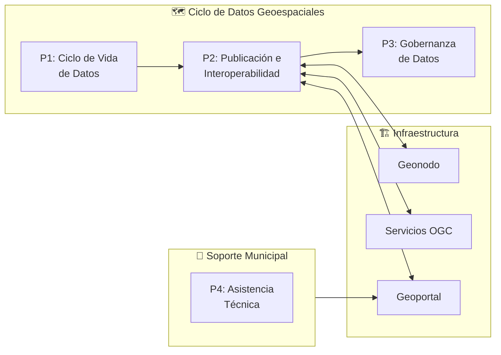
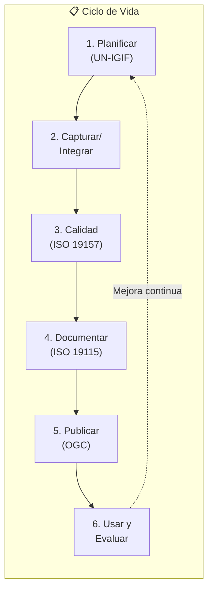
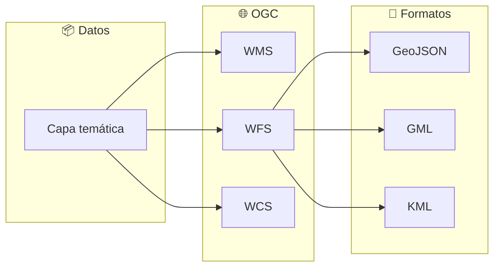
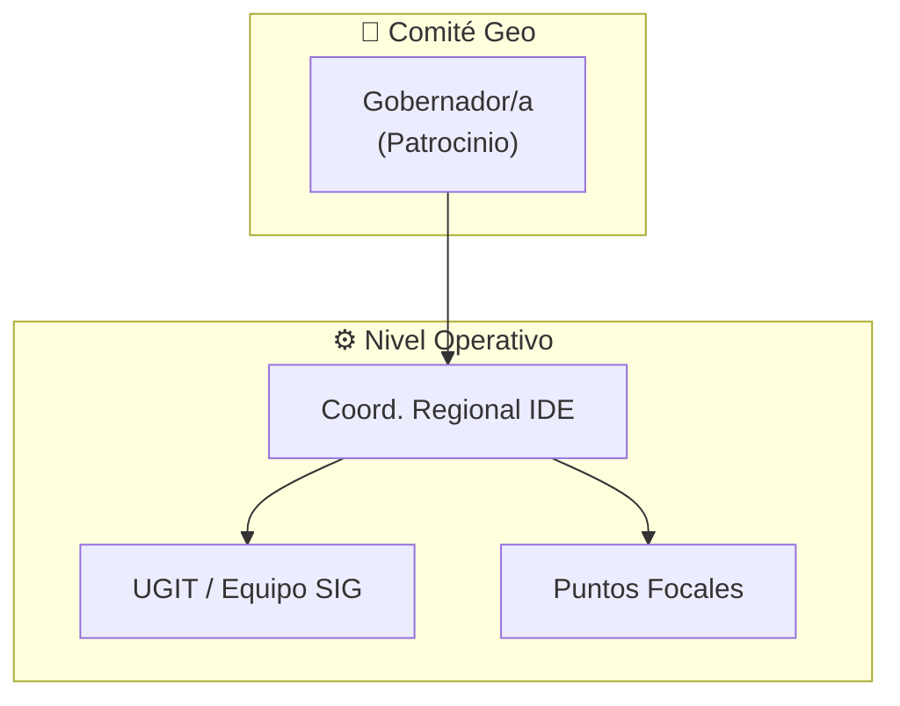
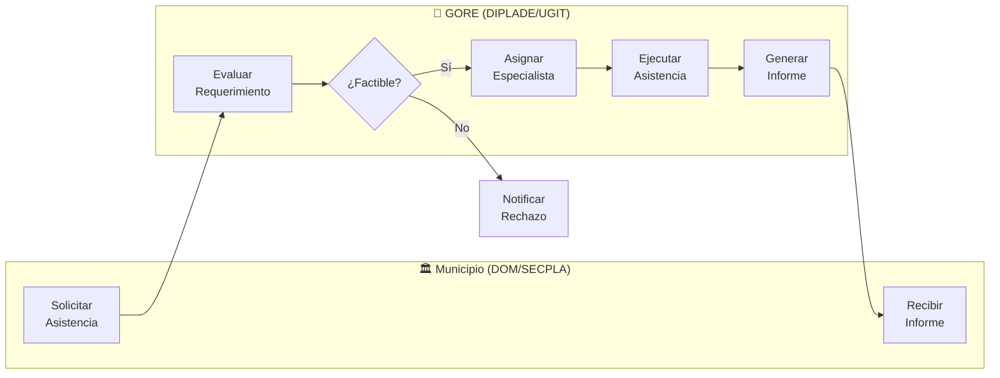

# D-TERR: Dominio de Inteligencia Territorial

> **Parte de:** [GORE_OS Vision General](../vision_general.md)  
> **Capa:** Núcleo (Dimensión Estratégica)  
> **Función GORE:** PLANIFICAR  
> **Procesos BPMN:** 4 | **Subprocesos:** ~12 | **User Stories:** 24

---

## Propósito

Gestionar la infraestructura de datos espaciales (IDE) y las capacidades de inteligencia territorial para informar la planificación estratégica, la priorización de inversiones y el ordenamiento territorial de la región.

> **Visión:** La toma de decisiones del GORE está informada por datos territoriales de alta calidad, georreferenciados e interoperables, que permiten visualizar brechas, monitorear avances y optimizar la asignación de recursos en el territorio.

---

## Cuatro Pilares del Dominio

| Pilar             | Componentes                                       |
| ----------------- | ------------------------------------------------- |
| **Planificación** | ERD, ARI/PROPIR, instrumentos regionales          |
| **IDE**           | Geonodo, servicios OGC, metadatos                 |
| **Analítica**     | Mapas temáticos, alertas duplicidad, benchmarking |
| **Gestión**       | Catastro fiscal, calidad de datos, política geo   |

---

## Módulos

### 1. Inteligencia Estratégica (Visualización)

**Instrumentos:**

- ERD (Estrategia Regional de Desarrollo)
- ARI (Anteproyecto Regional de Inversiones)
- PROPIR (Programa Público de Inversión Regional)
- Políticas regionales sectoriales

### 2. IDE Regional

**Servicios OGC:**

| Servicio | Función                |
| -------- | ---------------------- |
| WMS      | Visualización de capas |
| WFS      | Descarga de entidades  |
| WCS      | Coberturas raster      |
| CSW      | Catálogo de metadatos  |

### 3. Analítica Territorial

**Capacidades:**

- Mapas de calor de inversión
- Brechas territoriales
- Alertas de duplicidad
- Benchmarking de proyectos

### 4. Gestión y Gobernanza Territorial

**Estándares:**

| Norma       | Aplicación          |
| ----------- | ------------------- |
| ISO 19115-1 | Metadatos           |
| ISO 19157   | Calidad de datos    |
| ISO 19110   | Catálogo de objetos |

### 5. Asistencia Urbanística DOM

| Atributo         | Descripción                                                         |
| ---------------- | ------------------------------------------------------------------- |
| **Propósito**    | Asesorar a los Municipios en la aplicación de normativa territorial |
| **Beneficiario** | DOM y Asesores Urbanistas Municipales                               |

**Funcionalidades:**
- Visor Unificado de Normativa (PRC Santiago + Intercomunal + PROT)
- Asistente de Actualización de IPTs (Indicadores de vigencia)
- Mesa de ayuda técnica para interpretación normativa

---

## 📋 Procesos BPMN

### Mapa General (D10 Geoespacial/IDE)

| Campo          | Valor                    |
| -------------- | ------------------------ |
| **ID**         | `DOM-GEO`                |
| **Criticidad** | 🟡 Media                  |
| **Dueño**      | Coordinador Regional IDE |
| **Procesos**   | 4                        |

---

### P1: Ciclo de Vida de Datos Geoespaciales

#### Responsables por Etapa

| Etapa               | Responsable         |
| ------------------- | ------------------- |
| Planificar          | Coord. Regional IDE |
| Capturar/Calidad    | UGIT / Equipo SIG   |
| Documentar/Publicar | UGIT / Equipo SIG   |
| Usar y Evaluar      | Divisiones usuarias |

---

### P2: Publicación e Interoperabilidad

#### API Institucional

| Endpoint             | Función           |
| -------------------- | ----------------- |
| `/datasets`          | Listar conjuntos  |
| `/datasets/{id}`     | Detalle conjunto  |
| `/tiles/{z}/{x}/{y}` | Teselas           |
| `/search`            | Búsqueda avanzada |

---

### P3: Gobernanza de Datos Geoespaciales

#### Licenciamiento

| Tipo de Capa       | Licencia           |
| ------------------ | ------------------ |
| Datos abiertos     | CC BY 4.0          |
| Bases de datos     | ODbL               |
| Datos restringidos | Acuerdo específico |

---

### P4: Asistencia Técnica Territorial

> **Propósito:** Formalizar el flujo de solicitud y entrega de asistencia técnica a las DOMs y SECPLAs para la actualización de instrumentos y validación normativa.

#### Tipos de Asistencia
1. **Actualización IPT:** Diagnóstico de vigencia, apoyo metodológico.
2. **Normativa:** Interpretación de zonas de riesgo (PROT), validación de afectaciones.
3. **Catastro:** Apoyo en levantamiento de información territorial comunal.

---

## 📝 User Stories por Módulo

### Resumen

| Módulo         | US Críticas | US Altas | US Medias | Total  |
| -------------- | ----------- | -------- | --------- | ------ |
| Planificación  | 2           | 6        | 1         | 9      |
| IDE            | 1           | 4        | 1         | 6      |
| Analítica      | 0           | 3        | 2         | 5      |
| Gestión        | 0           | 0        | 1         | 1      |
| Asistencia DOM | 1           | 2        | 0         | 3      |
| **Total**      | **4**       | **15**   | **5**     | **24** |

### Catálogo por Proceso

#### P1: Ciclo de Vida

| ID              | Título                  | Prioridad | Actor         |
| --------------- | ----------------------- | --------- | ------------- |
| US-TERR-IDE-003 | Modelar datos ISO 19110 | Alta      | Admin Geonodo |
| US-TERR-IDE-004 | Metadatos ISO 19115     | Alta      | Admin Geonodo |
| US-TERR-IDE-005 | Publicar WMS/WFS/WCS    | Crítica   | Admin Geonodo |

#### P2: Interoperabilidad

| ID              | Título                       | Prioridad | Actor      |
| --------------- | ---------------------------- | --------- | ---------- |
| US-TERR-IDE-001 | Definir política geoespacial | Alta      | Coord. IDE |
| US-TERR-IDE-002 | Federar catálogos IDE Chile  | Alta      | Coord. IDE |

#### P3: Gobernanza

| ID              | Título                             | Prioridad | Actor                |
| --------------- | ---------------------------------- | --------- | -------------------- |
| US-TERR-IDE-006 | Gestionar catastro bienes fiscales | Media     | Analista Territorial |

#### Planificación Estratégica

| ID               | Título                 | Prioridad | Actor                  |
| ---------------- | ---------------------- | --------- | ---------------------- |
| US-TERR-PLAN-001 | Brechas territoriales  | Crítica   | Analista Planificación |
| US-TERR-PLAN-002 | Alineamiento IPR a ERD | Crítica   | Analista Planificación |
| US-TERR-PLAN-003 | Avance metas ERD       | Alta      | Analista Planificación |
| US-TERR-PLAN-004 | Proceso ARI/PROPIR     | Alta      | Analista Planificación |

#### Analítica Territorial

| ID              | Título                          | Prioridad | Actor                  |
| --------------- | ------------------------------- | --------- | ---------------------- |
| US-TERR-ANL-001 | Consultar histórico inversiones | Alta      | Analista Planificación |
| US-TERR-ANL-002 | Mapa de calor inversión         | Alta      | Analista Planificación |
| US-TERR-ANL-004 | Alertar duplicidades inversión  | Alta      | Analista Planificación |

*Ver catálogo completo en [kb_goreos_us_d-terr.yml](../user-stories/kb_goreos_us_d-terr.yml)*

---

## 🔗 Matriz de Trazabilidad

| Proceso BPMN    | Subproceso  | User Stories               |
| --------------- | ----------- | -------------------------- |
| P1: Ciclo Datos | Planificar  | US-TERR-IDE-001            |
| P1: Ciclo Datos | Calidad     | US-TERR-IDE-003            |
| P1: Ciclo Datos | Documentar  | US-TERR-IDE-004            |
| P1: Ciclo Datos | Publicar    | US-TERR-IDE-005            |
| P2: Interop     | Federación  | US-TERR-IDE-002            |
| P2: Interop     | API         | US-TERR-ANL-001, 002       |
| P3: Gobernanza  | Política    | US-TERR-IDE-001            |
| P3: Gobernanza  | Catastro    | US-TERR-IDE-006            |
| P4: Asistencia  | Solicitud   | US-TERR-DOM-002            |
| P4: Asistencia  | Normativa   | US-TERR-DOM-001, 003       |
| Inteligencia    | ERD         | US-TERR-PLAN-001, 002, 003 |
| Inteligencia    | ARI/PROPIR  | US-TERR-PLAN-004           |
| Analítica       | Inversiones | US-TERR-ANL-001, 002, 004  |

---

## Entidades de Datos

| Entidad                | Atributos Clave                                     | Relaciones              |
| ---------------------- | --------------------------------------------------- | ----------------------- |
| `CapaGeoespacial`      | id, nombre, geometria, fecha_publicacion, licencia  | → Metadato, ServicioOGC |
| `Metadato`             | id, capa_id, titulo, resumen, palabras_clave, fecha | → CapaGeoespacial       |
| `IndicadorTerritorial` | id, nombre, valor, comuna_id, fecha                 | → Comuna                |
| `BrechaERD`            | id, objetivo_erd_id, meta, avance, gap              | → ObjetivoERD           |

---

## Sistemas Involucrados

| Sistema            | Función                |
| ------------------ | ---------------------- |
| `SYS-GEONODO`      | Plataforma geoespacial |
| `SYS-CSW`          | Catálogo de metadatos  |
| `SYS-OGC-SERVICES` | WMS/WFS/WCS            |
| `SYS-GEO-PORTAL`   | Portal público         |
| `SYS-GEO-API`      | API REST               |

---

## Normativa Aplicable

| Norma                  | Alcance                    |
| ---------------------- | -------------------------- |
| **ISO 19115-1**        | Metadatos                  |
| **ISO 19157**          | Calidad de datos           |
| **ISO 19131**          | Especificaciones           |
| **Política IDE Chile** | Interoperabilidad nacional |

---

## Referencias Cruzadas

| Dominio    | Relación                           |
| ---------- | ---------------------------------- |
| **D-PLAN** | ERD, instrumentos de planificación |
| **D-FIN**  | Georreferenciación de IPR          |
| **D-SEG**  | Ubicación de cámaras e incidentes  |
| **D-EJEC** | Supervisión georreferenciada       |

---

*Documento parte de GORE_OS Blueprint Integral v5.0*  
*Última actualización: 2025-12-16*
