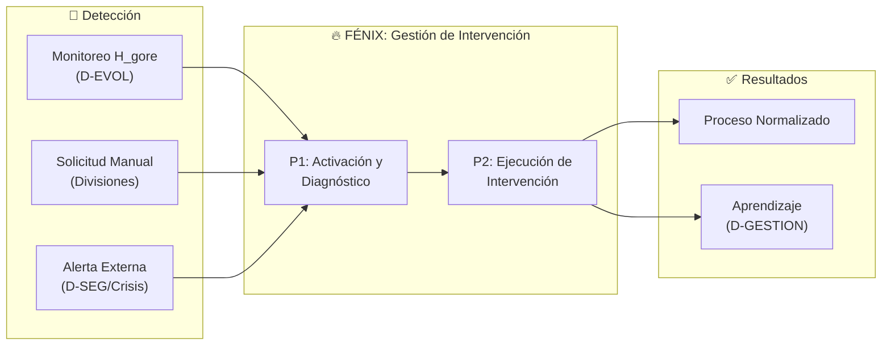
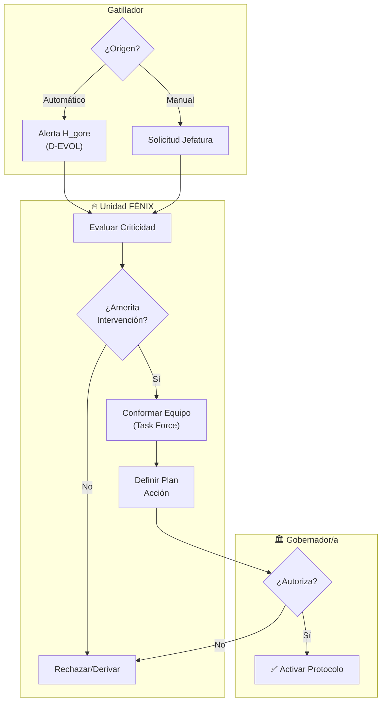
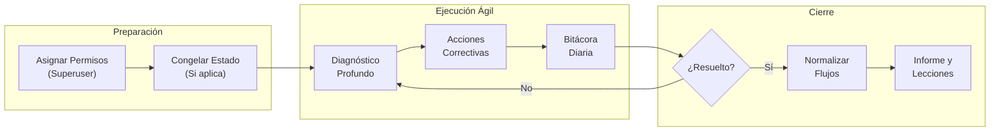

# Departamento de Gestión Institucional (FÉNIX)

> **Parte de:** [GORE_OS Vision General](../vision_general.md)  
> **Capa:** Transversal (Metasistema)  
> **Función GORE:** INTERVENIR  
> **Procesos BPMN:** 2 | **User Stories:** 12  

---

## Propósito

Unidad especializada del GORE de Ñuble responsable de diagnosticar, intervenir y resolver situaciones críticas institucionales, gestionar procesos estancados y acelerar iniciativas estratégicas cuando las circunstancias lo requieren.

El Departamento opera como capacidad transversal, activándose ante contingencias que exceden la capacidad de respuesta de los flujos operativos normales.

---

## Principios Rectores

| Principio                    | Descripción                                                             |
| ---------------------------- | ----------------------------------------------------------------------- |
| **Orientación a Resultados** | Objetivos específicos, medibles y con plazos definidos                  |
| **Multidisciplinariedad**    | Integración de especialistas de múltiples áreas según requerimiento     |
| **Facultades Delegadas**     | Autoridad para tomar decisiones operativas sin escalamiento innecesario |
| **Agilidad Operativa**       | Ciclos de gestión abreviados respecto a procesos regulares              |
| **Responsabilidad Directa**  | Rendición de cuentas sobre los resultados de cada intervención          |
| **Transferencia Ordenada**   | Traspaso documentado a operación regular post-intervención              |

---

## Estructura del Equipo

### Equipo Base (3-4 funcionarios)

| Rol                          | Responsabilidades                                                     |
| ---------------------------- | --------------------------------------------------------------------- |
| **Jefe de Intervención**     | Coordinación general y toma de decisiones operativas                  |
| **Analista de Gestión**      | Diagnóstico situacional, análisis de datos e identificación de causas |
| **Asesor Jurídico**          | Evaluación de viabilidad legal y alternativas normativas              |
| **Especialista en Procesos** | Diseño e implementación de soluciones operativas                      |

### Especialistas de Apoyo (según intervención)

| Área    | Criterio de Incorporación                                |
| ------- | -------------------------------------------------------- |
| D-FIN   | Materias presupuestarias, rendiciones, inversión pública |
| D-EJEC  | Convenios, seguimiento de obras                          |
| D-COORD | Gestión de actores externos                              |
| D-NORM  | Materias jurídico-administrativas                        |
| D-TDE   | Soluciones tecnológicas                                  |
| D-EVOL  | Automatización y analítica                               |

---

## Categorías de Intervención

### Nivel I: Contingencia Crítica

- Emergencias o catástrofes regionales
- Riesgo de pérdida de recursos por incumplimiento de plazos
- Conflictos críticos con ejecutores o contratistas
- Observaciones de CGR con plazo inminente
- Crisis de seguridad regional (coordinación con FFOO, Fiscalía, Municipios)
- Falla crítica del CIES (caída >4 horas o pérdida de evidencia)

**Activación:** Inmediata | **Duración estimada:** 1-4 semanas

### Nivel II: Gestión de Procesos Estancados

- IPR sin avance por más de 90 días (incluye Proyecto_Seguridad)
- Rendiciones en mora superior a 180 días
- Procesos administrativos detenidos
- Convenios en riesgo de caducidad (incluye convenios de seguridad municipal)

**Activación:** Programada | **Duración estimada:** 2-6 semanas

### Nivel III: Aceleración de Iniciativas

- Proyectos prioritarios con plazos comprometidos
- Oportunidades de financiamiento con ventana limitada
- Implementación de nueva normativa
- Gestión de cierre de año presupuestario

**Activación:** Por requerimiento | **Duración estimada:** 2-8 semanas

### Nivel IV: Mejora Institucional

- Rediseño de procesos críticos
- Implementación de nuevos módulos de gestión
- Mejoramiento de áreas con bajo desempeño
- Preparación para auditorías externas

**Activación:** Por diagnóstico | **Duración estimada:** 4-12 semanas

---

---

## 📋 Procesos BPMN

### Mapa General (FENIX)



### P1: Activación y Diagnóstico



### P2: Ciclo de Ejecución



---

---

## Condiciones de Activación Automática

| Condición                                           | Nivel    | Acción                                  |
| --------------------------------------------------- | -------- | --------------------------------------- |
| Índice H_gore < 60 sostenido por 2 semanas          | IV       | Notificación automática a Jefatura      |
| Índice H_gore < 50                                  | IV       | Activación obligatoria FÉNIX            |
| Objetivos ERD sin avance >180 días                  | III      | Candidata a intervención                |
| IPR en estado ESTANCADA >90 días                    | II       | Candidata a intervención                |
| Rendición en mora >180 días                         | II       | Escalamiento para evaluación            |
| Convenio a <30 días de vencimiento sin cierre       | I        | Alerta prioritaria                      |
| Anomalía detectada por sistema                      | Variable | Recomendación de evaluación             |
| Crisis de seguridad regional (D-SEG)                | I        | Coordinación urgente con FFOO, Fiscalía |
| Falla crítica CIES >4 horas (D-SEG)                 | II       | Recuperación operativa                  |
| Proyecto_Seguridad estancado >90 días (D-SEG)       | III      | Desbloqueo de proyecto                  |
| Incumplimiento convenio municipal seguridad (D-SEG) | III      | Mediación institucional                 |

---

## 📝 User Stories

> Ver catálogo completo en: [kb_goreos_us_fenix.yml](../user-stories/kb_goreos_us_fenix.yml)

| Módulo          | US Críticas | US Altas | Total  |
| --------------- | ----------- | -------- | ------ |
| **Activación**  | 1           | 1        | 2      |
| **Gestión**     | 2           | 1        | 3      |
| **Operación**   | 1           | 0        | 1      |
| **Cierre**      | 0           | 2        | 2      |
| **Analítica**   | 0           | 0        | 2      |
| **Integración** | 0           | 2        | 2      |
| **Total**       | **4**       | **6**    | **12** |

---

## Entidades de Datos

### Intervención

| Atributo              | Tipo   | Descripción                                                              |
| --------------------- | ------ | ------------------------------------------------------------------------ |
| id                    | uuid   | Identificador único                                                      |
| codigo                | string | Código de intervención (ej: "INT-2024-001")                              |
| nivel                 | enum   | I, II, III, IV                                                           |
| estado                | enum   | DETECTADA, EN_DIAGNOSTICO, PLANIFICADA, EN_EJECUCION, EN_CIERRE, CERRADA |
| criticidad            | int    | Escala 1-5                                                               |
| objetivo              | text   | Objetivo específico y medible                                            |
| fecha_inicio          | date   | Fecha de activación                                                      |
| autoriza_id           | FK     | Directivo que autoriza la intervención                                   |
| responsable_id        | FK     | Jefe de intervención asignado                                            |
| dominios_involucrados | array  | Dominios afectados                                                       |
| indicadores_exito     | json   | Métricas de éxito definidas                                              |

### Equipo de Intervención

| Atributo          | Tipo | Descripción                               |
| ----------------- | ---- | ----------------------------------------- |
| intervencion_id   | FK   | Referencia a Intervención                 |
| funcionario_id    | FK   | Funcionario asignado                      |
| rol               | enum | JEFE, ANALISTA, JURIDICO, PROCESOS, APOYO |
| area_especialidad | enum | D-FIN, D-EJEC, D-NORM, etc.               |
| horas_asignadas   | int  | Horas dedicadas a la intervención         |

### Bitácora de Intervención

| Atributo        | Tipo     | Descripción                                      |
| --------------- | -------- | ------------------------------------------------ |
| intervencion_id | FK       | Referencia a Intervención                        |
| fecha           | datetime | Fecha y hora del registro                        |
| tipo            | enum     | DIAGNOSTICO, DECISION, ACCION, HITO, IMPEDIMENTO |
| descripcion     | text     | Detalle de la actividad o evento                 |
| responsable_id  | FK       | Funcionario que registra                         |

### Aprendizaje Institucional

| Atributo                     | Tipo | Descripción                                       |
| ---------------------------- | ---- | ------------------------------------------------- |
| intervencion_id              | FK   | Referencia a Intervención                         |
| categoria                    | enum | PROCESO, PERSONAS, TECNOLOGIA, NORMATIVA          |
| hallazgo                     | text | Situación identificada                            |
| recomendacion                | text | Acción correctiva o preventiva sugerida           |
| procedimiento_actualizado_id | FK   | Referencia a procedimiento modificado (si aplica) |

---

## Diagrama de Integración

```
┌─────────────────────────────────────────────────────────────────────────────────────┐
│                    DEPARTAMENTO DE GESTIÓN INSTITUCIONAL EN GORE_OS                  │
├─────────────────────────────────────────────────────────────────────────────────────┤
│                                                                                      │
│   OPERACIÓN REGULAR                                                                  │
│   ━━━━━━━━━━━━━━━━━━━━━━━━━━━━━━━━━━━━━━━━━━━━━━━━━━━━━━━━━━━━━━━━━━━━━━━━━━━━━━━   │
│   D-PLAN → D-FIN → D-EJEC → D-COORD (flujo continuo)                                │
│                                                                                      │
│   ANTE CONTINGENCIA / PROCESO ESTANCADO / PRIORIDAD ESTRATÉGICA                     │
│   ━━━━━━━━━━━━━━━━━━━▓▓▓▓▓▓▓▓▓━━━━━━━━━━━━━━━━━━━━━━━━━━━━━━━━━━━━━━━━━━━━━━━━━━━   │
│                          │                                                          │
│                          ▼                                                          │
│                   ┌──────────────┐                                                  │
│                   │   GESTIÓN    │  ◄── Activación, diagnóstico, intervención       │
│                   │INSTITUCIONAL │      y normalización de flujos                   │
│                   └──────────────┘                                                  │
│                          │                                                          │
│                          ▼                                                          │
│   ━━━━━━━━━━━━━━━━━━━━━━━━━━━━━━━━━━━━━━━━━━━━━━━━━━━━━━━━━━━━━━━━━━━━━━━━━━━━━━━   │
│   Flujo normalizado / iniciativa acelerada                                          │
│                                                                                      │
├─────────────────────────────────────────────────────────────────────────────────────┤
│                                                                                      │
│   INTEGRACIÓN CON DOMINIOS                                                           │
│                                                                                      │
│   ┌─────────────────────────────────────────────────────────────────────────────┐   │
│   │                              CAPA DE EVOLUCIÓN                              │   │
│   │  ┌─────────────────────────────────────────────────────────────────────┐   │   │
│   │  │  D-EVOL  │  D-GESTION  │  GESTIÓN   │  Agentes IA                   │   │   │
│   │  │          │             │  INSTIT.   │                               │   │   │
│   │  │          │   OKRs      │ (capacidad │  Automatizaciones             │   │   │
│   │  │  Madurez │   H_gore ───┼──especial) │                               │   │   │
│   │  └──────────────────────────────┼──────────────────────────────────────┘   │   │
│   └─────────────────────────────────┼───────────────────────────────────────────┘   │
│                                     │ Interviene en                                  │
│                                     ▼                                                │
│   ┌─────────────────────────────────────────────────────────────────────────────┐   │
│   │  D-FIN       │  D-EJEC        │  D-COORD       │  D-NORM       │  D-BACK    │   │
│   │  (IPR)       │  (Convenios)   │  (Actores)     │  (Normativa)  │  (Recursos)│   │
│   └─────────────────────────────────────────────────────────────────────────────┘   │
│                                                                                      │
└─────────────────────────────────────────────────────────────────────────────────────┘
```

---

## Referencias Cruzadas

| Dominio       | Tipo de Integración                                                                    |
| ------------- | -------------------------------------------------------------------------------------- |
| **D-PLAN**    | Objetivos ERD sin avance >180 días activan intervención Nivel III                      |
| **D-FIN**     | IPR Problemáticas activan intervención Nivel I-III                                     |
| **D-EJEC**    | Convenios en riesgo de incumplimiento activan intervención Nivel I-II                  |
| **D-COORD**   | Conflictos críticos con actores/ejecutores activan intervención Nivel I-II             |
| **D-NORM**    | Actos administrativos vencidos o con observaciones CGR activan intervención Nivel I-II |
| **D-BACK**    | Incumplimientos críticos de proveedores activan intervención Nivel II                  |
| **D-TDE**     | Fallas críticas de infraestructura TDE activan intervención Nivel I-II                 |
| **D-TERR**    | Anomalías territoriales críticas activan intervención Nivel III                        |
| **D-GESTION** | H_gore como indicador de activación; Aprendizajes institucionales                      |
| **D-EVOL**    | Detección automatizada de condiciones de activación                                    |
| **D-SEG**     | Crisis de seguridad pública activan intervención Nivel I                               |
| **Todos**     | Capacidad de intervención transversal según requerimiento                              |

---

*Documento parte de GORE_OS v4.1*  
*Departamento de Gestión Institucional - GORE Ñuble*
