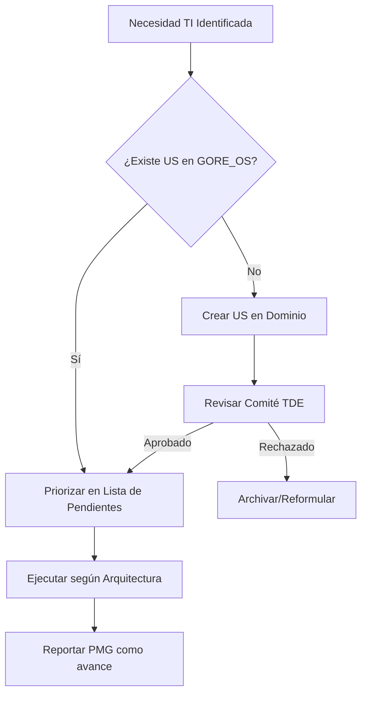

# Marco de Coexistencia Controlada: PTD ↔ GORE_OS

> **Documento Normativo Interno**  
> Versión: 1.0 | Fecha: 2025-12-18  
> Aplicable a: Gobierno Regional de Ñuble

---

## 1. Propósito

Establecer las reglas de coexistencia entre el **Plan de Transformación Digital PMG-MEI 2025** (Resolución Exenta N° 02034) y el **Blueprint GORE_OS**, asegurando:

1. **Trazabilidad completa** entre iniciativas PTD y dominios GORE_OS
2. **Gobernanza unificada** bajo un único Comité TDE
3. **Prohibición de desarrollos aislados** fuera del marco arquitectónico
4. **Cumplimiento PMG** sin duplicación de esfuerzos

---

## 2. Matriz de Correspondencia PTD ↔ GORE_OS

### 2.1 Dimensión Soporte Electrónico (D1)

| PTD ID | Iniciativa PTD              | Dominio GORE_OS    | Módulo | Historias de Usuario       |
| ------ | --------------------------- | ------------------ | ------ | -------------------------- |
| D1-01  | Autenticación ClaveÚnica    | **D-TDE**          | M2     | US-TDE-AUTH-001            |
| D1-02  | Interoperabilidad PISEE     | **D-TDE**          | M3     | US-TDE-INTEROP-001/002/003 |
| D1-03  | Notificaciones Electrónicas | **D-TDE**          | M2     | US-TDE-NOTIF-001           |
| D1-04  | Digitalización Solicitudes  | **D-TDE**          | M2     | US-TDE-DIGITAL-001         |
| D1-05  | Expediente Electrónico      | **D-TDE** + D-NORM | M7     | US-TDE-EXP-001/002/003/004 |
| D1-06  | DocDigital Comunicaciones   | **D-TDE**          | M2     | US-TDE-DOCDIG-001          |

### 2.2 Dimensión Calidad Web (D2)

| PTD ID    | Iniciativa PTD             | Dominio GORE_OS       | Módulo | Historias de Usuario |
| --------- | -------------------------- | --------------------- | ------ | -------------------- |
| D2.1-AI4  | Arq. Información Web       | **D-TDE**             | M1     | US-TDE-WEB-001       |
| D2.1-TE9  | Tecnología Web             | **D-TDE**             | M1     | US-TDE-WEB-002       |
| D2.1-AC10 | Atención Ciudadana Web     | **D-TDE** + D-GESTION | M1     | US-TDE-WEB-003       |
| D2.2-CL5  | Lenguaje Claro Servicio    | **D-TDE**             | M1     | US-TDE-SERV-001      |
| D2.2-AI10 | Arq. Info Servicio Digital | **D-TDE**             | M1     | US-TDE-SERV-002      |
| D2.2-EG17 | Enfoque de Género          | **D-TDE** + D-GESTION | M1     | US-TDE-SERV-001      |

### 2.3 Dimensión Gestión de Datos (D3)

| PTD ID   | Iniciativa PTD           | Dominio GORE_OS    | Módulo | Historias de Usuario |
| -------- | ------------------------ | ------------------ | ------ | -------------------- |
| D3-VE-01 | Visión Estratégica Datos | **D-TDE** + D-EVOL | M1     | US-TDE-DATA-001      |
| D3-GO-01 | Gobernanza Datos         | **D-TDE**          | M1     | US-TDE-DATA-001/002  |
| D3-AD-01 | Arquitectura/Doc Datos   | **D-TDE** + D-EVOL | M1     | US-TDE-DATA-002/003  |

---

## 3. Asignación por Dominio GORE_OS

| Dominio   | Iniciativas PTD Asignadas              | Responsable Técnico    |
| --------- | -------------------------------------- | ---------------------- |
| **D-TDE** | Todas (15/15) - Principal              | CTD / Jefe Informática |
| D-NORM    | D1-05 (Expediente compartido)          | Fiscalía / Jurídica    |
| D-GESTION | D2.1-AC10, D2.2-EG17 (Atención/Género) | RRHH / Gabinete        |
| D-EVOL    | D3-VE-01, D3-AD-01 (Datos/Analítica)   | CTD / Observatorio     |

---

## 4. Gobernanza Unificada: Comité TDE

### 4.1 Composición

| Rol                  | Cargo                  |  Voz  | Voto  |
| -------------------- | ---------------------- | :---: | :---: |
| Presidente           | Administrador Regional |   ✅   |   ✅   |
| Secretario Ejecutivo | Coordinador TD (CTD)   |   ✅   |   ✅   |
| Miembro Permanente   | Jefe DAF               |   ✅   |   ✅   |
| Miembro Permanente   | Jefe DIPLADE           |   ✅   |   ✅   |
| Miembro Permanente   | Fiscal Regional        |   ✅   |   ❌   |
| Invitado Técnico     | CISO / DPO             |   ✅   |   ❌   |

### 4.2 Funciones del Comité

1. **Aprobar** toda iniciativa de desarrollo TI >100 UTM
2. **Priorizar** lista de pendientes (Backlog) de Historias de Usuario cada trimestre
3. **Resolver** conflictos entre dominios GORE_OS
4. **Reportar** avance PMG a la Red de Gobierno Digital
5. **Vetar** desarrollos que violen la arquitectura GORE_OS

### 4.3 Sesiones

| Ordinaria      | Mensual (primer lunes) | Quórum | Convocatoria                  |
| -------------- | ---------------------- | ------ | ----------------------------- |
| Ordinaria      | Mensual (primer lunes) | 50%+1  | CTD con 5 días hábiles        |
| Extraordinaria | A solicitud            | 50%+1  | Presidente con 2 días hábiles |

---

## 5. Reglas de Desarrollo

### 5.1 Prohibición de Desarrollos Aislados

> [!CAUTION]
> **Queda expresamente prohibido** iniciar cualquier proyecto de desarrollo, adquisición o contratación de software que:
> 1. No esté mapeado a un Dominio del Blueprint GORE_OS
> 2. No tenga Historias de Usuario aprobadas en la lista de pendientes (Backlog) D-TDE
> 3. No haya sido evaluado por el Comité TDE
> 4. No cumpla los estándares de interoperabilidad (PISEE/API)

### 5.2 Flujo Obligatorio de Aprobación

### 5.3 Estándares Técnicos Obligatorios

| Componente        | Estándar              | Referencia |
| ----------------- | --------------------- | ---------- |
| Autenticación     | ClaveÚnica OIDC       | DS 12      |
| Interoperabilidad | PISEE / REST API      | DS 11      |
| Documentos        | DocDigital / FirmaGob | DS 9       |
| Notificaciones    | Plataforma Estado DDU | DS 8       |
| Seguridad         | ENSI (ISO 27001)      | DS 7       |
| Expediente        | IUIe + Foliado        | DS 10      |

---

## 6. Reporte PMG

### 6.1 Mapeo de Hitos PMG ↔ GORE_OS

El avance del PTD (PMG-MEI) se reportará automáticamente desde el progreso de Historias de Usuario en GORE_OS:

| Hito PMG               | Evidencia GORE_OS                            |
| ---------------------- | -------------------------------------------- |
| Hito cumplido          | US en estado "Completada" (Finalizada) + evidencia |
| Actividad ejecutada    | US en estado "En Progreso" (En Progreso)     |
| Indicador de proceso   | % Historias de Usuario completadas           |
| Indicador de resultado | KPI del módulo D-TDE correspondiente         |

### 6.2 Responsabilidad de Reporte

| Actividad                 | Responsable            | Frecuencia           |
| ------------------------- | ---------------------- | -------------------- |
| Actualizar estado US      | Equipo de desarrollo   | Semanal              |
| Consolidar métricas       | CTD                    | Mensual              |
| Reportar a Red GobDigital | CTD                    | Según calendario PMG |
| Aprobar reporte           | Administrador Regional | Antes de envío       |

---

## 7. Vigencia y Modificaciones

- **Vigencia**: A partir de su aprobación por el Administrador Regional
- **Modificaciones**: Solo por acuerdo del Comité TDE con 2/3 de votos
- **Revisión**: Anual, alineada con ciclo presupuestario

---

## 8. Anexo: Acta de Compromiso

> Yo, en mi calidad de [CARGO], me comprometo a:
> 1. No promover desarrollos TI fuera del marco GORE_OS
> 2. Priorizar las Historias de Usuario del dominio bajo mi responsabilidad
> 3. Reportar oportunamente los avances al Comité TDE
> 4. Rechazar proveedores que no cumplan los estándares técnicos

| Nombre | Cargo                  | Firma | Fecha |
| ------ | ---------------------- | ----- | ----- |
|        | Administrador Regional |       |       |
|        | Jefe DAF               |       |       |
|        | Jefe DIPLADE           |       |       |
|        | Coordinador TD         |       |       |
|        | Fiscal Regional        |       |       |

---

*Documento generado como parte del proceso de gobernanza GORE_OS.*  
*Versión: 1.0 | 18 Diciembre 2025*
