# GORE OS — Especificación de Sistema

> **Versión**: 6.4.0 REN-COMPLETE  
> **Fecha**: 2025-12-12  
> **Paradigma**: Ingeniería de Software Composicional  
> **Ontología**: [`data-gore/ontology`](file:///Users/felixsanhueza/fx_felixiando/data-gore/ontology) v6.0.0

---

## 0. MANIFEST

### 0.1 Stack Canónico

| Capa           | Tecnología            | Rol Categórico                    | Versión |
| -------------- | --------------------- | --------------------------------- | ------- |
| **Runtime**    | Bun                   | VM JavaScript de alto rendimiento | ^1.1    |
| **HTTP**       | Hono                  | Middleware composable             | ^4.0    |
| **Effects**    | Effect-TS             | Monad Stack `Effect<A, E, R>`     | ^3.0    |
| **API**        | tRPC v11              | Functor `S → API` (Type-Safe RPC) | ^11.0   |
| **FSM**        | XState v5             | Coalgebra (Máquinas de Estado)    | ^5.0    |
| **ORM**        | Drizzle               | Functor `API → DB`                | ^0.30   |
| **Validation** | Zod                   | Subobject Classifier Ω (Schemas)  | ^3.23   |
| **Database**   | PostgreSQL + PostGIS  | Persistencia geo-referenciada     | ^16/3.4 |
| **Frontend**   | React + Vite          | Interfaz de Capacidad Humana      | ^18/^5  |
| **Auth**       | Keycloak / ClaveÚnica | Identity Provider (SSO)           | ^24     |
| **Container**  | Docker + Compose      | Orquestación local/producción     | ^24/^2  |
| **Queue**      | Redis                 | Message Broker + Cache            | ^7      |

### 0.2 Alineación Ontológica

El sistema implementa la estructura biomimética de la ontología v6.0.0:

| Dominio Molecular (Ontología)   | Módulos GORE OS          | ID Ontología        |
| ------------------------------- | ------------------------ | ------------------- |
| **I. Espacio Territorial**      | M7, M8, M9               | `MOL-TERRITORIAL`   |
| **II. Agencia Institucional**   | M15, M16, M17, M18, M20  | `MOL-INSTITUTIONAL` |
| **III. Tejido Normativo**       | M2, M11, M13             | `MOL-NORMATIVE`     |
| **IV. Metabolismo Operacional** | M1, M3, M4, M5, M12, M14 | `MOL-INVERSION`     |
| **V. Sistema Nervioso Digital** | M6, M10, M19             | `MOL-DIGITAL`       |

#### Módulos Especializados de Inversión (M20-M26)

| Módulo                                      | Dominio           | ID Ontología       |
| ------------------------------------------- | ----------------- | ------------------ |
| **M20** Seguridad y Prevención del Delito   | II. Institucional | `MOL-SECURITY`     |
| **M21** Gobernanza de Inversión (Filtro)    | IV. Metabolismo   | `MOL-GOVERNANCE`   |
| **M22** PPR (Programas Públicos Regionales) | IV. Metabolismo   | `MOL-PPR`          |
| **M23** FRIL (Iniciativa Local)             | IV. Metabolismo   | `MOL-FRIL`         |
| **M24** FRPD (Fomento Productivo)           | IV. Metabolismo   | `MOL-FRPD`         |
| **M25** Concurso 8% (Subvenciones)          | IV. Metabolismo   | `MOL-SUBVENCIONES` |
| **M26** Circular 33 (Activos y Emergencia)  | IV. Metabolismo   | `MOL-CIRC33`       |

### 0.3 Estructura del Proyecto

```
gore-os/
├── apps/
│   ├── web/                     # Frontend React (SPA)
│   │   ├── src/
│   │   │   ├── components/      # UI Components
│   │   │   ├── pages/           # Route pages
│   │   │   └── hooks/           # React hooks
│   │   ├── Dockerfile
│   │   └── package.json
│   └── api/                     # Backend Hono + tRPC
│       ├── src/
│       │   ├── routers/         # tRPC routers by domain
│       │   ├── services/        # Business logic (Effect-TS)
│       │   ├── repos/           # Repositories (Drizzle)
│       │   ├── machines/        # XState FSMs
│       │   └── schemas/         # Zod schemas (GENOMA)
│       ├── Dockerfile
│       └── package.json
├── packages/
│   ├── domain/                  # Shared types (Category 𝐃)
│   ├── contracts/               # tRPC contracts
│   └── config/                  # Shared config
├── drizzle/
│   ├── schema/                  # DB schema by domain
│   └── migrations/              # SQL migrations
├── docker/
│   ├── postgres/                # Postgres + PostGIS init
│   ├── keycloak/                # Keycloak realm config
│   └── nginx/                   # Reverse proxy (prod)
├── docker-compose.yml           # Desarrollo (con hot-reload)
├── docker-compose.prod.yml      # Producción
└── .env.example
```

### 0.4 Docker Compose (Desarrollo)

```yaml
# docker-compose.yml
version: '3.9'

services:
  # ===== Base de Datos =====
  postgres:
    image: postgis/postgis:16-3.4
    container_name: gore-os-db
    environment:
      POSTGRES_DB: gore_os
      POSTGRES_USER: ${DB_USER:-gore}
      POSTGRES_PASSWORD: ${DB_PASSWORD:-gore_dev_2024}
    ports:
      - '5432:5432'
    volumes:
      - gore_pg_data:/var/lib/postgresql/data
      - ./docker/postgres/init.sql:/docker-entrypoint-initdb.d/init.sql
    healthcheck:
      test: ['CMD-SHELL', 'pg_isready -U gore']
      interval: 5s
      timeout: 5s
      retries: 5

  # ===== Cache / Queue =====
  redis:
    image: redis:7-alpine
    container_name: gore-os-redis
    ports:
      - '6379:6379'
    volumes:
      - gore_redis_data:/data

  # ===== Identity Provider =====
  keycloak:
    image: quay.io/keycloak/keycloak:24.0
    container_name: gore-os-auth
    environment:
      KEYCLOAK_ADMIN: admin
      KEYCLOAK_ADMIN_PASSWORD: ${KC_ADMIN_PASSWORD:-admin_dev}
      KC_DB: postgres
      KC_DB_URL: jdbc:postgresql://postgres:5432/keycloak
      KC_DB_USERNAME: ${DB_USER:-gore}
      KC_DB_PASSWORD: ${DB_PASSWORD:-gore_dev_2024}
    command: start-dev
    ports:
      - '8080:8080'
    depends_on:
      postgres:
        condition: service_healthy

  # ===== API Backend =====
  api:
    build:
      context: .
      dockerfile: apps/api/Dockerfile
    container_name: gore-os-api
    environment:
      DATABASE_URL: postgres://${DB_USER:-gore}:${DB_PASSWORD:-gore_dev_2024}@postgres:5432/gore_os
      REDIS_URL: redis://redis:6379
      KEYCLOAK_URL: http://keycloak:8080
      NODE_ENV: development
    ports:
      - '3000:3000'
    volumes:
      - ./apps/api/src:/app/src:ro  # Hot reload
    depends_on:
      - postgres
      - redis
      - keycloak
    command: bun run dev

  # ===== Frontend Web =====
  web:
    build:
      context: .
      dockerfile: apps/web/Dockerfile
    container_name: gore-os-web
    environment:
      VITE_API_URL: http://localhost:3000
      VITE_KEYCLOAK_URL: http://localhost:8080
    ports:
      - '5173:5173'
    volumes:
      - ./apps/web/src:/app/src:ro  # Hot reload
    command: bun run dev

volumes:
  gore_pg_data:
  gore_redis_data:
```

### 0.5 Dockerfile API (Multi-stage)

```dockerfile
# apps/api/Dockerfile

# === Stage 1: Build ===
FROM oven/bun:1.1 AS builder
WORKDIR /app

COPY package.json bun.lockb ./
COPY packages ./packages
COPY apps/api ./apps/api

RUN bun install --frozen-lockfile
RUN bun run build --filter=@gore-os/api

# === Stage 2: Runtime ===
FROM oven/bun:1.1-slim AS runtime
WORKDIR /app

COPY --from=builder /app/apps/api/dist ./dist
COPY --from=builder /app/node_modules ./node_modules
COPY --from=builder /app/package.json ./

ENV NODE_ENV=production
EXPOSE 3000

CMD ["bun", "run", "dist/index.js"]
```

### 0.6 Comandos de Desarrollo

```bash
# Levantar todo el stack
docker compose up -d

# Ver logs del API
docker compose logs -f api

# Ejecutar migraciones
docker compose exec api bun run db:migrate

# Seed de datos
docker compose exec api bun run db:seed

# Detener sin borrar volúmenes
docker compose down

# Detener y borrar volúmenes (reset)
docker compose down -v
```

---

## PARTE I: DOMINIO (𝐃)

> El dominio es una **categoría** donde los **objetos** son entidades y los **morfismos** son relaciones.

### 1.1 Entidades Fundamentales (Objetos de 𝐃)

#### Agregados Raíz por Dominio

| Entidad                | Schema PostgreSQL           | Dominio Molecular | Ontología           |
| ---------------------- | --------------------------- | ----------------- | ------------------- |
| `Iniciativa`           | `gore.iniciativa`           | IV. Metabolismo   | `MOL-INVERSION`     |
| `Convenio`             | `gore.convenio`             | IV. Metabolismo   | `MOL-INVERSION`     |
| `Rendicion`            | `gore.rendicion`            | IV. Metabolismo   | `MOL-INVERSION`     |
| `Ejecutor`             | `gore.ejecutor`             | IV. Metabolismo   | `MOL-INVERSION`     |
| `ExpedienteRendicion`  | `gore.expediente_rendicion` | IV. Metabolismo   | `MOL-INVERSION`     |
| `TransaccionRend`      | `gore.transaccion_rend`     | IV. Metabolismo   | `MOL-INVERSION`     |
| `EjecucionMensual`     | `gore.ejecucion_mensual`    | IV. Metabolismo   | `MOL-INVERSION`     |
| `PresupuestoAnual`     | `gore.presupuesto_anual`    | III. Normativo    | `MOL-FINANCIAL`     |
| `AsignacionPpto`       | `gore.asignacion_ppto`      | III. Normativo    | `MOL-FINANCIAL`     |
| `Asignacion`           | `gore.asignacion`           | III. Normativo    | `MOL-FINANCIAL`     |
| `CDP`                  | `gore.cdp`                  | III. Normativo    | `MOL-FINANCIAL`     |
| `ModificacionPpto`     | `gore.modificacion_ppto`    | III. Normativo    | `MOL-FINANCIAL`     |
| `ProgramaCaja`         | `gore.programa_caja`        | III. Normativo    | `MOL-FINANCIAL`     |
| `TramiteDIPRES`        | `gore.tramite_dipres`       | III. Normativo    | `MOL-FINANCIAL`     |
| `Funcionario`          | `gore.persona`              | II. Institucional | `MOL-INSTITUTIONAL` |
| `Division`             | `gore.division`             | II. Institucional | `MOL-INSTITUTIONAL` |
| `Bien`                 | `gore.bien`                 | II. Institucional | `MOL-INSTITUTIONAL` |
| `Comuna`               | `geo.comuna`                | I. Territorial    | `MOL-TERRITORIAL`   |
| `CapaGeo`              | `geo.capa`                  | I. Territorial    | `MOL-GEOSPATIAL`    |
| `RAT`                  | `compliance.rat`            | V. Digital        | `MOL-COMPLIANCE`    |
| `EventoDocumental`     | `core.evento_documental`    | V. Digital        | `MOL-DIGITAL`       |
| `GapReconciliacion`    | `core.gap_reconciliacion`   | V. Digital        | `MOL-DIGITAL`       |
| `DelegadoPresidencial` | `gob.delegado`              | II. Institucional | `MOL-INSTITUTIONAL` |
| `CompetenciaTransf`    | `gob.competencia`           | II. Institucional | `MOL-INSTITUTIONAL` |
| `PlanGRD`              | `grd.plan`                  | I. Territorial    | `MOL-TERRITORIAL`   |
| `DeclaracionIP`        | `probidad.dip`              | III. Normativo    | `MOL-COMPLIANCE`    |
| `IncidenteSeguridad`   | `seg.incidente`             | VI. Seguridad     | `MOL-SECURITY`      |
| `EvidenciaDigital`     | `seg.evidencia`             | VI. Seguridad     | `MOL-SECURITY`      |
| `CamaraCies`           | `seg.camara`                | VI. Seguridad     | `MOL-SECURITY`      |
| `MetadatoGeo`          | `geo.metadato`              | I. Territorial    | `MOL-GEOSPATIAL`    |
| `ServicioOGC`          | `geo.servicio`              | I. Territorial    | `MOL-GEOSPATIAL`    |
| `ActoAdministrativo`   | `admin.acto`                | II. Institucional | `MOL-ADMIN`         |
| `ExpedienteAdmin`      | `admin.expediente`          | II. Institucional | `MOL-ADMIN`         |
| `IncidenteSeguridad`   | `seg.incidente`             | VI. Seguridad     | `MOL-SECURITY`      |
| `EvidenciaDigital`     | `seg.evidencia`             | VI. Seguridad     | `MOL-SECURITY`      |
| `CamaraCies`           | `seg.camara`                | VI. Seguridad     | `MOL-SECURITY`      |
| `MetadatoGeo`          | `geo.metadato`              | I. Territorial    | `MOL-GEOSPATIAL`    |
| `ServicioOGC`          | `geo.servicio`              | I. Territorial    | `MOL-GEOSPATIAL`    |
| `ActoAdministrativo`   | `admin.acto`                | II. Institucional | `MOL-ADMIN`         |
| `ExpedienteAdmin`      | `admin.expediente`          | II. Institucional | `MOL-ADMIN`         |


#### Tipos TypeScript Canónicos

```typescript
// packages/domain/src/entities/iniciativa.ts

import { z } from 'zod'

// Branded Types (Value Objects)
export type IniciativaId = string & { readonly __brand: 'IniciativaId' }
export type CodigoBIP = string & { readonly __brand: 'CodigoBIP' }
export type CodigoUnico = string & { readonly __brand: 'CodigoUnico' } // ej: "20119065-2022"

// === ENUMS DERIVADOS DEL STAGING RECONCILIADO ===

// Clasificador SIGFE (Subtítulos Ley de Presupuesto)
export const Subtitulo = z.enum([
  '24',  // Transferencias Corrientes
  '29',  // Adquisición Activos No Financieros
  '31',  // Iniciativas de Inversión
  '33',  // Transferencias de Capital
])
export type Subtitulo = z.infer<typeof Subtitulo>

// Vigencia de la iniciativa
export const Vigencia = z.enum(['VIGENTE', 'NO_VIGENTE'])
export type Vigencia = z.infer<typeof Vigencia>

// Resultado Técnico-Económico MDSF
export const RATE = z.enum(['RS', 'FI', 'OT', 'AD', 'NV'])
export type RATE = z.infer<typeof RATE>

// Tipología de evaluación
export const Tipologia = z.enum([
  'MIDESO',        // Evaluación metodología SNI
  'PROGRAMA',      // Programa público
  'TRANSFERENCIA', // Transferencia a ejecutor
  'SIMPLIFICADO',  // Evaluación simplificada (<5000 UTM)
])
export type Tipologia = z.infer<typeof Tipologia>

// Sum Type (Coproducto) = Estados Excluyentes
export const EstadoIPR = z.enum([
  'POSTULADA', 'PRE_ADMISIBLE', 'EN_ADMISIBILIDAD', 'ADMISIBLE',
  'EN_EVALUACION_MDSF', 'CON_RS', 'CON_FI', 'CON_OT',
  'EN_CARTERA', 'PRIORIZADA', 'EN_FINANCIAMIENTO', 
  'EN_FORMALIZACION', 'EN_EJECUCION', 'EN_CIERRE', 'CERRADA',
  // Estados adicionales del staging
  'APRO_CORE', 'REVISANDO_ADMISIBILIDAD', 'APROBADO_TECNICAMENTE', 'REVISAR'
])
export type EstadoIPR = z.infer<typeof EstadoIPR>

// Product Type = Entidad Completa (AMPLIADA con campos staging)
export const IniciativaSchema = z.object({
  id: z.string().uuid().transform(s => s as IniciativaId),
  codigoUnico: z.string().transform(s => s as CodigoUnico), // GAP-INI-01: "20119065-2022"
  codigoBIP: z.string().optional().transform(s => s as CodigoBIP | undefined),
  anio: z.number().int().min(2015).max(2030),
  nombre: z.string().min(10).max(500),
  tipo: z.enum(['PROYECTO', 'PROGRAMA']),
  
  // Clasificación Financiera SIGFE (GAP-INI-04/05)
  subtitulo: Subtitulo,
  item: z.number().optional(),
  asignacion: z.number().optional(),
  
  // Montos desglosados (GAP-INI-06)
  montoTotal: z.number().positive(),
  montoFNDR: z.number().nonnegative(),
  montoSectorial: z.number().nonnegative().default(0),
  
  // Ubicación
  provincia: z.string(),
  comunaId: z.string().uuid(),
  
  // Responsabilidad
  formulador: z.string().optional(),
  unidadTecnica: z.string().optional(),
  ejecutorId: z.string().uuid(),
  
  // Estados y ciclo de vida
  estado: EstadoIPR,
  fechaEstado: z.date().optional(),
  vigencia: Vigencia, // GAP-INI-02
  etapa: z.enum(['PREFACTIBILIDAD', 'DISEÑO', 'EJECUCIÓN', 'CIERRE']).optional(),
  
  // Evaluación técnica (GAP-INI-03/07)
  tipologia: Tipologia.optional(),
  rate: RATE.optional(),
  
  // Track de financiamiento
  track: z.enum(['SNI', 'FRIL', 'FRPD', '8PCT', 'GLOSA06', 'CIRC33']),
  
  // Alineamiento ERD (GAP-INI-08)
  ejeERD: z.string().optional(),
  lineamientoERD: z.string().optional(),
  objetivoERD: z.string().optional(),
  
  // Impacto social (GAP-INI-09)
  beneficiarios: z.number().nonnegative().optional(),
  
  // Auditoría
  createdAt: z.date(),
  updatedAt: z.date(),
})
export type Iniciativa = z.infer<typeof IniciativaSchema>
```

```typescript
// packages/domain/src/entities/rat.ts (Registro de Actividades de Tratamiento)

import { z } from 'zod'

// RAT Entity (Ley 21.719 compliance)
export type RATId = string & { readonly __brand: 'RATId' }

export const RATSchema = z.object({
  id: z.string().uuid().transform(s => s as RATId),
  nombreTratamiento: z.string().min(5).max(200),
  finalidad: z.string().min(10),
  baseLegal: z.enum(['CONSENTIMIENTO', 'LEY', 'CONTRATO', 'INTERES_VITAL', 'MISION_PUBLICA']),
  categoriasDatos: z.array(z.enum(['IDENTIFICACION', 'CONTACTO', 'LABORAL', 'FINANCIERO', 'SENSIBLE'])),
  fuenteDatos: z.string(),
  destinatarios: z.array(z.string()),
  plazosConservacion: z.number().positive().describe('Meses'),
  transferenciasInt: z.boolean().default(false),
  paisesDestino: z.array(z.string()).optional(),
  medidasSeguridad: z.array(z.string()),
  anonimizacion: z.enum(['NINGUNA', 'SEUDONIMIZACION', 'ANONIMIZACION_COMPLETA']).default('NINGUNA'),
  version: z.number().positive().default(1),
  fechaVersion: z.date(),
  sistemaOrigen: z.enum(['GORE_OS', 'SIGFE', 'SIAPER', 'OTRO']),
  responsableId: z.string().uuid(), // DPO or delegate
  createdAt: z.date(),
  updatedAt: z.date(),
})
export type RAT = z.infer<typeof RATSchema>
```

```typescript
// packages/domain/src/entities/convenio.ts (AMPLIADO con staging)

import { z } from 'zod'

// Branded Types
export type ConvenioId = string & { readonly __brand: 'ConvenioId' }

// Estados CGR (GAP-CONV-01)
export const EstadoCGR = z.enum([
  'PENDIENTE',
  'EN_CGR',
  'TOMADO_DE_RAZON',
  'TR_CON_ALCANCES',
  'REPRESENTADO',
])
export type EstadoCGR = z.infer<typeof EstadoCGR>

// Estados del Convenio (GAP-CONV-05)
export const EstadoConvenio = z.enum([
  'EN_ELABORACION',
  'EN_REVISION',
  'ENCOMENDADO_DIT',
  'FIRMADO',
  'NO_SE_FIRMO',
  'SIN_CONVENIO',
])
export type EstadoConvenio = z.infer<typeof EstadoConvenio>

// Tipo de Resolución (GAP-CONV-02)
export const TipoResolucion = z.enum([
  'AFECTA',   // Requiere toma de razón CGR
  'EXENTA',   // No requiere CGR
])
export type TipoResolucion = z.infer<typeof TipoResolucion>

export const ConvenioSchema = z.object({
  id: z.string().uuid().transform(s => s as ConvenioId),
  codigoIniciativa: z.string(), // FK a Iniciativa.codigoBIP
  nombre: z.string().max(500),
  
  // Clasificación Financiera SIGFE
  subtitulo: Subtitulo,
  item: z.number().optional(),
  asignacion: z.number().optional(),
  
  // Ejecutor
  unidadTecnica: z.string(), // GAP-CONV-06: Nombre ejecutor
  referenteTecnico: z.string().optional(), // GAP-CONV-04: Funcionario GORE
  
  // Ubicación
  provincia: z.string(),
  comuna: z.string(),
  
  // Financiero
  montoFNDR: z.number().positive(),
  
  // Estados y flujo
  estado: EstadoConvenio, // GAP-CONV-05
  tipoResolucion: TipoResolucion, // GAP-CONV-02
  estadoCGR: EstadoCGR, // GAP-CONV-01
  
  // Fechas críticas (GAP-CONV-03)
  fechaFirma: z.date().optional(),
  fechaTomaRazon: z.date().optional(),
  
  // Auditoría
  createdAt: z.date(),
  updatedAt: z.date(),
})
export type Convenio = z.infer<typeof ConvenioSchema>
```

```typescript
// packages/domain/src/entities/ejecucion_mensual.ts (NUEVA - GAP-EJEC-01)

import { z } from 'zod'

// Tipo de Ejecución (GAP-EJEC-02)
export const TipoEjecucion = z.enum(['REAL', 'PROYECTADO'])
export type TipoEjecucion = z.infer<typeof TipoEjecucion>

// Tipo de Match para reconciliación (GAP-EJEC-03)
export const TipoMatch = z.enum([
  'EXACTO_CODIGO',
  'FUZZY_NOMBRE',
  'MANUAL',
  'SIN_MATCH',
])
export type TipoMatch = z.infer<typeof TipoMatch>

export const EjecucionMensualSchema = z.object({
  id: z.string().uuid(),
  codigoUnico: z.string(), // FK a Iniciativa.codigoUnico
  anio: z.number().int().min(2015).max(2030),
  mes: z.number().int().min(1).max(12),
  tipo: TipoEjecucion, // REAL vs PROYECTADO
  monto: z.number(), // M$ (puede ser negativo en ajustes)
  
  // Reconciliación BIP (GAP-EJEC-03)
  bipReconciliado: z.string().optional(),
  matchTipo: TipoMatch.optional(),
  iniciativaNombre: z.string().optional(),
  
  // Auditoría
  createdAt: z.date(),
})
export type EjecucionMensual = z.infer<typeof EjecucionMensualSchema>
```

```typescript
// packages/domain/src/entities/evento_documental.ts (NUEVA - GAP-DOC-01)

import { z } from 'zod'

// Tipo de Entidad (polimorfismo)
export const TipoEntidad = z.enum(['CONVENIO', 'INICIATIVA', 'RENDICION', 'CDP'])
export type TipoEntidad = z.infer<typeof TipoEntidad>

// Tipo de Evento Documental (GAP-DOC-02)
export const TipoEvento = z.enum([
  'CERT_CORE',      // Certificación CORE
  'CREA_ASIG',      // Creación de asignación
  'APRUEBA_CONV',   // Aprobación convenio
  'FIRMA',          // Firma documento
  'TOMA_RAZON',     // Toma de razón CGR
  'OBSERVACION',    // Observación/devolución
  'SUBSANACION',    // Subsanación de observaciones
  'CIERRE',         // Cierre de expediente
])
export type TipoEvento = z.infer<typeof TipoEvento>

export const EventoDocumentalSchema = z.object({
  id: z.string().uuid(),
  entidadTipo: TipoEntidad,
  entidadCodigo: z.string(), // Código de la entidad referenciada
  tipoEvento: TipoEvento, // GAP-DOC-02
  numeroDoc: z.string().optional(), // GAP-DOC-03: ej "907/2024"
  fecha: z.date(),
  
  // Metadatos DS10
  iuie: z.string().optional(), // Identificador Único de Expediente
  funcionarioId: z.string().uuid().optional(),
  observaciones: z.string().optional(),
  
  // Auditoría
  createdAt: z.date(),
})
export type EventoDocumental = z.infer<typeof EventoDocumentalSchema>
```

```typescript
// packages/domain/src/entities/modificacion_ppto.ts (NUEVA - GAP-MOD-01)

import { z }od'

// Tipo de Modificación (GAP-MOD-03)
export const TipoModificacion = z.enum([
  'MODIFICACION',  // Reasignación entre ítems
  'REBAJA',        // Disminución de asignación
  'SUPLEMENTO',    // Aumento extraordinario
])
export type TipoModificacion = z.infer<typeof TipoModificacion>

export const ModificacionPresupuestariaSchema = z.object({
  id: z.string().uuid(),
  numeroModificacion: z.number().optional(), // GAP-MOD-02: Correlativo
  
  // Tipo y período
  tipo: TipoModificacion,
  anio: z.number().int().min(2020).max(2030),
  
  // Clasificación SIGFE
  subtitulo: Subtitulo,
  item: z.number().optional(),
  asignacion: z.number().optional(),
  
  // Referencia a Iniciativa
  codigoBIP: z.string().optional(),
  denominacion: z.string(),
  
  // Monto (positivo = aumento, negativo = rebaja)
  monto: z.number(),
  
  // Aprobación
  resolucionAprobatoria: z.string().optional(),
  fechaResolucion: z.date().optional(),
  
  // Auditoría
  createdAt: z.date(),
})
export type ModificacionPresupuestaria = z.infer<typeof ModificacionPresupuestariaSchema>
```

```typescript
// packages/domain/src/entities/presupuesto.ts (NUEVO - GAP-PR-*)

import { z } from 'zod'

// === ENUMS CICLO PRESUPUESTARIO (kb_gn_018) ===

// Grado de Afectación SIGFE (GAP-CL-03)
export const GradoAfectacion = z.enum([
  'SIN_AFECTAR',
  'PREAFECTADO',    // Licitación en curso
  'AFECTADO',       // Adjudicado
  'COMPROMETIDO',   // Orden de compra emitida
  'DEVENGADO',      // Obligación exigible
  'PAGADO',         // Transferencia realizada
])
export type GradoAfectacion = z.infer<typeof GradoAfectacion>

// Etapa del Ciclo Presupuestario (GAP-PR-01)
export const EtapaCicloPresupuestario = z.enum([
  'FORMULACION',
  'APROBACION_CORE',
  'TRAMITE_DIPRES',
  'TOMA_RAZON_CGR',
  'DISTRIBUCION_INICIAL',
  'EJECUCION',
  'MODIFICACION',
  'CONTROL',
  'CIERRE',
])
export type EtapaCicloPresupuestario = z.infer<typeof EtapaCicloPresupuestario>

// Tipo de Modificación Presupuestaria Detallada (GAP-GL-*)
export const TipoModificacionPpto = z.enum([
  'SUPLEMENTO',                 // Mayor aporte fiscal
  'INCORPORACION_INGRESOS',     // Fondos concursables
  'REDUCCION_INGRESOS',         // Rebaja
  'REASIGNACION_INTERNA',       // Entre subtítulos
  'TRANSFERENCIA_CONSOLIDABLE', // A otros organismos
  'EMERGENCIA_3PCT',            // Glosa 14
  'CREACION_FRPD',              // Uso provisión 33.03
  'DEUDA_FLOTANTE',             // Año siguiente
])
export type TipoModificacionPpto = z.infer<typeof TipoModificacionPpto>

// Glosas Presupuestarias Ley 21.722 (GAP-GL-*)
export const GlosaPpto = z.enum([
  'GLOSA_01', // Distribución inicial
  'GLOSA_03', // Prohibición inversión→funcionamiento
  'GLOSA_04', // Traspasos entre subtítulos
  'GLOSA_05', // Universidades regionales
  'GLOSA_06', // Programas directos (5% admin)
  'GLOSA_07', // 8% FNDR concurso
  'GLOSA_08', // Asociatividad
  'GLOSA_09', // Activos
  'GLOSA_10', // Inversión directa
  'GLOSA_11', // Convenios Subt. 33
  'GLOSA_13', // FRPD Royalty
  'GLOSA_14', // 3% Emergencia
  'GLOSA_16', // Transparencia FNDR
])
export type GlosaPpto = z.infer<typeof GlosaPpto>

// Fondos Regionales (GAP-GL-*)
export const FondoRegional = z.enum([
  'FNDR',           // Fondo Nacional Desarrollo Regional
  'FRIL',           // Fondo Regional Iniciativa Local
  'FRPD',           // Fondo Regional Productividad
  'FNDR_8PCT',      // 8% Concurso vinculación
  'EMERGENCIA_3PCT',// 3% Emergencia
  'EQUIDAD',        // Fondo Equidad Interregional
  'ASOCIATIVIDAD',  // Programa Asociatividad
])
export type FondoRegional = z.infer<typeof FondoRegional>

// Estado Trámite DIPRES (GAP-PE-01)
export const EstadoTramiteDIPRES = z.enum([
  'ENVIADO',
  'EN_REVISION',
  'OBSERVADO',
  'VISADO',
  'RECHAZADO',
])
export type EstadoTramiteDIPRES = z.infer<typeof EstadoTramiteDIPRES>

// Tipo Reporte DIPRES (GAP-KP-02)
export const TipoReporteDIPRES = z.enum([
  'PROGRAMA_EJECUCION_CAJA',
  'EJECUCION_MENSUAL',
  'REPORTE_TRIMESTRAL_TRANSFERENCIAS',
  'EJECUCION_SUBT31_BIP',
  'INFORME_DOTACION',
])
export type TipoReporteDIPRES = z.infer<typeof TipoReporteDIPRES>

// === SCHEMAS PRESUPUESTARIOS ===

// Asignación Presupuestaria con grados de afectación (GAP-CL-02, GAP-CL-03)
export const AsignacionPresupuestariaSchema = z.object({
  id: z.string().uuid(),
  anio: z.number().int().min(2020).max(2030),
  
  // Clasificador Institucional
  partida: z.string().default('31'), // Gobiernos Regionales
  capitulo: z.string(), // Ej: "08" para GORE Ñuble
  programa: z.enum(['01', '02', '03']), // 01=Funcionamiento, 02=Inversión, 03=Asociatividad
  
  // Clasificador Por Objeto
  subtitulo: Subtitulo,
  item: z.number().int().optional(),
  asignacion: z.number().int().optional(),
  subAsignacion: z.number().int().optional(),
  
  // Montos
  montoInicial: z.number().nonnegative(),
  montoVigente: z.number().nonnegative(),
  
  // Grados de Afectación (GAP-CL-03)
  disponible: z.number(),
  preafectado: z.number().default(0),
  afectado: z.number().default(0),
  comprometido: z.number().default(0),
  devengado: z.number().default(0),
  pagado: z.number().default(0),
  
  // Glosas aplicables
  glosasAplicables: z.array(GlosaPpto).optional(),
  
  // Auditoría
  createdAt: z.date(),
  updatedAt: z.date(),
})
export type AsignacionPresupuestaria = z.infer<typeof AsignacionPresupuestariaSchema>

// Presupuesto Anual con FSM de aprobación (GAP-PR-02)
export const PresupuestoAnualSchema = z.object({
  id: z.string().uuid(),
  anio: z.number().int().min(2020).max(2030),
  
  // Montos globales
  montoFuncionamiento: z.number().nonnegative(), // Programa 01
  montoInversion: z.number().nonnegative(),      // Programa 02
  montoAsociatividad: z.number().nonnegative(),  // Programa 03
  montoTotal: z.number().nonnegative(),
  
  // Estado FSM de aprobación
  etapa: EtapaCicloPresupuestario,
  
  // Fechas críticas (plazos D.L. 1.263)
  fechaPublicacionLey: z.date().optional(),
  fechaPropuestaGobernador: z.date().optional(),
  fechaAprobacionCORE: z.date().optional(),
  fechaEnvioDIPRES: z.date().optional(),
  fechaResolucionDIPRES: z.date().optional(),
  fechaTomaRazonCGR: z.date().optional(),
  
  // Documentación
  numeroAcuerdoCORE: z.string().optional(),
  numeroResolucionDIPRES: z.string().optional(),
  
  // Saldos de cierre
  saldoInicialCaja: z.number().default(0), // SIC
  deudaFlotante: z.number().default(0),
  
  // Auditoría
  createdAt: z.date(),
  updatedAt: z.date(),
})
export type PresupuestoAnual = z.infer<typeof PresupuestoAnualSchema>

// Programa de Caja Mensual (GAP-PR-03)
export const ProgramaCajaSchema = z.object({
  id: z.string().uuid(),
  anio: z.number().int(),
  mes: z.number().int().min(1).max(12),
  
  // Montos proyectados vs ejecutados
  montoProyectado: z.number(),
  montoEjecutado: z.number(),
  desviacion: z.number(), // % desviación
  
  // Composición
  aporteFiscal: z.number(),
  ingresosRegionales: z.number().default(0),
  saldoCajaAnterior: z.number().default(0),
  
  // Estado
  estado: z.enum(['PROYECTADO', 'ENVIADO_DIPRES', 'APROBADO', 'EJECUTADO']),
  fechaEnvioDIPRES: z.date().optional(),
  
  // Auditoría
  createdAt: z.date(),
})
export type ProgramaCaja = z.infer<typeof ProgramaCajaSchema>

// Trámite DIPRES (GAP-PE-01)
export const TramiteDIPRESSchema = z.object({
  id: z.string().uuid(),
  tipo: z.enum(['VISACION_MODIFICACION', 'RESOLUCION_INICIAL', 'DECRETO_SUPREMO', 'INFORME']),
  
  // Identificación
  numeroOficio: z.string(),
  fechaEnvio: z.date(),
  fechaRespuesta: z.date().optional(),
  
  // Estado
  estado: EstadoTramiteDIPRES,
  observaciones: z.string().optional(),
  
  // Referencias
  modificacionId: z.string().uuid().optional(),
  presupuestoId: z.string().uuid().optional(),
  
  // Auditoría
  createdAt: z.date(),
})
export type TramiteDIPRES = z.infer<typeof TramiteDIPRESSchema>
```

```typescript
// packages/domain/src/entities/rendiciones.ts (NUEVO - GAP-REN-*)

import { z } from 'zod'

// === ENUMS GESTIÓN RENDICIONES (kb_gn_020) ===

// Tipo de Rendición (STS-KB-GN-RENDICION-PROCESO-*)
export const TipoRendicion = z.enum([
  'MENSUAL',           // Rendición periódica
  'REGULARIZACION',    // Corrección de observaciones
  'SIN_MOVIMIENTO',    // Sin gastos en período
  'FINAL',             // Cierre de proyecto
])
export type TipoRendicion = z.infer<typeof TipoRendicion>

// Estado Rendición SISREC (FSM completo)
export const EstadoRendicionSISREC = z.enum([
  'BORRADOR',
  'ENVIADA_MFE',       // A Ministro de Fe
  'CERTIFICADA',       // Por Ministro de Fe
  'ENVIADA_GORE',      // Firmada con FEA
  'EN_REVISION',       // RTF revisando
  'OBSERVADA',         // Requiere corrección
  'APROBADA_RTF',      // Aprobada por RTF
  'APROBADA_DAF',      // Firmada por Jefe DAF
  'CONTABILIZADA',     // En SIGFE
  'ARCHIVADA',         // Expediente cerrado
])
export type EstadoRendicionSISREC = z.infer<typeof EstadoRendicionSISREC>

// Tipo Entidad Ejecutora (STS-KB-GN-RENDICION-ACTORES-EJECUTORES-01)
export const TipoEjecutor = z.enum([
  'MUNICIPALIDAD',
  'SERVICIO_PUBLICO',  // SERVIU, Vialidad, etc.
  'PRIVADO_SFL',       // Sin fines de lucro (ONG, Fundación)
  'UNIVERSIDAD',
  'CORPORACION',
])
export type TipoEjecutor = z.infer<typeof TipoEjecutor>

// Rol SISREC (STS-KB-GN-RENDICION-SISREC-*)
export const RolSISREC = z.enum([
  'ADMINISTRADOR_OTORGANTE',    // Super admin GORE
  'ENCARGADO_OTORGANTE',        // Jefe DAF
  'ANALISTA_OTORGANTE',         // RTF
  'ENCARGADO_EJECUTOR',         // Jefe Finanzas Ejecutor
  'ANALISTA_EJECUTOR',          // Funcionario Ejecutor
  'MINISTRO_DE_FE',             // Certifica documentos
])
export type RolSISREC = z.infer<typeof RolSISREC>

// Tipo Documento Respaldo
export const TipoDocumentoRendicion = z.enum([
  'FACTURA',
  'BOLETA',
  'LIQUIDACION',
  'CONTRATO',
  'TRANSFERENCIA',
  'ACTA_RECEPCION',
  'INFORME_AVANCE',
])
export type TipoDocumentoRendicion = z.infer<typeof TipoDocumentoRendicion>

// === SCHEMAS RENDICIONES ===

// Rendición de Cuentas Extendida (kb_gn_020)
export const RendicionExtendidaSchema = z.object({
  id: z.string().uuid(),
  convenioId: z.string().uuid(),
  
  // Tipo y período
  tipo: TipoRendicion,
  periodoMes: z.number().int().min(1).max(12),
  periodoAnio: z.number().int().min(2020).max(2030),
  
  // Estado FSM
  estado: EstadoRendicionSISREC,
  
  // Actores Ejecutor
  analistaEjecutorId: z.string().uuid().optional(),
  ministroFeId: z.string().uuid().optional(),
  encargadoEjecutorId: z.string().uuid().optional(),
  
  // Actores GORE
  analistaOtorganteId: z.string().uuid().optional(), // RTF
  encargadoOtorganteId: z.string().uuid().optional(), // Jefe DAF
  
  // Montos
  montoRendido: z.number().nonnegative(),
  montoAprobado: z.number().nonnegative().default(0),
  montoObservado: z.number().nonnegative().default(0),
  montoReintegrar: z.number().nonnegative().default(0),
  
  // SISREC
  codigoSISREC: z.string().optional(),
  fechaEnvioSISREC: z.date().optional(),
  fechaAprobacionSISREC: z.date().optional(),
  
  // Firmas FEA
  firmaEjecutorFEA: z.boolean().default(false),
  firmaOtorganteFEA: z.boolean().default(false),
  
  // Contabilización SIGFE
  contabilizadoSIGFE: z.boolean().default(false),
  fechaContabilizacion: z.date().optional(),
  
  // Plazos (Art. 18 Res. 30)
  fechaLimite: z.date(),
  diasMora: z.number().int().default(0),
  
  // Auditoría
  createdAt: z.date(),
  updatedAt: z.date(),
})
export type RendicionExtendida = z.infer<typeof RendicionExtendidaSchema>

// Expediente de Rendición (Res. 30 CGR Art. 2)
export const ExpedienteRendicionSchema = z.object({
  id: z.string().uuid(),
  rendicionId: z.string().uuid(),
  
  // Componentes esenciales (checklist)
  informeRendicion: z.boolean().default(false),
  comprobantesIngresos: z.boolean().default(false),
  comprobantesEgresos: z.boolean().default(false),
  comprobantesTraspasos: z.boolean().default(false),
  registroLey19862: z.boolean().optional(), // Solo privados
  mediosVerificacion: z.boolean().default(false),
  
  // Completitud
  expedienteCompleto: z.boolean().default(false),
  
  // Auditoría
  createdAt: z.date(),
})
export type ExpedienteRendicion = z.infer<typeof ExpedienteRendicionSchema>

// Entidad Ejecutora Detallada (kb_gn_020)
export const EjecutorSchema = z.object({
  id: z.string().uuid(),
  rut: z.string(),
  nombre: z.string(),
  tipo: TipoEjecutor,
  
  // Registro Colaboradores Estado (Ley 19.862)
  registroLey19862: z.boolean().default(false),
  vigenciaRegistro: z.date().optional(),
  
  // Contactos SISREC
  encargadoNombre: z.string().optional(),
  encargadoEmail: z.string().email().optional(),
  analistaNombre: z.string().optional(),
  analistaEmail: z.string().email().optional(),
  ministroFeNombre: z.string().optional(),
  ministroFeEmail: z.string().email().optional(),
  
  // Estado Art. 18 Res. 30
  bloqueadoArt18: z.boolean().default(false),
  fechaBloqueo: z.date().optional(),
  motivoBloqueo: z.string().optional(),
  
  // Estadísticas
  rendicionesPendientes: z.number().int().default(0),
  montoTotalTransferido: z.number().default(0),
  montoTotalRendido: z.number().default(0),
  
  // Auditoría
  createdAt: z.date(),
  updatedAt: z.date(),
})
export type Ejecutor = z.infer<typeof EjecutorSchema>

// Transacción Rendición (detalle de gastos)
export const TransaccionRendicionSchema = z.object({
  id: z.string().uuid(),
  rendicionId: z.string().uuid(),
  
  // Detalle documento
  numeroDocumento: z.string(),
  tipoDocumento: TipoDocumentoRendicion,
  fecha: z.date(),
  proveedor: z.string(),
  glosa: z.string(),
  monto: z.number(),
  
  // Estado revisión
  estado: z.enum(['PENDIENTE', 'APROBADA', 'OBSERVADA', 'RECHAZADA']),
  observacion: z.string().optional(),
  
  // Documento respaldo
  archivoRespaldo: z.string(),
  certificadoMFE: z.boolean().default(false), // Por Ministro de Fe
  
  // Auditoría
  createdAt: z.date(),
})
export type TransaccionRendicion = z.infer<typeof TransaccionRendicionSchema>
```

### 1.2 Relaciones (Morfismos de 𝐃)


| --------------- | ---------------------------- | ------------ | ------------------------------ |
| `F_Financia`    | `Fondo → Iniciativa`         | N:M          | Fondo financia múltiples IPR   |
| `F_Ejecuta`     | `Ejecutor → Iniciativa`      | 1:N          | Ejecutor responsable de IPR    |
| `F_Territorial` | `Iniciativa → Comuna`        | N:1          | IPR localizada geográficamente |
| `F_Formaliza`   | `Convenio → Iniciativa`      | 1:1          | Vínculo contractual            |
| `F_Consume`     | `Iniciativa → CDP`           | 1:N          | IPR consume disponibilidad     |
| `F_Rinde`       | `Ejecutor → Rendicion`       | 1:N          | Ejecutor rinde gastos          |
| `F_Pertenece`   | `Funcionario → Division`     | N:1          | Organigrama institucional      |
| `F_Califica`    | `Funcionario → Calificacion` | 1:N          | Ciclo anual evaluación         |

### 1.3 Invariantes (GENOMA)

> Las invariantes son **reglas inmutables** que protegen la integridad institucional.

```typescript
// packages/domain/src/invariants/financial.ts

import { Effect } from 'effect'
import type { CDP, Asignacion } from '../entities'

// INV_FIN_02: CDP ≤ disponibilidad
export const validateCDPDisponibilidad = (
  cdp: { monto: number }, 
  asignacion: { disponible: number }
): Effect.Effect<void, CDPExceedsDisponibilidadError> =>
  cdp.monto <= asignacion.disponible
    ? Effect.succeed(undefined)
    : Effect.fail(new CDPExceedsDisponibilidadError(cdp.monto, asignacion.disponible))

// INV_FIN_03: Cuotas = Monto Convenio
export const validateCuotasConvenio = (
  convenio: { montoTotal: number },
  cuotas: Array<{ monto: number }>
): Effect.Effect<void, CuotasMismatchError> => {
  const sumaCuotas = cuotas.reduce((acc, c) => acc + c.monto, 0)
  return sumaCuotas === convenio.montoTotal
    ? Effect.succeed(undefined)
    : Effect.fail(new CuotasMismatchError(convenio.montoTotal, sumaCuotas))
}

// INV_L0P_02: Permisos ≤ 6 días/año
export const validatePermisosAnuales = (
  funcionario: { permisosUsados: number }
): Effect.Effect<void, PermisosExceededError> =>
  funcionario.permisosUsados <= 6
    ? Effect.succeed(undefined)
    : Effect.fail(new PermisosExceededError(funcionario.permisosUsados))
```

#### Tabla de Invariantes Críticas

| ID           | Invariante              | Fórmula                                     | Verificación    |
| ------------ | ----------------------- | ------------------------------------------- | --------------- |
| `INV_FIN_01` | Balance presupuestario  | `Σ(ingresos) = Σ(gastos) + saldo`           | por_transaccion |
| `INV_FIN_02` | CDP ≤ disponibilidad    | `∀cdp. cdp.monto ≤ asignacion.disponible`   | por_transaccion |
| `INV_FIN_03` | Cuotas = Convenio       | `∀conv. Σ(cuotas.monto) = conv.monto_total` | por_transaccion |
| `INV_FIN_04` | Rendición ≤ Transferido | `∀rend. monto_rendido ≤ monto_transferido`  | por_transaccion |
| `INV_FSM_01` | Transición válida       | `∀ipr. transicion ∈ FSM.permitidas`         | por_transaccion |
| `INV_L0P_02` | Permisos ≤ 6 días/año   | `∀func. permisos_usados ≤ 6`                | por_transaccion |

---

## PARTE II: REQUISITOS (𝐑)

> Los requisitos son **morfismos** del functor F₁: 𝐃 → 𝐑 que transforman necesidades de dominio en funcionalidad verificable.

### 2.1 Actores y Stakeholders

#### Esfera 1: Núcleo GORE (~250 usuarios)

| Actor                  | Criticidad | Módulos Principales |
| ---------------------- | ---------- | ------------------- |
| Gobernador Regional    | Crítica    | M5, M7              |
| Consejeros Regionales  | Alta       | M5                  |
| Administrador Regional | Alta       | M4, M5              |
| Jefe División          | Alta       | M1, M2, M4          |
| Analista DIPIR         | Crítica    | M1, M4              |
| Profesional DAF        | Alta       | M2, M3              |
| Profesional GDP        | Media      | M15, M17, M18       |

#### Esfera 2: Ecosistema Gubernamental (~200 usuarios)

| Actor                     | Criticidad | Módulos  |
| ------------------------- | ---------- | -------- |
| MDSF Regional             | Crítica    | M1       |
| Alcaldes (E-Sign)         | Alta       | M12, M10 |
| Encargados TD Muni        | Media      | M10      |
| Formuladores UF           | Crítica    | M1, M12  |
| Evaluador MDSF Sectorial  | Crítica    | M1 (RIS) |
| Arquitecto Formulador     | Alta       | M1 (RIS) |
| Experto CAE (Deportes)    | Alta       | M1 (RIS) |
| Analista Riesgo Desastres | Alta       | M1 (RIS) |
| Gestor Programas Públicos | Media      | M7       |
| Operador Tipologías IDI   | Media      | M1       |

#### Esfera 3: Usuarios Externos (~5000+ usuarios potenciales)

| Actor                  | Criticidad | Módulos |
| ---------------------- | ---------- | ------- |
| Postulante Comunitario | Crítica    | M25     |
| OCSFL (Org. Sin Fines) | Alta       | M25     |
| Empresas/Gremios       | Alta       | M24     |
| Encargado Prevención   | Alta       | M20     |

### 2.2 User Stories Críticas (Top 20)

#### M1. IPR — Gestión de Inversión Pública Regional

**US-IPR-001: Postulación de Iniciativa**

```gherkin
Feature: Postulación de Iniciativa de Inversión
  Como Formulador Externo (UF Municipal)
  Quiero cargar mi postulación IPR con documentos validados
  Para obtener un número de ingreso oficial y tracking de mi solicitud

  Background:
    Given el usuario está autenticado con ClaveÚnica
    And tiene rol "FORMULADOR_EXTERNO"
    And existe un período de postulación activo

  Scenario: Postulación exitosa FRIL
    Given selecciono track "FRIL"
    And completo el formulario con datos válidos
    And adjunto los documentos obligatorios
    When envío la postulación
    Then el sistema valida el esquema contra IniciativaSchema
    And crea la iniciativa con estado "POSTULADA"
    And genera número de ingreso con formato "IPR-{año}-{secuencia}"
    And notifica al Analista DIPIR asignado

  Scenario: Postulación rechazada por documentos faltantes
    Given selecciono track "SNI"
    And no adjunto el documento "Informe_Tecnico.pdf"
    When intento enviar la postulación
    Then el sistema muestra error "Documento obligatorio faltante"
    And no crea la iniciativa
```

**US-IPR-002: Admisibilidad de Iniciativa**

```gherkin
Feature: Evaluación de Admisibilidad
  Como Analista DIPIR
  Quiero evaluar la admisibilidad de una postulación
  Para determinar si cumple requisitos mínimos antes de enviar a MDSF

  Scenario: Marcar como Admisible
    Given existe una iniciativa en estado "EN_ADMISIBILIDAD"
    And todos los ítems del checklist están "CONFORME"
    When registro resultado "ADMISIBLE"
    Then el sistema transiciona estado a "ADMISIBLE"
    And habilita acción "Enviar a MDSF"
    And registra timestamp y usuario evaluador

  Scenario: Marcar como No Admisible
    Given existe una iniciativa en estado "EN_ADMISIBILIDAD"
    And al menos un ítem del checklist está "NO_CONFORME"
    When registro resultado "NO_ADMISIBLE"
    Then el sistema transiciona estado a "DEVUELTA_ADMISIBILIDAD"
    And genera oficio de devolución con observaciones
    And notifica al Formulador con plazo de subsanación (60 días)
```

#### M2. PRESUPUESTO — Gestión Financiera

**US-PPTO-001: Emisión de CDP**

```gherkin
Feature: Emisión de Certificado de Disponibilidad Presupuestaria
  Como Profesional DAF
  Quiero emitir un CDP para una IPR aprobada
  Para certificar la disponibilidad de recursos y habilitar el proceso de licitación

  Background:
    Given existe una IPR en estado "PRIORIZADA" o superior
    And existe asignación presupuestaria con saldo disponible

  Scenario: CDP emitido correctamente
    Given la IPR requiere $50.000.000
    And la asignación tiene disponible $100.000.000
    When emito el CDP por $50.000.000
    Then el sistema valida INV_FIN_02 (CDP ≤ disponibilidad)
    And descuenta el monto de la disponibilidad
    And genera documento CDP con número correlativo
    And registra afectación en SIGFE (async)

  Scenario: CDP rechazado por saldo insuficiente
    Given la IPR requiere $150.000.000
    And la asignación tiene disponible $100.000.000
    When intento emitir CDP por $150.000.000
    Then el sistema rechaza con error "INV_FIN_02_VIOLATED"
    And no modifica la asignación
```

### 2.3 Journeys Críticos

#### J13 — Selección Vía de Financiamiento (CRÍTICO)

**Árbol de Decisión:**

| Tipo     | Ejecutor                  | Monto      | Vía Financiamiento |
| -------- | ------------------------- | ---------- | ------------------ |
| Proyecto | Municipio                 | <5000 UTM  | **FRIL**           |
| Proyecto | Municipio/Servicio        | ≥5000 UTM  | **SNI (FNDR)**     |
| Proyecto | Servicio Público Gov.Cen  | Cualquiera | **Circular 33**    |
| Proyecto | Innovación/CTi            | Cualquiera | **FRPD**           |
| Programa | OCSFL                     | Cualquiera | **8% FNDR**        |
| Programa | Ejecutor Bloqueado Art.18 | Cualquiera | **Glosa 06**       |

```mermaid
flowchart TD
    A[Necesidad Identificada] --> B{¿Proyecto o Programa?}
    B -->|Proyecto| C{¿Ejecutor?}
    B -->|Programa| D{¿Tipo Ejecutor?}
    
    C -->|Municipio| E{¿Monto?}
    C -->|Servicio Público| F[Circular 33]
    C -->|Innovación| G[FRPD]
    
    E -->|<5000 UTM| H[FRIL]
    E -->|≥5000 UTM| I[SNI FNDR]
    
    D -->|OCSFL| J[8% FNDR]
    D -->|Con Bloqueo Art.18| K[Glosa 06]
    D -->|Municipio Mandato| L[Conv. Transferencia]
```



---

## PARTE III: ARQUITECTURA (𝐒)

> La arquitectura es el functor F₂: 𝐑 → 𝐒 que transforma requisitos en estructura de sistema.

### 3.1 C4 Nivel 1 — Contexto

```mermaid
C4Context
    title Diagrama de Contexto - GORE OS

    Person(gobernador, "Gobernador Regional", "Toma decisiones estratégicas")
    Person(analista, "Analista DIPIR", "Gestiona ciclo IPR")
    Person(daf, "Profesional DAF", "Gestiona presupuesto")
    Person(formulador, "Formulador UF", "Postula iniciativas")
    
    System(goreos, "GORE OS", "Sistema Operativo Cognitivo Regional")
    
    System_Ext(mdsf, "MDSF/BIP", "Ministerio Desarrollo Social")
    System_Ext(sigfe, "SIGFE", "Sistema Gestión Financiera Estado")
    System_Ext(sisrec, "SISREC", "Sistema Rendición Cuentas")
    System_Ext(claveunica, "ClaveÚnica", "Autenticación Estado")
    
    Rel(gobernador, goreos, "Dashboard ejecutivo")
    Rel(analista, goreos, "Gestiona IPR")
    Rel(daf, goreos, "Gestiona presupuesto")
    Rel(formulador, goreos, "Postula iniciativas")
    
    Rel(goreos, mdsf, "Envía IPR, consulta RATE")
    Rel(goreos, sigfe, "Sincroniza presupuesto")
    Rel(goreos, sisrec, "Gestiona rendiciones")
    Rel(goreos, claveunica, "Autentica usuarios")
```



### 3.2 C4 Nivel 2 — Contenedores

| Contenedor       | Tipo           | Tecnología      | Responsabilidad            |
| ---------------- | -------------- | --------------- | -------------------------- |
| **Web App**      | SPA            | React + Vite    | UI para funcionarios       |
| **API Gateway**  | tRPC Server    | Hono + Bun      | Bounded contexts tipados   |
| **Auth Service** | IdP            | Keycloak        | SSO + ClaveÚnica           |
| **Database**     | RDBMS          | PostgreSQL      | Persistencia transaccional |
| **Geo Service**  | OGC Server     | PostGIS         | Capas geoespaciales        |
| **Queue**        | Message Broker | Redis Streams   | Eventos async              |
| **Integration**  | Adapters       | Node.js Workers | MDSF, SIGFE, SISREC        |
| **Records**      | Document Mgmt  | Expediente DS10 | IUIe, Índice, Trazabilidad |

### 3.3 Bounded Contexts

```typescript
// apps/api/src/routers/index.ts

import { router } from '../trpc'
import { iprRouter } from './ipr.router'
import { presupuestoRouter } from './presupuesto.router'
import { conveniosRouter } from './convenios.router'
import { personasRouter } from './personas.router'
import { activosRouter } from './activos.router'
import { coreRouter } from './core.router'

export const appRouter = router({
  // Dominio IV: Metabolismo Operacional
  ipr: iprRouter,
  convenios: conveniosRouter,
  ejecucion: ejecucionRouter,
  
  // Módulos especializados de Inversión (M22-M26)
  ppr: pprRouter,           // M22
  fril: frilRouter,         // M23
  frpd: frpdRouter,         // M24
  subvenciones: subvencionesRouter, // M25 (8%)
  circ33: circ33Router,     // M26
  
  // Dominio III: Tejido Normativo
  presupuesto: presupuestoRouter,
  cumplimiento: cumplimientoRouter,
  
  // Dominio II: Agencia Institucional
  personas: personasRouter,
  activos: activosRouter,
  bienestar: bienestarRouter,
  
  // Dominio V: Sistema Nervioso Digital
  admin: adminRouter,
  tic: ticRouter,
  evolucion: evolucionRouter,
  
  // Servicio DS10: Expediente Electrónico
  expediente: expedienteRouter,
})

export type AppRouter = typeof appRouter
```

### 3.4 FSM — Coalgebras de Estado

#### FSM-IPR (15 estados principales)

```typescript
// apps/api/src/machines/ipr.machine.ts

import { createMachine } from 'xstate'

export const iprMachine = createMachine({
  id: 'ipr',
  initial: 'postulada',
  states: {
    postulada: {
      on: { INICIAR_ADMISIBILIDAD: 'en_admisibilidad' }
    },
    en_admisibilidad: {
      on: {
        APROBAR_ADMISIBILIDAD: 'admisible',
        RECHAZAR_ADMISIBILIDAD: 'devuelta_admisibilidad'
      }
    },
    admisible: {
      on: { ENVIAR_MDSF: 'en_evaluacion_mdsf' }
    },
    en_evaluacion_mdsf: {
      on: {
        RATE_RS: 'con_rs',
        RATE_FI: 'con_fi',
        RATE_OT: 'con_ot'
      }
    },
    con_rs: {
      on: { INGRESAR_CARTERA: 'en_cartera' }
    },
    con_fi: {
      on: { SUBSANAR: 'en_subsanacion_fi' }
    },
    con_ot: {
      on: { SUBSANAR: 'en_subsanacion_ot' }
    },
    en_cartera: {
      on: { PRIORIZAR: 'priorizada' }
    },
    priorizada: {
      on: { FINANCIAR: 'en_financiamiento' }
    },
    en_financiamiento: {
      on: { FORMALIZAR: 'en_formalizacion' }
    },
    en_formalizacion: {
      on: { INICIAR_EJECUCION: 'en_ejecucion' }
    },
    en_ejecucion: {
      on: { INICIAR_CIERRE: 'en_cierre' }
    },
    en_cierre: {
      on: { CERRAR: 'cerrada' }
    },
    cerrada: {
      type: 'final'
    }
  }
})
```

---

## PARTE IV: API (Contratos)

> La API es el functor F₃: 𝐒 → API que expone la estructura del sistema como contratos tipados.

### 4.1 Router IPR

```typescript
// apps/api/src/routers/ipr.router.ts

import { z } from 'zod'
import { router, protectedProcedure, requireRole } from '../trpc'
import { IniciativaSchema, EstadoIPR } from '@gore-os/domain'
import { IPRService } from '../services/ipr.service'
import { Effect } from 'effect'

// Schemas de Entrada
const CreateIPRInput = z.object({
  track: z.enum(['SNI', 'FRIL', 'FRPD', '8PCT', 'GLOSA06']),
  nombre: z.string().min(10).max(500),
  montoTotal: z.number().positive(),
  comunaId: z.string().uuid(),
  ejecutorId: z.string().uuid(),
  descripcion: z.string().optional(),
  documentos: z.array(z.string().uuid()).optional(),
})

const AdmisibilidadInput = z.object({
  iprId: z.string().uuid(),
  resultado: z.enum(['ADMISIBLE', 'NO_ADMISIBLE']),
  observaciones: z.string().optional(),
  checklistItems: z.array(z.object({
    codigo: z.string(),
    estado: z.enum(['CONFORME', 'NO_CONFORME', 'NO_APLICA']),
    observacion: z.string().optional(),
  })),
})

export const iprRouter = router({
  // Crear postulación
  create: protectedProcedure
    .input(CreateIPRInput)
    .output(IniciativaSchema)
    .mutation(({ input, ctx }) =>
      Effect.gen(function* (_) {
        yield* _(IPRService.validateTrack(input.track, input.montoTotal))
        const ipr = yield* _(IPRService.create(input, ctx.user.id))
        yield* _(IPRService.notifyAnalista(ipr.id))
        return ipr
      }).pipe(
        Effect.catchTags({
          ValidationError: (e) => Effect.fail({ code: 'BAD_REQUEST', message: e.message }),
          NotFoundError: (e) => Effect.fail({ code: 'NOT_FOUND', message: e.message }),
        }),
        Effect.runPromise
      )
    ),

  // Registrar admisibilidad
  registrarAdmisibilidad: protectedProcedure
    .use(requireRole('ANALISTA_DIPIR'))
    .input(AdmisibilidadInput)
    .mutation(({ input, ctx }) =>
      Effect.gen(function* (_) {
        const ipr = yield* _(IPRService.getById(input.iprId))
        yield* _(IPRService.validateTransition(ipr, 'admisibilidad'))
        const updated = yield* _(IPRService.registrarAdmisibilidad(input, ctx.user.id))
        yield* _(IPRService.notifyFormulador(updated.id, input.resultado))
        return updated
      }).pipe(Effect.runPromise)
    ),

  // Dashboard por estado
  dashboard: protectedProcedure
    .input(z.object({
      filtros: z.object({
        estado: EstadoIPR.optional(),
        track: z.string().optional(),
        comunaId: z.string().uuid().optional(),
      }).optional(),
    }))
    .query(({ input }) =>
      IPRService.getDashboard(input.filtros).pipe(Effect.runPromise)
    ),
})
```

### 4.2 Códigos de Error

| Código                | HTTP | Descripción                        |
| --------------------- | ---- | ---------------------------------- |
| `BAD_REQUEST`         | 400  | Datos de entrada inválidos         |
| `UNAUTHORIZED`        | 401  | No autenticado                     |
| `FORBIDDEN`           | 403  | Sin permisos para la operación     |
| `NOT_FOUND`           | 404  | Recurso no encontrado              |
| `CONFLICT`            | 409  | Conflicto de estado (FSM inválida) |
| `INV_FIN_02_VIOLATED` | 422  | CDP excede disponibilidad          |
| `INV_FSM_01_VIOLATED` | 422  | Transición de estado no permitida  |
| `INTERNAL_ERROR`      | 500  | Error interno del servidor         |

---

## PARTE V: IMPLEMENTACIÓN (𝐂𝐨𝐝𝐞)

> El código es el functor F₄: API → Code que realiza los contratos como funciones ejecutables.

### 5.1 Service con Effect-TS

```typescript
// apps/api/src/services/ipr.service.ts

import { Effect, Context, Layer } from 'effect'
import type { Iniciativa, CreateIPRInput } from '@gore-os/domain'
import { IPRRepository } from '../repos/ipr.repo'
import { NotificationService } from './notification.service'
import { iprMachine } from '../machines/ipr.machine'

// Errores de Dominio (como tipos, no excepciones)
class ValidationError extends Error { readonly _tag = 'ValidationError' }
class NotFoundError extends Error { readonly _tag = 'NotFoundError' }
class FSMTransitionError extends Error { readonly _tag = 'FSMTransitionError' }

// Service Interface (para DI)
interface IPRServiceInterface {
  create: (input: CreateIPRInput, userId: string) => Effect.Effect<Iniciativa, ValidationError>
  getById: (id: string) => Effect.Effect<Iniciativa, NotFoundError>
  validateTransition: (ipr: Iniciativa, event: string) => Effect.Effect<void, FSMTransitionError>
}

// Service Implementation
export const IPRService = {
  create: (input: CreateIPRInput, userId: string) =>
    Effect.gen(function* (_) {
      // Validar track vs monto
      if (input.track === 'FRIL' && input.montoTotal >= 5000 * UTM_VALUE) {
        yield* _(Effect.fail(new ValidationError('FRIL solo para montos < 5000 UTM')))
      }
      
      // Crear en repositorio
      const ipr = yield* _(IPRRepository.create({
        ...input,
        estado: 'POSTULADA',
        creadoPor: userId,
      }))
      
      return ipr
    }),

  getById: (id: string) =>
    Effect.gen(function* (_) {
      const ipr = yield* _(IPRRepository.findById(id))
      if (!ipr) {
        yield* _(Effect.fail(new NotFoundError(`IPR ${id} no encontrada`)))
      }
      return ipr!
    }),

  validateTransition: (ipr: Iniciativa, event: string) =>
    Effect.gen(function* (_) {
      const currentState = iprMachine.resolveState({ value: ipr.estado })
      const nextState = iprMachine.transition(currentState, event)
      
      if (!nextState.changed) {
        yield* _(Effect.fail(new FSMTransitionError(
          `Transición inválida: ${ipr.estado} → ${event}`
        )))
      }
    }),
}
```

### 5.2 Repository con Drizzle

```typescript
// apps/api/src/repos/ipr.repo.ts

import { Effect } from 'effect'
import { db } from '../db'
import { iniciativas } from '../db/schema/inversion'
import { eq } from 'drizzle-orm'
import type { Iniciativa, CreateIPRInput } from '@gore-os/domain'

export const IPRRepository = {
  create: (data: Omit<Iniciativa, 'id' | 'createdAt' | 'updatedAt'>) =>
    Effect.tryPromise({
      try: () => db.insert(iniciativas).values(data).returning().then(r => r[0]),
      catch: (e) => new DatabaseError('Error al crear IPR', e),
    }),

  findById: (id: string) =>
    Effect.tryPromise({
      try: () => db.select().from(iniciativas).where(eq(iniciativas.id, id)).then(r => r[0]),
      catch: (e) => new DatabaseError('Error al buscar IPR', e),
    }),

  updateEstado: (id: string, estado: EstadoIPR) =>
    Effect.tryPromise({
      try: () => db.update(iniciativas)
        .set({ estado, updatedAt: new Date() })
        .where(eq(iniciativas.id, id))
        .returning()
        .then(r => r[0]),
      catch: (e) => new DatabaseError('Error al actualizar estado', e),
    }),
}
```

---

## ANEXOS

### Anexo A — Matriz de Trazabilidad

| Módulo           | Stories | Críticas | Journeys        | Dominio Molecular |
| ---------------- | ------- | -------- | --------------- | ----------------- |
| M1 IPR           | 32      | 22       | J01,J05,J06,J13 | IV. Metabolismo   |
| M2 Presupuesto   | 15      | 9        | J18             | III. Normativo    |
| M3 Convenios     | 19      | 10       | J07,JX04        | IV. Metabolismo   |
| M4 Ejecución     | 35      | 24       | J05,J06         | IV. Metabolismo   |
| M5 CORE          | 17      | 10       | J10,J13         | III. Normativo    |
| M10 TIC          | 5       | 2        | J12,J14,J15     | V. Digital        |
| M11 Cumplimiento | 5       | 2        | J08,J11         | III. Normativo    |
| M14 Sectorial    | 9       | 2        | JX01            | IV. Metabolismo   |
| M15 Personas     | 19      | 8        | J_Inducción     | II. Institucional |
| M16 Activos      | 5       | 2        | J09             | II. Institucional |
| M17 Bienestar    | 4       | 2        | —               | II. Institucional |
| M18 Competencias | 3       | 1        | J10             | II. Institucional |
| M19 Evolución    | 15      | 5        | —               | V. Digital        |
| M20 Seguridad    | 4       | 2        | —               | II. Institucional |
| M21 Gobernanza   | 3       | 2        | J_CDR           | IV. Metabolismo   |
| M22 PPR          | 4       | 3        | J_PPR           | IV. Metabolismo   |
| M23 FRIL         | 4       | 3        | J_FRIL          | IV. Metabolismo   |
| M24 FRPD         | 4       | 2        | J_FRPD          | IV. Metabolismo   |
| M25 Subvenciones | 6       | 4        | J_8%            | IV. Metabolismo   |
| M26 Circ33       | 3       | 2        | J_C33           | IV. Metabolismo   |
| **TOTAL**        | **261** | **129**  | **24**          | —                 |

### Anexo B — Checklist Categórico Pre-Implementación

| Verificación          | Componente             | Estado |
| --------------------- | ---------------------- | ------ |
| Límites finitos       | PostgreSQL FKs         | ✅      |
| Colímites             | Zod discriminatedUnion | ✅      |
| Clasificador Ω        | Zod schemas            | ✅      |
| Adjunción ORM         | Drizzle                | ✅      |
| Coalgebras            | XState FSMs            | ✅      |
| Funtores inter-módulo | tRPC routers           | ✅      |
| Invariantes CRITICAL  | Effect-TS validators   | ✅      |
| Errores como valores  | Effect.fail()          | ✅      |

---

> **Documento Certificado**: v6.5.0 LEGAL-COMPLETE

```typescript
// packages/domain/src/entities/legal_gobierno.ts (NUEVO - GAP-LOC-*)

import { z } from 'zod'

// === ENUMS GOBIERNO INTERIOR Y MARCO LEGAL ===

// Causal Cesación Delegado (KB-031 LOC GORE)
export const CausalCesacionDelegado = z.enum([
  'PERDIDA_REQUISITOS',
  'CARGO_INCOMPATIBLE',
  'CANDIDATURA',
  'RENUNCIA',
  'REMOCION',
  'DESTITUCION_SENADO',
])
export type CausalCesacionDelegado = z.infer<typeof CausalCesacionDelegado>

// Causal Cesación Gobernador (KB-031 LOC GORE)
export const CausalCesacionGobernador = z.enum([
  'PERDIDA_CIUDADANIA',
  'INCAPACIDAD',
  'PROBIDAD_GRAVE',
  'RENUNCIA',
  'INHABILIDAD_SOBREVINIENTE',
  'ACUSACION_CONSTITUCIONAL',
])
export type CausalCesacionGobernador = z.infer<typeof CausalCesacionGobernador>

// Tipo Competencia Transferida (KB-031 TRANSF-COMP)
export const TipoCompetenciaTransferida = z.enum([
  'TEMPORAL',
  'DEFINITIVA',
])
export type TipoCompetenciaTransferida = z.infer<typeof TipoCompetenciaTransferida>

// Estado Toma de Razón (CGR)
export const EstadoTomaRazon = z.enum([
  'PENDIENTE_ENVIO',
  'EN_TRAMITE',
  'TOMADA_RAZON',
  'CON_ALCANCE',
  'REPRESENTADA', // Rechazada por ilegalidad
  'RERETIRADA',
  'EXENTA', // No requiere TR
])
export type EstadoTomaRazon = z.infer<typeof EstadoTomaRazon>

// Fase Gestión Riesgo Desastres (Ley 21.364)
export const FaseGRD = z.enum([
  'MITIGACION',
  'PREPARACION',
  'RESPUESTA',
  'RECUPERACION',
])
export type FaseGRD = z.infer<typeof FaseGRD>

// === SCHEMAS LEGALES Y GOBIERNO ===

// Delegado Presidencial (Regional/Provincial)
export const DelegadoPresidencialSchema = z.object({
  id: z.string().uuid(),
  tipo: z.enum(['REGIONAL', 'PROVINCIAL']),
  region: z.string(), // Código región
  provincia: z.string().optional(), // Para DPP
  
  // Datos Persona
  run: z.string(),
  nombre: z.string(),
  fechaAsuncion: z.date(),
  fechaCesacion: z.date().optional(),
  causalCesacion: CausalCesacionDelegado.optional(),
  
  // Contacto Oficial
  emailOficial: z.string().email(),
  telefonoOficial: z.string().optional(),
  
  // Subrogancia
  esSubrogante: z.boolean().default(false),
  
  createdAt: z.date(),
  updatedAt: z.date(),
})
export type DelegadoPresidencial = z.infer<typeof DelegadoPresidencialSchema>

// Competencia Transferida (KB-031)
export const CompetenciaTransferidaSchema = z.object({
  id: z.string().uuid(),
  nombre: z.string(),
  descripcion: z.string(),
  
  // Origen
  ministerioOrigen: z.string(),
  servicioOrigen: z.string(),
  
  // Clasificación
  tipo: TipoCompetenciaTransferida,
  ambito: z.enum(['FOMENTO_PRODUCTIVO', 'ORDENAMIENTO_TERRITORIAL', 'DESARROLLO_SOCIAL', 'TRANSPORTE', 'OTRO']),
  
  // Estado Transferencia
  estadoProceso: z.enum([
    'SOLICITUD_CORE',
    'EVALUACION_COMITE',
    'DECRETO_TRANSFERENCIA',
    'IMPLEMENTACION',
    'OPERATIVA',
    'REVOCADA'
  ]),
  
  // Fechas Clave
  fechaSolicitud: z.date(),
  fechaInicioVigencia: z.date().optional(),
  fechaFinVigencia: z.date().optional(), // Si es temporal
  
  // Recursos
  recursosFinancierosTransferidos: z.number().default(0),
  recursosHumanosTransferidos: z.number().int().default(0),
  
  indicadoresEvaluacion: z.array(z.string()).default([]),
  
  createdAt: z.date(),
})
export type CompetenciaTransferida = z.infer<typeof CompetenciaTransferidaSchema>

// Plan Regional GRD (Ley 21.364)
export const PlanGRDRegionalSchema = z.object({
  id: z.string().uuid(),
  tipo: z.enum(['REDUCCION_RIESGO', 'EMERGENCIA']),
  periodoInicio: z.number().int(),
  periodoFin: z.number().int(),
  
  // Estado Aprobación
  estado: z.enum(['BORRADOR_SENAPRED', 'REVISION_COMITE', 'APROBADO_COMITE', 'SANCIONADO_DPR', 'VIGENTE']),
  resolucionDPR: z.string().optional(),
  fechaAprobacion: z.date().optional(),
  
  // Contenido
  mapasRiesgoIds: z.array(z.string()).default([]),
  objetivosEstrategicos: z.array(z.string()).default([]),
  
  // Vinculación GORE
  alineadoERD: z.boolean().default(false),
  alineadoPROT: z.boolean().default(false),
  
  createdAt: z.date(),
})
export type PlanGRDRegional = z.infer<typeof PlanGRDRegionalSchema>

// Declaración Intereses y Patrimonio (Ley 20.880)
export const DeclaracionInteresesPatrimonioSchema = z.object({
  id: z.string().uuid(),
  funcionarioId: z.string().uuid(),
  tipoDeclaracion: z.enum(['AL_ASUMIR', 'PERIODICA_MARZO', 'AL_CESAR', 'POR_CAMBIO_HECHOS']),
  fechaDeclaracion: z.date(),
  
  // Contenido Resumido (Público)
  actividadesProfesionales: z.array(z.string()),
  actividadesEconomicas: z.array(z.string()),
  inmuebles: z.array(z.string()), // Referencia genérica
  vehiculos: z.array(z.string()),
  valores: z.array(z.string()),
  
  // Estado
  estado: z.enum(['BORRADOR', 'ENVIADA_CGR', 'ACUSE_RECIBO_CGR', 'PUBLICADA']),
  codigoVerificacionCGR: z.string().optional(),
  
  // Control
  enPlazo: z.boolean(),
  
  createdAt: z.date(),
})
export type DeclaracionInteresesPatrimonio = z.infer<typeof DeclaracionInteresesPatrimonioSchema>

// === ORKO META-ARCHITECTURE ENUMS (M33) ===

// TF2: Niveles Cognitivos de Flujo
export const NivelCognitivo = z.enum([
  'C0_MECHANICAL', // RPA, Scripts (Sin decisión)
  'C1_DECISIONAL', // ML Rules, Algoritmos
  'C2_COGNITIVE',  // LLM Agents, Razonamiento
  'C3_META_COGNITIVE' // Reflexión Humana
])
export type NivelCognitivo = z.infer<typeof NivelCognitivo>

// TF1: Tipos de Sustrato de Capacidad
export const SustratoCapacidad = z.enum([
  'HUMANO',
  'ALGORITMICO', // IA, Modelos
  'MECANICO',    // Hardware
  'MIXTO'
])
export type SustratoCapacidad = z.infer<typeof SustratoCapacidad>

// TF3: Ciclo de Vida del Dato (Lakehouse)
export const DataMaturityLayer = z.enum([
  'BRONZE',   // Raw
  'SILVER',   // Cleaned
  'GOLD',     // Business Ready
  'SEMANTIC'  // Knowledge
])
export type DataMaturityLayer = z.infer<typeof DataMaturityLayer>

// === ORKO GOVERNANCE ENTITIES ===

export const HealthMetricSchema = z.object({
  metricName: z.enum(['H_ORG', 'TF1_SCORE', 'TF2_SCORE', 'TF3_SCORE']),
  value: z.number().min(0).max(100),
  timestamp: z.date(),
  threshold: z.number(),
  status: z.enum(['HEALTHY', 'WARNING', 'CRITICAL']),
})
export type HealthMetric = z.infer<typeof HealthMetricSchema>

export const OrkoPhaseSchema = z.enum([
  'F01_CONTEXT_ASSESSMENT',
  'F02_VISION_DEFINITION',
  'F13_HEALTH_MONITORING',
  'F14_INCIDENT_RESPONSE',
  'F17_ADAPTATION'
])
export type OrkoPhase = z.infer<typeof OrkoPhaseSchema>

// === ORKO META-ARCHITECTURE ENUMS (M33) ===

// TF2: Niveles Cognitivos de Flujo
export const NivelCognitivo = z.enum([
  'C0_MECHANICAL', // RPA, Scripts (Sin decisión)
  'C1_DECISIONAL', // ML Rules, Algoritmos
  'C2_COGNITIVE',  // LLM Agents, Razonamiento
  'C3_META_COGNITIVE' // Reflexión Humana
])
export type NivelCognitivo = z.infer<typeof NivelCognitivo>

// TF1: Tipos de Sustrato de Capacidad
export const SustratoCapacidad = z.enum([
  'HUMANO',
  'ALGORITMICO', // IA, Modelos
  'MECANICO',    // Hardware
  'MIXTO'
])
export type SustratoCapacidad = z.infer<typeof SustratoCapacidad>

// TF3: Ciclo de Vida del Dato (Lakehouse)
export const DataMaturityLayer = z.enum([
  'BRONZE',   // Raw
  'SILVER',   // Cleaned
  'GOLD',     // Business Ready
  'SEMANTIC'  // Knowledge
])
export type DataMaturityLayer = z.infer<typeof DataMaturityLayer>

// === ORKO GOVERNANCE ENTITIES ===

export const HealthMetricSchema = z.object({
  metricName: z.enum(['H_ORG', 'TF1_SCORE', 'TF2_SCORE', 'TF3_SCORE']),
  value: z.number().min(0).max(100),
  timestamp: z.date(),
  threshold: z.number(),
  status: z.enum(['HEALTHY', 'WARNING', 'CRITICAL']),
})
export type HealthMetric = z.infer<typeof HealthMetricSchema>
```  
> **Paradigma**: Ingeniería de Software Composicional  
> **Pipeline**: 𝐃 → 𝐑 → 𝐒 → 𝐀𝐏𝐈 → 𝐂𝐨𝐝𝐞  
> **Fecha**: 2025-12-11
