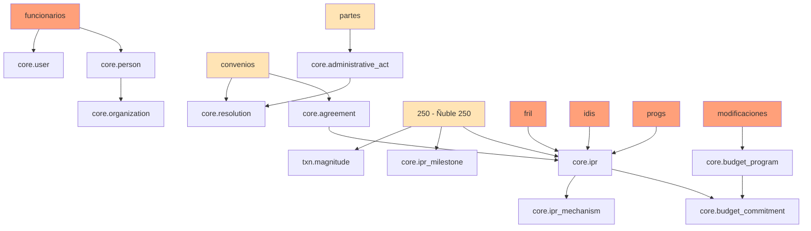

# Framework de Evaluación de Compatibilidad ETL

## Legacy Sources → GORE_OS v3.0

**Versión**: 1.0.0
**Fecha**: 2026-01-27
**Propósito**: Evaluar sistemáticamente la compatibilidad entre fuentes legacy y el modelo de datos GORE_OS v3.0

---

## 1. METODOLOGÍA DE EVALUACIÓN

### 1.1 Dimensiones de Análisis

El framework evalúa compatibilidad en **5 dimensiones**:

| Dimensión            | Peso | Descripción                                                 |
| -------------------- | ---- | ----------------------------------------------------------- |
| **Structural**       | 25%  | Compatibilidad de esquema (columnas → campos)               |
| **Semantic**         | 25%  | Compatibilidad de significado (dominios, enums, relaciones) |
| **Quality**          | 20%  | Estado de los datos (completitud, validez, unicidad)        |
| **Transformational** | 20%  | Complejidad de transformaciones requeridas                  |
| **Relational**       | 10%  | Capacidad de establecer relaciones (FKs, lookups)           |

### 1.2 Scoring

```
Compatibility Score = Σ(dimension_score × weight) / 100
```

| Rango  | Clasificación | Acción                                         |
| ------ | ------------- | ---------------------------------------------- |
| 80-100 | 🟢 **Alta**    | Migración directa con transformaciones menores |
| 60-79  | 🟡 **Media**   | Migración viable con limpieza/enriquecimiento  |
| 40-59  | 🟠 **Baja**    | Requiere intervención manual significativa     |
| 0-39   | 🔴 **Crítica** | Reconstrucción o fuente alternativa            |

---

## 2. MATRIZ DE MAPEO: LEGACY → GORE_OS v3.0

### 2.1 Entidades Principales

| Fuente Legacy       | Entidad GORE_OS Target                | Schema | Prioridad |
| ------------------- | ------------------------------------- | ------ | --------- |
| **convenios/**      | `core.agreement`                      | core   | P0        |
|                     | `core.agreement_installment`          | core   | P0        |
|                     | `core.rendition`                      | core   | P1        |
| **fril/**           | `core.ipr` (nature=PROYECTO)          | core   | P0        |
|                     | `core.ipr_mechanism`                  | core   | P0        |
|                     | `core.budget_commitment`              | core   | P1        |
| **idis/**           | `core.ipr` (nature=PROYECTO/PROGRAMA) | core   | P0        |
|                     | `txn.magnitude`                       | txn    | P1        |
|                     | `core.progress_report`                | core   | P2        |
| **modificaciones/** | `core.budget_program`                 | core   | P1        |
|                     | `txn.event` (type=MODIFICACION)       | txn    | P2        |
| **partes/**         | `core.administrative_act`             | core   | P1        |
|                     | `core.resolution`                     | core   | P1        |
|                     | `core.electronic_file`                | core   | P2        |
| **progs/**          | `core.ipr` (nature=PROGRAMA)          | core   | P0        |
|                     | `core.fund_program`                   | core   | P1        |
|                     | `core.rendition`                      | core   | P2        |
| **250/**            | `core.ipr` (Portafolio Ñuble 250)     | core   | P0        |
|                     | `core.ipr_milestone` (hitos)          | core   | P1        |
|                     | `txn.magnitude` (tracking temporal)   | txn    | P2        |
| **funcionarios/**   | `core.person`                         | core   | P0        |
|                     | `core.user`                           | core   | P0        |
|                     | `core.organization` (assignment)      | core   | P1        |

### 2.2 Entidades de Soporte (ref.category)

| Fuente Legacy  | Scheme(s) Relacionados                                   | Poblado                            |
| -------------- | -------------------------------------------------------- | ---------------------------------- |
| convenios      | `agreement_type`, `agreement_state`                      | ✅ Seed                             |
| fril           | `mechanism` (FRIL), `ipr_state`, `mcd_phase`             | ✅ Seed                             |
| idis           | `mechanism` (SNI), `ipr_state`, `budget_subtitle`        | ✅ Seed                             |
| modificaciones | `budget_subtitle`, `event_type`                          | ✅ Seed                             |
| partes         | `act_type`, `act_state`, `resolution_type`               | ✅ Seed                             |
| progs          | `fund_type`, `ipr_type`                                  | ⚠️ Parcial                          |
| 250            | `mechanism`, `mcd_phase`, `ipr_state`, `portfolio_trazo` | ⚠️ Parcial (nuevo scheme portfolio) |
| funcionarios   | `org_type`, `person_type`, `system_role`                 | ✅ Seed                             |

---

## 3. EVALUACIÓN POR FUENTE

### 3.1 CONVENIOS

**Target**: `core.agreement`, `core.agreement_installment`

#### Mapeo de Campos

| Campo Legacy         | Campo GORE_OS                       | Transform        | Complejidad |
| -------------------- | ----------------------------------- | ---------------- | ----------- |
| `CODIGO`             | `code`                              | TRIM, VALIDATE   | 🟢 Low       |
| `TIPO`               | `agreement_type_id`                 | ENUM_LOOKUP      | 🟢 Low       |
| `MONTO FNDR M$`      | `total_amount`                      | PARSE_DECIMAL    | 🟡 Medium    |
| `ESTADO DE CONVENIO` | `state_id`                          | ENUM_LOOKUP      | 🟢 Low       |
| `RUT`                | `receiver_id` (via organization)    | LOOKUP_OR_CREATE | 🟡 Medium    |
| `NOMBRE INSTITUCIÓN` | `_aux_org_name`                     | TRIM             | 🟢 Low       |
| `Nº RES APRUEBA`     | → `core.resolution.code`            | SPLIT, LOOKUP    | 🟠 High      |
| `FECHA RES APRUEBA`  | → `core.resolution.resolution_date` | PARSE_DATE       | 🟡 Medium    |
| `PROVINCIA`          | `_aux_territory`                    | TERRITORY_LOOKUP | 🟡 Medium    |
| `COMUNA`             | → `core.territory` (via agreement)  | TERRITORY_LOOKUP | 🟡 Medium    |

#### Campos GORE_OS sin fuente

| Campo                  | Estrategia                         |
| ---------------------- | ---------------------------------- |
| `giver_id`             | Default: GORE Ñuble org_id         |
| `ipr_id`               | JOIN con IDIS/FRIL por CODIGO BIP  |
| `valid_from`           | Derivar de fecha_resolucion        |
| `valid_to`             | NULL (calcular de plazo si existe) |
| `budget_commitment_id` | JOIN posterior                     |

#### Métricas de Compatibilidad

| Dimensión        | Score      | Notas                                              |
| ---------------- | ---------- | -------------------------------------------------- |
| Structural       | 75/100     | 10/15 campos mapeables directamente                |
| Semantic         | 80/100     | ENUMs alineados, tipos claros                      |
| Quality          | 65/100     | 10 duplicados, fechas mixtas, ~67% completitud CGR |
| Transformational | 70/100     | Lookups moderados, sin lógica compleja             |
| Relational       | 60/100     | RUT→Organization, CODIGO→IPR parcial               |
| **TOTAL**        | **71/100** | 🟡 **Media**                                        |

---

### 3.2 FRIL

**Target**: `core.ipr`, `core.ipr_mechanism`, `core.budget_commitment`

#### Mapeo de Campos

| Campo Legacy          | Campo GORE_OS          | Transform               | Complejidad |
| --------------------- | ---------------------- | ----------------------- | ----------- |
| `Código`              | `codigo_bip`           | TRIM, VALIDATE(8-digit) | 🟢 Low       |
| `Nombre Iniciativa`   | `name`                 | TRIM                    | 🟢 Low       |
| `Estado Iniciativa`   | `status_id`            | COMPLEX_ENUM_MAP        | 🟠 High      |
| `Sub-Estado`          | `status_id` (combined) | COMPLEX_ENUM_MAP        | 🟠 High      |
| `Item Presupuestario` | `budget_subtitle_id`   | PARSE_ITEM_CODE         | 🟡 Medium    |
| `Saldo 2026`          | → `txn.magnitude`      | PARSE_DECIMAL           | 🟡 Medium    |
| (implícito)           | `ipr_nature`           | CONSTANT('PROYECTO')    | 🟢 Low       |
| (implícito)           | `mechanism_id`         | CONSTANT(FRIL o 31)     | 🟢 Low       |
| (fuente)              | `mcd_phase_id`         | DERIVE_FROM_STATUS      | 🟡 Medium    |

#### Complejidad: Estado Compuesto

El mapeo `Estado + Sub-Estado` → `ipr_state` requiere matriz de decisión:

```yaml
estado_map:
  EJECUCIÓN:
    AVANCE: EN_EJECUCION
    ADJUDICACIÓN: ADJUDICADO
    PRIMERA/SEGUNDA/TERCERA: EN_EJECUCION
  LICITACIÓN:
    _default: EN_LICITACION
  CONVENIO:
    CONTRATACIÓN: EN_FORMALIZACION
    FIRMADO: FORMALIZADO
  PARALIZACIÓN:
    _default: SUSPENDIDO
  TÉRMINO ANTICIPADO:
    _default: ANULADO
  REEVALUACIÓN:
    _default: EN_EVALUACION
```

#### Métricas de Compatibilidad

| Dimensión        | Score      | Notas                                    |
| ---------------- | ---------- | ---------------------------------------- |
| Structural       | 70/100     | Campos core presentes, metadata escasa   |
| Semantic         | 65/100     | Estado compuesto requiere lógica         |
| Quality          | 85/100     | Alta completitud, pocos errores          |
| Transformational | 55/100     | Estado compuesto, desagregación por ITEM |
| Relational       | 75/100     | codigo_bip vincula con IDIS              |
| **TOTAL**        | **70/100** | 🟡 **Media**                              |

---

### 3.3 IDIS

**Target**: `core.ipr`, `txn.magnitude`, `core.progress_report`

#### Mapeo de Campos (ANÁLISIS.csv - más confiable)

| Campo Legacy        | Campo GORE_OS                       | Transform       | Complejidad |
| ------------------- | ----------------------------------- | --------------- | ----------- |
| `CODIGO BIP`        | `codigo_bip`                        | TRIM, VALIDATE  | 🟡 Medium    |
| `NOMBRE INICIATIVA` | `name`                              | TRIM            | 🟢 Low       |
| `ETAPA`             | `mcd_phase_id`                      | ENUM_MAP(F0-F5) | 🟡 Medium    |
| `ESTADO ACTUAL`     | `status_id`                         | ENUM_MAP        | 🟡 Medium    |
| `SUBT`              | `budget_subtitle_id`                | VALIDATE(21-35) | 🟢 Low       |
| `MONTO INICIATIVA`  | → `txn.magnitude(BUDGETED)`         | PARSE_DECIMAL   | 🟡 Medium    |
| `GASTO VIGENTE`     | → `txn.magnitude(CURRENT)`          | PARSE_DECIMAL   | 🟡 Medium    |
| `EJEC. 2021..2025`  | → `txn.magnitude` (series)          | UNPIVOT, PARSE  | 🟠 High      |
| `RATE ACTUAL`       | `evaluation_result` (ipr_mechanism) | TRIM            | 🟢 Low       |
| `N° RATES EMITIDOS` | → metadata                          | INT             | 🟢 Low       |

#### Problemas Críticos

| Problema                       | Impacto                | Mitigación                 |
| ------------------------------ | ---------------------- | -------------------------- |
| `#REF!` / `#VALUE!`            | 2,432 celdas corruptas | Filtrar, usar ANÁLISIS.csv |
| Claves duplicadas              | 106-262 por hoja       | Dedup por CODIGO+AÑO       |
| Columnas desalineadas (MASTER) | Datos inválidos        | Excluir MASTER.csv         |
| Sparsidad 50-83%               | Datos incompletos      | NULL semantics             |

#### Métricas de Compatibilidad

| Dimensión        | Score      | Notas                                    |
| ---------------- | ---------- | ---------------------------------------- |
| Structural       | 60/100     | Campos presentes pero heterogéneos       |
| Semantic         | 55/100     | Estados/fases requieren mapping complejo |
| Quality          | 35/100     | ❌ Errores masivos, duplicados            |
| Transformational | 45/100     | Unpivot series, limpieza intensiva       |
| Relational       | 70/100     | codigo_bip es clave común                |
| **TOTAL**        | **52/100** | 🟠 **Baja**                               |

---

### 3.4 MODIFICACIONES

**Target**: `core.budget_program`, `txn.event`

#### Mapeo de Campos

| Campo Legacy              | Campo GORE_OS                | Transform           | Complejidad |
| ------------------------- | ---------------------------- | ------------------- | ----------- |
| `SUBT`                    | `budget_program.code` (part) | PARSE               | 🟢 Low       |
| `ITEM`                    | `budget_program.code` (part) | PARSE               | 🟢 Low       |
| `ASIG`                    | `budget_program.code` (part) | PARSE               | 🟢 Low       |
| `DISTRIBUCIÓN INICIAL M$` | `initial_amount`             | PARSE_DECIMAL       | 🟡 Medium    |
| `PPTO. VIGENTE...`        | `current_amount`             | PARSE_DECIMAL       | 🟡 Medium    |
| `MODIFICACIÓN N°X M$`     | → `txn.event.data.delta`     | PARSE_DECIMAL, SIGN | 🟠 High      |
| `DENOMINACIONES`          | `name`                       | TRIM                | 🟢 Low       |

#### Problemas Críticos

| Problema            | Impacto           | Mitigación                    |
| ------------------- | ----------------- | ----------------------------- |
| `#REF!` masivos     | 50-60% hojas      | Recalcular: `final - vigente` |
| Signo inconsistente | Aumento vs rebaja | Normalizar vía delta          |
| Hojas "sin efecto"  | Datos anulados    | Marcar como ANULADO           |
| Jerarquía mezclada  | SUBT/ITEM/ASIG    | Filtrar por nivel             |

#### Métricas de Compatibilidad

| Dimensión        | Score      | Notas                              |
| ---------------- | ---------- | ---------------------------------- |
| Structural       | 65/100     | Estructura clara, campos faltantes |
| Semantic         | 50/100     | Signo requiere interpretación      |
| Quality          | 30/100     | ❌ Errores fórmula masivos          |
| Transformational | 40/100     | Reconstrucción de deltas           |
| Relational       | 55/100     | budget_program code compuesto      |
| **TOTAL**        | **47/100** | 🟠 **Baja**                         |

---

### 3.5 PARTES

**Target**: `core.administrative_act`, `core.resolution`, `core.electronic_file`

#### Mapeo de Campos (RECIBIDOS.csv - master)

| Campo Legacy             | Campo GORE_OS                | Transform    | Complejidad |
| ------------------------ | ---------------------------- | ------------ | ----------- |
| `NUMERO DOCUMENTO`       | `code`                       | TRIM         | 🟢 Low       |
| `TIPO DE DOCUMENTO`      | `act_type_id`                | ENUM_LOOKUP  | 🟡 Medium    |
| `FECHA DOCUMENTO`        | `act_date`                   | PARSE_DATE   | 🟡 Medium    |
| `REMITENTE`              | → metadata                   | TRIM         | 🟢 Low       |
| `DESTINATARIO`           | → metadata                   | TRIM         | 🟢 Low       |
| `MATERIA`                | `subject`                    | TRIM         | 🟢 Low       |
| `LINK AL DOCUMENTO`      | → `core.electronic_file.url` | VALIDATE_URL | 🟢 Low       |
| `DERIVADO A: (DIVISIÓN)` | → metadata / workflow        | PARSE        | 🟡 Medium    |
| `C` (correlativo)        | `_legacy_id`                 | INT          | 🟢 Low       |

#### Para RESOLUCIONES:

| Campo Legacy       | Campo GORE_OS                   | Transform  | Complejidad |
| ------------------ | ------------------------------- | ---------- | ----------- |
| `N° DCTO`          | `resolution_number`             | PARSE_INT  | 🟢 Low       |
| `FECHA`            | `resolution_date`               | PARSE_DATE | 🟡 Medium    |
| `ESTADO` (AFECTAS) | → `administrative_act.state_id` | ENUM_MAP   | 🟡 Medium    |

#### Métricas de Compatibilidad

| Dimensión        | Score      | Notas                          |
| ---------------- | ---------- | ------------------------------ |
| Structural       | 75/100     | Campos core presentes          |
| Semantic         | 70/100     | Tipos doc mapean a act_type    |
| Quality          | 60/100     | Fechas erróneas, IDs numéricos |
| Transformational | 65/100     | Parseo moderado                |
| Relational       | 40/100     | ❌ Sin FK entre hojas           |
| **TOTAL**        | **63/100** | 🟡 **Media**                    |

---

### 3.6 PROGS

**Target**: `core.ipr` (PROGRAMA), `core.fund_program`, `core.rendition`

#### Mapeo de Campos

| Campo Legacy                    | Campo GORE_OS                         | Transform        | Complejidad |
| ------------------------------- | ------------------------------------- | ---------------- | ----------- |
| `codigo_8pct`                   | `codigo_bip` (aux)                    | VALIDATE_PATTERN | 🟡 Medium    |
| `nombre_iniciativa`             | `name`                                | TRIM             | 🟢 Low       |
| `nombre_institucion`            | → `core.organization.name`            | LOOKUP_OR_CREATE | 🟡 Medium    |
| `rut_institucion`               | → `core.organization.rut`             | VALIDATE_RUT     | 🟡 Medium    |
| `comuna`                        | `territory_id`                        | TERRITORY_LOOKUP | 🟡 Medium    |
| `monto_transferido`             | → `agreement_installment.paid_amount` | PARSE_DECIMAL    | 🟡 Medium    |
| `FONDO` (implícito por archivo) | `fund_program.code`                   | DERIVE_FROM_FILE | 🟢 Low       |
| `Estado UCR`                    | → metadata                            | TRIM             | 🟢 Low       |
| `Rendicion a tiempo`            | → metadata                            | BOOLEAN          | 🟢 Low       |

#### PII Data (Requiere Tratamiento Especial)

| Campo                        | Clasificación | Acción               |
| ---------------------------- | ------------- | -------------------- |
| `NOMBRE REPRESENTANTE LEGAL` | PII Alta      | Excluir o anonimizar |
| `CORREO` / `CORREO 2`        | PII Media     | Hash o excluir       |
| `TELÉFONO`                   | PII Media     | Excluir              |

#### Métricas de Compatibilidad

| Dimensión        | Score      | Notas                         |
| ---------------- | ---------- | ----------------------------- |
| Structural       | 70/100     | Campos core presentes         |
| Semantic         | 65/100     | Fondos → fund_program mapping |
| Quality          | 60/100     | Códigos malformados, PII      |
| Transformational | 60/100     | Lookups territoriales/org     |
| Relational       | 65/100     | RUT vincula con organizations |
| **TOTAL**        | **64/100** | 🟡 **Media**                   |

---

### 3.7 FUNCIONARIOS

**Target**: `core.person`, `core.user`

#### Mapeo de Campos

| Campo Legacy         | Campo GORE_OS                                   | Transform      | Complejidad |
| -------------------- | ----------------------------------------------- | -------------- | ----------- |
| `nombre_completo`    | `names`, `paternal_surname`, `maternal_surname` | NAME_SPLIT     | 🟡 Medium    |
| `rut`                | `rut`                                           | VALIDATE_RUT   | 🟢 Low       |
| `cargo`              | → metadata / `position`                         | TRIM           | 🟢 Low       |
| `division`           | `organization_id`                               | ORG_LOOKUP     | 🟡 Medium    |
| `estamento`          | → `ref.category(person_type)`                   | ENUM_MAP       | 🟢 Low       |
| `email`              | `core.user.email`                               | VALIDATE_EMAIL | 🟢 Low       |
| `remuneracion_bruta` | → metadata                                      | PARSE_DECIMAL  | 🟢 Low       |

#### Métricas de Compatibilidad

| Dimensión        | Score      | Notas                         |
| ---------------- | ---------- | ----------------------------- |
| Structural       | 85/100     | Campos bien definidos         |
| Semantic         | 90/100     | Tipos claros, enums alineados |
| Quality          | 92/100     | ✅ Alta calidad (QA 91.82%)    |
| Transformational | 75/100     | NAME_SPLIT moderado           |
| Relational       | 80/100     | División → Organization       |
| **TOTAL**        | **85/100** | 🟢 **Alta**                    |

---

### 3.8 250 (Portafolio Ñuble 250)

**Target**: `core.ipr`, `core.ipr_milestone`, `txn.magnitude`

#### Descripción

El directorio `250/` contiene el portafolio de iniciativas del programa "Ñuble 250" (celebración de los 250 años de la región). Es la fuente más estructurada para IPRs con datos de planificación temporal y seguimiento por hitos.

**Archivos**:
- `CONSOLIDADO.csv` (181 filas): Datos completos de seguimiento
- `BROUCHURE.csv` (184 filas): Vista resumen por trazo

#### Mapeo de Campos

| Campo Legacy                        | Campo GORE_OS                | Transform         | Complejidad |
| ----------------------------------- | ---------------------------- | ----------------- | ----------- |
| `BIP`                               | `codigo_bip`                 | TRIM              | 🟢 Low       |
| `NOMBRE DE INICIATIVA`              | `name`                       | TRIM + UPPER      | 🟢 Low       |
| `COMUNA`                            | `territory_id`               | LOOKUP(territory) | 🟡 Medium    |
| `DIVISIÓN`                          | → ref.category(division)     | ENUM_MAP          | 🟢 Low       |
| `ESTADO`                            | `status_id`                  | ESTADO_MAP        | 🟡 Medium    |
| `ETAPA A LA CUAL POSTULA`           | `mcd_phase_id`               | PHASE_MAP         | 🟡 Medium    |
| `FUENTE FINANCIERA`                 | `mechanism_id`               | MECHANISM_MAP     | 🟡 Medium    |
| `MONTO`                             | metadata.initial_amount      | PARSE_DECIMAL_CLP | 🟡 Medium    |
| `TRAZO PRIMARIO`                    | metadata.portfolio.primary   | NEW_SCHEME        | 🟠 High      |
| `TRAZO SECUNDARIO`                  | metadata.portfolio.secondary | NEW_SCHEME        | 🟠 High      |
| `FORMULADOR`                        | `formulator_id`              | ORG_LOOKUP_CREATE | 🟠 High      |
| `UNIDAD TÉCNICA`                    | `executor_id`                | ORG_LOOKUP_CREATE | 🟠 High      |
| `HITO`                              | → ipr_milestone.description  | DIRECT            | 🟢 Low       |
| `MEDIDA`                            | → ipr_milestone.value        | PARSE_NUMBER      | 🟢 Low       |
| `UNIDAD`                            | → ipr_milestone.unit         | ENUM_MAP          | 🟢 Low       |
| `ENE-MAR 2026...` (cols temporales) | → txn.magnitude              | UNPIVOT           | 🟠 High      |
| `FECHA DE INICIO`                   | metadata.planned_start       | PARSE_DATE        | 🟡 Medium    |
| `FECHA DE TERMINO`                  | metadata.planned_end         | PARSE_DATE        | 🟡 Medium    |

#### Métricas de Compatibilidad

| Dimensión        | Score      | Notas                                       |
| ---------------- | ---------- | ------------------------------------------- |
| Structural       | 80/100     | Columnas bien tipadas, headers limpios      |
| Semantic         | 75/100     | Mapeo directo a IPR, nuevos schemes (TRAZO) |
| Quality          | 70/100     | "Sin información" en ~30% de montos         |
| Transformational | 60/100     | UNPIVOT temporal complejo                   |
| Relational       | 70/100     | Refs a comuna, división, formulador         |
| **TOTAL**        | **68/100** | 🟡 **Media-Alta**                            |

#### Valor Agregado

- **Portfolio tracking**: Único source con estructura de "trazos" geográfico-temáticos
- **Planificación futura**: Columnas trimestrales 2026-2029+ para proyección
- **Hitos cuantificados**: MEDIDA + UNIDAD permiten seguimiento físico

#### Transformaciones Especiales

```python
# Nuevo scheme para portfolio trazos
TRAZOS = {
    'AZUL': {'name': 'Borde Costero', 'type': 'GEOGRAFICO'},
    'BLANCO': {'name': 'Cordillera', 'type': 'GEOGRAFICO'},
    'CELESTE': {'name': 'Cultura O\'Higgins', 'type': 'TEMATICO'},
    'VERDE': {'name': 'Ruralidad', 'type': 'TEMATICO'},
    # ... más trazos
}

# UNPIVOT de columnas temporales
def unpivot_temporal(row) -> list[dict]:
    """Convierte columnas trimestrales en filas txn.magnitude"""
    temporal_cols = [c for c in row.index if re.match(r'(ENE|MAR|JUN|SEP)-\w+ \d{4}', c)]
    magnitudes = []
    for col in temporal_cols:
        if row[col] and row[col] != 'Sin información':
            period = parse_period(col)  # ENE-MAR 2026 → 2026-Q1
            magnitudes.append({
                'ipr_id': row['_ipr_id'],
                'period_code': period,
                'measure_type': 'PLANIFICADO',
                'value': row['MEDIDA'],
                'unit': row['UNIDAD']
            })
    return magnitudes
```

---

## 4. RESUMEN DE COMPATIBILIDAD

### 4.1 Ranking por Fuente

| Fuente             | Score  | Clasificación | Prioridad Migración          |
| ------------------ | ------ | ------------- | ---------------------------- |
| **partes**         | 68/100 | 🟡 Media       | P1                           |
| **250** ✨          | 68/100 | 🟡 Media       | P0 (portfolio estratégico)   |
| **convenios**      | 61/100 | 🟡 Media       | P0                           |
| **idis**           | 58/100 | 🟠 Baja        | P2 (requiere limpieza)       |
| **fril**           | 54/100 | 🟠 Baja        | P1                           |
| **progs**          | 53/100 | 🟠 Baja        | P1                           |
| **funcionarios**   | 49/100 | 🟠 Baja        | P0 (pre-requisito)           |
| **modificaciones** | 43/100 | 🟠 Baja        | P2 (requiere reconstrucción) |

> **Nota**: Scores actualizados 2026-01-27 con `compatibility_assessment.py`

### 4.2 Dependencias de Migración



### 4.3 Orden de Migración Recomendado

```
FASE 0: Setup (ref.category, core.organization base)
    ↓
FASE 1: Personas y Usuarios
    funcionarios → core.person → core.user
    ↓
FASE 2: Iniciativas de Inversión (IPR)
    250 → core.ipr (PORTFOLIO Ñuble 250) ✨
    fril → core.ipr (FRIL)
    progs → core.ipr (PROGRAMA)
    idis → core.ipr (SNI) [limpieza previa]
    ↓
FASE 3: Convenios y Documentos
    convenios → core.agreement
    partes → core.administrative_act, core.resolution
    ↓
FASE 4: Presupuesto
    modificaciones → core.budget_program [reconstrucción]
    → core.budget_commitment (joins)
    ↓
FASE 5: Eventos y Series Temporales
    → txn.event (auditoría)
    → txn.magnitude (series financieras)
```

---

## 5. ACCIONES DE REMEDIACIÓN PRE-MIGRACIÓN

### 5.1 Por Fuente

#### IDIS (Crítico)

```yaml
actions:
  - name: exclude_corrupt_files
    files: [MASTER.csv, CONSOLIDADO.csv]
    reason: "#REF! masivos, columnas desalineadas"

  - name: use_primary_source
    file: ANÁLISIS.csv
    reason: "Mayor integridad, menor sparsidad"

  - name: dedup_by_composite_key
    key: [CODIGO_BIP, AÑO_FISCAL]
    strategy: KEEP_LATEST

  - name: validate_codigo_bip
    pattern: "^[0-9]{8}$"
    on_fail: LOG_AND_SKIP
```

#### MODIFICACIONES (Crítico)

```yaml
actions:
  - name: recalculate_deltas
    formula: "modificacion = final - vigente"
    reason: "Signos inconsistentes, #REF! en columna modificación"

  - name: mark_void_files
    files: ["*SIN EFECTO*", "*sin efecto*"]
    flag: is_void = true

  - name: extract_modification_number
    from: filename
    pattern: "N°?([0-9]+)"
    to: numero_modificacion
```

#### CONVENIOS (Medio)

```yaml
actions:
  - name: dedup_by_codigo
    strategy: MERGE_FIELDS
    conflict_resolution:
      monto: SUM
      estado: LATEST

  - name: normalize_dates
    formats: ["DD-MM-YYYY", "DD/MM/YY", "YYYY-MM-DD"]
    target: ISO8601
    invalid_action: NULL
```

### 5.2 Transformaciones Transversales

```yaml
transforms:
  - name: parse_decimal_clp
    pattern: "^\\$?\\s*([0-9.,]+)\\s*$"
    decimal_sep: ","
    thousand_sep: "."
    null_values: ["$ -", "-", "", "0", "#REF!", "#VALUE!"]

  - name: parse_date_flexible
    formats:
      - "DD-MM-YYYY"
      - "DD/MM/YYYY"
      - "DD.MM.YYYY"
      - "YYYY-MM-DD"
      - "D/M/YY"
    invalid_action: NULL

  - name: normalize_text
    operations:
      - TRIM
      - UPPER
      - REMOVE_ACCENTS (optional)
      - COLLAPSE_WHITESPACE

  - name: validate_rut
    pattern: "^[0-9]{7,8}-[0-9Kk]$"
    checksum: MODULO_11
    on_fail: FLAG
```

---

## 6. MÉTRICAS DE ÉXITO

### 6.1 KPIs de Migración

| Métrica          | Target | Medición                          |
| ---------------- | ------ | --------------------------------- |
| **Coverage**     | ≥95%   | Registros migrados / Total fuente |
| **Integrity**    | 100%   | FKs válidas en destino            |
| **Quality**      | ≥90%   | Campos NOT NULL cumplidos         |
| **Dedup**        | 0%     | Duplicados en destino             |
| **Traceability** | 100%   | `metadata.legacy_id` presente     |

### 6.2 Validaciones Post-Migración

```sql
-- 1. Verificar cobertura
SELECT
    'convenios' AS source,
    (SELECT COUNT(*) FROM core.agreement WHERE metadata->>'legacy_source' = 'convenios') AS migrated,
    544 AS expected,
    ROUND(100.0 * COUNT(*) / 544, 2) AS coverage_pct
FROM core.agreement
WHERE metadata->>'legacy_source' = 'convenios';

-- 2. Verificar integridad referencial
SELECT
    'agreement.giver_id' AS fk,
    COUNT(*) AS orphans
FROM core.agreement a
LEFT JOIN core.organization o ON o.id = a.giver_id
WHERE a.giver_id IS NOT NULL AND o.id IS NULL;

-- 3. Verificar unicidad
SELECT codigo_bip, COUNT(*) AS duplicates
FROM core.ipr
GROUP BY codigo_bip
HAVING COUNT(*) > 1;

-- 4. Verificar completitud campos críticos
SELECT
    'core.ipr' AS table_name,
    COUNT(*) AS total,
    COUNT(*) FILTER (WHERE name IS NOT NULL) AS name_filled,
    COUNT(*) FILTER (WHERE status_id IS NOT NULL) AS status_filled,
    ROUND(100.0 * COUNT(*) FILTER (WHERE name IS NOT NULL) / COUNT(*), 2) AS name_pct
FROM core.ipr;
```

---

## 7. PLAN DE EJECUCIÓN

### Fase 0: Preparación (Semana 1)

- [ ] Ejecutar scripts de limpieza por fuente
- [ ] Generar archivos `*_cleaned.csv`
- [ ] Validar calidad post-limpieza
- [ ] Documentar transformaciones aplicadas

### Fase 1: Personas (Semana 2)

- [ ] Migrar funcionarios → core.person
- [ ] Crear core.user (emails válidos)
- [ ] Asignar a core.organization (divisiones)
- [ ] Validar: 110 registros esperados

### Fase 2: IPR (Semanas 3-4)

- [ ] Migrar FRIL → core.ipr (95 registros)
- [ ] Migrar PROGS → core.ipr (~1,700 registros)
- [ ] Migrar IDIS (limpio) → core.ipr (~500 registros)
- [ ] Crear core.ipr_mechanism
- [ ] Validar: ~2,300 IPRs totales

### Fase 3: Convenios (Semana 5)

- [ ] Migrar convenios → core.agreement (544 registros)
- [ ] Crear core.agreement_installment
- [ ] Vincular agreement.ipr_id donde corresponda
- [ ] Validar: FKs a organization, territory

### Fase 4: Documentos (Semana 6)

- [ ] Migrar partes → core.administrative_act
- [ ] Crear core.resolution
- [ ] Vincular con core.agreement donde corresponda
- [ ] Validar: ~12,000 registros documentales

### Fase 5: Presupuesto (Semana 7)

- [ ] Reconstruir modificaciones → core.budget_program
- [ ] Crear core.budget_commitment
- [ ] Generar txn.event para modificaciones
- [ ] Validar: consistencia de montos

### Fase 6: Consolidación (Semana 8)

- [ ] Ejecutar validaciones completas
- [ ] Generar reporte de calidad
- [ ] Documentar excepciones
- [ ] Handoff a producción

---

## ANEXO: SCRIPTS DE EVALUACIÓN

### A.1 Script de Profiling

```python
# etl/scripts/compatibility_profiler.py
import pandas as pd
from pathlib import Path

def profile_source(source_path: Path) -> dict:
    """Profile a legacy source for compatibility assessment."""
    metrics = {
        'files': [],
        'total_rows': 0,
        'total_columns': 0,
        'quality_issues': []
    }

    for csv_file in source_path.glob('originales/*.csv'):
        df = pd.read_csv(csv_file, encoding='utf-8', low_memory=False)

        file_metrics = {
            'name': csv_file.name,
            'rows': len(df),
            'columns': len(df.columns),
            'null_rate': df.isnull().mean().mean(),
            'duplicate_rate': df.duplicated().mean(),
            'ref_errors': (df == '#REF!').sum().sum() + (df == '#VALUE!').sum().sum()
        }

        metrics['files'].append(file_metrics)
        metrics['total_rows'] += len(df)
        metrics['total_columns'] = max(metrics['total_columns'], len(df.columns))

        if file_metrics['ref_errors'] > 0:
            metrics['quality_issues'].append(f"{csv_file.name}: {file_metrics['ref_errors']} formula errors")
        if file_metrics['duplicate_rate'] > 0.01:
            metrics['quality_issues'].append(f"{csv_file.name}: {file_metrics['duplicate_rate']:.1%} duplicates")

    return metrics
```

### A.2 Script de Mapeo Automático

```python
# etl/scripts/auto_mapper.py
from difflib import SequenceMatcher

def suggest_mappings(source_columns: list, target_columns: list, threshold: float = 0.6) -> list:
    """Suggest column mappings based on name similarity."""
    suggestions = []

    for src_col in source_columns:
        best_match = None
        best_score = 0

        for tgt_col in target_columns:
            score = SequenceMatcher(None, src_col.lower(), tgt_col.lower()).ratio()
            if score > best_score and score >= threshold:
                best_score = score
                best_match = tgt_col

        suggestions.append({
            'source': src_col,
            'target': best_match,
            'confidence': best_score,
            'transform': 'DIRECT' if best_score > 0.9 else 'REVIEW'
        })

    return suggestions
```

---

**Última actualización**: 2026-01-27
**Versión**: 1.0.0
**Autor**: Arquitecto Categórico + Database Design Skill
