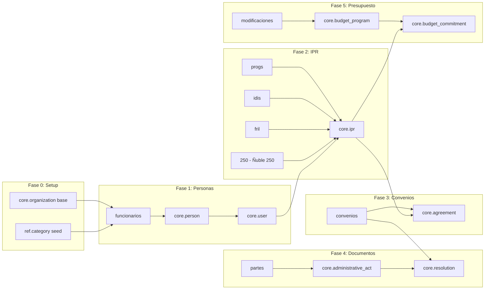

# Matriz de Migración Legacy → GORE_OS v3.0

## Vista Rápida de Compatibilidad

```text
┌─────────────────────────────────────────────────────────────────────────────┐
│                    FUENTES LEGACY → GORE_OS v3.0                           │
├─────────────────────────────────────────────────────────────────────────────┤
│                                                                             │
│  🟢 ALTA (≥80)    │  🟡 MEDIA (60-79)   │  🟠 BAJA (40-59)   │  🔴 CRÍTICA │
│                   │                     │                    │              │
│                   │  partes: 68         │  idis: 58          │              │
│                   │  250: 68 ✨         │  fril: 54          │              │
│                   │  convenios: 61      │  progs: 53         │              │
│                   │                     │  funcionarios: 49  │              │
│                   │                     │  modificaciones:43 │              │
│                                                                             │
└─────────────────────────────────────────────────────────────────────────────┘
```

> **Nota**: Puntajes actualizados 2026-01-27 con assessment automatizado.

## Mapeo Visual: Source → Target

```
┌──────────────────────────────────────────────────────────────────────────────┐
│                           GORE_OS v3.0 SCHEMA                                │
│                                                                              │
│   ┌─────────────┐    ┌─────────────┐    ┌─────────────┐    ┌─────────────┐  │
│   │   meta.*    │    │    ref.*    │    │   core.*    │    │    txn.*    │  │
│   │  (5 tablas) │    │  (3 tablas) │    │ (40 tablas) │    │  (2 tablas) │  │
│   └─────────────┘    └─────────────┘    └──────┬──────┘    └──────┬──────┘  │
│                                                │                   │         │
└────────────────────────────────────────────────┼───────────────────┼─────────┘
                                                 │                   │
        ┌────────────────────────────────────────┴───────────────────┴────┐
        │                                                                  │
        │    ┌─────────────────────────────────────────────────────────┐   │
        │    │                     core.person                          │   │
        │    │    ← funcionarios (85) ✅                                │   │
        │    └─────────────────────────────────────────────────────────┘   │
        │                              │                                   │
        │                              ▼                                   │
        │    ┌─────────────────────────────────────────────────────────┐   │
        │    │                      core.user                           │   │
        │    │    ← funcionarios (email, rol)                          │   │
        │    └─────────────────────────────────────────────────────────┘   │
        │                              │                                   │
        │                              ▼                                   │
        │    ┌─────────────────────────────────────────────────────────┐   │
        │    │                       core.ipr                           │   │
        │    │    ← 250 (68) 🟡 [PORTFOLIO Ñuble 250] ✨               │   │
        │    │    ← fril (54) 🟠 [PROYECTO/FRIL]                       │   │
        │    │    ← idis (58) 🟠 [PROYECTO/PROGRAMA/SNI]               │   │
        │    │    ← progs (53) 🟠 [PROGRAMA/8%]                        │   │
        │    └─────────────────────────────────────────────────────────┘   │
        │                              │                                   │
        │          ┌───────────────────┼───────────────────┐               │
        │          ▼                   ▼                   ▼               │
        │    ┌───────────┐    ┌──────────────┐    ┌──────────────┐        │
        │    │core.agree │    │core.ipr_mech │    │core.budget_  │        │
        │    │    ment   │    │    anism     │    │  commitment  │        │
        │    │← convenios│    │← fril/idis   │    │← fril/modif. │        │
        │    │   (71) 🟡 │    │              │    │              │        │
        │    └───────────┘    └──────────────┘    └──────────────┘        │
        │          │                                      │                │
        │          ▼                                      ▼                │
        │    ┌───────────┐                    ┌──────────────────┐        │
        │    │core.agree │                    │core.budget_      │        │
        │    │_installmnt│                    │    program       │        │
        │    │← convenios│                    │← modificaciones  │        │
        │    │           │                    │   (47) 🟠        │        │
        │    └───────────┘                    └──────────────────┘        │
        │                                                                  │
        │    ┌─────────────────────────────────────────────────────────┐   │
        │    │              core.administrative_act                     │   │
        │    │    ← partes (63) 🟡 [RECIBIDOS, OFICIOS, MEMOS]         │   │
        │    └─────────────────────────────────────────────────────────┘   │
        │                              │                                   │
        │                              ▼                                   │
        │    ┌─────────────────────────────────────────────────────────┐   │
        │    │                   core.resolution                        │   │
        │    │    ← partes [RESOLUCIONES EXENTAS/AFECTAS]              │   │
        │    │    ← convenios (Nº RES APRUEBA)                         │   │
        │    └─────────────────────────────────────────────────────────┘   │
        │                                                                  │
        └──────────────────────────────────────────────────────────────────┘
```

## Matriz Detallada de Campos

### core.ipr (Iniciativa de Inversión)

| Campo Target | 250 ✨ | fril | idis | progs |
|--------------|--------|------|------|-------|
| `codigo_bip` | BIP | Código | CODIGO BIP | codigo_8pct |
| `name` | NOMBRE DE INICIATIVA | Nombre Iniciativa | NOMBRE INICIATIVA | nombre_iniciativa |
| `ipr_nature` | DERIVE(FUENTE) | CONSTANT(PROYECTO) | DERIVE(SUBT) | CONSTANT(PROGRAMA) |
| `mcd_phase_id` | ETAPA A LA CUAL POSTULA | DERIVE(Estado) | ETAPA | CONSTANT(F4) |
| `status_id` | ESTADO | Estado+SubEstado | ESTADO ACTUAL | Estado UCR |
| `mechanism_id` | FUENTE FINANCIERA | CONSTANT(FRIL/31) | DERIVE(SUBT) | CONSTANT(SUBV8) |
| `budget_subtitle_id` | N/A | Item Presupuestario | SUBT | N/A |
| `territory_id` | COMUNA | N/A | N/A | comuna |
| `formulator_id` | FORMULADOR | N/A | N/A | rut_institucion |
| `executor_id` | UNIDAD TÉCNICA | N/A | N/A | N/A |
| `_portfolio` | TRAZO PRIMARIO/SEC. | N/A | N/A | N/A |

**Leyenda**:
- ✅ Mapeo directo
- DERIVE() = Requiere transformación
- CONSTANT() = Valor fijo
- N/A = No disponible en fuente

### core.agreement (Convenio)

| Campo Target | convenios |
|--------------|-----------|
| `code` | CODIGO |
| `agreement_type_id` | TIPO → ENUM_MAP |
| `total_amount` | MONTO FNDR M$ → PARSE_DECIMAL |
| `state_id` | ESTADO DE CONVENIO → ENUM_MAP |
| `giver_id` | CONSTANT(GORE Ñuble) |
| `receiver_id` | RUT → LOOKUP(organization) |
| `ipr_id` | JOIN(codigo_bip) |
| `valid_from` | FECHA RES APRUEBA |
| `resolution_id` | Nº RES APRUEBA → LOOKUP |

### core.person (Funcionario)

| Campo Target | funcionarios |
|--------------|--------------|
| `rut` | rut |
| `names` | nombre_completo → SPLIT[0] |
| `paternal_surname` | nombre_completo → SPLIT[1] |
| `maternal_surname` | nombre_completo → SPLIT[2] |
| `organization_id` | division → LOOKUP |

### core.budget_program (Programa Presupuestario)

| Campo Target | modificaciones |
|--------------|----------------|
| `code` | CONCAT(SUBT, ITEM, ASIG) |
| `name` | DENOMINACIONES |
| `fiscal_year` | DERIVE(filename) |
| `initial_amount` | DISTRIBUCIÓN INICIAL M$ |
| `current_amount` | PPTO. VIGENTE... |

### core.administrative_act (Acto Administrativo)

| Campo Target | partes |
|--------------|--------|
| `code` | NUMERO DOCUMENTO |
| `act_type_id` | TIPO DE DOCUMENTO → ENUM_MAP |
| `act_date` | FECHA DOCUMENTO → PARSE_DATE |
| `subject` | MATERIA |
| `state_id` | ESTADO (solo AFECTAS) |

## Transformaciones Requeridas

### Por Complejidad

```
🟢 LOW (Directas)
├── TRIM
├── UPPER/LOWER
├── VALIDATE_PATTERN
└── CONSTANT

🟡 MEDIUM (Parseo)
├── PARSE_DECIMAL_CLP ($1.234.567 → 1234567.00)
├── PARSE_DATE (DD-MM-YYYY, DD/MM/YY, etc.)
├── NAME_SPLIT (Juan Pérez García → [Juan, Pérez, García])
├── ENUM_MAP (VIGENTE → agreement_state.VIGENTE)
└── LOOKUP (RUT → organization_id)

🟠 HIGH (Lógica)
├── COMPOSITE_STATUS (Estado + SubEstado → ipr_state)
├── DERIVE_PHASE (Estado → mcd_phase)
├── UNPIVOT (EJEC.2021..2025 → txn.magnitude rows)
├── RECALCULATE (final - vigente = delta)
└── LOOKUP_OR_CREATE (Si org no existe, crearla)
```

### Funciones de Transformación

```python
# Ejemplo de transformaciones principales

def parse_decimal_clp(value: str) -> Decimal:
    """$ 1.234.567,89 → 1234567.89"""
    if not value or value in ['$ -', '-', '#REF!']:
        return None
    clean = re.sub(r'[$ \xa0]', '', value)
    clean = clean.replace('.', '').replace(',', '.')
    return Decimal(clean)

def parse_date_flexible(value: str) -> date:
    """Múltiples formatos → ISO date"""
    formats = ['%d-%m-%Y', '%d/%m/%Y', '%d.%m.%Y', '%Y-%m-%d', '%d/%m/%y']
    for fmt in formats:
        try:
            return datetime.strptime(value.strip(), fmt).date()
        except ValueError:
            continue
    return None

def map_estado_compuesto(estado: str, subestado: str) -> str:
    """Estado + SubEstado → ipr_state code"""
    mapping = {
        ('EJECUCIÓN', 'AVANCE'): 'EN_EJECUCION',
        ('EJECUCIÓN', 'ADJUDICACIÓN'): 'ADJUDICADO',
        ('LICITACIÓN', None): 'EN_LICITACION',
        ('CONVENIO', 'FIRMADO'): 'FORMALIZADO',
        ('PARALIZACIÓN', None): 'SUSPENDIDO',
    }
    return mapping.get((estado, subestado), 'INGRESADO')

def lookup_or_create_organization(rut: str, name: str) -> UUID:
    """Busca org por RUT, crea si no existe"""
    org = Organization.query.filter_by(rut=rut).first()
    if not org:
        org = Organization(
            rut=rut,
            name=name,
            org_type_id=get_category_id('org_type', 'EMPRESA')
        )
        db.session.add(org)
        db.session.flush()
    return org.id
```

## Dependencias de Migración



## Comandos de Ejecución

```bash
# 1. Ejecutar evaluación de compatibilidad
cd /Users/felixsanhueza/Developer/goreos/etl/scripts
python compatibility_assessment.py --output ../docs/compatibility_report.json

# 2. Ver reporte generado
cat ../docs/compatibility_report.json | jq '.assessments[] | {name, overall_score, classification}'

# 3. Ejecutar limpieza por fuente (cuando existan scripts)
python clean_convenios.py
python clean_fril.py
python clean_idis.py  # Requiere intervención manual previa

# 4. Ejecutar migración por fase
python migrate_phase1_personas.py
python migrate_phase2_ipr.py
python migrate_phase3_convenios.py
python migrate_phase4_documentos.py
python migrate_phase5_presupuesto.py

# 5. Validar post-migración
psql -U postgres -d goreos -f ../docs/validation_queries.sql
```

## Próximos Pasos

1. **Ejecutar `compatibility_assessment.py`** para obtener métricas actualizadas
2. **Priorizar limpieza de IDIS y MODIFICACIONES** (clasificación BAJA)
3. **Crear scripts de limpieza** por fuente
4. **Implementar pipeline ETL** con Prefect/Airflow
5. **Crear dashboard de calidad** post-migración

---

**Última actualización**: 2026-01-27
**Versión**: 1.0.0
