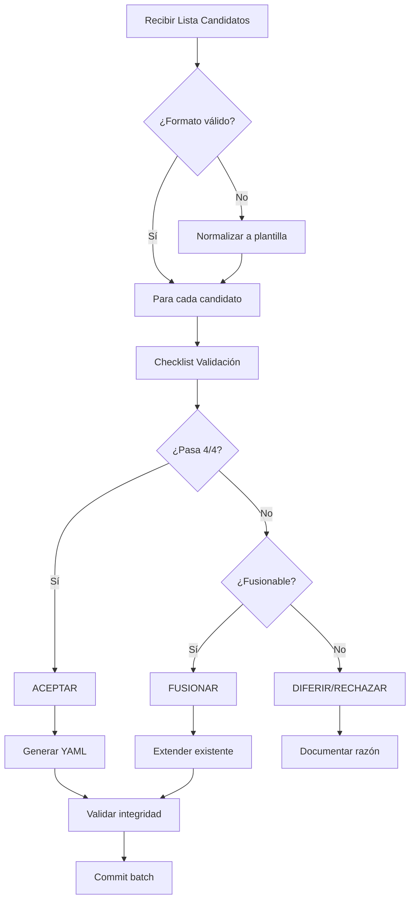

# Protocolo de Ingesta de Candidatos a Entidades

## Quick Stats (Estado Actual)

| Dominio          | Entidades | Densidad        |
| ---------------- | --------- | --------------- |
| D-FIN            | 30        | ██████████ Alta |
| D-DIG            | 18        | ██████ Media    |
| D-ORG            | 16        | █████ Media     |
| D-SAL            | 15        | █████ Media     |
| D-CONV           | 14        | ████ Media      |
| D-EJE            | 13        | ████ Media      |
| D-LOC            | 11        | ███ Media       |
| D-GOV            | 10        | ███ Media       |
| D-SYS            | 7         | ██ Baja         |
| D-SEG/GEO        | 2 c/u     | █ Sparse        |
| D-PLAN/NORM/DATA | 1 c/u     | ▪ Minimal       |

**Total: 141 entidades en 14 dominios**

---

## Checklist de Validación Categórica

Para cada candidato evaluar:

### 1. Identidad (¿Es entidad distinta?)
- [ ] No duplica entidad existente
- [ ] No es atributo JSON de otra entidad
- [ ] Tiene PK natural o requiere UUID

### 2. Morfismos (¿Se conecta al grafo?)
- [ ] Define ≥1 FK a entidad existente
- [ ] O será referenciada por otras entidades
- [ ] No crea isla semántica

### 3. Dominio (¿Dónde pertenece?)
| Patrón                  | Dominio |
| ----------------------- | ------- |
| Financiero/Presupuesto  | D-FIN   |
| Digital/Documental      | D-DIG   |
| Organizacional/RRHH     | D-ORG   |
| Ejecución/Obra          | D-EJE   |
| Territorial/Geográfico  | D-LOC   |
| Gobernanza/CORE         | D-GOV   |
| Monitoreo/Alertas       | D-SAL   |
| Participativo           | D-CONV  |
| Seguridad TI            | D-SEG   |
| Abstracto/Cross-cutting | D-SYS   |

### 4. Categoría
- `Master`: Entidad principal con ciclo de vida
- `Reference`: Catálogo/lookup casi-estático
- `Transaction`: Evento/movimiento con timestamp

### 5. Tensiones a Explorar
- ¿Entidad o Evento? → Si tiene `fecha_*` prominente, considerar Transaction
- ¿Nuevo o Extensión? → Si <5 atributos nuevos, extender entidad existente
- ¿Concreto o Abstracto? → Si hay variantes, crear superclase + subtipos

---

## Plantilla de Candidato

```yaml
# CANDIDATO: [Nombre]
# Origen: [Sistema/Documento fuente]
# Estado: PENDIENTE | EN_REVISION | APROBADO | RECHAZADO

propuesta:
  id: ENT-[DOM]-[NOMBRE]
  name: "[Nombre descriptivo]"
  domain: D-[DOM]
  category: Master|Reference|Transaction
  justificacion: |
    [Por qué es necesaria esta entidad]
  
  atributos_propuestos:
    - name: id_*
      type: UUID
      key: true
    - name: [atributo]
      type: [tipo]
      fk: [ENT-*]  # si aplica

  conexiones:
    entrantes: [entidades que referenciarán esta]
    salientes: [entidades que esta referencia]

validacion:
  identidad: [ ] # No duplica
  morfismos: [ ] # Conecta al grafo
  dominio: [ ]   # Ubicación correcta
  categoria: [ ] # Clasificación correcta
  
decision: PENDIENTE
notas: ""
```

---

## Reglas de Decisión

| Situación                                 | Decisión     | Acción                                   |
| ----------------------------------------- | ------------ | ---------------------------------------- |
| Candidato único, conectado, bien definido | **ACEPTAR**  | Crear `ent-[dom]-[name].yml`             |
| Candidato duplica parcialmente existente  | **FUSIONAR** | Extender entidad existente con atributos |
| Candidato sin conexiones claras           | **DIFERIR**  | Solicitar más contexto                   |
| Candidato es atributo JSON de otra        | **RECHAZAR** | Agregar como campo JSON                  |
| Candidato abstracto con variantes         | **DERIVAR**  | Crear superclase + subtipos              |

---

## Flujo de Procesamiento Batch



---

## Uso

Cuando lleguen candidatos:
1. Listarlos en formato de plantilla
2. Ejecutar checklist por cada uno
3. Clasificar según reglas de decisión
4. Procesar batch de ACEPTADOS
5. Documentar DIFERIDOS/RECHAZADOS

*Protocolo v1.0 — Arquitecto-GORE*
